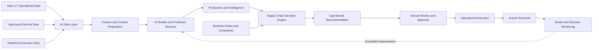
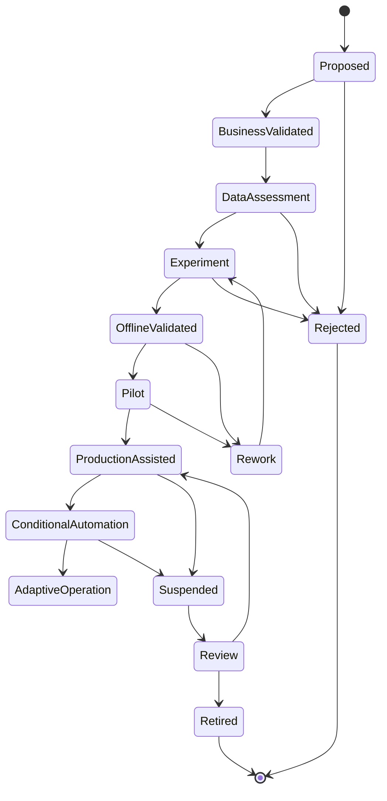
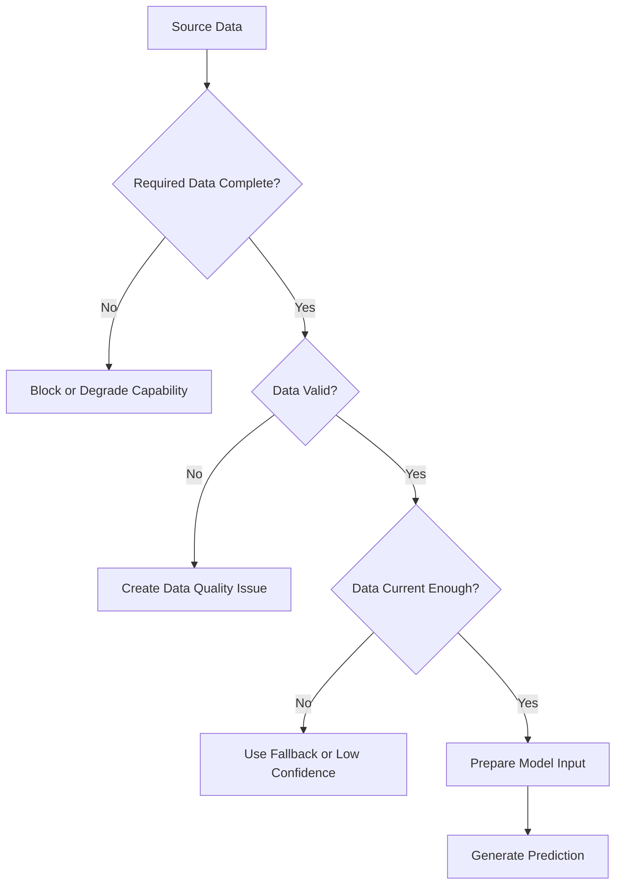
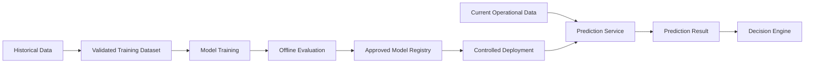
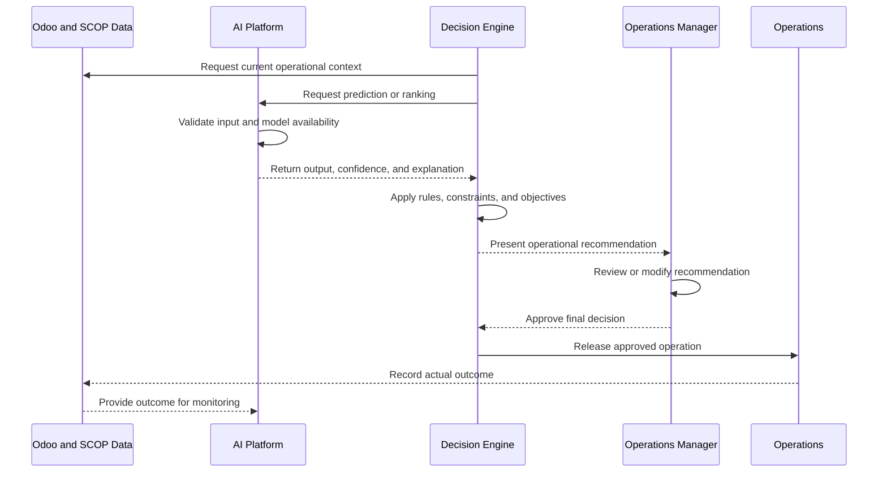
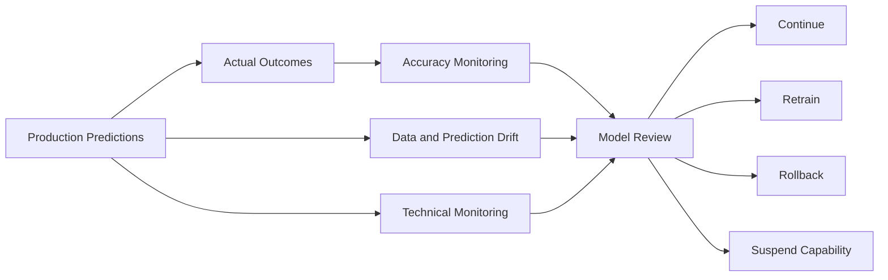
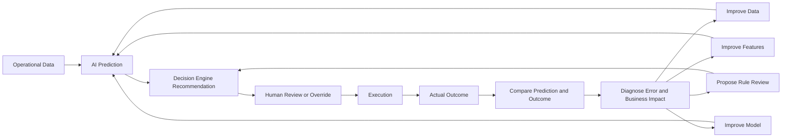

import DocumentInfo from '@site/src/components/DocumentInfo';

# AI Platform Overview

<DocumentInfo
  category="AI Platform"
  audience={['Executive', 'Business', 'Operations', 'Product', 'Technical', 'Data']}
  status="Approved"
  version="1.0"
  owner="AI Platform Team"
  updated="July 2026"
  readingTime="14 min"
/>

## Purpose

The SCOP AI Platform provides predictive, optimization-support, explanation, and learning capabilities that improve supply chain decisions.

It supports the Supply Chain Decision Engine by producing intelligence such as:

- Estimated travel time
- Estimated service duration
- Warehouse readiness predictions
- Demand and capacity forecasts
- Operational delay risk
- Delivery failure risk
- Vehicle suitability indicators
- Recommendation confidence
- Anomaly detection
- Decision explanations
- Performance feedback

The AI Platform does not independently own business decisions.

The Supply Chain Decision Engine remains responsible for applying approved business rules, enforcing mandatory constraints, evaluating operational alternatives, and managing human approval.

## AI Platform Objectives

The AI Platform is designed to:

- Improve the quality of operational predictions.
- Improve daily planning and resource utilization.
- Support more accurate arrival and completion estimates.
- Identify operational risks before they become failures.
- Help compare feasible operational alternatives.
- Provide understandable evidence supporting recommendations.
- Learn from differences between planned and actual outcomes.
- Support controlled progression toward trusted automation.
- Preserve business accountability and human oversight.
- Maintain traceability of models, inputs, predictions, and outcomes.
- Prevent uncontrolled or unexplained model behavior from directly affecting operations.

## Platform Principles

### Business Value Before AI

Every AI capability must address a defined business or operational need.

A model should not be introduced only because data or technology is available.

Each capability must identify:

- Business purpose
- Intended user
- Decision supported
- Expected operational benefit
- Required data
- Risk level
- Owner
- Success measures

### Decision Support, Not Decision Ownership

The AI Platform provides intelligence used by the Decision Engine.

It may predict, rank, detect, estimate, or recommend supporting values, but it does not independently approve or release operational decisions.

### Human-in-the-Loop Control

Important operational recommendations initially require authorized human review.

Users must be able to:

- Understand the recommendation
- Review relevant inputs
- See important uncertainty
- Modify the operational plan
- Reject unsuitable recommendations
- Record reasons for overrides
- Escalate exceptional cases

### Explainability

AI-supported decisions must provide explanations appropriate to the business audience.

The platform should explain:

- What was predicted or recommended
- Which factors influenced the result
- What uncertainty exists
- Which limitations apply
- How the output affects the operational decision

### Traceability

The platform must retain sufficient information to trace:

- Model or rule version
- Input data references
- Prediction timestamp
- Prediction result
- Confidence or uncertainty
- Decision consuming the prediction
- Human review or override
- Actual operational outcome

### Safety Before Automation

AI must not silently bypass:

- Business rules
- Legal requirements
- Ownership rules
- Vehicle capacity
- Product compatibility
- Required qualifications
- Mandatory time windows
- Human approval requirements
- Security and access controls

### Measurable Improvement

Every AI capability must have measurable performance criteria.

A capability should not progress toward automation unless its accuracy, reliability, business value, and risk are understood.

## AI Platform Role in SCOP

The AI Platform operates as an intelligence layer supporting the Decision Engine and operational applications.



The AI Platform supports decisions but does not replace the Decision Engine's governance responsibilities.

## AI Platform and Decision Engine

The AI Platform and Decision Engine have distinct responsibilities.

| Capability | AI Platform | Decision Engine |
| --- | --- | --- |
| Predictions | Produces estimates, forecasts, and risk indicators | Uses predictions as decision inputs |
| Business rules | May identify patterns for future review | Applies approved business rules |
| Hard constraints | Does not override mandatory constraints | Enforces mandatory constraints |
| Optimization support | Provides estimates, rankings, or optimization techniques | Evaluates alternatives within approved controls |
| Recommendations | Provides intelligence supporting recommendations | Produces controlled business recommendations |
| Explanation | Explains model outputs and influential factors | Explains the complete business decision |
| Approval | Does not approve operational release | Manages authorized review and approval |
| Execution | Does not directly release high-impact operations | Connects approved decisions to execution |
| Monitoring | Measures model performance and drift | Measures decision and operational outcomes |
| Governance | Governs models, datasets, and predictions | Governs business decisions, rules, and approvals |

## AI Capability Domains

The initial AI Platform may support several capability domains.

### Travel and Arrival Intelligence

Capabilities may include:

- Travel-time estimation
- Estimated time of arrival
- Expected delay probability
- Route-duration estimation
- Waiting-time estimation
- Stop-service-duration estimation

These predictions may use:

- Origin and destination
- Route
- Date and time
- Day of week
- Historical travel duration
- Stop type
- Customer or warehouse characteristics
- Vehicle type
- Number of stops
- Seasonal patterns
- Approved traffic or external data where available

### Warehouse Intelligence

Capabilities may include:

- Picking completion estimation
- Staging readiness estimation
- Loading-duration estimation
- Warehouse delay risk
- Cross-dock readiness prediction
- Workload forecasting

These predictions may support planning by identifying whether a shipment is likely to be ready before the planned vehicle departure.

### Demand Intelligence

Capabilities may include:

- Product demand forecasting
- Branch demand forecasting
- Customer demand forecasting
- Short-term shipment-volume forecasting
- Expected delivery-day workload
- Seasonal demand analysis

Demand forecasts may support procurement, inventory allocation, warehouse preparation, and fleet-capacity planning.

### Capacity Intelligence

Capabilities may include:

- Required vehicle-capacity forecasting
- Vehicle shortage risk
- Driver shortage risk
- Warehouse workload prediction
- Expected trip count
- Expected weight, volume, pallet, or unit demand

### Operational Risk Intelligence

Capabilities may include:

- Late-delivery risk
- Failed-stop risk
- Warehouse-delay risk
- Vehicle-assignment risk
- Time-window violation risk
- Incomplete-data risk
- Unusual execution pattern detection

Risk indicators should support early intervention rather than function as unexplained rejection mechanisms.

### Recommendation Intelligence

Capabilities may include:

- Vehicle suitability ranking
- Shipment consolidation suitability
- Warehouse-selection support
- Cross-dock opportunity identification
- Route or stop-sequence ranking
- Exception-resolution suggestions

Mandatory business rules and hard constraints remain controlled by the Decision Engine.

### Explanation Intelligence

Capabilities may include:

- Feature-level contribution summaries
- Comparison of important alternatives
- Explanation of uncertainty
- Identification of data-quality limitations
- Business-language summaries of recommendation factors

Generated explanations must remain grounded in actual model inputs and decision results.

## Initial AI Use Cases

The initial AI roadmap should prioritize use cases that provide operational value without requiring autonomous control.

| Use Case | Business Purpose | Initial Output |
| --- | --- | --- |
| Travel-Time Estimation | Improve trip schedules and arrival planning | Estimated duration |
| ETA Prediction | Improve customer and operations visibility | Estimated arrival time |
| Service-Duration Estimation | Improve stop sequencing and trip duration | Estimated service time |
| Warehouse Readiness Prediction | Reduce vehicle waiting and departure delays | Readiness time and risk |
| Delay-Risk Prediction | Identify trips or stops likely to be late | Risk level and factors |
| Vehicle Suitability Support | Improve assignment quality | Ranked feasible vehicles |
| Consolidation Support | Identify beneficial shipment combinations | Compatibility or benefit score |
| Demand Forecasting | Support procurement, inventory, and capacity planning | Forecast quantity |
| Capacity Forecasting | Identify expected fleet or warehouse shortages | Expected capacity requirement |
| Anomaly Detection | Identify unusual operational records or outcomes | Alert and supporting context |

## Capability Lifecycle

Every AI capability should progress through controlled stages.



Progression between stages requires evidence appropriate to the capability's operational risk.

## Capability Definition

Each AI capability should have a documented definition containing:

| Element | Description |
| --- | --- |
| Capability ID | Unique identifier |
| Name | Business-readable capability name |
| Business Purpose | Operational problem addressed |
| Decision Supported | Decision using the output |
| Owner | Accountable business or product owner |
| Technical Owner | Team responsible for implementation |
| Inputs | Required data |
| Output | Prediction, ranking, classification, or explanation |
| Users | Roles consuming the output |
| Risk Level | Operational impact classification |
| Approval Model | Required human review |
| Success Measures | Business and technical measures |
| Limitations | Known restrictions |
| Fallback | Safe behavior when unavailable |
| Status | Proposed, pilot, production, suspended, or retired |
| Version | Current approved capability version |

Example capability identifiers:

```text
AI-ETA-001
AI-WHS-001
AI-DMD-001
AI-RSK-001
AI-CAP-001
AI-EXP-001
```

## AI Data Sources

The AI Platform may consume data from approved sources.

### Odoo Operational Data

Potential Odoo data includes:

- Purchase orders
- Customer orders
- Warehouse receipts
- Delivery orders
- Internal transfers
- Stock movements
- Product master data
- Customer and supplier records
- Customer branches
- Warehouse definitions
- Vehicle records
- Driver records
- Route records
- Trip records
- Planned and actual stop times
- Planned and actual quantities
- Returns
- Exceptions
- Decision approvals and overrides

### SCOP Extension Data

Potential SCOP-specific data includes:

- Shipment definitions
- Load composition
- Trip stop sequences
- Vehicle-capacity calculations
- Planning recommendations
- Constraint results
- Decision explanations
- Recommendation confidence
- Override reasons
- Operational KPIs

### External Data

Approved external data may include:

- Geographic coordinates
- Mapping and distance data
- Traffic information
- Weather information
- Public holidays
- Road restrictions

External data must have defined ownership, licensing, reliability, update frequency, and fallback behavior.

## Data Quality Requirements

AI output quality depends on operational data quality.

The platform should validate:

- Completeness
- Validity
- Consistency
- Timeliness
- Uniqueness
- Ownership
- Historical continuity
- Correct timestamps
- Correct units of measurement
- Stable business definitions



The AI Platform must not convert incomplete data into apparently precise predictions without exposing the limitation.

## Training and Serving Separation

Where machine learning models are used, training and operational prediction should be separated.



Training activities must not directly alter production operational decisions without controlled evaluation and deployment.

## Model Registry

A controlled model registry should record:

- Model identifier
- Model version
- Capability
- Training dataset reference
- Training date
- Algorithm or model type
- Feature definition version
- Evaluation metrics
- Approval status
- Deployment status
- Deployment date
- Responsible owner
- Known limitations
- Replacement or retirement status

Only approved model versions should be available for production decision support.

## Feature Management

Features are prepared input values used by predictive models.

Examples include:

- Historical average travel time
- Planned departure hour
- Day of week
- Number of planned stops
- Warehouse workload
- Vehicle type
- Customer service duration history
- Product handling category
- Distance
- Recent delay rate
- Inventory readiness status

Feature definitions must be:

- Version-controlled
- Reproducible
- Documented
- Consistent between training and prediction
- Traceable to approved data sources
- Protected from inappropriate sensitive information

## Prediction Record

Every operational prediction should create or reference a traceable Prediction Record.

A Prediction Record should include:

| Element | Description |
| --- | --- |
| Prediction ID | Unique identifier |
| Capability | AI capability producing the output |
| Model Version | Model used |
| Input References | Operational records used as context |
| Feature Version | Feature definition version |
| Prediction Time | When the result was generated |
| Output | Estimated value, class, score, or ranking |
| Confidence | Reliability or uncertainty indicator |
| Explanation | Important contributing factors |
| Validity Period | Time during which the prediction remains applicable |
| Consumer | Decision or process using the result |
| Outcome | Actual result when known |

## Prediction Validity

Predictions must not be treated as permanently valid.

A prediction may become invalid when:

- Source data changes
- Inventory availability changes
- Warehouse readiness changes
- Vehicle or driver assignment changes
- Route or stop sequence changes
- The prediction becomes too old
- External operating conditions change
- A related trip is replanned
- The model version is withdrawn

The platform should define validity periods and recalculation triggers for each capability.

## Confidence and Uncertainty

AI outputs should include uncertainty where operationally relevant.

Confidence may be influenced by:

- Data completeness
- Data freshness
- Historical sample size
- Similarity to known operating conditions
- Stability of the model
- Prediction range
- Recent model performance
- Availability of external data

Possible confidence levels may include:

- High
- Medium
- Low
- Not Available

A confidence level must not be presented as a guarantee.

Low-confidence output should identify the main source of uncertainty and may require additional human attention.

## Explainability

Explainability must operate at two levels.

### Model-Level Explanation

Model-level explanation describes how a model generally behaves.

It may include:

- Intended purpose
- Main input categories
- Training-data period
- Evaluation metrics
- Known limitations
- Conditions where performance is weaker
- Prohibited uses

### Prediction-Level Explanation

Prediction-level explanation describes why a specific output was generated.

It may include:

- Important contributing factors
- Comparison with normal historical behavior
- Relevant data-quality warnings
- Confidence
- Alternative interpretation where applicable

Example:

```text
The predicted warehouse readiness time is 09:35.
The main contributing factors are the current picking backlog, the historical
loading duration for this warehouse, the number of lines in the assigned load,
and two incomplete receipt operations.
Confidence is Medium because the current staging status has not been updated
during the last 45 minutes.
```

Explanations must not claim certainty that the model does not provide.

## Human Oversight

Human oversight requirements depend on the capability's impact.

### Low-Impact Intelligence

Examples:

- Informational forecast
- Non-blocking warning
- Operational trend
- Suggested investigation

These outputs may require no individual approval but must remain traceable.

### Medium-Impact Intelligence

Examples:

- Vehicle ranking
- Shipment-consolidation suggestion
- Warehouse-readiness prediction
- Delay-risk indication

These outputs should be reviewed as part of the operational recommendation.

### High-Impact Intelligence

Examples:

- Automatically releasing a trip
- Automatically changing customer commitments
- Automatically cancelling demand
- Automatically overriding a mandatory operational policy

These actions require stronger governance and are outside the initial autonomous scope.

## AI-Assisted Decision Flow



## Safe Fallback

Every AI capability must define safe fallback behavior.

Fallback options may include:

- Use a configured standard value
- Use a historical average
- Use a deterministic business rule
- Use a conservative estimate
- Require manual input
- Return no prediction
- Reduce recommendation confidence
- Block only the AI-dependent feature
- Continue with manual planning
- Escalate a critical data or model issue

The unavailability of an AI model must not necessarily make the entire operational platform unavailable.

## Failure Handling

AI failure scenarios may include:

- Model service unavailable
- Invalid input
- Missing features
- Stale data
- Unsupported operating scenario
- Prediction timeout
- Model version unavailable
- Output outside permitted range
- Monitoring threshold exceeded

The platform must:

1. Detect the failure.
2. Record the failure.
3. Apply the approved fallback.
4. Notify the appropriate operational or technical owner.
5. Prevent unsafe automated actions.
6. Preserve existing approved operational commitments where possible.

## Model Evaluation

Model evaluation should include technical and business measures.

### Technical Measures

Depending on the capability, measures may include:

- Mean absolute error
- Root mean squared error
- Classification precision
- Classification recall
- Area under the curve
- Calibration
- Ranking quality
- Prediction coverage
- Response time
- Service availability

### Business Measures

Business measures may include:

- Improved time-window compliance
- Reduced vehicle waiting
- Reduced warehouse delay
- Improved planning accuracy
- Reduced manual adjustments
- Improved capacity utilization
- Reduced failed stops
- Reduced operating cost
- Improved recommendation acceptance
- Earlier identification of operational risk

A technically accurate model may still be unsuitable if it does not improve the supported business process.

## Offline Evaluation

Before production use, the model should be tested using historical or controlled validation data.

Offline evaluation should verify:

- Accuracy
- Stability
- Bias across relevant business segments
- Performance under common operating conditions
- Performance under difficult conditions
- Comparison with existing rules or baselines
- Data leakage risk
- Reproducibility
- Known limitations

Offline success does not automatically justify production automation.

## Pilot Validation

A pilot introduces the capability into a limited operational environment.

A pilot should define:

- Users
- Business area
- Warehouses or customers
- Operating period
- Model version
- Decision types supported
- Human approval requirements
- Success criteria
- Failure criteria
- Rollback procedure

Pilot outputs should initially operate as recommendations or informational intelligence.

## Production Monitoring

Production monitoring should cover:

- Prediction volume
- Prediction availability
- Response time
- Errors
- Missing-input rate
- Fallback rate
- Confidence distribution
- Prediction accuracy when outcomes become available
- Drift
- Segment performance
- User acceptance
- Override rate
- Business impact



## Drift Monitoring

Drift occurs when current operating data or relationships differ from those used during model development.

The platform should monitor:

- Input-data drift
- Feature drift
- Prediction drift
- Performance drift
- Operational-process changes
- Customer or warehouse mix changes
- Seasonal changes
- New products, locations, or vehicle types

Drift does not always mean the model has failed, but it requires investigation when approved thresholds are exceeded.

## Model Retraining

Retraining may be triggered by:

- Scheduled review
- Sufficient new outcome data
- Performance degradation
- Significant drift
- Business-process change
- New operating regions
- New vehicle or warehouse profiles
- Approved feature improvements
- Correction of historical data issues

Retraining must produce a new model version.

It must not silently replace the currently approved production version.

## Deployment and Rollback

Model deployment should support:

- Versioned release
- Approval
- Limited rollout
- Monitoring
- Comparison with the previous version
- Controlled rollback
- Capability suspension

Rollback may be required when:

- Accuracy declines
- Unexpected behavior appears
- Business outcomes deteriorate
- Data problems are discovered
- Explanations become unreliable
- Fallback rates increase
- Operational users report material issues

## Model Governance

### Ownership

Every capability and model must have defined business and technical owners.

### Approval

Production use requires appropriate validation and approval.

### Versioning

Models, features, datasets, and evaluation results must be versioned.

### Traceability

Operational predictions must be traceable to the model and data context used.

### Controlled Access

Only authorized systems and users may access sensitive model or operational information.

### Documentation

Capabilities, limitations, evaluations, deployments, and changes must be documented.

### Monitoring

Production behavior and business impact must be monitored.

### Retirement

Models no longer suitable for use must be retired safely while preserving historical traceability.

## Data Governance

AI data governance must address:

- Data ownership
- Approved use
- Data minimization
- Retention
- Access control
- Data quality
- Sensitive information
- Historical correction
- Lineage
- External data licensing
- Dataset versioning

Operational data should not be used for unrelated purposes without approved governance.

## Security Principles

The AI Platform must follow SCOP security controls.

Security requirements include:

- Authentication
- Authorization
- Least-privilege access
- Secure service communication
- Protected credentials
- Audit logging
- Environment separation
- Restricted model deployment
- Protected datasets
- Monitoring of unauthorized access
- Controlled external integrations

AI capabilities must not provide a path around Odoo or SCOP permissions.

## Responsible AI Principles

SCOP AI capabilities should be:

- Purpose-limited
- Explainable
- Traceable
- Governed
- Measurable
- Secure
- Reliable
- Subject to human oversight
- Tested for inappropriate bias where relevant
- Safe when data or models fail

The platform should avoid presenting probabilistic outputs as objective facts.

## Bias and Segment Evaluation

Where relevant, model performance should be evaluated across operational segments such as:

- Warehouse
- Customer
- Branch
- Geographic area
- Product category
- Vehicle type
- Route type
- Time of day
- Day of week
- Demand priority

Differences in performance should be investigated to determine whether they result from:

- Data quality
- Insufficient historical examples
- Operational differences
- Model limitations
- Inappropriate feature behavior

## AI Automation Levels

AI-supported operations may progress through controlled levels.

| Level | Description |
| --- | --- |
| Level 0 — No AI | Operations use manual values and deterministic processes |
| Level 1 — Informational | AI provides forecasts, warnings, or risk indicators |
| Level 2 — Assisted | AI outputs support recommendations reviewed by users |
| Level 3 — Conditional Automation | Approved low-risk outputs may trigger controlled actions |
| Level 4 — Adaptive Operations | Selected capabilities adapt using measured outcomes within approved governance |

The initial target is primarily Level 1 and Level 2.

Automation levels must be approved separately for each capability and decision type.

## Progression Criteria

A capability may progress toward greater automation only when:

- Its business purpose remains valid.
- Data quality is sufficient.
- Technical performance meets approved thresholds.
- Business outcomes show measurable value.
- Failure behavior is safe.
- Explanations are understandable.
- Monitoring is active.
- Rollback is available.
- Users trust the capability appropriately.
- Governance approval has been obtained.

## Learning From Overrides

Human modifications and rejections provide valuable operational feedback.

The platform should analyze:

- Which recommendations are frequently changed
- Which users or teams make changes
- Common override reasons
- Operational information missing from model inputs
- Segments with low acceptance
- Differences between approved and executed plans
- Whether overrides improved or harmed outcomes

Overrides must not automatically be treated as model errors.

They may reveal:

- Missing data
- Missing business rules
- Local operational knowledge
- Exceptional customer requirements
- Weak explanations
- Inappropriate objective weighting
- Genuine model limitations

## Feedback and Improvement Cycle



Changes to business rules must remain subject to business governance and must not be applied automatically by the AI Platform.

## AI Platform KPIs

Potential AI Platform KPIs include:

### Reliability

- Prediction-service availability
- Prediction response time
- Error rate
- Fallback rate
- Missing-input rate

### Model Performance

- Prediction error
- Classification precision and recall
- Calibration
- Ranking performance
- Drift rate
- Performance by business segment

### Operational Adoption

- Prediction usage rate
- Recommendation acceptance rate
- Override rate
- User feedback
- Explanation-view rate

### Business Impact

- Reduction in planning time
- Improvement in ETA accuracy
- Improvement in time-window compliance
- Reduction in warehouse waiting
- Improvement in capacity utilization
- Reduction in failed stops
- Reduction in operating cost
- Improvement in demand coverage

### Governance

- Percentage of models with complete documentation
- Percentage of predictions traceable to an approved model
- Monitoring coverage
- Overdue model reviews
- Unauthorized or unapproved model usage
- Rollback readiness

Exact formulas and targets will be defined in later KPI and model specifications.

## Integration With Odoo 17

Odoo 17 remains the operational system of record.

The AI Platform may read approved operational data through controlled integration services.

It may return:

- Predictions
- Rankings
- Risk indicators
- Confidence
- Explanations
- Data-quality warnings
- Model metadata references

The Decision Engine and Odoo workflows remain responsible for:

- Applying business rules
- Enforcing permissions
- Managing approvals
- Creating operational records
- Releasing trips
- Recording actual execution

AI outputs must not directly corrupt or bypass standard Odoo operational controls.

## Architecture Boundaries

This page defines:

- AI Platform purpose
- Platform principles
- Capability domains
- Data sources
- Model lifecycle
- Prediction traceability
- Explainability
- Monitoring
- Governance
- Human oversight
- Safe fallback
- Automation levels
- Integration responsibilities

It does not define:

- Individual model algorithms
- Detailed feature formulas
- Training source code
- API payloads
- Infrastructure deployment configuration
- Database schemas
- Detailed MLOps pipelines
- Cloud-vendor selection
- Complete cybersecurity controls
- Individual model acceptance thresholds

Those subjects will be documented in dedicated AI, development, security, and technical specifications.

## Summary

The SCOP AI Platform provides predictive and learning capabilities that improve supply chain planning and decision quality.

It supports the Supply Chain Decision Engine with estimates, forecasts, rankings, risk indicators, confidence, and explanations.

The platform is governed by business purpose, data quality, human oversight, traceability, safe fallback, measurable outcomes, and controlled deployment.

AI within SCOP is not an independent operational authority. It is a governed intelligence capability that helps authorized users and the Decision Engine make better, faster, and more measurable supply chain decisions.

## Related Pages

- [Documentation Design System](../getting-started/documentation-design-system.mdx)
- [Product Blueprint](../product/product-blueprint.mdx)
- [Business Architecture](../business/business-architecture.mdx)
- [Supply Chain Operating Model](../operations/supply-chain-operating-model.mdx)
- [Supply Chain Decision Engine](../decision-engine/supply-chain-decision-engine.mdx)
- AI Capability Catalogue
- Model Governance
- Prediction Monitoring
- Explainability Framework
- Data Quality Framework
