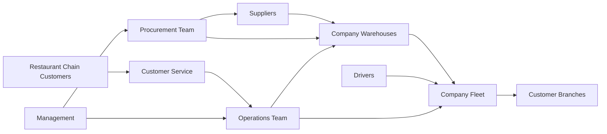
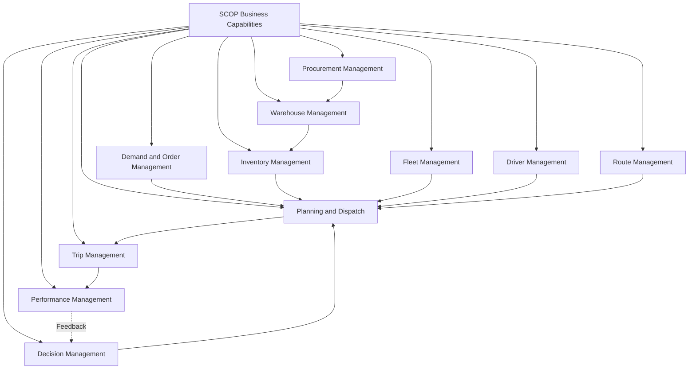
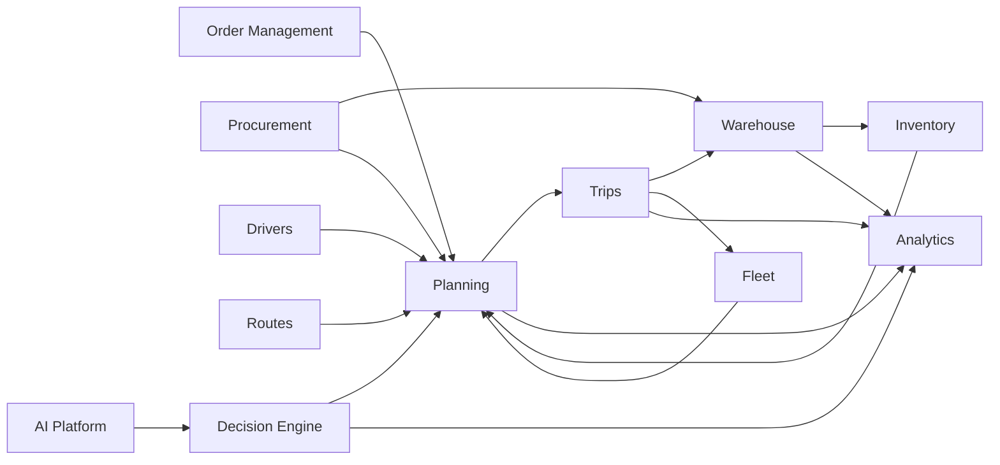
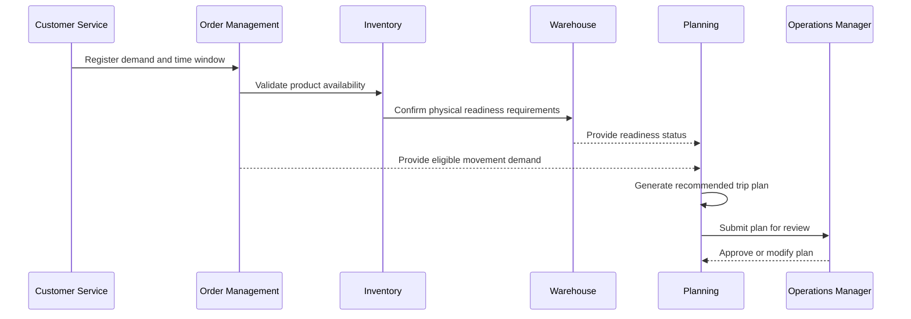
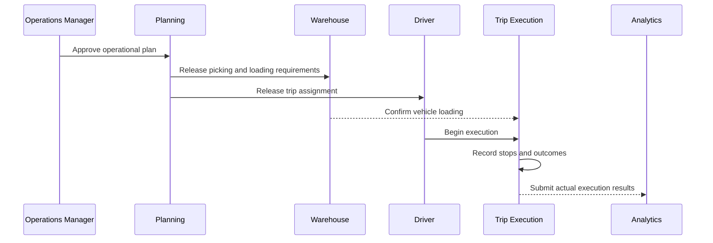
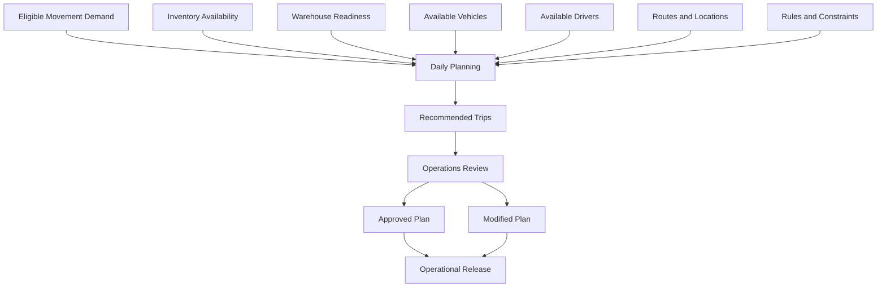
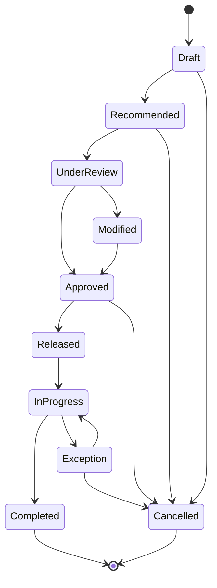

import DocumentInfo from '@site/src/components/DocumentInfo';

# Business Architecture

<DocumentInfo
  category="Business"
  audience={['Executive', 'Business', 'Operations', 'Product', 'Technical']}
  status="Approved"
  version="1.0"
  owner="Business Architecture Team"
  updated="July 2026"
  readingTime="12 min"
/>

## Purpose

The Business Architecture defines how the organization's procurement, warehousing, transportation, and distribution activities operate as one connected supply chain.

It translates the product vision into a structured business model that identifies:

- The value delivered by the platform
- The parties participating in supply chain operations
- The core business capabilities
- The relationships between business domains
- The primary operational information flows
- The responsibilities of business roles
- The decisions required to plan and execute operations
- The governance principles controlling those decisions

This page describes the business architecture independently from detailed screens, database models, APIs, or software implementation.

## Business Context

The organization provides procurement, storage, transportation, and distribution services for restaurant chains and other multi-branch food service businesses.

The company may:

- Purchase goods from approved suppliers
- Collect goods from suppliers
- Receive and store inventory in warehouses
- Transfer inventory between warehouses
- Consolidate products into vehicle loads
- Cross-dock products without long-term storage
- Collect goods from customer-controlled locations
- Redistribute goods to customer branches
- Deliver shipments to multiple customers during one trip
- Perform pickups and deliveries within the same trip
- Coordinate vehicles, drivers, routes, priorities, and time windows

These responsibilities create a multi-party operating environment in which supply, inventory, warehouse readiness, transportation capacity, and customer commitments must be coordinated continuously.

## Business Architecture Objectives

The SCOP Business Architecture is designed to achieve the following objectives:

| Objective | Description |
| --- | --- |
| Connected operations | Link procurement, inventory, warehouse, transportation, and customer activities |
| End-to-end visibility | Make operational demand, resources, constraints, and execution status visible |
| Coordinated planning | Produce one daily operational plan across shipments, warehouses, vehicles, drivers, and destinations |
| Resource optimization | Improve the use of vehicles, drivers, warehouse capacity, and transportation time |
| Service reliability | Respect customer priorities, delivery commitments, and time windows |
| Decision traceability | Record how operational decisions were generated, reviewed, changed, and approved |
| Operational scalability | Support growth in orders, branches, suppliers, warehouses, vehicles, and trips |
| Measurable performance | Measure service, cost, capacity, planning, and execution results |
| Controlled automation | Increase automation progressively without removing business accountability |

## Business Ecosystem

SCOP operates within a connected ecosystem of internal and external business participants.



### External Participants

| Participant | Role |
| --- | --- |
| Supplier | Provides products and supports collection or delivery arrangements |
| Customer | Contracts the company to procure, store, manage, or distribute products |
| Customer Branch | Receives products or acts as a pickup or transfer location |
| External Service Provider | May provide approved supporting services in future integrations |

### Internal Participants

| Participant | Role |
| --- | --- |
| Procurement Team | Coordinates sourcing, supplier orders, and inbound requirements |
| Warehouse Team | Receives, stores, picks, stages, loads, transfers, and processes returns |
| Operations Team | Plans and coordinates routes, trips, vehicles, drivers, and shipment execution |
| Drivers | Execute assigned transportation activities |
| Customer Service Team | Coordinates customer orders, priorities, commitments, and exceptions |
| Finance Team | Monitors costs, charges, and financially relevant operational records |
| Management | Reviews performance, policies, risks, and operational outcomes |
| System Administration | Maintains access, configuration, master data, and governance controls |

## Business Value Chain

SCOP supports a business value chain beginning with demand or supply requirements and ending with confirmed delivery and measured performance.

```mermaid
flowchart LR
    Demand[Customer or Internal Demand]
    Procurement[Procurement and Sourcing]
    Inbound[Inbound Collection or Receipt]
    Warehouse[Warehouse Processing]
    Planning[Operational Planning]
    Transport[Trip Execution]
    Delivery[Delivery or Transfer Completion]
    Measurement[Performance Measurement]
    Demand --> Procurement
    Procurement --> Inbound
    Inbound --> Warehouse
    Warehouse --> Planning
    Planning --> Transport
    Transport --> Delivery
    Delivery --> Measurement
    Measurement -. Improvement Feedback .-> Planning
```



The value chain must support variations where:

- Products already exist in company inventory
- The company collects directly from suppliers
- Suppliers deliver to company warehouses
- Products pass through a cross-dock operation
- Products originate from a customer or customer-owned location
- Products move between warehouses
- A trip contains both pickup and delivery activities
- Multiple customer shipments share one vehicle

## Core Business Capabilities

A business capability describes what the organization must be able to perform, independently from the software used to perform it.

### Procurement Management

The organization must be able to:

- Maintain approved supplier information
- Create and manage procurement requirements
- Coordinate supplier orders
- Define expected product availability
- Schedule or record supplier collections
- Link inbound products to warehouse and distribution requirements
- Monitor procurement exceptions and delays

### Order and Demand Management

The organization must be able to:

- Receive customer and internal movement requirements
- Identify the requesting customer and destination branch
- Define required products, quantities, priorities, and dates
- Capture delivery time windows
- Capture pickup requirements
- Distinguish customer delivery, warehouse transfer, return, and collection demand
- Track demand from creation through completion

### Warehouse Management

The organization must be able to:

- Receive goods
- Inspect and validate receipts
- Store inventory
- Track stock locations
- Pick and stage products
- Load vehicles
- Process returns
- Transfer goods between warehouses
- Support cross-dock operations
- Confirm warehouse readiness for planned trips

### Inventory Management

The organization must be able to:

- Identify available and reserved quantities
- Track product ownership
- Track physical inventory location
- Distinguish company inventory from customer-owned inventory
- Identify inventory allocated to shipments or trips
- Monitor stock movements
- Validate availability before planning
- Support independent operational inventory flows where required

### Fleet Management

The organization must be able to:

- Maintain company-owned vehicle records
- Define capacity constraints
- Track vehicle availability
- Track operational status
- Assign vehicles to trips
- Prevent conflicting assignments
- Monitor vehicle utilization
- Maintain relevant vehicle operating information

### Driver Management

The organization must be able to:

- Maintain driver records
- Grant appropriate system access
- Track availability
- Assign drivers to trips
- Prevent overlapping assignments
- Record participation in trip execution
- Support future mobile application access

### Route Management

The organization must be able to:

- Define reusable operational routes
- Associate locations with route structures
- Define expected sequence or geographic coverage
- Estimate route duration and distance where available
- Maintain active and inactive routes
- Reuse routes across multiple trips

### Trip Management

The organization must be able to:

- Create dated operational trips
- Assign vehicles and drivers
- Assign shipments and loads
- Define pickup and delivery stops
- Sequence trip stops
- Establish planned departure and arrival times
- Track trip status
- Record actual execution results
- Manage trip exceptions and returns

### Planning and Dispatch

The organization must be able to:

- Identify demand requiring execution
- Validate inventory and warehouse readiness
- Group compatible shipments
- Evaluate routes and trip alternatives
- Evaluate available vehicles and drivers
- Respect capacity and time-window constraints
- Generate a daily recommended plan
- Allow authorized review and modification
- Approve and release trips
- Monitor plan execution

### Decision Management

The organization must be able to:

- Define decision rules
- Identify operational constraints
- Generate recommendations
- Explain recommendation factors
- Compare alternatives
- Record approvals and overrides
- Measure recommendation outcomes
- Improve future decision quality

### Performance Management

The organization must be able to:

- Measure fleet utilization
- Monitor service performance
- Analyze planning efficiency
- Monitor warehouse coordination
- Measure shipment consolidation
- Evaluate trip efficiency
- Analyze cost
- Monitor decision acceptance and overrides
- Identify operational exceptions and trends

## Capability Map



## Business Domains

SCOP groups related capabilities into business domains.

| Domain | Primary Responsibility |
| --- | --- |
| Procurement | Supplier sourcing and inbound product requirements |
| Order Management | Customer, branch, and internal movement demand |
| Warehouse | Physical receipt, storage, handling, staging, loading, and transfers |
| Inventory | Product availability, ownership, allocation, and movement |
| Fleet | Vehicle records, capacity, status, availability, and utilization |
| Drivers | Driver availability, assignment, access, and execution participation |
| Routes | Reusable paths and location structures |
| Trips | Dated transportation execution, stops, resources, and statuses |
| Planning | Daily coordination of demand, shipments, vehicles, drivers, and trips |
| Decision Engine | Rules, constraints, recommendations, explanations, and approvals |
| AI Platform | Prediction, optimization assistance, learning, and recommendation support |
| Analytics | KPIs, reports, trends, costs, service, and decision outcomes |
| Administration | Users, permissions, configuration, master data, and governance |

Domains are connected business areas rather than isolated applications.

No domain should duplicate ownership of the same authoritative business information.

## Domain Relationships



## Core Business Objects

The following objects form the shared business language of SCOP.

| Business Object | Definition |
| --- | --- |
| Supplier | An external party providing products |
| Customer | An organization receiving procurement or distribution services |
| Branch | A customer location that may receive or provide products |
| Warehouse | A managed facility used for receipt, storage, staging, transfer, or cross-docking |
| Product | An item purchased, stored, transferred, collected, or delivered |
| Order | A business requirement for products or movement |
| Shipment | A logical group of goods requiring transportation |
| Load | The physical cargo assigned to a vehicle |
| Vehicle | A company-owned transportation resource |
| Driver | A person authorized to execute vehicle trips |
| Route | A predefined reusable operational path |
| Trip | A scheduled execution containing resources, shipments, stops, and planned times |
| Stop | A location visited during a trip |
| Pickup | An activity that loads products at a stop |
| Delivery | An activity that unloads products at a stop |
| Time Window | The permitted or committed time range for servicing a location |
| Decision | A selected operational action among available alternatives |
| Recommendation | A proposed decision generated by rules, optimization, or AI |
| Exception | A condition requiring attention because planned execution cannot continue normally |

These terms must be used consistently across business, functional, technical, and AI documentation.

## Primary Information Flows

### Demand to Planning



### Approved Plan to Execution



## Planning Model

Daily operational planning brings together demand, supply, inventory, warehouse readiness, fleet resources, driver availability, and customer commitments.

The planning process must evaluate:

- Required pickup and delivery dates
- Customer time windows
- Product and shipment availability
- Warehouse readiness
- Vehicle capacity
- Vehicle availability
- Driver availability
- Route compatibility
- Stop sequence
- Travel duration
- Service duration
- Shipment compatibility
- Cross-dock opportunities
- Inter-warehouse requirements
- Order priority
- Operational cost
- Expected service performance

The output is a recommended daily plan containing proposed trips and resource assignments.



## Decision Model

SCOP treats major operational actions as controlled decisions.

A decision should include:

| Element | Description |
| --- | --- |
| Decision Type | The category of decision being made |
| Context | The operational situation requiring the decision |
| Inputs | The data used during evaluation |
| Alternatives | The available feasible options |
| Rules | Mandatory business policies |
| Constraints | Capacity, time, resource, or operational limitations |
| Objectives | Outcomes being optimized or protected |
| Recommendation | The proposed selected alternative |
| Explanation | The main reasons behind the recommendation |
| Approval | The authorized review result |
| Final Decision | The action released for execution |
| Outcome | The measured execution result |

Examples of managed decisions include:

- Which vehicle should execute a trip?
- Which shipments should be consolidated?
- Which warehouse should fulfil a requirement?
- Should products be stored or cross-docked?
- Which route should be used?
- What sequence should the stops follow?
- Which demand should receive priority?
- Should a proposed plan be approved, changed, or rejected?

## Human Approval Model

In the initial product stages, the Operations Manager retains control over daily operational release.

The manager must be able to:

1. Review the complete proposed plan.
2. Inspect trips, stops, loads, vehicles, and drivers.
3. Review important constraints and recommendation explanations.
4. Modify assignments or sequences where authorized.
5. Approve the plan.
6. Reject or return incomplete plans.
7. Release approved trips for execution.

The system must record the difference between the generated recommendation and the approved operational plan.

:::info

AI recommendations support operational judgment. They do not remove the responsibility of authorized business users.

:::

## Roles and Responsibilities

| Role | Key Responsibilities |
| --- | --- |
| Operations Manager | Reviews and approves plans, manages exceptions, and monitors execution |
| Planner or Dispatcher | Prepares demand, reviews recommendations, modifies plans, and coordinates resources |
| Procurement User | Manages supplier requirements and inbound availability |
| Warehouse User | Executes receipts, picking, staging, loading, transfers, cross-docking, and returns |
| Driver | Executes assigned trips and records operational progress |
| Customer Service User | Maintains customer demand, priorities, branches, and commitments |
| Finance User | Reviews financially relevant operational information and costs |
| Management User | Reviews KPIs, risks, service, cost, and capacity performance |
| System Administrator | Maintains configuration, users, permissions, and master data |

Detailed access rights will be defined in later functional specifications.

## Business Governance Principles

### Clear Ownership

Every business object, process, decision, and KPI must have an accountable owner.

### Approved Terminology

Business concepts must use the approved terminology defined by the Knowledge Hub.

### Controlled Configuration

Operational rules and configuration changes must be authorized and traceable.

### Separation of Responsibilities

No single role should perform incompatible actions without appropriate approval controls.

Examples may include:

- Creating and approving the same high-risk operational plan
- Modifying master data and independently approving affected transactions
- Changing decision rules without authorized review

### Decision Traceability

Operational recommendations, approvals, overrides, and outcomes must be retained.

### Data Quality Responsibility

Business users are responsible for maintaining complete and reliable operational data within their areas of ownership.

### Exception Management

The platform must identify situations where normal business rules or plans cannot be followed.

Exceptions must be visible, assigned, investigated, and resolved.

### Continuous Improvement

Execution results must be used to improve rules, processes, planning quality, and future recommendations.

## Business Rules Foundation

Detailed business rules will be documented separately, but all rules should follow these principles:

- Each rule must have a unique identifier.
- Each rule must have a clear business purpose.
- The responsible owner must be identified.
- The trigger and expected behavior must be defined.
- Exceptions must be documented.
- The rule must be testable.
- Changes must be version-controlled.
- Decision Engine rules must be explainable.

Example identifier format:

```text
BR-PLN-001
BR-FLT-001
BR-WHS-001
BR-TRP-001
```

## Operational States

Operational objects should use controlled status models.

A typical Trip lifecycle may include:



Each transition must have:

- An authorized actor
- A defined trigger
- Validation requirements
- A recorded timestamp
- Traceable operational context

Detailed lifecycle definitions will be documented in the relevant domain specifications.

## Performance Framework

Business performance must be measured across several dimensions.

| Dimension | Purpose |
| --- | --- |
| Service | Measure pickup, delivery, and time-window performance |
| Capacity | Measure vehicle and load utilization |
| Productivity | Measure output relative to operational effort |
| Cost | Measure transportation, warehouse, and fulfilment cost |
| Reliability | Measure successful execution and exception rates |
| Planning | Measure planning time, changes, and recommendation acceptance |
| Warehouse | Measure readiness, staging, loading, and transfer performance |
| Decision Quality | Measure approvals, overrides, confidence, and outcomes |
| Data Quality | Measure completeness, validity, and timeliness of operational data |

The Business Architecture defines the measurement areas. Detailed KPI formulas and targets will be documented later.

## Architecture Boundaries

This Business Architecture defines:

- The business operating context
- Core business capabilities
- Business domains
- Business participants
- Information flows
- Decision responsibilities
- Governance principles
- Performance dimensions

It does not define:

- Detailed user interface designs
- Database tables
- API payloads
- Source code architecture
- Detailed Odoo configuration
- Complete functional requirements
- Detailed optimization algorithms
- Security implementation controls

Those subjects will be addressed in later documentation sections.

## Summary

SCOP connects procurement, orders, warehouses, inventory, vehicles, drivers, routes, trips, planning, decisions, and analytics within one business architecture.

The architecture is designed around coordinated operations rather than isolated departmental processes.

Its central operating principle is that reliable data, defined rules, operational constraints, human accountability, and measurable outcomes must guide every important supply chain decision.

## Related Pages

- [Documentation Design System](../getting-started/documentation-design-system.mdx)
- [Product Blueprint](../product/product-blueprint.mdx)
- Operating Model
- Business Domains
- Business Rules
- Supply Chain Decision Engine
