import DocumentInfo from '@site/src/components/DocumentInfo';

# Business Domains

<DocumentInfo
  category="Business"
  audience={['Executive', 'Business', 'Operations', 'Product', 'Technical', 'Data']}
  status="Approved"
  version="1.0"
  owner="Business Architecture Team"
  updated="July 2026"
  readingTime="15 min"
/>

## Purpose

Business Domains divide SCOP into coherent areas of business responsibility.

Each domain represents a related group of:

- Business capabilities
- Operational processes
- Business objects
- Rules
- Decisions
- Roles
- Information
- Performance measures

The domain model helps SCOP avoid duplicated responsibility and unclear ownership.

It provides a common structure for:

- Business analysis
- Product planning
- Odoo configuration
- Odoo module design
- Decision Engine design
- AI capability planning
- Integration design
- Data governance
- Security
- Reporting
- Documentation ownership

A business domain is not automatically equivalent to an Odoo module, software service, department, or user interface.

One business domain may be supported by several technical components, while one technical component may support several business domains.

## Domain Design Principles

### Clear Responsibility

Every domain must have a defined business responsibility.

A domain should be able to answer:

- What business outcomes does it own?
- Which business objects does it manage?
- Which rules does it enforce?
- Which decisions originate within it?
- Which roles operate it?
- Which information does it provide to other domains?

### Explicit Boundaries

A domain boundary defines what belongs inside the domain and what belongs elsewhere.

Boundaries reduce:

- Duplicate business logic
- Conflicting status definitions
- Unclear data ownership
- Uncontrolled integrations
- Repeated configuration
- Inconsistent reporting

### One Authoritative Owner

An important business object or definition should have one authoritative owner.

Other domains may consume, reference, enrich, or act upon the object, but they should not create conflicting authoritative versions.

### Controlled Collaboration

Domains collaborate through defined business flows and information exchanges.

A domain must not depend on hidden assumptions about another domain.

### Business Before Technology

Domain boundaries should follow business responsibility before software structure.

The final Odoo and service architecture should support the domain model rather than define it arbitrarily.

### Traceability Across Domains

Cross-domain processes must remain traceable from:

- Original demand
- Inventory and ownership
- Procurement or order source
- Shipment
- Load
- Trip
- Decision
- Approval
- Execution
- Exception
- Outcome

## SCOP Domain Landscape

SCOP is organized into the following principal business domains:

1. Party and Location Management
2. Product and Handling Management
3. Procurement and Inbound Supply
4. Customer and Demand Management
5. Inventory and Ownership Management
6. Warehouse Operations
7. Shipment and Load Management
8. Fleet and Driver Management
9. Route and Trip Management
10. Planning and Decision Management
11. Execution and Exception Management
12. Performance and Analytics
13. Platform Governance and Administration

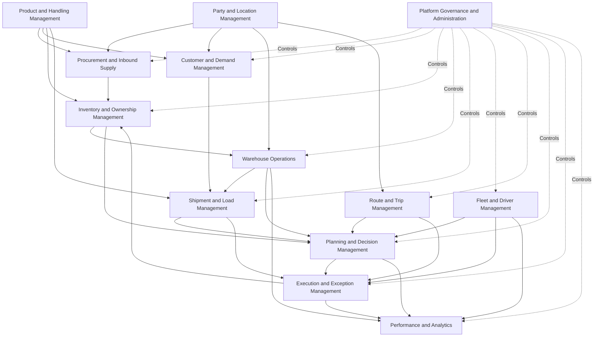

## Domain Classification

The domains may be classified according to their role within SCOP.

| Classification | Domains |
| --- | --- |
| Foundational Domains | Party and Location; Product and Handling |
| Supply and Demand Domains | Procurement and Inbound Supply; Customer and Demand |
| Physical Control Domains | Inventory and Ownership; Warehouse Operations |
| Transportation Domains | Shipment and Load; Fleet and Driver; Route and Trip |
| Decision and Execution Domains | Planning and Decision; Execution and Exception |
| Management Domains | Performance and Analytics; Platform Governance and Administration |

Foundational domains provide shared definitions.

Operational domains manage physical and transactional activity.

Decision domains coordinate alternatives and approvals.

Management domains provide control, measurement, configuration, and governance.

## Domain Interaction Model

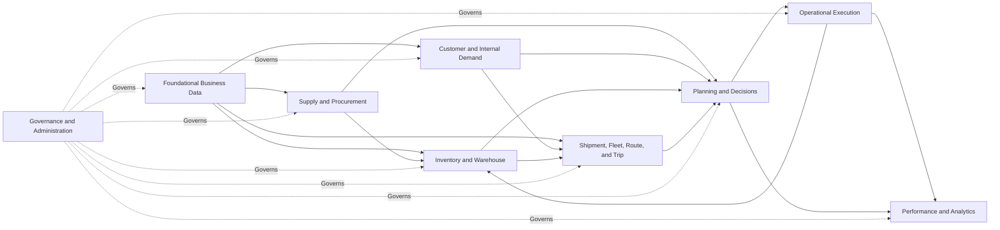

## 1. Party and Location Management

### Purpose

The Party and Location Management domain maintains the organizations, people, branches, facilities, and operational locations involved in SCOP processes.

### Responsibilities

The domain is responsible for:

- Customers
- Customer branches
- Suppliers
- Supplier locations
- Company entities
- Warehouses
- Cross-dock facilities
- Pickup locations
- Delivery locations
- Return locations
- Contact information
- Geographic coordinates
- Operating hours
- Access instructions
- Location restrictions
- Service time windows

### Principal Business Objects

| Object | Description |
| --- | --- |
| Party | A customer, supplier, company entity, or another approved organization |
| Contact | A person associated with a party or location |
| Operational Location | A physical place used for receipt, pickup, storage, delivery, transfer, or return |
| Customer Branch | A customer-operated destination or collection point |
| Supplier Location | A supplier-operated source or service location |
| Warehouse | A company-managed or authorized storage and processing facility |
| Location Time Window | A permitted or preferred service period |
| Location Constraint | An access, vehicle, timing, or handling restriction |

### Domain Rules

Examples include:

- Every operational location must be associated with an authorized party or company entity.
- A location used for planning must have sufficient operational information.
- Mandatory service windows must be identified explicitly.
- Inactive parties and locations must not be assigned to new operational demand.
- Geographic information must distinguish verified coordinates from unverified information.

### Domain Outputs

The domain provides:

- Valid source and destination locations
- Party ownership and responsibility
- Operating hours
- Service windows
- Access restrictions
- Contact and communication references
- Geographic planning information

### Odoo Role

Odoo partner, contact, warehouse, and location capabilities may provide the operational foundation.

SCOP extensions may add logistics-specific branch, time-window, access, and geographic attributes.

## 2. Product and Handling Management

### Purpose

The Product and Handling Management domain defines the goods managed or transported through SCOP and the conditions required for safe and correct handling.

### Responsibilities

The domain is responsible for:

- Product definitions
- Product categories
- Units of measure
- Weight
- Volume
- Dimensions
- Packaging
- Pallet information
- Temperature requirements
- Fragility
- Hazard or restriction classifications where applicable
- Compatibility groups
- Loading requirements
- Storage requirements
- Shelf-life and expiration attributes
- Quality-control requirements

### Principal Business Objects

| Object | Description |
| --- | --- |
| Product | A physical item procured, stored, transferred, delivered, or returned |
| Product Category | A controlled grouping of related products |
| Unit of Measure | The approved quantity measurement |
| Package | A transport or storage packaging unit |
| Handling Profile | Conditions required to store or transport the product |
| Compatibility Group | A classification controlling which products may share space |
| Capacity Profile | Weight, volume, pallet, crate, or unit characteristics |
| Shelf-Life Profile | Expiration and remaining-life requirements |

### Domain Rules

Examples include:

- Every transported product must have an approved unit of measure.
- Products used in capacity planning must have sufficient weight or volume information.
- Mandatory temperature and handling requirements must not be ignored.
- Incompatible products must not be consolidated in the same load or compartment.
- Product ownership must not be inferred from the product definition itself.
- Product master data changes affecting planning require controlled validation.

### Domain Outputs

The domain provides:

- Product identity
- Capacity requirements
- Storage conditions
- Transportation conditions
- Compatibility rules
- Packaging requirements
- Quality and shelf-life requirements

### Odoo Role

Odoo product and unit-of-measure records provide the primary product foundation.

SCOP may extend these records with logistics, compatibility, and handling attributes.

## 3. Procurement and Inbound Supply

### Purpose

The Procurement and Inbound Supply domain manages external supply requirements and the expected arrival of goods from suppliers.

### Responsibilities

The domain is responsible for:

- Purchase requirements
- Requests for quotation where applicable
- Purchase orders
- Supplier commitments
- Expected receipt dates
- Supplier collection requirements
- Inbound shipment expectations
- Supplier delivery status
- Partial supply
- Procurement exceptions
- Supplier-related returns
- Inbound availability information

### Principal Business Objects

| Object | Description |
| --- | --- |
| Purchase Requirement | A business need requiring external supply |
| Purchase Order | An approved commitment to a supplier |
| Supplier Commitment | The expected product, quantity, date, and location |
| Inbound Requirement | A requirement to receive or collect goods |
| Supplier Collection | A movement requiring company-arranged pickup |
| Inbound Exception | A delay, shortage, rejection, or other supply issue |

### Domain Lifecycle

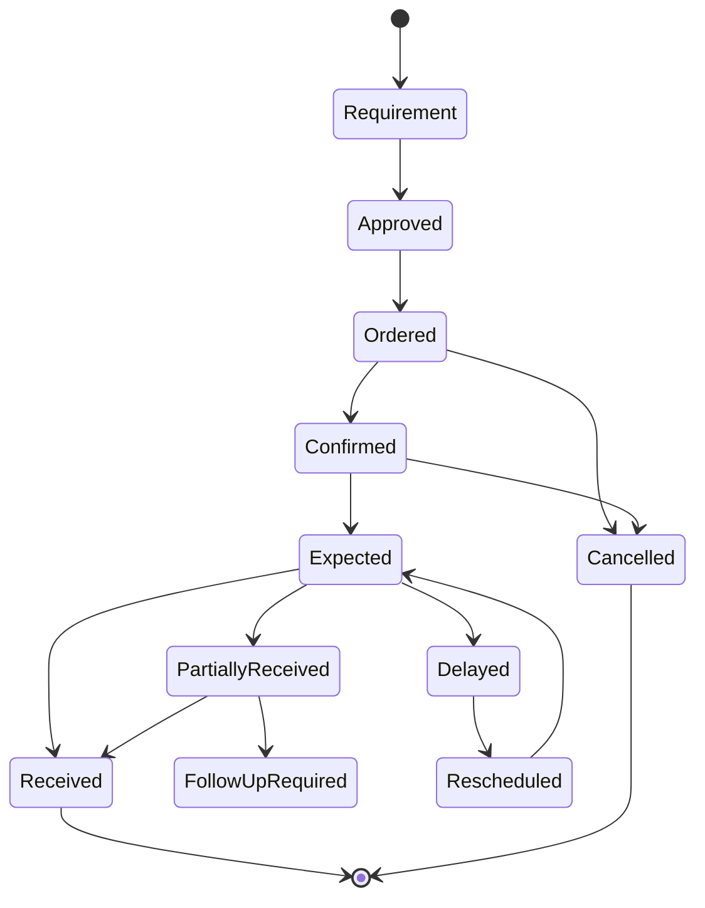

### Domain Rules

Examples include:

- An inbound requirement must identify the supplier, products, quantities, and destination.
- Supplier collection demand must enter transportation planning.
- Expected supply must not be treated as physically available inventory.
- Partial receipt must preserve the outstanding quantity.
- Supplier delays affecting an approved plan must create or trigger an operational exception.

### Domain Outputs

The domain provides:

- Expected inbound inventory
- Supplier pickup demand
- Expected receipt dates
- Supplier commitment status
- Procurement priorities
- Inbound risks and exceptions

### Odoo Role

Odoo Purchase and Inventory applications provide the principal purchase-order and receipt foundation.

SCOP uses these records as inputs to inventory, warehouse, and planning decisions.

## 4. Customer and Demand Management

### Purpose

The Customer and Demand Management domain captures customer, branch, internal, and exceptional requirements that may require inventory allocation or physical movement.

### Responsibilities

The domain is responsible for:

- Customer orders
- Branch replenishment
- Customer pickup requests
- Internal demand
- Required delivery dates
- Customer time windows
- Demand priorities
- Service commitments
- Demand validation
- Demand eligibility
- Demand cancellation
- Customer-requested changes
- Demand-related exceptions

### Principal Business Objects

| Object | Description |
| --- | --- |
| Customer Order | A customer requirement for products or services |
| Movement Demand | A requirement to move goods between locations |
| Branch Replenishment | Demand intended to replenish a customer branch |
| Internal Demand | A company-generated operational requirement |
| Service Commitment | A required date, time window, or service condition |
| Demand Priority | The relative operational importance of the requirement |

### Demand Sources

Demand may originate from:

- Customer order
- Customer branch request
- Internal replenishment
- Inter-warehouse requirement
- Supplier collection
- Return requirement
- Customer-owned inventory movement
- Management-authorized urgent request
- Corrective follow-up after failed execution

### Domain Rules

Examples include:

- Demand must have valid source and destination information.
- Product quantity and required date must be known before normal planning.
- Mandatory customer commitments must be identifiable.
- Priority must not silently override safety, legal, ownership, or capacity constraints.
- Cancelled demand must not remain eligible for planning.
- Changes after operational release require controlled impact assessment.

### Domain Outputs

The domain provides:

- Validated movement demand
- Customer commitments
- Priorities
- Time windows
- Service requirements
- Demand changes and cancellations
- Demand eligibility information

### Odoo Role

Odoo Sales or approved customer-order workflows may provide the commercial or operational order source.

SCOP may create normalized Movement Demand records to support cross-domain planning.

## 5. Inventory and Ownership Management

### Purpose

The Inventory and Ownership Management domain controls the quantity, availability, allocation, physical location, and ownership of products.

### Responsibilities

The domain is responsible for:

- On-hand inventory
- Available inventory
- Reserved inventory
- Forecasted inventory
- Inventory location
- Inventory ownership
- Lot and batch traceability
- Expiration
- Inventory allocation
- Inventory transfer
- Inventory adjustment
- Inventory reconciliation
- Inventory-related exceptions

### Physical Location and Ownership

Physical storage and legal or business ownership are distinct concepts.

Products stored in one warehouse may belong to:

- The operating company
- A customer
- A supplier under an approved arrangement
- Another authorized business party

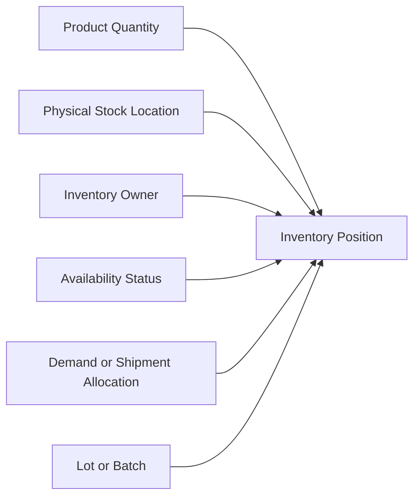

### Principal Business Objects

| Object | Description |
| --- | --- |
| Inventory Position | Product quantity at a location with defined status and ownership |
| Stock Movement | A controlled physical or logical inventory change |
| Reservation | Quantity allocated to a requirement |
| Ownership Record | The business party owning the inventory |
| Lot or Batch | A traceable product grouping |
| Inventory Adjustment | An authorized correction to recorded stock |
| Allocation | A relationship between inventory and demand or shipment |

### Domain Rules

Examples include:

- Physical location must not be treated as proof of ownership.
- Customer-owned inventory must remain logically separated.
- Reserved inventory must not be allocated to incompatible demand.
- Expected inbound supply must not be represented as current on-hand stock.
- Inventory adjustments require authorization and reason.
- Lot, expiration, and shelf-life constraints must be respected.
- Completed physical movement must update or trigger the appropriate stock movement.

### Domain Outputs

The domain provides:

- Current availability
- Ownership
- Reservation status
- Inventory source options
- Expected availability
- Lot and expiration status
- Allocation information
- Inventory risks

### Odoo Role

Odoo Inventory remains the operational system of record for stock quantities and movements.

SCOP extensions must preserve the integrity of standard stock operations.

## 6. Warehouse Operations

### Purpose

The Warehouse Operations domain manages receipt, storage, internal movement, picking, staging, loading, unloading, cross-docking, and warehouse-related returns.

### Responsibilities

The domain is responsible for:

- Receipts
- Putaway
- Internal transfers
- Picking
- Packing
- Staging
- Inspection
- Loading
- Unloading
- Cross-dock processing
- Warehouse readiness
- Warehouse exceptions
- Returns processing
- Loading and service duration

### Principal Business Objects

| Object | Description |
| --- | --- |
| Receipt | An inbound warehouse operation |
| Picking Task | A requirement to collect products from storage |
| Staging Unit | Products prepared for a trip or outbound movement |
| Loading Task | A requirement to load products onto an assigned vehicle |
| Cross-Dock Movement | Inbound goods routed toward outbound execution |
| Warehouse Readiness | The operational readiness of products for movement |
| Warehouse Exception | A shortage, delay, damage, or processing issue |

### Warehouse Flow

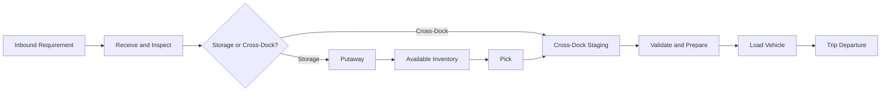

### Domain Rules

Examples include:

- Physical receipt must be validated before stock becomes normally available.
- Picking must reference an authorized demand, shipment, transfer, or warehouse requirement.
- Staged products must remain traceable to their owner and intended movement.
- Loading must not exceed the approved trip and vehicle limits.
- Warehouse readiness must reflect actual operational status.
- Cross-dock movements must retain inbound and outbound traceability.
- Shortage or damage must create an exception rather than silently changing planned quantities.

### Domain Outputs

The domain provides:

- Receipt status
- Inventory readiness
- Picking status
- Staging status
- Loading status
- Expected handling duration
- Cross-dock readiness
- Warehouse delays and exceptions

### Odoo Role

Odoo Inventory and Warehouse operations provide the operational transaction foundation.

SCOP may extend readiness, staging, trip linkage, cross-dock control, and loading visibility.

## 7. Shipment and Load Management

### Purpose

The Shipment and Load Management domain transforms demand and allocated products into transportable operational groupings.

### Shipment and Load Distinction

A Shipment represents goods requiring movement between defined operational locations.

A Load represents the products physically assigned to a vehicle or trip at a particular stage of execution.

A shipment is a transport requirement.

A load is the physical vehicle-content plan or result.

One shipment may be split across multiple loads.

One load may include multiple compatible shipments.

### Responsibilities

The domain is responsible for:

- Shipment creation
- Shipment splitting
- Shipment consolidation
- Product ownership within shipments
- Source and destination definition
- Required dates and time windows
- Shipment readiness
- Load formation
- Load composition
- Loading sequence
- Capacity contribution
- Shipment and load status
- Shipment-related exceptions

### Principal Business Objects

| Object | Description |
| --- | --- |
| Shipment | A logical transport requirement |
| Shipment Line | A product and quantity within a shipment |
| Load | Goods assigned physically to a vehicle or trip |
| Load Line | A product and quantity within a load |
| Consolidation Group | Compatible shipments evaluated or selected for consolidation |
| Shipment Constraint | A transport, handling, timing, or compatibility requirement |
| Shipment Allocation | The link between shipment demand and available inventory |

### Formation Flow

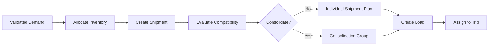

### Domain Rules

Examples include:

- A shipment must identify source, destination, products, ownership, and service requirements.
- Shipment consolidation must protect ownership and traceability.
- Capacity availability alone is not sufficient reason to consolidate shipments.
- A load must remain feasible across all capacity dimensions.
- Loading and unloading sequence must support the planned stop sequence.
- Actual loaded quantities must be distinguishable from planned quantities.

### Domain Outputs

The domain provides:

- Ready shipments
- Shipment constraints
- Consolidation candidates
- Proposed loads
- Capacity requirements
- Loading sequence
- Ownership and traceability
- Shipment exceptions

## 8. Fleet and Driver Management

### Purpose

The Fleet and Driver Management domain controls transportation resources and their eligibility for operational assignments.

### Responsibilities

The domain is responsible for:

- Vehicle master data
- Vehicle types
- Capacity profiles
- Compartments
- Temperature capability
- Vehicle availability
- Vehicle location
- Maintenance status
- Operational restrictions
- Driver records
- Driver qualifications
- Licence validity
- Driver availability
- Working-time restrictions
- Vehicle and driver assignments
- Resource conflicts

### Principal Business Objects

| Object | Description |
| --- | --- |
| Vehicle | A transport resource |
| Vehicle Type | A reusable capacity and configuration profile |
| Capacity Profile | Weight, volume, pallet, unit, or compartment limits |
| Vehicle Availability | The time and location in which a vehicle may be assigned |
| Driver | An authorized transport operator |
| Driver Qualification | A licence, authorization, or capability |
| Driver Availability | The time and location in which a driver may be assigned |
| Resource Assignment | The relationship between a resource and a trip |

### Eligibility Flow

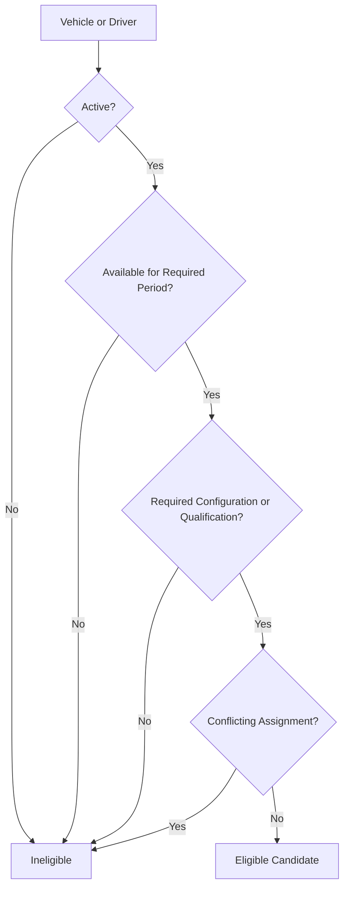

### Domain Rules

Examples include:

- Inactive resources must not receive new assignments.
- Vehicle and driver assignments must not overlap.
- Vehicle capacity must satisfy every mandatory dimension.
- Required vehicle documents and driver licences must remain valid.
- Maintenance or legal blocks make the resource unavailable.
- Driver working-time requirements must be respected.
- Expected departure location must be operationally feasible.

### Domain Outputs

The domain provides:

- Feasible vehicles
- Feasible drivers
- Capacity profiles
- Availability
- Resource location
- Restrictions
- Qualification status
- Resource conflicts
- Assignment information

### Odoo Role

Odoo Fleet and employee or user records may provide foundational information.

SCOP extensions may manage logistics capacity, driver qualification, availability, and trip assignment.

## 9. Route and Trip Management

### Purpose

The Route and Trip Management domain defines reusable transport paths and dated operational executions.

### Route and Trip Distinction

A Route is a reusable operational path or geographic structure.

A Trip is a dated execution with assigned resources, shipments, loads, stops, and planned or actual times.

### Responsibilities

The domain is responsible for:

- Route definitions
- Route stop templates
- Route restrictions
- Trip creation
- Trip stop creation
- Stop sequencing
- Pickup and delivery dependencies
- Planned arrival and departure
- Actual arrival and departure
- Trip statuses
- Trip execution references
- Trip completion
- Trip cancellation
- Trip history

### Principal Business Objects

| Object | Description |
| --- | --- |
| Route | A reusable path or stop structure |
| Route Stop Template | A reusable location within a route |
| Trip | A dated transportation execution |
| Trip Stop | An operational visit within a trip |
| Stop Activity | Pickup, delivery, transfer, return, or mixed activity |
| Trip Schedule | Planned departure, arrival, service, and completion times |
| Trip Assignment | Assigned vehicle, driver, shipment, and load |
| Trip Outcome | The actual completion result |

### Relationship Model

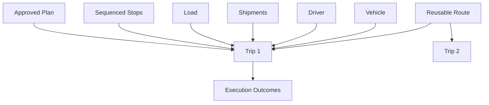

### Domain Rules

Examples include:

- Every released trip must have an authorized operational purpose.
- A trip must not be treated as completed until all stops have outcomes.
- Stop sequence must respect pickup and delivery dependencies.
- Dynamic vehicle capacity must remain feasible after every stop.
- Actual execution times must remain distinguishable from planned times.
- Cancelled or completed trips must preserve history.
- Route definitions must not be confused with specific dated trips.

### Domain Outputs

The domain provides:

- Routes
- Proposed and approved trips
- Stop sequences
- Planned schedules
- Resource assignments
- Actual execution progress
- Trip outcomes
- Trip exceptions

## 10. Planning and Decision Management

### Purpose

The Planning and Decision Management domain converts operational context into controlled recommendations, approvals, and released plans.

### Responsibilities

The domain is responsible for:

- Planning requests
- Planning horizon
- Demand eligibility
- Planning inputs
- Rules
- Constraints
- Objectives
- Alternative evaluation
- Recommendations
- Explanations
- Human review
- Plan modification
- Approval
- Rejection
- Operational release
- Replanning
- Decision outcomes
- Decision audit

### Principal Business Objects

| Object | Description |
| --- | --- |
| Planning Run | A controlled evaluation for a selected planning scope |
| Decision Object | A structured operational decision |
| Candidate Alternative | A feasible or infeasible action considered |
| Recommendation | The alternative proposed by the Decision Engine |
| Decision Explanation | The business reasons supporting the recommendation |
| Approval | The authorized acceptance of a decision |
| Override | An authorized change or rejection |
| Daily Plan | The coordinated set of approved trips and unplanned demand |

### Decision Flow

```mermaid
flowchart LR
    Context[Operational Context] --> Validate[Validate Inputs]
    Validate --> Rules[Apply Rules]
    Rules --> Constraints[Apply Constraints]
    Constraints --> Alternatives[Generate Feasible Alternatives]
    Alternatives --> Objectives[Evaluate Objectives]
    Objectives --> Recommend[Create Recommendation]
    Recommend --> Explain[Provide Explanation]
    Explain --> Review[Human Review]
    Review --> Approve[Approve or Modify]
    Approve --> Release[Operational Release]
    Release --> Outcome[Measured Outcome]
```

### Domain Rules

Examples include:

- Recommendations must not bypass mandatory constraints.
- A recommended plan requires authorized approval before normal release.
- Manual modifications must remain traceable.
- Unplanned demand must include a reason.
- Rule and objective changes require governance.
- Recommendation confidence must not be confused with operational feasibility.
- AI outputs remain supporting inputs rather than final business authority.

### Domain Outputs

The domain provides:

- Planning recommendations
- Feasible alternatives
- Approved daily plans
- Unplanned-demand reasons
- Explanations
- Constraint results
- Overrides
- Decision history
- Replanning decisions
- Outcome comparisons

### Decision Engine Role

The Supply Chain Decision Engine is the principal application capability supporting this domain.

It coordinates data from the operational domains and produces controlled recommendations.

## 11. Execution and Exception Management

### Purpose

The Execution and Exception Management domain records actual operational activity and controls deviations from approved plans.

### Responsibilities

The domain is responsible for:

- Operational release status
- Departure confirmation
- Stop arrival
- Service start
- Pickup confirmation
- Delivery confirmation
- Transfer confirmation
- Return confirmation
- Stop completion
- Trip completion
- Partial completion
- Failure
- Exceptions
- Resolution
- Rescheduling
- Follow-up demand
- Operational reconciliation

### Principal Business Objects

| Object | Description |
| --- | --- |
| Execution Event | A recorded operational action or status change |
| Stop Outcome | The actual result of a planned stop |
| Quantity Outcome | Delivered, collected, rejected, returned, or missing quantity |
| Operational Exception | A condition preventing normal execution |
| Resolution Action | The corrective response |
| Follow-Up Demand | New demand created to complete unresolved work |
| Execution Reconciliation | Comparison between planned and actual results |

### Exception Lifecycle

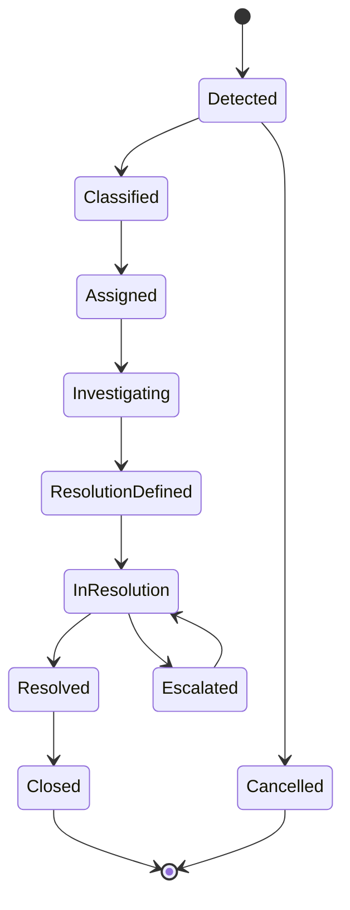

### Domain Rules

Examples include:

- Actual results must be recorded independently from planned results.
- Failed and partial outcomes require approved reasons.
- Every material exception must have an owner.
- Exception resolution must not erase the original event.
- Completed execution must release or update assigned resources appropriately.
- Follow-up demand must reference the original unresolved requirement.
- Replanning must preserve completed execution.

### Domain Outputs

The domain provides:

- Actual trip and stop status
- Actual quantities
- Delays
- Returns
- Failed or partial outcomes
- Exceptions
- Resolution status
- Follow-up requirements
- Reconciliation data

## 12. Performance and Analytics

### Purpose

The Performance and Analytics domain converts operational records into trusted measures, reports, insights, and management information.

### Responsibilities

The domain is responsible for:

- KPI definitions
- Operational reports
- Planning performance
- Warehouse performance
- Fleet performance
- Delivery performance
- Decision quality
- AI performance
- Cost and utilization analysis
- Trend analysis
- Exception analysis
- Data reconciliation
- Management dashboards

### Principal Business Objects

| Object | Description |
| --- | --- |
| KPI Definition | A governed performance measure |
| KPI Result | A calculated value for a period and scope |
| Operational Report | A structured business view |
| Analytical Dataset | Governed data prepared for analysis |
| Performance Target | An approved expected result |
| Variance | Difference between planned, expected, and actual performance |
| Insight | A supported interpretation of measured data |

### Measurement Flow

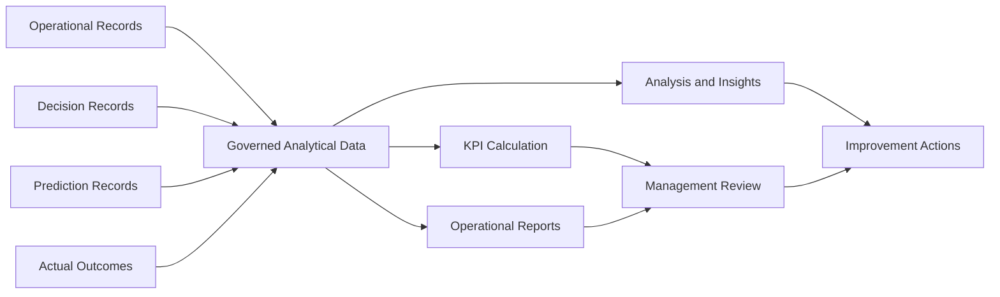

### Domain Rules

Examples include:

- Every KPI must have an owner and definition.
- Reports must identify their data source and refresh period.
- Planned and actual measures must not be mixed without clear labeling.
- Historical KPI definitions must remain traceable when formulas change.
- AI model accuracy must not be presented as business value without outcome evidence.
- Sensitive data must remain protected in reporting.

### Domain Outputs

The domain provides:

- Operational KPIs
- Management dashboards
- Decision-quality measures
- AI-performance measures
- Trends
- Variances
- Exception analysis
- Improvement evidence

## 13. Platform Governance and Administration

### Purpose

The Platform Governance and Administration domain controls configuration, authorization, rule ownership, platform access, auditing, and operational governance.

### Responsibilities

The domain is responsible for:

- Users
- Roles
- Permissions
- Approval authority
- Business-rule ownership
- Configuration ownership
- Master-data governance
- Security administration
- Audit review
- Change control
- Feature activation
- Environment-specific controls
- Documentation ownership
- Operational support ownership

### Principal Business Objects

| Object | Description |
| --- | --- |
| User | An authenticated platform user |
| Role | A defined responsibility and permission grouping |
| Permission | An authorized action or data scope |
| Approval Authority | The right to approve a controlled decision |
| Business Rule | A governed business policy |
| Configuration Item | A controlled platform or business setting |
| Audit Record | Evidence of a significant action or change |
| Governance Decision | An approved policy or configuration change |

### Domain Rules

Examples include:

- Permissions must follow least privilege.
- User-interface visibility alone must not be treated as authorization.
- High-impact rule changes require controlled approval.
- Production configuration changes must remain traceable.
- Sensitive duties should use appropriate separation of responsibilities.
- Secrets must not be stored in documentation or source code.
- Audit history must be protected from unauthorized alteration.

### Domain Outputs

The domain provides:

- Authorized users and roles
- Permission decisions
- Approval authority
- Controlled rules and configuration
- Audit evidence
- Governance status
- Change ownership

## Cross-Domain Business Objects

Some objects participate in several domains but must still have a clear authoritative owner.

| Business Object | Authoritative Domain | Important Consumers |
| --- | --- | --- |
| Party | Party and Location | Procurement, Demand, Warehouse, Route |
| Operational Location | Party and Location | Warehouse, Shipment, Route, Planning |
| Product | Product and Handling | Procurement, Demand, Inventory, Shipment |
| Purchase Order | Procurement and Inbound Supply | Inventory, Warehouse, Planning |
| Movement Demand | Customer and Demand | Shipment, Planning, Execution |
| Inventory Position | Inventory and Ownership | Warehouse, Shipment, Planning |
| Warehouse Readiness | Warehouse Operations | Planning and Decision |
| Shipment | Shipment and Load | Planning, Route and Trip, Execution |
| Load | Shipment and Load | Warehouse, Route and Trip, Execution |
| Vehicle | Fleet and Driver | Planning, Route and Trip, Execution |
| Driver | Fleet and Driver | Planning, Route and Trip, Execution |
| Route | Route and Trip | Planning and Decision |
| Trip | Route and Trip | Warehouse, Execution, Performance |
| Decision Object | Planning and Decision | Execution, Performance, Governance |
| Prediction Record | AI Platform | Planning and Decision, Performance |
| Operational Exception | Execution and Exception | Planning, Performance, Governance |
| KPI Definition | Performance and Analytics | Management, Operations, Governance |

## Core Cross-Domain Flow

The principal business flow crosses several domains.

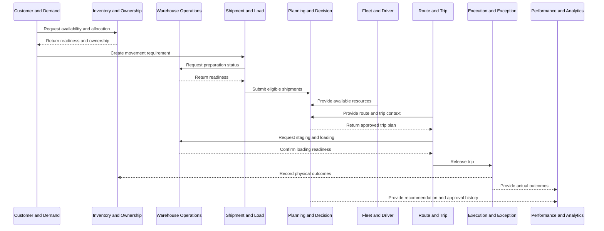

## Domain Dependencies

Dependencies should follow business direction and avoid circular ownership.

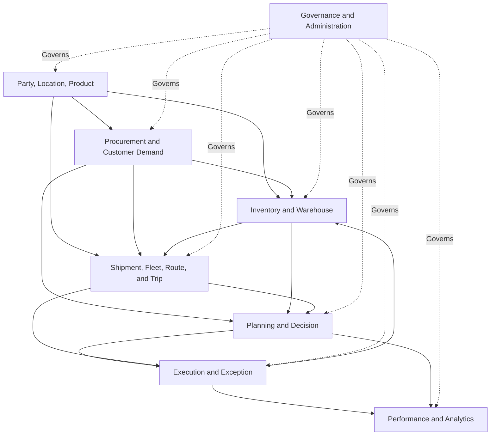

A process may send outcome information back to an earlier domain without transferring authoritative ownership.

For example, execution updates inventory, but the Execution domain does not become the authoritative inventory owner.

## Domain Responsibility Matrix

| Domain | Owns Master Data | Owns Operational Transactions | Produces Decisions | Produces Measurements |
| --- | --- | --- | --- | --- |
| Party and Location | Yes | Limited | No | Limited |
| Product and Handling | Yes | Limited | No | Limited |
| Procurement and Inbound Supply | Partial | Yes | Operational choices | Yes |
| Customer and Demand | Partial | Yes | Priority and service input | Yes |
| Inventory and Ownership | Partial | Yes | Availability input | Yes |
| Warehouse Operations | Partial | Yes | Readiness input | Yes |
| Shipment and Load | Partial | Yes | Consolidation input | Yes |
| Fleet and Driver | Yes | Yes | Eligibility input | Yes |
| Route and Trip | Partial | Yes | Route and sequence input | Yes |
| Planning and Decision | Limited | Yes | Yes | Yes |
| Execution and Exception | Limited | Yes | Corrective input | Yes |
| Performance and Analytics | No | Analytical records | Analytical insight | Yes |
| Governance and Administration | Governance data | Governance transactions | Governance decisions | Governance measures |

The matrix is conceptual.

Detailed ownership will be refined in later specifications.

## Domain and Odoo Mapping

The domain model must not be reduced to a one-to-one module mapping.

A preliminary relationship may include:

| Business Domain | Potential Odoo Foundation |
| --- | --- |
| Party and Location | Contacts, company, warehouse, stock locations |
| Product and Handling | Products, categories, units of measure |
| Procurement and Inbound Supply | Purchase |
| Customer and Demand | Sales or approved order workflows |
| Inventory and Ownership | Inventory and stock |
| Warehouse Operations | Inventory and warehouse operations |
| Shipment and Load | SCOP extensions linked to stock and delivery records |
| Fleet and Driver | Fleet, employees, users, SCOP extensions |
| Route and Trip | SCOP custom capabilities |
| Planning and Decision | SCOP Decision Engine and planning modules |
| Execution and Exception | SCOP trip, stop, warehouse, and exception modules |
| Performance and Analytics | Reporting, analytics, and governed datasets |
| Governance and Administration | Users, groups, access rules, configuration, audit extensions |

The final technical design must preserve standard Odoo behavior where appropriate.

## Domain and Decision Engine Relationship

The Decision Engine consumes governed information from operational domains.

It does not replace those domains.

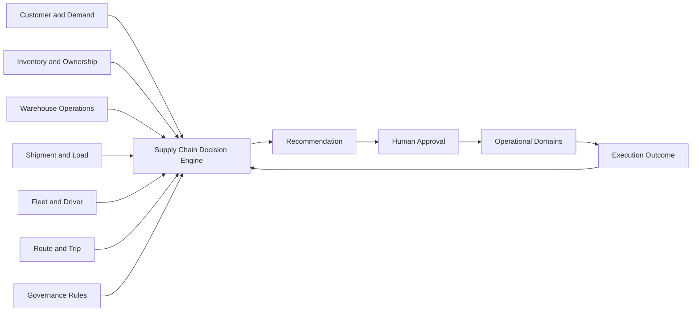

The Decision Engine:

- Consumes domain data
- Applies approved decision rules
- Enforces constraints
- Evaluates alternatives
- Produces recommendations
- Records explanations
- Supports approval
- Receives outcome information

It must not create conflicting authoritative master data.

## Domain and AI Platform Relationship

The AI Platform provides predictive and analytical intelligence to domains and the Decision Engine.

Potential examples include:

| Domain | AI Support |
| --- | --- |
| Procurement | Supply-delay risk and inbound forecasting |
| Customer and Demand | Demand forecasting |
| Inventory | Availability and shortage risk |
| Warehouse | Readiness and handling-duration prediction |
| Shipment and Load | Consolidation-support indicators |
| Fleet and Driver | Suitability and capacity-risk indicators |
| Route and Trip | ETA and duration prediction |
| Planning and Decision | Prediction, ranking, risk, and confidence |
| Execution and Exception | Anomaly and failure-risk detection |
| Performance and Analytics | Model and outcome evaluation |

AI output does not transfer business ownership from the operational domain.

## Domain Events

Domains should communicate significant business changes through controlled events or equivalent traceable mechanisms.

Examples include:

```text
DemandValidated
InventoryAllocated
InventoryShortageDetected
WarehouseReady
ShipmentCreated
LoadPrepared
VehicleBecameUnavailable
DriverBecameUnavailable
PlanRecommended
PlanApproved
TripReleased
TripDeparted
StopCompleted
DeliveryFailed
ReturnCreated
TripCompleted
ExceptionRaised
ExceptionResolved
OutcomeMeasured
```

A domain event represents something that occurred.

It should not be used as an uncontrolled replacement for authoritative operational records.

## Domain Event Principles

Domain events should be:

- Named in business language
- Traceable to a business object
- Timestamped
- Associated with the responsible source
- Versioned when used across integration boundaries
- Idempotent where repeated delivery is possible
- Protected according to data sensitivity
- Monitored when operationally significant

## Cross-Domain Validation

A cross-domain action may require validation from several domains.

For example, releasing a trip may require:

| Domain | Validation |
| --- | --- |
| Customer and Demand | Demand remains active and authorized |
| Inventory and Ownership | Required inventory is allocated |
| Warehouse Operations | Products are ready or conditionally ready |
| Shipment and Load | Load composition is valid |
| Fleet and Driver | Vehicle and driver remain eligible |
| Route and Trip | Stop sequence and schedule are valid |
| Planning and Decision | Plan is approved |
| Governance | User has release authority |

No single domain should silently claim that the entire cross-domain process is valid without the required confirmations.

## Cross-Domain Exception Ownership

An exception should be owned by the domain best able to resolve its cause.

| Exception | Primary Owner |
| --- | --- |
| Supplier delay | Procurement and Inbound Supply |
| Customer time-window change | Customer and Demand |
| Inventory shortage | Inventory and Ownership |
| Picking delay | Warehouse Operations |
| Invalid shipment composition | Shipment and Load |
| Vehicle breakdown | Fleet and Driver |
| Route restriction | Route and Trip |
| No feasible plan | Planning and Decision |
| Delivery rejection | Execution and Exception |
| Invalid KPI result | Performance and Analytics |
| Unauthorized configuration | Governance and Administration |

An exception may affect several domains while retaining one primary owner.

## Domain Governance

### Business Ownership

Every domain must have an accountable business owner.

### Product Ownership

Every major domain capability should have an identified product owner or responsible product role.

### Technical Ownership

Technical components supporting the domain must have defined engineering ownership.

### Data Ownership

Authoritative business objects and definitions must have identified data owners.

### Rule Ownership

Rules must have owners responsible for their purpose, approval, and review.

### Documentation Ownership

Domain documentation must identify an owner and remain synchronized with approved behavior.

## Domain Documentation Standard

Each future detailed domain page should define:

1. Purpose
2. Scope
3. Business outcomes
4. Roles
5. Capabilities
6. Business objects
7. Lifecycles
8. Business rules
9. Decisions
10. Inputs and outputs
11. Cross-domain interactions
12. Odoo relationship
13. Decision Engine relationship
14. AI relationship
15. Permissions
16. Exceptions
17. KPIs
18. Architecture boundaries
19. Related pages

Future detailed domain pages must not contradict this domain map without an approved architecture update.

## Domain Maturity

Domain capabilities may progress through maturity stages.

| Stage | Description |
| --- | --- |
| Defined | Scope, ownership, terminology, and processes are documented |
| Controlled | Rules, states, permissions, and exceptions are enforced |
| Integrated | Cross-domain flows and information exchanges are reliable |
| Measured | Performance and outcomes are consistently measured |
| Optimized | Decisions and processes are improved using trusted evidence |
| Adaptive | Approved capabilities adjust using controlled intelligence and feedback |

Different domains may operate at different maturity stages.

## Domain KPIs

Potential domain-governance measures include:

- Percentage of domains with approved owners
- Percentage of business objects with authoritative ownership
- Percentage of cross-domain flows documented
- Duplicate master-data rate
- Data-ownership conflicts
- Unowned business rules
- Cross-domain exception resolution time
- Percentage of domain pages current
- Number of conflicting status definitions
- Number of uncontrolled cross-domain integrations
- Percentage of domain KPIs with approved formulas

Exact targets will be defined through later governance work.

## Architecture Boundaries

This page defines:

- Principal business domains
- Domain responsibilities
- Domain boundaries
- Authoritative ownership
- Core business objects
- Cross-domain relationships
- Domain dependencies
- Odoo relationships
- Decision Engine relationships
- AI Platform relationships
- Domain governance

It does not define:

- Detailed Odoo models or fields
- Individual module architecture
- Database schemas
- API contracts
- Complete business-rule catalogues
- Individual user stories
- Screen designs
- Detailed workflows for every domain
- Complete KPI formulas
- Technical deployment architecture

Those subjects will be documented in dedicated business, operational, decision, AI, and development pages.

## Summary

SCOP is divided into coherent business domains covering foundational data, supply, demand, inventory, warehouses, transportation, planning, execution, analytics, and governance.

Each domain has a defined responsibility and authoritative ownership.

Domains collaborate through controlled business flows without creating conflicting versions of products, inventory, shipments, trips, decisions, or outcomes.

The domain model provides the bridge between Business Architecture and detailed operational, functional, and technical design.

Its central principle is that every important capability, object, rule, decision, and measure must have a clear home within the SCOP operating model.

## Related Pages

- [Documentation Design System](../getting-started/documentation-design-system.mdx)
- [Product Blueprint](../product/product-blueprint.mdx)
- [Business Architecture](./business-architecture.mdx)
- [Supply Chain Operating Model](../operations/supply-chain-operating-model.mdx)
- [Supply Chain Decision Engine](../decision-engine/supply-chain-decision-engine.mdx)
- [AI Platform Overview](../ai-platform/ai-platform-overview.mdx)
- [Development Overview](../development/development-overview.mdx)
- Business Rules
- Party and Location Domain
- Product and Handling Domain
- Procurement Domain
- Customer and Demand Domain
- Inventory Domain
- Warehouse Operations Domain
- Shipment and Load Domain
- Fleet and Driver Domain
- Route and Trip Domain
- Planning and Decision Domain
- Execution and Exception Domain
- Performance and Analytics Domain
