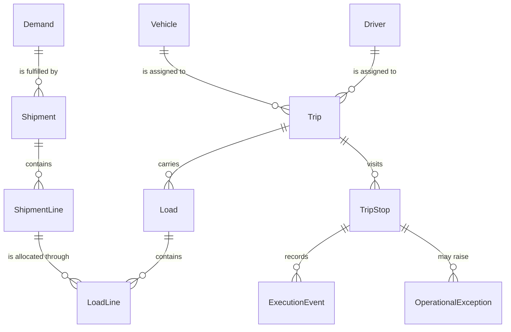
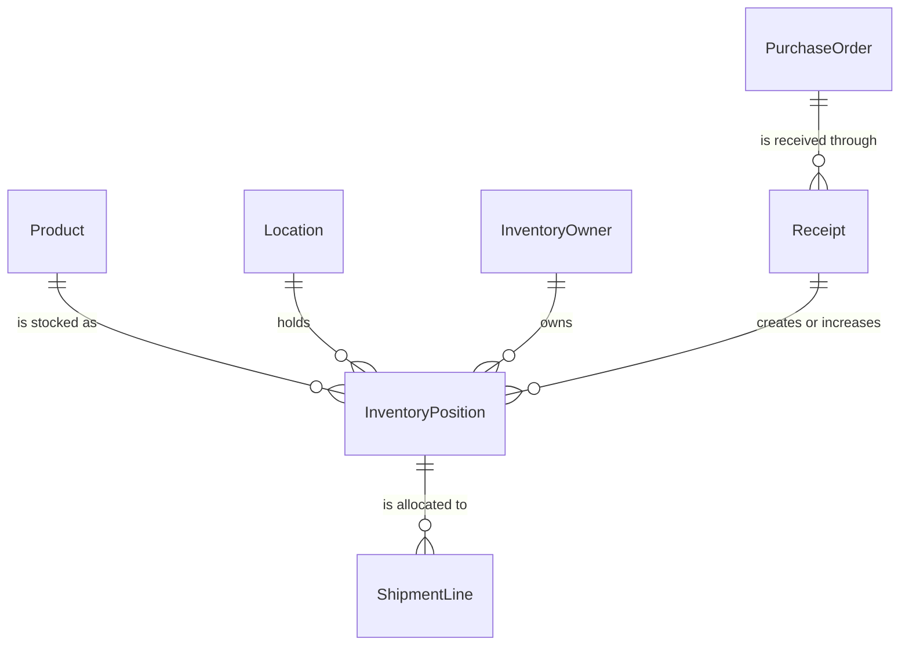
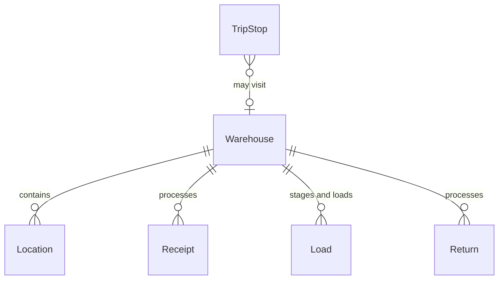
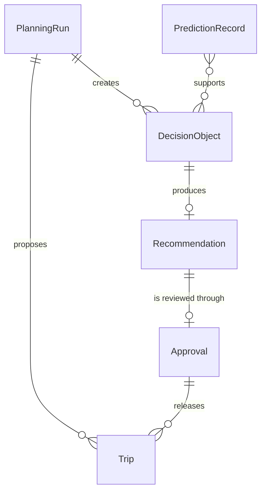
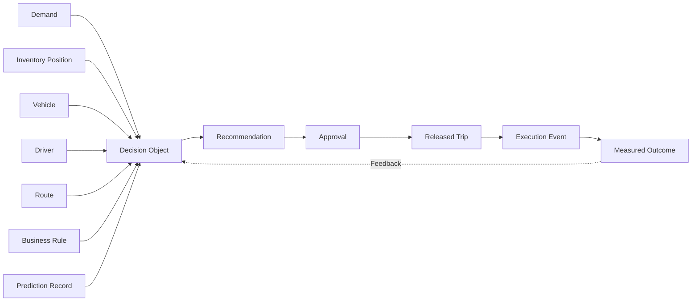
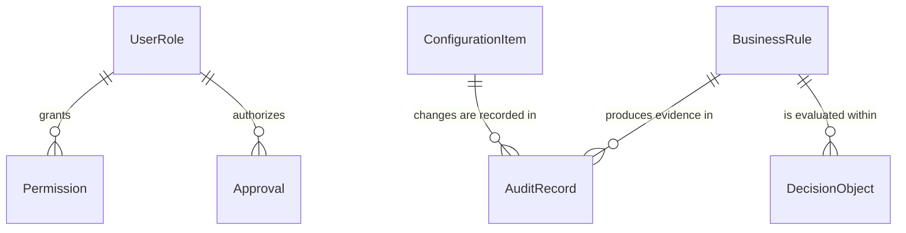
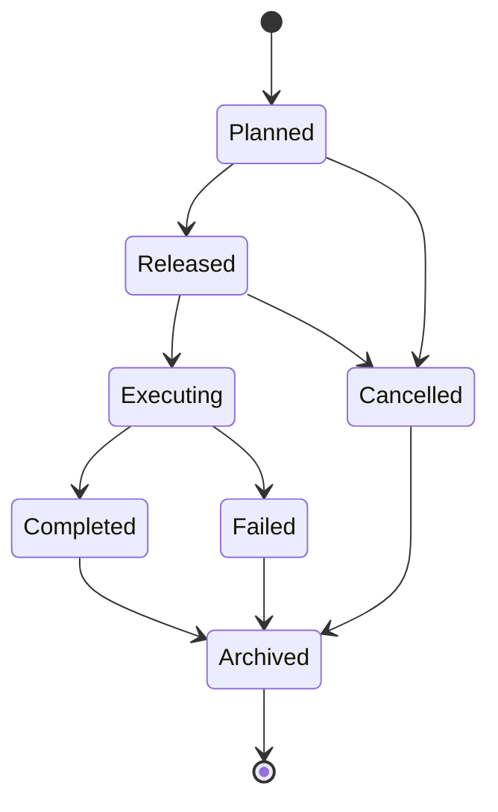
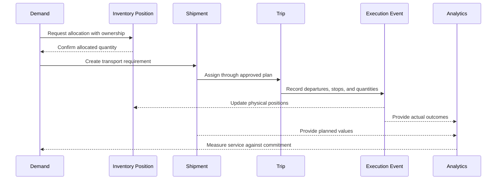

import DocumentInfo from '@site/src/components/DocumentInfo';

# Business Objects

<DocumentInfo
  category="Business"
  audience={['Business', 'Operations', 'Product', 'Technical', 'Data', 'Security']}
  status="Approved"
  version="1.0"
  owner="Business Architecture Team"
  updated="July 2026"
  readingTime="18 min"
/>

## Purpose

Business Objects are the canonical business entities of SCOP.

They define what the business manages — parties, products, inventory, demand, shipments, vehicles, trips, decisions, and outcomes — independently from the technology used to implement them.

This page is the authoritative reference for every business entity used throughout SCOP documentation, design, and delivery.

The following distinctions are fundamental:

- Business Objects are not Odoo models.
- Business Objects are not database tables.
- Business Objects are not APIs.
- One Business Object may map to several Odoo models.
- One Odoo model may support multiple Business Objects.

For example, the Trip Business Object may be supported by a trip model, a stop model, and related assignment records, while a single Odoo partner model may support both the Party and Inventory Owner Business Objects.

When documentation, rules, decisions, or reports refer to a business entity, they must use the canonical object defined on this page.

## Business Object Principles

### Single Authoritative Owner

Every Business Object has one authoritative business domain that owns its definition, meaning, and lifecycle. Other domains consume or enrich the object but do not create conflicting authoritative versions.

### Stable Identity

An important Business Object has a stable identity that does not change when its data, status, or implementation changes.

### Lifecycle

Every Business Object has a defined lifecycle from creation to retirement or archiving. An object without a lifecycle cannot be governed.

### State Management

Object state is a controlled business fact. State transitions have authorized actors, validations, and audit evidence.

### Traceability

An object must remain traceable to the objects that created it, the decisions that affected it, and the outcomes it produced.

### Version Awareness

Where the business requires history, an object identifier represents the continuing concept while versions represent approved definitions or revisions at points in time.

### Relationships

Relationships between objects are explicit and directional. Hidden or assumed relationships are not acceptable in governed documentation.

### Business Meaning Before Implementation

An object is defined by its business meaning first. Implementation structures must support the business definition rather than replace it.

### Separation of Ownership and Physical Location

Where an object represents goods, its business owner and its physical location are always distinct facts. Storage in a company warehouse never implies company ownership.

### Separation of Planned and Actual Data

Planned values and actual results are always distinguishable. An approved plan is never overwritten by execution outcomes; both are retained.

## Business Object Categories

SCOP Business Objects fall into six categories.

| Category | Purpose | Examples |
| --- | --- | --- |
| Master Objects | Long-lived business definitions referenced by transactions | Party, Location, Product, Warehouse, Vehicle, Driver, Route |
| Transaction Objects | Records of business activity and commitments | Demand, Purchase Order, Receipt, Shipment, Load, Return |
| Planning Objects | Controlled evaluation and proposed action | Planning Run, Decision Object, Recommendation, Approval |
| Execution Objects | Actual operational activity and deviations | Trip, Trip Stop, Execution Event, Operational Exception |
| Analytical Objects | Governed measurement and insight | KPI Definition, Prediction Record |
| Governance Objects | Control, authorization, and evidence | Business Rule, Configuration Item, User Role, Permission, Audit Record |

The categories differ in their typical characteristics.

| Characteristic | Master | Transaction | Planning | Execution | Analytical | Governance |
| --- | --- | --- | --- | --- | --- | --- |
| Typical lifetime | Years | Days to weeks | Hours to days | Hours to days | Periods | Years |
| Change frequency | Low | Moderate | High during planning | High during execution | Periodic | Controlled |
| Primary ownership | Foundational domains | Operational domains | Planning and Decision | Execution and Exception | Performance and Analytics | Governance and Administration |
| History requirement | Version history | Full transaction history | Full decision history | Full outcome history | Formula versions | Full audit history |
| Deletion policy | Deactivate and archive | Cancel and retain | Retain | Retain | Retain | Retain |

## Canonical Business Objects

Each object below is documented with its purpose, business meaning, ownership, lifecycle, relationships, and technology relationships.

Future detailed pages referenced here are planned documentation and remain plain text until created.

### Party

A Party is an organization participating in SCOP operations: a customer, a supplier, or a company entity. It carries the business identity and responsibility to which locations, commitments, ownership, and transactions are attached.

| Aspect | Definition |
| --- | --- |
| Authoritative Owner | Party and Location domain owner |
| Primary Domain | Party and Location Management |
| Lifecycle Summary | Draft → Active → Inactive → Archived |
| Relationships | Has many Locations and contacts; referenced by Demand, Purchase Order, Shipment, and Inventory Owner |
| Typical Inputs | Registration information, contacts, commercial agreements |
| Typical Outputs | Valid party identity, responsibility, and status |
| Consumed By | Procurement, Demand, Inventory, Shipment, Planning, Analytics |
| Produced By | Party and Location Management |
| Odoo Relationship | Founded on partner and company records |
| Decision Engine Relationship | Provides party identity and service context for eligibility |
| AI Relationship | Provides customer and supplier segments for predictions |
| Future Detailed Page | Party and Location Domain |

### Location

A Location is a physical place used for receipt, pickup, storage, delivery, transfer, or return. Every movement in SCOP begins and ends at a Location.

| Aspect | Definition |
| --- | --- |
| Authoritative Owner | Party and Location domain owner |
| Primary Domain | Party and Location Management |
| Lifecycle Summary | Draft → Active → Inactive → Archived |
| Relationships | Belongs to a Party or company entity; referenced by Warehouse, Demand, Shipment, Route, and Trip Stop |
| Typical Inputs | Address, coordinates, operating hours, time windows, access restrictions |
| Typical Outputs | Valid operational source and destination information |
| Consumed By | Demand, Warehouse, Shipment, Route and Trip, Planning |
| Produced By | Party and Location Management |
| Odoo Relationship | Founded on partner addresses, warehouses, and stock locations |
| Decision Engine Relationship | Provides service windows, restrictions, and travel context |
| AI Relationship | Provides geographic features for travel-time and ETA prediction |
| Future Detailed Page | Party and Location Domain |

### Product

A Product is a physical item procured, stored, transferred, collected, or delivered. It defines what moves through the supply chain and the conditions required to move it safely.

| Aspect | Definition |
| --- | --- |
| Authoritative Owner | Product and Handling domain owner |
| Primary Domain | Product and Handling Management |
| Lifecycle Summary | Draft → Active → Phase-Out → Inactive → Archived |
| Relationships | Belongs to a Product Category; referenced by Demand, Inventory Position, Shipment Line, and Load Line |
| Typical Inputs | Identity, unit of measure, weight, volume, handling and compatibility requirements |
| Typical Outputs | Capacity, storage, transport, and compatibility requirements |
| Consumed By | Procurement, Demand, Inventory, Warehouse, Shipment, Planning |
| Produced By | Product and Handling Management |
| Odoo Relationship | Founded on product and unit-of-measure records |
| Decision Engine Relationship | Provides capacity contribution and compatibility constraints |
| AI Relationship | Provides product features for demand and handling predictions |
| Future Detailed Page | Product and Handling Domain |

### Product Category

A Product Category is a controlled grouping of related products used for classification, compatibility, handling policy, and analysis.

| Aspect | Definition |
| --- | --- |
| Authoritative Owner | Product and Handling domain owner |
| Primary Domain | Product and Handling Management |
| Lifecycle Summary | Draft → Active → Inactive → Archived |
| Relationships | Groups many Products; referenced by compatibility rules and KPI Definitions |
| Typical Inputs | Classification structure and handling policies |
| Typical Outputs | Controlled product grouping and policy scope |
| Consumed By | Product management, Business Rules, Analytics |
| Produced By | Product and Handling Management |
| Odoo Relationship | Founded on product category records |
| Decision Engine Relationship | Provides compatibility-group scope for constraints |
| AI Relationship | Provides aggregation level for demand forecasting |
| Future Detailed Page | Product and Handling Domain |

### Inventory Position

An Inventory Position is a quantity of a Product at a Location with a defined availability status and a defined owner. It is the atomic fact of inventory management.

| Aspect | Definition |
| --- | --- |
| Authoritative Owner | Inventory and Ownership domain owner |
| Primary Domain | Inventory and Ownership Management |
| Lifecycle Summary | Created by receipt or movement → Adjusted → Allocated → Consumed or transferred |
| Relationships | References Product, Location, Inventory Owner, and lot or batch; allocated to Shipment Lines |
| Typical Inputs | Receipts, movements, adjustments, allocations |
| Typical Outputs | Available, reserved, and forecasted quantities with ownership |
| Consumed By | Warehouse, Shipment, Planning, Analytics |
| Produced By | Inventory and Ownership Management |
| Odoo Relationship | Founded on stock quants and stock moves |
| Decision Engine Relationship | Provides availability and source-selection input |
| AI Relationship | Provides availability history for shortage-risk prediction |
| Future Detailed Page | Inventory Domain |

### Inventory Owner

An Inventory Owner is the business party that owns a quantity of inventory, independent of where that inventory is physically stored.

| Aspect | Definition |
| --- | --- |
| Authoritative Owner | Inventory and Ownership domain owner |
| Primary Domain | Inventory and Ownership Management |
| Lifecycle Summary | Established at receipt → Maintained through every movement → Closed at consumption or return |
| Relationships | References a Party; qualifies Inventory Positions, Shipment Lines, and Load Lines |
| Typical Inputs | Ownership terms from procurement, customer agreements, or receipts |
| Typical Outputs | Traceable ownership at every inventory and movement step |
| Consumed By | Warehouse, Shipment, Planning, Execution, Analytics |
| Produced By | Inventory and Ownership Management |
| Odoo Relationship | Founded on partner references qualifying stock records |
| Decision Engine Relationship | Enforces ownership separation as a hard constraint |
| AI Relationship | Ownership is never inferred by prediction; it is a governed fact |
| Future Detailed Page | Inventory Domain |

### Warehouse

A Warehouse is a company-managed or authorized facility used for receipt, storage, staging, transfer, loading, and cross-docking.

| Aspect | Definition |
| --- | --- |
| Authoritative Owner | Party and Location domain owner; operated by Warehouse Operations |
| Primary Domain | Party and Location Management |
| Lifecycle Summary | Draft → Active → Restricted → Inactive → Archived |
| Relationships | Contains Locations; processes Receipts and Loads; visited by Trip Stops |
| Typical Inputs | Facility definition, capacity, operating hours, restrictions |
| Typical Outputs | Valid processing facility with readiness and capacity context |
| Consumed By | Procurement, Inventory, Shipment, Planning, Route and Trip |
| Produced By | Party and Location Management |
| Odoo Relationship | Founded on warehouse and stock-location records |
| Decision Engine Relationship | Provides warehouse-selection and readiness input |
| AI Relationship | Provides workload features for readiness prediction |
| Future Detailed Page | Warehouse Operations Domain |

### Demand

A Demand is a validated requirement to move products from one Location to another. It is the entry point of the operational cycle and the anchor of downstream traceability.

| Aspect | Definition |
| --- | --- |
| Authoritative Owner | Customer and Demand domain owner |
| Primary Domain | Customer and Demand Management |
| Lifecycle Summary | Draft → Submitted → Validated → Eligible → Planned → Released → Completed or Cancelled |
| Relationships | References Party, Locations, Products, priority, and time window; fulfilled by Shipments |
| Typical Inputs | Customer orders, replenishment requests, transfers, returns, collections |
| Typical Outputs | Eligible movement requirements with commitments and priorities |
| Consumed By | Shipment, Planning, Execution, Analytics |
| Produced By | Customer and Demand Management |
| Odoo Relationship | Founded on sales or approved order workflows; normalized as movement demand |
| Decision Engine Relationship | Primary planning input; eligibility and priority evaluation |
| AI Relationship | Subject of demand forecasting and coverage prediction |
| Future Detailed Page | Customer and Demand Domain |

### Purchase Requirement

A Purchase Requirement is a business need for external supply before a supplier commitment exists.

| Aspect | Definition |
| --- | --- |
| Authoritative Owner | Procurement domain owner |
| Primary Domain | Procurement and Inbound Supply |
| Lifecycle Summary | Requirement → Approved → Ordered or Cancelled |
| Relationships | References Products and destination; leads to Purchase Orders |
| Typical Inputs | Demand forecasts, replenishment policies, management requests |
| Typical Outputs | Approved supply needs |
| Consumed By | Procurement, Planning, Analytics |
| Produced By | Procurement and Inbound Supply |
| Odoo Relationship | Founded on purchase requisition or requirement workflows |
| Decision Engine Relationship | Provides expected-supply context |
| AI Relationship | Supported by demand and capacity forecasting |
| Future Detailed Page | Procurement Domain |

### Purchase Order

A Purchase Order is an approved commitment to a supplier for defined products, quantities, dates, and destinations.

| Aspect | Definition |
| --- | --- |
| Authoritative Owner | Procurement domain owner |
| Primary Domain | Procurement and Inbound Supply |
| Lifecycle Summary | Ordered → Confirmed → Expected → Received, Partially Received, or Cancelled |
| Relationships | References Supplier Party, Products, and destination Warehouse; produces Receipts and supplier-collection Demand |
| Typical Inputs | Approved Purchase Requirements and supplier terms |
| Typical Outputs | Supplier commitments and expected inbound supply |
| Consumed By | Inventory, Warehouse, Planning, Analytics |
| Produced By | Procurement and Inbound Supply |
| Odoo Relationship | Founded on purchase-order records |
| Decision Engine Relationship | Provides expected availability for conditional planning |
| AI Relationship | Provides history for supply-delay risk prediction |
| Future Detailed Page | Procurement Domain |

### Receipt

A Receipt is the warehouse operation that validates and records the physical arrival of goods.

| Aspect | Definition |
| --- | --- |
| Authoritative Owner | Warehouse Operations domain owner |
| Primary Domain | Warehouse Operations |
| Lifecycle Summary | Expected → In Progress → Validated → Posted, or Exception |
| Relationships | References Purchase Order or inbound Demand; creates or increases Inventory Positions; may feed Cross-Dock staging |
| Typical Inputs | Expected inbound supply and physical arrival |
| Typical Outputs | Validated received quantities and inventory updates |
| Consumed By | Inventory, Planning, Analytics |
| Produced By | Warehouse Operations |
| Odoo Relationship | Founded on incoming stock operations |
| Decision Engine Relationship | Converts expected supply into confirmed availability |
| AI Relationship | Provides history for readiness and handling-duration prediction |
| Future Detailed Page | Warehouse Operations Domain |

### Shipment

A Shipment is a logical group of goods requiring transportation between defined Locations. It is the transport requirement, not the physical cargo.

| Aspect | Definition |
| --- | --- |
| Authoritative Owner | Shipment and Load domain owner |
| Primary Domain | Shipment and Load Management |
| Lifecycle Summary | Created → Ready → Planned → In Execution → Completed, or Cancelled |
| Relationships | Fulfils Demand; contains Shipment Lines; carried through Loads; assigned to Trips |
| Typical Inputs | Eligible Demand and allocated Inventory Positions |
| Typical Outputs | Transportable requirements with constraints and readiness |
| Consumed By | Planning, Route and Trip, Warehouse, Execution |
| Produced By | Shipment and Load Management |
| Odoo Relationship | SCOP extension linked to stock and delivery records |
| Decision Engine Relationship | Consolidation and trip-formation input |
| AI Relationship | Subject of consolidation-suitability indicators |
| Future Detailed Page | Shipment and Load Domain |

### Shipment Line

A Shipment Line is a product and quantity within a Shipment, carrying ownership and handling requirements at line level.

| Aspect | Definition |
| --- | --- |
| Authoritative Owner | Shipment and Load domain owner |
| Primary Domain | Shipment and Load Management |
| Lifecycle Summary | Follows its Shipment; individually traceable to allocation and delivery |
| Relationships | Belongs to one Shipment; references Product and Inventory Owner; allocated through Load Lines |
| Typical Inputs | Demand lines and inventory allocations |
| Typical Outputs | Line-level quantities, ownership, and constraints |
| Consumed By | Warehouse, Load formation, Execution |
| Produced By | Shipment and Load Management |
| Odoo Relationship | SCOP extension linked to stock move lines |
| Decision Engine Relationship | Provides capacity contribution per line |
| AI Relationship | Provides line features for handling predictions |
| Future Detailed Page | Shipment and Load Domain |

### Load

A Load is the physical cargo assigned to a vehicle for a trip. It is the vehicle-content plan and, after execution, the vehicle-content result.

| Aspect | Definition |
| --- | --- |
| Authoritative Owner | Shipment and Load domain owner |
| Primary Domain | Shipment and Load Management |
| Lifecycle Summary | Proposed → Confirmed → Staged → Loaded → In Transit → Unloaded → Closed |
| Relationships | Belongs to one Trip; contains Load Lines; prepared and loaded by a Warehouse |
| Typical Inputs | Consolidated Shipments and vehicle capacity |
| Typical Outputs | Feasible physical cargo with loading sequence |
| Consumed By | Warehouse, Route and Trip, Execution |
| Produced By | Shipment and Load Management |
| Odoo Relationship | SCOP extension linked to trip and stock operations |
| Decision Engine Relationship | Capacity-feasibility subject across all dimensions |
| AI Relationship | Provides composition features for risk indicators |
| Future Detailed Page | Shipment and Load Domain |

### Load Line

A Load Line is a product and quantity within a Load, linking physical cargo back to Shipment Lines and ownership.

| Aspect | Definition |
| --- | --- |
| Authoritative Owner | Shipment and Load domain owner |
| Primary Domain | Shipment and Load Management |
| Lifecycle Summary | Follows its Load; records planned and actual loaded quantities |
| Relationships | Belongs to one Load; references Shipment Line, Product, and Inventory Owner |
| Typical Inputs | Shipment Lines and staging results |
| Typical Outputs | Planned versus actual loaded quantities |
| Consumed By | Execution, Inventory, Analytics |
| Produced By | Shipment and Load Management |
| Odoo Relationship | SCOP extension linked to stock move lines |
| Decision Engine Relationship | Provides dynamic-capacity calculation input |
| AI Relationship | Provides actuals for capacity-assumption learning |
| Future Detailed Page | Shipment and Load Domain |

### Vehicle

A Vehicle is a company-owned transportation resource with defined capacity, configuration, and availability.

| Aspect | Definition |
| --- | --- |
| Authoritative Owner | Fleet and Driver domain owner |
| Primary Domain | Fleet and Driver Management |
| Lifecycle Summary | Registered → Active → Maintenance or Blocked → Inactive → Retired |
| Relationships | Belongs to a Vehicle Type; assigned to Trips; constrained by capacity and route restrictions |
| Typical Inputs | Registration, capacity profile, maintenance status, availability |
| Typical Outputs | Eligible transport capacity |
| Consumed By | Planning, Route and Trip, Execution, Analytics |
| Produced By | Fleet and Driver Management |
| Odoo Relationship | Founded on fleet records with SCOP capacity extensions |
| Decision Engine Relationship | Assignment-eligibility and capacity-constraint subject |
| AI Relationship | Subject of suitability ranking and utilization prediction |
| Future Detailed Page | Fleet and Driver Domain |

### Vehicle Type

A Vehicle Type is a reusable capacity and configuration profile shared by similar vehicles.

| Aspect | Definition |
| --- | --- |
| Authoritative Owner | Fleet and Driver domain owner |
| Primary Domain | Fleet and Driver Management |
| Lifecycle Summary | Draft → Active → Inactive → Archived |
| Relationships | Groups many Vehicles; defines default capacity and compartment profiles |
| Typical Inputs | Capacity dimensions, temperature capability, configuration |
| Typical Outputs | Reusable capacity profiles for planning |
| Consumed By | Fleet management, Planning, Analytics |
| Produced By | Fleet and Driver Management |
| Odoo Relationship | Founded on fleet model or category records with extensions |
| Decision Engine Relationship | Provides default capacity constraints |
| AI Relationship | Provides type-level features for capacity forecasting |
| Future Detailed Page | Fleet and Driver Domain |

### Driver

A Driver is a person authorized to execute vehicle trips, with qualifications, availability, and working-time limits.

| Aspect | Definition |
| --- | --- |
| Authoritative Owner | Fleet and Driver domain owner |
| Primary Domain | Fleet and Driver Management |
| Lifecycle Summary | Registered → Active → Restricted or Absent → Inactive → Retired |
| Relationships | References a platform User; assigned to Trips; constrained by qualifications and working time |
| Typical Inputs | Qualifications, licence validity, availability, restrictions |
| Typical Outputs | Eligible driver capacity |
| Consumed By | Planning, Route and Trip, Execution |
| Produced By | Fleet and Driver Management |
| Odoo Relationship | Founded on employee and user records with SCOP extensions |
| Decision Engine Relationship | Assignment-eligibility subject; overlap prevention |
| AI Relationship | Availability-accuracy and shortage-risk subject |
| Future Detailed Page | Fleet and Driver Domain |

### Route

A Route is a predefined reusable operational path or sequence of locations. It is a template, never a dated execution.

| Aspect | Definition |
| --- | --- |
| Authoritative Owner | Route and Trip domain owner |
| Primary Domain | Route and Trip Management |
| Lifecycle Summary | Draft → Active → Inactive → Archived |
| Relationships | Contains route stop templates referencing Locations; reused by many Trips |
| Typical Inputs | Location sequences, distances, durations, restrictions |
| Typical Outputs | Reusable path structures for planning |
| Consumed By | Planning, Route and Trip, Analytics |
| Produced By | Route and Trip Management |
| Odoo Relationship | SCOP custom capability |
| Decision Engine Relationship | Route-selection input and compatibility constraint |
| AI Relationship | Provides history for route-duration estimation |
| Future Detailed Page | Route and Trip Domain |

### Trip

A Trip is a dated transportation execution with assigned resources, loads, sequenced stops, and planned and actual times. It is the operational realization of a Route or an optimized stop sequence.

| Aspect | Definition |
| --- | --- |
| Authoritative Owner | Route and Trip domain owner |
| Primary Domain | Route and Trip Management |
| Lifecycle Summary | Draft → Recommended → Approved → Released → Loading → In Progress → Completed, Partially Completed, or Cancelled |
| Relationships | May reference a Route; carries Loads; contains Trip Stops; assigned one Vehicle and one Driver; released by an Approval |
| Typical Inputs | Approved plan, shipments, resources, stop sequence |
| Typical Outputs | Executed transportation with planned and actual results |
| Consumed By | Warehouse, Execution, Analytics |
| Produced By | Planning and Decision through Route and Trip Management |
| Odoo Relationship | SCOP custom capability linked to stock and fleet records |
| Decision Engine Relationship | Principal planning output; feasibility subject |
| AI Relationship | Subject of ETA, duration, and delay-risk prediction |
| Future Detailed Page | Route and Trip Domain |

### Trip Stop

A Trip Stop is one operational visit within a Trip, with a planned sequence, activity, time window, and recorded outcome.

| Aspect | Definition |
| --- | --- |
| Authoritative Owner | Route and Trip domain owner |
| Primary Domain | Route and Trip Management |
| Lifecycle Summary | Planned → Arrived → Servicing → Completed, Failed, Skipped, or Rescheduled |
| Relationships | Belongs to one Trip; references a Location; records pickup, delivery, transfer, or return activity; produces Execution Events |
| Typical Inputs | Stop sequence, time windows, service durations |
| Typical Outputs | Stop outcomes and actual times |
| Consumed By | Execution, Inventory, Analytics |
| Produced By | Route and Trip Management |
| Odoo Relationship | SCOP custom capability |
| Decision Engine Relationship | Sequencing and time-window evaluation subject |
| AI Relationship | Subject of service-duration and failure-risk prediction |
| Future Detailed Page | Route and Trip Domain |

### Planning Run

A Planning Run is a controlled evaluation that converts eligible demand and available resources into a recommended daily plan for a defined scope and date.

| Aspect | Definition |
| --- | --- |
| Authoritative Owner | Planning and Decision domain owner |
| Primary Domain | Planning and Decision Management |
| Lifecycle Summary | Requested → Evaluating → Recommended → Reviewed → Closed |
| Relationships | Consumes Demand, Inventory Positions, readiness, Vehicles, Drivers, and Routes; creates Decision Objects and proposed Trips |
| Typical Inputs | Planning date, eligible demand, resources, rules, constraints, objectives |
| Typical Outputs | Recommended trips, unplanned demand with reasons, warnings |
| Consumed By | Operations review, Analytics |
| Produced By | Planning and Decision Management |
| Odoo Relationship | SCOP planning capability |
| Decision Engine Relationship | The engine's unit of coordinated evaluation |
| AI Relationship | Consumes predictions; produces confidence context |
| Future Detailed Page | Planning and Decision Domain |

### Decision Object

A Decision Object is a structured operational decision containing context, inputs, rules, constraints, alternatives, recommendation, approval, and outcome.

| Aspect | Definition |
| --- | --- |
| Authoritative Owner | Planning and Decision domain owner |
| Primary Domain | Planning and Decision Management |
| Lifecycle Summary | Created → Validating → Evaluating → Recommended → Under Review → Approved, Modified, or Rejected → Released → Executed → Measured |
| Relationships | Created by a Planning Run or operational trigger; produces a Recommendation; closed by an Approval and a measured outcome |
| Typical Inputs | Operational context, rules, constraints, objectives, predictions |
| Typical Outputs | Traceable decision with explanation and outcome |
| Consumed By | Execution, Analytics, Governance |
| Produced By | Planning and Decision Management |
| Odoo Relationship | SCOP decision records |
| Decision Engine Relationship | The engine's core managed object |
| AI Relationship | References Prediction Records used as inputs |
| Future Detailed Page | Planning and Decision Domain |

### Recommendation

A Recommendation is the alternative proposed by the Decision Engine for a Decision Object, with its explanation and confidence.

| Aspect | Definition |
| --- | --- |
| Authoritative Owner | Planning and Decision domain owner |
| Primary Domain | Planning and Decision Management |
| Lifecycle Summary | Generated → Under Review → Accepted, Modified, or Rejected |
| Relationships | Belongs to one Decision Object; reviewed through an Approval; compared with the final decision and outcome |
| Typical Inputs | Feasible alternatives, objective evaluation, explanations |
| Typical Outputs | Proposed action with business explanation |
| Consumed By | Operations review, Analytics, Governance |
| Produced By | Planning and Decision Management |
| Odoo Relationship | SCOP decision records |
| Decision Engine Relationship | The engine's principal output |
| AI Relationship | May carry confidence and prediction references |
| Future Detailed Page | Planning and Decision Domain |

### Approval

An Approval is the authorized acceptance, modification, or rejection of a Recommendation or controlled action, recorded with its actor, time, and reason.

| Aspect | Definition |
| --- | --- |
| Authoritative Owner | Planning and Decision domain owner; authority governed by Platform Governance |
| Primary Domain | Planning and Decision Management |
| Lifecycle Summary | Requested → Granted, Modified, or Rejected → Recorded |
| Relationships | Applies to a Recommendation, plan, or controlled transaction; exercised by a User Role with approval authority; releases Trips |
| Typical Inputs | Recommendation, explanation, reviewer authority |
| Typical Outputs | Authorized operational release or rejection with reasons |
| Consumed By | Execution, Audit, Analytics |
| Produced By | Authorized operational users |
| Odoo Relationship | Workflow approval states and SCOP decision records |
| Decision Engine Relationship | Required gate between recommendation and release |
| AI Relationship | Never produced by AI; AI output requires human approval |
| Future Detailed Page | Planning and Decision Domain |

### Execution Event

An Execution Event is a recorded operational action or status change during execution: a departure, arrival, service, quantity confirmation, or completion.

| Aspect | Definition |
| --- | --- |
| Authoritative Owner | Execution and Exception domain owner |
| Primary Domain | Execution and Exception Management |
| Lifecycle Summary | Recorded → Validated → Reconciled |
| Relationships | Belongs to a Trip or Trip Stop; updates Inventory Positions; feeds reconciliation and Analytics |
| Typical Inputs | Operational confirmations from users or future driver applications |
| Typical Outputs | Actual times, quantities, and statuses |
| Consumed By | Inventory, Analytics, AI Platform monitoring |
| Produced By | Execution and Exception Management |
| Odoo Relationship | SCOP execution records linked to stock operations |
| Decision Engine Relationship | Provides outcomes for decision measurement |
| AI Relationship | Provides actuals for prediction-accuracy monitoring |
| Future Detailed Page | Execution and Exception Domain |

### Operational Exception

An Operational Exception is a condition preventing normal planning or execution, with a defined owner, severity, resolution, and outcome.

| Aspect | Definition |
| --- | --- |
| Authoritative Owner | Execution and Exception domain owner; cause-domain ownership applies |
| Primary Domain | Execution and Exception Management |
| Lifecycle Summary | Detected → Classified → Assigned → Investigating → In Resolution → Resolved → Closed, or Cancelled |
| Relationships | References the affected Demand, Shipment, Trip, resource, or Decision Object; may trigger replanning and Follow-Up Demand |
| Typical Inputs | Failed validations, execution failures, resource issues |
| Typical Outputs | Owned, resolved, and measured deviations |
| Consumed By | Planning, Analytics, Governance |
| Produced By | Any operational domain; managed by Execution and Exception |
| Odoo Relationship | SCOP exception records |
| Decision Engine Relationship | May trigger exception-resolution recommendations |
| AI Relationship | Subject of anomaly and failure-risk detection |
| Future Detailed Page | Execution and Exception Domain |

### Return

A Return is a movement of goods back from a customer, branch, or trip toward a warehouse or supplier, with its reason, ownership, and disposition.

| Aspect | Definition |
| --- | --- |
| Authoritative Owner | Execution and Exception domain owner |
| Primary Domain | Execution and Exception Management |
| Lifecycle Summary | Created → Collected → Received → Dispositioned → Closed |
| Relationships | References the original Demand or delivery where applicable; creates inbound warehouse work and inventory updates |
| Typical Inputs | Rejections, damages, overages, collection requirements |
| Typical Outputs | Controlled reverse movements with disposition |
| Consumed By | Warehouse, Inventory, Analytics |
| Produced By | Execution and Exception Management |
| Odoo Relationship | Founded on return stock operations |
| Decision Engine Relationship | May be planned within trips as pickup activity |
| AI Relationship | Provides return-rate features for risk indicators |
| Future Detailed Page | Execution and Exception Domain |

### KPI Definition

A KPI Definition is a governed performance measure with an owner, formula version, scope, and measurement period.

| Aspect | Definition |
| --- | --- |
| Authoritative Owner | Performance and Analytics domain owner |
| Primary Domain | Performance and Analytics |
| Lifecycle Summary | Draft → Approved → Active → Superseded → Retired |
| Relationships | Calculated from governed operational, decision, and prediction data; produces KPI results and variances |
| Typical Inputs | Approved formulas, targets, and data sources |
| Typical Outputs | Trusted, versioned performance measures |
| Consumed By | Management, Operations, Governance |
| Produced By | Performance and Analytics |
| Odoo Relationship | Reporting and analytical capabilities |
| Decision Engine Relationship | Measures decision quality and outcomes |
| AI Relationship | Measures model business impact |
| Future Detailed Page | Performance and Analytics Domain |

### Prediction Record

A Prediction Record is a traceable AI output: the capability, model version, inputs, result, confidence, explanation, validity period, and eventual actual outcome.

| Aspect | Definition |
| --- | --- |
| Authoritative Owner | AI Platform owner |
| Primary Domain | AI Platform |
| Lifecycle Summary | Generated → Consumed → Expired or Superseded → Measured against outcome |
| Relationships | References input business objects and feature versions; consumed by Decision Objects; compared with Execution Events |
| Typical Inputs | Operational context and approved model versions |
| Typical Outputs | Predictions with confidence and explanation |
| Consumed By | Planning and Decision, Analytics |
| Produced By | AI Platform |
| Odoo Relationship | Referenced from SCOP decision and planning records |
| Decision Engine Relationship | Supporting input; never a final business authority |
| AI Relationship | The platform's principal governed output |
| Future Detailed Page | AI Capability Catalogue |

### Audit Record

An Audit Record is evidence of a significant action or change: who did what, when, to which object, and with what result.

| Aspect | Definition |
| --- | --- |
| Authoritative Owner | Platform Governance and Administration owner |
| Primary Domain | Platform Governance and Administration |
| Lifecycle Summary | Recorded → Retained → Archived per retention policy |
| Relationships | References users, business objects, rules, configurations, and decisions |
| Typical Inputs | Approvals, overrides, rule changes, releases, administrative actions |
| Typical Outputs | Protected, reviewable evidence |
| Consumed By | Governance, Security, Analytics, investigations |
| Produced By | All governed platform capabilities |
| Odoo Relationship | Logging, tracking, and SCOP audit extensions |
| Decision Engine Relationship | Retains decision evaluation evidence |
| AI Relationship | Retains model versions and prediction evidence |
| Future Detailed Page | Security and Authorization |

### Business Rule

A Business Rule is an approved statement governing business behavior, managed through the framework defined on the Business Rules page.

| Aspect | Definition |
| --- | --- |
| Authoritative Owner | Rule Business Owner; governed by Platform Governance |
| Primary Domain | Platform Governance and Administration |
| Lifecycle Summary | Proposed → Draft → Under Review → Approved → Scheduled → Active → Suspended or Retired |
| Relationships | Belongs to a primary business domain; enforced across application layers; evaluated within Decision Objects |
| Typical Inputs | Business policy and governance approval |
| Typical Outputs | Explicit, versioned, testable behavior |
| Consumed By | All operational domains, Decision Engine, Security |
| Produced By | Business owners through governance |
| Odoo Relationship | Enforced through supported constraint and workflow mechanisms |
| Decision Engine Relationship | Source of eligibility, hard, and soft constraints |
| AI Relationship | Boundary that AI output must not override |
| Future Detailed Page | Business Rule Catalogue |

### Configuration Item

A Configuration Item is a controlled platform or business setting that supports approved behavior without replacing rule documentation.

| Aspect | Definition |
| --- | --- |
| Authoritative Owner | Platform Governance and Administration owner |
| Primary Domain | Platform Governance and Administration |
| Lifecycle Summary | Defined → Approved → Applied → Changed under control → Retired |
| Relationships | Supports Business Rules and platform capabilities; changes recorded in Audit Records |
| Typical Inputs | Approved values, thresholds, flags, environment settings |
| Typical Outputs | Reproducible, traceable platform behavior |
| Consumed By | All platform capabilities |
| Produced By | Authorized administrators |
| Odoo Relationship | System parameters and configuration records |
| Decision Engine Relationship | Provides governed thresholds and weights |
| AI Relationship | Provides capability activation and fallback settings |
| Future Detailed Page | Security and Authorization |

### User Role

A User Role is a defined grouping of responsibility and permissions reflecting a business function.

| Aspect | Definition |
| --- | --- |
| Authoritative Owner | Platform Governance and Administration owner |
| Primary Domain | Platform Governance and Administration |
| Lifecycle Summary | Defined → Approved → Active → Reviewed → Retired |
| Relationships | Grants Permissions; assigned to users; referenced by Approval authority |
| Typical Inputs | Business responsibilities and least-privilege policy |
| Typical Outputs | Controlled, auditable access groupings |
| Consumed By | All platform capabilities, Security, Audit |
| Produced By | Platform Governance and Administration |
| Odoo Relationship | Founded on groups and access records |
| Decision Engine Relationship | Determines who may review and approve decisions |
| AI Relationship | Controls access to model and prediction information |
| Future Detailed Page | Security and Authorization |

### Permission

A Permission is an authorized action or data scope granted through a User Role and enforced on the server side.

| Aspect | Definition |
| --- | --- |
| Authoritative Owner | Platform Governance and Administration owner |
| Primary Domain | Platform Governance and Administration |
| Lifecycle Summary | Defined → Granted → Reviewed → Revoked |
| Relationships | Belongs to User Roles; enforced by record and access rules; evidenced in Audit Records |
| Typical Inputs | Approved access policy |
| Typical Outputs | Enforced authorization decisions |
| Consumed By | All platform capabilities |
| Produced By | Platform Governance and Administration |
| Odoo Relationship | Access rights and record rules |
| Decision Engine Relationship | Gate for decision review and release actions |
| AI Relationship | Gate for model administration and sensitive predictions |
| Future Detailed Page | Security and Authorization |

## Object Relationships

The following diagrams show the principal relationships between canonical objects.

### Core Operational Flow



### Inventory Relationships



### Warehouse Relationships



### Planning Relationships



### Decision Flow



### Governance Relationships



## Object Lifecycle Concepts

### Identity

An object receives its identity at creation and keeps it for life. Identity never encodes mutable facts such as status, location, or owner.

### State

State is the controlled position of an object within its lifecycle. Transitions are validated, authorized, and audited.

### Ownership

Every object has a defined authoritative domain owner. Ownership of the definition is distinct from ownership of goods, which is a business fact carried by Inventory Owner.

### History

Objects that support commitments, decisions, or audits retain their history. Overwriting historically significant values is not acceptable.

### Audit

Significant creations, transitions, approvals, overrides, and administrative changes produce Audit Records.

### Soft Deletion

Governed objects are deactivated or cancelled rather than physically deleted while business, audit, or legal relevance remains.

### Archiving

Completed or inactive objects move to archived status under retention policy while remaining traceable.

### Versioning

Definition-bearing objects — rules, KPI Definitions, configurations, models — are versioned. The identifier continues; the version changes.

### Replacement

When an object is superseded, the replacement references its predecessor so history remains navigable.

### Retirement

Retired objects stop participating in new activity. Their identifiers are never reused.

## State Principles

SCOP objects use controlled states drawn from a common vocabulary.

| State | Meaning |
| --- | --- |
| Planned | The object exists as an approved intention that has not started |
| Released | The object is authorized for execution |
| Executing | Operational activity is in progress |
| Completed | The activity finished with a recorded outcome |
| Cancelled | The object was stopped before completion under authorization |
| Failed | The activity could not be completed normally |
| Archived | The object is retained for history and no longer active |



State belongs to the business object, not to the user interface, a report, or a technical job. If state lived anywhere else, different consumers could see different truths about the same object. Each domain specification defines its own valid states and transitions using this vocabulary where applicable.

## Identity Principles

Every important object distinguishes four kinds of identifier.

| Identifier | Purpose | Example |
| --- | --- | --- |
| Business ID | Stable human-readable operational identifier | TRP-2026-000089 |
| Internal Technical ID | Implementation key used by the platform | Database or model record identifier |
| External Reference | Identifier assigned by a customer, supplier, or external system | Customer order number |
| Human-readable Code | Short mnemonic for master data | Warehouse code, route code |

Recommended Business ID patterns follow the existing SCOP convention:

```text
SHP-2026-000123
TRP-2026-000089
PLN-2026-07-18-01
DEC-2026-000456
EXC-2026-000077
REL-2026-07-001
BR-FLT-001
```

Identifier principles:

- Business IDs are immutable once assigned.
- Business IDs never encode mutable facts.
- Internal technical IDs never appear as the business identity in documents or communication.
- External references are stored alongside, never instead of, the Business ID.
- Identifiers of retired objects are never reused.

## Relationships

Object relationships use a small set of explicit types.

| Relationship Type | Meaning | Example |
| --- | --- | --- |
| One-to-One | One object relates to exactly one other | Decision Object to its Recommendation |
| One-to-Many | One object relates to several others | Trip to its Trip Stops |
| Many-to-One | Several objects reference one other | Trips to one Route |
| Many-to-Many | Objects relate in both directions through an association | Shipments to Loads through Load Lines |
| Composition | The part cannot exist without the whole | Shipment Line within its Shipment |
| Aggregation | The part exists independently of the grouping | Vehicles within a Vehicle Type |
| Reference | An object points to another without owning it | Demand referencing a Party |
| Dependency | An object requires another to be valid | Load depending on vehicle capacity |
| Containment | A physical or logical container holds contents | Warehouse containing Locations |

Inheritance between Business Objects should generally be avoided unless explicitly justified, because it hides ownership and lifecycle differences behind an implementation convenience.

## Cross-Domain Ownership

| Business Object | Authoritative Domain | Principal Consumers |
| --- | --- | --- |
| Party, Location, Warehouse | Party and Location Management | Procurement, Demand, Warehouse, Route, Planning |
| Product, Product Category | Product and Handling Management | Procurement, Demand, Inventory, Shipment |
| Purchase Requirement, Purchase Order | Procurement and Inbound Supply | Inventory, Warehouse, Planning |
| Demand | Customer and Demand Management | Shipment, Planning, Execution |
| Inventory Position, Inventory Owner | Inventory and Ownership Management | Warehouse, Shipment, Planning |
| Receipt | Warehouse Operations | Inventory, Planning, Analytics |
| Shipment, Shipment Line, Load, Load Line | Shipment and Load Management | Warehouse, Planning, Route and Trip, Execution |
| Vehicle, Vehicle Type, Driver | Fleet and Driver Management | Planning, Route and Trip, Execution |
| Route, Trip, Trip Stop | Route and Trip Management | Warehouse, Planning, Execution, Analytics |
| Planning Run, Decision Object, Recommendation, Approval | Planning and Decision Management | Execution, Analytics, Governance |
| Execution Event, Operational Exception, Return | Execution and Exception Management | Inventory, Planning, Analytics |
| KPI Definition | Performance and Analytics | Management, Operations, Governance |
| Prediction Record | AI Platform | Planning and Decision, Analytics |
| Business Rule, Configuration Item, User Role, Permission, Audit Record | Platform Governance and Administration | All domains |

## Object Governance

Every canonical object has defined governance roles.

| Role | Responsibility |
| --- | --- |
| Owner | Accountable for the object's business definition and meaning |
| Steward | Maintains the definition, metadata, and documentation currency |
| Consumers | Domains and capabilities that use the object under its definition |
| Lifecycle Owner | Controls valid states, transitions, and retention |
| Security Owner | Controls access, sensitivity classification, and audit requirements |
| Documentation Owner | Keeps the object's pages synchronized with approved behavior |

One person may hold several roles, but each responsibility must remain explicit.

## Object Traceability

The operational cycle must remain traceable across objects from demand to analytics.



Every link in the chain uses Business IDs, so any outcome can be traced back to the demand, decisions, and approvals that produced it.

## Object Validation

A canonical object is valid only when it satisfies its structural requirements:

- Mandatory attributes are present and within approved definitions.
- The Business ID exists and follows the identifier standard.
- Required references resolve to valid, active objects.
- The object is in a defined lifecycle state.
- The authoritative owner and required governance roles are identifiable.
- Ownership of goods is explicit wherever the object represents inventory.

Objects failing validation must not silently enter planning, execution, or reporting; they follow the data-quality behavior defined by the applicable Business Rules.

## Object Versioning

SCOP distinguishes six kinds of versioning.

| Version Kind | Applies To | Meaning |
| --- | --- | --- |
| Object Version | Definition-bearing objects | An approved definition of a continuing concept |
| Record Revision | Transactional records | A controlled change to a record with retained history |
| Configuration Version | Configuration Items | An approved set of applied values |
| Rule Version | Business Rules | An approved rule definition with effective dates |
| Model Version | AI models | An approved trained model in the registry |
| Release Version | The product | The approved SCOP release containing component versions |

Historical evaluation uses the versions applicable at the time of the business activity.

## Odoo Mapping

The mapping between Business Objects and Odoo is conceptual, not one-to-one.

| Business Object Group | Conceptual Odoo Foundation |
| --- | --- |
| Party, Location, Warehouse | Partners, companies, warehouses, stock locations |
| Product, Product Category | Products, categories, units of measure |
| Purchase Requirement, Purchase Order, Receipt | Purchase and incoming stock operations |
| Demand | Sales or approved order workflows, normalized by SCOP |
| Inventory Position, Inventory Owner | Stock quants and moves with ownership qualification |
| Shipment, Load and their lines | SCOP extensions linked to stock and delivery records |
| Vehicle, Vehicle Type, Driver | Fleet, employee, and user records with SCOP extensions |
| Route, Trip, Trip Stop | SCOP custom capabilities |
| Planning and decision objects | SCOP Decision Engine and planning modules |
| Execution, exception, and return objects | SCOP execution records linked to stock operations |
| Analytical objects | Reporting and governed datasets |
| Governance objects | Users, groups, access rules, configuration, audit extensions |

Detailed model and field mappings belong to development specifications, not to this page.

## Decision Engine Usage

| Usage | Objects |
| --- | --- |
| Decision inputs | Demand, Inventory Position, Inventory Owner, Warehouse readiness, Shipment, Vehicle, Vehicle Type, Driver, Route, Business Rule, Configuration Item, Prediction Record |
| Decision outputs | Planning Run results, Decision Object, proposed Trip, proposed Load, stop sequences |
| Recommendations | Recommendation with explanation and confidence |
| Outcomes | Approval, released Trip, Execution Event, Operational Exception, measured results |

The engine consumes governed inputs, produces controlled recommendations, and receives outcomes for measurement. It never becomes the authoritative owner of the master data it consumes.

## AI Usage

The AI Platform interacts with Business Objects in a controlled pattern:

- Prediction Records are the only canonical AI output object; every operational prediction is traceable through one.
- Confidence accompanies predictions and is never a substitute for feasibility or approval.
- Feature references identify which object attributes and versions produced a prediction.
- Outcome linkage connects each Prediction Record to the Execution Events that reveal its accuracy.

AI reads governed objects and writes Prediction Records. It does not create or modify authoritative master, transaction, or governance objects.

## Object Naming Standard

Business Object names follow these conventions:

- Singular names: Vehicle, not Vehicles; Trip, not Trips.
- Business language: names come from the approved terminology of the Documentation Design System.
- No technical prefixes: Shipment, not tbl_shipment, x_shipment, or ShipmentModel.
- One name per concept: aliases require an approved terminology decision.

| Preferred | Avoid |
| --- | --- |
| Vehicle | Truck, Car, FleetVehicle |
| Trip | Mission, Journey record |
| Shipment | Package, DeliveryDoc |
| Inventory Position | StockQuantRecord |
| Business Rule | ValidationScript |

## Object Documentation Standard

Every future detailed Business Object page must document:

1. Purpose and business meaning
2. Authoritative owner and primary domain
3. Identifier standard
4. Attributes with business definitions
5. Lifecycle states and transitions
6. Relationships with cardinality
7. Business Rules affecting the object
8. Decisions consuming or producing the object
9. Odoo relationship
10. Decision Engine relationship
11. AI relationship
12. Permissions and sensitivity
13. Exceptions involving the object
14. KPIs measuring the object
15. Architecture boundaries
16. Related pages

Future object pages must not contradict this canonical reference without an approved architecture update.

## Architecture Boundaries

This page defines:

- The canonical Business Object catalogue
- Object categories and principles
- Ownership, lifecycle, identity, and state standards
- Relationship types and principal relationships
- Governance roles and validation requirements
- Versioning kinds
- Conceptual technology relationships

It does not define:

- Odoo model definitions or fields
- Database schemas or SQL
- API definitions or payloads
- Source code
- Detailed attribute lists per object
- Detailed state machines per object
- Screen designs
- Complete Business Rule or KPI catalogues

Those subjects belong to domain, functional, development, and governance specifications.

## Summary

Business Objects are the shared language of SCOP: canonical entities with single authoritative owners, stable identities, controlled lifecycles, explicit relationships, and governed versions.

They are defined by business meaning, independent from Odoo models, database tables, and APIs, while mapping conceptually onto them.

The operational chain — Demand, Inventory Position, Shipment, Load, Trip, Execution Event, and measured outcomes — remains traceable end to end, with decisions, rules, predictions, approvals, and audit evidence attached along the way.

The central principle is that every important business fact in SCOP lives in exactly one canonical object, under exactly one authoritative owner, with an identity and history that survive every change of technology.

## Related Pages

- [Documentation Design System](../getting-started/documentation-design-system.mdx)
- [Business Architecture](./business-architecture.mdx)
- [Business Domains](./business-domains.mdx)
- [Business Rules](./business-rules.mdx)
- [Supply Chain Operating Model](../operations/supply-chain-operating-model.mdx)
- [Supply Chain Decision Engine](../decision-engine/supply-chain-decision-engine.mdx)
- [AI Platform Overview](../ai-platform/ai-platform-overview.mdx)
- [Development Overview](../development/development-overview.mdx)
- Business Rule Catalogue
- Party and Location Domain
- Product and Handling Domain
- Inventory Domain
- Warehouse Operations Domain
- Shipment and Load Domain
- Fleet and Driver Domain
- Route and Trip Domain
- Planning and Decision Domain
- Execution and Exception Domain
- Performance and Analytics Domain
- Security and Authorization
