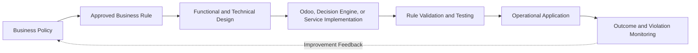
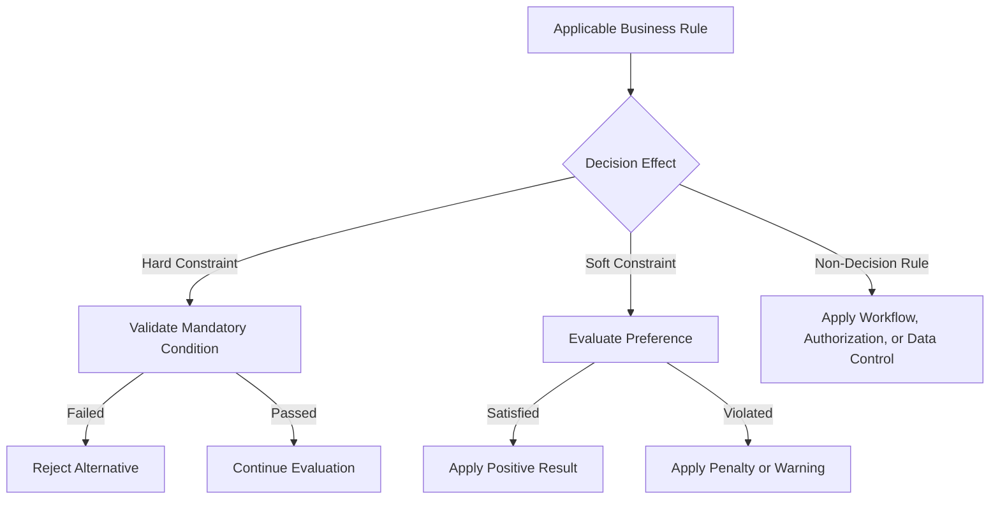
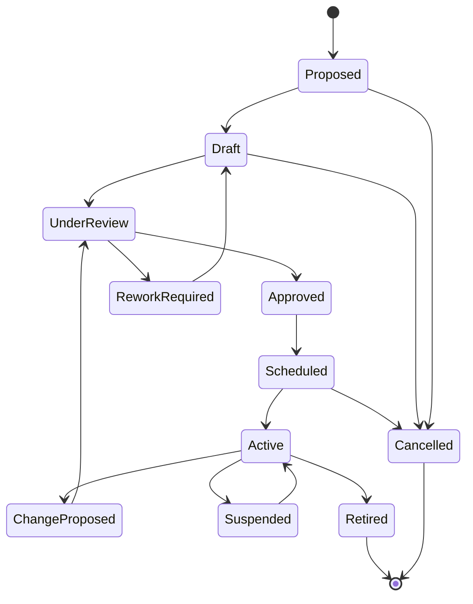
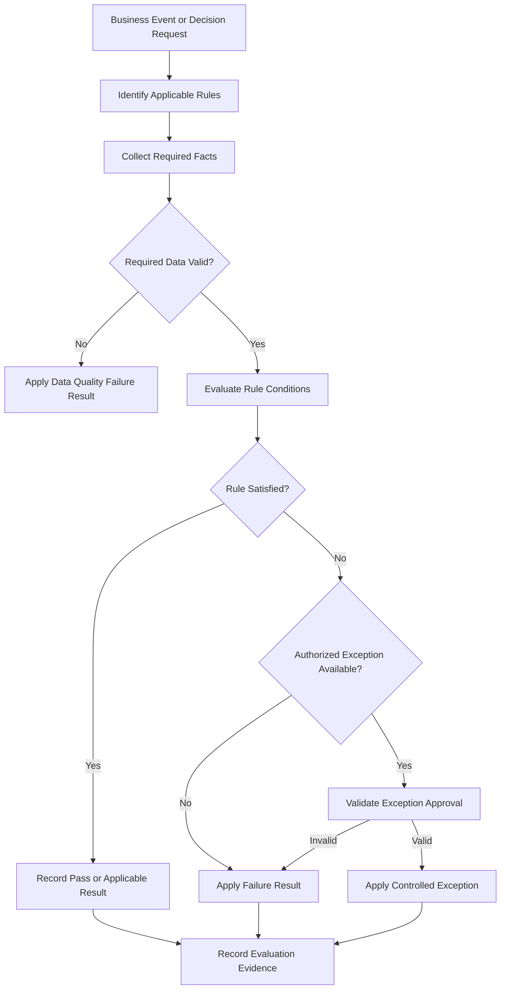
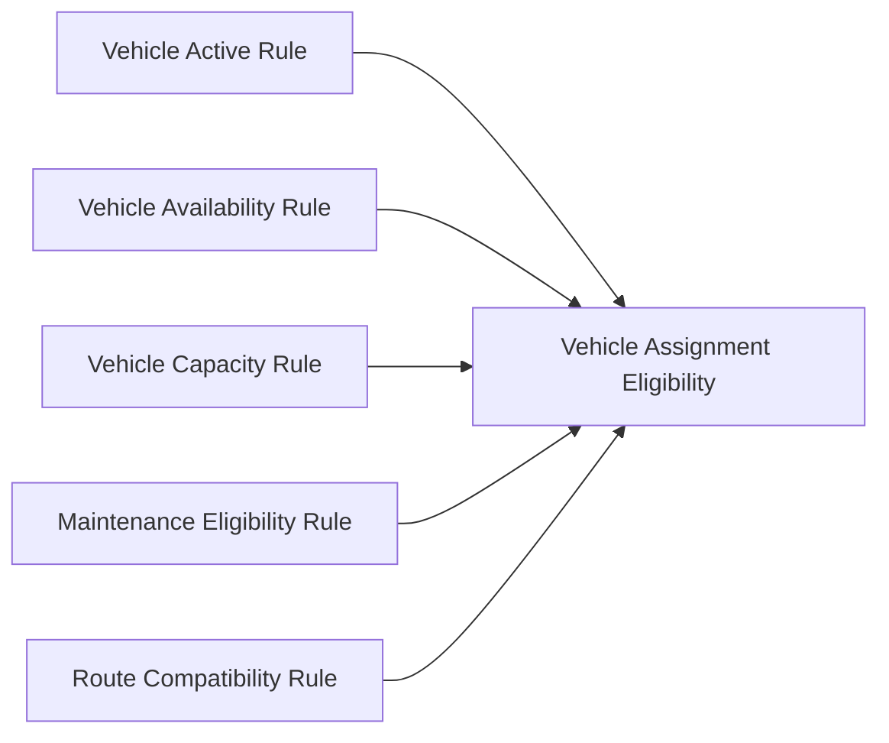
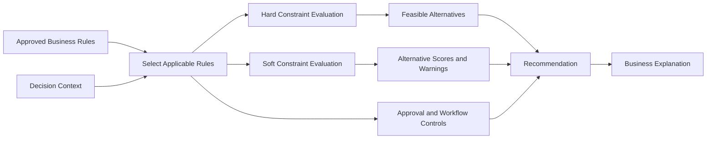
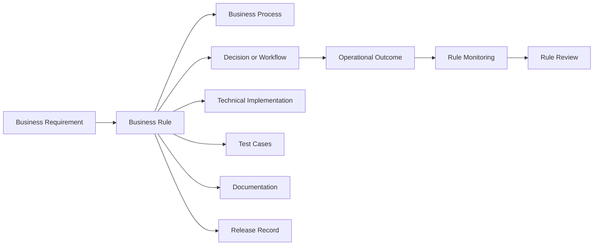

import DocumentInfo from '@site/src/components/DocumentInfo';

# Business Rules

<DocumentInfo
  category="Business"
  audience={['Executive', 'Business', 'Operations', 'Product', 'Technical', 'Data', 'Security']}
  status="Approved"
  version="1.0"
  owner="Business Architecture and Governance Teams"
  updated="July 2026"
  readingTime="15 min"
/>

## Purpose

Business Rules define the approved policies, conditions, obligations, prohibitions, calculations, classifications, and controls that govern SCOP operations.

They convert business policy into explicit and testable behavior.

Business Rules may control:

- Demand eligibility
- Inventory allocation
- Inventory ownership
- Warehouse operations
- Shipment formation
- Shipment consolidation
- Vehicle eligibility
- Driver eligibility
- Route and stop selection
- Trip planning
- Time-window compliance
- Capacity validation
- Plan approval
- Operational release
- Exception handling
- Returns
- Performance measurement
- Security and authorization

This page establishes the official SCOP framework for managing Business Rules throughout their lifecycle.

It does not provide the complete catalogue of all operational rules.

Detailed rules will be documented within domain specifications and controlled rule catalogues.

## Objectives

The Business Rules framework is designed to:

- Make business policies explicit.
- Remove hidden operational assumptions.
- Ensure consistent treatment of similar situations.
- Assign accountable ownership.
- Distinguish rules from technical implementation.
- Distinguish rules from constraints and objectives.
- Support automated and manual evaluation.
- Provide understandable failure and warning messages.
- Manage exceptions through authorization.
- Preserve rule-version history.
- Make rule changes traceable.
- Support testing and monitoring.
- Prevent AI or optimization behavior from overriding mandatory policy.
- Ensure decisions can explain which rules affected them.

## What Is a Business Rule?

A Business Rule is an approved statement that defines or constrains an aspect of business behavior.

A rule may state:

- What must happen
- What must not happen
- What may happen under defined conditions
- How something is classified
- How something is calculated
- Who may perform an action
- When an action requires approval
- What information is mandatory
- What response is required when a condition occurs

Example:

```text
A vehicle must not be assigned to overlapping released trips.
```

Another example:

```text
Customer-owned inventory must remain logically separated from company-owned inventory.
```

A Business Rule should be understandable without requiring the reader to inspect source code.

## Rule Characteristics

A valid Business Rule should be:

- Business-readable
- Unambiguous
- Owned
- Testable
- Traceable
- Versioned
- Applicable to a defined scope
- Associated with a result
- Associated with a severity
- Independent from a specific user interface
- Separate from implementation details

A rule should not be written only as:

```text
The system validates the record.
```

This statement does not identify:

- What is validated
- Under which conditions
- What result is required
- Whether the result blocks execution
- Who owns the policy

A more useful rule is:

```text
A movement demand must not become eligible for planning unless its source,
destination, product quantity, required date, and inventory owner are known.
```

## Business Rule and Implementation

Business Rules define required behavior.

Technical implementation determines how the platform enforces that behavior.



The rule must remain identifiable even when the implementation changes.

For example, the same rule may initially be enforced manually and later be enforced automatically without changing its business meaning.

## Rule and Constraint Distinction

Business Rules and constraints are related but not identical.

| Concept | Meaning |
| --- | --- |
| Business Rule | An approved statement governing business behavior |
| Constraint | A condition limiting the feasible alternatives available to a decision |
| Objective | A measure used to compare feasible alternatives |
| Configuration | A controlled value used to implement approved behavior |
| Validation | The act of checking data or behavior against a rule or condition |
| Procedure | A sequence of activities performed to complete work |

Example Business Rule:

```text
A trip must not exceed the assigned vehicle's approved weight capacity.
```

The corresponding planning constraint is:

```text
Planned trip weight <= Vehicle maximum approved weight
```

The Business Rule explains the business requirement.

The constraint represents how that rule limits planning alternatives.

## Rule and Objective Distinction

A rule determines what is required, prohibited, or permitted.

An objective determines which feasible alternative is preferable.

Example rule:

```text
A mandatory customer delivery window must not be violated.
```

Example objective:

```text
Among feasible plans, prefer the plan with the lowest expected transportation cost.
```

The Decision Engine must not violate a mandatory rule merely to improve an objective.

## Rule and Procedure Distinction

A rule defines required behavior.

A procedure defines how users or systems perform a process.

Example rule:

```text
Every inventory adjustment must include an approved reason.
```

Example procedure:

```text
The warehouse supervisor opens the adjustment, selects the reason,
reviews the quantities, and submits the adjustment for approval.
```

Procedures may change without changing the underlying rule.

## Rule and Configuration Distinction

Configuration values support the application of rules but do not replace rule documentation.

Example rule:

```text
A high-value inventory adjustment requires management approval.
```

Example configuration:

```text
High-value threshold = 50,000
```

The threshold may be configurable.

The business meaning, ownership, and approval requirement must remain documented as a rule.

## Rule Categories

SCOP Business Rules may be classified into several categories.

| Rule Category | Purpose |
| --- | --- |
| Eligibility Rule | Determines whether an object may enter a process |
| Validation Rule | Determines whether data or an action is acceptable |
| Calculation Rule | Defines how a value is calculated |
| Classification Rule | Assigns a controlled category or status |
| Authorization Rule | Determines who may perform or approve an action |
| Assignment Rule | Controls resource or object assignment |
| Capacity Rule | Controls weight, volume, pallet, unit, or compartment limits |
| Ownership Rule | Protects inventory or business ownership |
| Compatibility Rule | Controls which products, resources, or activities may be combined |
| Timing Rule | Controls dates, durations, deadlines, and time windows |
| Sequence Rule | Controls the required order of activities |
| Approval Rule | Determines when approval is required |
| Exception Rule | Defines permitted deviations and required controls |
| Notification Rule | Determines when a role must be informed |
| Retention Rule | Controls how long records must remain available |
| Measurement Rule | Defines KPI or performance calculation behavior |

One rule may relate to more than one category, but it should have one primary classification.

## Rule Domains

Every rule should belong to one primary business domain.

Primary domains include:

- Party and Location Management
- Product and Handling Management
- Procurement and Inbound Supply
- Customer and Demand Management
- Inventory and Ownership Management
- Warehouse Operations
- Shipment and Load Management
- Fleet and Driver Management
- Route and Trip Management
- Planning and Decision Management
- Execution and Exception Management
- Performance and Analytics
- Platform Governance and Administration

Cross-domain rules should have one accountable primary owner and identified participating domains.

## Rule Severity

Rule severity defines the effect of a rule evaluation.

| Severity | Meaning |
| --- | --- |
| Information | Provides relevant information without requiring user action |
| Warning | Identifies risk or preference violation but may permit continuation |
| Approval Required | Permits continuation only after authorized review |
| Blocking | Prevents the action until the condition is resolved |
| Critical | Prevents the action and requires immediate escalation or corrective control |

Severity must be determined by approved business policy.

Technical implementation must not silently reduce the severity of a mandatory rule.

## Mandatory and Advisory Rules

### Mandatory Rule

A Mandatory Rule must be satisfied unless an explicitly authorized exception exists.

Examples include:

- Vehicle capacity must not be exceeded.
- Inventory ownership must remain traceable.
- An inactive driver must not be assigned.
- A user must have approval authority before approving a plan.

### Advisory Rule

An Advisory Rule expresses a preference, recommendation, or operational warning.

Examples include:

- Prefer a vehicle already located at the departure warehouse.
- Warn when predicted utilization is below the target level.
- Prefer consolidation when service commitments remain protected.

An advisory rule must not be presented as mandatory unless formally approved as such.

## Hard and Soft Decision Constraints

Rules may result in hard or soft constraints within the Decision Engine.

### Hard Constraint

Violation makes the alternative infeasible during normal planning.

Examples include:

- Maximum vehicle weight
- Mandatory product compatibility
- Required driver qualification
- Mandatory delivery window
- Inventory ownership
- Non-overlapping released assignments

### Soft Constraint

Violation may be allowed but creates a penalty, warning, or approval requirement.

Examples include:

- Preferred vehicle
- Preferred departure time
- Preferred warehouse
- Target utilization
- Preferred route
- Preferred driver continuity



The business rule catalogue must identify whether a rule creates a hard constraint, soft constraint, workflow control, data validation, or another effect.

## Rule Structure

Every governed Business Rule should contain the following elements.

| Element | Description |
| --- | --- |
| Rule ID | Unique and stable identifier |
| Rule Name | Short business-readable name |
| Rule Statement | The approved rule expressed clearly |
| Purpose | The business reason for the rule |
| Primary Domain | The accountable business domain |
| Participating Domains | Other domains affected by the rule |
| Owner | Accountable business owner |
| Steward | Role maintaining the rule definition |
| Rule Category | Eligibility, validation, authorization, capacity, or another category |
| Severity | Information, warning, approval required, blocking, or critical |
| Trigger | Event or action causing evaluation |
| Scope | Records, users, locations, companies, or processes covered |
| Conditions | Facts evaluated by the rule |
| Result | Required outcome when conditions are met |
| Failure Result | Required outcome when the rule is not satisfied |
| Exception Policy | Whether and how exceptions are allowed |
| Evidence | Information retained to prove evaluation |
| Effective Date | Date the version becomes applicable |
| Expiration Date | Optional end date |
| Version | Approved rule version |
| Status | Draft, approved, active, suspended, retired, or another controlled state |
| Implementation References | Systems or modules enforcing the rule |
| Test References | Scenarios validating the rule |
| Related Documentation | Domain, workflow, decision, or release pages |

## Rule Identifier Standard

SCOP rules should use stable identifiers.

Recommended format:

```text
BR-{DOMAIN}-{NUMBER}
```

Examples:

```text
BR-PAR-001
BR-PRD-001
BR-PRC-001
BR-DMD-001
BR-INV-001
BR-WHS-001
BR-SHP-001
BR-FLT-001
BR-RTE-001
BR-PLN-001
BR-EXE-001
BR-ANA-001
BR-GOV-001
```

Suggested domain codes:

| Code | Domain |
| --- | --- |
| PAR | Party and Location |
| PRD | Product and Handling |
| PRC | Procurement and Inbound Supply |
| DMD | Customer and Demand |
| INV | Inventory and Ownership |
| WHS | Warehouse Operations |
| SHP | Shipment and Load |
| FLT | Fleet and Driver |
| RTE | Route and Trip |
| PLN | Planning and Decision |
| EXE | Execution and Exception |
| ANA | Performance and Analytics |
| GOV | Platform Governance and Administration |

Rule identifiers must not be reused after retirement.

## Rule Versioning

A rule's identifier represents the continuing business concept.

The version represents an approved definition of that concept.

Example:

```text
Rule ID: BR-FLT-004
Version: 1.2
```

A new version is required when changing:

- Rule statement
- Conditions
- Result
- Severity
- Scope
- Exception policy
- Ownership
- Effective date
- Decision effect
- Required evidence

Typographical corrections that do not change meaning may use a documented editorial correction according to governance policy.

## Example Rule Definition

```text
Rule ID: BR-FLT-001
Rule Name: Vehicle Assignment Availability
Rule Statement:
A vehicle must not be assigned to a trip when the vehicle is inactive,
under a blocking maintenance condition, or unavailable during any part of
the required assignment period.
Primary Domain:
Fleet and Driver Management
Category:
Assignment Rule
Severity:
Blocking
Trigger:
Trip vehicle assignment or planning evaluation
Conditions:
- Vehicle is active
- No blocking maintenance status exists
- Vehicle is available for the complete assignment period
- No conflicting released assignment exists
Result:
Vehicle remains an eligible assignment candidate.
Failure Result:
Vehicle is removed from feasible candidates and the reason is recorded.
Exception Policy:
No normal operational exception. Emergency use requires separate approved policy.
Evidence:
Vehicle status, maintenance status, availability period, assignment conflicts,
evaluation timestamp, and rule version.
```

## Rule Statement Pattern

Where practical, rule statements should use a clear structure:

```text
When [trigger or context],
if [conditions],
then [required result],
otherwise [failure result or required action].
```

Example:

```text
When a shipment is evaluated for consolidation,
if ownership, product compatibility, time windows, source and destination
relationships, and vehicle capacity remain valid,
then the shipment may be considered a consolidation candidate;
otherwise it must remain separate and the rejection reason must be recorded.
```

Not every rule must use the exact sentence pattern, but the meaning must remain explicit.

## Rule Lifecycle



### Proposed

A business need for a new rule or rule change has been identified.

### Draft

The rule is being defined, classified, and assessed.

### Under Review

Business, operational, product, technical, security, or data stakeholders review the rule as appropriate.

### Approved

The rule definition has been approved but may not yet be effective.

### Scheduled

The rule is approved for activation on a future date or release.

### Active

The rule is currently applicable.

### Suspended

The rule is temporarily prevented from normal application through authorized governance.

### Retired

The rule is no longer applicable to new operational activity.

Historical records must retain the applicable rule version.

## Rule Proposal

A rule proposal should identify:

- Business problem
- Proposed rule
- Business owner
- Domain
- Affected users
- Affected workflows
- Affected decisions
- Operational impact
- Data requirements
- Exception requirements
- Implementation impact
- Reporting impact
- Security impact
- Effective-date requirement

A rule should not be introduced solely as a technical request without a business owner.

## Rule Review

Rule review should confirm:

- The statement is understandable.
- The business purpose is valid.
- The authoritative owner is known.
- The scope is clear.
- Conditions are testable.
- The required result is clear.
- Severity is justified.
- Exceptions are controlled.
- Conflicts with existing rules are resolved.
- Data required for evaluation exists.
- Implementation is feasible.
- Historical and reporting impact is understood.
- User communication is sufficient.
- Required documentation is identified.

## Rule Approval

Approval authority depends on rule impact.

Potential approvers include:

- Business Domain Owner
- Operations Manager
- Product Owner
- Business Architecture
- Engineering Lead
- Security Owner
- Data Owner
- Decision Governance Owner
- Executive Management

High-impact rules require stronger approval.

Examples include rules affecting:

- Inventory ownership
- Customer commitments
- Safety
- Legal compliance
- Financial approval
- Autonomous execution
- Security access
- Decision Engine feasibility
- AI-assisted automation
- Data retention

## Rule Activation

Before activation, the following should be complete where applicable:

- Approved definition
- Approved effective date
- Implementation
- Configuration
- Test coverage
- Permission validation
- User communication
- Training
- Release notes
- Monitoring
- Fallback behavior
- Historical compatibility assessment

A rule must not be considered active only because related code was deployed.

Its approved effective date and operational readiness must also be satisfied.

## Rule Evaluation

Rule evaluation determines whether a rule applies and what result it produces.



Rule evaluation should record sufficient information to explain the result.

## Rule Evaluation Result

Possible evaluation results include:

| Result | Meaning |
| --- | --- |
| Not Applicable | Rule does not apply to the current context |
| Passed | Rule conditions are satisfied |
| Failed — Warning | Rule is not satisfied but continuation remains permitted |
| Failed — Approval Required | Continuation requires authorized approval |
| Failed — Blocking | Action or alternative is prohibited |
| Exception Applied | An authorized exception permits controlled continuation |
| Unable to Evaluate | Required data or service is unavailable |
| Suspended | Rule is temporarily not active under approved governance |

The result must not be reduced to a simple technical true or false when the business meaning requires more detail.

## Evaluation Evidence

Rule evaluation evidence may include:

- Rule ID
- Rule version
- Evaluation timestamp
- Business object
- Trigger
- Input facts
- Result
- Failure reason
- Severity
- Exception reference
- Approver
- Implementation component
- Correlation identifier
- Related decision or workflow

Evidence requirements should match operational and audit importance.

## Rule Dependencies

Some rules depend on other rules or definitions.

Example:

```text
Vehicle assignment eligibility may depend on:
- Vehicle active-status rule
- Vehicle availability rule
- Capacity rule
- Maintenance-status rule
- Route-restriction rule
```

Dependencies must remain explicit.

Circular rule dependencies must be avoided.



A composite rule may summarize several underlying rule results but must not hide which rule failed.

## Rule Priority and Conflict

Two rules may conflict when they require incompatible results for the same context.

Rule conflict resolution must not depend on undocumented technical ordering.

Conflict handling should consider:

1. Legal and safety obligations
2. Ownership and security controls
3. Mandatory business commitments
4. Approved exception policies
5. Domain-specific precedence
6. Effective dates and versions
7. Explicit governance decision

A rule should have an explicit priority only where business policy requires precedence.

Priority must not be used to hide unresolved contradictions.

## Rule Conflict Example

Rule A:

```text
Urgent customer demand should receive planning priority.
```

Rule B:

```text
A vehicle must not exceed approved capacity.
```

These rules are not genuine equals in conflict.

The capacity rule is mandatory.

Priority may influence selection only among feasible alternatives.

Therefore, urgent demand cannot justify exceeding capacity.

## Exception Management

A Business Rule exception is an authorized deviation from the normal rule result.

An exception must not be the same as ignoring a rule.

An approved exception should define:

- Rule ID and version
- Business object or scope
- Reason
- Requesting user
- Approving authority
- Start time
- End time
- Conditions
- Risk
- Required mitigation
- Evidence
- Outcome
- Review requirement

## Exception Types

| Exception Type | Description |
| --- | --- |
| One-Time Exception | Applies to one identified business object or action |
| Time-Bound Exception | Applies during an approved period |
| Scope-Bound Exception | Applies to defined locations, products, customers, or processes |
| Emergency Exception | Applies to an urgent situation under enhanced review |
| Policy Exception | A formally approved exception to an established policy |
| No Exception Permitted | The rule cannot be bypassed through normal business authority |

## Exception Principles

- Exceptions require explicit authority.
- Exceptions must be traceable.
- Exceptions must be limited in scope and duration.
- Exceptions must not silently become permanent policy.
- Repeated exceptions may indicate that the rule requires review.
- Some rules must permit no normal exception.
- Exception approval must not be performed by unauthorized technical users.
- Exception evidence must remain linked to the affected decision or transaction.

## Rule Overrides

An override occurs when an authorized user changes the outcome produced by a rule-supported recommendation or workflow.

The platform should retain:

- Original result
- Rule evaluations
- User making the override
- Override reason
- Final result
- Approval
- Operational outcome

An override does not necessarily mean the rule was wrong.

It may indicate:

- Missing information
- Exceptional operating conditions
- Incorrect master data
- A permitted exception
- A rule-design issue
- A local fact not available to the system

## Rule Application Layers

Business Rules may be applied in several layers.

| Layer | Examples |
| --- | --- |
| Master Data | Required product, location, vehicle, or partner attributes |
| Transaction Validation | Order, receipt, shipment, trip, or adjustment validation |
| Workflow | State transitions and approvals |
| Decision Engine | Eligibility, hard constraints, soft constraints, and explanations |
| AI Platform Boundary | Prevention of AI output overriding mandatory rules |
| Integration | Request validation, ownership, authorization, and mapping |
| Reporting | KPI definitions and classification |
| Security | Role, permission, and approval authority |

The same business policy may require coordinated enforcement at more than one layer.

There must still be one authoritative rule definition.

## Odoo 17 Application

Odoo may enforce Business Rules through supported mechanisms such as:

- Model constraints
- Server-side validations
- Workflow actions
- Access-control rules
- Record rules
- Required fields
- Computed values
- Approval states
- Configuration
- Scheduled validations
- Controlled custom modules

User-interface restrictions alone are not sufficient enforcement for mandatory rules.

Direct modification of Odoo core files must not be used as the normal rule-implementation method.

## Decision Engine Application

The Decision Engine uses approved rules to:

- Determine eligibility
- Apply hard constraints
- Apply soft constraints
- Generate alternatives
- Reject infeasible alternatives
- Rank feasible alternatives
- Produce warnings
- Explain recommendations
- Identify unplanned demand
- Trigger approval requirements



The Decision Engine must identify which rules caused:

- Candidate rejection
- Warning
- Penalty
- Required approval
- Unplanned-demand result

## AI Platform Boundary

The AI Platform may provide:

- Predictions
- Forecasts
- Rankings
- Risk indicators
- Confidence
- Explanations
- Anomaly indicators

AI output does not replace approved Business Rules.

Example:

```text
An AI model may predict that a vehicle can probably complete the route,
but it cannot override an expired vehicle permit or mandatory capacity rule.
```

The Decision Engine remains responsible for applying the rules governing the final business recommendation.

## Rules and Data Quality

A rule cannot be reliably evaluated when required facts are missing or invalid.

Every rule should identify:

- Required data
- Authoritative source
- Freshness requirement
- Validity requirement
- Behavior when data is missing
- Behavior when data is inconsistent

Possible outcomes include:

- Block evaluation
- Return unable to evaluate
- Use an approved conservative fallback
- Require manual confirmation
- Generate a warning
- Escalate a data-quality issue

Missing data must not automatically be interpreted as rule satisfaction.

## Rule Testing

Every active automated rule should have test coverage appropriate to its risk.

Test scenarios should include:

- Rule applies and passes
- Rule applies and fails
- Rule does not apply
- Boundary values
- Missing data
- Invalid data
- Authorized exception
- Unauthorized exception
- Conflicting rule
- Correct severity
- Correct explanation
- Correct audit evidence
- Correct effective-date behavior
- Previous rule-version behavior where relevant

## Rule Test Case Structure

A rule test case should identify:

| Element | Description |
| --- | --- |
| Test ID | Unique test identifier |
| Rule ID and Version | Rule being validated |
| Scenario | Business situation |
| Preconditions | Required starting state |
| Input Facts | Data used during evaluation |
| Expected Applicability | Whether the rule should apply |
| Expected Result | Pass, warning, blocking, or another result |
| Expected Explanation | Business-readable reason |
| Expected Evidence | Records or audit information |
| Actual Result | Observed result |
| Status | Pass, fail, blocked, or not executed |

## Example Test Scenarios

Rule:

```text
A trip must not exceed the assigned vehicle's approved weight capacity.
```

Test scenarios:

| Scenario | Vehicle Capacity | Trip Weight | Expected Result |
| --- | ---: | ---: | --- |
| Below capacity | 1,000 kg | 800 kg | Passed |
| Equal to capacity | 1,000 kg | 1,000 kg | Passed |
| Above capacity | 1,000 kg | 1,001 kg | Blocking failure |
| Capacity missing | Not available | 800 kg | Unable to evaluate or blocking data-quality result |
| Invalid negative capacity | -1 kg | 800 kg | Data-quality failure |

## Rule Monitoring

Active rules should be monitored where operationally important.

Potential measures include:

- Evaluation count
- Pass rate
- Failure rate
- Warning rate
- Exception rate
- Override rate
- Unable-to-evaluate rate
- Data-quality blockage rate
- Most common failure reasons
- Operational outcomes after exceptions
- Rules with no recent evaluation
- Rules causing repeated operational delay

Monitoring should help identify:

- Incorrect rules
- Outdated rules
- Poor data quality
- Misconfigured severity
- Excessive exceptions
- Unexpected implementation behavior
- Training requirements

## Rule Effectiveness

A technically functioning rule may still be ineffective.

Rule effectiveness should consider:

- Whether it achieves its business purpose
- Whether it prevents the intended risk
- Whether users understand it
- Whether failure messages are useful
- Whether exceptions are reasonable
- Whether operational cost is proportionate
- Whether the rule creates unintended behavior
- Whether related KPIs improve
- Whether the rule conflicts with real operating conditions

## Rule Change Management

A proposed rule change should identify:

- Existing rule
- Proposed change
- Business reason
- Impacted domains
- Impacted workflows
- Impacted decisions
- Impacted integrations
- Data impact
- Security impact
- Historical impact
- Test impact
- Documentation impact
- Effective date
- Migration or transition requirements

Rule changes must follow controlled release management.

## Effective Dates

Rules may have future effective dates.

The platform should distinguish:

- Approval date
- Deployment date
- Effective date
- Expiration date
- Retirement date

A rule may be technically deployed before its business effective date.

Historical evaluation must use the version applicable at the time of the relevant business activity where required.

## Rule Retirement

A rule may be retired when:

- The policy no longer applies.
- The related process is removed.
- The rule is replaced.
- A legal or business requirement changes.
- The rule has become redundant.
- The governed capability is retired.

Retirement must identify:

- Retirement reason
- Replacement rule where applicable
- Effective retirement date
- Historical impact
- Implementation deactivation
- Documentation update
- Communication
- Approval

Retired rule identifiers must not be reused.

## Rule Audit Trail

The Business Rule audit trail should include:

- Proposal
- Draft versions
- Reviews
- Approvals
- Effective dates
- Implementation references
- Test results
- Activations
- Suspensions
- Exceptions
- Overrides
- Changes
- Retirements

Historical decision and operational records should retain the rule version used during evaluation.

## Rule Catalogue

SCOP should maintain a governed Business Rule Catalogue.

The catalogue should support:

- Rule identification
- Search by domain
- Search by category
- Search by severity
- Search by owner
- Search by status
- Version history
- Effective dates
- Rule dependencies
- Implementation references
- Test references
- Exception policies
- Related decisions and workflows

The catalogue may eventually be implemented through a controlled system, repository, or Odoo capability.

This page defines the information model, not the technical implementation.

## Rule Traceability

A rule should be traceable across the delivery lifecycle.



Traceability should allow stakeholders to answer:

- Why does this rule exist?
- Who approved it?
- Where is it applied?
- How is it tested?
- Which decisions used it?
- Which version was active?
- What happens when it fails?
- Are exceptions permitted?
- Is the rule effective?

## Rule Ownership

### Business Owner

The Business Owner is accountable for:

- Business purpose
- Policy meaning
- Severity
- Exception policy
- Approval
- Periodic review

### Rule Steward

The Rule Steward is responsible for:

- Maintaining the definition
- Coordinating reviews
- Managing metadata
- Ensuring documentation remains current
- Monitoring open changes

### Product Owner

The Product Owner coordinates how the rule affects product behavior and delivery scope.

### Technical Owner

The Technical Owner is responsible for correct implementation, testing, monitoring, and support.

### Data Owner

The Data Owner is responsible for authoritative facts required during evaluation.

### Operations Owner

The Operations Owner confirms that the rule works appropriately within real operating processes.

One person may hold more than one role in a small organization, but responsibilities must remain explicit.

## Separation of Duties

High-impact rules should use appropriate separation of responsibility.

Examples:

- The developer implementing a rule should not be the only person approving its business meaning.
- A user requesting a sensitive exception should not always approve the same exception.
- A technical administrator should not independently change mandatory business policy.
- AI model owners should not independently remove business-rule controls.

## Periodic Rule Review

Rules should be reviewed according to risk.

Review frequency may be:

- Event-driven
- Quarterly
- Semiannual
- Annual
- Before a major release
- Following a material incident
- Following repeated overrides
- Following legal or policy change

The review should confirm:

- Rule remains necessary.
- Statement remains accurate.
- Ownership remains valid.
- Severity remains appropriate.
- Data remains available.
- Implementation remains correct.
- Exceptions remain controlled.
- Monitoring remains active.
- Documentation remains current.

## Example Domain Rules

### Party and Location

```text
BR-PAR-001:
An inactive operational location must not be used as the source or destination
of newly created movement demand.
```

### Product and Handling

```text
BR-PRD-001:
A product requiring temperature control must not be assigned to a vehicle or
compartment that lacks the required approved temperature capability.
```

### Procurement

```text
BR-PRC-001:
Expected supplier quantity must not be represented as physically available
inventory before receipt validation.
```

### Customer and Demand

```text
BR-DMD-001:
Cancelled demand must not remain eligible for planning.
```

### Inventory and Ownership

```text
BR-INV-001:
Customer-owned inventory must remain logically distinguishable from
company-owned inventory at every stock location.
```

### Warehouse Operations

```text
BR-WHS-001:
Products must not be confirmed as loaded until the related warehouse loading
operation has recorded the actual loaded quantity.
```

### Shipment and Load

```text
BR-SHP-001:
Shipments must not be consolidated when mandatory product compatibility,
ownership, capacity, or customer service requirements would be violated.
```

### Fleet and Driver

```text
BR-FLT-001:
A vehicle or driver must not be assigned to overlapping released trips.
```

### Route and Trip

```text
BR-RTE-001:
A delivery stop must not be sequenced before the pickup or loading activity
required to supply that delivery.
```

### Planning and Decision

```text
BR-PLN-001:
A recommended plan must not be operationally released until an authorized user
has approved it.
```

### Execution and Exception

```text
BR-EXE-001:
A failed or partially completed stop must include an approved outcome reason.
```

### Performance and Analytics

```text
BR-ANA-001:
A KPI result must identify the approved formula version and measurement period.
```

### Governance and Administration

```text
BR-GOV-001:
User-interface visibility must not be treated as sufficient authorization for
a controlled business action.
```

## Business Rule KPIs

Potential Business Rule governance measures include:

- Percentage of active rules with approved owners
- Percentage of active rules with test coverage
- Percentage of active rules with implementation references
- Rule failure rate
- Rule exception rate
- Rule override rate
- Unable-to-evaluate rate
- Rules with missing data dependencies
- Rules overdue for review
- Rules without monitoring
- Conflicting-rule incidents
- Unauthorized exception attempts
- Rule-related production defects
- Average time to approve rule changes
- Percentage of decisions with complete rule evidence

Exact formulas and targets will be defined through later governance specifications.

## Architecture Boundaries

This page defines:

- Business Rule concepts
- Rule categories
- Rule structure
- Rule identifiers
- Rule versions
- Rule lifecycle
- Rule evaluation
- Severity
- Constraints
- Exceptions
- Overrides
- Testing
- Monitoring
- Change management
- Governance
- Traceability

It does not define:

- The complete Business Rule Catalogue
- Detailed Odoo model fields
- A technical rules-engine implementation
- Source code
- API contracts
- Database schemas
- Individual rule test scripts
- Every domain rule
- Exact approval workflows
- Detailed user-interface design
- Full legal or regulatory policy

Those subjects will be documented in domain, functional, decision, development, and governance specifications.

## Summary

Business Rules convert SCOP policy into explicit, testable, traceable, and governed behavior.

Every important rule should have a stable identifier, clear statement, business purpose, owner, scope, severity, result, exception policy, version, implementation references, and test evidence.

Rules must remain separate from technical implementation, configuration, procedures, decision objectives, and AI predictions.

The Supply Chain Decision Engine applies approved rules and constraints, but it does not own the underlying business policies.

The AI Platform may support decisions with predictions and intelligence, but it must not override mandatory Business Rules.

The central principle is that no important operational control should depend on undocumented assumptions, hidden code, uncontrolled configuration, or individual memory.

## Related Pages

- [Documentation Design System](../getting-started/documentation-design-system.mdx)
- [Product Blueprint](../product/product-blueprint.mdx)
- [Business Architecture](./business-architecture.mdx)
- [Business Domains](./business-domains.mdx)
- [Supply Chain Operating Model](../operations/supply-chain-operating-model.mdx)
- [Supply Chain Decision Engine](../decision-engine/supply-chain-decision-engine.mdx)
- [AI Platform Overview](../ai-platform/ai-platform-overview.mdx)
- [Development Overview](../development/development-overview.mdx)
- Business Rule Catalogue
- Decision Rules
- Exception Management
- Approval Framework
- Data Quality Framework
- Security and Authorization
