import DocumentInfo from '@site/src/components/DocumentInfo';

# Supply Chain Decision Engine

<DocumentInfo
  category="Decision Engine"
  audience={['Executive', 'Business', 'Operations', 'Product', 'Technical', 'Data']}
  status="Approved"
  version="1.0"
  owner="Decision Intelligence Team"
  updated="July 2026"
  readingTime="15 min"
/>

## Purpose

The Supply Chain Decision Engine defines how SCOP transforms operational data into recommended supply chain actions.

It evaluates business demand, inventory, warehouse readiness, vehicles, drivers, routes, locations, time windows, capacities, priorities, costs, and operational policies to determine feasible and beneficial courses of action.

The engine supports decisions such as:

- Which demands are ready for planning
- Which shipments should be consolidated
- Which warehouse should fulfil a requirement
- Whether products should be stored or cross-docked
- Which vehicle should execute a trip
- Which driver should be assigned
- Which route or stop sequence should be used
- When a trip should depart
- Which demand should receive priority
- Which requirements cannot currently be planned
- When replanning is required

In the initial SCOP releases, the engine produces recommendations. Authorized users remain responsible for reviewing, modifying, approving, and releasing operational plans.

## Decision Engine Objectives

The Decision Engine is designed to:

- Coordinate decisions across multiple business domains.
- Apply business rules consistently.
- Prevent infeasible resource assignments.
- Respect vehicle, driver, inventory, warehouse, and time constraints.
- Improve vehicle and trip utilization.
- Support shipment and load consolidation.
- Reduce unnecessary distance, delay, handling, and operating cost.
- Protect customer commitments and delivery time windows.
- Identify demand that cannot be planned.
- Explain the primary reasons behind each recommendation.
- Preserve human accountability.
- Record recommendations, approvals, overrides, and outcomes.
- Improve decision quality using measured execution results.

## Decision-Driven Operating Model

SCOP treats important operational actions as decisions rather than isolated system transactions.

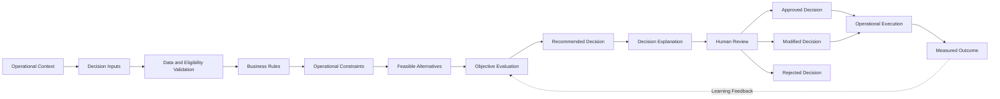

A decision is complete only when its operational outcome is known or an approved exception closes it.

## Decision Objects

A Decision Object represents a structured operational decision managed by SCOP.

Each Decision Object should contain:

| Element | Description |
| --- | --- |
| Decision ID | Unique identifier for the decision |
| Decision Type | The operational category of the decision |
| Context | The situation that requires a decision |
| Inputs | The operational data used during evaluation |
| Rules | Mandatory business policies |
| Constraints | Conditions that limit feasible alternatives |
| Alternatives | Candidate actions considered by the engine |
| Objectives | Measures used to compare feasible alternatives |
| Recommendation | The alternative proposed by the engine |
| Explanation | The primary reasons supporting the recommendation |
| Confidence | An optional indication of recommendation reliability |
| Status | The current state of the decision |
| Reviewer | The authorized user reviewing the recommendation |
| Final Decision | The approved, modified, or manually selected action |
| Execution Reference | The related trip, shipment, warehouse activity, or other operational record |
| Outcome | The measured execution result |
| Audit History | The record of generation, review, changes, approval, and completion |

A Decision Object must remain traceable from recommendation through outcome.

## Decision Types

The initial Decision Engine may manage the following decision types.

| Decision Type | Purpose |
| --- | --- |
| Demand Eligibility | Determine whether movement demand is ready for planning |
| Inventory Source Selection | Select the inventory or warehouse source |
| Warehouse Selection | Determine the most appropriate fulfilment or processing warehouse |
| Cross-Dock Decision | Determine whether goods should bypass long-term storage |
| Shipment Formation | Group products into transportable shipment units |
| Shipment Consolidation | Combine compatible shipments |
| Vehicle Assignment | Select a feasible and suitable vehicle |
| Driver Assignment | Select an available and authorized driver |
| Route Selection | Select a reusable route or generate an operational path |
| Stop Sequencing | Determine the order of trip stops |
| Trip Formation | Create one or more feasible trips |
| Departure Scheduling | Determine planned trip departure times |
| Priority Handling | Determine which demands should be planned first |
| Replanning Decision | Determine how to respond to changed operational conditions |
| Exception Resolution | Recommend corrective actions for operational exceptions |

Decision types may be extended through later releases without changing the core decision model.

## Decision Scope

### Included in the Initial Scope

The initial Decision Engine scope includes:

- Daily operational planning
- Movement demand eligibility
- Inventory availability validation
- Warehouse readiness consideration
- Shipment compatibility
- Shipment consolidation
- Vehicle capacity validation
- Vehicle availability validation
- Driver availability validation
- Route compatibility
- Multi-stop trip formation
- Pickup and delivery sequencing
- Customer time-window consideration
- Cross-dock opportunities
- Inter-warehouse transfer consideration
- Priority handling
- Feasibility validation
- Recommendation generation
- Recommendation explanation
- Human review and approval
- Manual modification
- Decision traceability
- Outcome measurement

### Outside the Initial Scope

The initial Decision Engine does not include:

- Fully autonomous dispatch without human approval
- Real-time traffic-based continuous rerouting
- Autonomous procurement negotiation
- Dynamic commercial pricing
- Predictive vehicle maintenance
- Uncontrolled machine learning decisions
- Real-time telematics-based driver monitoring
- Public optimization APIs
- Automated decisions without traceable inputs and rules

These capabilities may be introduced through controlled future releases.

## Decision Inputs

The engine requires complete and reliable operational inputs.

### Demand Inputs

- Demand type
- Source location
- Destination location
- Products and quantities
- Required date
- Time window
- Priority
- Customer or inventory owner
- Handling requirements
- Service requirements
- Current status

### Inventory Inputs

- Available quantity
- Reserved quantity
- Forecasted availability
- Physical location
- Inventory ownership
- Lot or batch details
- Expiration constraints
- Existing allocations
- Expected inbound receipts

### Warehouse Inputs

- Warehouse location
- Operating hours
- Inventory readiness
- Picking status
- Staging status
- Loading capacity
- Cross-dock capacity
- Expected handling time
- Operational restrictions

### Vehicle Inputs

- Vehicle type
- Weight capacity
- Volume capacity
- Pallet or unit capacity
- Compartment configuration
- Temperature capability
- Current and expected location
- Availability
- Maintenance status
- Route restrictions
- Operating cost data

### Driver Inputs

- Availability
- Qualifications
- Licence validity
- Working-time limits
- Current or expected location
- Existing assignments
- Operational restrictions

### Route and Location Inputs

- Route definitions
- Location coordinates where available
- Travel distances
- Expected travel durations
- Stop service durations
- Location operating hours
- Access restrictions
- Customer time windows

### Planning Inputs

- Planning date
- Existing approved commitments
- Planning horizon
- Operational priorities
- Cost assumptions
- Service objectives
- Utilization objectives
- Approved rules and constraints

Missing or invalid critical inputs must prevent the engine from presenting an infeasible recommendation as valid.

## Data Validation

The engine must validate input data before decision processing.

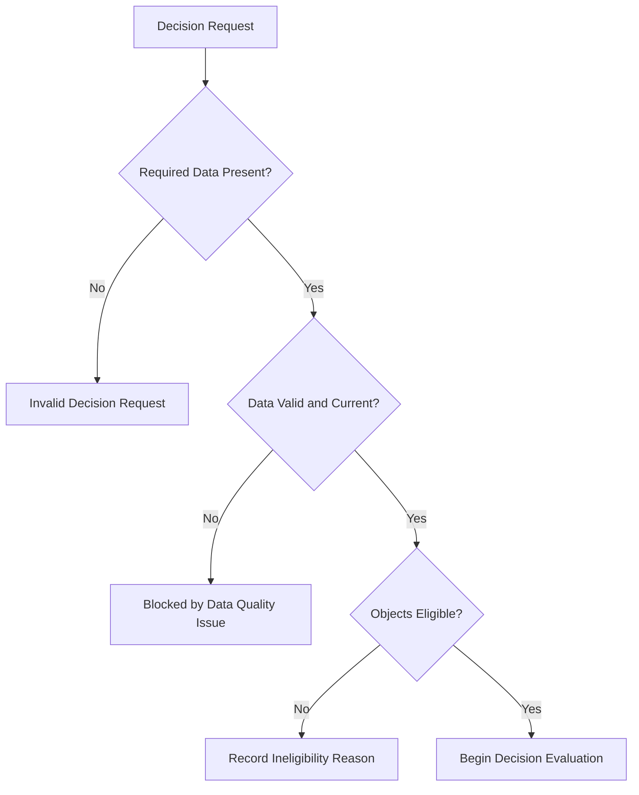

Validation should identify:

- Missing required values
- Invalid locations
- Invalid or inactive resources
- Conflicting assignments
- Impossible quantities
- Inconsistent ownership
- Expired qualifications or documents
- Outdated operational status
- Missing capacity dimensions
- Invalid time windows
- Unsupported product combinations

The result must distinguish between:

- Valid
- Valid with warnings
- Ineligible
- Blocked by data quality
- Blocked by configuration
- Blocked by operational conflict

## Business Rules

Business rules define mandatory or controlled business behavior.

Examples include:

- Customer-owned inventory must remain logically separate from company-owned inventory.
- An inactive vehicle must not be assigned.
- A driver with an expired required licence must not be assigned.
- A mandatory delivery time window must not be violated.
- A trip must not exceed approved vehicle capacity.
- Product compatibility restrictions must be respected.
- A released trip must not be changed without authorization.
- A cross-dock recommendation must satisfy timing and handling requirements.
- An approved plan must identify the approving user.
- Unplanned demand must include a reason.

Each rule should include:

| Element | Description |
| --- | --- |
| Rule ID | Unique business rule identifier |
| Name | Clear rule name |
| Purpose | Business reason for the rule |
| Domain | Responsible business area |
| Trigger | Event or condition that activates the rule |
| Conditions | Criteria evaluated by the rule |
| Result | Required engine behavior |
| Severity | Information, warning, blocking, or critical |
| Exceptions | Authorized exceptions, if any |
| Owner | Accountable business owner |
| Version | Current approved rule version |
| Effective Date | Date from which the rule applies |

Example rule identifiers:

```text
BR-DEC-001
BR-PLN-001
BR-FLT-001
BR-DRV-001
BR-WHS-001
BR-TRP-001
BR-INV-001
```

## Constraints

Constraints define the limits within which a feasible decision must operate.

### Hard Constraints

Hard constraints must not be violated during normal planning.

Examples include:

- Vehicle maximum weight
- Vehicle maximum volume
- Mandatory product compatibility
- Vehicle availability
- Driver availability
- Non-overlapping resource assignments
- Mandatory customer time windows
- Required handling conditions
- Valid inventory ownership
- Valid source inventory
- Legal or operational vehicle restrictions

A candidate violating a hard constraint is infeasible.

### Soft Constraints

Soft constraints represent preferences or conditions that may be violated with a measurable penalty or authorized exception.

Examples include:

- Preferred delivery time
- Preferred vehicle
- Preferred route
- Target capacity utilization
- Preferred warehouse
- Customer service preference
- Preferred driver continuity
- Target trip duration

Soft-constraint violations must be visible in the recommendation explanation.

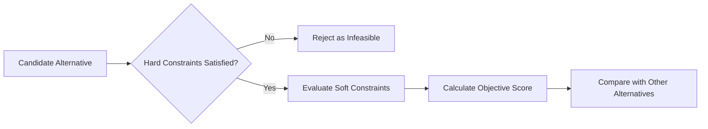

## Optimization Objectives

The engine may evaluate feasible alternatives using multiple objectives.

| Objective | Intended Result |
| --- | --- |
| Service Compliance | Protect required dates and time windows |
| Demand Coverage | Plan the highest appropriate amount of eligible demand |
| Capacity Utilization | Improve use of available vehicle capacity |
| Trip Reduction | Reduce unnecessary trips |
| Distance Reduction | Reduce unnecessary travel distance |
| Duration Reduction | Reduce avoidable travel and waiting time |
| Cost Reduction | Reduce operational transportation and handling cost |
| Consolidation | Combine compatible shipments beneficially |
| Warehouse Coordination | Align plans with picking, staging, loading, and cross-dock readiness |
| Resource Balance | Avoid excessive dependence on specific vehicles or drivers |
| Priority Protection | Ensure urgent and high-priority demand is handled appropriately |
| Risk Reduction | Reduce plans with a high likelihood of failure or delay |

Objectives may conflict.

For example, maximizing capacity utilization may increase trip duration or threaten a time window. The engine must apply approved priorities and weights rather than optimizing one measure in isolation.

## Objective Hierarchy

The initial decision hierarchy should generally follow this order:

1. Safety, legal, ownership, and mandatory operational compliance
2. Feasibility
3. Mandatory customer commitments
4. Priority and service protection
5. Demand coverage
6. Resource availability
7. Capacity utilization
8. Distance, time, and cost efficiency
9. Operational preferences

This hierarchy may be configured according to approved business policy.

The engine must not reduce mandatory compliance merely to improve cost or utilization.

## Feasible Alternatives

The engine should generate or evaluate multiple alternatives when operationally practical.

For a vehicle assignment decision, alternatives may include:

- Assign Vehicle A to Trip 1
- Assign Vehicle B to Trip 1
- Split the shipment across two vehicles
- Consolidate the shipment with another trip
- Delay the demand within the allowed service period
- Mark the demand as unplanned because no feasible vehicle exists

For each alternative, the engine should identify:

- Feasibility
- Constraint violations
- Expected service result
- Capacity utilization
- Expected duration
- Expected cost
- Operational risks
- Advantages and disadvantages

## Recommendation Generation

Recommendation generation should follow a controlled sequence.

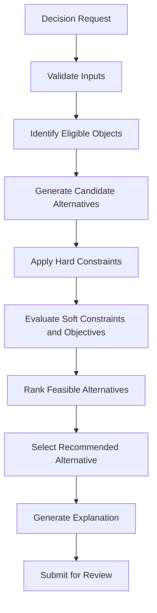

The recommendation should contain:

- Recommended action
- Related business objects
- Selected resources
- Planned dates and times
- Applied rules
- Satisfied constraints
- Relevant soft-constraint penalties
- Expected benefits
- Known risks
- Alternative options where useful
- Reason for unplanned or rejected demand
- Confidence or reliability indication where available

## Vehicle Assignment

Vehicle Assignment selects a suitable vehicle for a proposed trip or load.

The engine must evaluate:

- Vehicle availability
- Current and expected vehicle location
- Weight capacity
- Volume capacity
- Pallet or unit capacity
- Compartment requirements
- Temperature requirements
- Product compatibility
- Route restrictions
- Expected trip duration
- Existing assignments
- Operating cost
- Remaining capacity
- Loading accessibility

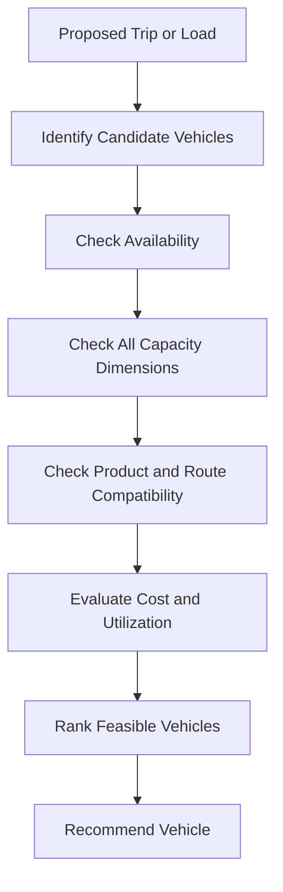

The explanation should state why the selected vehicle is preferable and why significant alternatives were rejected.

## Driver Assignment

Driver Assignment selects an available and authorized driver.

The engine must evaluate:

- Driver availability
- Existing trip assignments
- Required qualifications
- Licence validity
- Working-time limits
- Departure location
- Expected trip duration
- Approved restrictions
- Operational continuity preferences

A driver must not be assigned to overlapping trips.

The recommendation should identify any shortage of qualified drivers.

## Shipment Consolidation

Shipment Consolidation determines whether compatible shipments should share a load or trip.

The engine must consider:

- Origin compatibility
- Destination compatibility
- Route compatibility
- Required dates
- Time windows
- Product compatibility
- Inventory ownership
- Handling requirements
- Vehicle capacity
- Stop sequence
- Additional distance
- Additional duration
- Customer service impact
- Warehouse readiness
- Cost and utilization benefit

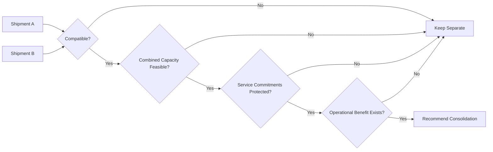

Available capacity alone is not sufficient justification for consolidation.

## Warehouse Selection

Warehouse Selection determines the most appropriate inventory or processing location.

The engine may evaluate:

- Inventory availability
- Inventory ownership
- Warehouse operating hours
- Picking and staging readiness
- Distance to destinations
- Transfer requirements
- Cross-dock capacity
- Warehouse workload
- Product handling capability
- Expected fulfilment time
- Transportation cost
- Service risk

The recommendation must preserve inventory ownership and fulfilment traceability.

## Cross-Dock Decision

A Cross-Dock Decision determines whether inbound products should move directly toward outbound execution rather than normal storage.

The engine must confirm:

- Products are identified and allocated.
- Inbound timing is sufficiently reliable.
- Outbound timing is operationally compatible.
- Inspection requirements can be completed.
- Temporary staging is available.
- Product handling conditions are supported.
- Ownership remains traceable.
- The decision produces an operational benefit.
- The risk of outbound disruption remains acceptable.

Possible decisions include:

- Store normally
- Cross-dock directly
- Cross-dock after inspection
- Cross-dock partially
- Delay decision until inbound confirmation
- Reject cross-dock because requirements are not satisfied

## Route Selection and Stop Sequencing

Route Selection and Stop Sequencing determine how a trip should visit its required locations.

The engine must consider:

- Source location
- Destination locations
- Pickup-before-delivery dependencies
- Time windows
- Service durations
- Vehicle capacity changes after each stop
- Route restrictions
- Warehouse operating hours
- Estimated travel times
- Stop priorities
- Product loading and unloading sequence
- Existing route definitions
- Operational risk

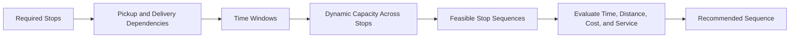

The engine must not schedule a delivery before its required pickup or loading activity.

## Dynamic Capacity

Vehicle load changes during a multi-stop trip.

The engine must calculate capacity after every stop.

Example:

```text
Departure Load: 800 kg
Stop 1 Delivery: -200 kg
Stop 2 Pickup: +300 kg
Stop 3 Delivery: -400 kg
Remaining Load: 500 kg
```

A trip is feasible only when capacity remains within all mandatory limits throughout the complete sequence.

Capacity should not be checked only at departure.

## Time-Window Evaluation

The engine must calculate:

- Planned arrival
- Earliest permitted service time
- Waiting time
- Service start
- Service duration
- Planned departure
- Travel time to the next stop
- Latest permitted arrival or completion
- Expected delay risk

Possible time-window results include:

| Result | Meaning |
| --- | --- |
| Compliant | The planned service is within the permitted window |
| Early with Waiting | The vehicle arrives early and waits before service |
| Preferred Window Missed | A preference is missed without violating a mandatory commitment |
| At Risk | The plan is feasible but has limited time tolerance |
| Violated | A mandatory time window cannot be satisfied |

A mandatory violation must make the alternative infeasible unless an authorized exception is explicitly applied.

## Priority Handling

Priority should influence planning without silently overriding mandatory constraints.

Priority factors may include:

- Customer commitment
- Demand urgency
- Product sensitivity
- Operational deadline
- Existing delay
- Customer service classification
- Warehouse or supplier dependency
- Management-approved exception
- Business impact

The engine should explain why a higher-priority demand was selected before another demand.

## Unplanned Demand

Not all eligible demand may fit within the available operational capacity.

Unplanned demand must include a clear reason.

Examples include:

- No available inventory
- Warehouse not ready
- No feasible vehicle
- No qualified driver
- Capacity shortage
- Time-window conflict
- Product incompatibility
- Route restriction
- Missing required data
- Customer location unavailable
- Planning horizon exceeded
- Lower priority than available capacity permits

The engine should recommend a next action where possible, such as:

- Replan for another date
- Use another warehouse
- Split the shipment
- Request additional capacity
- Resolve missing data
- Change the time window with authorization
- Perform an inter-warehouse transfer

## Decision Explanation

Every significant recommendation should provide an understandable explanation.

A decision explanation should answer:

1. What is being recommended?
2. Why is it recommended?
3. Which business rules affected it?
4. Which constraints were satisfied?
5. Which alternatives were considered?
6. Why were important alternatives rejected?
7. What benefits are expected?
8. What risks or warnings remain?
9. What human action is required?

Example:

```text
Vehicle V-014 is recommended for Trip T-102 because it is available,
supports the required temperature condition, satisfies the 1,200 kg load,
and provides 86% planned weight utilization.
Vehicle V-009 was rejected because its available volume is insufficient.
Vehicle V-021 is feasible but would increase estimated operating cost and
leave more unused capacity.
```

Explanations must use business language rather than unexplained technical scores.

## Recommendation Confidence

A confidence indication may be used when sufficient data exists.

Confidence may be influenced by:

- Input completeness
- Input freshness
- Travel-time reliability
- Warehouse readiness certainty
- Inventory availability certainty
- Historical execution consistency
- Number of feasible alternatives
- Stability of operating conditions

Possible confidence levels may include:

- High
- Medium
- Low
- Not Available

Confidence does not replace feasibility validation or human approval.

A low-confidence recommendation must clearly identify the source of uncertainty.

## Human Review and Approval

The initial Decision Engine uses a human-in-the-loop control model.

Authorized users must be able to:

- Review recommendations
- Inspect inputs
- Inspect applied rules
- Review constraint results
- Compare alternatives
- Review explanations
- Modify authorized decision elements
- Approve recommendations
- Reject recommendations
- Provide modification or rejection reasons
- Release approved decisions for execution

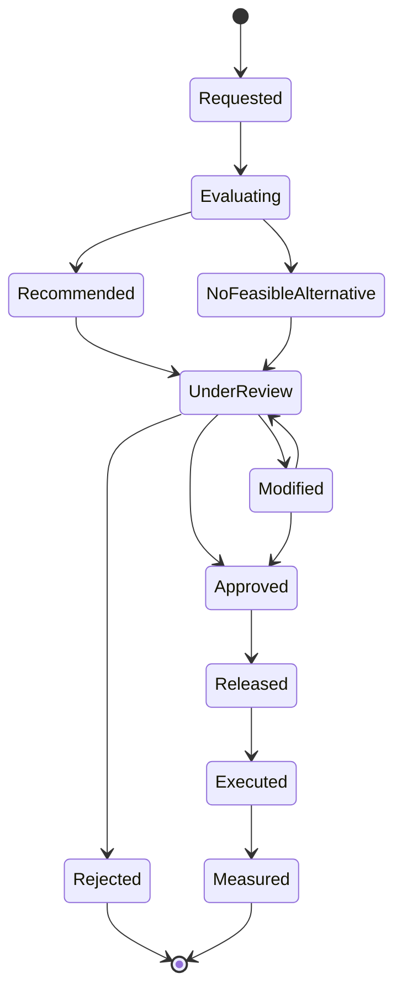

## Override Management

An override occurs when an authorized user changes or rejects a recommendation.

The system should record:

- Original recommendation
- Original explanation
- User making the override
- Date and time
- Changed values
- Override reason
- Final decision
- Expected impact
- Actual outcome

Override reasons may include:

- Operational information unavailable to the engine
- Customer instruction
- Management instruction
- Incorrect master data
- Unexpected warehouse condition
- Driver or vehicle issue
- Local route knowledge
- Service-risk judgment
- Emergency requirement

Overrides are valuable learning data and should not automatically be treated as errors.

## Decision Lifecycle

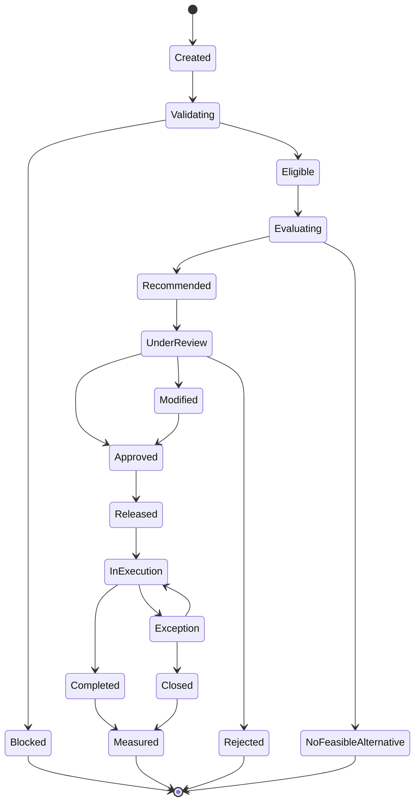

Each transition must identify:

- Responsible actor or system process
- Timestamp
- Trigger
- Validation result
- Related business objects
- Reason where applicable

## Decision Audit Trail

The audit trail should include:

- Decision creation
- Input snapshot or input references
- Rule versions
- Constraint results
- Generated alternatives
- Recommendation
- Explanation
- Confidence
- Reviewer
- Modifications
- Approval or rejection
- Release
- Execution reference
- Outcome
- Performance comparison

Decision history must support operational investigation and future improvement.

## Replanning Decisions

Replanning occurs when operational conditions change after planning or approval.

Triggers may include:

- Vehicle breakdown
- Driver absence
- Inventory shortage
- Warehouse delay
- Supplier delay
- Customer cancellation
- Customer time-window change
- Road disruption
- Failed stop
- Urgent new demand
- Incorrect planning data

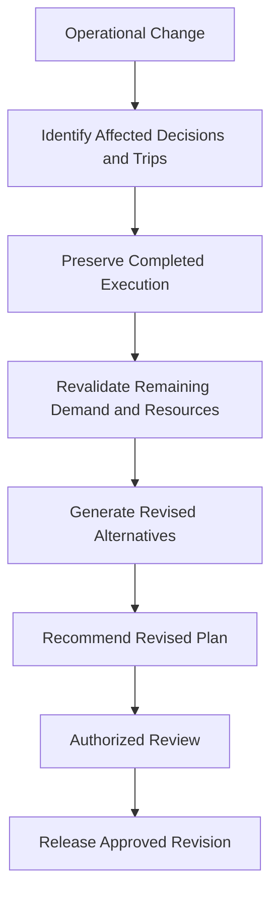

Replanning must preserve:

- Original plan
- Original recommendation
- Completed execution
- Cause of change
- Revised recommendation
- Approving user
- Impact on service, cost, capacity, and demand

## Exception Decisions

When normal execution cannot continue, the engine may recommend corrective actions.

Examples include:

- Replace a vehicle
- Replace a driver
- Split a trip
- Reassign a shipment
- Change stop sequence
- Return products to a warehouse
- Transfer products to another vehicle
- Reschedule a stop
- Create follow-up demand
- Cancel part of a movement
- Escalate for management approval

Exception recommendations must not overwrite the original operational history.

## Decision Outcome Measurement

The engine must compare recommendations and final decisions with actual outcomes.

| Decision Area | Example Outcome Measures |
| --- | --- |
| Vehicle Assignment | Capacity utilization, cost, completion reliability |
| Driver Assignment | Availability accuracy, conflict rate, completion |
| Shipment Consolidation | Shipments per trip, added duration, cost benefit |
| Route Selection | Planned versus actual duration and distance |
| Stop Sequencing | Time-window compliance and waiting time |
| Warehouse Selection | Fulfilment time, transfer cost, readiness |
| Cross-Dock Decision | Handling time, storage avoidance, outbound reliability |
| Priority Handling | Service result and delayed-demand impact |
| Replanning | Recovery time and reduced disruption |
| Overall Plan | Demand coverage, approval rate, overrides, service and cost |

## Decision Quality KPIs

Potential Decision Engine KPIs include:

- Recommendation acceptance rate
- Recommendation override rate
- Rejection rate
- No-feasible-alternative rate
- Percentage of recommendations with explanations
- High-confidence recommendation rate
- Planning feasibility rate
- Capacity violation rate
- Resource conflict rate
- Time-window compliance
- Planned demand coverage
- Replanning frequency
- Difference between recommended and executed plans
- Outcome performance by decision type
- Data-quality blockage rate

Exact formulas and targets will be defined in later KPI specifications.

## Feedback Loop

Execution results should improve future decision quality.

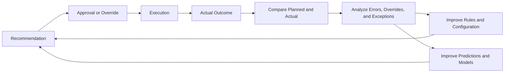

The feedback loop may improve:

- Travel-time estimates
- Service-duration estimates
- Warehouse readiness estimates
- Vehicle suitability
- Consolidation rules
- Capacity assumptions
- Risk assessment
- Recommendation confidence
- Decision objective weights

Changes to business rules and automated behavior must remain governed and version-controlled.

## Decision Engine and AI Platform

The Decision Engine and AI Platform have related but distinct responsibilities.

| Capability | Decision Engine | AI Platform |
| --- | --- | --- |
| Business rules | Applies approved rules | May identify patterns suggesting rule improvements |
| Hard constraints | Enforces mandatory constraints | Does not override mandatory constraints |
| Optimization | Evaluates and ranks feasible alternatives | May provide optimization techniques or learned estimates |
| Predictions | Uses predicted values | Produces ETA, duration, demand, or risk predictions |
| Recommendations | Produces controlled operational recommendations | Provides intelligence supporting recommendations |
| Explanations | Presents business-level decision reasoning | May provide model-level contribution information |
| Approval | Supports controlled human review | Does not independently approve business decisions |
| Audit | Records decisions and outcomes | Records model versions, inputs, and predictions |

The Decision Engine is the business decision-control layer.

The AI Platform provides predictive, optimization, and learning capabilities used by that layer.

## Odoo 17 Integration Role

Odoo 17 provides operational records and execution workflows.

The Decision Engine may consume information from:

- Purchase orders
- Sales or customer orders
- Stock movements
- Warehouse receipts
- Delivery orders
- Internal transfers
- Inventory availability
- Product master data
- Customer and supplier records
- Warehouse definitions
- Fleet records
- User and driver records

The Decision Engine may produce or update:

- Recommended shipment groups
- Recommended trips
- Vehicle assignments
- Driver assignments
- Stop sequences
- Planned times
- Cross-dock recommendations
- Planning warnings
- Unplanned-demand reasons
- Approved operational plans
- Decision audit records

SCOP extensions must preserve the integrity of standard Odoo operational records.

## Decision Governance

### Rule Ownership

Every business rule must have an accountable business owner.

### Controlled Changes

Rule, constraint, objective, and weight changes must be authorized and version-controlled.

### Explainability

Important recommendations must include understandable explanations.

### Human Accountability

Authorized users remain accountable for approval and operational release.

### Separation of Responsibilities

High-impact rule changes and operational approvals should not depend on one uncontrolled role.

### Auditability

Recommendations, overrides, approvals, executions, and outcomes must be retained.

### Data Quality

The engine must not hide poor data quality behind apparently precise recommendations.

### Safe Automation

Automation may increase only when:

- Decision quality is measurable.
- Data quality is sufficient.
- Rules and constraints are stable.
- Exceptions are controlled.
- Explanations are available.
- Management has approved the automation level.

## Automation Levels

SCOP may progress through controlled automation levels.

| Level | Description |
| --- | --- |
| Level 0 — Manual | Users make decisions without generated recommendations |
| Level 1 — Assisted | The engine validates data and provides warnings |
| Level 2 — Recommended | The engine generates recommendations requiring approval |
| Level 3 — Conditional Automation | Approved low-risk decisions may execute automatically |
| Level 4 — Adaptive Automation | The platform adapts selected decisions using measured outcomes within approved controls |

The initial target is primarily Level 2.

Progression must be approved by decision type rather than applied universally.

## Failure and Safe Fallback

When the Decision Engine cannot produce a reliable recommendation, it must fail safely.

Safe fallback behavior may include:

- Marking the decision as blocked
- Returning no feasible alternative
- Identifying missing inputs
- Listing violated constraints
- Requesting manual planning
- Preserving existing approved commitments
- Avoiding automatic operational release
- Escalating critical issues

The engine must not invent missing operational data or silently ignore mandatory constraints.

## Architecture Boundaries

This page defines:

- Decision concepts
- Decision Objects
- Decision types
- Inputs
- Rules
- Constraints
- Objectives
- Recommendation generation
- Explanation
- Human approval
- Overrides
- Replanning
- Outcomes
- Governance
- Automation levels

It does not define:

- Detailed mathematical optimization formulations
- Solver selection
- Source code architecture
- Database schemas
- API payloads
- Machine learning model architecture
- User interface design
- Detailed Odoo data models
- Complete functional acceptance criteria

Those subjects will be documented in dedicated functional, AI, development, and technical specifications.

## Summary

The SCOP Supply Chain Decision Engine converts operational data into controlled, explainable, and measurable recommendations.

It applies approved business rules, enforces mandatory constraints, evaluates feasible alternatives, balances service and efficiency objectives, and submits recommendations for authorized human review.

The engine is not only an optimization mechanism. It is the business control layer that connects data, rules, decisions, approvals, execution, and outcomes.

Its central principle is that no important recommendation should be operationally released unless it is feasible, explainable, traceable, and appropriately authorized.

## Related Pages

- [Documentation Design System](../getting-started/documentation-design-system.mdx)
- [Product Blueprint](../product/product-blueprint.mdx)
- [Business Architecture](../business/business-architecture.mdx)
- [Supply Chain Operating Model](../operations/supply-chain-operating-model.mdx)
- AI Platform Overview
- Decision Rules
- Vehicle Assignment
- Shipment Consolidation
- Route Optimization
- Decision Explainability
