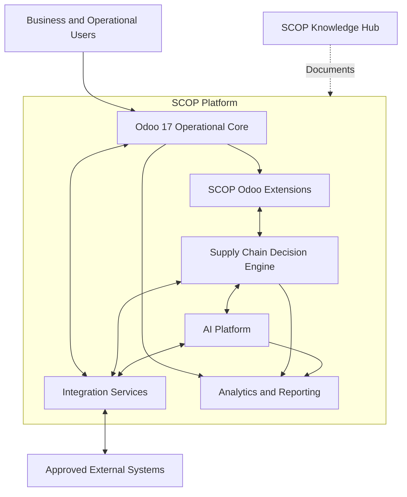
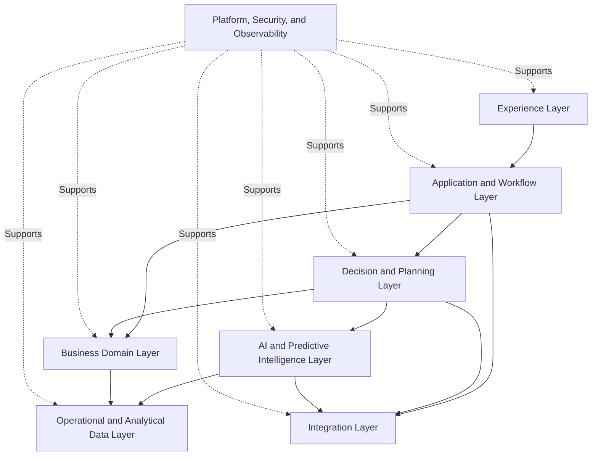
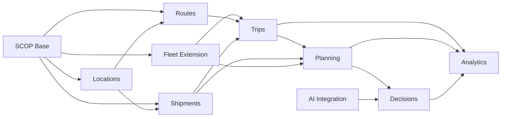
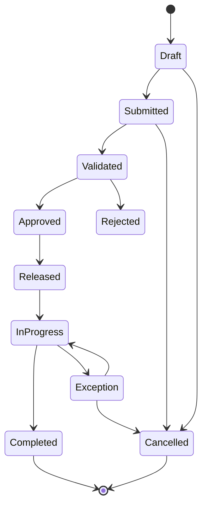
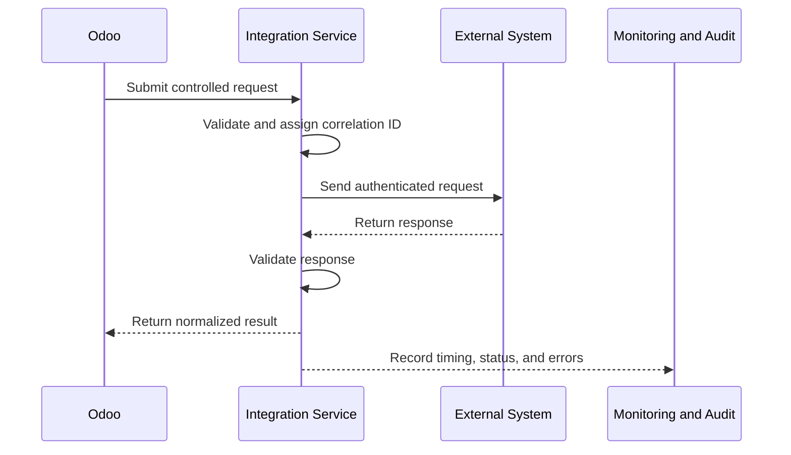
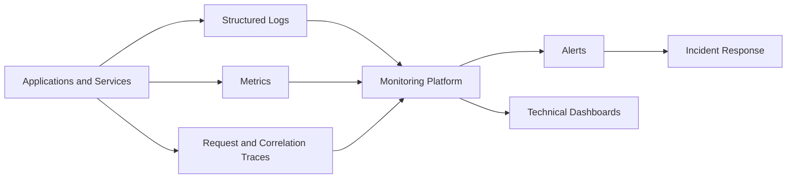
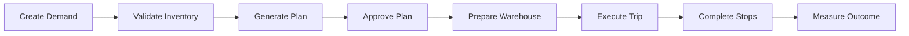
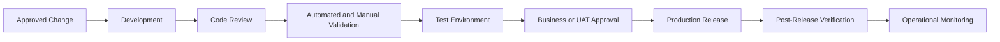

import DocumentInfo from '@site/src/components/DocumentInfo';

# Development Overview

<DocumentInfo
  category="Development"
  audience={['Product', 'Technical', 'Development', 'Data', 'Security', 'Operations']}
  status="Approved"
  version="1.0"
  owner="Engineering Team"
  updated="July 2026"
  readingTime="14 min"
/>

## Purpose

The Development Overview defines the technical and engineering principles used to design, build, test, integrate, deploy, and maintain SCOP.

It establishes a shared foundation for:

- Odoo 17 development
- SCOP-specific modules
- Decision Engine services
- AI Platform services
- Integration services
- Data exchange
- Security controls
- Testing
- Deployment
- Monitoring
- Documentation
- Change governance

This page defines engineering direction and boundaries.

It does not provide complete source-code implementations, database schemas, API payloads, infrastructure configuration, or individual module specifications.

## Engineering Objectives

SCOP engineering should achieve the following objectives:

| Objective | Intended Result |
| --- | --- |
| Operational reliability | Ensure critical supply chain workflows remain dependable |
| Clear domain ownership | Prevent duplicated or conflicting business logic |
| Controlled Odoo extension | Extend Odoo without damaging standard operational behavior |
| Maintainability | Keep code understandable, testable, and supportable |
| Integration safety | Exchange data through controlled and traceable interfaces |
| Decision traceability | Preserve the relationship between inputs, recommendations, approvals, and outcomes |
| Security | Protect users, operational data, models, credentials, and integrations |
| Scalability | Support growth in orders, warehouses, vehicles, trips, decisions, and users |
| Observability | Make failures, performance, and system behavior measurable |
| Safe delivery | Validate changes before they affect production operations |
| Documentation as Code | Keep technical documentation version-controlled with the platform |

## Technology Context

SCOP is built around Odoo 17 as the operational backbone.

The platform may include:

- Standard Odoo applications
- Custom Odoo modules
- SCOP operational extensions
- Decision Engine services
- AI Platform services
- Integration services
- Background workers
- Reporting and analytics components
- Controlled external services
- The SCOP Knowledge Hub



## Architectural Principles

### Odoo as the Operational System of Record

Odoo 17 should remain the authoritative operational system for business records within its scope.

Examples include:

- Products
- Suppliers
- Customers
- Customer branches
- Purchase orders
- Sales or customer orders
- Warehouses
- Stock locations
- Receipts
- Delivery orders
- Internal transfers
- Inventory movements
- Vehicles
- Users
- Operational documents

SCOP services should not create uncontrolled duplicate master records outside Odoo.

### Clear System Ownership

Every important data object must have one defined authoritative owner.

| Information | Primary Owner |
| --- | --- |
| Products and operational partners | Odoo |
| Inventory and stock movements | Odoo |
| Warehouse receipts and delivery orders | Odoo |
| SCOP route and trip extensions | Odoo and approved SCOP modules |
| Decision records | Decision Engine or approved SCOP decision module |
| Predictions and model metadata | AI Platform |
| Operational analytics | Analytics layer using governed source data |
| Documentation | SCOP Knowledge Hub repository |

Derived systems may cache or index information but must not become uncontrolled alternative systems of record.

### Configuration Before Customization

Use standard Odoo functionality before creating custom software.

The engineering team should evaluate solutions in this order:

1. Standard Odoo functionality
2. Odoo configuration
3. Approved community or enterprise capability
4. Small controlled extension
5. Dedicated custom module
6. External service only when justified

Customization must solve a defined requirement that cannot be satisfied safely through configuration.

### Modular Design

SCOP functionality should be divided into modules with clear responsibilities.

A module should:

- Represent a coherent business or technical capability
- Have explicit dependencies
- Avoid duplicating another module's responsibility
- Expose controlled interfaces
- Include tests
- Include access controls
- Include documentation
- Support versioned changes

### Business Logic Near Its Owner

Business logic should be implemented within the component owning the relevant responsibility.

Examples:

- Inventory validation belongs near inventory and stock operations.
- Vehicle eligibility belongs within fleet or planning capabilities.
- Business decision orchestration belongs in the Decision Engine.
- Predictive estimation belongs in the AI Platform.
- Human approval remains within controlled operational workflows.

### No Hidden Operational Decisions

Important business decisions must not be buried in:

- User interface code
- Unversioned scripts
- Scheduled tasks without documentation
- Database triggers
- Spreadsheet formulas
- Model outputs without explanation
- Hard-coded values with no business ownership

Operational decisions must remain traceable and testable.

### Safe Failure

A technical failure must not silently create an unsafe operational decision.

Where possible, failure should result in:

- A visible error
- A controlled fallback
- A blocked recommendation
- Manual review
- Preservation of approved operational records
- An audit entry
- Technical notification

## Logical Architecture

SCOP uses a layered logical architecture.



### Experience Layer

The Experience Layer may include:

- Odoo views
- Planning dashboards
- Management dashboards
- Operational reports
- Future driver applications
- Future customer or supplier interfaces

The Experience Layer should display and collect information but should not own uncontrolled business logic.

### Application and Workflow Layer

This layer coordinates:

- Operational transactions
- Status changes
- Approval workflows
- User actions
- Notifications
- Task creation
- Process validation

### Decision and Planning Layer

This layer coordinates:

- Planning requests
- Rule evaluation
- Constraint validation
- Alternative generation
- Recommendation creation
- Approval
- Override recording
- Decision outcomes

### AI and Predictive Intelligence Layer

This layer provides:

- Predictions
- Forecasts
- Rankings
- Risk indicators
- Confidence
- Model explanations
- Model monitoring

AI output must pass through the Decision Engine before affecting controlled operational decisions.

### Business Domain Layer

This layer contains business capabilities such as:

- Procurement
- Orders
- Warehouse
- Inventory
- Fleet
- Drivers
- Routes
- Trips
- Planning
- Returns
- Exceptions

### Integration Layer

This layer manages controlled exchange with:

- External mapping services
- Traffic services
- Approved customer systems
- Approved supplier systems
- Reporting platforms
- Future driver applications
- External identity or notification services

### Data Layer

This layer contains:

- Odoo operational data
- SCOP extension data
- Decision records
- Prediction records
- Historical execution data
- Analytical data
- Audit records

### Platform Layer

This layer provides:

- Authentication
- Authorization
- Secrets management
- Logging
- Monitoring
- Deployment
- Backup
- Recovery
- Environment configuration
- Technical governance

## Odoo Extension Strategy

SCOP should extend Odoo through supported module mechanisms.

Custom Odoo modules may be required for:

- Route management
- Trip management
- Multi-stop execution
- Shipment and load management
- Vehicle-capacity validation
- Daily planning
- Recommendation review
- Decision audit records
- Cross-dock recommendations
- Planning exceptions
- AI prediction references

Custom modules should not modify Odoo core files directly.

:::warning

Direct modification of standard Odoo source code must not be used as the normal extension method.

SCOP changes should be implemented through supported inheritance, extension, configuration, and module mechanisms.

:::

## Module Boundaries

Potential logical module boundaries may include:

| Module Area | Responsibility |
| --- | --- |
| SCOP Base | Shared configuration, terminology, mixins, and foundational objects |
| SCOP Locations | Operational locations, branches, and geographic information |
| SCOP Fleet Extension | Capacity, availability, and assignment extensions |
| SCOP Routes | Reusable routes and route locations |
| SCOP Trips | Trips, stops, resources, statuses, and execution |
| SCOP Shipments | Shipment formation, ownership, and transport requirements |
| SCOP Planning | Planning requests, daily plans, and operational release |
| SCOP Decisions | Recommendations, explanations, approvals, overrides, and outcomes |
| SCOP Cross-Dock | Cross-dock requirements and operational control |
| SCOP Exceptions | Operational exceptions, ownership, and resolution |
| SCOP AI Integration | Prediction requests, results, confidence, and model references |
| SCOP Analytics | Operational measures and reporting support |

These are logical boundaries, not an instruction to create all modules immediately.

Actual module creation must follow approved implementation scope.

## Dependency Principles

Module dependencies should be:

- Explicit
- Minimal
- Directional
- Justified
- Tested

Avoid circular dependencies.

A higher-level planning module may depend on inventory, fleet, route, and trip capabilities.

Inventory, fleet, or route modules should not depend on the complete planning implementation unless necessary.



## Data Model Principles

### Extend Existing Models Carefully

When a standard Odoo model represents the correct business object, extend it rather than creating an uncontrolled duplicate.

Examples may include:

- Extending fleet vehicles with operational capacities
- Extending warehouses or stock locations with logistics attributes
- Extending partner records with customer-branch or supplier-location information

### Create New Models for New Concepts

Create dedicated models where SCOP introduces a genuinely new concept.

Examples may include:

- Route
- Route Stop Template
- Trip
- Trip Stop
- Shipment
- Load
- Planning Run
- Decision Record
- Recommendation
- Decision Explanation
- Operational Exception

### Stable Identifiers

Important operational objects should have stable human-readable identifiers.

Example formats may include:

```text
SHP-2026-000123
TRP-2026-000089
PLN-2026-07-18-01
DEC-2026-000456
EXC-2026-000077
```

Exact sequences will be defined in detailed specifications.

### Referential Integrity

Relationships between operational objects must remain explicit.

Examples include:

- Demand to shipment
- Shipment to load
- Load to trip
- Trip to stops
- Trip to vehicle
- Trip to driver
- Recommendation to decision
- Decision to approved trip
- Prediction to consuming decision
- Exception to affected operational records

### Historical Traceability

Important historical records must not be overwritten when the business requires an audit trail.

Where appropriate, retain:

- Original recommendation
- Approved decision
- Previous plan version
- Rule version
- Model version
- Assignment changes
- Status transitions
- Actual execution outcome

## Status and Workflow Design

Operational records should use controlled states.

A state transition must define:

- Source state
- Destination state
- Authorized actor
- Validation
- Side effects
- Notification
- Audit information
- Reversal or cancellation behavior



Not every object must use this exact lifecycle.

Each domain specification must define its own valid states and transitions.

## Service Boundaries

External services should be introduced only where they provide clear architectural value.

A separate service may be justified when:

- Workload characteristics differ significantly from Odoo
- Independent scaling is required
- Specialized libraries or runtimes are required
- Long-running optimization is required
- Machine learning model serving is required
- Isolation improves security or reliability
- Multiple applications consume the same controlled capability

A separate service must not be created merely to appear modern.

## Integration Principles

### API-First Integration

External integration should use documented and controlled interfaces.

Avoid:

- Direct external database access
- Undocumented endpoint use
- File exchange without ownership or validation
- Shared credentials
- Untraceable manual data copying
- Silent field mapping

### Contract Ownership

Every integration contract must define:

- Provider
- Consumer
- Purpose
- Authentication
- Authorization
- Request structure
- Response structure
- Validation
- Error behavior
- Retry behavior
- Timeout
- Idempotency
- Versioning
- Monitoring
- Data ownership

### Idempotency

Operations that may be retried should be designed to avoid duplicate business effects.

Examples include:

- Creating a prediction request
- Creating an external shipment notification
- Recording an execution event
- Synchronizing a customer branch
- Updating an operational status

### Integration Traceability

An integration transaction should include or generate:

- Correlation identifier
- Source system
- Destination system
- Timestamp
- Request result
- Error details
- Retry count where applicable
- Related business object

## Integration Flow



## Synchronous and Asynchronous Processing

Use synchronous processing when:

- The user requires an immediate response.
- Processing is short.
- The external dependency is reliable.
- The transaction cannot continue without the result.

Use asynchronous processing when:

- Processing is long-running.
- Optimization may require significant time.
- AI prediction can complete in the background.
- External systems are unreliable.
- Retry is required.
- High request volume may block users.

Background jobs must be:

- Traceable
- Idempotent where possible
- Retry-controlled
- Observable
- Time-limited
- Safe to fail
- Linked to business records

## Decision Engine Integration

The Decision Engine should consume controlled operational snapshots or references.

A planning request may contain or reference:

- Planning date
- Eligible demand
- Inventory availability
- Warehouse readiness
- Vehicle availability
- Driver availability
- Routes and locations
- Rules
- Constraints
- Objectives
- Existing approved commitments

The engine should return:

- Recommendation identifier
- Proposed trips
- Assignments
- Stop sequences
- Planned times
- Capacity results
- Constraint results
- Explanations
- Unplanned demand
- Warnings
- Confidence where applicable

The operational workflow must validate and approve recommendations before release.

## AI Platform Integration

The AI Platform should expose controlled prediction capabilities.

A prediction request should identify:

- Capability
- Operational context
- Input references
- Required response time
- Correlation identifier

A prediction response should identify:

- Capability
- Model version
- Output
- Confidence or uncertainty
- Explanation
- Validity period
- Data-quality warning
- Prediction identifier
- Timestamp

AI integration failure must trigger the approved fallback rather than unsafe automatic behavior.

## Security Architecture

SCOP security should follow defence-in-depth principles.

Security controls should include:

- Authentication
- Role-based authorization
- Record-level access
- Least privilege
- Environment separation
- Secret protection
- Secure communications
- Input validation
- Output encoding where applicable
- Audit logging
- Dependency management
- Backup and recovery
- Monitoring and alerting

## Authorization

Permissions should reflect business responsibility.

Examples include:

- Only authorized users may approve daily plans.
- Drivers may access only assigned operational information.
- Warehouse users may update permitted warehouse activities.
- AI users may not change business rules without authorization.
- Technical users may not automatically receive broad operational permissions.
- Rule changes and production deployments require controlled access.

Authorization must be enforced on the server side.

User-interface visibility alone is not an access-control mechanism.

## Secrets and Credentials

Secrets must not be stored in:

- Source code
- MDX documentation
- Git history
- Public configuration
- Client-side applications
- Unprotected logs

Secrets should be managed through approved environment and secrets-management mechanisms.

## Data Protection

Engineering design must protect:

- Customer operational data
- Supplier information
- Product and inventory information
- Driver information
- Commercial information
- Decision records
- Model and prediction metadata
- Credentials
- Integration payloads

Only required data should be transferred between components.

## Audit Logging

Audit logging should capture significant events such as:

- Authentication failures
- Permission changes
- Rule changes
- Plan approvals
- Decision overrides
- Trip releases
- Integration failures
- Model deployments
- Configuration changes
- Sensitive administrative actions

Audit logs must avoid exposing secrets or inappropriate sensitive data.

## Error Handling

Errors should be:

- Detectable
- Classified
- Traceable
- Understandable
- Linked to affected business records
- Safe for end users
- Detailed enough for technical investigation

Do not expose internal stack traces, credentials, or sensitive configuration to normal users.

Technical logs may contain diagnostic context but must remain protected.

## Error Classification

| Error Type | Example |
| --- | --- |
| Validation Error | Missing required location or invalid quantity |
| Business Rule Error | Mandatory time window cannot be satisfied |
| Authorization Error | User cannot approve a plan |
| Conflict Error | Vehicle is already assigned |
| Integration Error | External mapping service unavailable |
| Processing Error | Planning request failed |
| Data Quality Error | Invalid capacity or stale warehouse status |
| Infrastructure Error | Database, network, or service failure |

## Observability

SCOP should provide visibility into:

- Application health
- Request volume
- Response time
- Background-job status
- Integration status
- Error rate
- Planning duration
- Decision generation
- Prediction availability
- Database performance
- Resource utilization
- User-impacting failures



## Logging Principles

Logs should include useful context such as:

- Timestamp
- Environment
- Service or module
- Severity
- Correlation ID
- Business object reference where safe
- Operation
- Result
- Error category

Logs must not include:

- Passwords
- Access tokens
- Secret keys
- Unnecessary personal data
- Full sensitive payloads
- Unprotected financial data

## Performance Principles

Engineering teams should avoid performance problems caused by:

- Repeated database queries
- Unbounded record searches
- Large synchronous processing
- Excessive computed fields
- Missing pagination
- Uncontrolled report generation
- Recalculating unchanged predictions
- Unbounded logs
- Inefficient integration retries

Performance-sensitive operations should be measured using realistic business volumes.

## Scalability

SCOP should support growth in:

- Products
- Customers
- Branches
- Suppliers
- Warehouses
- Inventory movements
- Orders
- Shipments
- Vehicles
- Drivers
- Routes
- Trips
- Stops
- Decisions
- Predictions
- Historical records

Scalability decisions must be based on measured requirements rather than unsupported assumptions.

## Testing Strategy

Testing should operate at several levels.

### Unit Testing

Unit tests validate isolated logic such as:

- Capacity calculations
- Time-window validation
- Status transitions
- Rule evaluation
- Data transformations
- Explanation formatting

### Integration Testing

Integration tests validate interactions such as:

- Odoo to Decision Engine
- Decision Engine to AI Platform
- Odoo to external services
- Planning recommendation to operational records
- Prediction records to decision records

### Functional Testing

Functional tests validate business behavior such as:

- Creating a trip
- Assigning a vehicle
- Preventing a conflict
- Approving a daily plan
- Recording an override
- Releasing warehouse preparation
- Completing a stop

### End-to-End Testing

End-to-end tests validate complete operational scenarios.

Example:



### Regression Testing

Regression tests protect previously approved behavior from unintended changes.

### Performance Testing

Performance tests validate important operations under expected and stress volumes.

### Security Testing

Security testing validates:

- Permissions
- Record access
- Input handling
- Authentication
- Sensitive data protection
- Integration security
- Dependency risk

## Test Data

Test environments should use controlled test data.

Production-sensitive information should not be copied into lower environments without approved protection.

Test data should cover:

- Normal cases
- Boundary values
- Missing data
- Conflicting resources
- Capacity limits
- Time-window violations
- Partial availability
- Integration failure
- AI fallback
- Replanning
- Cancellation
- Unauthorized access

## Definition of Done

A development change is not complete until applicable requirements are satisfied.

A change should include:

- Approved requirement or issue reference
- Clear scope
- Reviewed implementation
- Tests
- Access control
- Error handling
- Logging
- Documentation
- Migration consideration
- Deployment consideration
- Successful validation
- No unresolved critical defect

## Code Review

Code review should verify:

- Business requirement alignment
- Correct architecture boundary
- Maintainability
- Security
- Performance
- Test coverage
- Error handling
- Logging
- Data migration impact
- Backward compatibility
- Documentation
- No unnecessary customization

The author should not be the only person approving high-impact production changes.

## Source Control

All production code and Documentation as Code should use version control.

Changes should be:

- Traceable
- Reviewable
- Associated with a requirement, issue, or decision
- Small enough to understand
- Protected from direct uncontrolled production editing

Generated secrets, temporary files, local configuration, and build output should not be committed unless explicitly required.

## Branching and Change Integration

The exact branching model may depend on the team workflow.

Regardless of the selected model:

- The primary branch must remain releasable.
- Changes must be reviewed.
- Automated validation should run where available.
- High-risk changes should be isolated.
- Merge conflicts must be resolved carefully.
- Documentation should change with the functionality it describes.

## Environment Model

SCOP should use separated environments.

Typical environments may include:

| Environment | Purpose |
| --- | --- |
| Local Development | Individual development and testing |
| Shared Development | Integrated team development |
| Test or QA | Functional and regression validation |
| Staging or UAT | Business validation using production-like configuration |
| Production | Approved live operations |

Environment configuration must not depend on manual undocumented changes.

## Configuration Management

Configuration should be:

- Environment-specific where required
- Versioned where appropriate
- Protected
- Documented
- Reproducible
- Validated during deployment

Examples include:

- Service endpoints
- Feature flags
- Timeouts
- Planning limits
- Integration settings
- Model-service configuration
- Logging levels

Business rules should not be hidden inside technical environment configuration.

## Database Changes and Migrations

Database changes must be controlled.

A migration should consider:

- Existing records
- Required defaults
- Data validation
- Performance
- Rollback or recovery
- Downtime
- Backward compatibility
- Module upgrade behavior
- Historical traceability

Destructive migrations require explicit review.

## Release Process

A release should progress through controlled stages.



A release should define:

- Scope
- Version
- Dependencies
- Migration requirements
- Configuration changes
- Test results
- Known limitations
- Rollback plan
- Verification steps
- Release notes

## Deployment Principles

Production deployment should be:

- Authorized
- Repeatable
- Versioned
- Logged
- Reversible where practical
- Performed using approved access
- Followed by verification
- Monitored for failure

Manual production changes should be minimized and documented.

## Rollback

A release must define safe recovery when failure occurs.

Rollback planning should consider:

- Application version
- Module version
- Database compatibility
- Data migration
- External contracts
- Background jobs
- Model version
- Operational transactions already completed

Rollback must not remove valid operational history.

## Feature Flags

Feature flags may be used to:

- Limit pilot capabilities
- Control gradual rollout
- Disable unstable functionality
- Separate customer or warehouse pilots
- Control AI capability activation

Feature flags must have:

- Owner
- Purpose
- Default state
- Environment scope
- Expiration or review date
- Monitoring

Feature flags must not become permanent undocumented business rules.

## Backward Compatibility

Changes should consider compatibility with:

- Existing operational records
- Existing Odoo workflows
- Existing integrations
- Existing API consumers
- Historical decisions
- Existing model predictions
- Existing reports

Breaking changes require explicit versioning, migration, communication, and approval.

## Technical Documentation

Development documentation should include, where applicable:

- Purpose
- Architecture
- Dependencies
- Data ownership
- Models
- Interfaces
- Workflows
- Permissions
- Configuration
- Error handling
- Testing
- Deployment
- Monitoring
- Limitations

Documentation should be updated within the same change that modifies the documented behavior.

## Architecture Decision Records

Significant technical decisions should be recorded as Architecture Decision Records.

An ADR should include:

| Element | Description |
| --- | --- |
| ADR ID | Unique identifier |
| Title | Decision name |
| Status | Proposed, Accepted, Superseded, or Rejected |
| Context | The problem and constraints |
| Decision | The selected approach |
| Alternatives | Important alternatives considered |
| Consequences | Benefits, costs, risks, and trade-offs |
| Owner | Responsible technical owner |
| Date | Decision date |
| Related Work | Requirements, issues, modules, or documentation |

Example identifier:

```text
ADR-0001
```

## Technical Debt

Technical debt must be visible and managed.

A technical-debt record should identify:

- Description
- Cause
- Impact
- Risk
- Affected components
- Temporary workaround
- Owner
- Target resolution
- Priority

Technical debt should not be hidden inside undocumented comments or team memory.

## Dependency Governance

Third-party dependencies must be evaluated for:

- Purpose
- Maintenance status
- Security
- Licence
- Compatibility
- Operational criticality
- Upgrade path
- Community or vendor support
- Replacement risk

Dependencies should be kept current through controlled upgrades.

Unnecessary dependencies should be avoided.

## Incident Management

A production incident should record:

- Detection time
- Affected service
- Business impact
- Severity
- Owner
- Mitigation
- Resolution
- Recovery time
- Root cause
- Corrective actions
- Documentation changes

Critical incidents should result in a structured review.

The objective is to improve the system rather than assign blame.

## Engineering Governance

### Ownership

Every module, service, integration, and operational capability must have an owner.

### Review

High-impact changes require appropriate technical and business review.

### Traceability

Code, configuration, documentation, deployment, and decisions must be traceable to approved change records.

### Separation of Duties

Production deployment, high-impact configuration, security administration, and business approval should use appropriate separation of responsibilities.

### Controlled Experimentation

Experimental AI or optimization behavior must not enter production operations without validation and approval.

### Documentation

Architecture and operating assumptions must not exist only in source code or individual knowledge.

### Continuous Improvement

Incidents, performance data, user feedback, overrides, and operational outcomes should improve engineering standards and platform design.

## Development KPIs

Potential engineering measures include:

### Quality

- Defect rate
- Regression rate
- Test pass rate
- Escaped production defects
- Code-review completion

### Delivery

- Lead time
- Deployment frequency
- Change-failure rate
- Rollback rate
- Release predictability

### Reliability

- Service availability
- Error rate
- Background-job failure rate
- Integration success rate
- Recovery time

### Performance

- Response time
- Planning duration
- Prediction response time
- Database performance
- Queue processing time

### Security

- Critical vulnerabilities
- Unauthorized-access attempts
- Overdue dependency updates
- Access-review completion
- Security incident count

### Documentation

- Documentation coverage
- Outdated-document count
- Changes released without documentation
- ADR completion for significant decisions

Exact formulas and targets will be defined in later engineering and operational specifications.

## Architecture Boundaries

This page defines:

- Engineering principles
- Logical architecture
- Odoo extension strategy
- Module boundaries
- Data ownership
- Workflow design
- Integration principles
- Security expectations
- Error handling
- Observability
- Testing
- Environment management
- Release and deployment principles
- Technical governance

It does not define:

- Complete source-code structure
- Individual Odoo model fields
- API payload specifications
- Database schemas
- Infrastructure provider
- CI/CD implementation
- Container configuration
- Individual test cases
- Detailed security controls
- Detailed model-serving implementation
- Detailed solver implementation

Those subjects will be documented in later development and technical specifications.

## Summary

SCOP engineering uses Odoo 17 as the operational foundation and extends it through controlled, modular, documented, and testable capabilities.

The platform separates operational workflows, business decision control, predictive intelligence, integrations, and analytics while maintaining clear data ownership.

Development must protect operational reliability, human accountability, security, traceability, maintainability, and safe delivery.

The central engineering principle is that every significant technical change must be understandable, testable, reviewable, observable, and safely deployable.

## Related Pages

- [Documentation Design System](../getting-started/documentation-design-system.mdx)
- [Product Blueprint](../product/product-blueprint.mdx)
- [Business Architecture](../business/business-architecture.mdx)
- [Supply Chain Operating Model](../operations/supply-chain-operating-model.mdx)
- [Supply Chain Decision Engine](../decision-engine/supply-chain-decision-engine.mdx)
- [AI Platform Overview](../ai-platform/ai-platform-overview.mdx)
- Odoo Module Architecture
- Integration Architecture
- API Standards
- Security Architecture
- Testing Strategy
- Deployment Guide
- Architecture Decision Records
