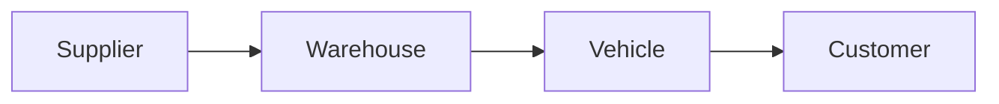

import DocumentInfo from '@site/src/components/DocumentInfo';

# Documentation Design System

<DocumentInfo
  category="Getting Started"
  audience={['Business', 'Product', 'Technical']}
  status="Approved"
  version="1.0"
  owner="Product Team"
  updated="July 2026"
  readingTime="5 min"
/>

## Purpose

The Documentation Design System establishes the standards for creating and maintaining content within the SCOP Knowledge Hub.

Its purpose is to ensure that every page follows a consistent structure, writing style, and organizational approach. These standards make the documentation easier to read, navigate, maintain, and expand as the SCOP platform evolves.

This page is the foundation for all current and future project documentation.

## Objectives

SCOP documentation should always be:

- Clear and easy to understand
- Business-oriented before being technical
- Consistent across all sections
- Easy to navigate and maintain
- Useful to both business and technical readers
- Scalable as the platform grows

## Documentation Principles

### Business First

Explain the business purpose and operational context before describing technical implementation.

Readers should understand **why** a capability exists before learning **how** it is implemented.

### One Topic per Page

Each page should focus on one primary subject.

When a page begins covering independent topics, move those topics into dedicated pages and connect them through cross-references.

### Keep It Simple

Prefer clarity over unnecessary detail.

Use direct language, concise explanations, and only the information required to understand the subject.

### Progressive Detail

Begin with a high-level overview.

Add business rules, workflows, functional details, and technical implementation information progressively when they are relevant.

### Single Source of Truth

Document each concept in one authoritative location.

Other pages should link to that source rather than repeating or redefining the same information.

### Maintainability

Write documentation so that future contributors can update it safely and quickly.

Avoid duplicating content and avoid embedding information that is likely to become outdated unless it is essential.

## Writing Style

Use clear, professional English.

### Preferred Style

- Active voice
- Short paragraphs
- Clear headings
- Direct sentences
- Bullet lists for grouped information
- Consistent business terminology
- Defined abbreviations
- Practical examples when they improve understanding

### Avoid

- Long or dense paragraphs
- Academic language
- Promotional or exaggerated wording
- Unexplained abbreviations
- Ambiguous terminology
- Repetition across pages
- Technical detail before business context

:::tip

Write for the reader who is unfamiliar with the subject but needs to understand it quickly and accurately.

:::

## Standard Page Structure

Most documentation pages should use the following structure:

```text
Page Title
Document Information
Purpose
Overview
Main Content
Business Rules or Requirements, when applicable
Related Pages
```

Not every page requires every section. Include only sections that provide useful information.

## Document Information Card

Every documentation page must display a `DocumentInfo` card immediately after the page title.

The card identifies:

| Property     | Purpose                                       |
| ------------ | --------------------------------------------- |
| Category     | The documentation area containing the page    |
| Audience     | The primary intended readers                  |
| Status       | The current maturity of the page              |
| Version      | The documented content version                |
| Owner        | The team responsible for maintaining the page |
| Last Updated | The most recent meaningful update             |
| Reading Time | The estimated time required to read the page  |

Example:

<DocumentInfo
  category="Product"
  audience={['Business', 'Product', 'Technical']}
  status="Approved"
  version="1.0"
  owner="Product Team"
  updated="July 2026"
  readingTime="8 min"
/>

## Naming Standards

Use one approved term consistently for each business concept.

| Preferred Term  | Avoid                                                      |
| --------------- | ---------------------------------------------------------- |
| Vehicle         | Truck / Car                                                |
| Route           | Path                                                       |
| Trip            | Mission                                                    |
| Warehouse       | Store                                                      |
| Shipment        | Package                                                    |
| Delivery Order  | Delivery                                                   |
| Purchase Order  | PO Document                                                |
| Business Domain | Module, when describing the business structure             |
| Decision Engine | AI System, when referring to the wider decision capability |

:::warning

Do not introduce a new name for an existing concept without reviewing its impact across the Knowledge Hub.

:::

## Headings

Use headings to create a clear hierarchy.

- Use one page title.
- Use second-level headings for primary sections.
- Use third-level headings for subsections.
- Avoid heading levels deeper than level three unless necessary.
- Keep headings short and descriptive.
- Do not number headings unless numbering improves the page.

## Lists

Use bullet lists when order is not important.

Use numbered lists only when the sequence matters, such as workflows or implementation steps.

Keep list items grammatically consistent.

## Tables

Use tables for structured information such as:

- Comparisons
- Business rules
- Terminology
- Roles and responsibilities
- Configuration values
- Decision matrices
- Requirement summaries

Avoid very wide tables and avoid placing long paragraphs inside table cells.

## Diagrams

Use diagrams when they communicate relationships or workflows more clearly than text.

Mermaid is the preferred format because diagrams remain version-controlled and editable as code.

Example:



Diagrams should:

- Have one clear purpose
- Use approved business terminology
- Remain readable without excessive detail
- Show business concepts before technical components
- Avoid duplicating the surrounding text

## Admonitions

Use Docusaurus admonitions selectively.

| Type      | Usage                                    |
| --------- | ---------------------------------------- |
| `info`    | Context or important neutral information |
| `tip`     | Recommended practice                     |
| `warning` | Risk, limitation, or required attention  |
| `danger`  | Critical risk or prohibited action       |

Do not use admonitions as decoration. Use them only when the content deserves additional emphasis.

## Cross-References

Link related pages instead of duplicating their content.

Use descriptive link text that tells the reader what the destination contains.

Preferred:

```md
See [Product Blueprint](../product/product-blueprint.mdx) for the product vision and scope.
```

Avoid:

```md
Click here.
```

Docusaurus supports links between documentation pages using file paths or URL paths.

## File and URL Naming

Use lowercase kebab-case for documentation filenames and URL slugs.

Preferred:

```text
documentation-design-system.mdx
product-blueprint.mdx
business-architecture.mdx
vehicle-assignment.mdx
```

Avoid:

```text
DocumentationDesignSystem.mdx
product_blueprint.mdx
Business Architecture.mdx
```

File names should be clear, concise, and aligned with the page title.

## Page Status

Use one of the following statuses:

| Status     | Meaning                                                                          |
| ---------- | -------------------------------------------------------------------------------- |
| Draft      | Initial content is being developed                                               |
| Review     | Content is awaiting business or technical validation                             |
| Approved   | Content is an official project reference                                         |
| Deprecated | Content is retained for historical reference and should no longer guide new work |

A page should not be marked Approved until its key stakeholders have validated the content.

## Versioning

Use simple semantic versioning for individual documentation pages.

| Change                                 | Example                           | Version Impact |
| -------------------------------------- | --------------------------------- | -------------- |
| Initial approved publication           | First official release            | 1.0            |
| Clarification or minor addition        | Improved wording or added example | 1.1            |
| Significant scope or structural change | Major process or architecture revision | 2.0        |

The version represents the documented content, not the Docusaurus software version.

## File Organization

Organize content according to the reader's subject area and the platform's business structure.

```text
docs/
├── getting-started/
├── product/
├── business/
├── operations/
├── decision-engine/
├── ai-platform/
├── development/
└── release-notes/
```

Avoid creating empty folders unless they are part of an immediately planned documentation section.

## Review Checklist

Before publishing or approving a page, confirm that:

- The business purpose is clear.
- The page covers one primary topic.
- The terminology is consistent.
- The content is concise and free from duplication.
- The `DocumentInfo` card is complete.
- Headings follow a clear hierarchy.
- Tables and diagrams improve understanding.
- Internal links are valid.
- The page builds successfully.
- The status and version are accurate.

## Related Pages

- Product Blueprint
- Business Architecture
