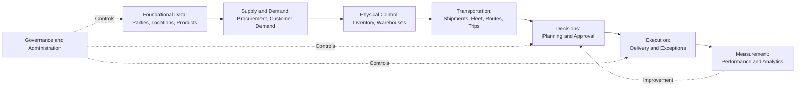
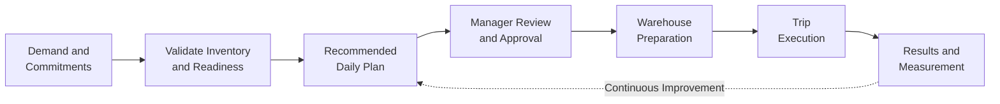
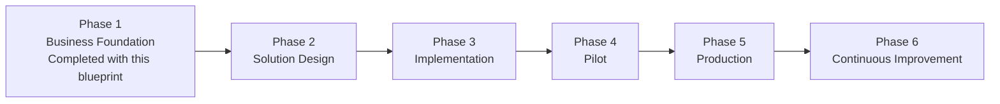

import DocumentInfo from '@site/src/components/DocumentInfo';

# Executive Blueprint

<DocumentInfo
  category="Getting Started"
  audience={['Executive', 'Business', 'Product']}
  status="Review"
  version="1.0"
  owner="Product Sponsor"
  updated="July 2026"
  readingTime="10 min"
/>

## Executive Summary

SCOP — the Supply Chain Operating Platform — is the company's unified platform for managing procurement, warehousing, inventory, transportation, and distribution for restaurant chains and multi-branch food service customers.

Today, these activities depend on separate tools, manual coordination, and individual experience. Planning a single day of operations requires reconciling customer commitments, inventory, warehouse readiness, vehicles, drivers, and routes by hand. The result is unused vehicle capacity, avoidable trips, late deliveries, and decisions that cannot be explained or measured after the fact.

SCOP replaces this fragmentation with one coordinated operating environment. Every movement of goods — from supplier to warehouse to customer branch — becomes a planned, approved, executed, and measured operation. The platform recommends the daily plan; authorized managers review, adjust, and approve it; execution results flow back so every decision can be evaluated and improved.

The future operating vision is simple to state: every movement begins with a decision, and every decision begins with reliable data.

## Vision

SCOP is designed to become an intelligent Supply Chain Operating Platform — not a traditional ERP customization.

An ERP customization automates individual documents. An operating platform coordinates the whole daily cycle: demand, supply, inventory, warehouses, fleet, routes, trips, and customer commitments, connected by explicit rules and explainable decisions.

The long-term vision develops in stages. First, the platform gives the business one reliable view and one coordinated daily plan. Then it earns trust by explaining its recommendations and measuring its results. Finally, where quality and governance permit, it takes on approved low-risk decisions automatically — always within boundaries the business defines and always under human accountability.

## Business Challenges

SCOP addresses operational challenges that grow with every new customer, branch, vehicle, and warehouse:

- Fragmented operations: procurement, warehousing, and transportation are planned separately even though they depend on each other.
- Disconnected planning: the daily plan lives in spreadsheets, phone calls, and individual memory.
- Limited visibility: management cannot see demand, readiness, capacity, and commitments in one place.
- Manual decisions: vehicle assignment, consolidation, and routing depend on individual judgment without decision support.
- Poor resource utilization: vehicles run below capacity, and unnecessary trips absorb cost.
- Reactive execution: problems are discovered during delivery instead of predicted before departure.
- Inconsistent reporting: performance is measured differently by different teams, so results cannot be compared or trusted.

## Strategic Objectives

| Objective | What Success Looks Like |
| --- | --- |
| Single Operating Platform | One platform coordinates procurement, warehousing, inventory, fleet, and distribution |
| Unified Decision Making | Operational decisions follow the same rules, data, and approval path every day |
| Intelligent Planning | A recommended daily plan is generated, reviewed, and approved — not built by hand |
| End-to-End Visibility | Demand, inventory, readiness, capacity, and execution are visible in one place |
| Customer Service Excellence | Delivery commitments and time windows are planned and protected, not hoped for |
| Warehouse Optimization | Picking, staging, loading, and cross-docking are coordinated with the transport plan |
| Transportation Optimization | Vehicle capacity, consolidation, and routing improve measurably |
| AI-Assisted Operations | Predictions and recommendations support people; people remain accountable |
| Scalable Business Architecture | Growth in customers, branches, and vehicles does not require proportional growth in planning effort |

## Scope

SCOP covers the complete operational cycle:

| Area | Coverage |
| --- | --- |
| Inbound | Supplier orders, collections, and expected receipts |
| Warehousing | Receipt, storage, picking, staging, loading, and cross-docking |
| Inventory | Availability, allocation, and ownership — including customer-owned goods |
| Transportation | Shipments, loads, multi-stop trips, pickups, and deliveries |
| Planning | One coordinated, reviewed, and approved daily plan |
| Fleet | Vehicles, drivers, capacity, and availability |
| Analytics | Trusted measures of service, cost, utilization, and reliability |
| Decision Support | Explainable recommendations with human approval |
| AI | Forecasts, estimates, and risk indicators under governance |
| Governance | Ownership, rules, permissions, and audit across the platform |

## Business Domains

SCOP is organized into thirteen business domains, each with a clear responsibility and one accountable owner — from foundational data, through supply and demand, physical control, and transportation, to decisions, execution, measurement, and governance.

The complete domain model is defined in [Business Domains](../business/business-domains.mdx).

## Business Objects

Every business entity in SCOP — customer, product, warehouse, shipment, vehicle, trip, decision — is a canonical Business Object with one authoritative owner, a stable identity, a controlled lifecycle, and full traceability.

This discipline means the same fact is never held in two conflicting versions: inventory ownership, customer commitments, and decision history each have exactly one home.

The complete catalogue is defined in [Business Objects](../business/business-objects.mdx).

## Business Rules

SCOP converts business policy into explicit, testable rules: who may approve a plan, when a vehicle is eligible, which products may travel together, when a time window is mandatory.

Explicit rules matter to the business because they make similar situations be treated the same way, make every decision explainable, and prevent critical policy from living in individual memory or hidden system behavior. Every rule has an owner, a severity, a controlled exception policy, and version history.

The framework is defined in [Business Rules](../business/business-rules.mdx).

## Operating Model

The daily operating cycle turns validated demand into approved, executed, and measured movements:

Every stage is controlled: demand must be valid before planning, plans must be approved before release, and actual results are always recorded and compared with the plan.

The complete model is defined in the [Supply Chain Operating Model](../operations/supply-chain-operating-model.mdx).

## Decision Engine

The Supply Chain Decision Engine is the capability that converts operational data into recommended actions: which vehicle, which driver, which route, which shipments to consolidate, and which demand cannot be served today — with the reason.

For executives, six commitments define it:

- Purpose: one coordinated, feasible, beneficial daily plan instead of fragmented manual decisions.
- Capabilities: eligibility, consolidation, assignment, routing, scheduling, and prioritization.
- Human approval: recommendations are released only after authorized review — the manager stays in control.
- Optimization: the engine balances service, utilization, and cost within approved priorities.
- Constraints: mandatory limits — capacity, ownership, qualifications, time windows — are never traded away for savings.
- Explainability and governance: every recommendation states its reasons, and every approval, change, and outcome is recorded.

The complete definition is in the [Supply Chain Decision Engine](../decision-engine/supply-chain-decision-engine.mdx).

## Artificial Intelligence

AI in SCOP improves decisions without removing accountability:

- Prediction: travel times, arrival estimates, service durations, and warehouse readiness.
- Forecasting: demand and capacity requirements, supporting procurement and fleet planning.
- Risk detection: late-delivery and failure risks identified before departure, not after.
- Recommendations: intelligence that supports the Decision Engine's proposals.
- Continuous learning: differences between plan and reality improve future estimates.
- Business boundaries: AI never overrides mandatory rules, ownership, or capacity limits.
- Human oversight: important recommendations require human approval; automation expands only by explicit, measured, governed steps.

The complete definition is in the [AI Platform Overview](../ai-platform/ai-platform-overview.mdx).

## Governance Model

SCOP is governed by ownership at every level:

| Governance Area | Meaning |
| --- | --- |
| Business Ownership | Every domain and capability has an accountable business owner |
| Data Ownership | Every authoritative business object and definition has a named data owner |
| Rule Ownership | Every business rule has an owner, an approval path, and version history |
| Decision Ownership | Every operational release traces to an authorized human approval |
| Security | Least-privilege access, server-side enforcement, and protected audit evidence |
| Executive Governance | Direction, priorities, automation levels, and major changes are approved at executive level |

## Expected Business Benefits

| Benefit Area | Expected Benefits |
| --- | --- |
| Operational | Coordinated daily planning, higher vehicle utilization, fewer unnecessary trips, reduced warehouse waiting |
| Financial | Lower cost per delivery, better use of existing assets before new investment, reduced loss from failed deliveries |
| Customer | Protected time windows, reliable commitments, faster and more accurate service to every branch |
| Strategic | Capacity to grow customers and branches without proportional growth in planning staff |
| Technology | One governed platform instead of fragmented tools; Odoo 17 foundation with controlled extensions |
| Decision Quality | Explainable, consistent, measurable decisions that improve from real outcomes |

The comparison with today's operation is direct:

| Today | With SCOP |
| --- | --- |
| Plans built manually each morning | Recommended plan ready for review and approval |
| Vehicle loading by experience | Capacity validated on every dimension, every trip |
| Problems discovered during delivery | Risks identified before departure |
| Decisions explained from memory | Every decision recorded with its reasons |
| Reports assembled by hand | Trusted measures produced from operational records |

## Success Measurements

Executive performance will be tracked through a small set of KPIs:

| Executive KPI | What It Measures |
| --- | --- |
| OTIF (On Time, In Full) | Deliveries completed within the committed window and quantity |
| Inventory Accuracy | Agreement between recorded and physical inventory, by owner |
| Vehicle Utilization | Use of available vehicle capacity across the fleet |
| Warehouse Productivity | Readiness, loading performance, and warehouse-caused delays |
| Planning Time | Time from demand cut-off to an approved daily plan |
| Decision Quality | Recommendation acceptance, override rate, and outcome performance |
| Forecast Accuracy | Reliability of demand and arrival predictions |
| Order Cycle Time | Time from validated demand to confirmed delivery |

Exact formulas and targets are governed by the Performance and Analytics domain.

## Future Roadmap

| Phase | Focus |
| --- | --- |
| Phase 1 — Business Foundation | Vision, architecture, domains, objects, rules, operating model, decision and AI strategy — this documentation |
| Phase 2 — Solution Design | Functional and technical specifications translating the approved business definition |
| Phase 3 — Implementation | Controlled build and configuration on the Odoo 17 foundation |
| Phase 4 — Pilot | Limited live operation with selected warehouses, customers, and routes |
| Phase 5 — Production | Full operational rollout under release governance |
| Phase 6 — Continuous Improvement | Measured optimization and controlled expansion of automation |

The roadmap describes direction; dates and resourcing are approved separately through project governance.

## Project Principles

- Business First: every capability exists for a defined business outcome.
- Configuration Before Customization: standard capability is used before custom software is written.
- AI Assists Humans: intelligence supports decisions; authorized people approve them.
- Traceability: every commitment, decision, and outcome can be traced and explained.
- Scalability: the platform grows with the business without redesign.
- Security by Design: access, approval, and audit are built in, not added later.
- Single Source of Truth: every important fact has one authoritative home.

## Out of Scope

This blueprint — and the approval it requests — intentionally excludes:

- Implementation details
- Technical design
- Module specifications
- Database structures
- APIs
- Source code
- Deployment
- Infrastructure
- Testing

These belong to the Solution Design and engineering phases that follow approval.

## Approval Scope

Executive approval of this blueprint confirms:

- The Vision and product direction
- The Business Architecture
- The Business Domains
- The Business Objects
- The Business Rules framework
- The Supply Chain Operating Model
- The Decision Engine approach
- The AI strategy and its boundaries
- The Governance model
- The Product direction and roadmap shape

Executive approval does not approve:

- Technical implementation
- Development estimates
- Infrastructure
- Budget execution
- Vendor selection
- Implementation schedule
- Detailed engineering decisions

Those decisions will be requested separately, with their own evidence, during the following phases.

## Executive Decision

| Role | Name | Signature | Date | Decision |
| --- | --- | --- | --- | --- |
| CEO | | | | Approved / Approved with comments / Not approved |
| COO | | | | Approved / Approved with comments / Not approved |
| Head of Supply Chain | | | | Approved / Approved with comments / Not approved |
| Product Sponsor | | | | Approved / Approved with comments / Not approved |
| Project Manager | | | | Approved / Approved with comments / Not approved |

Comments and conditions recorded with any decision become part of the approved baseline.

## Related Documentation

- [Documentation Design System](./documentation-design-system.mdx)
- [Product Blueprint](../product/product-blueprint.mdx)
- [Business Architecture](../business/business-architecture.mdx)
- [Business Domains](../business/business-domains.mdx)
- [Business Objects](../business/business-objects.mdx)
- [Business Rules](../business/business-rules.mdx)
- [Supply Chain Operating Model](../operations/supply-chain-operating-model.mdx)
- [Supply Chain Decision Engine](../decision-engine/supply-chain-decision-engine.mdx)
- [AI Platform Overview](../ai-platform/ai-platform-overview.mdx)
- [Development Overview](../development/development-overview.mdx)
- [Release Management](../release-notes/release-management.mdx)

## Final Executive Statement

The Business and Product definition of SCOP is complete.

Eleven governed documents now define what SCOP is, why it exists, how it operates, who owns every part of it, and how its success will be measured — in business language, under a single design system, with every domain, object, rule, decision, and boundary explicitly stated.

The project is ready to move into Solution Design.

No implementation should begin before executive approval of this blueprint. Approval establishes the business baseline that all subsequent work must serve; beginning engineering before that baseline is fixed would rebuild, at higher cost, exactly the fragmentation SCOP exists to remove.

After approval, the Solution Design Specification becomes the authoritative engineering phase. It will translate this approved business definition into functional and technical specifications — and it will be measured against this blueprint, not the other way around.

SCOP's promise to the business is disciplined and simple: every movement planned, every decision explained, every outcome measured, and every improvement earned from evidence.
