import DocumentInfo from '@site/src/components/DocumentInfo';

# Supply Chain Operating Model

<DocumentInfo
  category="Operations"
  audience={['Business', 'Operations', 'Product', 'Technical']}
  status="Approved"
  version="1.0"
  owner="Operations Team"
  updated="July 2026"
  readingTime="14 min"
/>

## Purpose

The Supply Chain Operating Model defines how SCOP coordinates supply chain activities from the creation of an operational requirement through planning, approval, execution, completion, and performance measurement.

It provides a shared operational framework for:

- Procurement
- Customer and internal demand
- Inventory availability
- Warehouse operations
- Cross-docking
- Vehicle and driver availability
- Route and trip planning
- Pickup and delivery execution
- Exceptions and returns
- Performance measurement

The model describes how the business should operate independently from detailed screens, source code, database tables, or Odoo configuration.

## Operating Model Objectives

The operating model is designed to ensure that:

- All movement demand enters a controlled operational process.
- Inventory and warehouse readiness are validated before transportation planning.
- Vehicles and drivers are assigned without resource conflicts.
- Vehicle capacity and customer time windows are respected.
- Multiple compatible shipments may share the same trip.
- Pickup and delivery activities may occur within the same trip.
- Cross-dock and inter-warehouse movements are supported.
- AI-assisted recommendations remain subject to authorized human approval.
- Actual execution results are captured and compared with the approved plan.
- Exceptions are identified, owned, resolved, and measured.
- Operational data becomes a source of continuous improvement.

## End-to-End Operating Cycle

The SCOP operating cycle begins when a valid supply chain requirement is created and ends when execution results are confirmed and measured.

```mermaid
flowchart LR
    Demand[Operational Demand] --> Validation[Demand Validation]
    Validation --> Supply[Supply and Inventory Validation]
    Supply --> Readiness[Warehouse Readiness]
    Readiness --> Planning[Daily Planning]
    Planning --> Review[Manager Review]
    Review --> Approval[Plan Approval]
    Approval --> Preparation[Warehouse and Resource Preparation]
    Preparation --> Execution[Trip Execution]
    Execution --> Completion[Completion and Confirmation]
    Completion --> Measurement[Performance Measurement]
    Measurement -. Improvement Feedback .-> Planning
```

The main operating stages are:

1. Demand creation
2. Demand validation
3. Supply and inventory validation
4. Warehouse readiness
5. Daily planning
6. Plan review and approval
7. Operational preparation
8. Trip execution
9. Completion and confirmation
10. Performance measurement and improvement

## Operational Demand

Operational demand represents a requirement to move products from one location to another.

Demand may originate from:

- A customer order
- A customer branch replenishment request
- A procurement requirement
- A supplier collection requirement
- A warehouse replenishment requirement
- An inter-warehouse transfer
- A customer-owned inventory movement
- A customer pickup request
- A return movement
- An urgent or exceptional operational request

Every movement requirement must identify, at minimum:

| Information | Description |
| --- | --- |
| Demand Type | Delivery, pickup, transfer, return, collection, or another approved type |
| Source Location | The location from which products must move |
| Destination Location | The required receiving location |
| Customer or Owner | The party associated with or owning the products |
| Products and Quantities | The goods included in the movement |
| Required Date | The requested or committed execution date |
| Time Window | The permitted service period where applicable |
| Priority | The operational importance of the requirement |
| Handling Requirements | Temperature, fragility, compatibility, or other constraints |
| Status | The current position of the demand within its lifecycle |

Demand must be complete and valid before becoming eligible for planning.

## Demand Lifecycle

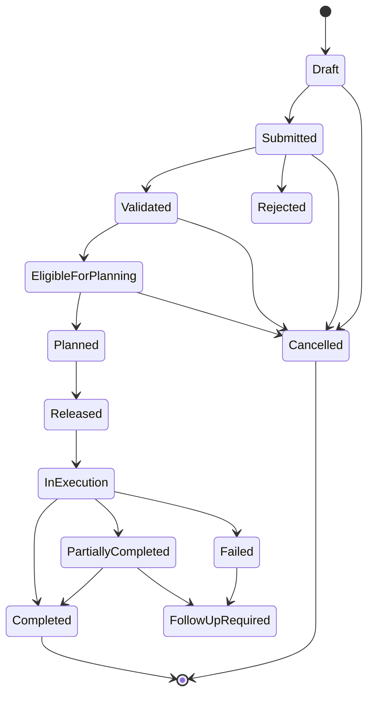

Each status transition must be controlled by defined validation and authorization rules.

## Supply and Inventory Validation

Before a movement can be planned, SCOP must determine whether the required products are available or expected to become available.

Validation may include:

- Available quantity
- Reserved quantity
- Forecasted quantity
- Product ownership
- Warehouse location
- Lot or batch requirements
- Expiration constraints
- Handling conditions
- Expected supplier receipt
- Expected customer-provided inventory
- Existing allocation to another shipment
- Inventory transfer requirements

The result should classify the demand as:

| Result | Meaning |
| --- | --- |
| Ready | The required products are available for operational preparation |
| Conditionally Ready | The products are expected to become available before execution |
| Partially Ready | Only part of the required quantity is available |
| Not Ready | The required quantity is unavailable |
| Blocked | A data, quality, ownership, or operational issue prevents planning |

Only eligible demand should enter the normal daily planning process.

## Inventory Ownership

SCOP must distinguish physical location from inventory ownership.

Inventory stored in the same warehouse may belong to:

- The operating company
- A specific customer
- A supplier under an approved arrangement
- Another authorized business party

Inventory ownership must remain traceable through:

- Receipt
- Storage
- Internal movement
- Picking
- Staging
- Loading
- Transportation
- Delivery
- Return
- Adjustment

Customer-owned inventory must not be mixed logically with company-owned inventory even when both are stored within the same physical facility.

## Warehouse Readiness

Warehouse readiness confirms whether products and operational resources can support the proposed movement.

A warehouse readiness check may include:

- Inventory availability
- Picking completion
- Product inspection
- Staging completion
- Packaging readiness
- Loading-area availability
- Loading-equipment availability
- Required documents
- Cross-dock readiness
- Transfer completion
- Product handling constraints
- Estimated loading duration

Warehouse readiness should be visible to the planning and operations teams.

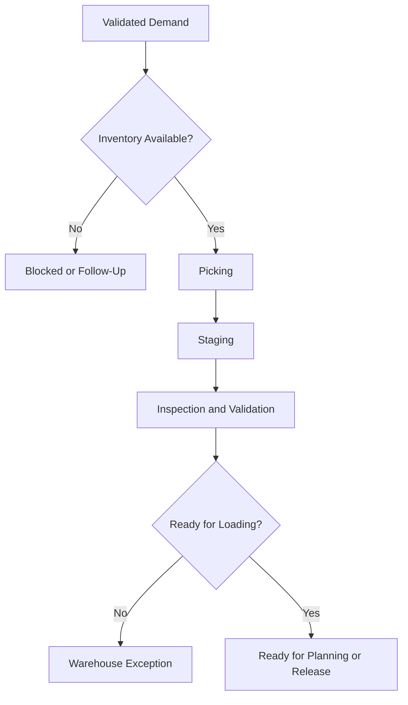

## Cross-Dock Operating Model

Cross-docking allows products to move through a warehouse or logistics facility without unnecessary long-term storage.

A cross-dock movement may be appropriate when:

- Products are already allocated to an outbound requirement.
- The outbound trip is expected within the approved time limit.
- Product inspection and handling requirements can be completed.
- The inbound and outbound timing is operationally compatible.
- Temporary staging space is available.
- Product ownership and traceability remain clear.
- The movement reduces handling, storage time, or operational cost.

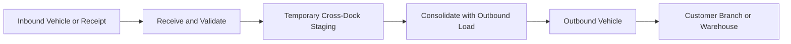

Cross-dock use may be:

- Defined manually by an authorized user
- Generated as a planning recommendation
- Selected according to approved business rules

Cross-dock recommendations must explain the timing, capacity, and operational benefits supporting the decision.

## Inter-Warehouse Transfers

SCOP must support product movements between company-managed warehouses.

An inter-warehouse transfer may be required to:

- Rebalance inventory
- Support customer demand
- Consolidate outbound distribution
- Move products closer to their destinations
- Resolve capacity limitations
- Support cross-dock operations
- Prepare for expected demand
- Respond to an operational exception

Transfers must be represented as controlled movement demand and included in transportation planning when a vehicle trip is required.

A transfer may share a trip with compatible pickup or delivery activities when all business constraints are satisfied.

## Daily Planning Cycle

Daily planning converts eligible movement demand into a coordinated operational plan.

The planning cycle evaluates:

- Eligible demand
- Product availability
- Warehouse readiness
- Pickup and delivery locations
- Required dates
- Customer time windows
- Priorities
- Shipment compatibility
- Vehicle availability
- Vehicle capacity
- Driver availability
- Route availability
- Travel and service duration
- Cross-dock opportunities
- Inter-warehouse requirements
- Operational costs
- Existing approved commitments

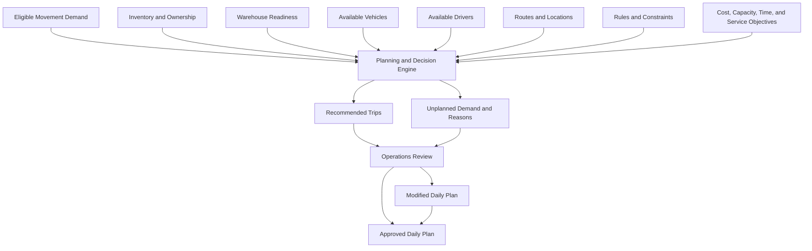

## Planning Horizon

The initial operating model focuses on daily planning.

The system should support:

- Planning for a selected operational date
- Replanning before operational release
- Controlled changes after approval
- Visibility of future demand
- Identification of capacity shortages
- Identification of demand that cannot be planned
- Recording reasons for unplanned demand

Future releases may introduce longer planning horizons and predictive capacity planning.

## Shipment Formation

A shipment is a logical grouping of products requiring transportation between defined operational locations.

Shipment formation must consider:

- Source and destination
- Customer or inventory owner
- Required date
- Time window
- Product compatibility
- Handling requirements
- Weight
- Volume
- Pallet or unit capacity
- Priority
- Warehouse readiness
- Allowed consolidation rules

One demand record may create one or more shipments.

Multiple demand records may be consolidated into compatible shipments or loads where business rules permit.

## Shipment Consolidation

Shipment consolidation combines compatible movement requirements to improve vehicle and trip utilization.

Consolidation may occur when shipments:

- Have compatible origins or collection points
- Have compatible destinations or route sequences
- Have compatible service dates and time windows
- Can be transported within the same vehicle conditions
- Do not violate product compatibility rules
- Fit within vehicle capacity
- Do not create unacceptable delays
- Provide measurable operational benefit

The system must not consolidate shipments only because capacity is available.

Consolidation must also protect service commitments, handling requirements, ownership, and traceability.

## Vehicle Capacity Model

Vehicle assignment must evaluate all capacity dimensions relevant to the operation.

These may include:

- Maximum weight
- Maximum volume
- Pallet capacity
- Crate or unit capacity
- Compartment capacity
- Temperature-controlled capacity
- Product compatibility
- Loading accessibility
- Route or location restrictions

A vehicle is feasible only when all mandatory constraints are satisfied.

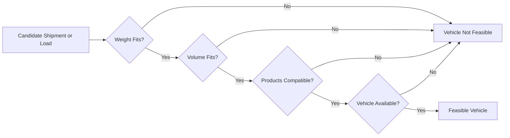

Capacity calculations should record:

- Planned capacity
- Used capacity
- Remaining capacity
- Capacity utilization percentage
- Constraint that limited further loading

## Vehicle Availability

A vehicle may be considered available only when:

- It is active.
- It is not assigned to an overlapping trip.
- It is not under maintenance.
- It is not blocked for operational or legal reasons.
- Its capacity and configuration meet the requirement.
- Its expected location supports the planned departure.
- Required documentation remains valid.
- It can complete the trip within its available working period.

The system must prevent conflicting vehicle assignments.

## Driver Availability

A driver may be considered available only when:

- The driver is active and authorized.
- The driver is not assigned to an overlapping trip.
- Required qualifications or licences are valid.
- Working-time requirements are respected.
- The driver can reach the planned departure location.
- No approved absence or operational block applies.

The system must prevent conflicting driver assignments.

## Route and Trip Relationship

A Route is a predefined reusable operational path or geographic structure.

A Trip is a dated execution containing assigned resources, shipments, stops, and planned times.

A trip may:

- Use an existing predefined route
- Use a modified version of a route
- Be generated from an optimized stop sequence
- Include multiple pickups
- Include multiple deliveries
- Include warehouse stops
- Include customer branches
- Include cross-dock or transfer activities

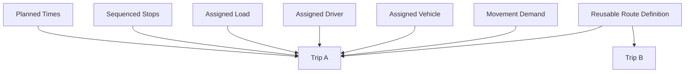

## Stop Model

A Stop represents one operational visit during a trip.

A stop must identify:

| Information | Description |
| --- | --- |
| Location | The warehouse, supplier, customer, branch, or other approved site |
| Sequence | The planned order within the trip |
| Activity | Pickup, delivery, transfer, cross-dock, return, or mixed activity |
| Planned Arrival | Expected arrival time |
| Planned Departure | Expected departure time |
| Time Window | Permitted service time where applicable |
| Service Duration | Expected time required at the location |
| Products | Goods loaded, unloaded, transferred, or returned |
| Status | Planned, arrived, servicing, completed, failed, or skipped |
| Actual Times | Recorded arrival, service, and departure times |
| Exception | Any issue affecting normal completion |

One stop may include both unloading and loading activities when operationally valid.

## Pickup and Delivery Within the Same Trip

SCOP must support trips that contain both pickup and delivery activities.

Examples include:

- Delivering products to a branch and collecting returns
- Collecting products from a supplier before delivering to customers
- Delivering customer products and collecting products for redistribution
- Transferring goods between warehouses while completing customer deliveries
- Collecting from a customer central location before distributing to branches

The stop sequence must maintain:

- Vehicle capacity feasibility throughout the trip
- Product ownership traceability
- Product compatibility
- Time-window compliance
- Correct loading and unloading sequence
- Warehouse and destination readiness

Vehicle capacity must be evaluated dynamically because the load changes after each stop.

## Time Windows

A time window defines the permitted or committed time range for servicing a location.

Time windows may be:

- Mandatory
- Preferred
- Flexible
- Internally defined
- Customer-defined
- Supplier-defined
- Warehouse-defined

The planning process must consider:

- Earliest arrival
- Latest arrival
- Service duration
- Expected departure
- Travel time to the next stop
- Waiting time
- Consequences of early or late arrival

A plan violating a mandatory time window must not be recommended as feasible unless an authorized exception process applies.

## Recommended Daily Plan

The generated daily plan should contain:

- Proposed trips
- Assigned vehicles
- Assigned drivers
- Assigned shipments and loads
- Sequenced stops
- Planned departure and arrival times
- Capacity utilization
- Expected distance and duration where available
- Time-window status
- Cross-dock or transfer recommendations
- Unplanned demand
- Constraint violations
- Recommendation explanations
- Expected operational KPIs

The plan remains a recommendation until approved by an authorized user.

## Plan Review and Approval

The Operations Manager must be able to:

1. Review the proposed daily plan.
2. Inspect each proposed trip.
3. Review vehicle and driver assignments.
4. Review shipment consolidation.
5. Review capacity utilization.
6. Review stop sequences and time windows.
7. Review cross-dock and transfer recommendations.
8. Review unplanned demand and reasons.
9. Modify authorized plan elements.
10. Approve or reject the plan.
11. Release approved trips for execution.

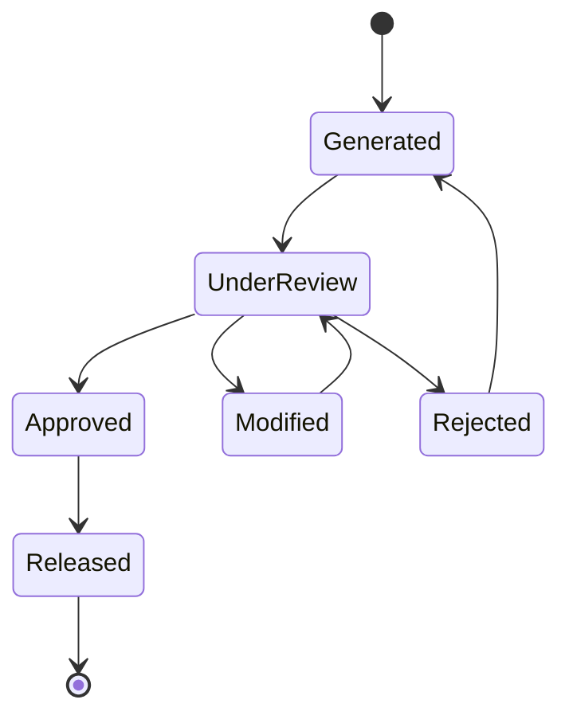

The system must record:

- Original recommendation
- Reviewing user
- Review time
- Manual modifications
- Modification reasons where required
- Approval decision
- Final released plan

## Operational Release

Operational release converts an approved plan into executable work.

Release activities may include:

- Confirming trips
- Reserving vehicles
- Reserving drivers
- Reserving inventory
- Creating or confirming warehouse picking requirements
- Creating staging and loading instructions
- Communicating trip assignments
- Confirming planned departure times
- Freezing controlled plan elements
- Activating operational monitoring

A released plan may only be changed through an authorized change process.

## Warehouse Preparation

After operational release, warehouse teams prepare the assigned loads.

Preparation may include:

1. Confirming inventory reservations.
2. Generating or validating picking tasks.
3. Picking products.
4. Performing required quality checks.
5. Packaging or consolidating goods.
6. Staging products by trip or loading sequence.
7. Confirming loading readiness.
8. Loading the assigned vehicle.
9. Recording loaded quantities.
10. Reporting shortages or exceptions.

The loading sequence should support the planned unloading sequence where practical.

## Trip Lifecycle

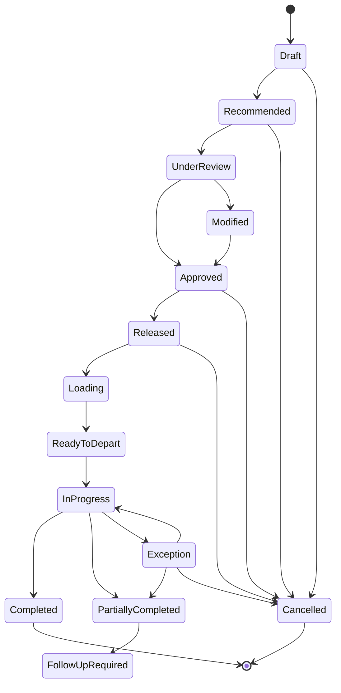

Each transition must record:

- Authorized actor
- Timestamp
- Relevant location
- Reason where applicable
- Validation result
- Related operational records

## Trip Execution

During execution, the platform should record:

- Actual departure time
- Actual arrival at each stop
- Actual service start and completion
- Actual departure from each stop
- Quantities picked up
- Quantities delivered
- Rejected or returned quantities
- Stop completion status
- Failure or delay reasons
- Trip exceptions
- Actual completion time
- Driver and vehicle participation

The initial release may rely on operations or warehouse users to record some execution events.

A future driver application may provide direct mobile execution updates.

## Stop Execution

A normal stop execution may follow this sequence:

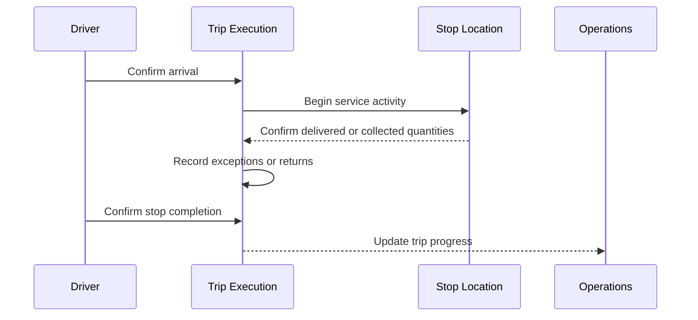

A stop may be marked:

- Completed
- Partially completed
- Failed
- Skipped
- Rescheduled

The selected result must include an approved reason when the stop is not completed normally.

## Returns

Returns may originate from:

- Customer rejection
- Delivery overage
- Product quality issues
- Damaged goods
- Incorrect products
- Expired products
- Reusable packaging
- Undelivered quantities
- Customer collection requirements

A return must identify:

- Original movement or delivery where applicable
- Product and quantity
- Ownership
- Return reason
- Source location
- Intended destination
- Required handling
- Inventory disposition
- Financial relevance where applicable

Returns may be collected during an existing trip or planned as separate movement demand.

## Exception Management

An exception is any condition preventing normal planning or execution.

Examples include:

- Missing inventory
- Warehouse delay
- Vehicle unavailability
- Driver unavailability
- Capacity violation
- Missed time window
- Product incompatibility
- Customer location closure
- Supplier delay
- Vehicle breakdown
- Delivery rejection
- Damaged products
- Incorrect master data
- Route disruption

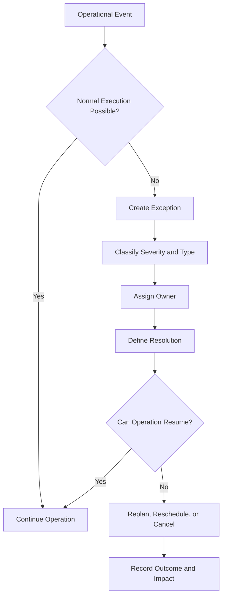

Every exception should include:

| Element | Description |
| --- | --- |
| Type | The category of operational problem |
| Severity | The level of business impact |
| Source | The object or process where the issue occurred |
| Detection Time | When the issue became known |
| Owner | The person or team responsible for resolution |
| Impact | The affected demand, shipment, trip, customer, or resource |
| Resolution | The selected corrective action |
| Status | Open, investigating, resolved, accepted, or cancelled |
| Outcome | The final operational result |

## Replanning

Replanning may be required when approved assumptions change.

Replanning triggers may include:

- Vehicle breakdown
- Driver absence
- Warehouse delay
- Inventory shortage
- Customer request
- Supplier delay
- Road disruption
- Urgent demand
- Failed delivery
- Missed time window

Replanning must:

- Protect completed execution records
- Preserve traceability of the original plan
- Identify affected trips and demand
- Re-evaluate constraints
- Require approval where applicable
- Record the difference between the original and revised plans

## Completion and Confirmation

A trip may be completed only when:

- All stops have a recorded outcome.
- Delivered and collected quantities are recorded.
- Returns and failed quantities are identified.
- Required documents or confirmations are available.
- Open exceptions are resolved or assigned for follow-up.
- Actual trip times are recorded.
- Vehicle and driver resources are released.
- Inventory movements are updated.
- Follow-up demand is created where necessary.

Completion does not mean that every stop succeeded.

It means the trip's actual outcome has been fully recorded and controlled.

## Operational Reconciliation

After execution, the platform should compare:

| Planned | Actual |
| --- | --- |
| Planned departure | Actual departure |
| Planned arrival | Actual arrival |
| Planned service duration | Actual service duration |
| Planned route or sequence | Actual route or sequence |
| Planned quantities | Actual quantities |
| Planned capacity utilization | Actual loaded and delivered quantities |
| Planned completion | Actual completion |
| Recommended assignments | Final executed assignments |
| Expected exceptions | Actual exceptions |
| Expected cost | Actual or estimated execution cost |

Reconciliation provides the data required to evaluate planning and decision quality.

## Performance Measurement

The operating model must generate measurable operational outcomes.

### Planning Measures

- Planning cycle duration
- Number of eligible demands
- Percentage of demand planned
- Number of unplanned demands
- Recommendation acceptance rate
- Number of manual changes
- Replanning frequency

### Fleet Measures

- Vehicle utilization rate
- Capacity utilization
- Trips per vehicle
- Empty or unused capacity
- Vehicle conflict rate
- Vehicle downtime impact

### Service Measures

- On-time pickup rate
- On-time delivery rate
- Time-window compliance
- Completed stop rate
- Failed stop rate
- Partial delivery rate

### Warehouse Measures

- Picking readiness
- Staging readiness
- Loading duration
- Loading delay
- Warehouse-caused trip delay
- Cross-dock processing time

### Trip Measures

- Planned versus actual duration
- Stops per trip
- Shipments per trip
- Distance per delivery
- Exception rate
- Return rate
- Completion reliability

### Decision Measures

- Recommendation approval rate
- Recommendation override rate
- Decision explanation availability
- Planned versus actual outcome
- Constraint violation rate
- Decision confidence where applicable

## Operational Roles

| Role | Operating Responsibility |
| --- | --- |
| Operations Manager | Approves plans, controls operational release, and manages major exceptions |
| Planner or Dispatcher | Prepares planning inputs, reviews recommendations, and coordinates trips |
| Warehouse User | Executes receipt, picking, staging, loading, transfer, and return activities |
| Driver | Executes assigned trips and records or communicates operational progress |
| Procurement User | Coordinates supplier requirements and inbound availability |
| Customer Service User | Maintains customer commitments, priorities, and delivery requirements |
| Inventory Controller | Maintains inventory accuracy, ownership, allocation, and reconciliation |
| Management | Reviews operational performance, service, capacity, cost, and risks |
| System Administrator | Maintains configuration, users, permissions, and controlled master data |

## Operational Control Principles

### No Execution Without Valid Demand

Every material movement must be linked to an authorized operational requirement.

### No Planning Without Required Data

Incomplete demand, location, product, capacity, or time-window information must be corrected or explicitly handled as an exception.

### No Resource Conflict

A vehicle or driver must not be assigned to overlapping operational commitments.

### No Capacity Violation

A trip must not exceed mandatory vehicle constraints.

### Human Approval Before Release

Recommended daily plans require authorized approval before normal operational release.

### Traceable Changes

Changes to approved plans must record the responsible user, time, reason, and impact.

### Actual Results Are Mandatory

Execution must record actual outcomes rather than treating the plan as proof of completion.

### Exceptions Require Ownership

Every operational exception must have an identified owner and status.

### Continuous Improvement

Planning and execution data must be used to improve future decisions and operating rules.

## Architecture Boundaries

This operating model defines:

- Operational stages
- Demand and trip lifecycles
- Planning and approval
- Warehouse preparation
- Pickup and delivery execution
- Cross-docking
- Transfers
- Returns
- Exceptions
- Replanning
- Completion
- Performance measurement

It does not define:

- Detailed user interface designs
- Detailed Odoo configuration
- Database schemas
- API contracts
- Optimization algorithms
- Technical integration specifications
- Complete security controls
- Driver mobile application design

Those subjects will be documented in their relevant functional and technical sections.

## Summary

The SCOP Supply Chain Operating Model connects movement demand, inventory, warehouses, vehicles, drivers, routes, trips, and decisions within one controlled operational cycle.

The model begins with valid demand, confirms supply and operational readiness, creates a recommended daily plan, requires human approval, supports structured execution, records actual outcomes, and measures performance.

Its central purpose is to ensure that every movement is planned, authorized, traceable, executable, and measurable.

## Related Pages

- [Documentation Design System](../getting-started/documentation-design-system.mdx)
- [Product Blueprint](../product/product-blueprint.mdx)
- [Business Architecture](../business/business-architecture.mdx)
- Business Domains
- Business Rules
- Trip Management
- Warehouse Operations
- Supply Chain Decision Engine
