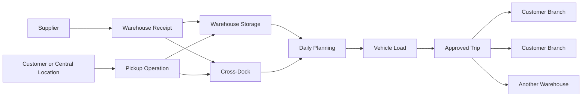
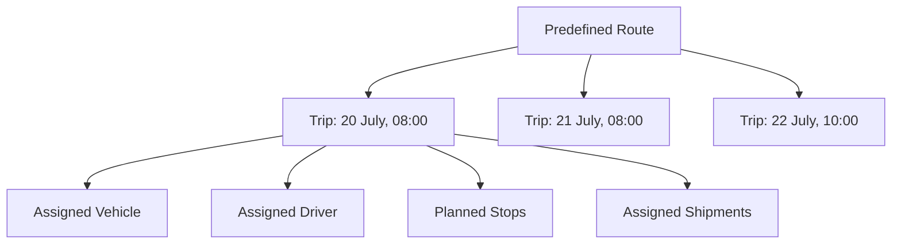
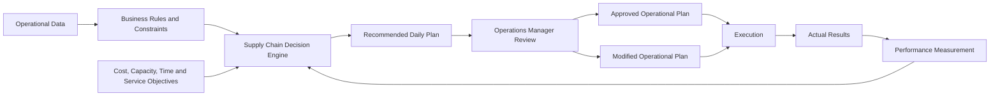

import DocumentInfo from '@site/src/components/DocumentInfo';

# Product Blueprint

<DocumentInfo
  category="Product"
  audience={['Executive', 'Business', 'Product', 'Technical']}
  status="Approved"
  version="1.0"
  owner="Product Team"
  updated="July 2026"
  readingTime="12 min"
/>

## Executive Summary

SCOP is a Supply Chain Operating Platform designed to manage and optimize procurement, warehousing, transportation, and distribution operations for restaurant chains and multi-branch food service businesses.

The platform connects suppliers, warehouses, vehicles, drivers, customers, and branches within one coordinated operational environment. It provides the visibility and control required to plan daily logistics activities, execute them efficiently, and measure their results.

SCOP uses Odoo 17 as its operational backbone while introducing dedicated capabilities for route management, trip planning, fleet utilization, cross-docking, shipment consolidation, and AI-assisted decision-making.

The initial product release will support human-controlled operations. The platform will generate recommendations and optimized plans, while authorized operations users retain responsibility for reviewing, modifying, approving, and executing those plans.

> **Product principle:** Every movement begins with a decision, and every decision begins with reliable data.

## Business Background

The company provides procurement and distribution services to restaurant chains operating multiple branches.

Its responsibilities may include:

- Purchasing products from approved suppliers
- Collecting products from suppliers
- Receiving and storing goods in one or more warehouses
- Transferring inventory between warehouses
- Consolidating products for distribution
- Collecting products from customers or central customer locations
- Redistributing products to customer branches
- Performing pickup and delivery activities within the same trip
- Coordinating vehicles, drivers, routes, time windows, and delivery priorities

These activities create a connected supply chain in which procurement, inventory, warehousing, transportation, and customer service must operate as one system.

## Business Challenges

The platform addresses several operational challenges.

### Fragmented Planning

Procurement, warehouse, and transportation activities may be planned separately even though they depend on one another.

This can create delays, duplicated work, and incomplete operational visibility.

### Vehicle Utilization

Vehicles have different capacities, availability conditions, and operating costs.

Manual assignment may result in unused capacity, unnecessary trips, or unsuitable vehicle selection.

### Complex Distribution Requirements

A single trip may include:

- Multiple customers
- Multiple branches
- Multiple shipments
- Pickups and deliveries
- Warehouse stops
- Cross-dock activities
- Mandatory delivery time windows

These constraints make daily planning difficult to perform consistently without decision support.

### Limited Decision Traceability

Operational teams need to understand:

- Why a vehicle was selected
- Why shipments were consolidated
- Why a route was chosen
- Why a trip was prioritized
- Which constraints affected the plan
- Who approved or changed the recommendation

SCOP must make these decisions visible and traceable.

### Scaling Operations

As the number of suppliers, customers, branches, warehouses, vehicles, and orders increases, manual planning becomes slower and less reliable.

The platform must support operational growth without requiring the same proportional increase in planning effort.

## Product Vision

To create an intelligent, decision-driven supply chain operating platform that transforms complex logistics data into coordinated, explainable, and measurable operational decisions.

SCOP should enable the business to manage daily supply chain operations through one reliable platform while progressively increasing automation as operational trust and data quality improve.

## Product Mission

SCOP exists to:

- Connect supply chain operations within one platform
- Improve visibility across procurement, warehousing, and distribution
- Increase fleet and vehicle capacity utilization
- Produce optimized daily trip plans
- Support multi-customer and multi-branch distribution
- Coordinate pickup and delivery activities
- Respect operational priorities and delivery time windows
- Provide explainable AI-assisted recommendations
- Maintain human control over important operational decisions
- Create reliable data for continuous operational improvement

## Core Product Principles

### Business First

Every feature must solve a defined business or operational need.

The platform should not introduce functionality without a clear purpose, owner, and expected outcome.

### Decision-Driven Architecture

Operational actions should be treated as decisions supported by data, constraints, rules, and measurable objectives.

Examples include:

- Assigning a vehicle
- Selecting a route
- Creating a trip
- Consolidating shipments
- Selecting a warehouse
- Choosing a cross-dock flow
- Prioritizing an order

### Human-in-the-Loop AI

AI will initially recommend decisions rather than execute them autonomously.

Authorized users must be able to:

- Review recommendations
- Understand their reasoning
- Modify proposed plans
- Approve or reject decisions
- Provide operational feedback

Automation may increase gradually after decision quality and operational trust are demonstrated.

### Explainability

Every important recommendation should explain the main factors behind it.

A recommendation should not function as an unexplained result.

### Traceability

The platform should record:

- The generated recommendation
- The rules and constraints applied
- The approving or modifying user
- The final operational decision
- The execution result
- The difference between the recommendation and the final outcome

### Configuration Before Customization

Standard Odoo functionality and configurable business rules should be used before creating custom software.

Customization should be introduced only when it provides necessary business value that cannot be achieved safely through configuration.

### Measurable Operations

Every major operational capability should expose measurable performance indicators.

The platform should help the business understand whether operational decisions are improving cost, capacity, service, and execution reliability.

## Product Objectives

The first product stages will focus on the following objectives.

| Objective | Intended Outcome |
| --- | --- |
| Unified operational visibility | Provide one view of supply chain activities and dependencies |
| Daily trip planning | Generate a coordinated daily plan for review and approval |
| Fleet optimization | Assign suitable available vehicles based on operational constraints |
| Capacity utilization | Improve the use of vehicle weight, volume, pallet, or unit capacity |
| Route and trip control | Separate predefined routes from their dated operational execution |
| Shipment consolidation | Combine compatible shipments where operationally beneficial |
| Time-window compliance | Plan arrival and service within customer-defined time windows |
| Multi-stop execution | Support trips containing multiple pickup and delivery stops |
| Cross-dock support | Allow goods to move through a facility without unnecessary storage |
| Decision explainability | Show why recommendations and assignments were generated |
| Operational measurement | Track plan quality, execution performance, cost, and service levels |

## Product Scope

### In Scope

SCOP will cover the following business capabilities:

- Supplier and customer-related operational data
- Customer branches and delivery locations
- Multiple warehouses
- Inter-warehouse transfers
- Procurement-related inbound movements
- Warehouse receipts and delivery orders
- Inventory visibility required for logistics planning
- Company-owned vehicle management
- Driver participation as system users
- Vehicle capacity and availability
- Predefined route management
- Scheduled trip management
- Multi-stop trip planning
- Pickup and delivery within the same trip
- Multiple customers or branches within one vehicle load
- Shipment and load consolidation
- Cross-dock operations
- Customer delivery time windows
- Daily planning recommendations
- Operations Manager review and approval
- Manual plan modification
- Decision traceability
- Operational reports and performance indicators
- AI-assisted planning and recommendations

### Outside the Initial Scope

The following capabilities are outside the initial product release unless approved through a later project phase:

- Fully autonomous dispatch without human approval
- A dedicated driver mobile application
- Real-time telematics or GPS hardware integration
- Advanced predictive vehicle maintenance
- Dynamic customer pricing
- Supplier marketplace functionality
- External customer self-service portals
- Fully automated procurement negotiations
- Public third-party developer APIs
- Advanced robotics or warehouse automation

These items may be introduced through future releases without changing the core product direction.

## Operating Model

SCOP coordinates product movement from its source to its required destination.

Products may originate from suppliers, warehouses, customers, or central customer locations. They may be stored, transferred, cross-docked, consolidated, collected, or delivered depending on the operational requirement.

The operating model must support:

1. Demand and movement requirements entering the system.
2. Inventory and shipment availability being validated.
3. Candidate shipments being grouped.
4. Routes, vehicles, drivers, capacities, and time windows being evaluated.
5. A daily trip plan being generated.
6. The Operations Manager reviewing and modifying the plan.
7. Approved trips being released for execution.
8. Actual execution results being recorded.
9. Planning and execution performance being measured.

## Route and Trip Model

SCOP distinguishes between a Route and a Trip.

| Concept | Definition |
| --- | --- |
| Route | A predefined operational path or reusable sequence of locations |
| Trip | A scheduled execution of a route or planned sequence of stops on a specific date and time |
| Stop | One operational location visited during a trip |
| Pickup | A stop activity where goods are loaded |
| Delivery | A stop activity where goods are unloaded |
| Shipment | A logical group of goods requiring transportation |
| Load | The physical cargo assigned to a vehicle for execution |

A route may be reused many times.

Each trip represents a specific execution and includes assigned resources, shipments, planned times, stops, and operational status.

## Business Domains

SCOP is organized around connected business domains.

| Domain | Responsibility |
| --- | --- |
| Procurement | Product sourcing and supplier-related inbound requirements |
| Order Management | Customer, branch, and internal movement demand |
| Warehouse | Receipts, storage, picking, staging, transfers, and cross-docking |
| Inventory | Product availability, ownership, location, and movement visibility |
| Fleet | Company-owned vehicles, capacity, availability, and operational condition |
| Routes | Reusable operational paths and location sequences |
| Trips | Scheduled transportation execution and stop management |
| Planning | Daily shipment, resource, and trip coordination |
| Decision Engine | Rule-based and optimization-supported operational decisions |
| AI Platform | Recommendations, predictions, explanations, and learning capabilities |
| Analytics | Operational performance, service, cost, utilization, and decision outcomes |
| Administration | Configuration, users, roles, permissions, and governance |

These domains should operate as connected capabilities rather than isolated applications.

## Supply Chain Decision Engine

The Supply Chain Decision Engine is the platform capability responsible for converting operational data into recommended actions.

It evaluates:

- Shipment requirements
- Product availability
- Pickup and delivery locations
- Vehicle capacities
- Vehicle availability
- Driver availability
- Route definitions
- Trip duration
- Customer time windows
- Order priority
- Warehouse operating constraints
- Cross-dock opportunities
- Inter-warehouse transfer requirements
- Operational cost and utilization objectives

The engine may generate recommendations for:

- Shipment consolidation
- Vehicle assignment
- Driver assignment
- Trip creation
- Route selection
- Stop sequencing
- Warehouse selection
- Cross-dock use
- Order prioritization
- Planned departure and arrival times

:::info

In the initial product stages, generated daily plans are recommendations. An authorized Operations Manager must approve or modify the plan before operational release.

:::

## AI Vision

AI should improve decision quality without removing accountability.

The AI capability will develop progressively.

### Stage 1 — Assisted Decisions

The platform recommends actions based on operational data, rules, constraints, and optimization objectives.

Users retain full approval authority.

### Stage 2 — Trusted Automation

The platform may automatically execute low-risk, well-defined decisions when confidence and operational rules permit.

Exceptions continue to require human review.

### Stage 3 — Adaptive Operations

The platform learns from execution outcomes and operational feedback to improve forecasting, planning, resource utilization, and exception handling.

Progression between stages must depend on measurable performance, data quality, explainability, and management approval.

## User Roles

The initial platform will support several operational perspectives.

| Role | Primary Responsibility |
| --- | --- |
| Operations Manager | Reviews, modifies, approves, and monitors daily operational plans |
| Planner or Dispatcher | Prepares demand, evaluates recommendations, and coordinates trips |
| Warehouse User | Processes receipts, picking, staging, loading, transfers, and returns |
| Driver | Participates in assigned trip execution and later uses the driver application |
| Procurement User | Coordinates supplier orders and inbound requirements |
| Customer Service User | Monitors customer orders, branches, priorities, and delivery commitments |
| System Administrator | Maintains users, permissions, configuration, and platform governance |
| Management | Reviews performance, service, utilization, cost, and operational risks |

Detailed access rights will be defined in later functional and security specifications.

## Odoo 17 Role

Odoo 17 will serve as the operational backbone of SCOP.

Standard Odoo capabilities should be used where they meet business requirements, including:

- Purchase management
- Sales and order-related workflows
- Inventory management
- Warehouse operations
- Fleet records
- User access and permissions
- Operational documents
- Reporting foundations
- Integration services

Custom SCOP capabilities will extend Odoo where necessary for:

- Advanced route and trip management
- Multi-stop transportation planning
- Vehicle capacity optimization
- Shipment consolidation
- Cross-domain operational planning
- Decision traceability
- AI-assisted recommendations
- Explainable planning outcomes
- Future automated dispatch capabilities

SCOP should remain an integrated Odoo-based platform rather than a collection of disconnected external systems.

## Success Measures

The product will be evaluated using business and operational measures.

| Area | Example Measures |
| --- | --- |
| Fleet utilization | Vehicle use rate, loaded capacity, empty capacity, trips per vehicle |
| Planning efficiency | Planning time, manual changes, recommendation acceptance rate |
| Service performance | On-time pickup, on-time delivery, time-window compliance |
| Trip efficiency | Stops per trip, distance per delivery, duration, empty travel |
| Warehouse coordination | Staging readiness, loading delays, transfer completion |
| Shipment consolidation | Shipments per trip, orders per load, consolidation rate |
| Cost control | Cost per trip, delivery, kilometer, customer, or unit |
| Decision quality | Recommendation approval rate, override rate, outcome performance |
| Execution reliability | Completed trips, failed stops, returns, delays, exceptions |
| Data quality | Missing data, invalid constraints, incomplete execution records |

Exact targets and calculation formulas will be defined during business architecture and functional specification activities.

## Product Roadmap

### Release 1 — Operational Foundation

- Odoo 17 operational integration
- Multi-warehouse support
- Fleet and driver records
- Route and trip management
- Pickup and delivery stops
- Vehicle capacity constraints
- Customer time windows
- Daily recommended trip planning
- Operations Manager approval
- Manual plan modification
- Basic operational reports

### Release 2 — Optimization and Visibility

- Advanced shipment consolidation
- Route and stop optimization
- Cross-dock recommendations
- Inter-warehouse optimization
- Improved ETA calculation
- Cost and utilization analysis
- Decision explanation
- Recommendation comparison
- Exception monitoring

### Release 3 — Intelligent Automation

- Confidence-based automated decisions
- Adaptive planning based on execution results
- Predictive demand and capacity requirements
- Automated exception response for approved scenarios
- Driver mobile application
- Real-time location and trip monitoring
- Advanced predictive operational analytics

The roadmap describes product direction and may change according to business priorities, implementation results, and approved project decisions.

## Product Boundaries

SCOP is responsible for coordinating and improving supply chain operations.

It is not intended to replace business ownership or management accountability.

The platform will:

- Provide reliable operational data
- Apply approved business rules
- Generate recommendations
- Highlight risks and exceptions
- Record decisions and results
- Support measurable improvement

Authorized users remain responsible for approvals, overrides, policy decisions, and exceptional operational situations.

## Summary

SCOP provides a unified operating platform for procurement, warehousing, fleet, route, trip, and distribution activities.

Its architecture combines Odoo 17 operational capabilities with specialized logistics planning and a decision-driven intelligence layer.

The first releases will prioritize visibility, structured operations, optimized recommendations, human approval, and measurable results. Future releases may introduce increasing automation as the platform earns operational trust.

## Related Pages

- [Documentation Design System](../getting-started/documentation-design-system.mdx)
- Business Architecture
- Operating Model
- Business Domains
- Supply Chain Decision Engine
