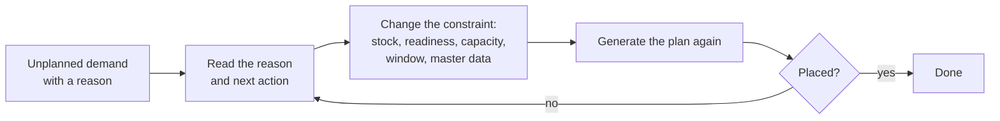

import DocumentInfo from '@site/src/components/DocumentInfo';
import Screenshot from '@site/src/components/Screenshot';

# Unplanned Demand

<DocumentInfo
  category="Quick Start"
  audience={['Planning', 'Operations', 'UAT']}
  status="Review"
  version="1.0"
  owner="Product Team"
  updated="August 2026"
  readingTime="4 min"
/>

## The principle

:::info[Demand that cannot be planned must never disappear quietly]

If SCOP cannot fit a demand into the plan, it does not drop it and it does not fail silently. It records the demand, **the reason**, and **what to do about it**.

An operator told only that something failed has to work out the remedy themselves. An operator told the reason and the suggested next action can act.

:::

## Where to look

**Role**
Planner / Dispatcher

**Navigate to**
`SCOP → Planning → Unplanned Demand`

<Screenshot
  src="quick-start/17-unplanned-demand.png"
  alt="SCOP Unplanned Demand list, empty because every demand in the walkthrough was planned."
  caption="Empty is the good outcome — in the walkthrough every eligible demand was placed. When it is not empty, each row names a demand, a reason, and a next action."
/>

You can also open the **Unplanned Demand** tab on the daily plan itself, which shows only what that plan could not place.

## What each row tells you

| Column | Meaning |
| --- | --- |
| **Demand** | The demand that was not placed |
| **Plan** / **Plan Date** | The plan and operating day it was considered for |
| **Reason** | Why it could not be placed |
| **Next Action** | The suggested remedy |
| **Detail** | The provider's own words — which vehicle, which window, which constraint |
| **Partner** | The customer affected, so service risk is visible immediately |

## The reasons SCOP can give

These are the governed values, not free text:

| Reason | What it means |
| --- | --- |
| No available inventory | The goods are not there to move |
| Warehouse not ready | Readiness is not plannable |
| No feasible vehicle | No vehicle can carry it within its constraints |
| No qualified driver | No available driver holds the required qualification |
| Capacity shortage | Total demand exceeds the fleet offered for that day |
| Time-window conflict | The delivery window cannot be met alongside the rest of the route |
| Product incompatibility | The goods may not travel with what is already loaded |
| Route restriction | A route or access limit rules it out |
| Missing required data | Something the engine needs is absent |
| Customer location unavailable | The destination is closed or unusable that day |
| Planning horizon exceeded | The required date is outside the planning horizon |
| Lower priority than available capacity permits | It lost to higher-priority demand |

## The next actions SCOP can suggest

| Next action | What you would do |
| --- | --- |
| Replan for another date | Move it to a day with capacity |
| Use another warehouse | Source it from a node that can serve it |
| Split the shipment | Deliver what fits now, the rest later |
| Request additional capacity | Add a vehicle or a shift |
| Resolve missing data | Fix the master data the engine needed |
| Change the time window with authorisation | Renegotiate the window, with approval |
| Perform an inter-warehouse transfer | Move stock to the node that will ship it |

## What to do about it

:::warning[Do not simply generate the plan again]

Regenerating a plan without changing anything produces the same answer, because the baseline provider is deterministic. The reason is the work item.

:::

The correct loop is:

Worked examples:

| Reason | Act on it by |
| --- | --- |
| Warehouse not ready | Stage the goods — [Shipment and Readiness](../walkthrough/shipment-and-readiness.mdx) |
| No available inventory | Check stock and reservation in Odoo |
| Capacity shortage | Add a vehicle for the date in `SCOP → Master Data → Vehicle Availability` |
| No qualified driver | Check `SCOP → Master Data → Driver Qualifications` for expiry |
| Missing required data | Usually a location without coordinates, a timezone, or opening hours |

## Measuring it

Two reports turn this screen into a trend rather than a daily annoyance:

- **Plan Coverage** — did we plan what could be planned?
- **Unplanned Demand** — what prevented planning, grouped by reason, so the constraint that costs the most service is visible.

Both are covered in [Reports You Should Know](../reports-you-should-know.mdx).

## Related Pages

- [Generate the Plan](../walkthrough/generate-the-plan.mdx)
- [Failed Delivery](./failed-delivery.mdx)
- [Reports You Should Know](../reports-you-should-know.mdx)
