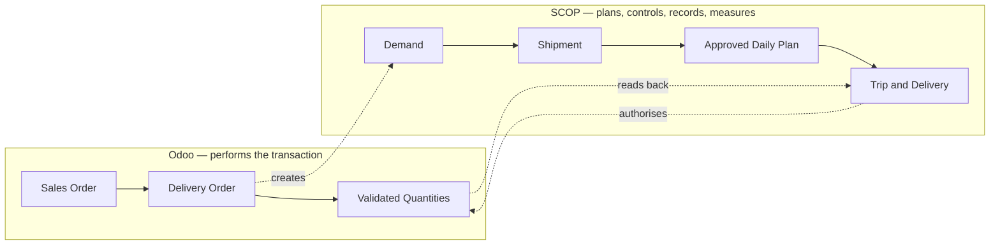

import DocumentInfo from '@site/src/components/DocumentInfo';

# SCOP Quick Start Guide

<DocumentInfo
  category="Quick Start"
  audience={['Business', 'Operations', 'Warehouse', 'Planning', 'UAT']}
  status="Review"
  version="1.0"
  owner="Product Team"
  updated="August 2026"
  readingTime="2 min"
/>

## What SCOP is

SCOP — the Supply Chain Operating Platform — is the layer that **plans, controls, records, and measures** the movement of goods.

It does not move the goods. Odoo does that. SCOP decides which movements should happen today, checks that they are allowed and possible, records what actually occurred, and measures the result.

## The problem it solves

Without SCOP, a day of operations is assembled by hand: someone reconciles customer commitments, stock, warehouse readiness, vehicles, drivers, and routes across spreadsheets and phone calls. The plan lives in one person's head, nobody can explain a decision a week later, and problems are discovered during delivery rather than before departure.

SCOP replaces that with one coordinated daily cycle in which every movement is planned, approved by an authorised person, executed, and measured.

## How SCOP relates to Odoo

This is the single most important idea in the guide:

:::info[Odoo drives. SCOP listens.]

**Odoo performs the warehouse transaction.** The delivery order, the reservation, the picking, the validated quantities — all of that stays exactly where it is today.

**SCOP plans, controls, records, and measures the operation around it.** It adds readiness, planning, approval, execution visibility, governance, and measurement.

:::

Your existing Odoo work does not change. When a salesperson confirms an order, Odoo creates the delivery order as it always has. SCOP notices, and creates its own record of *what needs to move* so it can plan it.

Two consequences worth remembering from the start:

- **Quantities always come from the Odoo transfer.** A short delivery is recorded in Odoo, never typed into SCOP. SCOP reads it back.
- **SCOP will refuse to plan a movement it cannot justify.** That is a feature. Where it refuses, it names the record and the reason.

## What you will learn

By the end of this guide you will have taken **one customer delivery through the complete cycle** and be able to:

| You will be able to | Covered in |
| --- | --- |
| Read the operating cycle end to end | [Process at a Glance](./process-at-a-glance.mdx) |
| Know which role does what, and why approvals are split | [Roles and Responsibilities](./roles-and-responsibilities.mdx) |
| Take one delivery from order to completion | [Customer Delivery Walkthrough](./walkthrough/create-the-order.mdx) |
| Understand why SCOP sometimes refuses to proceed | [When Things Do Not Go to Plan](./exceptions/unplanned-demand.mdx) |
| Find the six reports a new user needs | [Reports You Should Know](./reports-you-should-know.mdx) |
| Test the platform yourself, step by step | [SCOP End-to-End Test Checklist](./end-to-end-test-checklist.mdx) |
| Tell today's capability from tomorrow's plan | [Release 1 Boundaries](./release-1-boundaries.mdx) |

## What this guide is not

This is a Quick Start and operational walkthrough, not the full SCOP End User Manual. It gets you through **one** successful cycle. It does not explain every field, every report column, or every configuration option.

For the business definition behind the platform, see the [Executive Blueprint](../getting-started/executive-blueprint.mdx) and the [Supply Chain Operating Model](../operations/supply-chain-operating-model.mdx).

## Before you start

You will need:

- A SCOP user account with a role assigned — see [Roles and Responsibilities](./roles-and-responsibilities.mdx).
- **A second user account** to approve the plan. The person who creates a plan cannot approve it, so a solo tester cannot complete the cycle.
- A warehouse inside the pilot scope. SCOP only creates records for operations a pilot-scope record has switched on.

:::warning[Some SCOP roles also need Odoo rights]

SCOP is an overlay on Odoo, so a role that does Odoo's own work needs Odoo's own groups: **Fleet / Administrator** and **Employees / Officer** for planners, because the planning wizard reads vehicles and assigning a driver reads employees, and **Inventory / User** for planners and for whoever validates transfers, because resolving ownership and marking a demand eligible read Odoo's reservations. No Sales permission is needed to open or operate a demand. See [Roles and Responsibilities](./roles-and-responsibilities.mdx).

Simply *reading* a SCOP screen does not require them.

:::

## Terminology

The guide uses one term per concept throughout. The Arabic edition uses the agreed Arabic term in the same table.

| Term | Meaning in one line |
| --- | --- |
| Demand | What needs to move |
| Shipment | The unit that can be planned |
| Warehouse Readiness | Whether the goods can actually go, and why |
| Planning Run | One attempt to build a plan, with its inputs and answer kept |
| Daily Plan | The proposed operating plan for one day |
| Trip | One vehicle and driver executing a sequence of stops |
| Stop | One location visited during a trip |
| Loading Task | Warehouse work to load a shipment onto a vehicle |
| Unplanned Demand | Demand the run could not place, with the reason |
| Service Commitment | What was promised to the customer |
| Supplier Commitment | What a supplier promised us |
| Ownership | Who owns the goods being moved |
| Exception | A recorded operational problem needing resolution |
| Plan Coverage | Did we plan what could be planned? |
| OTIF | On Time, In Full |
| Decision Quality | How often the recommendation was accepted or overridden |

## Related Pages

- [Executive Blueprint](../getting-started/executive-blueprint.mdx)
- [Supply Chain Operating Model](../operations/supply-chain-operating-model.mdx)
- [Business Rules](../business/business-rules.mdx)
