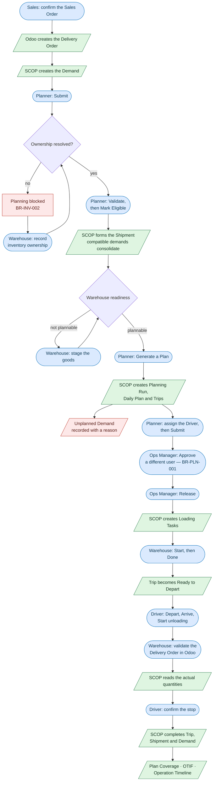

import DocumentInfo from '@site/src/components/DocumentInfo';

# Process at a Glance

<DocumentInfo
  category="Quick Start"
  audience={['Business', 'Operations', 'Warehouse', 'Planning', 'UAT']}
  status="Review"
  version="1.0"
  owner="Product Team"
  updated="August 2026"
  readingTime="4 min"
/>

## The cycle

One customer delivery passes through this sequence. The colours separate **what a person does** from **what the system does on its own** — most of this cycle is automatic.

**Rounded boxes are people.** Someone signs in and presses something.

**Slanted boxes are the system.** SCOP or Odoo does it as a consequence, with nobody typing anything — creating the demand, forming the shipment, cutting the loading tasks, reading the quantities back, and closing the trip, shipment and demand together.

**Red boxes are where SCOP stops you** and says why.

Read it as three movements:

1. **Something needs to move.** An order becomes a delivery order, and SCOP records a Demand.
2. **Can it move, and should it move today?** Ownership and readiness are checked; a plan is proposed, reviewed, approved by someone other than its author, and released.
3. **What actually happened?** The driver records the outcome, Odoo records the quantities, and SCOP measures the difference.

## The main objects

### Demand

**What needs to move.**

A Demand is deliberately *not* the same thing as an Odoo transfer. One demand may take several transfers to fulfil, and one transfer may serve several demands. A backorder is another fulfilment of the same demand, not a new demand.

That separation is what lets SCOP answer "did the customer get what we promised?" rather than only "was this document processed?"

### Shipment

**The unit that can be planned.**

Demand says what must move. A Shipment groups it into something a vehicle can be assigned to — with a weight, a volume, an origin, and a destination.

SCOP forms it **automatically** when a demand is marked eligible. You do not press a button to create one.

:::info[One demand does not necessarily equal one shipment]

Compatible eligible demands — same destination, same required day — are consolidated into a single open shipment before planning. Two separate customer orders can therefore travel as one shipment.

Verified on `b2b`: two orders for the same customer and date produced `DMD-2026-000004` and `DMD-2026-000005`, and both were carried by one shipment, `SHP-2026-000003`.

:::

### Warehouse Readiness

**Whether the goods can actually go, and why.**

Readiness is computed from evidence — is the stock reserved, is it staged, is ownership resolved — never typed in. It always carries its reasoning in words.

| Readiness | Meaning | Can it be planned? |
| --- | --- | --- |
| Ready | Everything is staged | Yes |
| Conditionally Ready | Reserved, expected to be available before execution | Yes |
| Partially Ready | Only part of the shipment can be covered | No |
| Not Ready | The goods are not prepared | No |
| Blocked | Something must be fixed first, such as unresolved ownership | No |

A supervisor standing in the warehouse can override the computed value. The override is recorded with who set it, when, and why, and is shown **beside** the computed value rather than replacing it.

### Planning Run

**One attempt to build a plan.**

The run keeps its inputs, its answer, and how long it took, so a plan can still be explained months later.

### Daily Plan

**The proposed operating plan for one day.**

It holds the recommended trips and the demand that could not be placed. Its lifecycle is `Generated → Under Review → Approved → Released`.

### Trip

**One vehicle and driver executing a sequence of stops.**

### Stop

**One location visited during a trip** — a warehouse pickup or a customer delivery. A stop records when the driver arrived, what happened, and the proof of delivery.

### Exception

**A recorded operational problem** that needs investigation or resolution, with an owner and an ageing clock.

## Where SCOP will stop you

SCOP is designed to refuse rather than guess. Three refusals appear in this guide, all demonstrated on the running system:

| Rule | What it prevents | Where you meet it |
| --- | --- | --- |
| `BR-INV-002` | Planning a movement whose owner SCOP cannot establish | [Demand and Ownership](./walkthrough/demand-and-ownership.mdx) |
| `BR-PLN-001` | The author of a plan approving their own plan | [Review and Approve](./walkthrough/review-and-approve.mdx) |
| `BR-EXE-001` | Closing a failed or short delivery without saying why | [Failed Delivery](./exceptions/failed-delivery.mdx) |

## Related Pages

- [Overview](./overview.mdx)
- [Roles and Responsibilities](./roles-and-responsibilities.mdx)
- [Business Objects](../business/business-objects.mdx)
- [Business Rules](../business/business-rules.mdx)
