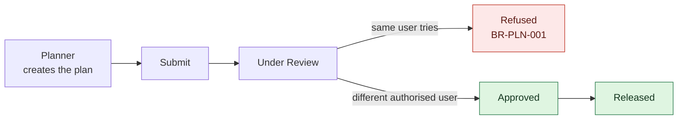

import DocumentInfo from '@site/src/components/DocumentInfo';

# Roles and Responsibilities

<DocumentInfo
  category="Quick Start"
  audience={['Business', 'Operations', 'Warehouse', 'Planning', 'UAT']}
  status="Review"
  version="1.0"
  owner="Product Team"
  updated="August 2026"
  readingTime="4 min"
/>

## Who does what

| Role | Main responsibility |
| --- | --- |
| Sales / Customer Service | Creates the customer order and records what was committed |
| Warehouse | Prepares and stages the goods, confirms readiness, loads the vehicle |
| Planner / Dispatcher | Generates and reviews the daily plan, investigates unplanned demand |
| Operations Manager | Reviews, approves, and releases the plan |
| Driver | Executes the trip and records the delivery outcome |
| Procurement | Manages inbound supplier commitments |
| Management | Reviews KPIs and operational performance |

## The role groups in the system

SCOP ships nine role groups. You will find them on a user record under the **SCOP** section.

| SCOP group | Typical holder | Notable rights |
| --- | --- | --- |
| SCOP User | Everyone who reads SCOP data | Read demands, shipments, trips |
| Warehouse User | Warehouse staff | Warehouse Readiness, Loading Tasks, staging |
| Planner / Dispatcher | Planners, dispatchers | Generate plans, review, modify, unplanned demand |
| Operations Manager | Operations management | Implies Planner **and** Warehouse User |
| Driver | Drivers | Only their own trips and stops, through **My Work** |
| Procurement User | Buyers | Supplier Commitments |
| Customer Service User | Customer service | Service Commitments |
| Finance User | Finance | Read-only operational figures |
| Management | Management | Dashboard and reporting |
| Administrator | System owners | Implies Operations Manager and Management |

:::warning[A SCOP group does not grant the underlying Odoo rights]

SCOP screens read Odoo records, so operational users need the matching Odoo groups as well:

| SCOP role | Also needs |
| --- | --- |
| Any operational SCOP role | **Inventory → User** |
| Planner / Dispatcher, Operations Manager | **Inventory → User**, **Fleet → Officer** |

Without them the Demand form and the planning wizard raise `Access Error`. See [Release 1 Boundaries](./release-1-boundaries.mdx).

:::

## Separation of duties

This is a **system rule, not a procedure**:

:::danger[The person who creates a plan cannot approve it]

`BR-PLN-001` — the author of a daily plan may not approve or release it. SCOP refuses the action and says why.

The refusal outranks administrator rights. An administrator who creates a plan is still refused, because the whole point of separation of duties is that no single person both creates and approves — and an administrator is a single person.

:::

Practically, this means:

- A single tester **cannot** complete the cycle alone. You need two accounts.
- The approver must be a different, authorised user.
- The refusal cannot be worked around by granting yourself more rights.

You will run both cases against the real system in [Review and Approve](./walkthrough/review-and-approve.mdx).

## Which role opens which menu

| Menu | Roles that see it |
| --- | --- |
| `SCOP → Operations → Demands` | SCOP User and above |
| `SCOP → Operations → Shipments` | SCOP User and above |
| `SCOP → Operations → Warehouse Readiness` | Warehouse User |
| `SCOP → Operations → Loading Tasks` | Warehouse User |
| `SCOP → Operations → Exceptions` | SCOP User and above |
| `SCOP → Planning → …` | Planner / Dispatcher |
| `SCOP → My Work → My Trips` / `My Stops` | Driver |
| `SCOP → Reporting → …` | SCOP User; some reports are Planner-only |
| `SCOP → Master Data → …` | SCOP User; some entries are Administrator-only |
| `SCOP → Governance → …` | SCOP User; some entries are Administrator-only |
| `SCOP → Technical → …` | Administrator |

:::info

A hidden menu is presentation, not access control. SCOP enforces access on the records themselves, so hiding a menu never becomes the only thing standing between a role and the data.

:::

## Related Pages

- [Process at a Glance](./process-at-a-glance.mdx)
- [Review and Approve](./walkthrough/review-and-approve.mdx)
- [Business Rules](../business/business-rules.mdx)
