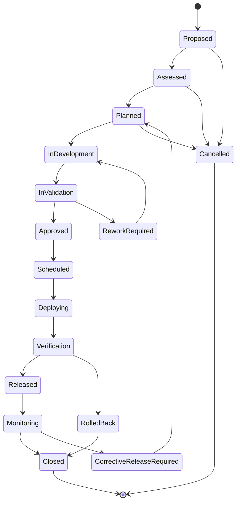
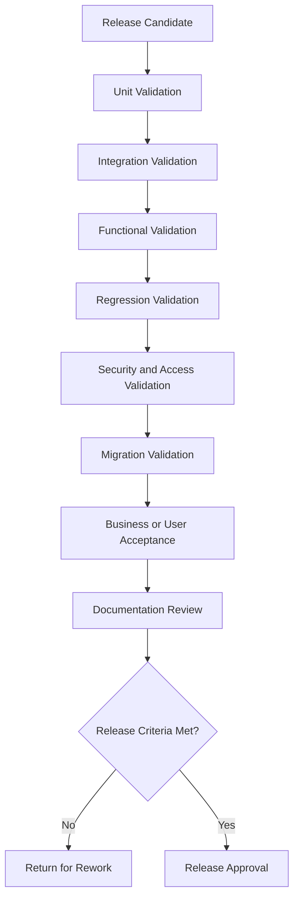
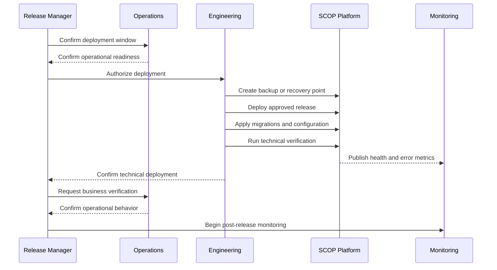
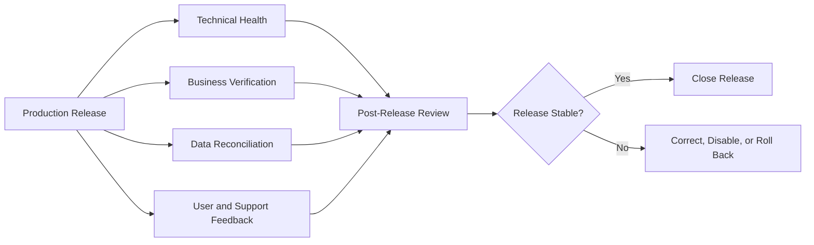

import DocumentInfo from '@site/src/components/DocumentInfo';

# Release Management

<DocumentInfo
  category="Release Notes"
  audience={['Executive', 'Product', 'Business', 'Operations', 'Technical', 'Development', 'Support']}
  status="Approved"
  version="1.0"
  owner="Product and Engineering Teams"
  updated="July 2026"
  readingTime="12 min"
/>

## Purpose

Release Management defines how SCOP changes are prepared, validated, approved, deployed, communicated, monitored, and recorded.

It provides a controlled framework for releasing changes affecting:

- Odoo 17 configuration
- SCOP custom modules
- Operational workflows
- Supply chain planning
- Decision Engine behavior
- AI Platform capabilities
- Business rules and constraints
- Integrations
- Reports and analytics
- Security controls
- Technical infrastructure
- Documentation

Release Management ensures that operational users understand what changed, why it changed, how it affects them, and what actions may be required.

## Objectives

The SCOP release process is designed to:

- Deliver approved changes safely.
- Protect operational continuity.
- Maintain traceability from requirement to production.
- Validate business and technical behavior.
- Communicate changes clearly.
- Identify upgrade or migration requirements.
- Record known limitations.
- Support rollback or recovery.
- Monitor post-release behavior.
- Preserve version history.
- Keep documentation synchronized with released functionality.

## Release Principles

### Controlled Change

No production change should occur without:

- Defined scope
- Identified owner
- Appropriate review
- Validation
- Approval
- Deployment plan
- Verification plan
- Communication
- Recovery consideration

### Operational Safety

A release must not place operational records, customer commitments, inventory, trips, decisions, or integrations at unacceptable risk.

High-impact changes require stronger validation and approval.

### Traceability

Every release should be traceable to:

- Business requirements
- Product decisions
- Technical changes
- Tests
- Approvals
- Deployment records
- Documentation
- Incidents or corrective actions where applicable

### Documentation With Delivery

Documentation should be updated within the same release that changes the documented behavior.

A feature should not be considered complete when users cannot understand how it works or how it affects operations.

### Reversible Change

Where practical, releases should support:

- Rollback
- Feature deactivation
- Configuration restoration
- Model-version restoration
- Controlled database recovery
- Manual operational fallback

### Measured Release

A release is not complete when deployment finishes.

It is complete only after post-release verification confirms that the intended behavior is operating acceptably.

## Release Scope

A SCOP release may contain one or more change types.

| Change Type | Examples |
| --- | --- |
| Product Change | New capability, workflow, or user experience |
| Operational Change | New planning, warehouse, trip, or exception process |
| Business Rule Change | New or updated decision rule, constraint, or approval policy |
| Odoo Configuration | Warehouse, user-role, workflow, or master-data configuration |
| Odoo Module Change | New or updated SCOP module |
| Decision Engine Change | Planning logic, scoring, constraint, or explanation update |
| AI Platform Change | Model, feature, prediction, monitoring, or fallback update |
| Integration Change | External interface, authentication, mapping, or error handling |
| Reporting Change | KPI, dashboard, report, or analytical data update |
| Security Change | Permission, authentication, dependency, or security-control update |
| Infrastructure Change | Environment, database, service, monitoring, or deployment update |
| Documentation Change | New or updated Knowledge Hub content |
| Corrective Change | Defect fix or incident-related correction |

## Release Lifecycle

```mermaid
flowchart LR
    Request[Change Request] --> Assess[Scope and Impact Assessment]
    Assess --> Plan[Release Planning]
    Plan --> Develop[Development or Configuration]
    Develop --> Review[Technical and Business Review]
    Review --> Validate[Testing and Validation]
    Validate --> Approve[Release Approval]
    Approve --> Communicate[Release Communication]
    Communicate --> Deploy[Deployment]
    Deploy --> Verify[Post-Release Verification]
    Verify --> Monitor[Operational Monitoring]
    Monitor --> Close[Release Closure]
    Monitor --> Correct[Corrective Action]
    Correct --> Verify
```



The exact process may vary according to the release risk, but required controls must not be silently removed.

## Release States



Each transition should identify:

- Responsible actor
- Timestamp
- Validation or approval evidence
- Reason where applicable
- Related change records
- Release version
- Environment

## Release Types

### Major Release

A Major Release may include:

- Significant new business capabilities
- Material architectural changes
- Important workflow redesign
- Large data migration
- Breaking integration changes
- Major Decision Engine behavior changes
- High-impact automation changes

Major releases require extensive business validation, communication, and recovery planning.

### Minor Release

A Minor Release may include:

- Backward-compatible capabilities
- New reports
- Workflow improvements
- New configuration options
- New controlled Decision Engine features
- New AI-assisted capabilities
- Non-breaking integration enhancements

### Patch Release

A Patch Release may include:

- Defect corrections
- Small usability improvements
- Performance corrections
- Documentation corrections
- Low-risk configuration fixes
- Security updates that do not introduce breaking behavior

### Emergency Release

An Emergency Release addresses a critical issue that cannot wait for the normal release cycle.

Examples include:

- Severe production outage
- Critical security vulnerability
- Data-integrity risk
- Major operational blockage
- Incorrect high-impact decision behavior
- Critical integration failure

Emergency releases may use an accelerated process but must still preserve:

- Authorization
- Change traceability
- Focused testing
- Deployment recording
- Verification
- Retrospective review
- Documentation after stabilization

## Versioning Strategy

SCOP should use a clear and consistent versioning model.

The recommended product version format is:

```text
MAJOR.MINOR.PATCH
```

Example:

```text
1.4.2
```

Where:

| Version Element | Meaning |
| --- | --- |
| MAJOR | Significant or breaking product change |
| MINOR | Backward-compatible capability or functional enhancement |
| PATCH | Backward-compatible correction or small improvement |

Pre-release versions may use identifiers such as:

```text
1.5.0-alpha.1
1.5.0-beta.1
1.5.0-rc.1
```

Production releases must not use ambiguous names such as:

```text
final
final-new
latest-copy
production-fixed
```

## Version Ownership

A release version should represent the approved product release, not every individual technical component version.

Individual components may maintain their own technical versions, including:

- Odoo modules
- Decision Engine service
- AI Platform service
- Integration service
- Model versions
- Database migration versions
- Documentation version

The Release Record must identify the component versions included in the product release.

## Release Identification

Every release should have a unique Release ID.

Recommended format:

```text
REL-YYYY-MM-NNN
```

Example:

```text
REL-2026-07-001
```

A Release Record should include:

| Element | Description |
| --- | --- |
| Release ID | Unique release identifier |
| Product Version | Approved SCOP release version |
| Release Name | Optional business-readable name |
| Release Type | Major, Minor, Patch, or Emergency |
| Status | Current release state |
| Scope | Summary of included changes |
| Owner | Accountable release owner |
| Planned Date | Intended production date |
| Actual Date | Actual deployment date |
| Components | Included module and service versions |
| Environments | Environments receiving the release |
| Approvers | Technical and business approvals |
| Documentation | Related release notes and guides |
| Known Limitations | Issues accepted at release |
| Rollback Plan | Approved recovery approach |
| Verification Result | Post-release validation result |

## Change Classification

Every included change should be classified.

| Classification | Meaning |
| --- | --- |
| Added | New capability or behavior |
| Changed | Existing behavior modified |
| Improved | Existing capability enhanced without changing its core purpose |
| Fixed | Defect corrected |
| Deprecated | Capability remains available but is planned for removal |
| Removed | Capability no longer available |
| Security | Security-related correction or improvement |
| Data Migration | Change affects stored data |
| Configuration | Change requires environment or business configuration |
| Documentation | Documentation-only or documentation-related change |
| Known Issue | Limitation present in the release |

These classifications should be used consistently in release notes.

## Release Planning

Release planning should determine:

- Scope
- Product version
- Target date
- Dependencies
- Impacted users
- Impacted business processes
- Required environments
- Testing requirements
- Data migration requirements
- Configuration changes
- Integration changes
- Security impact
- Required documentation
- Training requirements
- Communication plan
- Rollback or recovery plan
- Post-release monitoring period

## Scope Control

A planned release must have a controlled scope.

Changes should not be added late unless:

- The business need is justified.
- Impact is assessed.
- Required validation can be completed.
- Release risk remains acceptable.
- The release owner approves the change.

Uncontrolled scope expansion increases release risk and reduces validation quality.

## Release Dependencies

Dependencies may include:

- Odoo module dependencies
- Database migration order
- External API availability
- Customer or supplier system changes
- Configuration preparation
- Master-data readiness
- Model deployment
- Feature flags
- User permissions
- Documentation publication
- User training
- Operational scheduling

Dependencies must be identified before release approval.

## Impact Assessment

Every release should assess impact across relevant areas.

### Business Impact

- Processes affected
- User roles affected
- Customer commitments affected
- Operational policies affected
- Required training
- Required communication

### Operational Impact

- Warehouse operations
- Inventory
- Procurement
- Vehicles
- Drivers
- Routes
- Trips
- Planning
- Decision approval
- Returns and exceptions

### Technical Impact

- Odoo modules
- Services
- Integrations
- Database
- Infrastructure
- Monitoring
- Security
- Performance
- Backup and recovery

### Data Impact

- New fields
- Changed definitions
- Data migration
- Historical compatibility
- Reports
- Analytics
- Decision records
- Prediction records

## Risk Classification

A release should be assigned a risk level.

| Risk Level | Typical Characteristics |
| --- | --- |
| Low | Documentation, minor UI, isolated low-impact fix |
| Medium | Backward-compatible workflow or module enhancement |
| High | Operational workflow, planning, integration, migration, or security change |
| Critical | Breaking change, major migration, autonomous behavior, or emergency correction |

Risk evaluation should consider:

- Business impact
- Number of users
- Operational criticality
- Data impact
- Reversibility
- Integration impact
- Security impact
- Complexity
- Test coverage
- Novelty
- Automation level

## Approval Requirements

Approval requirements should match the release risk.

Potential approvers include:

- Product Owner
- Business Process Owner
- Operations Manager
- Engineering Lead
- Quality Assurance
- Security Owner
- Data or AI Owner
- Release Manager
- Management

A release affecting high-impact Decision Engine or AI behavior requires appropriate business and technical approval.

## Release Validation

Release validation may include:

- Unit tests
- Integration tests
- Functional tests
- End-to-end tests
- Regression tests
- Performance tests
- Security checks
- Data-migration validation
- Permission validation
- User acceptance testing
- Documentation review
- Rollback validation
- Monitoring validation



Not every release requires every test type, but exclusions must be justified according to risk.

## Release Acceptance Criteria

Before approval, the release should satisfy applicable criteria:

- Scope is complete.
- Critical tests pass.
- No unresolved critical defect exists.
- Security concerns are addressed.
- Required data migrations are validated.
- Permissions are validated.
- Operational workflows are validated.
- Known limitations are documented.
- Rollback or recovery is defined.
- Monitoring is ready.
- Documentation is updated.
- Release notes are prepared.
- Required users are informed or trained.
- Business approval is recorded.

## Known Limitations

A release may include accepted limitations when:

- The limitation is understood.
- Business impact is acceptable.
- A workaround exists where required.
- Ownership is assigned.
- Resolution is planned where appropriate.
- The limitation is clearly communicated.

Known limitations must not hide:

- Critical security vulnerabilities
- Unacceptable data corruption
- Unsafe operational behavior
- Uncontrolled access
- Mandatory-rule violations

## Release Notes Structure

Each production release should have a dedicated release-notes page.

Recommended file naming:

```text
docs/release-notes/releases/1.0.0.mdx
docs/release-notes/releases/1.1.0.mdx
docs/release-notes/releases/1.1.1.mdx
```

Do not create these release pages as part of this task.

Each future release-notes page should include:

1. Release summary
2. Release date
3. Release type
4. Target users
5. Added capabilities
6. Changed behavior
7. Improvements
8. Fixes
9. Security changes
10. Data or migration changes
11. Configuration changes
12. Deprecated capabilities
13. Removed capabilities
14. Known limitations
15. Upgrade actions
16. Rollback considerations
17. Validation summary
18. Related documentation

## Release Note Metadata

A future release-notes page should use front matter such as:

```yaml
---
id: release-1-0-0
title: SCOP 1.0.0
description: Release notes for SCOP version 1.0.0.
sidebar_label: 1.0.0
sidebar_position: 10
---
```

It should also use `DocumentInfo`, for example:

```mdx
<DocumentInfo
  category="Release Notes"
  audience={['Business', 'Operations', 'Technical', 'Support']}
  status="Approved"
  version="1.0.0"
  owner="Product and Engineering Teams"
  updated="Month YYYY"
  readingTime="5 min"
/>
```

The values are examples only.

Actual release pages must use the correct release information.

## Writing Release Notes

Release notes should explain change from the user and business perspective.

Prefer:

```text
Operations Managers can now review unplanned demand together with the reason
each movement could not be assigned to a feasible trip.
```

Avoid:

```text
Updated planner method and added fields to planning result model.
```

Technical implementation details may be included where they help administrators, developers, or support teams.

## Release Note Audience

Release notes may serve several audiences.

| Audience | Information Needed |
| --- | --- |
| Executives | Business impact, risk, value, and major limitations |
| Operations | Workflow changes, required actions, and operational effects |
| Warehouse Users | Receipt, picking, staging, loading, and inventory changes |
| Drivers | Trip or execution changes |
| Product Team | Delivered scope and limitations |
| Administrators | Configuration, permissions, and migration requirements |
| Developers | Technical changes and compatibility |
| Support | Known issues, troubleshooting, and user impact |
| Data and AI Teams | Model, feature, monitoring, and prediction changes |

A release note should clearly identify its relevant audience.

## Breaking Changes

A Breaking Change is a change requiring consumers, users, configurations, integrations, or data to be updated.

Examples include:

- Removed field
- Changed workflow meaning
- Changed API contract
- Removed permission
- Changed status lifecycle
- Changed business-rule behavior
- Required data migration
- Retired model or prediction format
- Removed configuration option

Breaking changes require:

- Explicit identification
- Migration guidance
- Communication
- Version impact
- Compatibility assessment
- Approval
- Recovery planning

## Deprecation Policy

Deprecation provides users time to prepare before a capability is removed.

A deprecated capability should identify:

- Capability being deprecated
- Reason
- Replacement
- Deprecation date
- Planned removal version or date
- Migration actions
- Owner
- Support position

Deprecated functionality must not be removed without documented approval and communication.

## Database Migration

A release involving database migration must define:

- Migration purpose
- Affected data
- Expected duration
- Required downtime
- Validation queries or checks
- Backup requirements
- Failure handling
- Rollback limitations
- Historical-data impact
- Post-migration reconciliation

Destructive migration requires explicit approval.

## Configuration Changes

Release notes must identify configuration changes such as:

- New required values
- Changed defaults
- Feature flags
- Business-rule configuration
- Integration endpoints
- Timeouts
- Permissions
- Warehouse configuration
- Planning thresholds
- Model capability activation

Secrets and production credentials must never appear in release notes.

## Business Rule Changes

A release changing a business rule should identify:

- Rule ID
- Previous behavior
- New behavior
- Business reason
- Effective date
- Affected processes
- Exception handling
- Owner
- Validation performed

Business-rule changes must not be described only as technical implementation changes.

## Decision Engine Changes

A release affecting the Decision Engine should identify:

- Decision types affected
- Rules or constraints changed
- Objective behavior changed
- Recommendation behavior changed
- Explanation behavior changed
- Approval impact
- Expected operational impact
- Known limitations
- Validation scenarios
- Required monitoring

A change must not silently convert a recommendation into an autonomous action.

## AI Platform Changes

A release affecting the AI Platform should identify:

- Capability
- Model version
- Feature version
- Training or evaluation period
- Performance summary
- Segments evaluated
- Known limitations
- Confidence behavior
- Fallback behavior
- Monitoring status
- Automation level
- Approval

A model upgrade should not be represented as automatically better without supporting validation.

## Integration Changes

A release affecting integrations should identify:

- Provider and consumer
- Contract version
- Authentication impact
- Field mapping changes
- Backward compatibility
- Timeout or retry changes
- Idempotency behavior
- Deployment sequence
- Monitoring
- Consumer actions required

## Security Releases

Security-related release notes should communicate enough information for authorized users to act without exposing unnecessary exploit detail.

Security releases may include:

- Dependency updates
- Permission corrections
- Authentication improvements
- Credential handling improvements
- Audit improvements
- Input-validation corrections
- Access-control fixes

Sensitive details may require restricted documentation.

## Release Communication

Communication should occur before deployment when users must prepare for:

- Downtime
- Workflow changes
- Permission changes
- New required data
- Training
- Integration changes
- Migration
- Feature activation
- Removed behavior

Communication should identify:

- What is changing
- Why it is changing
- When it will happen
- Who is affected
- Required user action
- Expected downtime
- Support contact or escalation path
- Where documentation is located

## Deployment Window

The release owner should select a deployment window considering:

- Operational demand
- Warehouse activity
- Active trips
- Planning cycle
- Customer commitments
- Support availability
- Technical staffing
- Recovery time
- External-system availability
- Required downtime

High-risk releases should not be scheduled during critical operating periods unless the business risk of delay is greater.

## Deployment Sequence

A release may require a controlled sequence.



Actual deployment steps depend on the release design.

## Post-Release Verification

Post-release verification should confirm:

- Application availability
- User authentication
- Permissions
- Critical workflows
- Inventory operations
- Warehouse operations
- Planning
- Trip creation and execution
- Decision recommendations
- AI fallback or prediction behavior where applicable
- Integration health
- Reporting
- Background jobs
- Error rate
- Performance
- Data reconciliation

Verification results must be recorded.

## Release Monitoring

A defined monitoring period should follow deployment.

Monitoring may include:

- Error rate
- User-reported issues
- Integration failures
- Background-job failures
- Database performance
- Planning duration
- Decision failures
- Prediction failures
- AI fallback rate
- Operational exceptions
- Response time
- Resource usage
- Security alerts



## Rollback Decision

Rollback may be considered when:

- Critical functionality fails.
- Data integrity is threatened.
- Security is compromised.
- Operational workflows cannot continue safely.
- Required integrations fail without acceptable fallback.
- Decision behavior becomes unsafe.
- Migration results are unacceptable.
- Recovery through a small corrective action is not reliable.

Rollback decisions must consider:

- Operational transactions completed after deployment
- Database compatibility
- Data migration
- Integration messages
- Model predictions
- User actions
- Inventory movements
- Trip execution
- Recovery time

Rollback must not remove valid business history.

## Feature Deactivation

Where supported, a problematic capability may be disabled without rolling back the full release.

Feature deactivation may use:

- Feature flag
- Configuration
- Model-version rollback
- Integration disablement
- Controlled fallback
- Manual workflow

Feature deactivation must be authorized, recorded, and communicated.

## Corrective Release

A Corrective Release may be required when an issue is discovered after deployment.

The corrective release should identify:

- Original release
- Issue
- Business impact
- Root cause where known
- Temporary mitigation
- Correction
- Validation
- Deployment plan
- Monitoring
- Documentation update

## Release Closure

A release may be closed when:

- Deployment is complete.
- Verification passes.
- Monitoring is stable.
- Critical issues are resolved.
- Known limitations are recorded.
- Release notes are published.
- Documentation is updated.
- Required users have been informed.
- Follow-up work is assigned.
- The Release Record is complete.

## Post-Release Review

A structured review should be performed for:

- Major releases
- High-risk releases
- Emergency releases
- Failed releases
- Rollbacks
- Releases causing material incidents

The review should examine:

- What was planned
- What occurred
- Validation quality
- Communication
- Deployment execution
- Monitoring
- User impact
- Incidents
- Root causes
- Improvement actions

The purpose is continuous improvement rather than blame.

## Release Metrics

Potential release-management measures include:

### Delivery

- Release frequency
- Release lead time
- Planned versus actual release date
- Scope completion rate
- Emergency release rate

### Quality

- Change failure rate
- Post-release defect rate
- Regression rate
- Rollback rate
- Corrective release rate

### Reliability

- Release-related downtime
- Time to detect release failure
- Time to recover
- Verification success rate
- Monitoring coverage

### Governance

- Releases with complete approvals
- Releases with rollback plans
- Releases with complete documentation
- Uncontrolled production changes
- Release records completed on time

### Adoption

- User training completion
- Release-note readership
- Feature adoption
- Support requests after release
- User-reported confusion

Exact formulas and targets will be defined in later governance specifications.

## Documentation Release

The SCOP Knowledge Hub should be released together with applicable platform changes.

Documentation validation should confirm:

- Pages build successfully.
- Internal links resolve.
- Mermaid diagrams render.
- Status and version metadata are correct.
- Changed behavior is documented.
- Future pages are not represented as broken links.
- Secrets and internal production credentials are absent.
- Terminology remains consistent.
- Release notes identify user impact.

## Release Notes Governance

### Ownership

Every release must have an accountable owner.

### Accuracy

Release notes must reflect the behavior actually deployed.

### Approval

High-impact release notes should be reviewed by appropriate business and technical owners.

### Timing

Release notes should be available no later than the related production release.

### Traceability

Release notes should link to relevant approved documentation where available.

### Historical Integrity

Published release notes should not be silently rewritten in a way that changes the historical record.

Corrections should be identifiable.

### Accessibility

Release notes should use clear language suitable for their intended audience.

## Architecture Boundaries

This page defines:

- Release lifecycle
- Versioning
- Release types
- Change classification
- Scope and risk control
- Validation
- Approval
- Release notes
- Communication
- Deployment governance
- Verification
- Monitoring
- Rollback
- Closure
- Release metrics

It does not define:

- A specific CI/CD platform
- Deployment scripts
- Git hosting provider
- Infrastructure topology
- Database backup commands
- Exact approval software
- Detailed environment credentials
- Actual production versions
- Individual release histories
- Individual migration procedures

Those subjects will be documented in implementation-specific technical or release records.

## Summary

SCOP Release Management ensures that product, operational, Decision Engine, AI, integration, security, and documentation changes are delivered through a controlled process.

Every release must have clear scope, ownership, validation, approval, communication, deployment controls, monitoring, and historical documentation.

A deployment is not considered successful merely because the software starts.

A successful SCOP release is one that is technically stable, operationally safe, understood by its users, traceable to its approved scope, and supported by accurate documentation.

## Related Pages

- [Documentation Design System](../getting-started/documentation-design-system.mdx)
- [Product Blueprint](../product/product-blueprint.mdx)
- [Business Architecture](../business/business-architecture.mdx)
- [Supply Chain Operating Model](../operations/supply-chain-operating-model.mdx)
- [Supply Chain Decision Engine](../decision-engine/supply-chain-decision-engine.mdx)
- [AI Platform Overview](../ai-platform/ai-platform-overview.mdx)
- [Development Overview](../development/development-overview.mdx)
- Release Notes Template
- Deployment Guide
- Testing Strategy
- Change Management
- Incident Management
