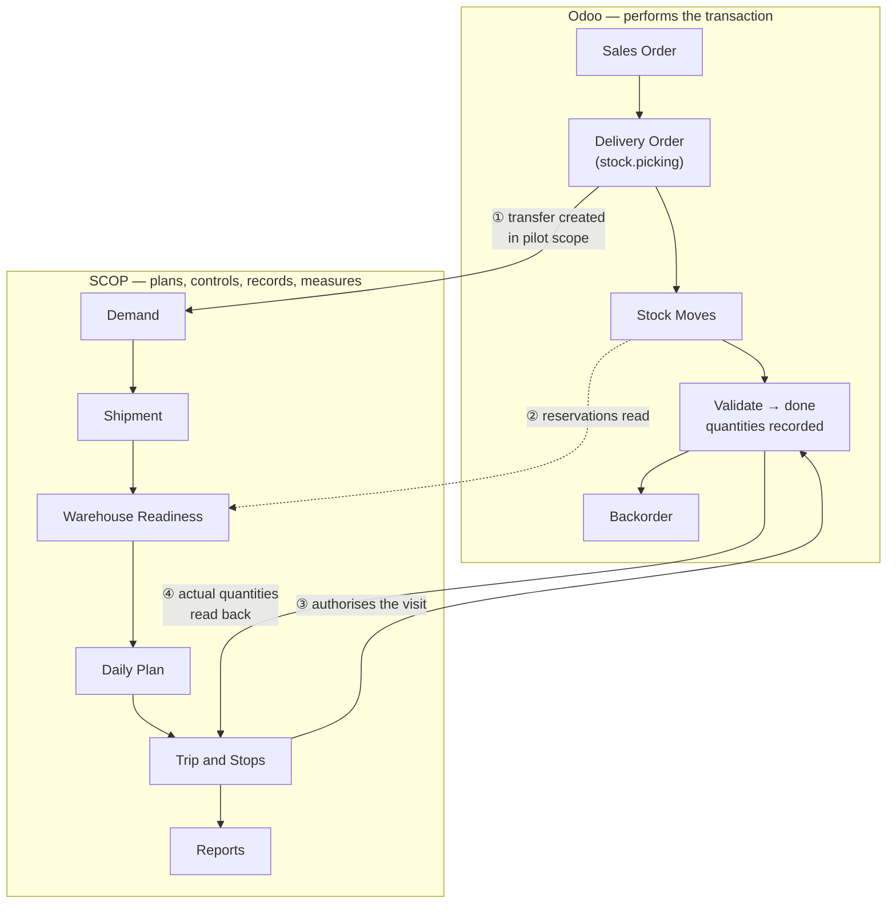

import DocumentInfo from '@site/src/components/DocumentInfo';

# SCOP and Odoo

<DocumentInfo
  category="User Manual"
  audience={['Operations', 'Warehouse', 'Planning', 'Management', 'UAT']}
  status="Draft"
  version="1.0"
  owner="Product Team"
  updated="August 2026"
  readingTime="7 min"
/>

:::info[This is the canonical page for the division of authority]

Every other chapter refers back here rather than restating it. If you read one page in
this manual before starting work, read this one.

:::

## The division in one sentence

**Odoo performs the transaction. SCOP plans, controls, records and measures the operation
around it.**

Neither system is "in charge" of the other. They own different facts, and each is
authoritative for what it owns.

| Fact | Owned by | SCOP's relationship to it |
| --- | --- | --- |
| The customer order | Odoo | Reads its number, never edits it |
| The delivery order and its reservations | Odoo | Reads them to work out readiness |
| Stock on hand, lots, expiry | Odoo | Reads them |
| **Delivered quantity** | **Odoo** | **Reads it back. Never types it** |
| Backorders | Odoo | Recognises them as further fulfilment of the same demand |
| Vehicles and drivers | Odoo (Fleet, Employees) | Extends them with capacity, availability, qualification |
| What must move, as a planning object | **SCOP** | Owns it — the Demand |
| Whether it can go, and why | **SCOP** | Owns it — Warehouse Readiness |
| What the operating day should be | **SCOP** | Owns it — the Daily Plan |
| Who authorised it | **SCOP** | Owns it — approval and governance |
| What actually happened, and how well | **SCOP** | Owns it — execution events and reports |

## Where the two systems touch

There are exactly four contact points. Everything else is one system or the other.



### ① Odoo creates a transfer, SCOP creates a Demand

When Odoo creates a transfer whose **operation type is inside the pilot scope**, SCOP
notices and creates its own record of what needs to move.

Nobody types the Demand. See [How Demands Are Created](../demand/how-demands-are-created.mdx).

Three conditions must hold, or no demand appears:

| Condition | If missed |
| --- | --- |
| The operation type is switched on in [Pilot Scope](../configuration/pilot-scope.mdx) | No demand, silently — this is the intended filter |
| The transfer was created **after** the pilot go-live moment | No demand. There is deliberately no historical backfill |
| Both endpoints resolve to a [planning node](../configuration/planning-nodes.mdx) | No demand, but a `DemandGenerationSkipped` event is recorded |

:::note[Demand generation can never block a warehouse operator]

If demand generation fails for any reason, the failure is rolled back on its own and
recorded as a queryable event. **The transfer still saves.** A warehouse operator must
never be unable to record a movement because a planning projection has a problem.

Failures are visible at `SCOP → Reporting → Failed Projections`.

:::

### ② SCOP reads Odoo's reservations to compute readiness

Warehouse Readiness is **computed from evidence**, and the evidence is Odoo's own
reservation and picking state. Nobody types a readiness value.

See [Warehouse Readiness](../readiness/warehouse-readiness.mdx).

### ③ The Trip authorises the physical visit

The approved plan says which vehicle goes where, in what order, carrying what. That is
SCOP's decision, and Odoo has no opinion about it.

### ④ The validated Odoo transfer supplies the actual quantity

This is the contact point that surprises people most often, so it is stated plainly:

:::warning[SCOP has no second quantity field]

There is **no place in SCOP where a user types how much was delivered.** The driver does
not enter it. The planner does not enter it. The operations manager does not enter it.

Actual quantities come from the **validated Odoo transfer**, and SCOP reads them back onto
the stop and the demand.

:::

The reason is not stylistic. If SCOP carried its own quantity, then the moment the two
disagreed, nobody could say which was true — and stock, invoicing and OTIF would all be
computed from a number nobody had reconciled. One number, one owner.

The full workflow is documented at
[Odoo Delivery Validation](../execution/odoo-delivery-validation.mdx).

## What this means in practice

### A short delivery is recorded in Odoo

The driver reports what happened. The **warehouse validates the Odoo transfer with the
quantity that actually moved**, and Odoo creates a backorder for the remainder.

SCOP then reads that back: the stop's outcome becomes **Partially Completed**, the demand
becomes **Partially Completed**, and the backorder is understood as a further fulfilment of
**the same demand** — not a new one.

See [Partial Deliveries and Backorders](../execution/partial-deliveries-and-backorders.mdx).

### A demand is not the same thing as a transfer

There is deliberately no one-to-one link between a demand and a picking.

```text
One transfer  → may carry several demands
One demand    → may be fulfilled by several transfers (the original plus its backorders)
```

The authoritative link is at **move level**, which is why a backorder attaches itself to
the demand it came from without anyone re-keying anything.

### A SCOP screen does not need rights over the source order

The demand captures the **source document's number** when it is generated. A planner reads
`S09520` on the demand form without holding any Sales permission, and gains none by
reading it.

An Administrator additionally sees the technical **Source Document Link**, which resolves
the target record and therefore does require rights over it.

### SCOP will refuse what it cannot justify

Where a business rule blocks an action, SCOP names the record and the reason rather than
failing quietly. That is a feature, not an obstacle — see
[The Governance Model](../concepts/the-governance-model.mdx).

## Which Odoo permissions SCOP does not grant

SCOP grants SCOP rights. Where a role also performs Odoo's own work, it needs Odoo's own
groups. This catches every new deployment at least once.

| Role | Also needs | Because |
| --- | --- | --- |
| Planner / Dispatcher | **Fleet → Administrator** | The planning wizard reads every vehicle. Fleet → *Officer* is not enough: it narrows the user to vehicles they personally drive |
| Planner / Dispatcher | **Employees → Officer** | Assigning a driver to a trip reads the employee register |
| Planner / Dispatcher | **Inventory → User** | Resolving ownership and marking a demand eligible refresh allocation against Odoo's reservations |
| Whoever validates transfers | **Inventory → User** | That is Odoo's own work |
| Anyone | **No Sales permission at any point** | The source order's number is captured on the demand |

Simply *reading* a SCOP screen requires none of these. The full table is at
[Permissions Reference](../roles/permissions-reference.mdx).

## Related Pages

- [Odoo Delivery Validation](../execution/odoo-delivery-validation.mdx) — the quantity workflow in full
- [How Demands Are Created](../demand/how-demands-are-created.mdx)
- [Pilot Scope](../configuration/pilot-scope.mdx)
- [Missing Node Diagnostics](../configuration/missing-node-diagnostics.mdx)
- [Permissions Reference](../roles/permissions-reference.mdx)
- [Release 1 Scope](./release-1-scope.mdx)
