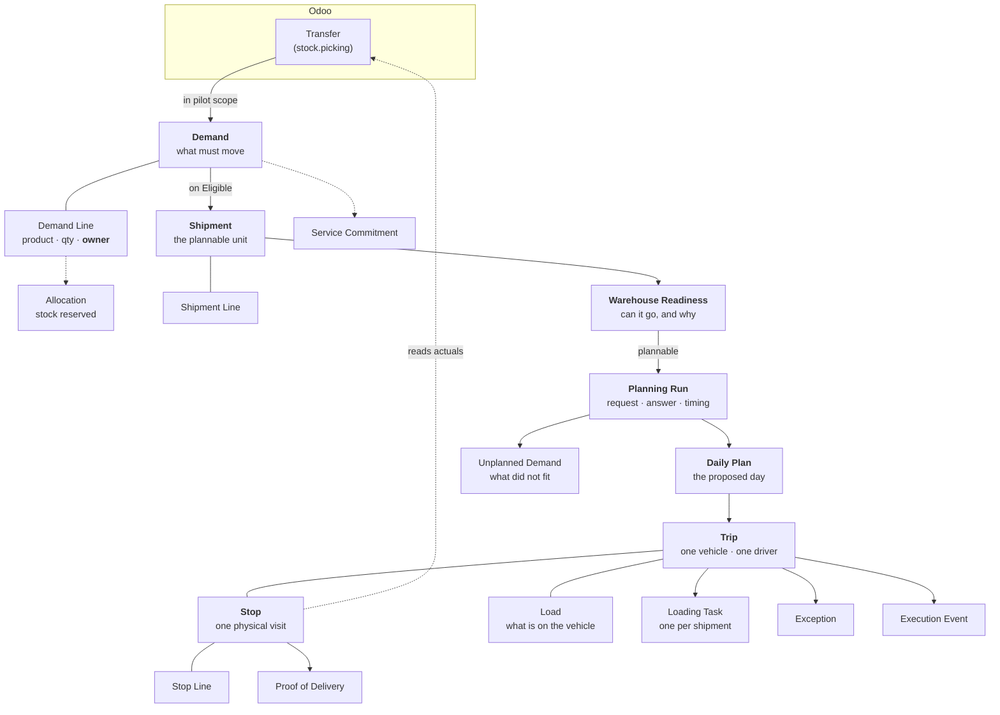

import DocumentInfo from '@site/src/components/DocumentInfo';

# The Object Model

<DocumentInfo
  category="User Manual"
  audience={['Operations', 'Warehouse', 'Planning', 'Management', 'UAT']}
  status="Draft"
  version="1.0"
  owner="Product Team"
  updated="August 2026"
  readingTime="9 min"
/>

## The map

Everything SCOP does is one of these objects changing state. This diagram is the shape of
the whole platform; the rest of the manual is detail on one box at a time.

## The operating objects

### Demand — *what must move*

| | |
| --- | --- |
| **Represents** | One business requirement to move goods, independent of the paperwork behind it |
| **Who works with it** | Planner primarily; Customer Service reads it |
| **Where it comes from** | Created **automatically** when Odoo creates an in-scope transfer |
| **Lifecycle** | 12 states, Draft → Completed, plus Rejected, Cancelled, Failed |
| **Relates to** | Has lines; forms a Shipment; carries a Service Commitment |

A demand is deliberately **not** the same object as a transfer. One transfer may carry
several demands, and one demand may be fulfilled by several transfers — the original plus
its backorders. A backorder is *another fulfilment of the same demand*, not a new one.

→ [Demand Management](../demand/demand-management.mdx)

### Demand Line — *one product, one owner*

| | |
| --- | --- |
| **Represents** | One product and quantity within a demand |
| **Carries** | Requested, fulfilled and remaining quantity, and the **owner** of the goods |
| **Why it matters** | Ownership is resolved per line, not per demand |

→ [Inventory Ownership](../ownership/inventory-ownership.mdx)

### Allocation — *the stock reserved against a line*

| | |
| --- | --- |
| **Represents** | Which specific stock — location, lot, owner — is set aside for a demand line |
| **Where it comes from** | Refreshed against Odoo's reservations when a demand is validated or made eligible |
| **Who works with it** | Planner, read-only in practice |

→ [Planning Eligibility](../demand/planning-eligibility.mdx)

### Shipment — *the plannable unit*

| | |
| --- | --- |
| **Represents** | A transport requirement — one or more compatible demands moving together |
| **Who works with it** | Planner and Warehouse |
| **Where it comes from** | Formed **automatically** when a demand becomes Eligible for Planning |
| **Lifecycle** | Created → Ready → Planned → In Execution → Completed, plus Cancelled |
| **Relates to** | Groups demands; owns a Readiness record; is assigned to a Trip |

**One demand does not always mean one shipment.** A second requirement on the same route and
required date joins the shipment already open.

→ [Formation and Consolidation](../shipments/formation-and-consolidation.mdx)

### Warehouse Readiness — *can it go, and why*

| | |
| --- | --- |
| **Represents** | Whether a shipment can physically go, with the reasoning in words |
| **Who works with it** | Warehouse |
| **Where it comes from** | **Computed from evidence** — Odoo reservations, staging, ownership |
| **States** | Ready · Conditionally Ready · Partially Ready · Not Ready · Blocked |
| **Note** | Not a governed lifecycle. It is a computed value that can go up *and down* |

→ [Warehouse Readiness](../readiness/warehouse-readiness.mdx)

### Planning Run — *one attempt, kept*

| | |
| --- | --- |
| **Represents** | One request to a decision provider, its answer, and how long it took |
| **Who works with it** | Planner |
| **Where it comes from** | The **Generate a Plan** wizard |
| **Lifecycle** | Requested → Evaluating → Recommended → Reviewed → Closed, plus Failed and Cancelled |
| **Why it exists** | So a decision made weeks ago can be re-examined with the inputs it actually had |

→ [Planning Runs](../planning/planning-runs.mdx)

### Daily Plan — *the proposed operating day*

| | |
| --- | --- |
| **Represents** | The recommended set of trips for one date |
| **Who works with it** | Planner proposes; **Operations Manager approves** |
| **Where it comes from** | Produced by a planning run |
| **Lifecycle** | Generated → Under Review → Approved → Released, plus Modified and Rejected |
| **Governed by** | `BR-PLN-001` separation of duties, `BR-PLN-002` no blocked trip released |

→ [The Daily Plan](../planning/the-daily-plan.mdx)

### Trip — *one vehicle, one driver, a sequence of stops*

| | |
| --- | --- |
| **Represents** | One vehicle and driver executing a route |
| **Who works with it** | Planner plans it; Warehouse loads it; **Driver executes it** |
| **Where it comes from** | Created by a planning run as part of a plan |
| **Lifecycle** | 13 states, Draft → Completed / Partially Completed, plus Exception and Cancelled |
| **Governed by** | `BR-RTE-001` capacity feasible at every point, `BR-RTE-002` utilisation warning |

→ [Trips](../execution/trips.mdx)

### Stop — *one physical visit*

| | |
| --- | --- |
| **Represents** | One arrival, one service period, one departure, at one node |
| **Who works with it** | Driver |
| **Where it comes from** | Created with the trip |
| **Lifecycle** | Planned → Arrived → Servicing → Completed, plus Failed and Skipped |
| **Outcome** | A separate classification: Completed · Partially Completed · Failed · Skipped · Rescheduled |

A stop is a **physical visit**, not a customer. Two orders for the same customer at
different branches, on different dates, or in different service windows are two stops.

→ [The Physical Visit](../shipments/the-physical-visit.mdx)

### Stop Line — *what was delivered here*

| | |
| --- | --- |
| **Represents** | One product at one stop, with its planned and **actual** quantity |
| **Actual quantity comes from** | The **validated Odoo transfer**. Never typed |
| **Traceable to** | Its own demand, even when several demands share a stop |

→ [Odoo Delivery Validation](../execution/odoo-delivery-validation.mdx)

### Load — *what is physically on the vehicle*

| | |
| --- | --- |
| **Represents** | The physical consignment on board, tracked from proposal to close |
| **Lifecycle** | Proposed → Confirmed → Staged → Loaded → In Transit → Unloaded → Closed, plus Cancelled |
| **Note** | Moves largely on its own, driven by trip and loading events |

→ [Loading Operations](../execution/loading-operations.mdx)

### Loading Task — *warehouse work to load one shipment*

| | |
| --- | --- |
| **Represents** | The job of getting one shipment onto one vehicle |
| **Who works with it** | Warehouse |
| **Where it comes from** | Created **one per shipment** when the trip is released |
| **Status** | Pending → In Progress → Done, plus Cancelled |
| **Effect** | An open task holds the vehicle at the gate |

→ [Loading Operations](../execution/loading-operations.mdx)

### Exception — *a recorded operational problem*

| | |
| --- | --- |
| **Represents** | A problem that needs someone to own and resolve it |
| **Who works with it** | Operations Manager owns the queue |
| **Where it comes from** | Raised from a trip, or by the system |
| **Lifecycle** | 10 states, Detected → Closed, plus Escalated and Cancelled |
| **Carries** | A category, a severity, an SLA deadline, an owner, resolution actions |

→ [Exception Management](../exceptions/exception-management.mdx)

### Service Commitment — *what we promised*

| | |
| --- | --- |
| **Represents** | The promise made to a customer — a date, or a window |
| **Captured** | **Once**, when the demand is generated |
| **Used by** | [OTIF](../reporting/otif.mdx), and by planning as a constraint |
| **If absent** | The delivery is never counted late. It is not counted at all |

→ [Service Commitments](../configuration/service-commitments.mdx)

### Proof of Delivery — *evidence at the door*

| | |
| --- | --- |
| **Represents** | Signature, name, photographs and coordinates at the moment of delivery |
| **Captured by** | Driver |
| **Note** | Location is captured **once**, at the stop. This is not vehicle tracking |

→ [Proof of Delivery](../execution/proof-of-delivery.mdx)

## The configuration objects

| Object | Represents | Chapter |
| --- | --- | --- |
| **Planning Node** | A physical place SCOP can route to, with coordinates, timezone and opening hours | [Planning Nodes](../configuration/planning-nodes.mdx) |
| **Travel Matrix** | Stored distance and duration between two nodes | [Planning Nodes](../configuration/planning-nodes.mdx) |
| **Route** | A named, repeatable sequence of nodes | [Routes and Stop Activities](../configuration/routes-and-stop-activities.mdx) |
| **Stop Activity** | The kind of work done at a stop | [Routes and Stop Activities](../configuration/routes-and-stop-activities.mdx) |
| **Capacity Profile** | The dimensions a vehicle is measured in | [Catalogues](../configuration/catalogues.mdx) |
| **Resource Assignment** | A vehicle or driver held for a trip — candidate, reserved, committed | [Fleet and Vehicles](../configuration/fleet-and-vehicles.mdx) |
| **Pilot Scope** | Which operation types SCOP reacts to, and from when | [Pilot Scope](../configuration/pilot-scope.mdx) |

## The governance objects

| Object | Represents | Chapter |
| --- | --- | --- |
| **Business Rule** | One approved, versioned policy | [Business Rules](../reference/business-rules.mdx) |
| **Rule Evaluation** | One check that was made, and its answer | [The Governance Model](./the-governance-model.mdx) |
| **Rule Exemption** | An authorised, time-boxed waiver | [The Governance Model](./the-governance-model.mdx) |
| **Approval Authority** | Who may perform which action on which object | [The Governance Model](./the-governance-model.mdx) |
| **Reason Code** | A controlled explanation | [Reason Codes](../reference/reason-codes.mdx) |
| **Objective Profile** | What planning optimises for, in rank order | [Planning Overview](../planning/planning-overview.mdx) |

## The traceability objects

| Object | Represents | Chapter |
| --- | --- | --- |
| **Domain Event** | A fact about what SCOP did, or declined to do | [Identity and Traceability](./identity-and-traceability.mdx) |
| **Execution Event** | A fact about what physically happened during a trip | [Identity and Traceability](./identity-and-traceability.mdx) |
| **Correlation Reference** | The identifier shared by everything in one operation | [Identity and Traceability](./identity-and-traceability.mdx) |

## Related Pages

- [Identity and Traceability](./identity-and-traceability.mdx)
- [The Governance Model](./the-governance-model.mdx)
- [Lifecycle Reference](../reference/lifecycle-reference.mdx)
- [Terminology](../about/terminology.mdx)
