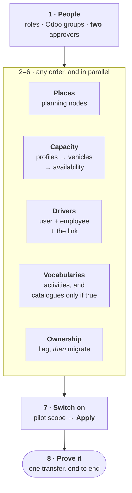

import DocumentInfo from '@site/src/components/DocumentInfo';

# Building the Master Data

<DocumentInfo
  category="User Manual"
  audience={['Operations', 'Planning', 'Management', 'UAT']}
  status="Draft"
  version="1.0"
  owner="Product Team"
  updated="August 2026"
  readingTime="9 min"
/>

:::info[This page is the order. The rest of the chapter is the detail]

Every other page in this chapter describes **one object**. None of them tells you what
has to exist before what — and the dependencies are not local, so the order is not
guessable from the individual pages.

Read this once before you configure anything, then use the other pages as reference.

:::

**Role**
Administrator builds most of it. Planner maintains availability. Management runs the
final gate.

## Why the order matters

Three of the steps below are wrong if done in the wrong order, and two of those fail
**silently** — you get no error, just no result:

| Doing this first | Produces |
| --- | --- |
| Migrating ownership before flagging consignment partners | The wrong owner, applied at scale, with nothing to tell you |
| Applying pilot scope before the nodes exist | A pile of skipped transfers to go back and re-save |
| Generating a plan before recording vehicle availability | A plan built around a vehicle that is in the workshop |

## The build order



Steps 2 to 6 are independent of each other and can be done in parallel by different
people. **Step 1 comes first and step 7 comes last** — those two are the ones with a
real ordering constraint.

---

## 1 · People and permissions

**Role** Administrator · **Where** Odoo Settings → Users

| # | Do | Why |
| --- | --- | --- |
| 1 | Give each person exactly **one** SCOP role | The roles are a ladder, not a pick-list |
| 2 | Give the Planner the three Odoo groups it needs | Planning reads Odoo's fleet, employees and reservations |
| 3 | Confirm **two** people can approve plans | `BR-PLN-001` refuses the plan's own author |

The Planner's three Odoo groups, which are approved and must not be narrowed:

| Group | Without it |
| --- | --- |
| **Fleet → Administrator** | `Access Error` on `Vehicle` when generating a plan |
| **Employees → Officer** | The **Driver** field never finishes loading |
| **Inventory → User** | **Validate** fails — ownership derivation reads Odoo's reservations |

:::danger[The prerequisite that stops a solo pilot]

`BR-PLN-001` refuses approval by the person who created the plan — **including an
Administrator**, who holds every group. Separation of duties is not a permission you can
grant yourself.

A pilot with one Operations Manager who also builds the plans **cannot complete a single
cycle**. Arrange the second approver now, not on the day.

:::

**Gate** — sign in as the Planner and open `SCOP → Planning → Generate a Plan`. If the
vehicle list is populated and the Driver field loads, step 1 is done.

→ [Permissions Reference](../roles/permissions-reference.mdx) · [Plan Governance](../planning/plan-governance.mdx)

---

## 2 · Places — the planning nodes

**Role** Administrator · **Where** `SCOP → Master Data → Locations`

This is the step that makes demand possible at all. A transfer whose origin **or**
destination resolves to no node produces **no demand**.

Every node needs all seven:

| # | Field | Without it |
| --- | --- | --- |
| 1 | **Name** and **Location Type** | It cannot be saved |
| 2 | The **partner**, **warehouse** or **stock location** link | Transfers never resolve to it |
| 3 | **Latitude** and **Longitude** | Routes make no sense |
| 4 | **Timezone** | Every window is interpreted in the wrong hours |
| 5 | At least one **opening window** | Nothing can ever be scheduled here |
| 6 | **Service duration** | Route timing is wrong |
| 7 | Any **access constraints** | Vehicles that cannot serve it will be sent |

:::warning[An incomplete node fails differently from a missing one]

A **missing** node produces no demand, and records a `DemandGenerationSkipped` event
naming exactly what to map.

An **incomplete** node lets the demand be created and then makes it **unplannable** —
coming back as *Missing required data* or *Customer location unavailable*. That one has no
event to find, so it is the more expensive mistake.

Complete all seven before moving on.

:::

For a pilot with many customer branches, `Master Data → Import Locations` is faster than
creating each by hand.

**Gate** — `Is Geocoded` is true on every node, and every node has at least one window.

→ [Planning Nodes](./planning-nodes.mdx) · [Missing Node Diagnostics](./missing-node-diagnostics.mdx)

---

## 3 · Capacity, then vehicles, then availability

**Role** Administrator builds, Planner maintains availability

In this order, because each depends on the one before:

| # | Build | Where |
| --- | --- | --- |
| 1 | **Capacity profiles** — the dimensions and their limits | `Master Data → Capacity Profiles` |
| 2 | Attach one to **every vehicle**, plus home location, average speed, handling capabilities and cost rates | Odoo Fleet → the vehicle's SCOP fields |
| 3 | Record **availability** — shifts, maintenance, blocks | `Master Data → Vehicle Availability` |

:::danger[A vehicle with no capacity profile is invisible to planning]

The planning provider filters to vehicles that **declare a capacity profile**. A vehicle
without one is not considered and rejected — it is never considered at all.

If *every* demand in a run comes back **No feasible vehicle**, the answer is almost never
that the fleet is too small. It is this.

:::

:::note[Record maintenance before planning, not after]

A vehicle booked into the workshop next Tuesday must be recorded unavailable **before**
Tuesday's plan is generated. Planning has no other way to know, and a plan built around an
absent vehicle has to be redone.

:::

**Gate** — **Planning Ready** is true on every vehicle you intend to use.

→ [Fleet and Vehicles](./fleet-and-vehicles.mdx) · [Catalogues](./catalogues.mdx)

---

## 4 · Drivers — three records, not one

**Role** Administrator · **Where** Odoo Employees, then `SCOP → Master Data → Driver …`

A driver is three linked things, and all three must exist:

```text
Odoo User          ← how they sign in, holding the Driver role and nothing else
    ↕ linked
Odoo Employee      ← flagged "Is Driver"
    ↕ assigned
SCOP Trip          ← the work
```

:::danger[The employee-to-user link is the one people miss]

The record rules that give a driver their own trips match on the **employee's linked user
account**, not on the employee record alone.

An employee flagged as a driver but **not linked to a user** can be assigned a trip that
**nobody will ever see**. Nothing refuses it. The symptom appears days later, when a driver
reports an empty **My Trips**.

:::

Then record qualifications and shifts, and set the home location and daily driving limit.

:::warning[Never add SCOP User to a driver]

`SCOP User` grants read access across the whole operation. The record rules still narrow
the driver's trips, but everything else opens up — and the driver security model is
silently undone.

:::

**Gate** — sign in as the driver and confirm **My Work** appears. That single check covers
all three records at once.

→ [Drivers](./drivers.mdx) · [Driver Security Model](../execution/driver-security-model.mdx)

---

## 5 · Vocabularies — build only what is true

**Role** Administrator

| Catalogue | Build it when | Needed? |
| --- | --- | --- |
| **Stop Activities** | Always — Delivery and Pickup, maybe Collection | **Yes** |
| **Capacity Profiles** | Always — covered in step 3 | **Yes** |
| **Handling Profiles** | Goods genuinely differ in how they must be carried | Only then |
| **Compatibility Groups** | Some goods genuinely may not travel together | Only then |
| **Shelf-Life Profiles** | Expiry matters operationally | Only then |
| **Routes** | A round genuinely repeats | Only then |

:::warning[An empty catalogue is not a gap]

Four of these are optional. Populating them "for completeness" adds constraints planning
must satisfy, and **every unnecessary constraint is a demand that comes back unplanned**.

The same applies to stop activities: every distinct activity is a reason two requirements
at one address become two visits. Do not create *Delivery — Morning* and *Delivery —
Afternoon*; a service commitment already expresses that difference properly.

:::

**Gate** — the reason codes, business rules, exception categories and objective profile
ship configured. You do not build these. Confirm they are there rather than creating them.

→ [Catalogues](./catalogues.mdx) · [Routes and Stop Activities](./routes-and-stop-activities.mdx)

---

## 6 · Ownership — flag first, then migrate

**Role** Administrator · **Where** `SCOP → Master Data → Onboarding`

**The order here is not optional:**

| # | Step | Wizard |
| --- | --- | --- |
| 1 | Flag the partners whose stock you hold but do not own | **1 · Consignment Partners** |
| 2 | Migrate ownership onto existing stock | **2 · Inventory Ownership** |

:::danger[Running step 2 first gives the wrong answer at scale]

The consignment flag is what stops SCOP applying the governed company default to goods
that are somebody else's. Migrate before flagging and you assign the company as owner of
stock it does not own — across every affected line at once, with nothing to tell you.

:::

:::warning[Flagging is not retroactive]

Ownership already resolved on existing demands is not rewritten. Flag the partners, then
re-derive the affected demands with **Resolve Ownership**.

:::

**Gate** — `Reporting → Ownership Data Quality`, grouped by resolution. Mostly resolved
means it worked. A concentration of unresolved on one partner almost always means that
partner needed the flag.

→ [Onboarding and Migration](./onboarding-and-migration.mdx) · [Inventory Ownership](../ownership/inventory-ownership.mdx)

---

## 7 · Switch it on — last, not first

**Role** Administrator · **Where** `SCOP → Technical → Pilot Scope`

| # | Do |
| --- | --- |
| 1 | Set the warehouse |
| 2 | Add the operation types that should generate demand |
| 3 | Set the **go-live** moment |
| 4 | Press **Apply** |

:::warning[A scope record in Draft does nothing at all]

Configuring the operation types is not enough. **Apply** is what switches SCOP on.

A pilot that "was set up but nothing happened" is very often a scope record still sitting
in **Draft**.

:::

:::note[There is deliberately no historical backfill]

Transfers created before go-live produce nothing, on purpose. Expect
[OTIF](../reporting/otif.mdx) and [Plan Coverage](../reporting/plan-coverage.mdx) to be
meaningless for the first cycle and honest from the second.

:::

**Gate** — status is **Applied**, and the operation types you intend are listed.

→ [Pilot Scope](./pilot-scope.mdx)

---

## 8 · Prove it with one transfer

Configuration is not finished when the records exist. It is finished when one requirement
has travelled the whole way through.

| # | Step | Expect |
| --- | --- | --- |
| 1 | Create one delivery in Odoo | A demand appears in `Operations → Demands` |
| 2 | **Validate** it | No `BR-INV-002` refusal |
| 3 | **Mark Eligible** | A shipment forms |
| 4 | Stage it | Readiness **Ready** |
| 5 | Generate a plan | One trip, capacity-feasible |
| 6 | **A second person** approves and releases | Loading tasks exist |
| 7 | Load, depart, arrive | The driver sees the work |
| 8 | Validate the transfer in Odoo | SCOP reads the quantities back |
| 9 | Close the stop | The demand reaches **Completed** |

**Gate** — copy the demand's **Correlation Reference** into
[Operation Timeline](../reporting/operation-timeline.mdx). Every step, in order, with who
did it. That is the single best proof the master data is sound.

→ [Standard Full Delivery](../scenarios/standard-full-delivery.mdx)

---

## The minimum viable set

The smallest master data that lets one cycle complete:

| Object | Minimum |
| --- | --- |
| SCOP roles assigned | One per person, **two** able to approve |
| Planner's Odoo groups | All three |
| Planning nodes | **Two** — one warehouse, one destination — both complete |
| Capacity profiles | **One** |
| Vehicles with that profile | **One**, available on the day |
| Drivers | **One**, with the employee-to-user link |
| Stop activities | **Delivery**, and **Pickup** if you collect |
| Ownership | Consignment partners flagged, migration run |
| Pilot scope | **Applied**, with at least one operation type |
| Handling, compatibility, shelf-life, routes | **None required** |

## Six ways to build master data that silently produces nothing

Each of these looks complete on screen and yields no error:

| # | The mistake | The symptom |
| --- | --- | --- |
| 1 | Pilot scope left in **Draft** | No demands at all, and **no events either** |
| 2 | A destination with no planning node | No demand for that customer, with a skip event to find |
| 3 | A vehicle with no capacity profile | **Every** demand returns *No feasible vehicle* |
| 4 | An employee not linked to a user | A trip nobody can see, and an empty **My Trips** |
| 5 | Only one person able to approve | The cycle stops dead at approval |
| 6 | A node with no timezone or no window | Demands appear, then never plan |

:::info[The distinguishing signal is whether an event exists]

**No event at all** — SCOP never considered the transfer: out of scope, or before go-live.
**A skip event** — SCOP considered it and deliberately declined: a missing node.
**A failed event** — SCOP tried and something went wrong: read
[Failed Projections](../reporting/data-quality-reports.mdx).

That one question separates most configuration problems from each other in seconds.

:::

## Keeping it healthy

Master data is not a one-off. Three things need an owner after go-live:

| What | How often | Why |
| --- | --- | --- |
| A planning node for every new customer branch | At customer onboarding | Creating a customer in Odoo does **not** create a node |
| Vehicle and driver availability | Before each planning cycle | Planning cannot know about leave or the workshop |
| Qualification expiry dates | Monthly | An expired licence is a constraint, not a warning |

:::danger[Node creation belongs in customer onboarding, not the incident queue]

If new customers appear regularly and nobody creates their node, their first delivery
silently produces nothing. Build it into the process now.

:::

## Verify

| Check | Where | Expect |
| --- | --- | --- |
| Pilot scope is live | `Technical → Pilot Scope` | **Applied** |
| Nodes are complete | `Master Data → Locations` | Geocoded, with windows |
| Vehicles are usable | The vehicle's SCOP fields | **Planning Ready** true |
| Drivers can see work | Sign in as one | **My Work** appears |
| Ownership resolves | `Reporting → Ownership Data Quality` | Mostly resolved |
| Nothing was skipped | `Technical → Domain Events` | No unresolved `DemandGenerationSkipped` |
| Nothing failed | `Reporting → Failed Projections` | Empty |
| Two people can approve | `Governance → Approval Authorities` | At least two |
| One cycle completed | `Reporting → Operation Timeline` | Every step, in order |

## Related Pages

- [Onboarding and Migration](./onboarding-and-migration.mdx) — the three go-live wizards
- [Planning Nodes](./planning-nodes.mdx)
- [Fleet and Vehicles](./fleet-and-vehicles.mdx)
- [Drivers](./drivers.mdx)
- [Pilot Scope](./pilot-scope.mdx)
- [Standard Full Delivery](../scenarios/standard-full-delivery.mdx)

## Next

[Planning Nodes](./planning-nodes.mdx).
