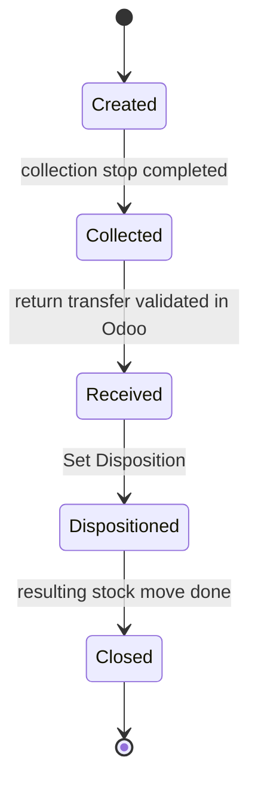

import DocumentInfo from '@site/src/components/DocumentInfo';

# Demand Completion

<DocumentInfo
  category="User Manual"
  audience={['Planning', 'Operations', 'Warehouse', 'UAT']}
  status="Draft"
  version="1.0"
  owner="Product Team"
  updated="August 2026"
  readingTime="6 min"
/>

**Role**
Nobody presses a button. SCOP closes the demand on what actually moved.

## Purpose

A demand ends in exactly one of three ways, and which one is **arithmetic**, not a judgement.

## The three outcomes

```text
fulfilled == 0              →  Failed
0 < fulfilled < requested   →  Partially Completed
remaining == 0              →  Completed
```

| Outcome | Meaning | Terminal? |
| --- | --- | --- |
| **Completed** | Everything requested was delivered | Yes |
| **Partially Completed** | Some delivered, some remaining | **No** — a follow-up can complete it |
| **Failed** | Nothing was delivered | Yes |

:::info[There is deliberately no "mark as complete" button]

Splitting this into three buttons would let an operator record a completion that the
quantities contradict. The quantities decide, and the quantities come from Odoo.

:::

## Where the quantities come from

:::warning[Fulfilled quantity is read from the validated Odoo transfer]

Nobody types it. Not the driver, not the planner, not the warehouse — in SCOP.

The warehouse validates the Odoo transfer with what actually moved, and SCOP reads it back
onto the stop line and the demand line.

→ [Odoo Delivery Validation](../execution/odoo-delivery-validation.mdx)

:::

This is why a demand that looks delivered can sit at **In Execution**: the goods are at the
customer, but the transfer has not been validated yet, so as far as the system is concerned
nothing has moved.

## Partial completion and follow-up demands

When a delivery is short:

| # | What happens | Where |
| --- | --- | --- |
| 1 | The warehouse validates the transfer with the quantity that actually moved | **Odoo** |
| 2 | Odoo creates a **backorder** for the remainder | **Odoo** |
| 3 | The stop outcome becomes **Partially Completed** | SCOP |
| 4 | The demand becomes **Partially Completed** | SCOP |
| 5 | A **follow-up demand** *should* be created for the remainder | SCOP — **never created**. The backorder carries the remainder instead |

:::info[Step 5 does not happen — and a partial delivery does not need it]

**No follow-up demand is ever created.** There is not one record with **Is Follow-Up** set
anywhere on `b2b`.

For a partial delivery that costs nothing: the Odoo **backorder** carries the remainder
against the *same* demand, and validating it completes the original. Verified end to end
below.

For a **total failure** there is no backorder, and nothing carries the requirement forward.
That case is covered under [Failure](#failure).

:::

By design the chain back to the original is carried by three fields. They exist, and the
**Follow-Up and Returns** tab displays them — but **nothing populates them in Release 1**,
because no follow-up demand is created. For a partial delivery the Odoo backorder plays that
role against the same demand instead:

| Field | Meaning | Release 1 |
| --- | --- | --- |
| **Parent Demand** | The demand this one follows up | Always empty |
| **Is Follow-Up** | Set on the new demand | Never set |
| **Root Demand** | The original requirement at the head of the chain | Always empty |

:::info[The original demand is not replaced]

`DMD-2026-000010` stays the customer's original requirement. By design it reaches
**Completed** only when the follow-up fulfils the remainder.

That is what keeps the promise measurable: OTIF asks whether the *original* requirement was
met, not whether the last backorder eventually arrived.

**Verified on `b2b`:** that transition works, and the **backorder** is what triggers it.
`DMD-2026-000010` was validated 6 of 10 → **Partially Completed**; the backorder was validated
for the remaining 4 → **Completed**, fulfilled 10 of 10 across **two transfers**. The original
demand was never replaced, so OTIF still measures the original promise.

:::

→ [Partial Deliveries and Backorders](../execution/partial-deliveries-and-backorders.mdx)

## Failure

By design a demand reaches **Failed** when nothing was delivered at all, and a follow-up
demand is created so the requirement is not simply lost. **Failed** is terminal for that
demand, and the follow-up is where the second attempt lives.

:::danger[Verified defect — a total failure leaves nothing behind]

**Failed** is reached correctly once the projection runs. But there is **no backorder** behind
a failed delivery and **no follow-up demand is created**, so nothing carries the requirement
forward and nobody is told.

On `b2b`, `DMD-2026-000013` is **Failed**, terminal, with 5.0 still owed and its transfer
cancelled. Those units will never be delivered unless somebody notices.

**Raise the replacement demand by hand.** `Operations → Demands` filtered to **Failed** with a
remaining quantity is the list to work.

:::

:::warning[Zero quantity is not always a failure]

If the Odoo transfer has not been validated yet, fulfilled quantity is zero — but nothing
has failed. The delivery may have gone perfectly and the paperwork is simply behind.

Distinguishing the two is covered at [Failed Delivery](../execution/failed-delivery.mdx).

:::

## Mixed outcomes at one stop

Several demands can share a single physical visit. **They do not share a fate.**

Because each stop line is traceable to its own demand and its own Odoo transfer, within one
arrival:

```text
Demand A  →  Completed            (its transfer validated in full)
Demand B  →  Partially Completed  (its transfer validated short, backorder created)
```

One stop outcome does not force every demand into the same state.

→ [The Physical Visit](../shipments/the-physical-visit.mdx)

## Replanning before execution

A demand in **Released** can be moved back to **Planned** with **Replan**, for an authorised
change before the trip departs.

Once the trip has departed and the demand is **In Execution**, replanning is no longer
available — the goods are on a vehicle.

## Unplanning

If a plan is cancelled, or a demand is taken off it, the demand returns from **Planned** to
**Eligible for Planning**, and an **unplanned demand** row is written recording that it went
back into the pool.

→ [Unplanned Demand](../planning/unplanned-demand.mdx)

## The return sub-cycle

A demand of type **Return** carries a second status alongside the main lifecycle.



| State | Reached when |
| --- | --- |
| **Created** | The return demand is generated |
| **Collected** | The collection stop reaches outcome **Completed** |
| **Received** | The return transfer reaches **Done** in Odoo |
| **Dispositioned** | Somebody chooses what happens to the goods |
| **Closed** | The resulting stock move is done |

**Set Disposition** is the only manual step, and it **requires a disposition**:

| Disposition | Meaning |
| --- | --- |
| **Restock** | Back into saleable stock |
| **Scrap** | Written off |
| **Return to Supplier** | Sent back up the chain |
| **Customer Credit** | Credited rather than replaced |
| **Pending Decision** | Not yet decided |

## Verify a completed demand

| Check | Where |
| --- | --- |
| The state is **Completed** | The demand's status bar |
| Fulfilled equals requested | The **Lines** tab |
| The Odoo transfers agree | The **Transfers** stat button |
| It appears in OTIF | `SCOP → Reporting → OTIF` |
| The chain is intact | The **Follow-Up and Returns** tab |

## If a demand does not complete

| Symptom | Cause | Fix |
| --- | --- | --- |
| Stuck at **In Execution** with zero fulfilled | The Odoo transfer is not validated | Validate it |
| Stuck at **In Execution** with the trip finished | The stop was never completed | Complete the stop |
| **In Execution** after its trip closed | A projection failed — see `Reporting → Failed Projections` | Fix the cause named there; an Administrator can press **Retry** |
| **Completed** but missing from OTIF | It carries no commitment | See [OTIF](../reporting/otif.mdx) |
| A very old demand stuck mid-flight | Records left mid-flight by an earlier release are not rewritten | See [Release 1 Scope](../about/release-1-scope.mdx) |

Full treatment: [Demand Does Not Complete](../troubleshooting/demand-problems.mdx).

## Related Pages

- [Demand Lifecycle](./demand-lifecycle.mdx)
- [Odoo Delivery Validation](../execution/odoo-delivery-validation.mdx)
- [Partial Deliveries and Backorders](../execution/partial-deliveries-and-backorders.mdx)
- [OTIF](../reporting/otif.mdx)

## Next

[Demand Diagnostics](./demand-diagnostics.mdx).
