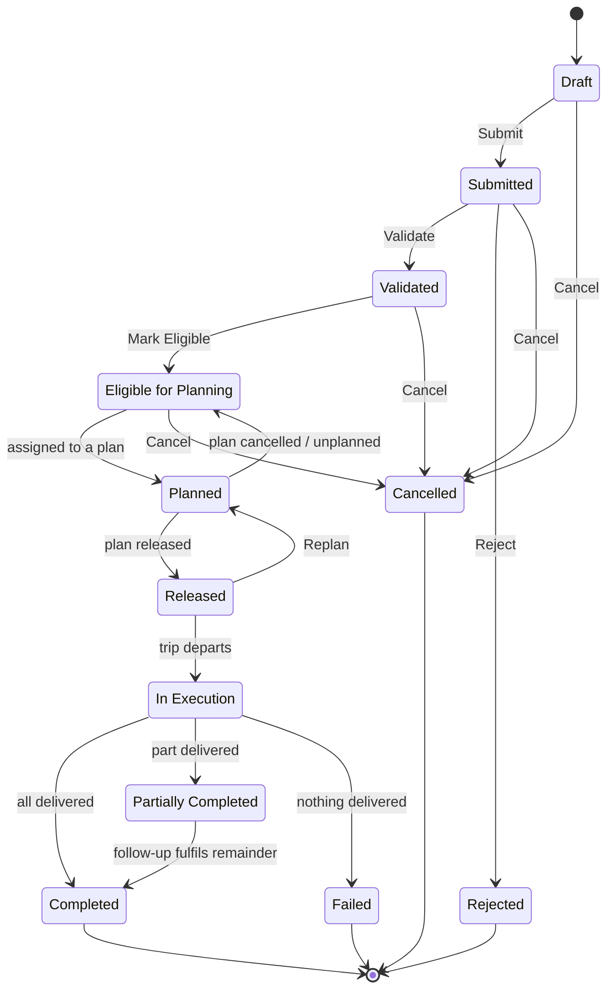

import DocumentInfo from '@site/src/components/DocumentInfo';
import Screenshot from '@site/src/components/Screenshot';

# Demand Lifecycle

<DocumentInfo
  category="User Manual"
  audience={['Planning', 'Operations', 'UAT']}
  status="Draft"
  version="1.0"
  owner="Product Team"
  updated="August 2026"
  readingTime="8 min"
/>

**Role**
Planner performs the manual transitions. The rest happen on their own.

**Navigate to**
`SCOP → Operations → Demands`

## The lifecycle



## The twelve states

| State | Meaning | Who moves it out |
| --- | --- | --- |
| **Draft** | Just created from the Odoo transfer. Still editable | Planner |
| **Submitted** | Put forward as a requirement | Planner |
| **Validated** | Checked. Ownership is resolved on every line | Planner |
| **Eligible for Planning** | Available and ready enough to be planned. **Its shipment now exists** | Planning |
| **Planned** | Placed on a daily plan that is not yet released | Plan release |
| **Released** | On an authorised plan. Committed to today | Trip departure |
| **In Execution** | On a vehicle that has departed | Quantities read back |
| **Partially Completed** | Some delivered, some remaining | A follow-up demand |
| **Completed** | Everything delivered. **Terminal** | — |
| **Failed** | Nothing delivered. **Terminal** | — |
| **Rejected** | Refused as a requirement. **Terminal** | — |
| **Cancelled** | Withdrawn. **Terminal** | — |

:::note[You cannot set a state directly]

A demand moves only through the buttons in its header. Writing a state by hand would skip
the checks that belong to the transition, and SCOP refuses it.

:::

## The manual transitions

### Submit

| | |
| --- | --- |
| **From → To** | Draft → Submitted |
| **Role** | Planner |
| **Button** | **Submit** |
| **Checks** | None |
| **Use it when** | The requirement is correct and ready to be checked |

While a demand is in **Draft** you can still correct Customer, Demand Type, Origin Type and
Priority. After Submit, those are settled.

### Validate

| | |
| --- | --- |
| **From → To** | Submitted → Validated |
| **Role** | Planner |
| **Button** | **Validate** |
| **Gate** | `demand_validate` |
| **Rule** | `BR-INV-002` — ownership must be resolved and consistent |

**What SCOP does first:** it **re-derives ownership** on every line before evaluating the
rule. At generation time the transfer often had no move lines to read an owner from; by
validation it is usually reserved and the owner is available.

That re-derivation is the whole reason unresolved ownership is usually a *transient* state
rather than a permanent verdict.

:::danger[If BR-INV-002 refuses]

The dialog names the exact lines whose owner could not be established. Ownership is **never
defaulted to the company** — an absent owner asserts nothing at all in this deployment, and
guessing would make SCOP consistently wrong rather than honestly stuck.

→ [Inventory Ownership](../ownership/inventory-ownership.mdx)

:::

<Screenshot
  src="quick-start/05-ownership-block-validate.png"
  alt="A refusal dialog on the SCOP demand form stating that ownership must be resolved before validation, naming the affected lines."
  caption="BR-INV-002 refusing validation. The dialog names the rule, the policy, and the lines at fault."
/>

### Reject

| | |
| --- | --- |
| **From → To** | Submitted → Rejected |
| **Role** | Planner |
| **Button** | **Reject** |
| **Checks** | **A rejection reason is required** |

Use it when the requirement itself is wrong — not when it is merely blocked. A blocked
demand should be fixed, not rejected.

**Rejected** is terminal. If the requirement returns, it comes back as a new transfer and a
new demand.

### Mark Eligible

| | |
| --- | --- |
| **From → To** | Validated → Eligible for Planning |
| **Role** | Planner |
| **Button** | **Mark Eligible** |
| **Gate** | `demand_eligible` |
| **Checks** | Readiness must be **Ready**, **Conditionally Ready** or **Partially Ready** |

Three things happen, in order:

1. The gate is evaluated.
2. **Allocation is refreshed** against Odoo's current reservations.
3. The demand becomes eligible — **and its shipment is formed automatically.**

:::info[Shipment formation is not a separate human step]

The blueprint's own formation flow is *Validated Demand → Allocate Inventory → Create
Shipment*, and allocation is exactly what this button refreshes. So this is the moment the
shipment appears.

**Create Shipment** remains on the form as a re-run for an exceptional case — a demand made
eligible before this behaviour shipped, or one whose shipment was cancelled. Pressing it on
a normal demand returns the shipment that already exists.

→ [Formation and Consolidation](../shipments/formation-and-consolidation.mdx)

:::

→ Full detail: [Planning Eligibility](./planning-eligibility.mdx)

### Cancel

| | |
| --- | --- |
| **From → To** | Draft, Submitted, Validated or Eligible → Cancelled |
| **Role** | Planner *(approval authority: `scop.demand` / cancel)* |
| **Button** | **Cancel** |

Cancel is offered until the demand reaches a terminal state. It is **not** offered once the
demand is Completed, Cancelled, Rejected or Failed.

Cancelling a demand does not cancel the Odoo transfer. If the movement is genuinely not
happening, cancel the transfer in Odoo as well.

### Replan

| | |
| --- | --- |
| **From → To** | Released → Planned |
| **Role** | Planner *(approval authority: `scop.demand` / replan)* |
| **Use it when** | An authorised change is needed **before execution starts** |

Once the trip has departed and the demand is **In Execution**, replanning is no longer
available — the goods are on a vehicle.

### Resolve Ownership

Not a state transition. Available whenever ownership is unresolved, at any point in the
lifecycle. It re-derives the owner from the five approved sources.

→ [Correcting Ownership](../ownership/correcting-ownership.mdx)

## The automatic transitions

These happen because something else happened. Nobody presses a button.

| Transition | Triggered by |
| --- | --- |
| Eligible → **Planned** | The demand is assigned to a daily plan |
| Planned → **Eligible** | The plan is cancelled, or the demand is unplanned. **An unplanned-demand row is written** |
| Planned → **Released** | The plan is released |
| Released → **In Execution** | The trip departs |
| In Execution → **Completed** | Everything requested has been delivered |
| In Execution → **Partially Completed** | Some but not all has been delivered. **A follow-up demand is created** |
| In Execution → **Failed** | Nothing was delivered. **A follow-up demand is created** |
| Partially Completed → **Completed** | A follow-up fulfils the remainder |

:::info[The final outcome is arithmetic, not a judgement]

Completed, Partially Completed and Failed are decided by the quantities alone:

```text
fulfilled == 0            →  Failed
0 < fulfilled < requested →  Partially Completed
remaining == 0            →  Completed
```

There is deliberately no button that lets an operator record a completion the quantities
contradict.

:::

→ [Demand Completion](./demand-completion.mdx)

## The return sub-lifecycle

A demand of type **Return** carries a second, independent status.

| State | Reached when |
| --- | --- |
| **Created** | The return demand is generated |
| **Collected** | The collection stop is completed |
| **Received** | The return transfer is validated in Odoo |
| **Dispositioned** | A disposition is chosen — **required** |
| **Closed** | The resulting stock move is done. **Terminal** |

Dispositions available: **Restock**, **Scrap**, **Return to Supplier**, **Customer Credit**,
**Pending Decision**.

The main lifecycle continues in parallel; the return status tracks the goods coming back.

## Which button appears when

| State | Buttons offered |
| --- | --- |
| **Draft** | Submit · Cancel · *(Resolve Ownership if unresolved)* |
| **Submitted** | Validate · Reject · Cancel · *(Resolve Ownership)* |
| **Validated** | Mark Eligible · Cancel · *(Resolve Ownership)* |
| **Eligible for Planning** | Create Shipment · Cancel |
| **Planned**, **Released** | Cancel |
| **In Execution** | Cancel |
| **Completed**, **Failed**, **Rejected**, **Cancelled** | None |

A button that is missing usually means the demand is not in the state that offers it. The
second most common reason is that you are not a Planner.

## Related Pages

- [Demand Management](./demand-management.mdx)
- [Planning Eligibility](./planning-eligibility.mdx)
- [Demand Completion](./demand-completion.mdx)
- [Lifecycle Reference](../reference/lifecycle-reference.mdx)
- [Business Rules](../reference/business-rules.mdx)

## Next

[Planning Eligibility](./planning-eligibility.mdx).
