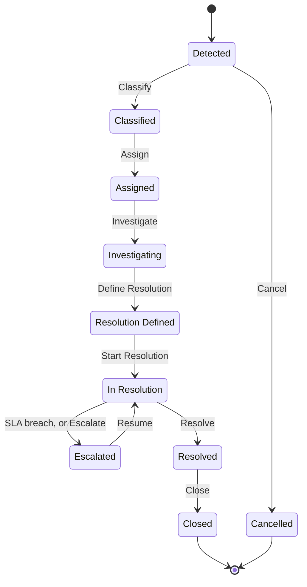

import DocumentInfo from '@site/src/components/DocumentInfo';

# Exception Management

<DocumentInfo
  category="User Manual"
  audience={['Operations', 'Management', 'Planning', 'Warehouse', 'UAT']}
  status="Draft"
  version="1.0"
  owner="Product Team"
  updated="August 2026"
  readingTime="8 min"
/>

**Role**
Operations Manager owns the queue. Any SCOP user can raise and work an exception.

**Navigate to**
`SCOP → Operations → Exceptions`

## What an exception is

A recorded **operational problem that needs somebody to own and resolve it**.

It is not a log entry and not an error message. It has an owner, a deadline, a resolution
plan, and a lifecycle that ends in somebody confirming the problem is actually gone.

## What an exception is not

| Not an exception | What it is instead |
| --- | --- |
| A failed delivery | A stop **outcome**, with a reason. It may *lead* to an exception |
| An unplanned demand | A planning **result**, with a reason |
| A business-rule refusal | A [rule evaluation](../concepts/the-governance-model.mdx) |
| A system error | A [failed projection](../reporting/data-quality-reports.mdx) |

:::info[Exceptions are raised deliberately]

SCOP does not turn every operational bump into an exception. A short delivery with a reason
is a recorded fact; it becomes an exception when it needs **owning** — a customer dispute,
damaged goods, a vehicle that failed mid-route.

:::

## Where they come from

| Source | How |
| --- | --- |
| A trip | **Raise Exception**, available in Loading, Ready to Depart or In Progress |
| A business rule | A critical rule failure can raise one |
| A person | Created directly on the exception list |

The trip moves to **Exception** and waits until the problem is resolved or the trip is
completed or cancelled.

→ [Trip Lifecycle](../execution/trip-lifecycle.mdx)

## The list

`SCOP → Operations → Exceptions` opens filtered to **open** exceptions.

| Column | Meaning |
| --- | --- |
| **Title** | What the problem is |
| **Category** | Which of the twelve kinds |
| **Severity** | Information · Warning · Approval Required · Blocking · Critical |
| **Origin** | The record it concerns |
| **Owner** | Who is dealing with it |
| **Detected At** | When it was raised |
| **SLA Deadline** | When it should be resolved by |
| **Overdue** | Whether it has passed that |
| **Escalation Count** | How many times it has escalated |
| **Status** | Where it is in its lifecycle |

## The ten states

| # | State | What it needs to leave |
| --- | --- | --- |
| 1 | **Detected** | A category and a severity |
| 2 | **Classified** | An owner |
| 3 | **Assigned** | Somebody to start looking |
| 4 | **Investigating** | At least one resolution action |
| 5 | **Resolution Defined** | Somebody to start doing it |
| 6 | **In Resolution** | Every resolution action done |
| 7 | **Escalated** | Somebody to resume it |
| 8 | **Resolved** | Confirmation |
| 9 | **Closed** | **Terminal** |
| 10 | **Cancelled** | **Terminal** |

## Working an exception

### Classify

| | |
| --- | --- |
| **Requires** | A **category** and a **severity** |
| **Effect** | **The SLA deadline is computed from the category.** The clock starts here |

:::warning[Classification starts the clock]

An exception left in **Detected** has no deadline and will never appear as overdue.

Classify promptly, even if you do not yet know who will fix it.

:::

### Assign

| | |
| --- | --- |
| **Requires** | An **owner** |
| **Effect** | Creates an **activity** for that person, so it reaches their activity list |

This is the only place SCOP creates an automatic activity.

### Investigate

No requirement. It records that somebody has started looking.

### Define Resolution

| | |
| --- | --- |
| **Requires** | **At least one resolution action** |

A resolution action is a concrete step:

| Field | Meaning |
| --- | --- |
| **Name** | What will be done |
| **Description** | The detail |
| **Action Type** | What kind of step it is |
| **Owner** | Who will do it |
| **Status** | Planned · In Progress · Done · Abandoned |
| **Done At** | When it was finished |
| **Outcome** | What happened |

:::info[You cannot resolve an exception without a plan]

Requiring at least one action is what stops an exception being closed with *"sorted"* and no
record of what was actually done.

:::

### Start Resolution

Records that the plan is being carried out.

### Resolve

| | |
| --- | --- |
| **Requires** | **Every resolution action is done** |
| **Records** | **Resolved At** |

### Close

| | |
| --- | --- |
| **Requires** | Authority to close |
| **Records** | **Closed At**. **Terminal** |

## Escalation

An exception in **In Resolution** escalates when its SLA is breached, or when somebody
presses **Escalate**.

| Effect | Detail |
| --- | --- |
| The state becomes **Escalated** | |
| **Escalation Count** increments | |
| **Escalated At** is recorded | |
| The **responsible group** is notified | From the category |

**Resume** takes it back to **In Resolution** once it is moving again.

:::note[Escalation is the only automatic notification in Release 1]

Everything else reaches you by following a record or by reading a report. There are no
automated operational alerts for late trips or unplanned demand.

:::

## The twelve categories

Each carries a default severity and an SLA in hours.

| Category | Default severity | SLA |
| --- | --- | --- |
| **Vehicle breakdown** | Critical | **2 h** |
| **Critical rule failure** | Critical | 4 h |
| **Unauthorized configuration** | Critical | 4 h |
| **Inventory shortage** | Blocking | 4 h |
| **No feasible plan** | Blocking | 4 h |
| **Picking delay** | Warning | 4 h |
| **Invalid shipment composition** | Blocking | 8 h |
| **Customer time-window change** | Warning | 8 h |
| **Delivery rejection** | Warning | 8 h |
| **Route restriction** | Warning | 8 h |
| **Supplier delay** | Warning | 24 h |
| **Invalid KPI result** | Information | 48 h |

Each category also carries a **reminder** interval before the deadline, an **escalate after**
interval past it, and the **responsible group** that gets notified.

Configured at `SCOP → Governance → Exception Categories` *(Administrator)*.

## Root cause

`Root Cause` records **why** it happened, from eleven controlled reasons:

| Root cause |
| --- |
| Supplier delay |
| Customer time-window change |
| Inventory shortage |
| Picking delay |
| Invalid shipment composition |
| Vehicle breakdown |
| Route restriction |
| No feasible plan |
| Delivery rejection |
| Invalid KPI result |
| Unauthorized configuration |

:::info[Root cause is what makes the queue analysable]

A month of exceptions with root causes recorded answers *"what keeps going wrong"*. A month
of free-text descriptions does not.

→ [Reason Codes](../reference/reason-codes.mdx)

:::

## Ageing and the SLA

`SCOP → Reporting → Exception Ageing` reads the queue by age against deadline.

| Measure | Meaning |
| --- | --- |
| **Age (hours)** | Since detection |
| **Hours Past Deadline** | Negative means still in time |
| **Is Overdue** | Past the SLA deadline |
| **Age Bucket** | Grouped bands, starting under 4 hours |
| **Escalation Count** | How many times it escalated |

→ [Exception Ageing](../reporting/exception-ageing.mdx)

## Verify

| Check | Where | Expect |
| --- | --- | --- |
| The exception exists | `Operations → Exceptions` | In the open list |
| It is classified | Its **Category** and **Severity** | Both set |
| It has a deadline | **SLA Deadline** | Computed from the category |
| It has an owner | **Owner** | A person, with an activity |
| It has a plan | The **Resolution Actions** tab | At least one action |
| It resolved | **Resolved At** | A timestamp |
| The trip resumed | The trip's status | **In Progress** |

## If it does not work

| Symptom | Cause |
| --- | --- |
| **Classify** is refused | No category or no severity chosen |
| **Assign** is refused | No owner chosen |
| **Define Resolution** is refused | No resolution action added |
| **Resolve** is refused | A resolution action is still open |
| No SLA deadline | The exception was never classified |
| It never appears as overdue | Same cause |
| The trip will not **Resume** | Its originating exception is not resolved or closed |
| The list looks empty | It opens filtered to open exceptions — clear the filter |

## Related Pages

- [Trip Lifecycle](../execution/trip-lifecycle.mdx)
- [Exception Ageing](../reporting/exception-ageing.mdx)
- [Reason Codes](../reference/reason-codes.mdx)
- [Operations Manager](../roles/operations-manager.mdx)
- [Failed Delivery](../execution/failed-delivery.mdx)

## Next

[Planning Nodes](../configuration/planning-nodes.mdx).
