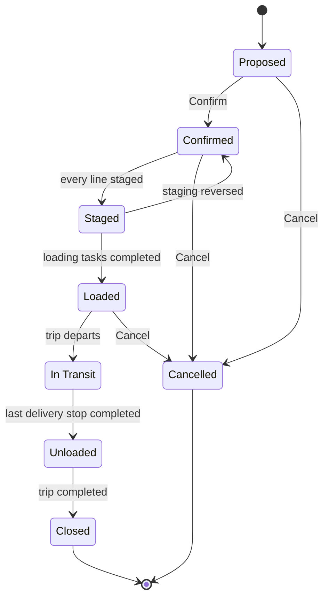

import DocumentInfo from '@site/src/components/DocumentInfo';
import Screenshot from '@site/src/components/Screenshot';

# Loading Operations

<DocumentInfo
  category="User Manual"
  audience={['Warehouse', 'Operations', 'Planning', 'UAT']}
  status="Draft"
  version="1.0"
  owner="Product Team"
  updated="August 2026"
  readingTime="7 min"
/>

**Role**
Warehouse

**Navigate to**
`SCOP → Operations → Loading Tasks`

## What a loading task is

The job of getting **one shipment** onto **one vehicle**.

:::info[One loading task per shipment on the trip]

A trip carrying three shipments gets three loading tasks. Each is settled independently, and
**the vehicle cannot leave until every one is done**.

:::

## Where they come from

Loading tasks are created **automatically when the trip is released**. Nobody creates one.

<Screenshot
  src="quick-start/22-loading-tasks.png"
  alt="SCOP Loading Tasks list showing one task per shipment with its status, planned duration and Start button."
  caption="Release created one task per shipment on the trip."
/>

## The list
<Screenshot
  src="user-manual/05-loading-tasks.png"
  alt="The SCOP Loading Tasks list showing one task per shipment with status, planned and actual duration and the Start and Done buttons."
  caption="The warehouse works this queue directly from the list."
/>


| Column | Meaning |
| --- | --- |
| **Reference** | The task identifier |
| **Trip** | Which trip it belongs to |
| **Shipment** | Which shipment it loads |
| **Vehicle** | What it is being loaded onto |
| **Location** | Where the loading happens |
| **Assigned To** | Who is doing it |
| **Sequence** | The order tasks should be done in |
| **Planned Duration (min)** | The estimate |
| **Actual Duration (min)** | What it took |
| **Started At** / **Completed At** | Timestamps |
| **Status** | Pending · In Progress · Done · Cancelled |

**Start** and **Done** are available directly from the list, so a warehouse team can work
the queue without opening anything.

## The four statuses

```text
Pending  →  In Progress  →  Done
                ↓
            Cancelled
```

| Status | Meaning |
| --- | --- |
| **Pending** | Created, not started |
| **In Progress** | Loading has begun. **Started At** is stamped |
| **Done** | Loading is finished. **Completed At** and **Actual Duration** are stamped |
| **Cancelled** | Not going to happen |

:::note[This is a status, not a governed lifecycle]

Unlike demands, plans and trips, the loading task carries a plain status field rather than a
governed state machine. It moves through **Start** and **Done**, and there is no gate on it.

:::

## What Start and Done do to the trip

This is the departure gate, and it is the whole point of loading tasks.

| Action | Effect on the trip |
| --- | --- |
| **Start** the **first** task | The trip moves Released → **Loading** |
| **Done** on the **last** task | The trip moves Loading → **Ready to Depart**, and its loads become **Loaded** |
| Any task still **Pending** or **In Progress** | The trip stays in **Loading**. **Depart is not offered** |

<Screenshot
  src="quick-start/27-loading-task-in-progress.png"
  alt="A SCOP loading task in status In Progress with its start time recorded."
  caption="Starting the first task moved the trip to Loading."
/>

:::warning[An open loading task holds the vehicle at the gate]

If a driver reports that **Depart** is missing, the first thing to check is the trip's
loading tasks. One of them is not **Done**.

That is the gate working correctly.

:::

**Verified on `b2b`.** `TRP-2026-000006` was released with two shipments, and departure was
attempted at two points:

| Attempted from | Result |
| --- | --- |
| **Released** — before loading started | `TRP-2026-000006 cannot move from Released to In Progress.` |
| **Loading** — first task started, second still pending | `TRP-2026-000006 cannot move from Loading to In Progress.` |

Starting the first task moved the trip from **Released** to **Loading** on its own, with
nobody touching the trip record.

:::note[Settling a task needs Odoo Inventory → User]

**Done** reads the underlying stock moves, so it requires Odoo's **Inventory → User** group.
An Operations Manager without it gets:

```text
You are not allowed to access 'Stock Move' (stock.move) records.
```

This is correct — settling a loading task is warehouse work. See
[Permissions Reference](../roles/permissions-reference.mdx).

:::

## Measured loading duration

| Field | Where it comes from |
| --- | --- |
| **Planned Duration** | Estimated when the task is created |
| **Actual Duration** | Computed from **Started At** to **Completed At** |

The comparison appears in [Trip Planned vs Actual](../reporting/trip-planned-vs-actual.mdx)
and is one of the few genuinely measured operational times in Release 1.

:::note[Press Start when you start, not when you remember]

Actual duration is only meaningful if **Start** is pressed at the moment loading begins.
Starting all three tasks at once and settling them later produces a measurement of nothing.

:::

## Assigning tasks

**Assigned To** names who is doing the work. It is optional — the task can be worked without
it — but assigning tasks is what turns the list into a work queue for a shift.

## Loads

`SCOP → Operations → Loads`

A **Load** is what is physically on the vehicle. It is closely related to loading tasks but
answers a different question:

| Object | Question |
| --- | --- |
| **Loading Task** | Is the warehouse work done? |
| **Load** | What is on the vehicle, and where is it in its journey? |

Loads move largely on their own, driven by trip and loading events. Most warehouse users
never open them.

:::note[The baseline planner does not create loads]

Verified on `b2b`: a trip produced by the deterministic baseline provider is released with
its loading tasks but with **no load records**. The load lifecycle exists and is enforced
where loads are created, but nothing in the Release 1 planning path creates them
automatically.

Expect `SCOP → Operations → Loads` to be empty in a standard pilot. That is not a fault, and
the departure gate does not depend on it.

:::

### The eight load states



| State | Reached when |
| --- | --- |
| **Proposed** | The plan proposes this load |
| **Confirmed** | Capacity is feasible at every point of the sequence |
| **Staged** | Every shipment line on the load is staged |
| **Loaded** | Actual loaded quantities are recorded on every load line |
| **In Transit** | The trip departs |
| **Unloaded** | The last delivery stop is completed |
| **Closed** | The trip completes. **Terminal** |
| **Cancelled** | **Terminal** |

:::info[Confirming a load runs BR-RTE-001]

Confirmation evaluates capacity feasibility at every point of the sequence — the same rule
that governs trip approval and release.

→ [Trips](./trips.mdx)

:::

**Cancel** on a load is available to a **Warehouse User** and only while the trip has not
departed.

## Verify

| Check | Where | Expect |
| --- | --- | --- |
| Tasks exist for a released trip | `Operations → Loading Tasks` | One per shipment |
| The trip moved to **Loading** | The trip's status | After the first **Start** |
| The trip is **Ready to Depart** | The trip's status | After the last **Done** |
| Duration was measured | The task's **Actual Duration** | A sensible number |
| Loads reached **Loaded** | `Operations → Loads` | State **Loaded** |

## If it does not work

| Symptom | Cause | Fix |
| --- | --- | --- |
| No loading tasks for a released trip | The trip has no shipments, or release did not complete | Check the trip's **Stops** and **Loading** tabs |
| **Start** is not offered | The task is not **Pending** | — |
| **Done** is not offered | The task is not **In Progress** | Press **Start** first |
| The trip will not become **Ready to Depart** | A task is still open | Settle every task |
| **Depart** is missing for the driver | Same cause | Settle every task |
| Actual duration is absurd | **Start** was pressed long before loading began | Press it at the right moment next time |
| A load is stuck in **Confirmed** | Not every shipment line is staged | [Warehouse Readiness](../readiness/warehouse-readiness.mdx) |
| A load will not **Confirm** | `BR-RTE-001` — capacity is breached | [Trips](./trips.mdx) |

## Related Pages

- [Trip Lifecycle](./trip-lifecycle.mdx)
- [Warehouse Readiness](../readiness/warehouse-readiness.mdx)
- [Driver Delivery](./driver-delivery.mdx)
- [Loading Delay Scenario](../scenarios/loading-delay-scenario.mdx)

## Next

[Stops](./stops.mdx).
