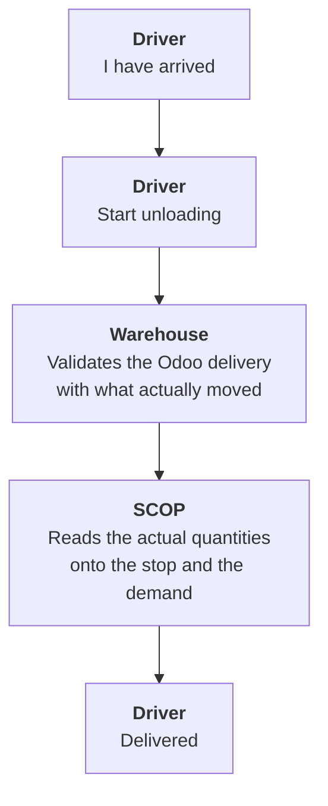

import DocumentInfo from '@site/src/components/DocumentInfo';
import Screenshot from '@site/src/components/Screenshot';

# Odoo Delivery Validation

<DocumentInfo
  category="User Manual"
  audience={['Warehouse', 'Driver', 'Operations', 'Planning', 'UAT']}
  status="Draft"
  version="1.0"
  owner="Product Team"
  updated="August 2026"
  readingTime="6 min"
/>

:::info[This is the canonical page for quantity authority]

Every other chapter refers here rather than restating it.

:::

**Roles**
Driver reports. **Warehouse validates.** SCOP reads.

## The one rule

:::danger[Odoo is authoritative for actual stock quantities]

There is **no place in SCOP where a user types how much was delivered.**

Not the driver. Not the planner. Not the warehouse. Not an administrator.

Actual quantities come from the **validated Odoo transfer**, and SCOP reads them back onto
the stop line and the demand line.

:::

### Why

If SCOP carried its own quantity field, then the moment the two disagreed nobody could say
which was true — and stock, invoicing and OTIF would all be computed from a number nobody
had reconciled.

One number. One owner. Everything else reads it.

## The Release 1 workflow



| # | Who | Where | What |
| --- | --- | --- | --- |
| 1 | Driver | `My Work → My Stops` | **I have arrived** |
| 2 | Driver | Same | **Start unloading** |
| 3 | **Warehouse** | **Odoo** | Validate the transfer with the quantity that actually moved |
| 4 | SCOP | — | Reads the quantities back automatically |
| 5 | Driver | `My Work → My Stops` | **Delivered** |

:::warning[Step 3 sits between two driver actions]

That is the part people miss. The driver cannot close the stop until the warehouse has
validated, because until then there is nothing to close it on.

The order is not negotiable and it is not a workaround — it is the design.

:::

## What the warehouse does

<Screenshot
  src="quick-start/37-odoo-transfer-before-validate.png"
  alt="An Odoo delivery order in the ready state with demand and done quantities visible."
  caption="Before validation. The Done column is what will become SCOP's actual quantity."
/>

| Validate with | Odoo does | SCOP reads back |
| --- | --- | --- |
| The **full** quantity | Closes the transfer | Demand → **Completed** |
| **Less** than ordered | Creates a **backorder** for the remainder | Demand → **Partially Completed**, follow-up created |
| **Nothing** | — | The stop must be failed with a reason |

<Screenshot
  src="quick-start/38-odoo-transfer-validated.png"
  alt="The same Odoo delivery order after validation, in state Done."
  caption="Validated. SCOP now has an actual quantity to read."
/>

:::note[Validate what actually moved, not what was ordered]

The whole accuracy of SCOP's measurement rests on this. Validating the ordered quantity when
less was delivered produces a Completed demand, a clean OTIF, and a customer who did not get
their goods.

:::


## What SCOP does with it

| Reads onto | Field |
| --- | --- |
| The stop line | **Actual Quantity** |
| The demand line | **Fulfilled** and **Remaining** |
| The stop | The derived **outcome** |
| The demand | Its final state |

The outcome is **derived**, not chosen:

```text
fulfilled == 0              →  Failed
0 < fulfilled < requested   →  Partially Completed
remaining == 0              →  Completed
```

## Reading quantities does not require Odoo rights

:::info[SCOP screens read quantities on the record's behalf]

Opening a demand or a driver's stop screen does **not** require Odoo's **Inventory → User**
group. Those screens read the delivered quantities on the record's behalf.

That is what allows a driver — who must never be able to read every transfer in the company —
to see what was delivered at their own stop.

A planner still needs **Inventory → User** to *operate* a demand, and whoever validates a
transfer needs it because that is Odoo's own work.

→ [Permissions Reference](../roles/permissions-reference.mdx)

:::

## The demand is not tied to one transfer

There is deliberately no one-to-one link between a demand and a transfer. The link is at
**move level**.

```text
One transfer  →  may carry several demands
One demand    →  may be fulfilled by several transfers
                 (the original, plus every backorder)
```

That is what lets a backorder attach itself to the demand it came from without anyone
re-keying anything — and why a demand's **Transfers** count above one is normal.

→ [Partial Deliveries and Backorders](./partial-deliveries-and-backorders.mdx)

## Several demands at one stop

Each stop line names its own demand and its own transfer. So within one arrival:

| Demand | Its transfer validated | Outcome |
| --- | --- | --- |
| `Demand A` | In full | **Completed** |
| `Demand B` | Short, backorder created | **Partially Completed** |

One stop outcome does not force every demand into the same state.

→ [The Physical Visit](../shipments/the-physical-visit.mdx)

## What happens if validation is late

Nothing breaks. The state of the world is simply that the goods are at the customer and the
system does not know yet.

| Consequence | Detail |
| --- | --- |
| Actual quantities show **zero** | Nothing has been read back |
<Screenshot
  src="user-manual/D04-driver-stop-servicing.png"
  alt="The driver's stop form in the Servicing state, with the Goods tab showing planned quantities against actual quantities of zero."
  caption="The driver's own screen at the moment the goods are handed over. Actual Qty is 0.00 on every line because the warehouse has not validated the transfer yet — the delivery is fine, the paperwork is behind."
  device="mobile"
/>

| **Delivered** is **refused** | With a message saying exactly this |
| The demand stays **In Execution** | |
| The trip cannot close | Its last stop has no outcome |

<Screenshot
  src="quick-start/39-awaiting-odoo-validation.png"
  alt="A message explaining that no delivered quantity has been recorded yet and the stop cannot be closed."
  caption="The refusal message names the cause and tells the driver what to do."
  device="mobile"
/>

:::danger[Do not record a failure because validation is late]

The message distinguishes the two cases deliberately. A failure recorded here would have to
be unpicked from every service measure afterwards.

→ [Failed Delivery](./failed-delivery.mdx)

:::

## Verify

| Check | Where | Expect |
| --- | --- | --- |
| The transfer is validated | Odoo, or the demand's **Transfers** button | State **Done** |
| The quantity is what moved | The transfer's **Done** column | Reality |
| SCOP read it back | The stop's **Quantities** tab | Actual populated |
| The demand followed | The demand's **Lines** tab | **Fulfilled** populated |
| The demand's state | Its status bar | Completed, Partially Completed or Failed |
| A backorder exists, if short | Odoo | A new transfer |

## If it does not work

| Symptom | Cause | Fix |
| --- | --- | --- |
| Actual quantities are zero | The transfer is not validated | Validate it |
| **Delivered** is refused | Same | Same |
| The demand is Completed but the customer got less | The transfer was validated with the **ordered** quantity | Correct it in Odoo |
| The demand stays **Partially Completed** | The follow-up has not been delivered yet | Plan the follow-up |
| A demand shows several transfers | Normal — backorders | Nothing |
| Quantities look right but the stop will not close | Something is short and no reason was given | `BR-EXE-001` — give a reason |

## Related Pages

- [Partial Deliveries and Backorders](./partial-deliveries-and-backorders.mdx)
- [Failed Delivery](./failed-delivery.mdx)
- [Demand Completion](../demand/demand-completion.mdx)
- [SCOP and Odoo](../about/scop-and-odoo.mdx)
- [Stops](./stops.mdx)

## Next

[Partial Deliveries and Backorders](./partial-deliveries-and-backorders.mdx).
