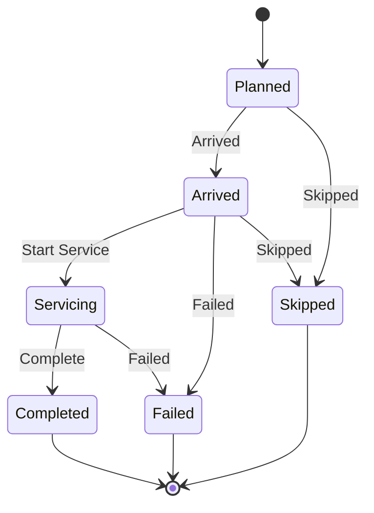

import DocumentInfo from '@site/src/components/DocumentInfo';
import Screenshot from '@site/src/components/Screenshot';

# Stops

<DocumentInfo
  category="User Manual"
  audience={['Planning', 'Operations', 'Driver', 'UAT']}
  status="Draft"
  version="1.0"
  owner="Product Team"
  updated="August 2026"
  readingTime="7 min"
/>

**Role**
Planner reads the full form. A Driver uses the simplified one in
[My Work](./driver-delivery.mdx).

**Navigate to**
`SCOP → Operations → Stops`, or a trip's **Stops** tab

## What a Stop is

One **physical visit**: one arrival, one service period, one departure, one proof of
delivery.

It is not "one customer" and not "one order" — see
[The Physical Visit](../shipments/the-physical-visit.mdx).

## The stop form
<Screenshot
  src="user-manual/08-stops-list.png"
  alt="The SCOP Stops list showing stops with sequence, location, activity, planned and actual arrival, status and outcome."
  caption="Status and outcome are separate columns, because they answer different questions."
/>


| Field | Meaning |
| --- | --- |
| **Trip** | Which trip |
| **Sequence** | Where in the route. Unique per trip |
| **Location** | The planning node visited |
| **Activity** | What kind of work — delivery, pickup |
| **Customer** | The party served |
| **Planned Arrival** / **Actual Arrival** | |
| **Planned Departure** / **Actual Departure** | |
| **Planned Service (min)** / **Actual Service (min)** | |
| **Arrival Variance (min)** | Actual against planned |
| **Status** | Where the visit has got to |
| **Outcome** | How it turned out |
| **Outcome Reason** | Why, where the outcome was not a clean delivery |

Two tabs: **Quantities** and **Proof of Delivery**.

## Status and outcome are different things

This trips people up, so it is worth being explicit.

| Field | Answers | Values |
| --- | --- | --- |
| **Status** | Where has the visit got to? | Planned · Arrived · Servicing · Completed · Failed · Skipped |
| **Outcome** | How did it turn out? | Completed · Partially Completed · Failed · Skipped · Rescheduled |

A stop with status **Completed** can have outcome **Partially Completed** — the visit
finished, but not everything was delivered.

## The six statuses



| Status | Meaning | Records |
| --- | --- | --- |
| **Planned** | Not yet visited | — |
| **Arrived** | The vehicle is there | **Actual Arrival**, an execution event |
| **Servicing** | Unloading or loading has begun | **Actual Service Start**, an execution event |
| **Completed** | The visit is finished. **Terminal** | **Actual Departure**, the outcome, an execution event |
| **Failed** | The visit achieved nothing. **Terminal** | The outcome. **A reason is required** |
| **Skipped** | Not attempted. **Terminal** | The outcome. **A reason is required** |

## The five outcomes

| Outcome | Meaning |
| --- | --- |
| **Completed** | Everything planned was delivered |
| **Partially Completed** | Some of it was |
| **Failed** | None of it was |
| **Skipped** | The visit was not attempted |
| **Rescheduled** | Moved to another occasion |

:::info[The outcome is derived, not chosen]

When a stop is completed, SCOP **derives** the outcome from the quantities that actually
moved.

A driver who delivered three of five cartons has already recorded that on the Odoo transfer.
Asking them to *also* classify the visit would invite the two answers to disagree — and the
quantities are the ones the customer can verify.

:::

## The Quantities tab

One line per product at this stop.

| Column | Meaning | Source |
| --- | --- | --- |
| **Product** | What is being delivered or collected | The shipment line |
| **Planned Qty** | What should move | The shipment line |
| **Actual Qty** | What did move | **The validated Odoo transfer** |
| **Qty Variance** | Actual minus planned | Computed |
| **Shipment Line** | The line this came from — **and through it, the demand** | The traceability link |
| **Inventory Owner** | Who owns these goods | Copied from the shipment line |
| **Ownership Source** | How that was established | Copied from the shipment line |

:::note[The demand is reached through the shipment line, not directly]

A stop line names its **shipment line**, and the shipment line names its **demand**. The
chain is one hop longer than it looks, and it is what keeps a shared visit traceable:

```text
Stop line  →  Shipment line  →  Demand  →  Odoo transfer
```

:::

:::warning[Actual quantity is never typed]

It is read from the validated Odoo transfer. There is no field anywhere in SCOP where a
person enters a delivered quantity.

→ [Odoo Delivery Validation](./odoo-delivery-validation.mdx)

:::

:::info[Each line names its own demand]

When several demands share a stop, each line still traces to its own demand and its own
transfer. That is what makes mixed outcomes possible — `Demand A` completed while
`Demand B` is short, from one arrival.

→ [The Physical Visit](../shipments/the-physical-visit.mdx)

:::

## The actions

| Button | From → To | Requires |
| --- | --- | --- |
| **Arrived** | Planned → Arrived | — |
| **Start Service** | Arrived → Servicing | — |
| **Complete** | Servicing → Completed | Actual quantities from the transfer; a reason if not a clean delivery |
| **Failed** | Arrived or Servicing → Failed | **An outcome reason** |
| **Skipped** | Planned or Arrived → Skipped | **An outcome reason** |

The driver's own screen offers the same actions in plainer words — **I have arrived**,
**Start unloading**, **Delivered**, **Could not deliver**.

## Completing a stop

**Complete** is refused in two situations, and the message tells you which.

### The transfer has not been validated yet

> Stop 2 has no delivered quantity recorded yet. The warehouse validates the transfer in
> Odoo, and SCOP reads the result — wait for that, then close the stop. If the delivery
> genuinely failed, use 'Could not deliver' and give the reason.

:::warning[This is not a failed delivery]

Nothing has gone wrong. The goods may be at the customer and the paperwork simply behind.

Recording a failure here would put a failure that did not happen into every service measure
downstream, and it would then have to be unpicked from each of them.

→ [Failed Delivery](./failed-delivery.mdx)

:::

### Something was short, and no reason was given

> Stop 2 did not deliver everything planned, so it needs a reason before it can be closed.

This is `BR-EXE-001`, asked at the moment the person can actually answer.

## Completing a stop is idempotent

A stop that is already Completed, Failed or Skipped **stays closed**. Pressing **Complete**
again does nothing.

:::note[Why that matters]

A double tap, or a reconnecting phone replaying the call, would otherwise re-stamp the
departure time and silently rewrite a measurement of something that happened once.

:::

## When the last stop closes

Closing the final stop closes the trip on its own:

| Every stop's outcome is | The trip becomes |
| --- | --- |
| **Completed** | **Completed** |
| Anything else | **Partially Completed** |

And from there the shipments and demands follow. Nobody pushes them.

→ [Trip Lifecycle](./trip-lifecycle.mdx)

## Planned against actual

| Measure | Meaning |
| --- | --- |
| **Arrival Variance (min)** | Actual arrival against planned |
| **Actual Service (min)** | Arrival to departure |

Both feed [Trip Planned vs Actual](../reporting/trip-planned-vs-actual.mdx), and arrival is
what [OTIF](../reporting/otif.mdx) measures on-time against.

## Verify

| Check | Where |
| --- | --- |
| The stop's status and outcome | The stop form |
| Actual quantities were read back | The **Quantities** tab |
| Each line names its demand | The same tab |
| Proof of delivery was captured | The **Proof of Delivery** tab |
| The trip closed | The trip's status |
| The demands followed | `Operations → Demands` |

## If it does not work

| Symptom | Cause |
| --- | --- |
| **Complete** refused, "no delivered quantity recorded yet" | The Odoo transfer is not validated |
| **Complete** refused, "needs a reason" | Something was short — `BR-EXE-001` |
| **Failed** refused | No outcome reason chosen |
| Actual quantities are all zero | The transfer is not validated |
| The stop is Completed but the demand is not | The demand's own transfer may still be open |
| The trip did not close after the last stop | A stop lacks an outcome — check every one |
| Two stops where one was expected | Different node, activity, date or window |

## Related Pages

- [The Physical Visit](../shipments/the-physical-visit.mdx)
- [Driver Delivery](./driver-delivery.mdx)
- [Odoo Delivery Validation](./odoo-delivery-validation.mdx)
- [Failed Delivery](./failed-delivery.mdx)
- [Proof of Delivery](./proof-of-delivery.mdx)

## Next

[Driver Delivery](./driver-delivery.mdx).
