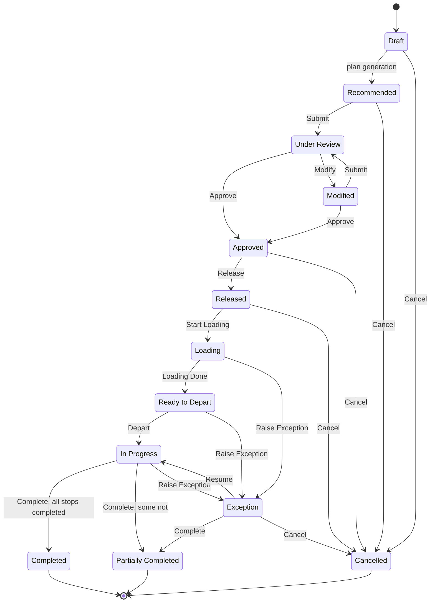

import DocumentInfo from '@site/src/components/DocumentInfo';
import Screenshot from '@site/src/components/Screenshot';

# Trip Lifecycle

<DocumentInfo
  category="User Manual"
  audience={['Planning', 'Operations', 'Warehouse', 'Driver', 'UAT']}
  status="Draft"
  version="1.0"
  owner="Product Team"
  updated="August 2026"
  readingTime="8 min"
/>

**Role**
Different roles own different segments — the table below says which.

## The lifecycle



## The thirteen states

| State | Meaning | Owned by |
| --- | --- | --- |
| **Draft** | Created but not yet part of a recommendation | — |
| **Recommended** | A planning run proposed it | Planner |
| **Under Review** | Submitted for authorisation | Ops Manager |
| **Modified** | Changed after review began | Planner |
| **Approved** | Authorised | Ops Manager |
| **Released** | Real work. Visible to the driver. **Loading tasks exist** | Warehouse |
| **Loading** | Loading has started | Warehouse |
| **Ready to Depart** | Loading is finished. The vehicle may go | **Driver** |
| **In Progress** | The vehicle has departed | Driver |
| **Exception** | A problem has interrupted it | Ops Manager |
| **Completed** | Every stop completed. **Terminal** | — |
| **Partially Completed** | Every stop has an outcome, not all completed. **Terminal** | — |
| **Cancelled** | Withdrawn. **Terminal** | — |

## The plan drives the first six

The trip does not move through the review states on its own. **Releasing the daily plan
releases its trips.**

| Plan does | Trips become |
| --- | --- |
| Generated | **Recommended** |
| Submitted | **Under Review** |
| Approved | **Approved** |
| **Released** | **Released** |

The trip's own **Submit**, **Approve** and **Release** buttons exist for handling one trip
separately — for example after fixing a trip that blocked its plan under `BR-PLN-002`.

→ [The Daily Plan](../planning/the-daily-plan.mdx)

## What Release does

| Effect | Detail |
| --- | --- |
| The trip becomes visible to its driver | In `My Work → My Trips` |
| Resource assignments become **committed** | The vehicle and driver are operationally held |
| **Loading tasks are created** | **One per shipment** on the trip |

:::warning[Release requires a planned window]

A trip with no planned start and end cannot hold its resources, and release is refused.

:::

<Screenshot
  src="quick-start/22-loading-tasks.png"
  alt="SCOP Loading Tasks list showing one task per shipment on a released trip."
  caption="Release created the loading tasks — one per shipment on the trip."
/>

## Loading and the departure gate

| Transition | Trigger | Effect |
| --- | --- | --- |
| Released → **Loading** | The **first** loading task is started | — |
| Loading → **Ready to Depart** | The **last** loading task is settled | Loads become **Loaded** |

:::info[An open loading task holds the vehicle at the gate]

**Depart** is offered only in **Ready to Depart**. Until every loading task is done, the
trip stays in **Loading** and the vehicle does not go.

That is the gate working, not a bug.

:::

<Screenshot
  src="quick-start/24-trip-ready-to-depart.png"
  alt="SCOP Trip form in state Ready to Depart."
  caption="Ready to Depart. Loading is finished and the driver can go."
/>

→ [Loading Operations](./loading-operations.mdx)

## Departure

| | |
| --- | --- |
| **From → To** | Ready to Depart → In Progress |
| **Who** | The **assigned driver**, or a Planner / Dispatcher |

**What SCOP does**

| Effect | Detail |
| --- | --- |
| Records **Actual Start** | The moment of departure |
| Loads → **In Transit** | |
| Shipments → **In Execution** | Every planned shipment on the trip |
| Demands → **In Execution** | Every released demand behind them |

:::info[The cascade runs on the system's behalf]

Departing is the driver's act. Moving shipments and demands into execution is the system
**recording the consequence** — a shipment on a departed vehicle *is* in execution.

The driver gains no access to shipments or demands by doing it. The alternative would have
been to give the narrowest role in the system a foothold on the demand register to make a
bookkeeping side effect work.

→ [Driver Security Model](./driver-security-model.mdx)

:::

## Completion

**Complete** is available in **In Progress** or **Exception**, and requires that **every
stop has an outcome**.

| Every outcome is | The trip becomes |
| --- | --- |
| **Completed** | **Completed** |
| Anything else | **Partially Completed** |

**What SCOP does**

| Effect | Detail |
| --- | --- |
| Records **Actual End** | |
| Resource assignments → **closed** | The vehicle and driver are released |
| Loads → **closed** | |
| **Follow-up demands created** | One per failed line, so nothing is lost |

:::danger[BR-EXE-001 fires here]

`BR-EXE-001` — *a failed or partial stop must carry an outcome reason* — is evaluated at
`trip_complete`. A trip with an unexplained failed or partial stop cannot close.

The reason is normally asked for much earlier, at the moment the driver closes the stop,
because that is when they can actually answer.

→ [Failed Delivery](./failed-delivery.mdx)

:::

The trip usually closes **by itself** when the last stop reaches an outcome. **Complete** is
there for the cases where it does not.

## Exception

| | |
| --- | --- |
| **From** | Loading, Ready to Depart, or In Progress |
| **Button** | **Raise Exception** |
| **What it does** | Creates an operational exception and moves the trip to **Exception** |

| Getting out | Condition |
| --- | --- |
| **Resume** → In Progress | The originating exception is resolved or closed |
| **Complete** → Partially Completed | Every stop has an outcome |
| **Cancel** → Cancelled | |

→ [Exception Management](../exceptions/exception-management.mdx)

## Cancellation

| | |
| --- | --- |
| **Available in** | Draft, Recommended, Approved, Released, Exception |
| **Not available in** | Loading, Ready to Depart, In Progress |
| **Role** | Planner *(approval authority: `scop.trip` / cancel)* |
| **Effect** | Resource assignments → **cancelled** |

A trip that is loading or moving cannot be cancelled. Raise an exception instead.

## What flows downstream

```text
Plan released      →  Trips released          →  Loading tasks created
Loading started    →  Trip Loading
Loading finished   →  Trip Ready to Depart    →  Loads Loaded
Departed           →  Loads In Transit        →  Shipments and Demands In Execution
Last stop closed   →  Trip closes             →  Shipments Completed
                                              →  Demands Completed / Partially / Failed
                                              →  Resources released
```

:::info[The chain closes itself]

Nobody pushes shipments or demands through their states by hand. Plan release, departure and
the last stop's outcome carry the whole chain to completion.

If something is stuck, the cause is almost always upstream — most often an unvalidated Odoo
transfer.

:::

## Verify

| Check | Where |
| --- | --- |
| The trip reached the state you expect | The status bar |
| Who moved it, and when | The chatter |
| Actual start and end | The header |
| Planned against actual | The **Planned vs Actual** tab |
| Its shipments followed | `Operations → Shipments` |
| Its demands followed | `Operations → Demands` |

## If it does not work

| Symptom | Cause |
| --- | --- |
| Stuck in **Released** | Loading has not started |
| Stuck in **Loading** | A loading task is still open |
| **Depart** is not offered | Not in **Ready to Depart**, or you are neither the driver nor a dispatcher |
| Stuck in **In Progress** with all stops done | A stop lacks an outcome. Check each one |
| **Complete** is refused | `BR-EXE-001` — a failed or partial stop has no reason |
| Closed as **Partially Completed** unexpectedly | One stop was failed or skipped. Read its outcome |
| Demands still **In Execution** after the trip closed | The Odoo transfer was not validated |

## Related Pages

- [Trips](./trips.mdx)
- [Loading Operations](./loading-operations.mdx)
- [Driver Delivery](./driver-delivery.mdx)
- [Lifecycle Reference](../reference/lifecycle-reference.mdx)

## Next

[Loading Operations](./loading-operations.mdx).
