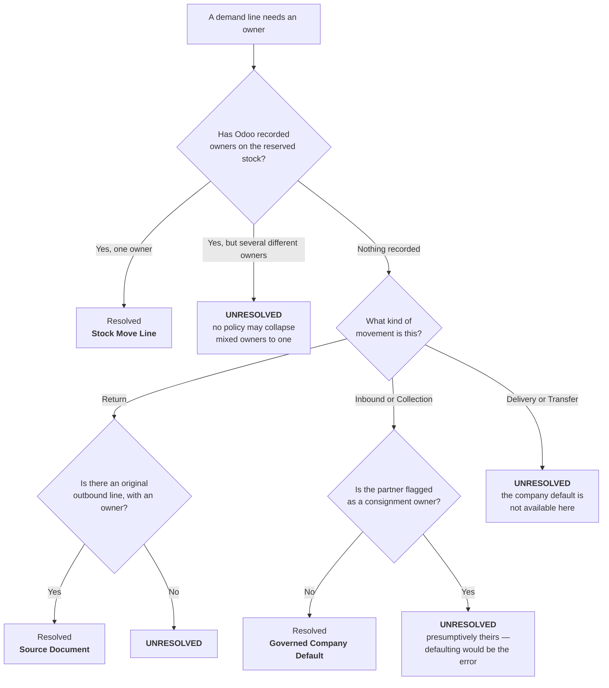

import DocumentInfo from '@site/src/components/DocumentInfo';
import Screenshot from '@site/src/components/Screenshot';

# Inventory Ownership

<DocumentInfo
  category="User Manual"
  audience={['Planning', 'Operations', 'Warehouse', 'Management', 'UAT']}
  status="Draft"
  version="1.0"
  owner="Product Team"
  updated="August 2026"
  readingTime="9 min"
/>

:::info[This is the canonical page for ownership and `BR-INV-002`]

Every other chapter refers here rather than restating it.

:::

**Role**
Planner resolves it. Warehouse and Management need to understand it.

## Why ownership matters

SCOP moves goods. Moving goods that belong to somebody else, without knowing that they do,
is not an inventory error — it is a **legal** one.

This warehouse holds stock that is not the company's. Consignment stock sits in company
locations alongside company stock, and looks identical on a shelf.

So SCOP asks one question about every line of every demand: **who owns these goods?** And it
refuses to plan a movement it cannot answer it for.

## The one rule that matters

:::warning[Ownership is never derived from location]

Physical position is not proof of title. Customer-owned stock sits in company warehouses
today, and it will still be sitting there tomorrow.

Any logic that read the location to decide the owner would be inventing legal facts.

:::

## Why "no owner recorded" is not "the company owns it"

This is the part that surprises people, and it is worth being precise about.

In standard Odoo, an empty owner field on stock **is** a positive assertion of company
ownership — that is how consignment is designed to work there.

In **this** deployment, that field has never been populated by any module. Its emptiness
asserts nothing at all.

| If SCOP read an absent owner as "the company" | The result |
| --- | --- |
| Every customer-owned carton in the building | Would be assigned to the company |
| `BR-INV-002` | Would then confirm the chain as internally consistent — because it *would* be |
| The system | Would be **consistently wrong** |

Consistently wrong is worse than honestly stuck. So an absent owner falls through to a
per-source policy, and **only two sources have an approved policy that resolves it**.

## The five ownership sources

When a demand line's owner is established, SCOP records **how**.

| Source | Means | Trusted because |
| --- | --- | --- |
| **Stock Move Line** | Odoo has actually recorded an owner on the reserved stock | It is a recorded fact, not an inference |
| **Source Document** | Inherited from the outbound line that originally shipped the goods — used for **returns** | Odoo's own link back to the original move |
| **Customer Commitment** | Established by an agreement with the customer | An approved agreement |
| **Explicit on the Demand** | Set deliberately by a person | Someone took responsibility |
| **Governed Company Default** | Approved policy: goods the company **bought** are the company's | Applies to **receipts only**, and never from a flagged consignment partner |

There is deliberately **no sixth value meaning "unresolved"**. Unresolved is the *absence* of
a source. A named value would read like a resolution.

## How SCOP decides, step by step



### Reading the three outcomes

| Odoo's state | SCOP reads it as | Why the distinction matters |
| --- | --- | --- |
| No move lines exist yet | *We have not looked* | Re-derivation can still succeed later |
| Move lines exist, all with an empty owner | *We looked, and Odoo says nothing* | Falls through to the per-source policy |
| Move lines exist with **different** owners | *Mixed — refuse* | Picking one would be a coin flip with legal consequences |

Collapsing any two of those is exactly how ownership leaks.

## Why deliveries cannot use the company default

For a **delivery** or an internal **transfer**, there is no approved policy that resolves an
absent owner. Not even for an unflagged partner.

The consignment flag records **who we know is a consignment owner** — not who might be. An
unflagged partner is not evidence of company ownership; it is an absence of evidence
either way.

That is why almost every ownership refusal you meet in practice is on an outbound movement.

## Unresolved at creation is normal

:::note[A red ownership flag on a new demand is expected]

At the moment Odoo creates a transfer, it usually has **no move lines** — nothing is
reserved yet, so there is no owner to read.

Ownership is **re-derived when the demand is validated**, by which point the transfer is
normally reserved and the owner is available.

This is why unresolved ownership is usually transient. Do not treat a red row on a
brand-new demand as a problem.

:::

## BR-INV-002

| | |
| --- | --- |
| **Code** | `BR-INV-002` |
| **Name** | Ownership must be resolved and consistent |
| **Severity** | **Blocking** |
| **Subject** | Demand |
| **Fires at** | `demand_validate` |
| **If it cannot be evaluated** | **Block** |

### What it checks

Two things:

1. **Resolved** — every line has an owner and a recorded ownership source.
2. **Consistent** — no line's owner disagrees with what Odoo has recorded on the reserved
   stock.

A line whose recorded owner is simply empty does **not** count as a disagreement: a null
there is Odoo's un-populated field, not a claim that contradicts ours.

### What you see

<Screenshot
  src="quick-start/05-ownership-block-validate.png"
  alt="A refusal dialog on the SCOP demand form stating that ownership must be resolved before validation, naming the affected lines."
  caption="BR-INV-002 refusing validation. The dialog names the rule, states the policy, and lists the exact lines at fault."
/>

The refusal names **which lines** are at fault, so you are never left searching.

:::info[Blocking if it cannot even be evaluated]

If the check itself cannot run, `BR-INV-002` blocks anyway. Not knowing who owns the goods
is treated exactly the same as knowing that ownership is wrong.

:::

## Where ownership shows up

| Screen | What it shows |
| --- | --- |
| Demand form — banner at the top | A warning while any line is unresolved |
| Demand form — **Lines** tab | **Owner** and **Ownership Source** per line |
| Demands list — **Ownership** column | Whether every line is resolved |
| Demands list — **red row** | Unresolved, and past Draft |
| Warehouse Readiness | **Blocked**, with the unresolved products named |
| `Reporting → Ownership Data Quality` | Resolved against unresolved, across the register |

## Readiness treats it as blocking, not as a degree

A shipment whose ownership is unresolved is **Blocked** — not *"partially ready"*.

`Blocked` is tested **first**, before any staged percentage, so that a well-prepared pallet
cannot mask a legal problem.

→ [Warehouse Readiness](../readiness/warehouse-readiness.mdx)

## Consignment ownership

Goods arriving from a partner flagged as a **consignment owner** are presumptively theirs.
SCOP therefore refuses to apply the company default to them, and waits for the owner to be
recorded properly.

Flagging partners is an Administrator task, done once at onboarding:

```text
SCOP → Master Data → Onboarding → 1 · Consignment Partners
```

:::note[Purchase-order consignment terms are not modelled in Release 1]

Consignment ownership comes from a **flagged partner**, not from the terms of a purchase
order. A per-order consignment term is a later release.

:::

→ [Onboarding and Migration](../configuration/onboarding-and-migration.mdx)

## What ownership is not

| Not | Because |
| --- | --- |
| A record you create | It is **derived** on the demand line |
| Something you can default | An absent owner asserts nothing in this deployment |
| Derived from location | Physical position is not proof of title |
| Resolved per demand | It is resolved **per line** — one demand can mix owners legitimately |
| Something a warning can be dismissed on | `BR-INV-002` is blocking |

## Related Pages

- [Correcting Ownership](./correcting-ownership.mdx) — what to do when it is unresolved
- [Planning Eligibility](../demand/planning-eligibility.mdx)
- [Warehouse Readiness](../readiness/warehouse-readiness.mdx)
- [Business Rules](../reference/business-rules.mdx)
- [Data Quality Reports](../reporting/data-quality-reports.mdx)

## Next

[Correcting Ownership](./correcting-ownership.mdx).
