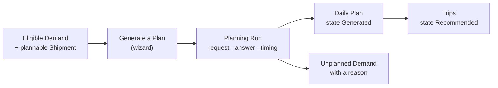

import DocumentInfo from '@site/src/components/DocumentInfo';

# Planning Overview

<DocumentInfo
  category="User Manual"
  audience={['Planning', 'Operations', 'Management', 'UAT']}
  status="Draft"
  version="1.0"
  owner="Product Team"
  updated="August 2026"
  readingTime="8 min"
/>

**Role**
Planner / Dispatcher

**Navigate to**
`SCOP → Planning`

## What planning is for

Planning turns a pile of independent requirements into **one coordinated operating day**:
which vehicles go where, in what order, carrying what, driven by whom.

It produces a **recommendation**. A person reviews it, and a different person authorises it.

## The chain

## What planning needs before it can run

| Requirement | Where it comes from | If missing |
| --- | --- | --- |
| Demands in **Eligible for Planning** | [Planning Eligibility](../demand/planning-eligibility.mdx) | Nothing to plan |
| Their shipments **plannable** | Readiness **Ready** or **Conditionally Ready** | Rejected with *Warehouse not ready* |
| **Ownership resolved** on every line | [Inventory Ownership](../ownership/inventory-ownership.mdx) | Rejected before anything else is considered |
| Vehicles with a **capacity profile** | [Fleet and Vehicles](../configuration/fleet-and-vehicles.mdx) | Rejected with *No feasible vehicle* |
| Nodes with **coordinates, timezone and opening hours** | [Planning Nodes](../configuration/planning-nodes.mdx) | Rejected with *Missing required data* |
| Odoo **Fleet → Administrator** and **Employees → Officer** on you | [Permissions Reference](../roles/permissions-reference.mdx) | `Access Error`, or no driver can be assigned |

## The two decision providers

Release 1 ships two, and the wizard's **Planned By** field chooses between them.

| Provider | What it does |
| --- | --- |
| **Baseline** | Produces a **deterministic recommendation** from the eligible demand and the available vehicles |
| **Manual** | Takes **your own assignments** and validates and scores them |

:::info[Both go through the same seam]

Manual planning is not a bypass. It builds the same request, calls the same service, and
produces the same response shape — which is exactly what lets an operator's plan be compared
against a recommendation afterwards.

Choosing **manual** is a deliberate act with a record.

:::

## What the baseline recommender actually is

:::warning[It is not AI route optimisation]

The baseline provider runs **nine deterministic steps and no local search** — no 2-opt, no
simulated annealing, no metaheuristic of any kind.

Given the same request it returns the same answer, every time. It is not expected to be
*good*. It is expected to be **stable and explainable**.

:::

That is the point. Without a recommendation there is nothing to compare an operator's plan
against, and [Decision Quality](../reporting/decision-quality.mdx) would have no baseline to
measure from.

### The nine steps

| # | Step | What it does |
| --- | --- | --- |
| 1 | **Eligible-demand selection** | Takes demands with resolved ownership and a non-zero load |
| 2 | **Priority and commitment ordering** | Urgent first, then high, normal, low; ties broken deterministically |
| 3 | **Feasible-vehicle filter** | Keeps vehicles that declare a capacity profile |
| 4 | **Ownership check** | Refuses anything whose title is unknown |
| 5 | **Compatibility check** | Refuses goods that may not travel together |
| 6 | **Capacity check** | Validates the load at **every point** of the sequence |
| 7 | **Window check** | Honours commitments and opening hours |
| 8 | **Insertion** | Places the demand into a route |
| 9 | **Response** | Emits trips, and classifies every rejection with a reason |

:::info[Unresolved ownership is rejected first, not last]

If a demand with unknown ownership reaches a planning run, planning it would put goods of
unknown title on a vehicle. It is rejected at step 1, with a reason that says exactly that —
so the operator fixes the ownership rather than hunting for a lorry.

:::

### What it deliberately does not do

| Not done | Why |
| --- | --- |
| **Warehouse selection** | Every stop uses the demand's own origin and destination. No alternative warehouse is enumerated or scored |
| **Inventory source selection** | Same reason |
| **Local search / route improvement** | Determinism is the property that matters here |
| **Learning from past plans** | No model is trained |

If it returns no feasible plan, the operator plans manually. The provider is additive and
cannot block operations.

### One more thing worth knowing

Where the travel matrix has no distance for a pair of nodes, the provider treats it as
**very large** rather than zero. An unknown distance must never make two nodes look adjacent
and sort first into every route.

That is why an ungeocoded node produces strange sequences rather than plausible-looking wrong
ones — see [Planning Nodes](../configuration/planning-nodes.mdx).

## The objective profile

`SCOP → Governance → Objective Profiles`

Planning does not optimise a single number. It works down a **ranked list**, and a lower
objective is never traded against a higher one.

| Rank | Objective | Means |
| --- | --- | --- |
| 1 | Safety, legal, ownership and mandatory compliance | Never move goods we have no title to |
| 2 | Feasibility | Never plan what cannot physically be done |
| 3 | Mandatory customer commitments | Keep the promises we made |
| 4 | Priority and service protection | Urgent work first |
| 5 | Demand coverage | Plan as much as possible |
| 6 | Resource availability | Use vehicles and drivers that are actually available |
| 7 | Capacity utilisation | Fill the vehicles |
| 8 | Distance, time and cost efficiency | Keep it short and cheap |
| 9 | Operational preferences | Everything else |

:::info[This is why a vehicle goes out half full]

Utilisation is rank 7. Customer commitments are rank 3.

SCOP will leave a vehicle half empty rather than break a promise, and that is the ranking
working correctly — not a planning failure.

:::

The standard profile is **SCOP Standard Objectives** (`SCOP-STD`), and it is the default.

## Travel and service estimates

| Estimate | Comes from |
| --- | --- |
| Travel distance and duration | The **travel matrix** between nodes |
| Service duration at a node | The node's own service model, for the line count the visit carries |
| Loading duration | The loading task's planned duration |

:::warning[These are master-data estimates, not predictions]

There is no prediction model in Release 1. No travel time is forecast, no arrival risk is
scored, and no telematics feed exists.

→ [Release 1 Scope](../about/release-1-scope.mdx)

:::

## Cost estimates

A trip carries a **planned cost estimate** derived from vehicle cost rates, with the rate
version recorded.

:::note[Cost rates are operational estimates, not accounting figures]

They exist so two plans can be compared. Nothing reconciles them to the ledger, and they
should never be quoted as cost of sale.

:::

## What planning produces

| Object | State | Meaning |
| --- | --- | --- |
| **Planning Run** | Recommended | The attempt, with its request and answer kept |
| **Daily Plan** | Generated | The proposed day |
| **Trips** | Recommended | One per vehicle used |
| **Stops** | Planned | One per physical visit |
| **Unplanned Demand** | — | One row per demand that did not fit, with a reason |

## Related Pages

- [Generate a Plan](./generate-a-plan.mdx)
- [Planning Runs](./planning-runs.mdx)
- [The Daily Plan](./the-daily-plan.mdx)
- [Plan Governance](./plan-governance.mdx)
- [Unplanned Demand](./unplanned-demand.mdx)

## Next

[Generate a Plan](./generate-a-plan.mdx).
