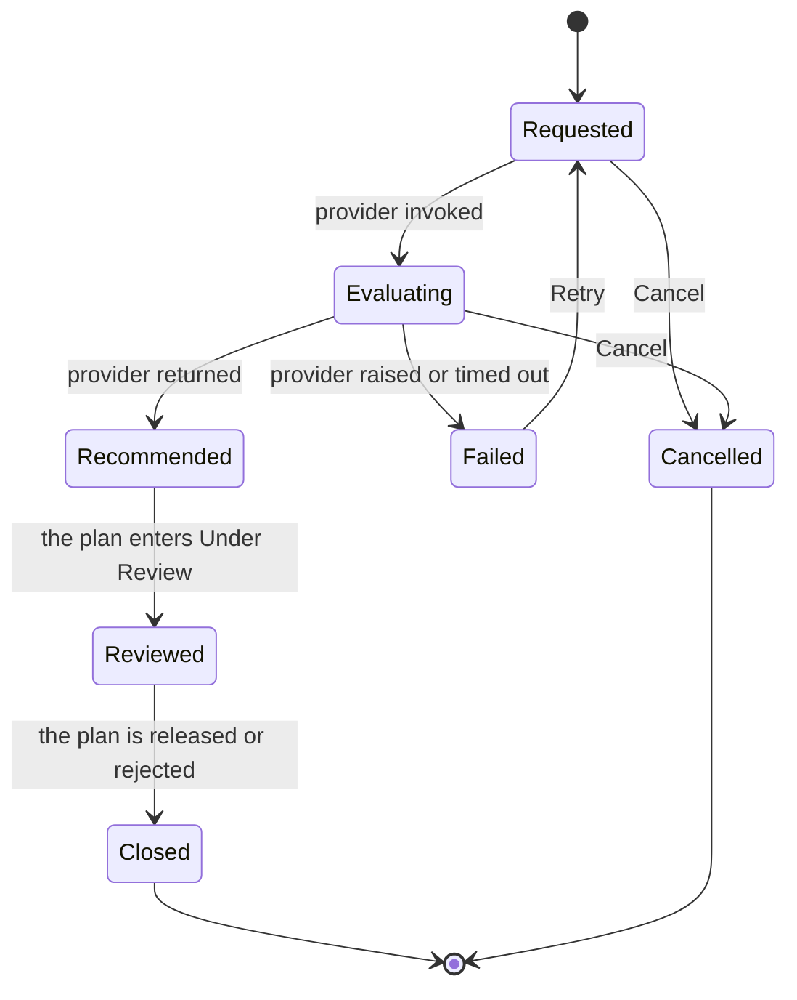

import DocumentInfo from '@site/src/components/DocumentInfo';
import Screenshot from '@site/src/components/Screenshot';

# Planning Runs

<DocumentInfo
  category="User Manual"
  audience={['Planning', 'Operations', 'UAT']}
  status="Draft"
  version="1.0"
  owner="Product Team"
  updated="August 2026"
  readingTime="6 min"
/>

**Role**
Planner. **Replay Request** is Administrator only.

**Navigate to**
`SCOP → Planning → Planning Runs`

## What a planning run is

One **attempt** to build a plan, with everything about that attempt kept:

```text
what was asked   →   who was asked   →   what came back   →   how long it took
```

A Daily Plan is *what we decided to do*. A Planning Run is *how we came to decide it*.

:::info[Why the evidence is kept]

Six weeks later, someone asks why a customer was not served on 25 August.

Without the run, the honest answer is "we do not know — the master data has changed since".
With it, you can see exactly which demands were offered, which vehicles were available, what
their capacities were, and what the provider said about each one.

The request is **value-carrying**: capacities, windows, distances and rates are resolved
into it before the provider is called. So replaying a run uses the inputs it actually had,
not today's.

:::

## The list

<Screenshot
  src="quick-start/14-planning-runs.png"
  alt="SCOP Planning Runs list showing runs with their provider, state and timing."
  caption="One row per attempt."
/>

| Column | Meaning |
| --- | --- |
| **Reference** | The run's identifier |
| **Plan Date** | The day it was planning |
| **Provider** | Baseline or manual |
| **Provider Version** | Which version answered |
| **Status** | Where the run got to |
| **Duration** | How long the provider took |
| **Plan** | The plan it produced |

## The seven states



| State | Meaning |
| --- | --- |
| **Requested** | The run exists; the provider has not been called yet |
| **Evaluating** | The provider is working. The request and its envelope are recorded |
| **Recommended** | An answer came back. The response is recorded and a plan was created |
| **Reviewed** | The resulting plan has entered Under Review |
| **Failed** | The provider raised an error or timed out |
| **Closed** | The resulting plan was released or rejected. **Terminal** |
| **Cancelled** | Withdrawn. **Terminal** |

The run's state follows the plan's. You do not push it along.

## The form

| Tab | Contains |
| --- | --- |
| **Request** | Exactly what the provider was asked, as stored |
| **Response** | Exactly what came back |
| **Rules In Force** | Which business rules were active when this ran |

Plus, in the header: the provider, its version, the timing, and — if it failed — the error
class and message.

:::info[Rules In Force is the one people forget]

Business rules are versioned. "Why was this allowed in March but refused now?" is answered
by comparing this tab across two runs, not by arguing about it.

→ [The Governance Model](../concepts/the-governance-model.mdx)

:::

## The actions

### Retry

| | |
| --- | --- |
| **Available when** | The run is **Failed** |
| **Role** | Planner |
| **What it does** | Returns the run to **Requested** so it can be attempted again |

Fix the cause first. Retrying an unchanged run reproduces the same failure.

### Replay Request

| | |
| --- | --- |
| **Available** | Always |
| **Role** | **Administrator only** |
| **What it does** | Re-executes the stored request against the provider |

This is a diagnostic tool, for answering *"would it do the same thing again?"* — not a way
to regenerate a plan. To plan again, use the wizard.

### Cancel

| | |
| --- | --- |
| **Available when** | The run is **Requested** or **Evaluating** |
| **Role** | Planner |

## When a run fails

The run stops at **Failed** and records:

| Field | Use |
| --- | --- |
| **Error Class** | What kind of failure it was |
| **Error Message** | The detail |

| Error kind | Usual cause | Fix |
| --- | --- | --- |
| Access error | Missing Odoo **Fleet → Administrator** or **Employees → Officer** | [Permissions Reference](../roles/permissions-reference.mdx) |
| Timeout | The timeout was too short, or the run is very large | Raise the timeout, or plan fewer demands |
| Data error | A node or vehicle is missing required data | [Planning Nodes](../configuration/planning-nodes.mdx) |

:::note[A failed run does not create a plan]

Nothing was decided, so there is nothing to review. The demands stay **Eligible for
Planning** and can be included in the next attempt.

:::

## Two runs for one day

Perfectly normal. Each attempt is its own run, and plans are numbered accordingly —
`PLN-2026-08-25-01`, then `-02`.

Runs are never overwritten. That is the point of keeping them.

## Verify

| Check | Where |
| --- | --- |
| The run recorded its request | The **Request** tab |
| It recorded an answer | The **Response** tab |
| It produced a plan | The **Plan** field |
| Which rules were active | The **Rules In Force** tab |
| How long the provider took | The duration in the header |

## If it does not work

| Symptom | Check |
| --- | --- |
| The run is stuck at **Evaluating** | It probably timed out. Look for a **Failed** state after the timeout elapses |
| **Retry** is not offered | The run is not in **Failed** |
| **Replay Request** is not offered | You are not an Administrator |
| The response is empty | Nothing could be planned. Read the unplanned demand |
| The run succeeded but there is no plan | Unusual — check the **Response** tab and raise it |

## Related Pages

- [Generate a Plan](./generate-a-plan.mdx)
- [The Daily Plan](./the-daily-plan.mdx)
- [Unplanned Demand](./unplanned-demand.mdx)
- [Decision Quality](../reporting/decision-quality.mdx)

## Next

[The Daily Plan](./the-daily-plan.mdx).
