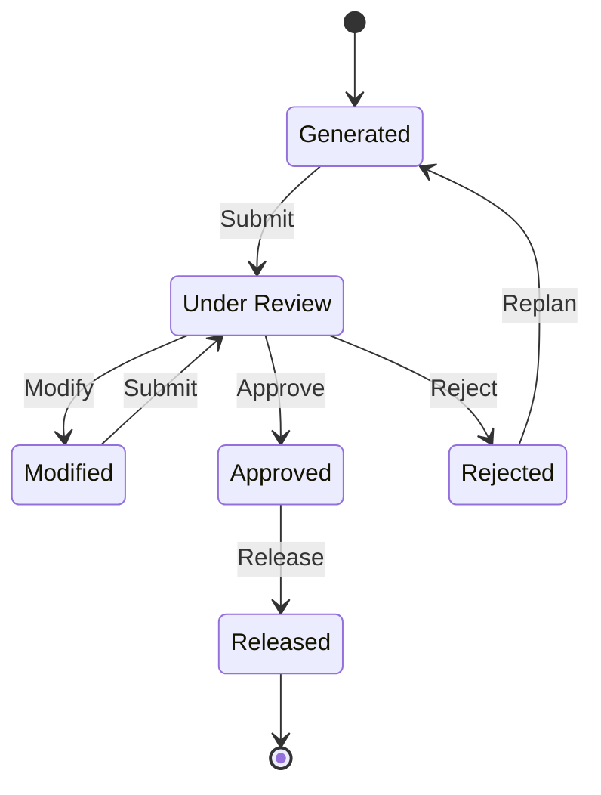

import DocumentInfo from '@site/src/components/DocumentInfo';
import Screenshot from '@site/src/components/Screenshot';

# The Daily Plan

<DocumentInfo
  category="User Manual"
  audience={['Planning', 'Operations', 'UAT']}
  status="Draft"
  version="1.0"
  owner="Product Team"
  updated="August 2026"
  readingTime="8 min"
/>

**Role**
Planner proposes and modifies. **Operations Manager approves and releases.**

**Navigate to**
`SCOP → Planning → Daily Plans`

## What a Daily Plan is

The proposed operating plan for **one day**: a set of trips, the demands they carry, and the
demands they do not.

Its identifier carries the date it plans for — `PLN-2026-08-25-01` is the first plan built
for 25 August 2026.

## The six states

| State | Meaning | Who moves it |
| --- | --- | --- |
| **Generated** | A run produced it. Nobody has looked yet | Planner |
| **Under Review** | Submitted for authorisation | Ops Manager |
| **Modified** | A planner changed the recommendation. **A reason was required** | Planner |
| **Approved** | Authorised. **Frozen** | Ops Manager |
| **Rejected** | Refused. A reason was required | Planner |
| **Released** | Real work. **Terminal** | — |

:::note[Released is terminal]

There is no state after **Released**. From that point the operation lives in its trips.

:::

## The form

<Screenshot
  src="quick-start/16-daily-plan-form.png"
  alt="SCOP Daily Plan form showing the status bar, plan date, trip count, unplanned count, and the Trips tab."
  caption="The plan form. The header counts are the fastest read of plan quality."
/>

### The header

| Field | Meaning |
| --- | --- |
| **Reference** | `PLN-2026-08-25-01` |
| **Plan Date** | The day being planned |
| **Objective Profile** | What it was planned against |
| **Planning Run** | The attempt that produced it |
| **Trip Count** | How many trips |
| **Unplanned Count** | **How many demands did not fit** |
| **Was Modified**, **Modification Count**, **Modified By** | The change record |
| **Created By**, **Approved By**, **Approved At** | The authorisation record |

:::info[Read the unplanned count first]

A plan with four trips and eleven unplanned demands is not a good plan, however tidy the
trips look.

:::

### The four tabs
<Screenshot
  src="user-manual/44-daily-plan-form.png"
  alt="A SCOP daily plan form showing the status bar, trip count, unplanned count and the Trips, Unplanned Demand, Approvals and Recommendation tabs."
  caption="PLN-2026-09-01-01 on b2b: one trip, one unplanned demand. Read the unplanned count before the trips."
/>

| Tab | Contains | Read it to answer |
| --- | --- | --- |
| **Trips** | Every trip, with vehicle, driver, stop count and feasibility | Is this day actually doable? |
| **Unplanned Demand** | What did not fit, and why | What are we choosing not to do? |
| **Approvals** | Who approved, when | Who authorised this? |
| **Recommendation** | The original recommendation, preserved | What did the planner change, and why? |

:::info[The recommendation is preserved even after modification]

When a planner modifies a plan, the original recommendation is kept alongside the change.
That is what [Decision Quality](../reporting/decision-quality.mdx) measures.

The purpose is not to police planners. It is to show where the recommendation is
consistently wrong, so it can be improved.

:::

## Reviewing a plan

Before doing anything, read three things in this order:

| # | Read | Question |
| --- | --- | --- |
| 1 | **Unplanned Demand** tab | What are we not doing today, and is any of it urgent? |
| 2 | **Trips** tab | Is any trip flagged as not capacity-feasible? |
| 3 | **Recommendation** tab | Did a planner change this, and for what stated reason? |

## Submit

| | |
| --- | --- |
| **From → To** | Generated or Modified → Under Review |
| **Role** | Planner |
| **Checks** | None |

<Screenshot
  src="quick-start/18-plan-under-review.png"
  alt="SCOP Daily Plan in state Under Review awaiting approval."
  caption="Under Review. The plan is now waiting for an Operations Manager who did not create it."
/>

## Modify

| | |
| --- | --- |
| **From → To** | Under Review → Modified |
| **Role** | Planner |
| **Checks** | **An override reason is required** |

**What SCOP does**

| Effect | Detail |
| --- | --- |
| Records the reason | From the nine override reason codes |
| Increments the modification count | Visible on the plan and in Decision Quality |
| Records who modified it | **Modified By** |
| **Preserves the recommendation** | The original is kept, not overwritten |

### The nine override reasons

| Reason | Use when |
| --- | --- |
| Operational information unavailable to the engine | You know something the system does not |
| Customer instruction | The customer asked |
| Management instruction | Instructed from above |
| Incorrect master data | The data is wrong and is being fixed |
| Unexpected warehouse condition | Something changed on the floor |
| Driver or vehicle issue | A transport constraint |
| Local route knowledge | You know the ground |
| Service-risk judgment | A deliberate service call |
| Emergency requirement | An emergency |

:::note[Choose the reason that is true]

These are grouped and counted. A planner who always chooses *"Local route knowledge"*
produces a report that says the routing model is wrong, when the real answer might have been
*"Incorrect master data"* — which someone could have fixed.

:::

After modifying, press **Submit** again to send it back for review.

## Reject

| | |
| --- | --- |
| **From → To** | Under Review → Rejected |
| **Role** | Ops Manager |
| **Checks** | **A rejection reason is required** |

Use it when the plan is wrong in a way that modification cannot repair. The planner then
presses **Replan**.

## Replan

| | |
| --- | --- |
| **From → To** | Rejected → Generated |
| **Role** | Planner |
| **What it does** | Requests a **new planning run** |

## Approve and Release

Both belong to the Operations Manager, and both are governed by `BR-PLN-001`.

:::danger[The plan's author cannot approve or release it]

Including an Administrator. This is separation of duties, and it outranks every
administrative right in the system.

→ [Plan Governance](./plan-governance.mdx)

:::

<Screenshot
  src="quick-start/20-plan-approved.png"
  alt="SCOP Daily Plan in state Approved showing the approver and approval time."
  caption="Approved. The plan is frozen and records who authorised it."
/>

### What Release does
<Screenshot
  src="user-manual/80-plan-approved-released.png"
  alt="A SCOP daily plan in the Released state showing Approved By, Approved At and the trip it released."
  caption="PLN-2026-09-01-01 after an Operations Manager approved and released it. Approved By names a different person from Created By — that is BR-PLN-001 satisfied, not bypassed."
/>

<Screenshot
  src="quick-start/21-plan-released.png"
  alt="SCOP Daily Plan in state Released."
  caption="Released. From here the operation lives in the trips."
/>

| Effect | Result |
| --- | --- |
| Trips → **Released** | They become visible to their drivers in **My Trips** |
| Demands → **Released** | Committed to today |
| Resource assignments → **reserved** | The vehicles and drivers are held |
| **Loading tasks created** | One per shipment on each trip |

That last one is the moment the warehouse gets its work. See
[Loading Operations](../execution/loading-operations.mdx).

## The frozen approved plan

Once approved, the plan's content is the **authorised version of the day**. It is not
edited afterwards.

If the day changes after approval, the change is made on the **trip**, and the trip carries
its own approval and its own record of what happened.

## Verify

| Check | Where | Expect |
| --- | --- | --- |
| The plan is released | The status bar | **Released** |
| Who approved it | **Approved By** and **Approved At** | A person who is not the author |
| Trips are released | The **Trips** tab | State **Released** |
| Demands are released | `Operations → Demands` | State **Released** |
| Loading tasks exist | `Operations → Loading Tasks` | One per shipment on each trip |
| Vehicles are held | `Operations → Resource Assignments` | State **reserved** |

## If it does not work

| Symptom | Cause |
| --- | --- |
| **Approve** is not offered | The plan is not **Under Review** |
| **Approve** is refused with a separation-of-duties message | You created this plan |
| **Approve** is refused for another reason | You are not an Operations Manager |
| **Modify** is refused | You did not choose an override reason |
| **Reject** is refused | You did not choose a rejection reason |
| **Release** is refused | A trip carries a blocking finding — `BR-PLN-002` |
| Released, but no loading tasks | See [Loading Tasks Missing](../troubleshooting/execution-problems.mdx) |
| Released, but the driver sees nothing | The trip has no driver assigned |

## Related Pages

- [Plan Governance](./plan-governance.mdx)
- [Planning Runs](./planning-runs.mdx)
- [Unplanned Demand](./unplanned-demand.mdx)
- [Trips](../execution/trips.mdx)
- [Decision Quality](../reporting/decision-quality.mdx)

## Next

[Plan Governance](./plan-governance.mdx).
