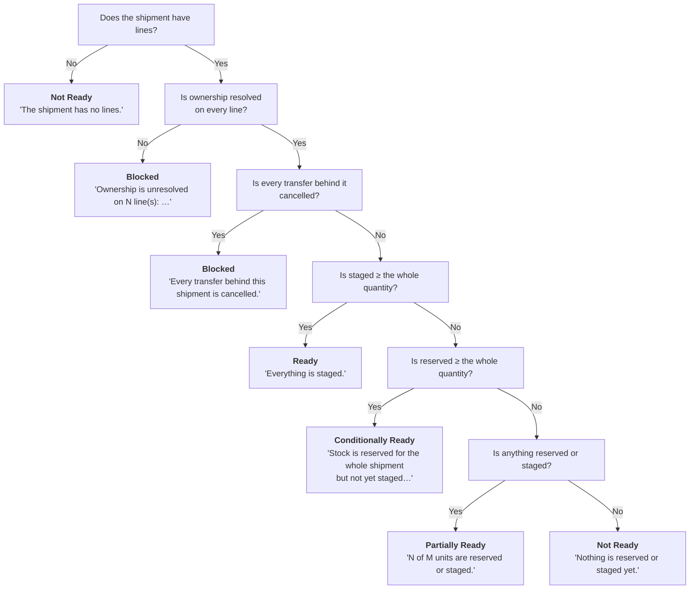

import DocumentInfo from '@site/src/components/DocumentInfo';
import Screenshot from '@site/src/components/Screenshot';

# Warehouse Readiness

<DocumentInfo
  category="User Manual"
  audience={['Warehouse', 'Planning', 'Operations', 'UAT']}
  status="Draft"
  version="1.0"
  owner="Product Team"
  updated="August 2026"
  readingTime="9 min"
/>

:::info[This is the canonical page for the five readiness states]

Other chapters refer here rather than restating it.

:::

**Role**
Warehouse owns it. Planner depends on it.

**Navigate to**
`SCOP → Operations → Warehouse Readiness`

## What readiness answers

One question: **can this shipment actually go, and why?**

And it always carries its reasoning **in words**, so a planner asking *"why is this not
ready"* has an answer without asking anybody.

## It is computed, never typed

Readiness is the answer to a question the database already knows: are the transfers
reserved, is the stock allocated, is it staged, is ownership resolved.

:::warning[There is no readiness field to fill in]

A readiness value an operator typed would go stale the moment anything moved. Readiness sits
on the boundary between the warehouse and planning, and a stale value there sends a vehicle
to collect goods that are not there.

The one exception is the **supervisor override**, which is recorded, attributed, and shown
beside the computation rather than replacing it.

:::

## The five states

| Readiness | What it means | Plannable? |
| --- | --- | --- |
| **Ready** | Everything is staged | **Yes** |
| **Conditionally Ready** | Stock is reserved for the whole shipment but not yet staged, so it is expected to be available before execution | **Yes** |
| **Partially Ready** | Only part of the shipment can be covered | No |
| **Not Ready** | The goods are not prepared, or the shipment has no lines | No |
| **Blocked** | Something must be fixed first | No |

<Screenshot
  src="user-manual/97-readiness-all-states.png"
  alt="The SCOP Warehouse Readiness list showing Ready, Conditionally Ready, Partially Ready and Blocked shipments with an Is Plannable column."
  caption="Four states side by side on b2b. Is Plannable is unticked for Partially Ready and Blocked, and ticked for the other two — the whole rule, in one column."
/>

All five were reproduced on `b2b` for this manual, each with the evidence it wrote:

| State | Evidence, verbatim | Plannable |
| --- | --- | --- |
| **Ready** | *"Everything is staged."* | **Yes** |
| **Conditionally Ready** | *"Stock is reserved for the whole shipment but not yet staged, so it is expected to be available before execution."* | **Yes** |
| **Partially Ready** | *"4.0 of 10.0 units are reserved or staged."* | No |
| **Not Ready** | *"Nothing is reserved or staged yet."* | No |
| **Blocked** — ownership | *"Ownership is unresolved on 1 line(s): [QS-DEMO-01] QS Demo Chilled Box 10kg."* | No |
| **Blocked** — cancelled | *"Every transfer behind this shipment is cancelled."* | No |

:::info[Why Conditionally Ready counts as plannable]

Because that is what the value *means* — expected to become available before execution.
Excluding it would make the classification decorative, and would stop a warehouse planning
work it has every intention of preparing.

:::

<Screenshot
  src="user-manual/98-readiness-blocked-form.png"
  alt="A blocked SCOP warehouse readiness record showing the computed state, the evidence sentence, an unticked Is Plannable box and the empty override section."
  caption="A Blocked record on b2b. The evidence names the cause, and the chatter below records readiness moving in both directions as the evidence changed."
/>

<Screenshot
  src="user-manual/99-readiness-partial-form.png"
  alt="A partially ready SCOP warehouse readiness record showing the evidence sentence counting reserved units against the total."
  caption="Partially Ready counts the units. Is Plannable is unticked — the demand can be eligible while its shipment cannot be planned."
/>

## The order the tests run in

The **order matters more than the individual tests**. SCOP evaluates them top to bottom and
stops at the first match.

:::warning[Blocked is tested before any quantity]

A shipment whose owner is unresolved is **not** "partially ready" — it is not plannable at
all.

Testing ownership first is what stops a well-prepared pallet from masking a legal problem.

:::

## Reading the evidence

The **Evidence** field states the computation's reasoning verbatim. These are the exact
messages:

| Evidence reads | State | What to do |
| --- | --- | --- |
| *"The shipment has no lines."* | Not Ready | Investigate why the shipment is empty |
| *"Ownership is unresolved on N line(s): …"* | **Blocked** | [Correct the ownership](../ownership/correcting-ownership.mdx). The products are named |
| *"Every transfer behind this shipment is cancelled."* | **Blocked** | The movement is not happening. Cancel the shipment |
| *"Everything is staged."* | Ready | Nothing |
| *"Stock is reserved for the whole shipment but not yet staged…"* | Conditionally Ready | Stage it when convenient. It can already be planned |
| *"N of M units are reserved or staged."* | Partially Ready | Reserve or stage the rest |
| *"Nothing is reserved or staged yet."* | Not Ready | Reserve the stock in Odoo |

## What "reserved" is read from

Readiness reads **Odoo's move lines directly** — what the warehouse has actually reserved
right now.

:::note[Readiness and allocation read different things]

**Allocation** is a projection, refreshed only when a demand is validated or made eligible.

**Readiness** reads Odoo now. If it asked the projection instead, it would be measuring when
the projection last ran rather than what is in the warehouse.

So changing a reservation in Odoo moves readiness immediately, and allocation not until the
next gate.

:::

## The readiness list and form
<Screenshot
  src="user-manual/04-warehouse-readiness-list.png"
  alt="The SCOP Warehouse Readiness list showing computed state, override, effective readiness and the plannable flag."
  caption="One row per shipment, with the computed value and any override shown side by side."
/>

<Screenshot
  src="quick-start/11-warehouse-readiness-list.png"
  alt="SCOP Warehouse Readiness list showing one shipment with readiness Ready."
  caption="One row per shipment, with the readiness state and the node preparing the goods."
/>

| Column | Meaning |
| --- | --- |
| **Shipment** | Which shipment this readiness is for |
| **Location** | The node preparing the goods |
| **Computed** | What the evidence says |
| **Override** | What a supervisor said instead, if anything |
| **Readiness** | The effective value — override if present, otherwise computed |
| **Plannable** | Whether planning may use it |

<Screenshot
  src="quick-start/12-warehouse-readiness-form.png"
  alt="SCOP Warehouse Readiness form showing computed state, override state, evidence text, and the plannable flag."
  caption="The readiness record. Evidence explains the computation in plain words."
/>

Each shipment has exactly **one** readiness record.
<Screenshot
  src="user-manual/91-readiness-ready-and-conditional.png"
  alt="The SCOP Warehouse Readiness list showing one shipment Ready and another Conditionally Ready, each with its evidence."
  caption="Two readiness states side by side on b2b. Both are plannable; the difference is whether the goods are staged yet."
/>

## Staging

**Role** Warehouse
**Navigate to** `SCOP → Operations → Shipments` → open the shipment
**What to do** Click **Stage Everything**

Use it when the goods for the **whole shipment** are physically picked and standing in the
staging area ready to load. It is a shortcut for confirming line by line — so use it only
when that is actually true.

| What SCOP does | Result |
| --- | --- |
| Marks every shipment line staged | Staged quantity equals shipment quantity |
| Recomputes readiness | Usually **Ready**, evidence *"Everything is staged."* |
<Screenshot
  src="user-manual/93-shipment-staged.png"
  alt="A SCOP shipment form after Stage Everything, showing every line staged and readiness Ready."
  caption="SHP-2026-000007 after Stage Everything: every line staged, readiness Ready, evidence 'Everything is staged.'"
/>

You cannot stage more than the shipment asks for. SCOP rejects it.

:::note[Staging is a state, not a document]

You are recording that the goods are prepared. No new record is created.

:::

### Refresh Readiness

**Refresh Readiness** recomputes from current evidence, without changing anything. Use it
when you have changed something in Odoo and want to see the effect.

It is always available, to anybody who can open the shipment.

## The supervisor override

A supervisor standing in the warehouse can see things the database cannot — a pallet already
on the dock that Odoo has not caught up with, or a customer who has just refused a delivery.

| Field | Purpose |
| --- | --- |
| **Override Readiness** | The state you are asserting instead |
| **Override Reason** | **Required.** Chosen from the override reason codes |
| **Override By** / **Override At** | Recorded automatically |

### Applying one

1. Open the readiness record.
2. Set **Override Readiness** to the state you are asserting.
3. Choose an **Override Reason**.
4. Press **Apply Override**.

Both fields are required. SCOP refuses an override with no state — and refuses one with no
reason, because it outranks the evidence and therefore has to say why.

### Clearing one

Press **Clear Override**. Readiness returns to the computed value immediately.

:::info[The override never hides what it overrode]

The computed value stays visible beside the override. An override that concealed the
computation would make the computation unauditable, which is worse than not having it at all.

:::

### The nine override reasons

| Reason | Typical use |
| --- | --- |
| Operational information unavailable to the engine | The system does not know what you can see |
| Unexpected warehouse condition | Something changed on the floor |
| Incorrect master data | The data is wrong and is being fixed |
| Customer instruction | The customer asked |
| Management instruction | Instructed from above |
| Driver or vehicle issue | A transport problem |
| Local route knowledge | You know the ground |
| Service-risk judgment | A deliberate service call |
| Emergency requirement | An emergency |

:::warning[An override is auditable and attributed]

Who applied it, when, and why are all recorded and tracked. Use it when you genuinely know
better than the evidence — not to get past a block you should fix.

In particular, overriding a **Blocked** readiness caused by unresolved ownership does not
resolve the ownership. `BR-INV-002` will still refuse to validate the demand.

:::

## What readiness controls

| Readiness | Effect |
| --- | --- |
| **Ready** or **Conditionally Ready** | The shipment is **plannable**. Its state can reach **Ready** |
| **Partially Ready** | A demand can still become **Eligible for Planning**, but the shipment is **not plannable** |
| **Not Ready** or **Blocked** | The demand cannot even become eligible |

:::warning[Partially Ready is the confusing one]

It lets a demand become eligible, but it does **not** make the shipment plannable.

A demand sitting at **Eligible for Planning** that never appears in a plan is very often
this. Check the shipment's readiness, not the demand's state.

:::

## Verify

| Check | Where | Expect |
| --- | --- | --- |
| The readiness state | `Operations → Warehouse Readiness` | The value you expect |
| Why | The **Evidence** field | A sentence explaining it |
| Whether planning can use it | The **Plannable** flag | True for Ready and Conditionally Ready |
| Effect on the shipment | The shipment's status | **Ready** once plannable |

## If it does not work

| Symptom | Check |
| --- | --- |
| Stays **Blocked** | Ownership unresolved on one or more lines — the evidence names the products |
| Stays **Blocked**, ownership looks fine | Every transfer behind the shipment is cancelled |
| Stays **Not Ready** | The shipment has no lines, or nothing is reserved in Odoo |
| Stuck at **Partially Ready** | Only part of the quantity is reserved or staged |
| **Stage Everything** does nothing visible | Press **Refresh Readiness** |
| **Stage Everything** is not offered | You are not a Warehouse user, or the shipment is past **Ready** |
| Staging is rejected | You cannot stage more than the shipment asks for |
| Readiness went **backwards** | Correct — a reservation was removed or a transfer cancelled |
| Staged % shows `10000%` | Known display defect — see [Release 1 Scope](../about/release-1-scope.mdx) |

## Related Pages

- [Shipment Management](../shipments/shipment-management.mdx)
- [Inventory Ownership](../ownership/inventory-ownership.mdx)
- [Planning Eligibility](../demand/planning-eligibility.mdx)
- [Readiness and Shipment Problems](../troubleshooting/readiness-and-shipment-problems.mdx)

## Next

[Planning Overview](../planning/planning-overview.mdx).
