import DocumentInfo from '@site/src/components/DocumentInfo';

# Lifecycle Reference

<DocumentInfo
  category="User Manual"
  audience={['Operations', 'Planning', 'Warehouse', 'Management', 'UAT']}
  status="Draft"
  version="1.0"
  owner="Product Team"
  updated="August 2026"
  readingTime="10 min"
/>

## What is on this page

Every **governed lifecycle** in SCOP Release 1, in one place. Twelve state machines across
ten objects.

:::info[These diagrams come from the specification the system enforces]

SCOP holds a single canonical specification of every lifecycle, and the running code is
tested against it. A transition that is not in the specification cannot be performed, and a
transition the code allows but the specification does not fails the build.

So these diagrams are not a description of the system — they are the same source it obeys.

:::

:::warning[The drift test covers states and transitions, not side effects]

The **Transitions with downstream effects** tables below are prose from the same
specification, and prose is not what the drift test compares. A side effect can therefore be
specified and not implemented, and the build still passes.

One is, and it matters: **"follow-up demand created"** — on the trip's
`in_progress → partially_completed`, and on the demand's `in_execution → partially_completed`
and `in_execution → failed` — **does not happen in Release 1**. Nothing writes
`parent_demand_id`, and a demand that is not fully fulfilled never leaves `in_execution`.

Read the side-effect tables on this page as **what is specified**, and
[Demand Completion](../demand/demand-completion.mdx) for what is verified.

:::

## How to read them

| On the diagram | Means |
| --- | --- |
| An arrow with a label | A transition, and what triggers it |
| A state with no outgoing arrow | **Terminal** — nothing leaves it |
| A named button on the label | Somebody presses it |
| Anything else on the label | It happens because something else happened |

:::warning[You cannot set a state directly]

Every governed state moves only through its own transition. Writing a state by hand would
skip the checks that belong to the move, and SCOP refuses it.

:::

---

## Demand

The core operational lifecycle. Twelve states.

**Model** `scop.demand` · **Field** `state` · **12 states** · **17 transitions**

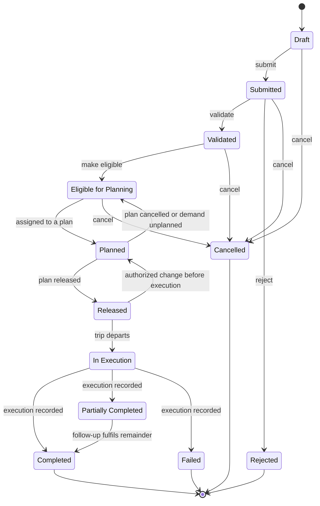

| State | Label | Terminal |
| --- | --- | --- |
| `draft` | **Draft** | No |
| `submitted` | **Submitted** | No |
| `validated` | **Validated** | No |
| `eligible` | **Eligible for Planning** | No |
| `planned` | **Planned** | No |
| `released` | **Released** | No |
| `in_execution` | **In Execution** | No |
| `partially_completed` | **Partially Completed** | No |
| `completed` | **Completed** | **Yes** |
| `failed` | **Failed** | **Yes** |
| `rejected` | **Rejected** | **Yes** |
| `cancelled` | **Cancelled** | **Yes** |

**Gated transitions** — these evaluate business rules before proceeding:

| From → To | Gate | Guard |
| --- | --- | --- |
| submitted → validated | `demand_validate` | ownership resolved on every line |
| validated → eligible | `demand_eligible` | readiness in (ready, conditionally_ready, partially_ready) |

**Transitions with downstream effects:**

| From → To | What else happens |
| --- | --- |
| planned → eligible | scop.unplanned.demand row written |
| in_execution → partially_completed | follow-up demand created |
| in_execution → failed | follow-up demand created |

→ [Demand in full](../demand/demand-lifecycle.mdx)

---

## Demand — Return Sub-Lifecycle

Runs alongside the main lifecycle for demands of type Return.

**Model** `scop.demand` · **Field** `return_state` · **5 states** · **4 transitions**

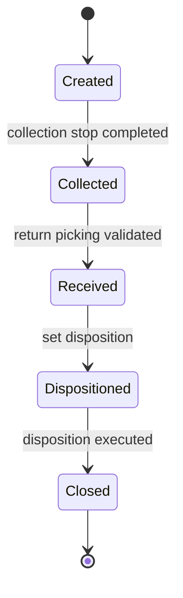

| State | Label | Terminal |
| --- | --- | --- |
| `created` | **Created** | No |
| `collected` | **Collected** | No |
| `received` | **Received** | No |
| `dispositioned` | **Dispositioned** | No |
| `closed` | **Closed** | **Yes** |

→ [Demand in full](../demand/demand-completion.mdx)

---

## Shipment

The plannable transport requirement. Can move backwards when readiness regresses.

**Model** `scop.shipment` · **Field** `state` · **6 states** · **9 transitions**

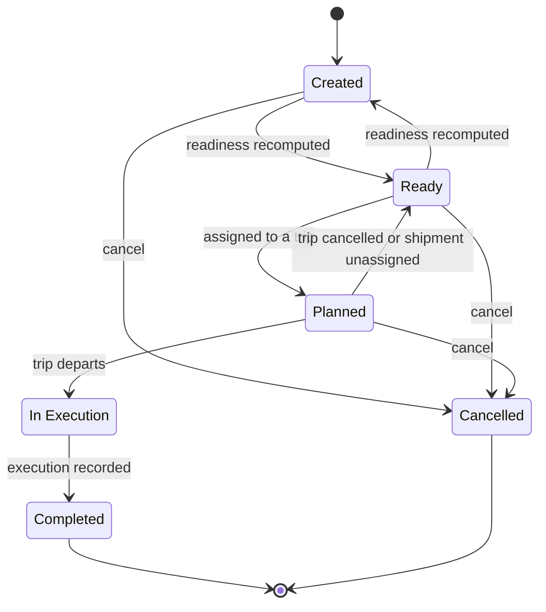

| State | Label | Terminal |
| --- | --- | --- |
| `created` | **Created** | No |
| `ready` | **Ready** | No |
| `planned` | **Planned** | No |
| `in_execution` | **In Execution** | No |
| `completed` | **Completed** | **Yes** |
| `cancelled` | **Cancelled** | **Yes** |

→ [Shipment in full](../shipments/shipment-management.mdx)

---

## Daily Plan

Governed by BR-PLN-001 and BR-PLN-002. Released is terminal.

**Model** `scop.plan` · **Field** `state` · **6 states** · **7 transitions**

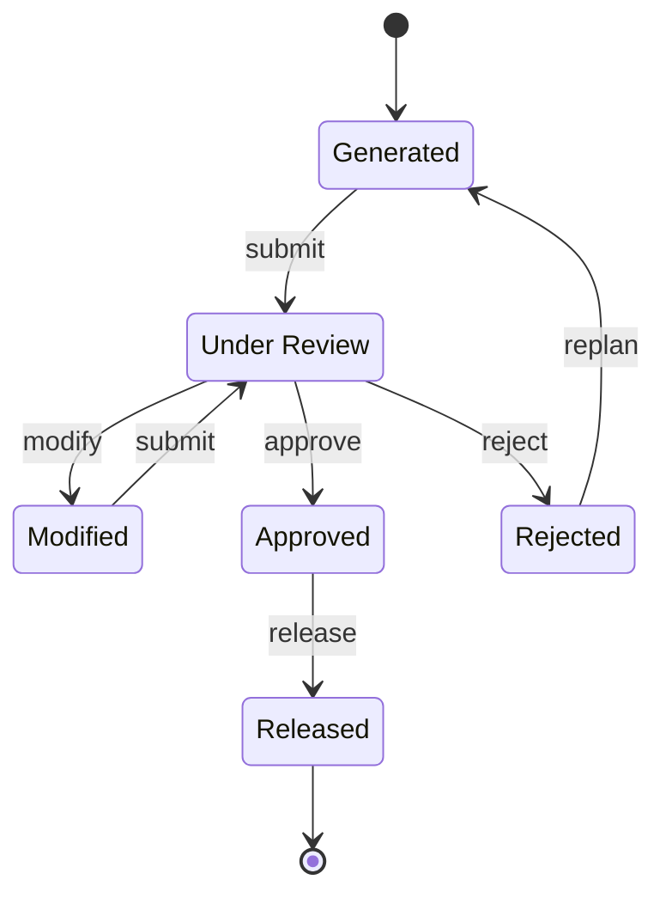

| State | Label | Terminal |
| --- | --- | --- |
| `generated` | **Generated** | No |
| `under_review` | **Under Review** | No |
| `modified` | **Modified** | No |
| `approved` | **Approved** | No |
| `rejected` | **Rejected** | No |
| `released` | **Released** | **Yes** |

**Gated transitions** — these evaluate business rules before proceeding:

| From → To | Gate | Guard |
| --- | --- | --- |
| under_review → approved | `plan_approve` | no failed_blocking finding; approver != create_uid (BR-PLN-001); scop.approval.authority.forbid_self_approval honoured |
| approved → released | `plan_release` | authority check(release) |

**Transitions with downstream effects:**

| From → To | What else happens |
| --- | --- |
| under_review → approved | scop.plan.approval row written |
| under_review → modified | modification_count += 1; modified_by set; recommended_snapshot preserved |
| approved → released | trips -> released; demands -> released; resource assignments -> reserved |
| rejected → generated | a new scop.plan.run is requested |

→ [Daily Plan in full](../planning/the-daily-plan.mdx)

---

## Planning Run

One attempt to build a plan. Follows the plan it produced.

**Model** `scop.plan.run` · **Field** `state` · **7 states** · **8 transitions**

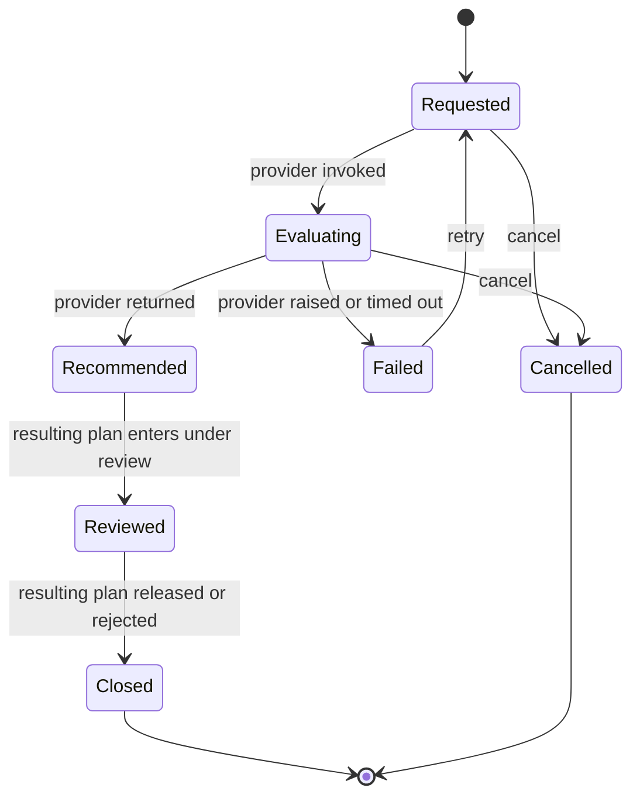

| State | Label | Terminal |
| --- | --- | --- |
| `requested` | **Requested** | No |
| `evaluating` | **Evaluating** | No |
| `recommended` | **Recommended** | No |
| `reviewed` | **Reviewed** | No |
| `failed` | **Failed** | No |
| `closed` | **Closed** | **Yes** |
| `cancelled` | **Cancelled** | **Yes** |

**Transitions with downstream effects:**

| From → To | What else happens |
| --- | --- |
| requested → evaluating | request_json and the 12-field envelope written |
| evaluating → recommended | response_json written; scop.plan created in state generated |
| evaluating → failed | error_class and error_message set |

→ [Planning Run in full](../planning/planning-runs.mdx)

---

## Trip

Thirteen states. The first six are driven by the daily plan.

**Model** `scop.trip` · **Field** `state` · **13 states** · **22 transitions**

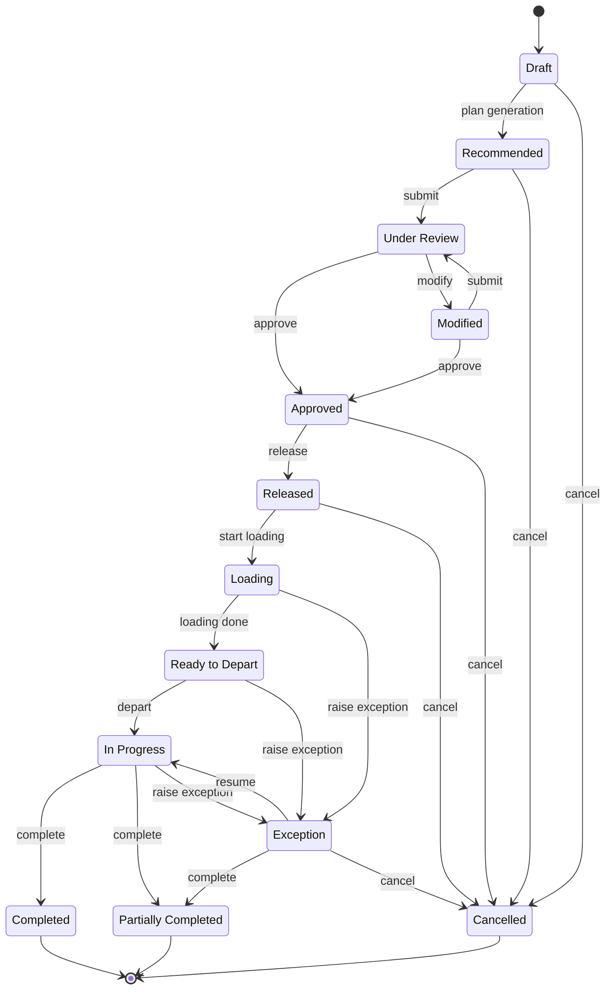

| State | Label | Terminal |
| --- | --- | --- |
| `draft` | **Draft** | No |
| `recommended` | **Recommended** | No |
| `under_review` | **Under Review** | No |
| `modified` | **Modified** | No |
| `approved` | **Approved** | No |
| `released` | **Released** | No |
| `loading` | **Loading** | No |
| `ready_to_depart` | **Ready to Depart** | No |
| `in_progress` | **In Progress** | No |
| `exception` | **Exception** | No |
| `completed` | **Completed** | **Yes** |
| `partially_completed` | **Partially Completed** | **Yes** |
| `cancelled` | **Cancelled** | **Yes** |

**Gated transitions** — these evaluate business rules before proceeding:

| From → To | Gate | Guard |
| --- | --- | --- |
| under_review → approved | `trip_approve` | no failed_blocking finding |
| modified → approved | `trip_approve` | no failed_blocking finding |
| approved → released | `trip_release` | authority check(release) |
| loading → ready_to_depart | `trip_depart` | — |

**Transitions with downstream effects:**

| From → To | What else happens |
| --- | --- |
| approved → released | resource assignments -> committed |
| approved → cancelled | resource assignments -> cancelled |
| released → cancelled | resource assignments -> cancelled |
| loading → ready_to_depart | loads -> loaded |
| loading → exception | scop.service.exception invoked |
| ready_to_depart → in_progress | actual_start set; loads -> in_transit; demands -> in_execution |
| ready_to_depart → exception | scop.service.exception invoked |
| in_progress → completed | actual_end set; resource assignments -> closed; loads -> closed |
| in_progress → partially_completed | actual_end set; resource assignments -> closed; loads -> closed; follow-up demand created per failed line |
| in_progress → exception | scop.service.exception invoked |
| exception → partially_completed | actual_end set; resource assignments -> closed |
| exception → cancelled | resource assignments -> cancelled |

→ [Trip in full](../execution/trip-lifecycle.mdx)

---

## Stop — Status

Where the physical visit has got to.

**Model** `scop.trip.stop` · **Field** `status` · **6 states** · **7 transitions**

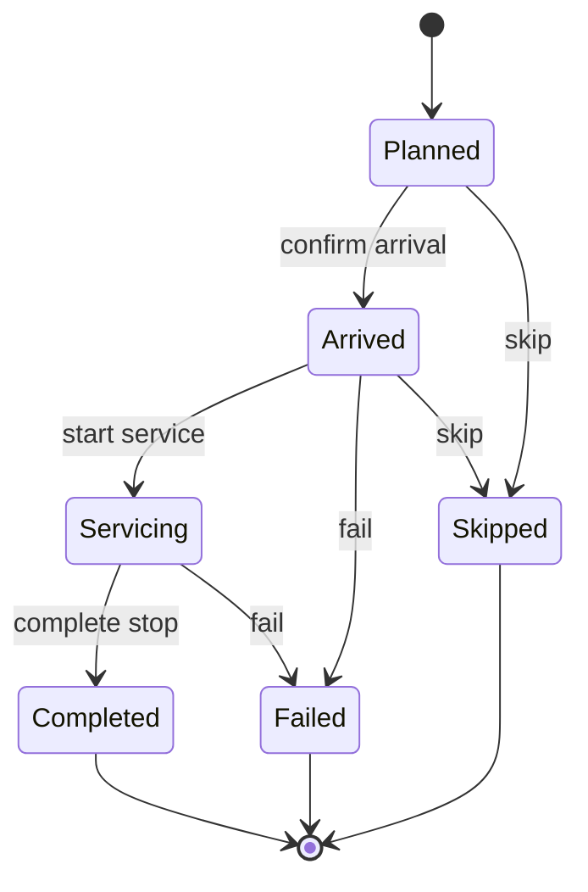

| State | Label | Terminal |
| --- | --- | --- |
| `planned` | **Planned** | No |
| `arrived` | **Arrived** | No |
| `servicing` | **Servicing** | No |
| `completed` | **Completed** | **Yes** |
| `failed` | **Failed** | **Yes** |
| `skipped` | **Skipped** | **Yes** |

**Gated transitions** — these evaluate business rules before proceeding:

| From → To | Gate | Guard |
| --- | --- | --- |
| servicing → completed | `stop_complete` | every line has actual_qty derived from the picking |

**Transitions with downstream effects:**

| From → To | What else happens |
| --- | --- |
| planned → arrived | actual_arrival set; scop.execution.event written |
| planned → skipped | outcome := skipped |
| arrived → servicing | actual_service_start set; scop.execution.event written |
| arrived → failed | outcome := failed |
| arrived → skipped | outcome := skipped |
| servicing → completed | actual_departure set; outcome := completed or partially_completed; scop.execution.event written |
| servicing → failed | outcome := failed |

→ [Stop in full](../execution/stops.mdx)

---

## Stop — Outcome

How the visit turned out. A classification, not a lifecycle — every value is terminal and none transitions to another.

**Model** `scop.trip.stop` · **Field** `outcome` · **5 states** · **0 transitions**

:::note[No diagram, because there is no machine]

`outcome` is a **value set**, not a lifecycle. Every value is terminal and none leads to
another: a stop is given exactly one outcome, once, derived from what actually moved.

Drawing it as a state diagram would imply transitions between outcomes that do not exist.

:::

The outcome is **derived, not chosen**. A driver who delivered three of five cartons has
already recorded that on the Odoo transfer; asking them to also classify the visit would
invite the two answers to disagree.

| State | Label | Terminal |
| --- | --- | --- |
| `completed` | **Completed** | **Yes** |
| `partially_completed` | **Partially Completed** | **Yes** |
| `failed` | **Failed** | **Yes** |
| `skipped` | **Skipped** | **Yes** |
| `rescheduled` | **Rescheduled** | **Yes** |

→ [Stop in full](../execution/stops.mdx)

---

## Load

What is physically on the vehicle. Moves largely on its own.

**Model** `scop.load` · **Field** `state` · **8 states** · **10 transitions**

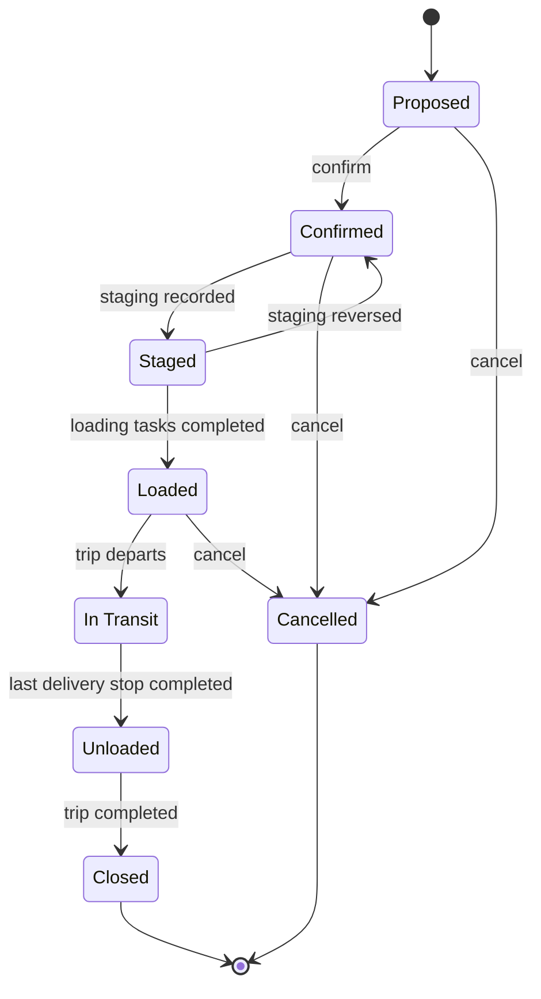

| State | Label | Terminal |
| --- | --- | --- |
| `proposed` | **Proposed** | No |
| `confirmed` | **Confirmed** | No |
| `staged` | **Staged** | No |
| `loaded` | **Loaded** | No |
| `in_transit` | **In Transit** | No |
| `unloaded` | **Unloaded** | No |
| `closed` | **Closed** | **Yes** |
| `cancelled` | **Cancelled** | **Yes** |

**Gated transitions** — these evaluate business rules before proceeding:

| From → To | Gate | Guard |
| --- | --- | --- |
| proposed → confirmed | `load_confirm` | capacity feasible at every stop of the sequence |

**Transitions with downstream effects:**

| From → To | What else happens |
| --- | --- |
| staged → confirmed | is_staged cleared |

→ [Load in full](../execution/loading-operations.mdx)

---

## Exception

Ten states, from detection to closure.

**Model** `scop.exception` · **Field** `state` · **10 states** · **10 transitions**

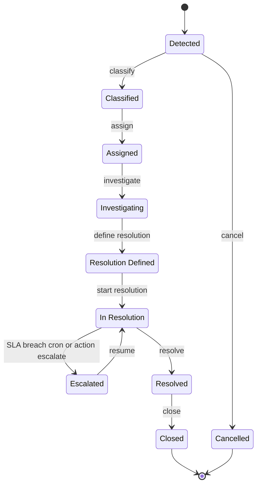

| State | Label | Terminal |
| --- | --- | --- |
| `detected` | **Detected** | No |
| `classified` | **Classified** | No |
| `assigned` | **Assigned** | No |
| `investigating` | **Investigating** | No |
| `resolution_defined` | **Resolution Defined** | No |
| `in_resolution` | **In Resolution** | No |
| `escalated` | **Escalated** | No |
| `resolved` | **Resolved** | No |
| `closed` | **Closed** | **Yes** |
| `cancelled` | **Cancelled** | **Yes** |

**Transitions with downstream effects:**

| From → To | What else happens |
| --- | --- |
| detected → classified | sla_deadline computed from category |
| classified → assigned | mail.activity created |
| in_resolution → escalated | escalation_count += 1; escalated_at set; notify responsible_group_id |

→ [Exception in full](../exceptions/exception-management.mdx)

---

## Business Rule

How a policy is proposed, approved, scheduled and retired. Administrator-facing.

**Model** `scop.business.rule` · **Field** `state` · **11 states** · **15 transitions**

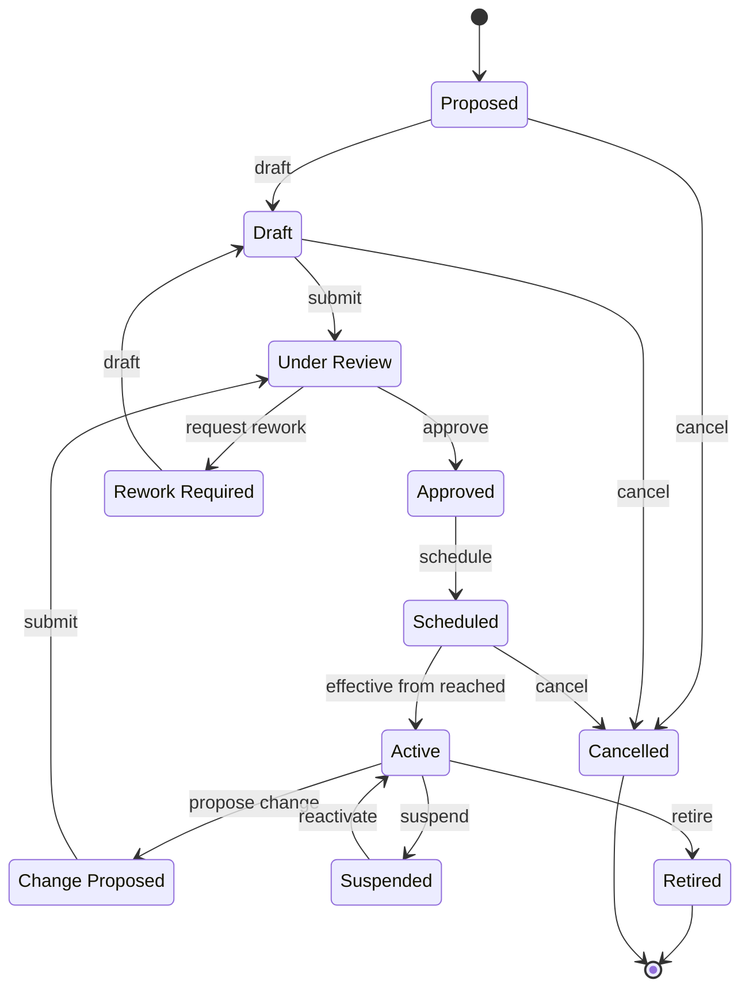

| State | Label | Terminal |
| --- | --- | --- |
| `proposed` | **Proposed** | No |
| `draft` | **Draft** | No |
| `under_review` | **Under Review** | No |
| `approved` | **Approved** | No |
| `rework_required` | **Rework Required** | No |
| `scheduled` | **Scheduled** | No |
| `active` | **Active** | No |
| `change_proposed` | **Change Proposed** | No |
| `suspended` | **Suspended** | No |
| `retired` | **Retired** | **Yes** |
| `cancelled` | **Cancelled** | **Yes** |

**Transitions with downstream effects:**

| From → To | What else happens |
| --- | --- |
| scheduled → active | supersedes_rule_id -> retired |
| active → change_proposed | a new record is created with the same code and a new version |
| active → suspended | evaluations return 'suspended' without calling the predicate |

→ [Business Rule in full](./business-rules.mdx)

---

## Execution Event

A recorded physical fact, validated then reconciled against the picking. Administrator-facing.

**Model** `scop.execution.event` · **Field** `state` · **3 states** · **2 transitions**

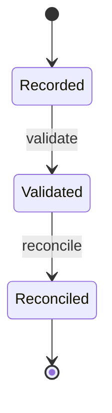

| State | Label | Terminal |
| --- | --- | --- |
| `recorded` | **Recorded** | No |
| `validated` | **Validated** | No |
| `reconciled` | **Reconciled** | **Yes** |

→ [Execution Event in full](../concepts/identity-and-traceability.mdx)

---

## Not governed lifecycles

Two status fields look like lifecycles and are not. Do not draw them as governed state
machines.

### Loading Task — Status

A plain status field with no gate on any move.

```text
Pending  →  In Progress  →  Done
                ↓
            Cancelled
```

| Status | Set by |
| --- | --- |
| **Pending** | Created with the trip release |
| **In Progress** | **Start** |
| **Done** | **Done** |
| **Cancelled** | **Cancel** |

→ [Loading Operations](../execution/loading-operations.mdx)

### Warehouse Readiness

**Computed from evidence**, not transitioned by anybody. It can move in either direction as
the evidence changes, including backwards.

| Readiness | Plannable |
| --- | --- |
| **Ready** | **Yes** |
| **Conditionally Ready** | **Yes** |
| **Partially Ready** | No |
| **Not Ready** | No |
| **Blocked** | No |

The one thing a person can do is apply a **supervisor override**, which is recorded beside
the computed value rather than replacing it.

→ [Warehouse Readiness](../readiness/warehouse-readiness.mdx)

---

## Where the lifecycles meet

The chain that carries an operation from a plan to a closed demand, without anybody pushing
a state by hand:

```text
Plan released       →  Trips released
                    →  Demands released
                    →  Resource assignments reserved
                    →  Loading tasks created

Loading started     →  Trip Loading
Loading finished    →  Trip Ready to Depart      →  Loads Loaded

Trip departs        →  Loads In Transit
                    →  Shipments In Execution
                    →  Demands In Execution

Last stop closed    →  Trip Completed or Partially Completed
                    →  Loads Closed
                    →  Shipments Completed
                    →  Demands Completed / Partially Completed / Failed
                    →  Resource assignments closed
                    →  Follow-up demands created for what failed
```

:::info[If something is stuck, look upstream]

Nobody moves shipments or demands through their states by hand. If one is stuck, the cause
is almost always earlier in this chain — most often an **unvalidated Odoo transfer**.

→ [Odoo Delivery Validation](../execution/odoo-delivery-validation.mdx)

:::

## Related Pages

- [Status Glossary](./status-glossary.mdx) — every state label in one line
- [Business Rules](./business-rules.mdx) — what the gates evaluate
- [The Object Model](../concepts/the-object-model.mdx)
- [The Governance Model](../concepts/the-governance-model.mdx)
