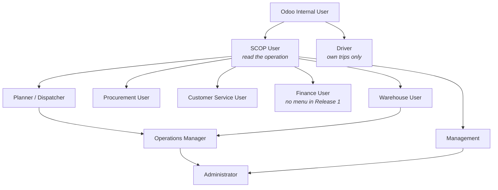
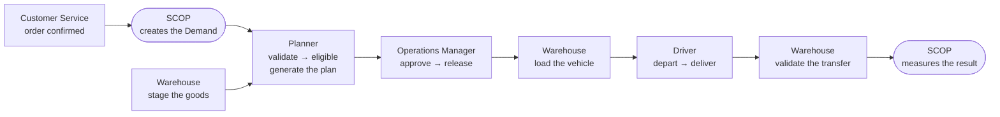

import DocumentInfo from '@site/src/components/DocumentInfo';

# Roles Overview

<DocumentInfo
  category="User Manual"
  audience={['Operations', 'Management', 'Planning', 'UAT']}
  status="Draft"
  version="1.0"
  owner="Product Team"
  updated="August 2026"
  readingTime="7 min"
/>

## The ten roles

SCOP ships ten roles. Eight of them are operational, one is administrative, and one is a
placeholder.

| Role | One-line responsibility | Page |
| --- | --- | --- |
| **SCOP User** | Read the operation. The base every other operational role builds on | — |
| **Customer Service User** | Own the customer promise and the requirement behind it | [Customer Service](./customer-service.mdx) |
| **Warehouse User** | Make the goods ready, load them, validate what moved | [Warehouse](./warehouse.mdx) |
| **Planner / Dispatcher** | Build the day, assign vehicles and drivers | [Planner / Dispatcher](./planner-dispatcher.mdx) |
| **Operations Manager** | Approve and release the plan. Own exceptions | [Operations Manager](./operations-manager.mdx) |
| **Driver** | Execute the trip and record what happened | [Driver](./driver.mdx) |
| **Procurement User** | Own supplier commitments | [Procurement](./procurement.mdx) |
| **Management** | Read performance. Change nothing | [Management](./management.mdx) |
| **Administrator** | Configure scope, nodes, authorities. Diagnose | [Administrator](./administrator.mdx) |
| **Finance User** | *No menu in Release 1* | [Release 1 Scope](../about/release-1-scope.mdx) |

## How the roles inherit

A role in SCOP is a group, and most groups build on **SCOP User**. Giving someone
`Operations Manager` therefore also gives them everything `Planner` and `Warehouse` have.

:::warning[Driver does not inherit SCOP User]

**Driver is deliberately outside the ladder.** It builds directly on the Odoo internal
user and gains nothing from SCOP User.

That is the whole basis of the driver security model: a driver cannot read demands,
shipments, plans, readiness or governance, because no group they hold grants it. Adding
`SCOP User` to a driver would quietly undo that.

See [Driver Security Model](../execution/driver-security-model.mdx).

:::

## Who hands work to whom

One operating cycle passes through five hands.

The full worked version is [Standard Full Delivery](../scenarios/standard-full-delivery.mdx).

## Why approval is separated from creation

The single most important governance property in SCOP:

:::danger[The person who creates a plan cannot approve it]

`BR-PLN-001` refuses approval and release by the plan's own author. **This includes an
Administrator.** Administrative rights do not confer approval authority; they are different
things.

A team of one cannot complete a SCOP cycle. That is intentional, not an oversight.

:::

The rule is explained in full at [Plan Governance](../planning/plan-governance.mdx).

## What each role may actually do

Reading is broad; changing is narrow. This is the shape of it across the main objects.

| Object | Read | Change | Create | Delete |
| --- | --- | --- | --- | --- |
| **Demand** | SCOP User | Planner | Planner | Administrator |
| **Shipment** | SCOP User | Planner, Warehouse | Planner | Administrator |
| **Warehouse Readiness** | SCOP User | Planner, Warehouse | Planner, Warehouse | Administrator |
| **Loading Task** | SCOP User | Warehouse | Warehouse | Administrator |
| **Daily Plan** | SCOP User | Planner, Ops Manager | Planner, Ops Manager | Administrator |
| **Trip** | SCOP User, Warehouse, **Driver (own only)** | Planner, **Driver (own only)** | Planner | Administrator |
| **Stop** | SCOP User, **Driver (own only)** | Planner, **Driver (own only)** | Planner | Planner |
| **Load** | SCOP User, **Driver (own only)** | Planner, Warehouse | Planner | Administrator |
| **Exception** | SCOP User | SCOP User | SCOP User | Administrator |
| **Planning Node** | SCOP User, Driver | Planner | Administrator | Administrator |

A Driver's *"own only"* is enforced by a record rule on the driver's employee-to-user link,
not by hiding a menu.

## Approval authority is separate from access

Being able to open a screen is not the same as being entitled to act on it. SCOP records
that entitlement separately, at `SCOP → Governance → Approval Authorities`.

| Object | Action | Group entitled | Self-approval forbidden |
| --- | --- | --- | --- |
| Daily Plan | Approve | Operations Manager | **Yes** |
| Daily Plan | Release | Operations Manager | **Yes** |
| Trip | Approve | Operations Manager | No |
| Trip | Release | Operations Manager | No |
| Trip | Depart | Planner / Dispatcher | No |
| Trip | Cancel | Planner / Dispatcher | No |
| Demand | Plan, Replan, Cancel | Planner / Dispatcher | No |
| Shipment | Cancel | Planner / Dispatcher | No |
| Load | Cancel | Warehouse User | No |

Full explanation at [The Governance Model](../concepts/the-governance-model.mdx).

## SCOP rights are not Odoo rights

SCOP grants SCOP permissions. Where a role also performs Odoo's own work — reading vehicles,
assigning employees, validating transfers — it needs Odoo's own groups too, and SCOP does
not grant them.

This catches every deployment at least once. The complete table is at
[Permissions Reference](./permissions-reference.mdx).

## Choosing a role for a new user

| The person… | Give them |
| --- | --- |
| Takes customer orders and answers "where is my delivery" | Customer Service User |
| Picks, stages, loads and validates transfers | Warehouse User |
| Builds the daily plan | Planner / Dispatcher **+ Fleet Administrator + Employees Officer + Inventory User** |
| Approves the plan | Operations Manager (a *different* person from the planner) |
| Drives | Driver **only** — nothing else |
| Manages supplier promises | Procurement User |
| Wants numbers, changes nothing | Management |
| Configures the platform | Administrator |

## Related Pages

- [Permissions Reference](./permissions-reference.mdx)
- [The Governance Model](../concepts/the-governance-model.mdx)
- [Plan Governance](../planning/plan-governance.mdx)
- [Driver Security Model](../execution/driver-security-model.mdx)
