import DocumentInfo from '@site/src/components/DocumentInfo';

# Standard Full Delivery

<DocumentInfo
  category="User Manual"
  audience={['Operations', 'Warehouse', 'Planning', 'Driver', 'UAT']}
  status="Draft"
  version="1.0"
  owner="Product Team"
  updated="August 2026"
  readingTime="8 min"
/>

## The situation

**SCOP Manual Demo Customer** orders goods for delivery to **SCOP Manual Branch A**. Stock is
available, the vehicle fits, and everything works.

This is the reference case. Every other scenario is a departure from it.

## Roles involved

| Step | Role |
| --- | --- |
| 1 | Customer Service |
| 2–4 | Planner |
| 3 | Warehouse |
| 5 | **Operations Manager** — a different person |
| 6 | Warehouse |
| 7 | Driver |
| 8 | Warehouse |

## The cycle

```mermaid
flowchart LR
    A["1 · Order<br/><b>Customer Service</b>"]
    B["2 · Validate + Eligible<br/><b>Planner</b>"]
    C["3 · Stage<br/><b>Warehouse</b>"]
    D["4 · Generate + Submit<br/><b>Planner</b>"]
    E["5 · Approve + Release<br/><b>Ops Manager</b>"]
    F["6 · Load<br/><b>Warehouse</b>"]
    G["7 · Deliver<br/><b>Driver</b>"]
    H["8 · Validate transfer<br/><b>Warehouse</b>"]
    I(["9 · SCOP closes<br/>and measures"])
    A --> B --> C --> D --> E --> F --> G --> H --> I
```

---

## Step 1 — The order

**Role** Customer Service
**Where** **Odoo** — Sales

Confirm the sales order, with a **delivery date**. Odoo creates the delivery order.

**What SCOP does** — automatically, with nobody typing anything:

| Creates | Contents |
| --- | --- |
| One **Demand** | `DMD-…`, type **Delivery**, origin type **Customer Order** |
| One **Demand Line** per move | Product, quantity, derived owner |
| A **Service Commitment** | From the order's delivery date |
| A `DemandGenerated` event | Under one correlation reference |

**Verify** `SCOP → Operations → Demands` — search the order number.

:::note[Unresolved ownership here is normal]

The transfer usually has no move lines yet, so there is nothing to read an owner from.
Ownership is re-derived at validation.

:::

→ [How Demands Are Created](../demand/how-demands-are-created.mdx)

---

## Step 2 — Validate and make eligible

**Role** Planner
**Where** `SCOP → Operations → Demands` → open the demand

| # | Press | What happens |
| --- | --- | --- |
| 1 | **Validate** | Ownership is re-derived, `BR-INV-002` is evaluated, state → **Validated** |
| 2 | **Mark Eligible** | Allocation refreshes, state → **Eligible for Planning**, **and the shipment forms** |

**Verify**

| Check | Expect |
| --- | --- |
| The demand | **Eligible for Planning** |
| Its **Shipments** tab | One shipment |
| `Operations → Warehouse Readiness` | **Conditionally Ready** |

→ [Planning Eligibility](../demand/planning-eligibility.mdx)

---

## Step 3 — Stage the goods

**Role** Warehouse
**Where** `SCOP → Operations → Shipments` → open the shipment

Pick and prepare the goods in Odoo, then press **Stage Everything**.

**Verify** Readiness becomes **Ready**, evidence reads *"Everything is staged."*

→ [Warehouse Readiness](../readiness/warehouse-readiness.mdx)

---

## Step 4 — Generate and submit the plan

**Role** Planner
**Where** `SCOP → Planning → Generate a Plan`

| # | Do |
| --- | --- |
| 1 | Set the **Plan Date** to the required date |
| 2 | Confirm the demands offered |
| 3 | Select the vehicles, including **SCOP Manual Vehicle** |
| 4 | Press **Generate** |
| 5 | Open the plan and read the **Unplanned Demand** tab |
| 6 | Press **Submit** |

**Verify**

| Check | Expect |
| --- | --- |
| `Planning → Planning Runs` | State **Recommended**, request and response recorded |
| `Planning → Daily Plans` | State **Under Review** |
| The plan's **Trips** tab | One trip, capacity-feasible |
| The demand | **Planned** |

→ [Generate a Plan](../planning/generate-a-plan.mdx)

---

## Step 5 — Approve and release

**Role** **Operations Manager — a different person from step 4**
**Where** `SCOP → Planning → Daily Plans` → open the plan

| # | Do |
| --- | --- |
| 1 | Read the **Unplanned Demand** tab |
| 2 | Check no trip is flagged as infeasible |
| 3 | Press **Approve** |
| 4 | Press **Release** |

:::danger[If the planner tries this, it is refused]

`BR-PLN-001` names the rule and states the policy. That is the control working.

:::

**Verify**

| Check | Expect |
| --- | --- |
| The plan | **Released** |
| **Approved By** | The Operations Manager, not the author |
| The trip | **Released** |
| The demand | **Released** |
| `Operations → Loading Tasks` | **One task per shipment** |
| `Operations → Resource Assignments` | **Committed** |

→ [Plan Governance](../planning/plan-governance.mdx)

---

## Step 6 — Load the vehicle

**Role** Warehouse
**Where** `SCOP → Operations → Loading Tasks`

| # | Do | Effect |
| --- | --- | --- |
| 1 | Press **Start** on the task | The trip moves to **Loading** |
| 2 | Load the vehicle | — |
| 3 | Press **Done** | The trip becomes **Ready to Depart** |

**Verify** The trip is **Ready to Depart**; the task records an **Actual Duration**.

→ [Loading Operations](../execution/loading-operations.mdx)

---

## Step 7 — Deliver

**Role** Driver
**Where** `SCOP → My Work`

| # | Screen | Press |
| --- | --- | --- |
| 1 | **My Trips** | **Depart** |
| 2 | **My Stops** → the warehouse stop | **I have arrived**, **Start unloading**, **Delivered** |
| 3 | **My Stops** → the customer stop | **I have arrived** |
| 4 | Same | **Start unloading** |
| 5 | **Proof of delivery** tab | Signed by, signature, photographs |
| 6 | — | **Wait for step 8** |

:::warning[Do not press Delivered yet]

The customer stop cannot close until the Odoo transfer is validated. Pressing it now returns
a message saying exactly that.

:::

**Verify** The trip is **In Progress**; shipments and demands moved to **In Execution** on
their own.

→ [Driver Delivery](../execution/driver-delivery.mdx)

---

## Step 8 — Validate the transfer

**Role** Warehouse
**Where** **Odoo** — the delivery order

Validate it with **the full quantity**, since everything was delivered.

**What SCOP does** Reads the actual quantities onto the stop lines and the demand lines.

**Verify** The stop's **Quantities** tab shows actual quantities; the demand's **Fulfilled**
equals **Requested**.

→ [Odoo Delivery Validation](../execution/odoo-delivery-validation.mdx)

---

## Step 9 — Close the stop, and watch the chain close

**Role** Driver

Press **Delivered** on the customer stop.

**What SCOP does**, without anybody pushing a state:

| Record | Becomes |
| --- | --- |
| The stop | **Completed**, outcome **Completed** |
| The trip | **Completed** |
| Its loads | **Closed** |
| The shipment | **Completed** |
| The demand | **Completed** |
| Resource assignments | **Closed** |

---

## Verify the whole cycle

| Check | Where | Expect |
| --- | --- | --- |
| The demand closed | `Operations → Demands` | **Completed** |
| Quantities agree with Odoo | The **Transfers** button | Matching |
| Proof of delivery | The stop | Signature and photographs |
| It appears in OTIF | `Reporting → OTIF` | **On Time** and **In Full** true |
| Coverage | `Reporting → Plan Coverage` | 100% for that plan |
| The whole story | `Reporting → Operation Timeline` | Every step, in order |

:::info[Copy the correlation reference and read the timeline]

The demand's **Technical** tab carries it. Pasting it into
[Operation Timeline](../reporting/operation-timeline.mdx) shows every action across every
record, with who did it.

That is the single best way to confirm a cycle really worked.

:::

## What this scenario proves

| Property | Demonstrated by |
| --- | --- |
| Demand is created automatically | Step 1 — nobody typed anything |
| Ownership is never guessed | Step 2 — re-derived, then checked |
| Readiness is computed from evidence | Step 3 |
| Planning is replayable | Step 4 — the run kept its request and answer |
| Separation of duties holds | Step 5 |
| Loading gates departure | Step 6 |
| Quantities come from Odoo | Steps 7–9 |
| The chain closes itself | Step 9 |
| The operation is measurable | The verification table |

## Related Pages

- [Two Orders, One Visit](./two-orders-one-visit.mdx)
- [Partial Delivery With Backorder](./partial-delivery-with-backorder.mdx)
- [SCOP Quick Start Guide](../../quick-start/overview.mdx)

## Next

[Two Orders, One Visit](./two-orders-one-visit.mdx).
