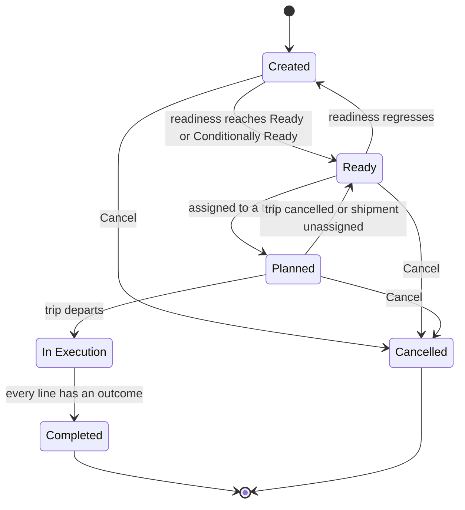

import DocumentInfo from '@site/src/components/DocumentInfo';
import Screenshot from '@site/src/components/Screenshot';

# Shipment Management

<DocumentInfo
  category="User Manual"
  audience={['Planning', 'Warehouse', 'Operations', 'UAT']}
  status="Draft"
  version="1.0"
  owner="Product Team"
  updated="August 2026"
  readingTime="8 min"
/>

**Role**
Planner owns it. Warehouse stages it. Everyone with a SCOP role can read it.

**Navigate to**
`SCOP → Operations → Shipments`

## What a Shipment is

A **Shipment** is a **transport requirement**: one or more compatible demands that can
travel together, with a total weight, a total volume, an origin node, a destination node and
a required date.

The demand answers *what must move*. The shipment answers *what goes on a vehicle*.

| Object | Question | Grain |
| --- | --- | --- |
| **Demand** | What must move | One business requirement |
| **Shipment** | What can be planned as one load | One transport requirement |
| **Trip** | Who takes it, and in what order | One vehicle and driver |
| **Stop** | Where it is handed over | One physical visit |

## Where a shipment comes from

You do not create one in normal operation. A shipment is formed **automatically** when a
demand reaches **Eligible for Planning**.

→ [Formation and Consolidation](./formation-and-consolidation.mdx)

## The Shipments list

<Screenshot
  src="quick-start/08-shipment-list.png"
  alt="SCOP Shipments list showing several shipments with their weight, volume, staged percentage and readiness."
  caption="One row per shipment, with its weight, volume and readiness. SHP-2026-000006 is a consolidated shipment carrying two demands."
/>

| Column | Meaning |
| --- | --- |
| **Reference** | The business identifier, `SHP-2026-000006` |
| **Shipment Type** | Delivery · Collection · Transfer · Return |
| **Origin** / **Destination** | The planning nodes |
| **Customer** | The party it serves |
| **Earliest** / **Latest** | The date window it must move within |
| **Total Weight (kg)** | Sum across the lines |
| **Total Volume (m³)** | Sum across the lines |
| **Quantity** | Total units |
| **Staged %** | How much is physically staged |
| **Readiness** | The computed readiness state |
| **Trip** | The trip it is assigned to, once planned |
| **Status** | The lifecycle state |

:::warning[Staged % renders a hundred times too large]

A known display defect: `100%` shows as `10000%`. The **stored** value is correct — only the
column is scaled twice.

Read it as a hundredth, or use **Readiness** instead, which is computed from the same
evidence and is not affected. Plan Coverage is unaffected.

→ [Release 1 Scope](../about/release-1-scope.mdx)

:::

## The Shipment form

<Screenshot
  src="quick-start/09-shipment-form.png"
  alt="SCOP Shipment form showing the Refresh Readiness and Stage Everything buttons with readiness Conditionally Ready."
  caption="The shipment form before staging: readiness Conditionally Ready, staged 0%."
/>

### The header

```text
Created → Ready → Planned → In Execution → Completed
```

| Button | Available when | Role |
| --- | --- | --- |
| **Refresh Readiness** | Always | Any |
| **Stage Everything** | State is **Created** or **Ready** | **Warehouse** |
| **Cancel** | Not Completed, Cancelled or In Execution | Planner |

### Shipment lines

| Field | Meaning | Source |
| --- | --- | --- |
| **Product** | What moves | The demand line |
| **Quantity** | How much this shipment carries | The demand line's remaining quantity |
| **Owner** | Who owns it | Copied from the demand line |
| **Ownership Source** | How ownership was established | Copied from the demand line |
| **Demand** | Which demand this line belongs to | The link that keeps traceability |
| **Staged** | Whether these goods are physically staged | Set by staging |

:::info[Every shipment line still names its demand]

This is what makes a consolidated shipment safe. Two demands sharing a shipment are still
two requirements, and each line traces back to its own demand and its own Odoo transfer.

Within one delivery, `Demand A` can complete in full while `Demand B` is short.

:::

### The other tabs

| Tab | Shows |
| --- | --- |
| **Lines** | The products, quantities, owners and staging |
| **Readiness** | The computed state, any override, and the evidence in words |
| **Constraints** | Handling or compatibility constraints that apply |
| **Execution** | The trip, the stop and what happened |

## The six states



| State | Meaning |
| --- | --- |
| **Created** | Formed, but not yet ready enough to plan |
| **Ready** | Readiness is Ready or Conditionally Ready. It can be planned |
| **Planned** | Assigned to a trip |
| **In Execution** | The trip has departed |
| **Completed** | Every line has an outcome. **Terminal** |
| **Cancelled** | Withdrawn. **Terminal** |

:::note[Ready can go backwards]

Unlike most SCOP lifecycles, a shipment can move **Ready → Created** if readiness regresses —
somebody unreserved the stock, or a transfer was cancelled.

That is correct behaviour: readiness is computed from current evidence, and evidence can
change.

:::

## Staging

**Stage Everything** marks every line staged and recomputes readiness.

| | |
| --- | --- |
| **Role** | Warehouse |
| **Use it when** | The goods for the **whole shipment** are physically picked and standing ready to load |
| **What it does** | Marks each line staged, recomputes readiness, usually moving it to **Ready** |

<Screenshot
  src="quick-start/10-shipment-staged.png"
  alt="SCOP Shipment form after staging, showing readiness Ready."
  caption="After Stage Everything: readiness Ready. The shipment is firmly plannable."
/>

You cannot stage more than the shipment asks for — SCOP rejects it.

→ [Warehouse Readiness](../readiness/warehouse-readiness.mdx)

## Unplanning and cancelling

### Taking a shipment off a trip

Removing a shipment from a trip returns it to **Ready** and returns its demands to
**Eligible for Planning**, writing an unplanned-demand row for each.

→ [Unplanned Demand](../planning/unplanned-demand.mdx)

### Cancelling

| | |
| --- | --- |
| **Role** | Planner *(approval authority: `scop.shipment` / cancel)* |
| **Available** | Until the shipment is In Execution, Completed or already Cancelled |
| **Not available** | Once the trip has departed — the goods are on a vehicle |

Cancelling a shipment does not cancel its demands or the Odoo transfers behind them.

## Verify

| Check | Where |
| --- | --- |
| The shipment exists | The demand's **Shipments** tab |
| It carries the right demands | The shipment's **Lines** tab, **Demand** column |
| Its weight and volume are right | The shipment header |
| It is plannable | `Operations → Warehouse Readiness` |
| It has been planned | The **Trip** column on the list |

## If it does not work

| Symptom | Check |
| --- | --- |
| No shipment after **Mark Eligible** | See [Readiness and Shipment Problems](../troubleshooting/readiness-and-shipment-problems.mdx) |
| Two shipments where one was expected | Different route, date, or type — see [Formation and Consolidation](./formation-and-consolidation.mdx) |
| One shipment where two were expected | Same route, date and type. This is consolidation working |
| Stuck at **Created** | Readiness is not yet Ready or Conditionally Ready |
| Readiness **Blocked** | Ownership unresolved, or every transfer cancelled |
| **Stage Everything** is not offered | You are not a Warehouse user, or the shipment is past **Ready** |
| Staged % looks absurd | The known display defect — read it as a hundredth |

## Related Pages

- [Formation and Consolidation](./formation-and-consolidation.mdx)
- [The Physical Visit](./the-physical-visit.mdx)
- [Warehouse Readiness](../readiness/warehouse-readiness.mdx)
- [Demand Management](../demand/demand-management.mdx)

## Next

[Formation and Consolidation](./formation-and-consolidation.mdx).
