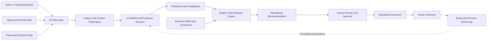
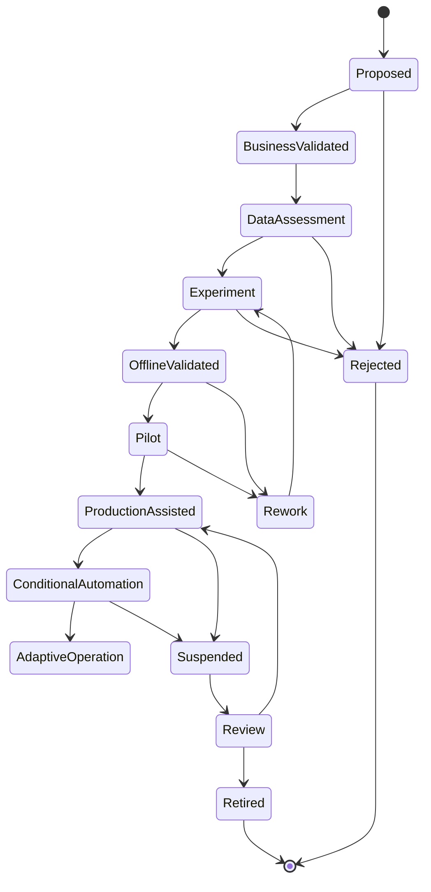
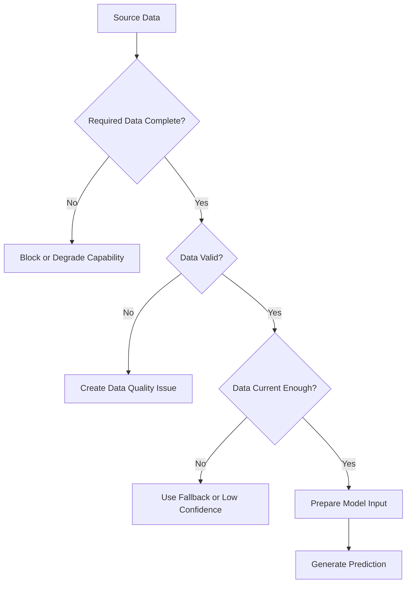
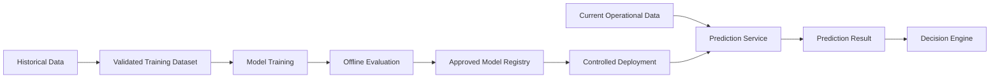
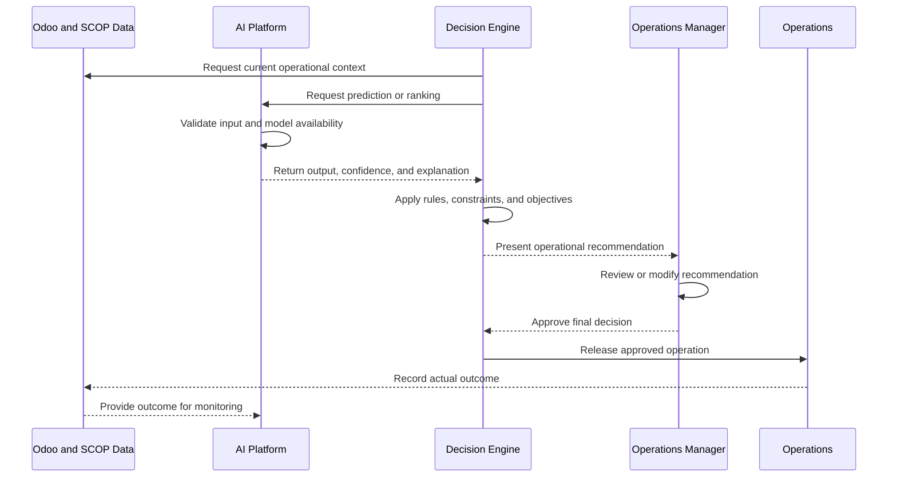
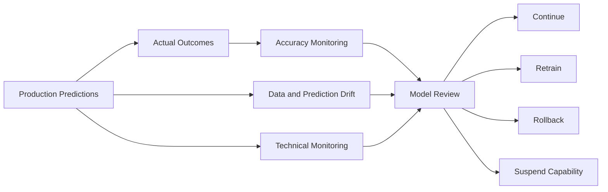
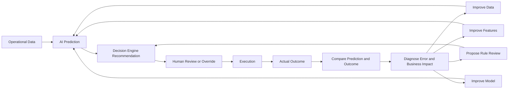

import DocumentInfo from '@site/src/components/DocumentInfo';

# نظرة عامة على منصة الذكاء الاصطناعي

<DocumentInfo
  category="منصة الذكاء الاصطناعي"
  audience={['تنفيذي', 'أعمال', 'عمليات', 'منتج', 'تقني', 'بيانات']}
  status="Approved"
  version="1.0"
  owner="فريق منصة الذكاء الاصطناعي"
  updated="يوليو 2026"
  readingTime="14 دقيقة"
/>

## الغرض

توفر منصة الذكاء الاصطناعي (AI Platform) في SCOP (منصة تشغيل سلسلة الإمداد) قدرات تنبؤية وقدرات لدعم التحسين والتفسير والتعلم تسهم في تحسين قرارات سلسلة الإمداد.

وهي تدعم محرك قرارات سلسلة الإمداد (Supply Chain Decision Engine) من خلال إنتاج معلومات ذكية مثل:

- الوقت المقدر للتنقل
- المدة المقدرة للخدمة
- تنبؤات جاهزية المستودع
- توقعات الطلب والسعة
- مخاطر التأخير التشغيلي
- مخاطر فشل التسليم
- مؤشرات ملاءمة المركبات
- درجة الثقة في التوصيات
- اكتشاف الحالات الشاذة
- تفسيرات القرارات
- التغذية الراجعة للأداء

لا تمتلك منصة الذكاء الاصطناعي قرارات الأعمال بشكل مستقل.

يظل محرك القرار (Decision Engine) الخاص بسلسلة الإمداد مسؤولاً عن تطبيق قواعد الأعمال المعتمدة، وفرض القيود الإلزامية، وتقييم البدائل التشغيلية، وإدارة الموافقة البشرية.

## أهداف منصة الذكاء الاصطناعي

صُممت منصة الذكاء الاصطناعي من أجل:

- تحسين جودة التنبؤات التشغيلية.
- تحسين التخطيط اليومي واستغلال الموارد.
- دعم تقديرات أكثر دقة لأوقات الوصول والإنجاز.
- تحديد المخاطر التشغيلية قبل أن تتحول إلى إخفاقات.
- المساعدة في مقارنة البدائل التشغيلية الممكنة.
- تقديم أدلة مفهومة تدعم التوصيات.
- التعلم من الفروق بين النتائج المخططة والنتائج الفعلية.
- دعم التقدم المنضبط نحو أتمتة موثوقة.
- الحفاظ على مساءلة الأعمال والإشراف البشري.
- الحفاظ على إمكانية تتبع النماذج والمدخلات والتنبؤات والنتائج.
- منع سلوك النماذج غير المنضبط أو غير المفسَّر من التأثير المباشر على العمليات.

## مبادئ المنصة

### قيمة الأعمال قبل الذكاء الاصطناعي

يجب أن تلبي كل قدرة من قدرات الذكاء الاصطناعي حاجة محددة للأعمال أو العمليات.

لا ينبغي إدخال نموذج لمجرد توفر البيانات أو التقنية.

يجب أن تحدد كل قدرة:

- الغرض من ناحية الأعمال
- المستخدم المستهدف
- القرار المدعوم
- الفائدة التشغيلية المتوقعة
- البيانات المطلوبة
- مستوى المخاطر
- المالك
- مقاييس النجاح

### دعم القرار لا امتلاكه

توفر منصة الذكاء الاصطناعي معلومات ذكية يستخدمها محرك القرار.

يمكنها أن تتنبأ أو ترتب أو تكتشف أو تقدّر أو توصي بقيم داعمة، لكنها لا تعتمد القرارات التشغيلية أو تطلقها بشكل مستقل.

### التحكم بوجود الإنسان في حلقة القرار

تتطلب التوصيات التشغيلية المهمة في البداية مراجعة بشرية من جهة مخولة.

يجب أن يكون المستخدمون قادرين على:

- فهم التوصية
- مراجعة المدخلات ذات الصلة
- رؤية جوانب عدم اليقين المهمة
- تعديل الخطة التشغيلية
- رفض التوصيات غير المناسبة
- تسجيل أسباب التجاوزات
- تصعيد الحالات الاستثنائية

### قابلية التفسير

يجب أن توفر القرارات المدعومة بالذكاء الاصطناعي تفسيرات مناسبة لجمهور الأعمال.

ينبغي أن تفسر المنصة:

- ما الذي تم التنبؤ به أو التوصية به
- العوامل التي أثرت في النتيجة
- جوانب عدم اليقين القائمة
- القيود المنطبقة
- كيفية تأثير المخرجات على القرار التشغيلي

### إمكانية التتبع

يجب أن تحتفظ المنصة بمعلومات كافية لتتبع:

- إصدار النموذج أو القاعدة
- مراجع بيانات المدخلات
- الطابع الزمني للتنبؤ
- نتيجة التنبؤ
- درجة الثقة أو عدم اليقين
- القرار المستهلك للتنبؤ
- المراجعة البشرية أو التجاوز
- النتيجة التشغيلية الفعلية

### السلامة قبل الأتمتة

يجب ألا يتجاوز الذكاء الاصطناعي بصمت:

- قواعد الأعمال
- المتطلبات القانونية
- قواعد الملكية
- سعة المركبات
- توافق المنتجات
- المؤهلات المطلوبة
- النوافذ الزمنية الإلزامية
- متطلبات الموافقة البشرية
- ضوابط الأمن والوصول

### التحسين القابل للقياس

يجب أن تمتلك كل قدرة من قدرات الذكاء الاصطناعي معايير أداء قابلة للقياس.

لا ينبغي أن تتقدم أي قدرة نحو الأتمتة ما لم تكن دقتها وموثوقيتها وقيمتها للأعمال ومخاطرها مفهومة.

## دور منصة الذكاء الاصطناعي في SCOP

تعمل منصة الذكاء الاصطناعي كطبقة ذكاء داعمة لمحرك القرار والتطبيقات التشغيلية.



تدعم منصة الذكاء الاصطناعي القرارات لكنها لا تحل محل مسؤوليات الحوكمة الخاصة بمحرك القرار.

## منصة الذكاء الاصطناعي ومحرك القرار

لمنصة الذكاء الاصطناعي ومحرك القرار مسؤوليات متمايزة.

| القدرة | منصة الذكاء الاصطناعي | محرك القرار |
| --- | --- | --- |
| التنبؤات | تنتج التقديرات والتوقعات ومؤشرات المخاطر | يستخدم التنبؤات كمدخلات للقرار |
| قواعد الأعمال | قد تحدد أنماطاً للمراجعة المستقبلية | يطبق قواعد الأعمال المعتمدة |
| القيود الصارمة | لا تتجاوز القيود الإلزامية | يفرض القيود الإلزامية |
| دعم التحسين | توفر التقديرات أو الترتيبات أو تقنيات التحسين | يقيّم البدائل ضمن الضوابط المعتمدة |
| التوصيات | توفر معلومات ذكية تدعم التوصيات | ينتج توصيات أعمال منضبطة |
| التفسير | تفسر مخرجات النماذج والعوامل المؤثرة | يفسر قرار الأعمال الكامل |
| الموافقة | لا تعتمد الإطلاق التشغيلي | يدير المراجعة والموافقة المخولة |
| التنفيذ | لا تطلق العمليات عالية التأثير مباشرة | يربط القرارات المعتمدة بالتنفيذ |
| المراقبة | تقيس أداء النماذج والانحراف (drift) | يقيس نتائج القرارات والنتائج التشغيلية |
| الحوكمة | تحكم النماذج ومجموعات البيانات والتنبؤات | يحكم قرارات الأعمال والقواعد والموافقات |

## مجالات قدرات الذكاء الاصطناعي

قد تدعم منصة الذكاء الاصطناعي الأولية عدة مجالات من القدرات.

### ذكاء التنقل والوصول

قد تشمل القدرات:

- تقدير وقت التنقل
- الوقت المقدر للوصول (ETA)
- احتمالية التأخير المتوقع
- تقدير مدة المسار
- تقدير وقت الانتظار
- تقدير مدة الخدمة في المحطة

قد تستخدم هذه التنبؤات:

- نقطة الانطلاق والوجهة
- المسار
- التاريخ والوقت
- يوم الأسبوع
- مدة التنقل التاريخية
- نوع المحطة
- خصائص العميل أو المستودع
- نوع المركبة
- عدد المحطات
- الأنماط الموسمية
- بيانات المرور أو البيانات الخارجية المعتمدة عند توفرها

### ذكاء المستودعات

قد تشمل القدرات:

- تقدير إنجاز عمليات الالتقاط
- تقدير جاهزية التجهيز
- تقدير مدة التحميل
- مخاطر تأخير المستودع
- التنبؤ بجاهزية النقل العابر
- التنبؤ بحجم العمل

قد تدعم هذه التنبؤات التخطيط من خلال تحديد ما إذا كانت الشحنة من المرجح أن تكون جاهزة قبل موعد المغادرة المخطط للمركبة.

### ذكاء الطلب

قد تشمل القدرات:

- التنبؤ بالطلب على المنتجات
- التنبؤ بطلب الفروع
- التنبؤ بطلب العملاء
- التنبؤ قصير المدى بحجم الشحنات
- حجم العمل المتوقع في يوم التسليم
- تحليل الطلب الموسمي

قد تدعم توقعات الطلب المشتريات وتخصيص المخزون وتحضير المستودعات وتخطيط سعة الأسطول.

### ذكاء السعة

قد تشمل القدرات:

- التنبؤ بسعة المركبات المطلوبة
- مخاطر نقص المركبات
- مخاطر نقص السائقين
- التنبؤ بحجم عمل المستودع
- عدد الرحلات المتوقع
- الطلب المتوقع من حيث الوزن أو الحجم أو المنصات أو الوحدات

### ذكاء المخاطر التشغيلية

قد تشمل القدرات:

- مخاطر التأخر في التسليم
- مخاطر فشل المحطات
- مخاطر تأخير المستودع
- مخاطر إسناد المركبات
- مخاطر انتهاك النوافذ الزمنية
- مخاطر البيانات غير المكتملة
- اكتشاف أنماط التنفيذ غير المعتادة

ينبغي أن تدعم مؤشرات المخاطر التدخل المبكر بدلاً من أن تعمل كآليات رفض غير مفسرة.

### ذكاء التوصيات

قد تشمل القدرات:

- ترتيب ملاءمة المركبات
- ملاءمة دمج الشحنات
- دعم اختيار المستودع
- تحديد فرص النقل العابر
- ترتيب المسارات أو تسلسل المحطات
- اقتراحات حل الاستثناءات

تظل قواعد الأعمال الإلزامية والقيود الصارمة خاضعة لسيطرة محرك القرار.

### ذكاء التفسير

قد تشمل القدرات:

- ملخصات المساهمة على مستوى السمات (features)
- مقارنة البدائل المهمة
- تفسير عدم اليقين
- تحديد قيود جودة البيانات
- ملخصات بلغة الأعمال لعوامل التوصية

يجب أن تظل التفسيرات المولدة مستندة إلى مدخلات النماذج الفعلية ونتائج القرارات الفعلية.

## حالات الاستخدام الأولية للذكاء الاصطناعي

ينبغي أن تعطي خارطة طريق الذكاء الاصطناعي الأولية الأولوية لحالات الاستخدام التي تحقق قيمة تشغيلية دون الحاجة إلى تحكم ذاتي.

| حالة الاستخدام | الغرض من ناحية الأعمال | المخرج الأولي |
| --- | --- | --- |
| تقدير وقت التنقل | تحسين جداول الرحلات وتخطيط الوصول | المدة المقدرة |
| التنبؤ بوقت الوصول (ETA) | تحسين الرؤية للعملاء والعمليات | وقت الوصول المقدر |
| تقدير مدة الخدمة | تحسين تسلسل المحطات ومدة الرحلة | وقت الخدمة المقدر |
| التنبؤ بجاهزية المستودع | تقليل انتظار المركبات وتأخيرات المغادرة | وقت الجاهزية والمخاطر |
| التنبؤ بمخاطر التأخير | تحديد الرحلات أو المحطات المرجح تأخرها | مستوى المخاطر والعوامل |
| دعم ملاءمة المركبات | تحسين جودة الإسناد | مركبات ممكنة مرتبة |
| دعم الدمج | تحديد تجميعات الشحنات المفيدة | درجة التوافق أو الفائدة |
| التنبؤ بالطلب | دعم تخطيط المشتريات والمخزون والسعة | الكمية المتوقعة |
| التنبؤ بالسعة | تحديد النقص المتوقع في الأسطول أو المستودعات | متطلبات السعة المتوقعة |
| اكتشاف الحالات الشاذة | تحديد السجلات أو النتائج التشغيلية غير المعتادة | تنبيه وسياق داعم |

## دورة حياة القدرات

ينبغي أن تمر كل قدرة من قدرات الذكاء الاصطناعي بمراحل منضبطة.



يتطلب الانتقال بين المراحل أدلة تتناسب مع المخاطر التشغيلية للقدرة.

## تعريف القدرة

ينبغي أن يكون لكل قدرة من قدرات الذكاء الاصطناعي تعريف موثق يتضمن:

| العنصر | الوصف |
| --- | --- |
| معرف القدرة | معرف فريد |
| الاسم | اسم القدرة بصيغة مقروءة للأعمال |
| الغرض من ناحية الأعمال | المشكلة التشغيلية المعالجة |
| القرار المدعوم | القرار الذي يستخدم المخرجات |
| المالك | مالك الأعمال أو المنتج المسؤول |
| المالك التقني | الفريق المسؤول عن التنفيذ |
| المدخلات | البيانات المطلوبة |
| المخرجات | تنبؤ أو ترتيب أو تصنيف أو تفسير |
| المستخدمون | الأدوار المستهلكة للمخرجات |
| مستوى المخاطر | تصنيف التأثير التشغيلي |
| نموذج الموافقة | المراجعة البشرية المطلوبة |
| مقاييس النجاح | مقاييس الأعمال والمقاييس التقنية |
| القيود | القيود المعروفة |
| الوضع الاحتياطي | السلوك الآمن عند عدم التوفر |
| الحالة | مقترحة أو تجريبية أو إنتاجية أو معلقة أو متقاعدة |
| الإصدار | إصدار القدرة المعتمد الحالي |

أمثلة على معرفات القدرات:

```text
AI-ETA-001
AI-WHS-001
AI-DMD-001
AI-RSK-001
AI-CAP-001
AI-EXP-001
```

## مصادر بيانات الذكاء الاصطناعي

قد تستهلك منصة الذكاء الاصطناعي بيانات من مصادر معتمدة.

### بيانات Odoo التشغيلية

تشمل بيانات Odoo (نظام تخطيط موارد المؤسسات) المحتملة:

- أوامر الشراء
- طلبات العملاء
- إيصالات المستودعات
- أوامر التسليم
- التحويلات الداخلية
- حركات المخزون
- البيانات الرئيسية للمنتجات
- سجلات العملاء والموردين
- فروع العملاء
- تعريفات المستودعات
- سجلات المركبات
- سجلات السائقين
- سجلات المسارات
- سجلات الرحلات
- أوقات المحطات المخططة والفعلية
- الكميات المخططة والفعلية
- المرتجعات
- الاستثناءات
- موافقات القرارات وتجاوزاتها

### بيانات امتدادات SCOP

تشمل البيانات المحتملة الخاصة بـ SCOP:

- تعريفات الشحنات
- تكوين الحمولة
- تسلسلات محطات الرحلات
- حسابات سعة المركبات
- توصيات التخطيط
- نتائج القيود
- تفسيرات القرارات
- درجة الثقة في التوصيات
- أسباب التجاوزات
- مؤشرات الأداء التشغيلية الرئيسية

### البيانات الخارجية

قد تشمل البيانات الخارجية المعتمدة:

- الإحداثيات الجغرافية
- بيانات الخرائط والمسافات
- معلومات المرور
- معلومات الطقس
- العطلات الرسمية
- قيود الطرق

يجب أن يكون للبيانات الخارجية ملكية وترخيص وموثوقية وتكرار تحديث وسلوك احتياطي محددة.

## متطلبات جودة البيانات

تعتمد جودة مخرجات الذكاء الاصطناعي على جودة البيانات التشغيلية.

ينبغي أن تتحقق المنصة من:

- الاكتمال
- الصلاحية
- الاتساق
- حداثة التوقيت
- التفرد
- الملكية
- الاستمرارية التاريخية
- صحة الطوابع الزمنية
- صحة وحدات القياس
- استقرار تعريفات الأعمال



يجب ألا تحول منصة الذكاء الاصطناعي البيانات غير المكتملة إلى تنبؤات تبدو دقيقة دون الكشف عن هذا القيد.

## فصل التدريب عن التشغيل

عند استخدام نماذج تعلم الآلة، ينبغي الفصل بين التدريب والتنبؤ التشغيلي.



يجب ألا تغير أنشطة التدريب القرارات التشغيلية الإنتاجية مباشرة دون تقييم ونشر منضبطين.

## سجل النماذج

ينبغي أن يوثق سجل نماذج (model registry) خاضع للتحكم ما يلي:

- معرف النموذج
- إصدار النموذج
- القدرة
- مرجع مجموعة بيانات التدريب
- تاريخ التدريب
- الخوارزمية أو نوع النموذج
- إصدار تعريف السمات
- مقاييس التقييم
- حالة الموافقة
- حالة النشر
- تاريخ النشر
- المالك المسؤول
- القيود المعروفة
- حالة الاستبدال أو التقاعد

ينبغي أن تكون إصدارات النماذج المعتمدة فقط متاحة لدعم القرارات الإنتاجية.

## إدارة السمات

السمات (features) هي قيم مدخلات معدة تستخدمها النماذج التنبؤية.

من أمثلتها:

- متوسط وقت التنقل التاريخي
- ساعة المغادرة المخططة
- يوم الأسبوع
- عدد المحطات المخططة
- حجم عمل المستودع
- نوع المركبة
- تاريخ مدة خدمة العميل
- فئة مناولة المنتج
- المسافة
- معدل التأخير الأخير
- حالة جاهزية المخزون

يجب أن تكون تعريفات السمات:

- خاضعة للتحكم في الإصدارات
- قابلة لإعادة الإنتاج
- موثقة
- متسقة بين التدريب والتنبؤ
- قابلة للتتبع إلى مصادر بيانات معتمدة
- محمية من المعلومات الحساسة غير المناسبة

## سجل التنبؤ

ينبغي أن ينشئ كل تنبؤ تشغيلي سجل تنبؤ (Prediction Record) قابلاً للتتبع أو يشير إليه.

ينبغي أن يتضمن سجل التنبؤ:

| العنصر | الوصف |
| --- | --- |
| معرف التنبؤ | معرف فريد |
| القدرة | قدرة الذكاء الاصطناعي المنتجة للمخرجات |
| إصدار النموذج | النموذج المستخدم |
| مراجع المدخلات | السجلات التشغيلية المستخدمة كسياق |
| إصدار السمات | إصدار تعريف السمات |
| وقت التنبؤ | وقت توليد النتيجة |
| المخرجات | القيمة المقدرة أو الفئة أو الدرجة أو الترتيب |
| درجة الثقة | مؤشر الموثوقية أو عدم اليقين |
| التفسير | العوامل المساهمة المهمة |
| فترة الصلاحية | الفترة التي يظل فيها التنبؤ قابلاً للتطبيق |
| المستهلك | القرار أو العملية التي تستخدم النتيجة |
| النتيجة | النتيجة الفعلية عند معرفتها |

## صلاحية التنبؤ

يجب ألا تعامل التنبؤات على أنها صالحة بشكل دائم.

قد يصبح التنبؤ غير صالح عندما:

- تتغير البيانات المصدرية
- يتغير توفر المخزون
- تتغير جاهزية المستودع
- يتغير إسناد المركبة أو السائق
- يتغير المسار أو تسلسل المحطات
- يصبح التنبؤ قديماً جداً
- تتغير ظروف التشغيل الخارجية
- يعاد تخطيط رحلة ذات صلة
- يُسحب إصدار النموذج

ينبغي أن تحدد المنصة فترات صلاحية ومحفزات إعادة حساب لكل قدرة.

## الثقة وعدم اليقين

ينبغي أن تتضمن مخرجات الذكاء الاصطناعي عدم اليقين حيثما يكون ذلك مهماً من الناحية التشغيلية.

قد تتأثر درجة الثقة بما يلي:

- اكتمال البيانات
- حداثة البيانات
- حجم العينة التاريخية
- التشابه مع ظروف التشغيل المعروفة
- استقرار النموذج
- نطاق التنبؤ
- أداء النموذج في الفترة الأخيرة
- توفر البيانات الخارجية

قد تشمل مستويات الثقة (confidence levels) الممكنة:

- مرتفعة
- متوسطة
- منخفضة
- غير متاحة

يجب ألا تُعرض درجة الثقة على أنها ضمان.

ينبغي أن تحدد المخرجات منخفضة الثقة المصدر الرئيسي لعدم اليقين، وقد تتطلب انتباهاً بشرياً إضافياً.

## قابلية التفسير في التطبيق

يجب أن تعمل قابلية التفسير على مستويين.

### التفسير على مستوى النموذج

يصف التفسير على مستوى النموذج كيف يتصرف النموذج بشكل عام.

قد يتضمن:

- الغرض المقصود
- فئات المدخلات الرئيسية
- فترة بيانات التدريب
- مقاييس التقييم
- القيود المعروفة
- الظروف التي يضعف فيها الأداء
- الاستخدامات المحظورة

### التفسير على مستوى التنبؤ

يصف التفسير على مستوى التنبؤ سبب توليد مخرج معين.

قد يتضمن:

- العوامل المساهمة المهمة
- المقارنة مع السلوك التاريخي المعتاد
- تحذيرات جودة البيانات ذات الصلة
- درجة الثقة
- التفسير البديل عند الاقتضاء

مثال:

```text
The predicted warehouse readiness time is 09:35.
The main contributing factors are the current picking backlog, the historical
loading duration for this warehouse, the number of lines in the assigned load,
and two incomplete receipt operations.
Confidence is Medium because the current staging status has not been updated
during the last 45 minutes.
```

يجب ألا تدعي التفسيرات يقيناً لا يوفره النموذج.

## الإشراف البشري

تعتمد متطلبات الإشراف البشري على تأثير القدرة.

### الذكاء منخفض التأثير

أمثلة:

- توقع معلوماتي
- تحذير غير معطِّل
- اتجاه تشغيلي
- اقتراح بالتحقيق

قد لا تتطلب هذه المخرجات موافقة فردية لكن يجب أن تظل قابلة للتتبع.

### الذكاء متوسط التأثير

أمثلة:

- ترتيب المركبات
- اقتراح دمج الشحنات
- التنبؤ بجاهزية المستودع
- الإشارة إلى مخاطر التأخير

ينبغي مراجعة هذه المخرجات كجزء من التوصية التشغيلية.

### الذكاء عالي التأثير

أمثلة:

- الإطلاق التلقائي لرحلة
- التغيير التلقائي لالتزامات العملاء
- الإلغاء التلقائي للطلب
- التجاوز التلقائي لسياسة تشغيلية إلزامية

تتطلب هذه الإجراءات حوكمة أقوى وتقع خارج النطاق الذاتي الأولي.

## تدفق القرار المدعوم بالذكاء الاصطناعي



## الوضع الاحتياطي الآمن

يجب أن تحدد كل قدرة من قدرات الذكاء الاصطناعي سلوكاً احتياطياً آمناً.

قد تشمل خيارات الوضع الاحتياطي:

- استخدام قيمة قياسية مهيأة
- استخدام متوسط تاريخي
- استخدام قاعدة أعمال حتمية
- استخدام تقدير متحفظ
- طلب إدخال يدوي
- عدم إرجاع أي تنبؤ
- خفض درجة الثقة في التوصية
- حجب الميزة المعتمدة على الذكاء الاصطناعي فقط
- الاستمرار بالتخطيط اليدوي
- تصعيد مشكلة حرجة في البيانات أو النموذج

يجب ألا يؤدي عدم توفر نموذج ذكاء اصطناعي بالضرورة إلى جعل المنصة التشغيلية بأكملها غير متاحة.

## التعامل مع الإخفاقات

قد تشمل سيناريوهات إخفاق الذكاء الاصطناعي:

- عدم توفر خدمة النموذج
- مدخلات غير صالحة
- سمات مفقودة
- بيانات قديمة
- سيناريو تشغيل غير مدعوم
- انتهاء مهلة التنبؤ
- عدم توفر إصدار النموذج
- مخرجات خارج النطاق المسموح به
- تجاوز عتبة المراقبة

يجب على المنصة أن:

1. تكتشف الإخفاق.
2. تسجل الإخفاق.
3. تطبق الوضع الاحتياطي المعتمد.
4. تخطر المالك التشغيلي أو التقني المناسب.
5. تمنع الإجراءات الآلية غير الآمنة.
6. تحافظ على الالتزامات التشغيلية المعتمدة القائمة حيثما أمكن.

## تقييم النماذج

ينبغي أن يتضمن تقييم النماذج مقاييس تقنية ومقاييس أعمال.

### المقاييس التقنية

بحسب القدرة، قد تشمل المقاييس:

- متوسط الخطأ المطلق
- الجذر التربيعي لمتوسط مربع الخطأ
- دقة التصنيف
- استدعاء التصنيف
- المساحة تحت المنحنى
- المعايرة
- جودة الترتيب
- تغطية التنبؤ
- زمن الاستجابة
- توفر الخدمة

### مقاييس الأعمال

قد تشمل مقاييس الأعمال:

- تحسن الالتزام بالنوافذ الزمنية
- انخفاض انتظار المركبات
- انخفاض تأخير المستودعات
- تحسن دقة التخطيط
- انخفاض التعديلات اليدوية
- تحسن استغلال السعة
- انخفاض المحطات الفاشلة
- انخفاض تكلفة التشغيل
- تحسن قبول التوصيات
- التحديد المبكر للمخاطر التشغيلية

قد يظل النموذج الدقيق تقنياً غير مناسب إذا لم يحسن عملية الأعمال المدعومة.

## التقييم غير المتصل

قبل الاستخدام الإنتاجي، ينبغي اختبار النموذج باستخدام بيانات تاريخية أو بيانات تحقق خاضعة للتحكم.

ينبغي أن يتحقق التقييم غير المتصل من:

- الدقة
- الاستقرار
- التحيز عبر شرائح الأعمال ذات الصلة
- الأداء في ظروف التشغيل الشائعة
- الأداء في الظروف الصعبة
- المقارنة مع القواعد أو الأسس المرجعية القائمة
- مخاطر تسرب البيانات
- قابلية إعادة الإنتاج
- القيود المعروفة

النجاح في التقييم غير المتصل لا يبرر تلقائياً الأتمتة الإنتاجية.

## التحقق التجريبي

يُدخل البرنامج التجريبي القدرة في بيئة تشغيلية محدودة.

ينبغي أن يحدد البرنامج التجريبي:

- المستخدمين
- مجال الأعمال
- المستودعات أو العملاء
- فترة التشغيل
- إصدار النموذج
- أنواع القرارات المدعومة
- متطلبات الموافقة البشرية
- معايير النجاح
- معايير الإخفاق
- إجراء التراجع

ينبغي أن تعمل مخرجات البرنامج التجريبي في البداية كتوصيات أو معلومات ذكية إرشادية.

## المراقبة الإنتاجية

ينبغي أن تغطي المراقبة الإنتاجية:

- حجم التنبؤات
- توفر التنبؤات
- زمن الاستجابة
- الأخطاء
- معدل المدخلات المفقودة
- معدل اللجوء إلى الوضع الاحتياطي
- توزيع درجات الثقة
- دقة التنبؤ عند توفر النتائج
- الانحراف (drift)
- أداء الشرائح
- قبول المستخدمين
- معدل التجاوزات
- التأثير على الأعمال



## مراقبة الانحراف

يحدث الانحراف (drift) عندما تختلف بيانات التشغيل الحالية أو علاقاتها عن تلك المستخدمة أثناء تطوير النموذج.

ينبغي أن تراقب المنصة:

- انحراف بيانات المدخلات
- انحراف السمات
- انحراف التنبؤات
- انحراف الأداء
- تغيرات العمليات التشغيلية
- تغيرات مزيج العملاء أو المستودعات
- التغيرات الموسمية
- المنتجات أو المواقع أو أنواع المركبات الجديدة

لا يعني الانحراف دائماً أن النموذج قد فشل، لكنه يتطلب التحقيق عند تجاوز العتبات المعتمدة.

## إعادة تدريب النماذج

قد تُستحث إعادة التدريب بما يلي:

- مراجعة مجدولة
- توفر بيانات نتائج جديدة كافية
- تدهور الأداء
- انحراف كبير
- تغير في عمليات الأعمال
- مناطق تشغيل جديدة
- ملفات تعريف جديدة للمركبات أو المستودعات
- تحسينات معتمدة على السمات
- تصحيح مشكلات البيانات التاريخية

يجب أن تنتج إعادة التدريب إصداراً جديداً من النموذج.

ويجب ألا تحل بصمت محل الإصدار الإنتاجي المعتمد الحالي.

## النشر والتراجع

ينبغي أن يدعم نشر النماذج:

- الإصدار المرقّم
- الموافقة
- الطرح المحدود
- المراقبة
- المقارنة مع الإصدار السابق
- التراجع المنضبط
- تعليق القدرة

قد يكون التراجع مطلوباً عندما:

- تنخفض الدقة
- يظهر سلوك غير متوقع
- تتدهور نتائج الأعمال
- تُكتشف مشكلات في البيانات
- تصبح التفسيرات غير موثوقة
- ترتفع معدلات اللجوء إلى الوضع الاحتياطي
- يبلغ المستخدمون التشغيليون عن مشكلات جوهرية

## حوكمة النماذج

### الملكية

يجب أن يكون لكل قدرة ونموذج مالكان محددان من ناحية الأعمال ومن الناحية التقنية.

### الموافقة

يتطلب الاستخدام الإنتاجي تحققاً وموافقة مناسبين.

### التحكم في الإصدارات

يجب ترقيم إصدارات النماذج والسمات ومجموعات البيانات ونتائج التقييم.

### إمكانية التتبع

يجب أن تكون التنبؤات التشغيلية قابلة للتتبع إلى النموذج وسياق البيانات المستخدمين.

### الوصول الخاضع للتحكم

لا يجوز إلا للأنظمة والمستخدمين المخولين الوصول إلى معلومات النماذج الحساسة أو المعلومات التشغيلية الحساسة.

### التوثيق

يجب توثيق القدرات والقيود والتقييمات وعمليات النشر والتغييرات.

### المراقبة

يجب مراقبة السلوك الإنتاجي والتأثير على الأعمال.

### التقاعد

يجب سحب النماذج التي لم تعد مناسبة للاستخدام بأمان مع الحفاظ على إمكانية التتبع التاريخية.

## حوكمة البيانات

يجب أن تعالج حوكمة بيانات الذكاء الاصطناعي:

- ملكية البيانات
- الاستخدام المعتمد
- تقليل البيانات
- الاحتفاظ بالبيانات
- التحكم في الوصول
- جودة البيانات
- المعلومات الحساسة
- التصحيح التاريخي
- نسب البيانات وأصلها
- ترخيص البيانات الخارجية
- ترقيم إصدارات مجموعات البيانات

يجب ألا تستخدم البيانات التشغيلية لأغراض غير ذات صلة دون حوكمة معتمدة.

## مبادئ الأمن

يجب أن تتبع منصة الذكاء الاصطناعي ضوابط الأمن في SCOP.

تشمل متطلبات الأمن:

- المصادقة
- التخويل
- الوصول بأدنى الامتيازات
- الاتصال الآمن بين الخدمات
- بيانات الاعتماد المحمية
- سجلات التدقيق
- فصل البيئات
- تقييد نشر النماذج
- حماية مجموعات البيانات
- مراقبة الوصول غير المصرح به
- التكاملات الخارجية الخاضعة للتحكم

يجب ألا توفر قدرات الذكاء الاصطناعي مساراً للالتفاف على صلاحيات Odoo أو SCOP.

## مبادئ الذكاء الاصطناعي المسؤول

ينبغي أن تكون قدرات الذكاء الاصطناعي في SCOP:

- محدودة الغرض
- قابلة للتفسير
- قابلة للتتبع
- خاضعة للحوكمة
- قابلة للقياس
- آمنة
- موثوقة
- خاضعة للإشراف البشري
- مختبرة ضد التحيز غير المناسب عند الاقتضاء
- آمنة عند فشل البيانات أو النماذج

ينبغي أن تتجنب المنصة عرض المخرجات الاحتمالية كحقائق موضوعية.

## تقييم التحيز والشرائح

عند الاقتضاء، ينبغي تقييم أداء النماذج عبر شرائح تشغيلية مثل:

- المستودع
- العميل
- الفرع
- المنطقة الجغرافية
- فئة المنتج
- نوع المركبة
- نوع المسار
- وقت اليوم
- يوم الأسبوع
- أولوية الطلب

ينبغي التحقيق في فروق الأداء لتحديد ما إذا كانت ناتجة عن:

- جودة البيانات
- عدم كفاية الأمثلة التاريخية
- الاختلافات التشغيلية
- قيود النموذج
- سلوك غير مناسب للسمات

## مستويات أتمتة الذكاء الاصطناعي

قد تتقدم العمليات المدعومة بالذكاء الاصطناعي عبر مستويات أتمتة منضبطة (automation Level 0–4).

| المستوى | الوصف |
| --- | --- |
| المستوى 0 (Level 0) — بدون ذكاء اصطناعي | تستخدم العمليات قيماً يدوية وعمليات حتمية |
| المستوى 1 (Level 1) — معلوماتي | يوفر الذكاء الاصطناعي توقعات أو تحذيرات أو مؤشرات مخاطر |
| المستوى 2 (Level 2) — مساعد | تدعم مخرجات الذكاء الاصطناعي توصيات يراجعها المستخدمون |
| المستوى 3 (Level 3) — أتمتة مشروطة | قد تطلق المخرجات المعتمدة منخفضة المخاطر إجراءات خاضعة للتحكم |
| المستوى 4 (Level 4) — عمليات تكيفية | تتكيف قدرات مختارة باستخدام النتائج المقاسة ضمن الحوكمة المعتمدة |

الهدف الأولي هو المستوى 1 والمستوى 2 بشكل أساسي.

يجب اعتماد مستويات الأتمتة بشكل منفصل لكل قدرة ولكل نوع قرار.

## معايير التقدم

لا يجوز أن تتقدم أي قدرة نحو أتمتة أكبر إلا عندما:

- يظل غرضها من ناحية الأعمال صالحاً.
- تكون جودة البيانات كافية.
- يلبي الأداء التقني العتبات المعتمدة.
- تظهر نتائج الأعمال قيمة قابلة للقياس.
- يكون سلوك الإخفاق آمناً.
- تكون التفسيرات مفهومة.
- تكون المراقبة نشطة.
- يكون التراجع متاحاً.
- يثق المستخدمون بالقدرة بشكل مناسب.
- يتم الحصول على موافقة الحوكمة.

## التعلم من التجاوزات

توفر التعديلات وحالات الرفض البشرية تغذية راجعة تشغيلية قيمة.

ينبغي أن تحلل المنصة:

- التوصيات التي تتغير بشكل متكرر
- المستخدمين أو الفرق الذين يجرون التغييرات
- أسباب التجاوز الشائعة
- المعلومات التشغيلية المفقودة من مدخلات النماذج
- الشرائح ذات القبول المنخفض
- الفروق بين الخطط المعتمدة والخطط المنفذة
- ما إذا كانت التجاوزات قد حسنت النتائج أو أضرت بها

يجب ألا تعامل التجاوزات تلقائياً على أنها أخطاء في النماذج.

فقد تكشف عن:

- بيانات مفقودة
- قواعد أعمال مفقودة
- معرفة تشغيلية محلية
- متطلبات استثنائية للعملاء
- تفسيرات ضعيفة
- ترجيح غير مناسب للأهداف
- قيود حقيقية في النماذج

## دورة التغذية الراجعة والتحسين



يجب أن تظل تغييرات قواعد الأعمال خاضعة لحوكمة الأعمال، ويجب ألا تطبقها منصة الذكاء الاصطناعي تلقائياً.

## مؤشرات الأداء الرئيسية لمنصة الذكاء الاصطناعي

تشمل مؤشرات الأداء الرئيسية المحتملة لمنصة الذكاء الاصطناعي:

### الموثوقية

- توفر خدمة التنبؤ
- زمن استجابة التنبؤ
- معدل الأخطاء
- معدل اللجوء إلى الوضع الاحتياطي
- معدل المدخلات المفقودة

### أداء النماذج

- خطأ التنبؤ
- دقة التصنيف والاستدعاء
- المعايرة
- أداء الترتيب
- معدل الانحراف
- الأداء بحسب شريحة الأعمال

### التبني التشغيلي

- معدل استخدام التنبؤات
- معدل قبول التوصيات
- معدل التجاوزات
- تعليقات المستخدمين
- معدل الاطلاع على التفسيرات

### التأثير على الأعمال

- انخفاض وقت التخطيط
- تحسن دقة الوقت المقدر للوصول (ETA)
- تحسن الالتزام بالنوافذ الزمنية
- انخفاض الانتظار في المستودعات
- تحسن استغلال السعة
- انخفاض المحطات الفاشلة
- انخفاض تكلفة التشغيل
- تحسن تغطية الطلب

### الحوكمة

- نسبة النماذج ذات التوثيق الكامل
- نسبة التنبؤات القابلة للتتبع إلى نموذج معتمد
- تغطية المراقبة
- مراجعات النماذج المتأخرة
- استخدام النماذج غير المصرح به أو غير المعتمد
- جاهزية التراجع

ستحدد الصيغ والأهداف الدقيقة في مواصفات لاحقة لمؤشرات الأداء الرئيسية والنماذج.

## التكامل مع Odoo 17

يظل Odoo 17 هو نظام السجل التشغيلي.

قد تقرأ منصة الذكاء الاصطناعي البيانات التشغيلية المعتمدة من خلال خدمات تكامل خاضعة للتحكم.

ويمكنها أن ترجع:

- التنبؤات
- الترتيبات
- مؤشرات المخاطر
- درجة الثقة
- التفسيرات
- تحذيرات جودة البيانات
- مراجع البيانات الوصفية للنماذج

يظل محرك القرار وتدفقات عمل Odoo مسؤولين عن:

- تطبيق قواعد الأعمال
- فرض الصلاحيات
- إدارة الموافقات
- إنشاء السجلات التشغيلية
- إطلاق الرحلات
- تسجيل التنفيذ الفعلي

يجب ألا تفسد مخرجات الذكاء الاصطناعي ضوابط Odoo التشغيلية القياسية أو تتجاوزها بشكل مباشر.

## حدود البنية

تحدد هذه الصفحة:

- غرض منصة الذكاء الاصطناعي
- مبادئ المنصة
- مجالات القدرات
- مصادر البيانات
- دورة حياة النماذج
- إمكانية تتبع التنبؤات
- قابلية التفسير
- المراقبة
- الحوكمة
- الإشراف البشري
- الوضع الاحتياطي الآمن
- مستويات الأتمتة
- مسؤوليات التكامل

ولا تحدد:

- خوارزميات النماذج الفردية
- الصيغ التفصيلية للسمات
- الشيفرة المصدرية للتدريب
- حمولات واجهات برمجة التطبيقات
- تهيئة نشر البنية التحتية
- مخططات قواعد البيانات
- خطوط أنابيب MLOps التفصيلية
- اختيار مزود الخدمات السحابية
- ضوابط الأمن السيبراني الكاملة
- عتبات القبول الفردية للنماذج

ستوثق هذه الموضوعات في مواصفات مخصصة للذكاء الاصطناعي والتطوير والأمن والجوانب التقنية.

## الملخص

توفر منصة الذكاء الاصطناعي في SCOP قدرات تنبؤية وقدرات تعلم تحسن تخطيط سلسلة الإمداد وجودة القرارات.

وهي تدعم محرك قرارات سلسلة الإمداد بالتقديرات والتوقعات والترتيبات ومؤشرات المخاطر ودرجات الثقة والتفسيرات.

تحكم المنصة بغرض الأعمال وجودة البيانات والإشراف البشري وإمكانية التتبع والوضع الاحتياطي الآمن والنتائج القابلة للقياس والنشر المنضبط.

الذكاء الاصطناعي داخل SCOP ليس سلطة تشغيلية مستقلة، بل هو قدرة ذكاء خاضعة للحوكمة تساعد المستخدمين المخولين ومحرك القرار على اتخاذ قرارات سلسلة إمداد أفضل وأسرع وأكثر قابلية للقياس.

## الصفحات ذات الصلة

- [نظام تصميم التوثيق](../getting-started/documentation-design-system.mdx)
- [مخطط المنتج](../product/product-blueprint.mdx)
- [بنية الأعمال](../business/business-architecture.mdx)
- [نموذج تشغيل سلسلة الإمداد](../operations/supply-chain-operating-model.mdx)
- [محرك قرارات سلسلة الإمداد](../decision-engine/supply-chain-decision-engine.mdx)
- كتالوج قدرات الذكاء الاصطناعي
- حوكمة النماذج
- مراقبة التنبؤات
- إطار قابلية التفسير
- إطار جودة البيانات
