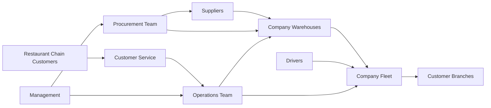
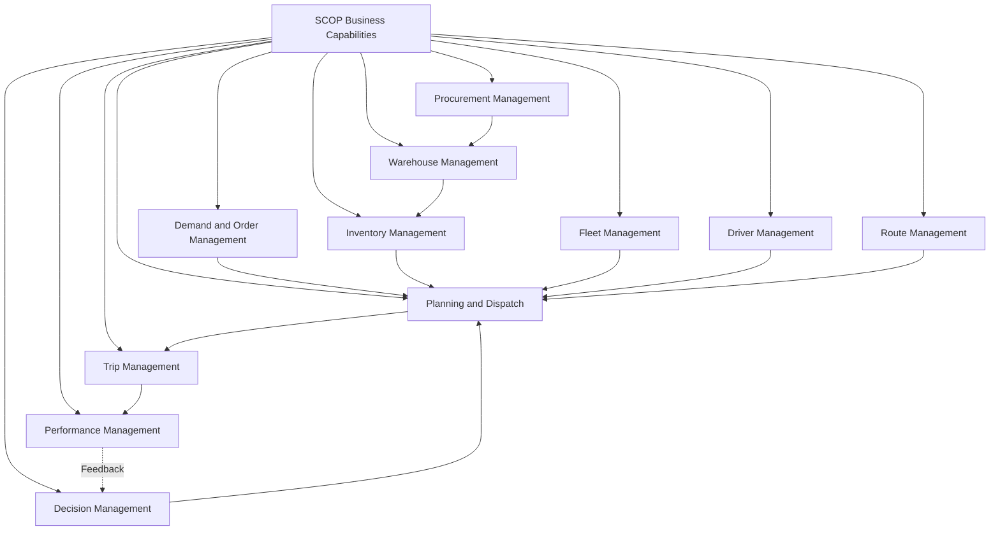
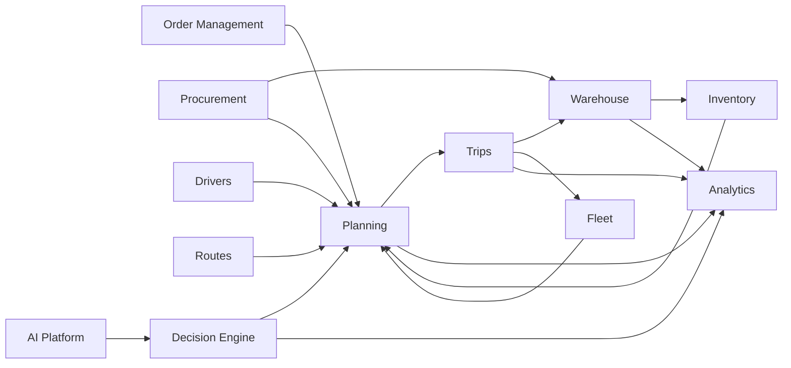
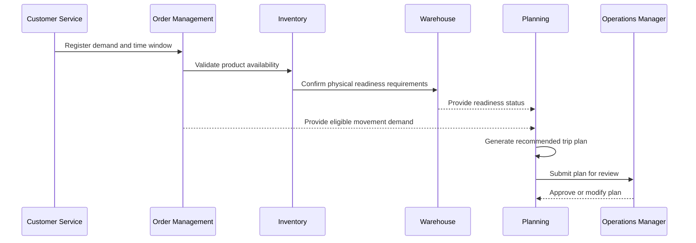
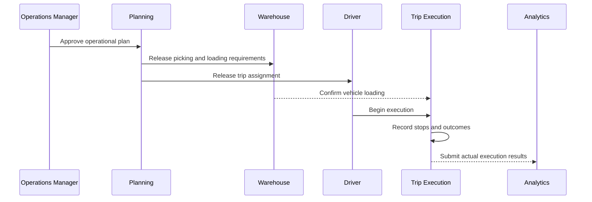
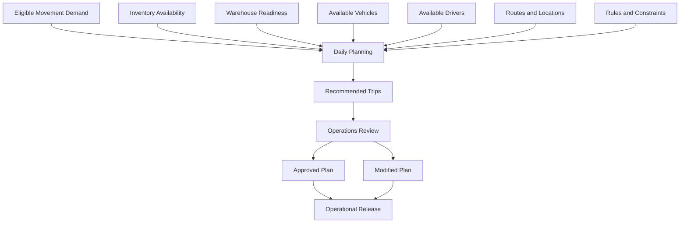
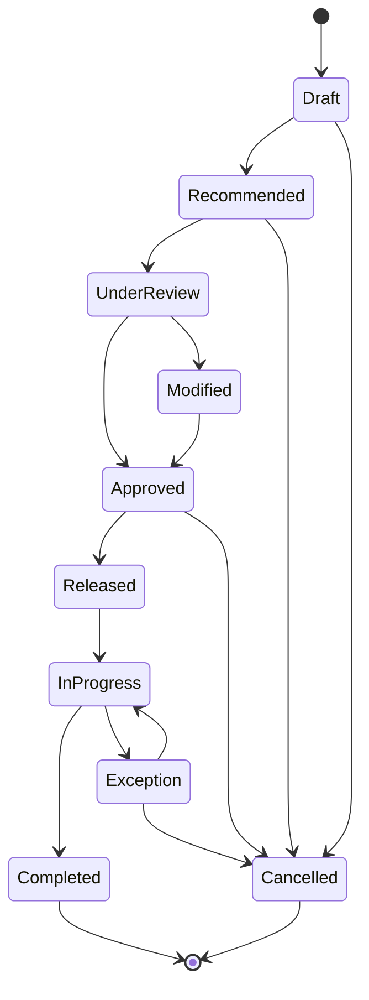

import DocumentInfo from '@site/src/components/DocumentInfo';

# بنية الأعمال

<DocumentInfo
  category="الأعمال"
  audience={['التنفيذيون', 'الأعمال', 'العمليات', 'المنتج', 'التقنية']}
  status="Approved"
  version="1.0"
  owner="فريق بنية الأعمال"
  updated="يوليو 2026"
  readingTime="12 دقيقة"
/>

## الغرض

تحدد بنية الأعمال كيفية عمل أنشطة المشتريات والتخزين والنقل والتوزيع في المؤسسة بوصفها سلسلة إمداد واحدة مترابطة.

وهي تترجم رؤية المنتج إلى نموذج أعمال منظم يحدد:

- القيمة التي تقدمها المنصة
- الأطراف المشاركة في عمليات سلسلة الإمداد
- القدرات الأساسية للأعمال
- العلاقات بين مجالات الأعمال
- تدفقات المعلومات التشغيلية الرئيسية
- مسؤوليات أدوار الأعمال
- القرارات المطلوبة لتخطيط العمليات وتنفيذها
- مبادئ الحوكمة التي تضبط تلك القرارات

تصف هذه الصفحة بنية الأعمال بشكل مستقل عن الشاشات التفصيلية أو نماذج قواعد البيانات أو واجهات برمجة التطبيقات (APIs) أو التنفيذ البرمجي.

## سياق الأعمال

توفر المؤسسة خدمات المشتريات والتخزين والنقل والتوزيع لسلاسل المطاعم وغيرها من أعمال خدمات الأغذية متعددة الفروع.

ويمكن للشركة أن:

- تشتري البضائع من موردين معتمدين
- تجمع البضائع من الموردين
- تستلم المخزون وتخزنه في المستودعات
- تنقل المخزون بين المستودعات
- تجمّع المنتجات في حمولات (Load) للمركبات
- تمرر المنتجات عبر العبور المباشر (Cross-Dock) دون تخزين طويل الأمد
- تجمع البضائع من مواقع خاضعة لسيطرة العملاء
- تعيد توزيع البضائع على فروع العملاء
- تسلّم الشحنات (Shipment) إلى عدة عملاء خلال رحلة (Trip) واحدة
- تنفذ عمليات الالتقاط (Pickup) والتسليم (Delivery) ضمن الرحلة نفسها
- تنسّق المركبات والسائقين والمسارات (Route) والأولويات والنوافذ الزمنية (Time Window)

تنشئ هذه المسؤوليات بيئة تشغيل متعددة الأطراف يجب فيها التنسيق المستمر بين التوريد والمخزون وجاهزية المستودعات وسعة النقل والتزامات العملاء.

## أهداف بنية الأعمال

صُممت بنية الأعمال في SCOP لتحقيق الأهداف التالية:

| الهدف | الوصف |
| --- | --- |
| العمليات المترابطة | ربط أنشطة المشتريات والمخزون والمستودعات والنقل والعملاء |
| الرؤية الشاملة من البداية إلى النهاية | إظهار الطلب التشغيلي والموارد والقيود وحالة التنفيذ |
| التخطيط المنسق | إنتاج خطة تشغيلية يومية واحدة تشمل الشحنات والمستودعات والمركبات والسائقين والوجهات |
| تحسين استخدام الموارد | تحسين استخدام المركبات والسائقين وسعة المستودعات ووقت النقل |
| موثوقية الخدمة | احترام أولويات العملاء والتزامات التسليم والنوافذ الزمنية (Time Windows) |
| قابلية تتبع القرارات | تسجيل كيفية توليد القرارات التشغيلية ومراجعتها وتغييرها واعتمادها |
| قابلية التوسع التشغيلي | دعم النمو في الطلبات والفروع والموردين والمستودعات والمركبات والرحلات |
| الأداء القابل للقياس | قياس نتائج الخدمة والتكلفة والسعة والتخطيط والتنفيذ |
| الأتمتة المضبوطة | زيادة الأتمتة تدريجيًا دون إلغاء المساءلة على مستوى الأعمال |

## منظومة الأعمال

تعمل منصة SCOP ضمن منظومة مترابطة من المشاركين الداخليين والخارجيين في الأعمال.



### المشاركون الخارجيون

| المشارك | الدور |
| --- | --- |
| المورد | يوفر المنتجات ويدعم ترتيبات الجمع أو التسليم |
| العميل | يتعاقد مع الشركة لشراء المنتجات أو تخزينها أو إدارتها أو توزيعها |
| فرع العميل | يستلم المنتجات أو يعمل كموقع للالتقاط (Pickup) أو النقل |
| مزود الخدمة الخارجي | قد يقدم خدمات داعمة معتمدة في عمليات تكامل مستقبلية |

### المشاركون الداخليون

| المشارك | الدور |
| --- | --- |
| فريق المشتريات | ينسق التوريد وطلبات الموردين ومتطلبات الوارد |
| فريق المستودعات | يستلم البضائع ويخزنها ويلتقطها ويجهزها ويحمّلها وينقلها ويعالج المرتجعات |
| فريق العمليات | يخطط وينسق المسارات والرحلات والمركبات والسائقين وتنفيذ الشحنات |
| السائقون | ينفذون أنشطة النقل المسندة إليهم |
| فريق خدمة العملاء | ينسق طلبات العملاء والأولويات والالتزامات والاستثناءات |
| فريق المالية | يراقب التكاليف والرسوم والسجلات التشغيلية ذات الصلة المالية |
| الإدارة | تراجع الأداء والسياسات والمخاطر والنتائج التشغيلية |
| إدارة النظام | تصون صلاحيات الوصول والإعدادات والبيانات الرئيسية وضوابط الحوكمة |

## سلسلة قيمة الأعمال

تدعم منصة SCOP سلسلة قيمة أعمال تبدأ بمتطلبات الطلب أو التوريد وتنتهي بالتسليم المؤكد والأداء المقاس.

```mermaid
flowchart LR
    Demand[Customer or Internal Demand]
    Procurement[Procurement and Sourcing]
    Inbound[Inbound Collection or Receipt]
    Warehouse[Warehouse Processing]
    Planning[Operational Planning]
    Transport[Trip Execution]
    Delivery[Delivery or Transfer Completion]
    Measurement[Performance Measurement]
    Demand --> Procurement
    Procurement --> Inbound
    Inbound --> Warehouse
    Warehouse --> Planning
    Planning --> Transport
    Transport --> Delivery
    Delivery --> Measurement
    Measurement -. Improvement Feedback .-> Planning
```



يجب أن تدعم سلسلة القيمة حالات متنوعة منها:

- وجود المنتجات مسبقًا في مخزون الشركة
- قيام الشركة بالجمع مباشرة من الموردين
- تسليم الموردين إلى مستودعات الشركة
- مرور المنتجات عبر عملية عبور مباشر (Cross-Dock)
- نشوء المنتجات من عميل أو من موقع مملوك للعميل
- انتقال المنتجات بين المستودعات
- احتواء الرحلة (Trip) على أنشطة التقاط وتسليم معًا
- تشارك عدة شحنات لعملاء مختلفين في مركبة واحدة

## القدرات الأساسية للأعمال

تصف قدرة الأعمال ما يجب أن تكون المؤسسة قادرة على أدائه، بشكل مستقل عن البرمجيات المستخدمة لأدائه.

### إدارة المشتريات

يجب أن تكون المؤسسة قادرة على:

- الحفاظ على معلومات الموردين المعتمدين
- إنشاء متطلبات المشتريات وإدارتها
- تنسيق طلبات الموردين
- تحديد التوافر المتوقع للمنتجات
- جدولة عمليات الجمع من الموردين أو تسجيلها
- ربط المنتجات الواردة بمتطلبات المستودعات والتوزيع
- مراقبة استثناءات المشتريات وتأخيراتها

### إدارة الطلبات والطلب التشغيلي (Order and Demand Management)

يجب أن تكون المؤسسة قادرة على:

- استقبال متطلبات العملاء ومتطلبات الحركة الداخلية
- تحديد العميل الطالب وفرع الوجهة
- تحديد المنتجات والكميات والأولويات والتواريخ المطلوبة
- تسجيل النوافذ الزمنية (Time Windows) للتسليم
- تسجيل متطلبات الالتقاط (Pickup)
- التمييز بين طلب التسليم للعملاء والنقل بين المستودعات والمرتجعات والجمع
- تتبع الطلب (Demand) من الإنشاء حتى الإكمال

### إدارة المستودعات

يجب أن تكون المؤسسة قادرة على:

- استلام البضائع
- فحص الاستلامات والتحقق من صحتها
- تخزين المخزون
- تتبع مواقع المخزون
- التقاط المنتجات وتجهيزها
- تحميل المركبات
- معالجة المرتجعات
- نقل البضائع بين المستودعات
- دعم عمليات العبور المباشر (Cross-Dock)
- تأكيد جاهزية المستودع للرحلات المخططة

### إدارة المخزون

يجب أن تكون المؤسسة قادرة على:

- تحديد الكميات المتاحة والمحجوزة
- تتبع ملكية المنتجات
- تتبع الموقع الفعلي للمخزون
- التمييز بين مخزون الشركة والمخزون المملوك للعملاء
- تحديد المخزون المخصص للشحنات أو الرحلات
- مراقبة حركات المخزون
- التحقق من التوافر قبل التخطيط
- دعم تدفقات مخزون تشغيلية مستقلة عند الحاجة

### إدارة الأسطول

يجب أن تكون المؤسسة قادرة على:

- الحفاظ على سجلات المركبات المملوكة للشركة
- تحديد قيود السعة
- تتبع توافر المركبات
- تتبع الحالة التشغيلية
- إسناد المركبات إلى الرحلات
- منع الإسنادات المتعارضة
- مراقبة استخدام المركبات
- الحفاظ على معلومات تشغيل المركبات ذات الصلة

### إدارة السائقين

يجب أن تكون المؤسسة قادرة على:

- الحفاظ على سجلات السائقين
- منح صلاحيات الوصول المناسبة إلى النظام
- تتبع التوافر
- إسناد السائقين إلى الرحلات
- منع الإسنادات المتداخلة
- تسجيل المشاركة في تنفيذ الرحلات
- دعم الوصول المستقبلي عبر تطبيق الهاتف المحمول

### إدارة المسارات (Route Management)

يجب أن تكون المؤسسة قادرة على:

- تعريف مسارات تشغيلية قابلة لإعادة الاستخدام
- ربط المواقع بهياكل المسارات
- تحديد التسلسل المتوقع أو التغطية الجغرافية
- تقدير مدة المسار ومسافته حيثما توفر ذلك
- الحفاظ على المسارات النشطة وغير النشطة
- إعادة استخدام المسارات عبر رحلات متعددة

### إدارة الرحلات (Trip Management)

يجب أن تكون المؤسسة قادرة على:

- إنشاء رحلات تشغيلية مؤرخة
- إسناد المركبات والسائقين
- إسناد الشحنات والحمولات
- تحديد محطات التوقف (Stop) للالتقاط والتسليم
- ترتيب تسلسل محطات التوقف في الرحلة
- تحديد أوقات المغادرة والوصول المخططة
- تتبع حالة الرحلة
- تسجيل نتائج التنفيذ الفعلية
- إدارة استثناءات الرحلات والمرتجعات

### التخطيط والإرسال

يجب أن تكون المؤسسة قادرة على:

- تحديد الطلب الذي يتطلب التنفيذ
- التحقق من المخزون وجاهزية المستودعات
- تجميع الشحنات المتوافقة
- تقييم المسارات وبدائل الرحلات
- تقييم المركبات والسائقين المتاحين
- احترام قيود السعة والنوافذ الزمنية
- توليد خطة يومية موصى بها
- السماح بالمراجعة والتعديل المصرح بهما
- اعتماد الرحلات وإطلاقها
- مراقبة تنفيذ الخطة

### إدارة القرارات

يجب أن تكون المؤسسة قادرة على:

- تعريف قواعد القرار
- تحديد القيود التشغيلية
- توليد التوصيات (Recommendation)
- شرح العوامل الكامنة وراء التوصيات
- مقارنة البدائل
- تسجيل الاعتمادات والتجاوزات
- قياس نتائج التوصيات
- تحسين جودة القرارات المستقبلية

### إدارة الأداء

يجب أن تكون المؤسسة قادرة على:

- قياس استخدام الأسطول
- مراقبة أداء الخدمة
- تحليل كفاءة التخطيط
- مراقبة التنسيق مع المستودعات
- قياس تجميع الشحنات
- تقييم كفاءة الرحلات
- تحليل التكلفة
- مراقبة قبول القرارات وتجاوزها
- تحديد الاستثناءات والاتجاهات التشغيلية

## خريطة القدرات



## مجالات الأعمال

تجمع منصة SCOP القدرات المترابطة في مجالات أعمال.

| المجال | المسؤولية الرئيسية |
| --- | --- |
| المشتريات | التوريد من الموردين ومتطلبات المنتجات الواردة |
| إدارة الطلبات | طلب العملاء والفروع والحركة الداخلية |
| المستودعات | الاستلام الفعلي والتخزين والمناولة والتجهيز والتحميل والنقل |
| المخزون | توافر المنتجات وملكيتها وتخصيصها وحركتها |
| الأسطول | سجلات المركبات والسعة والحالة والتوافر والاستخدام |
| السائقون | توافر السائقين وإسنادهم وصلاحيات وصولهم ومشاركتهم في التنفيذ |
| المسارات | المسارات القابلة لإعادة الاستخدام وهياكل المواقع |
| الرحلات | تنفيذ النقل المؤرخ ومحطات التوقف والموارد والحالات |
| التخطيط | التنسيق اليومي للطلب والشحنات والمركبات والسائقين والرحلات |
| Decision Engine (محرك القرارات) | القواعد والقيود والتوصيات والتفسيرات والاعتمادات |
| AI Platform (منصة الذكاء الاصطناعي) | التنبؤ والمساعدة في التحسين والتعلم ودعم التوصيات |
| التحليلات | مؤشرات الأداء الرئيسية (KPIs) والتقارير والاتجاهات والتكاليف والخدمة ونتائج القرارات |
| الإدارة والتهيئة | المستخدمون والصلاحيات والإعدادات والبيانات الرئيسية والحوكمة |

المجالات هي مناطق أعمال مترابطة وليست تطبيقات معزولة.

لا ينبغي لأي مجال أن يكرر ملكية المعلومات المرجعية الموثوقة نفسها للأعمال.

## علاقات المجالات



## كائنات الأعمال الأساسية

تشكل الكائنات التالية لغة الأعمال المشتركة لمنصة SCOP.

| كائن الأعمال | التعريف |
| --- | --- |
| المورد | طرف خارجي يوفر المنتجات |
| العميل | مؤسسة تتلقى خدمات المشتريات أو التوزيع |
| الفرع | موقع تابع للعميل قد يستلم المنتجات أو يوفرها |
| Warehouse (المستودع) | منشأة مُدارة تُستخدم للاستلام أو التخزين أو التجهيز أو النقل أو العبور المباشر |
| المنتج | صنف يجري شراؤه أو تخزينه أو نقله أو جمعه أو تسليمه |
| Order (الطلب) | متطلب أعمال يخص المنتجات أو الحركة |
| Shipment (الشحنة) | مجموعة منطقية من البضائع تتطلب النقل |
| Load (الحمولة) | البضاعة الفعلية المسندة إلى مركبة |
| Vehicle (المركبة) | مورد نقل مملوك للشركة |
| Driver (السائق) | شخص مصرح له بتنفيذ رحلات المركبات |
| Route (المسار) | مسار تشغيلي محدد مسبقًا قابل لإعادة الاستخدام |
| Trip (الرحلة) | تنفيذ مجدول يتضمن الموارد والشحنات ومحطات التوقف والأوقات المخططة |
| Stop (محطة التوقف) | موقع تجري زيارته خلال الرحلة |
| Pickup (الالتقاط) | نشاط يجري فيه تحميل المنتجات عند محطة توقف |
| Delivery (التسليم) | نشاط يجري فيه تفريغ المنتجات عند محطة توقف |
| Time Window (النافذة الزمنية) | النطاق الزمني المسموح به أو الملتزم به لخدمة موقع ما |
| Decision (القرار) | إجراء تشغيلي مختار من بين البدائل المتاحة |
| Recommendation (التوصية) | قرار مقترح تولده القواعد أو التحسين أو الذكاء الاصطناعي |
| Exception (الاستثناء) | حالة تتطلب الانتباه لأن التنفيذ المخطط لا يمكن أن يستمر بشكل طبيعي |

يجب استخدام هذه المصطلحات بشكل متسق عبر توثيق الأعمال والتوثيق الوظيفي والتقني وتوثيق الذكاء الاصطناعي.

## تدفقات المعلومات الرئيسية

### من الطلب إلى التخطيط



### من الخطة المعتمدة إلى التنفيذ



## نموذج التخطيط

يجمع التخطيط التشغيلي اليومي بين الطلب والتوريد والمخزون وجاهزية المستودعات وموارد الأسطول وتوافر السائقين والتزامات العملاء.

يجب أن تقيّم عملية التخطيط:

- تواريخ الالتقاط والتسليم المطلوبة
- النوافذ الزمنية للعملاء
- توافر المنتجات والشحنات
- جاهزية المستودعات
- سعة المركبات
- توافر المركبات
- توافر السائقين
- توافق المسارات
- تسلسل محطات التوقف
- مدة التنقل
- مدة الخدمة
- توافق الشحنات
- فرص العبور المباشر (Cross-Dock)
- متطلبات النقل بين المستودعات
- أولوية الطلبات
- التكلفة التشغيلية
- الأداء المتوقع للخدمة

والمخرَج هو خطة يومية موصى بها تتضمن الرحلات المقترحة وإسنادات الموارد.



## نموذج القرار

تتعامل منصة SCOP مع الإجراءات التشغيلية الرئيسية باعتبارها قرارات مضبوطة.

يجب أن يتضمن القرار (Decision):

| العنصر | الوصف |
| --- | --- |
| نوع القرار | فئة القرار الذي يجري اتخاذه |
| السياق | الموقف التشغيلي الذي يتطلب القرار |
| المدخلات | البيانات المستخدمة أثناء التقييم |
| البدائل | الخيارات الممكنة المتاحة |
| القواعد | سياسات الأعمال الإلزامية |
| القيود | حدود السعة أو الوقت أو الموارد أو حدود تشغيلية أخرى |
| الأهداف | النتائج التي يجري تحسينها أو حمايتها |
| التوصية | البديل المقترح المختار |
| التفسير | الأسباب الرئيسية الكامنة وراء التوصية |
| الاعتماد | نتيجة المراجعة المصرح بها |
| القرار النهائي | الإجراء الذي أُطلق للتنفيذ |
| النتيجة | نتيجة التنفيذ المقاسة |

تشمل أمثلة القرارات المدارة:

- أي مركبة ينبغي أن تنفذ الرحلة؟
- أي الشحنات ينبغي تجميعها معًا؟
- أي مستودع ينبغي أن يلبي المتطلب؟
- هل ينبغي تخزين المنتجات أم تمريرها عبر العبور المباشر (Cross-Dock)؟
- أي مسار ينبغي استخدامه؟
- ما التسلسل الذي ينبغي أن تتبعه محطات التوقف؟
- أي طلب ينبغي أن يحظى بالأولوية؟
- هل ينبغي اعتماد الخطة المقترحة أو تغييرها أو رفضها؟

## نموذج الاعتماد البشري

في المراحل الأولى من المنتج، يحتفظ مدير العمليات بالسيطرة على الإطلاق التشغيلي اليومي.

يجب أن يكون المدير قادرًا على:

1. مراجعة الخطة المقترحة كاملة.
2. فحص الرحلات ومحطات التوقف والحمولات والمركبات والسائقين.
3. مراجعة القيود المهمة وتفسيرات التوصيات.
4. تعديل الإسنادات أو التسلسلات حيثما كان مصرحًا له بذلك.
5. اعتماد الخطة.
6. رفض الخطط غير المكتملة أو إعادتها.
7. إطلاق الرحلات المعتمدة للتنفيذ.

يجب أن يسجل النظام الفرق بين التوصية المولدة والخطة التشغيلية المعتمدة.

:::info

تدعم توصيات الذكاء الاصطناعي الحكم التشغيلي، وهي لا تلغي مسؤولية مستخدمي الأعمال المصرح لهم.

:::

## الأدوار والمسؤوليات

| الدور | المسؤوليات الرئيسية |
| --- | --- |
| مدير العمليات | يراجع الخطط ويعتمدها ويدير الاستثناءات ويراقب التنفيذ |
| المخطط أو المرسل | يجهز الطلب ويراجع التوصيات ويعدل الخطط وينسق الموارد |
| مستخدم المشتريات | يدير متطلبات الموردين وتوافر الوارد |
| مستخدم المستودع | ينفذ الاستلامات والالتقاط والتجهيز والتحميل والنقل والعبور المباشر والمرتجعات |
| السائق | ينفذ الرحلات المسندة إليه ويسجل التقدم التشغيلي |
| مستخدم خدمة العملاء | يحافظ على طلبات العملاء والأولويات والفروع والالتزامات |
| مستخدم المالية | يراجع المعلومات التشغيلية ذات الصلة المالية والتكاليف |
| مستخدم الإدارة | يراجع مؤشرات الأداء الرئيسية (KPIs) والمخاطر والخدمة والتكلفة وأداء السعة |
| مسؤول النظام | يصون الإعدادات والمستخدمين والصلاحيات والبيانات الرئيسية |

ستُحدد صلاحيات الوصول التفصيلية في المواصفات الوظيفية اللاحقة.

## مبادئ حوكمة الأعمال

### الملكية الواضحة

يجب أن يكون لكل كائن أعمال وعملية وقرار ومؤشر أداء رئيسي (KPI) مالك خاضع للمساءلة.

### المصطلحات المعتمدة

يجب أن تستخدم مفاهيم الأعمال المصطلحات المعتمدة المحددة في مركز المعرفة (Knowledge Hub).

### الإعدادات المضبوطة

يجب أن تكون القواعد التشغيلية وتغييرات الإعدادات مصرحًا بها وقابلة للتتبع.

### فصل المسؤوليات

لا ينبغي لأي دور منفرد أن يؤدي إجراءات غير متوافقة دون ضوابط اعتماد مناسبة.

وقد تشمل الأمثلة:

- إنشاء الخطة التشغيلية عالية المخاطر نفسها واعتمادها في آن واحد
- تعديل البيانات الرئيسية واعتماد المعاملات المتأثرة بها بشكل مستقل
- تغيير قواعد القرار دون مراجعة مصرح بها

### قابلية تتبع القرارات

يجب الاحتفاظ بالتوصيات التشغيلية والاعتمادات والتجاوزات والنتائج.

### مسؤولية جودة البيانات

مستخدمو الأعمال مسؤولون عن الحفاظ على بيانات تشغيلية كاملة وموثوقة ضمن مناطق ملكيتهم.

### إدارة الاستثناءات

يجب أن تحدد المنصة المواقف التي لا يمكن فيها اتباع قواعد الأعمال أو الخطط الاعتيادية.

ويجب أن تكون الاستثناءات (Exceptions) مرئية ومسندة وخاضعة للتحقيق ومحلولة.

### التحسين المستمر

يجب استخدام نتائج التنفيذ لتحسين القواعد والعمليات وجودة التخطيط والتوصيات المستقبلية.

## أساس قواعد الأعمال

ستُوثق قواعد الأعمال التفصيلية بشكل منفصل، لكن يجب أن تتبع جميع القواعد المبادئ التالية:

- يجب أن يكون لكل قاعدة معرف فريد.
- يجب أن يكون لكل قاعدة غرض أعمال واضح.
- يجب تحديد المالك المسؤول.
- يجب تعريف المحفز والسلوك المتوقع.
- يجب توثيق الاستثناءات.
- يجب أن تكون القاعدة قابلة للاختبار.
- يجب أن تخضع التغييرات للتحكم في الإصدارات.
- يجب أن تكون قواعد Decision Engine قابلة للتفسير.

مثال على صيغة المعرف:

```text
BR-PLN-001
BR-FLT-001
BR-WHS-001
BR-TRP-001
```

## الحالات التشغيلية

يجب أن تستخدم الكائنات التشغيلية نماذج حالات مضبوطة.

قد تتضمن دورة الحياة النموذجية للرحلة (Trip) ما يلي:



يجب أن يكون لكل انتقال:

- جهة فاعلة مصرح بها
- محفز محدد
- متطلبات تحقق
- طابع زمني مسجل
- سياق تشغيلي قابل للتتبع

ستُوثق تعريفات دورات الحياة التفصيلية في مواصفات المجالات ذات الصلة.

## إطار الأداء

يجب قياس أداء الأعمال عبر عدة أبعاد.

| البعد | الغرض |
| --- | --- |
| الخدمة | قياس أداء الالتقاط والتسليم والنوافذ الزمنية |
| السعة | قياس استخدام المركبات والحمولات |
| الإنتاجية | قياس المخرجات نسبة إلى الجهد التشغيلي |
| التكلفة | قياس تكلفة النقل والمستودعات وتلبية الطلبات |
| الموثوقية | قياس التنفيذ الناجح ومعدلات الاستثناءات |
| التخطيط | قياس وقت التخطيط والتغييرات وقبول التوصيات |
| المستودعات | قياس أداء الجاهزية والتجهيز والتحميل والنقل |
| جودة القرارات | قياس الاعتمادات والتجاوزات والثقة والنتائج |
| جودة البيانات | قياس اكتمال البيانات التشغيلية وصحتها وحسن توقيتها |

تحدد بنية الأعمال مجالات القياس، وستُوثق صيغ مؤشرات الأداء الرئيسية (KPI) التفصيلية وأهدافها لاحقًا.

## حدود البنية

تحدد بنية الأعمال هذه:

- سياق تشغيل الأعمال
- القدرات الأساسية للأعمال
- مجالات الأعمال
- المشاركين في الأعمال
- تدفقات المعلومات
- مسؤوليات القرارات
- مبادئ الحوكمة
- أبعاد الأداء

وهي لا تحدد:

- تصاميم واجهات المستخدم التفصيلية
- جداول قواعد البيانات
- حمولات واجهات برمجة التطبيقات (API)
- بنية الشيفرة المصدرية
- إعدادات Odoo التفصيلية
- المتطلبات الوظيفية الكاملة
- خوارزميات التحسين التفصيلية
- ضوابط تنفيذ الأمان

ستُعالج هذه الموضوعات في أقسام التوثيق اللاحقة.

## الملخص

تربط منصة SCOP المشتريات والطلبات والمستودعات والمخزون والمركبات والسائقين والمسارات والرحلات والتخطيط والقرارات والتحليلات ضمن بنية أعمال واحدة.

وقد صُممت البنية حول العمليات المنسقة بدلًا من العمليات الإدارية المعزولة.

ومبدأ التشغيل المركزي فيها هو أن البيانات الموثوقة والقواعد المحددة والقيود التشغيلية والمساءلة البشرية والنتائج القابلة للقياس يجب أن توجه كل قرار مهم في سلسلة الإمداد.

## الصفحات ذات الصلة

- [نظام تصميم التوثيق](../getting-started/documentation-design-system.mdx)
- [مخطط المنتج](../product/product-blueprint.mdx)
- نموذج التشغيل
- مجالات الأعمال
- قواعد الأعمال
- محرك قرارات سلسلة الإمداد (Supply Chain Decision Engine)
