import DocumentInfo from '@site/src/components/DocumentInfo';

# نطاقات الأعمال

<DocumentInfo
  category="الأعمال"
  audience={['الإدارة التنفيذية', 'الأعمال', 'العمليات', 'المنتج', 'التقنية', 'البيانات']}
  status="Approved"
  version="1.0"
  owner="فريق بنية الأعمال"
  updated="يوليو 2026"
  readingTime="15 دقيقة"
/>

## الغرض

تقسّم نطاقات الأعمال منصة SCOP إلى مجالات متماسكة من مسؤولية الأعمال.

يمثل كل نطاق مجموعة مترابطة من:

- قدرات الأعمال
- العمليات التشغيلية
- كائنات الأعمال
- القواعد
- القرارات
- الأدوار
- المعلومات
- مقاييس الأداء

يساعد نموذج النطاقات SCOP على تجنّب ازدواجية المسؤولية وغموض الملكية.

وهو يوفر بنية مشتركة لكل من:

- تحليل الأعمال
- تخطيط المنتج
- تهيئة Odoo
- تصميم وحدات Odoo
- تصميم محرك القرار (Decision Engine)
- تخطيط قدرات الذكاء الاصطناعي
- تصميم التكامل
- حوكمة البيانات
- الأمان
- إعداد التقارير
- ملكية التوثيق

نطاق الأعمال ليس مكافئًا تلقائيًا لوحدة Odoo أو خدمة برمجية أو قسم أو واجهة مستخدم.

فقد يُدعم نطاق أعمال واحد بعدة مكوّنات تقنية، بينما قد يدعم مكوّن تقني واحد عدة نطاقات أعمال.

## مبادئ تصميم النطاقات

### وضوح المسؤولية

يجب أن يكون لكل نطاق مسؤولية أعمال محددة.

ويجب أن يكون النطاق قادرًا على الإجابة عن الأسئلة التالية:

- ما نتائج الأعمال التي يمتلكها؟
- ما كائنات الأعمال التي يديرها؟
- ما القواعد التي يفرضها؟
- ما القرارات التي تنشأ داخله؟
- ما الأدوار التي تشغّله؟
- ما المعلومات التي يقدّمها للنطاقات الأخرى؟

### حدود صريحة

يحدد حد النطاق ما ينتمي إلى داخل النطاق وما ينتمي إلى غيره.

تقلّل الحدود من:

- ازدواجية منطق الأعمال
- تعارض تعريفات الحالات
- غموض ملكية البيانات
- التكاملات غير المنضبطة
- تكرار التهيئة
- عدم اتساق التقارير

### مالك مرجعي واحد

يجب أن يكون لكل كائن أعمال مهم أو تعريف مهم مالك مرجعي واحد.

يجوز للنطاقات الأخرى استهلاك الكائن أو الإشارة إليه أو إثراؤه أو التصرف بناءً عليه، لكن يجب ألا تُنشئ نسخًا مرجعية متعارضة منه.

### تعاون منضبط

تتعاون النطاقات من خلال تدفقات أعمال وتبادلات معلومات محددة.

ويجب ألا يعتمد أي نطاق على افتراضات خفية بشأن نطاق آخر.

### الأعمال قبل التقنية

يجب أن تتبع حدود النطاقات مسؤولية الأعمال قبل بنية البرمجيات.

وينبغي أن تدعم بنية Odoo والخدمات النهائية نموذج النطاقات بدلًا من تحديده بشكل اعتباطي.

### قابلية التتبع عبر النطاقات

يجب أن تبقى العمليات العابرة للنطاقات قابلة للتتبع بدءًا من:

- الطلب (Demand) الأصلي
- المخزون والملكية
- مصدر الشراء أو الأمر
- الشحنة (Shipment)
- الحمولة (Load)
- الرحلة (Trip)
- القرار
- الاعتماد
- التنفيذ
- الاستثناء
- النتيجة

## المشهد العام لنطاقات SCOP

تنتظم SCOP في نطاقات الأعمال الرئيسية التالية:

1. إدارة الأطراف والمواقع (Party and Location Management)
2. إدارة المنتجات والمناولة (Product and Handling Management)
3. المشتريات والتوريد الوارد (Procurement and Inbound Supply)
4. إدارة العملاء والطلب (Customer and Demand Management)
5. إدارة المخزون والملكية (Inventory and Ownership Management)
6. عمليات المستودعات (Warehouse Operations)
7. إدارة الشحنات والحمولات (Shipment and Load Management)
8. إدارة الأسطول والسائقين (Fleet and Driver Management)
9. إدارة المسارات والرحلات (Route and Trip Management)
10. إدارة التخطيط والقرارات (Planning and Decision Management)
11. إدارة التنفيذ والاستثناءات (Execution and Exception Management)
12. الأداء والتحليلات (Performance and Analytics)
13. حوكمة المنصة وإدارتها (Platform Governance and Administration)

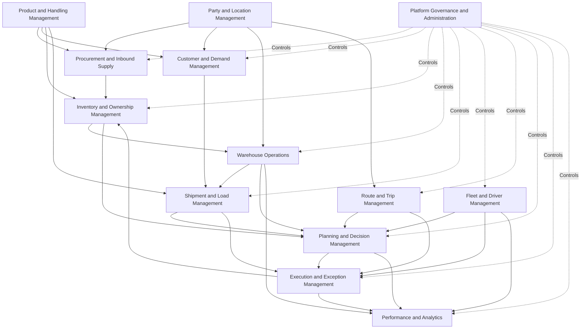

## تصنيف النطاقات

يمكن تصنيف النطاقات وفقًا لدورها داخل SCOP.

| التصنيف | النطاقات |
| --- | --- |
| النطاقات التأسيسية | الأطراف والمواقع؛ المنتجات والمناولة |
| نطاقات العرض والطلب | المشتريات والتوريد الوارد؛ العملاء والطلب |
| نطاقات التحكم المادي | المخزون والملكية؛ عمليات المستودعات |
| نطاقات النقل | الشحنات والحمولات؛ الأسطول والسائقون؛ المسارات والرحلات |
| نطاقات القرار والتنفيذ | التخطيط والقرارات؛ التنفيذ والاستثناءات |
| النطاقات الإدارية | الأداء والتحليلات؛ حوكمة المنصة وإدارتها |

توفر النطاقات التأسيسية تعريفات مشتركة.

وتدير النطاقات التشغيلية النشاط المادي والمعاملاتي.

وتنسّق نطاقات القرار البدائل والاعتمادات.

وتوفر النطاقات الإدارية التحكم والقياس والتهيئة والحوكمة.

## نموذج تفاعل النطاقات

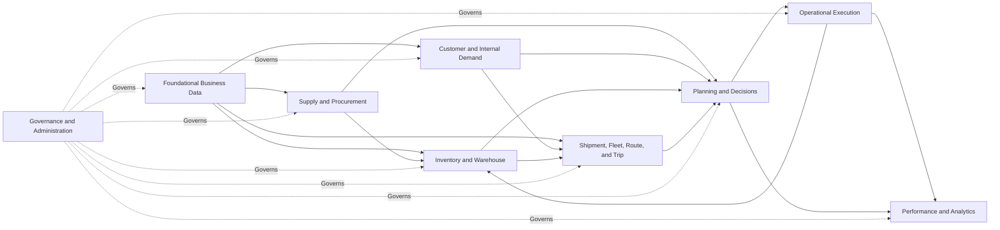

## 1. إدارة الأطراف والمواقع (Party and Location Management)

### الغرض

يتولى نطاق إدارة الأطراف والمواقع صيانة بيانات المنظمات والأشخاص والفروع والمنشآت والمواقع التشغيلية المشاركة في عمليات SCOP.

### المسؤوليات

يتولى النطاق المسؤولية عن:

- العملاء
- فروع العملاء
- المورّدين
- مواقع المورّدين
- كيانات الشركة
- المستودعات (Warehouses)
- منشآت العبور السريع (Cross-dock)
- مواقع الالتقاط
- مواقع التسليم
- مواقع الإرجاع
- معلومات الاتصال
- الإحداثيات الجغرافية
- ساعات العمل
- تعليمات الوصول
- قيود المواقع
- نوافذ الخدمة الزمنية

### كائنات الأعمال الرئيسية

| الكائن | الوصف |
| --- | --- |
| Party (الطرف) | عميل أو مورّد أو كيان تابع للشركة أو منظمة أخرى معتمدة |
| Contact (جهة الاتصال) | شخص مرتبط بطرف أو موقع |
| Operational Location (الموقع التشغيلي) | مكان مادي يُستخدم للاستلام أو الالتقاط أو التخزين أو التسليم أو التحويل أو الإرجاع |
| Customer Branch (فرع العميل) | وجهة أو نقطة تجميع يشغّلها العميل |
| Supplier Location (موقع المورّد) | موقع مصدر أو خدمة يشغّله المورّد |
| Warehouse (المستودع) | منشأة تخزين ومعالجة تديرها الشركة أو مصرّح بها |
| Location Time Window (النافذة الزمنية للموقع) | فترة خدمة مسموح بها أو مفضّلة |
| Location Constraint (قيد الموقع) | قيد يتعلق بالوصول أو المركبات أو التوقيت أو المناولة |

### قواعد النطاق

من الأمثلة على ذلك:

- يجب أن يرتبط كل موقع تشغيلي بطرف مصرّح له أو كيان تابع للشركة.
- يجب أن يمتلك الموقع المستخدم في التخطيط معلومات تشغيلية كافية.
- يجب تحديد نوافذ الخدمة الإلزامية بشكل صريح.
- يجب عدم إسناد الأطراف والمواقع غير النشطة إلى طلب تشغيلي جديد.
- يجب أن تميّز المعلومات الجغرافية بين الإحداثيات الموثَّقة والمعلومات غير الموثَّقة.

### مخرجات النطاق

يوفر النطاق:

- مواقع مصدر ووجهة صالحة
- ملكية الأطراف ومسؤوليتها
- ساعات العمل
- نوافذ الخدمة
- قيود الوصول
- مراجع الاتصال والتواصل
- معلومات التخطيط الجغرافي

### دور Odoo

قد توفر قدرات Odoo الخاصة بالشركاء وجهات الاتصال والمستودعات والمواقع الأساس التشغيلي.

وقد تضيف امتدادات SCOP سمات لوجستية متخصصة للفروع والنوافذ الزمنية والوصول والجوانب الجغرافية.

## 2. إدارة المنتجات والمناولة (Product and Handling Management)

### الغرض

يعرّف نطاق إدارة المنتجات والمناولة السلع المُدارة أو المنقولة عبر SCOP والشروط اللازمة لمناولتها بشكل آمن وصحيح.

### المسؤوليات

يتولى النطاق المسؤولية عن:

- تعريفات المنتجات
- فئات المنتجات
- وحدات القياس
- الوزن
- الحجم
- الأبعاد
- التغليف
- معلومات المنصات (Pallets)
- متطلبات درجة الحرارة
- القابلية للكسر
- تصنيفات الخطورة أو التقييد حيثما ينطبق ذلك
- مجموعات التوافق
- متطلبات التحميل
- متطلبات التخزين
- سمات مدة الصلاحية وانتهائها
- متطلبات ضبط الجودة

### كائنات الأعمال الرئيسية

| الكائن | الوصف |
| --- | --- |
| Product (المنتج) | صنف مادي يُشترى أو يُخزَّن أو يُحوَّل أو يُسلَّم أو يُرجَع |
| Product Category (فئة المنتج) | تجميع منضبط لمنتجات مترابطة |
| Unit of Measure (وحدة القياس) | قياس الكمية المعتمد |
| Package (العبوة) | وحدة تغليف للنقل أو التخزين |
| Handling Profile (ملف المناولة) | الشروط اللازمة لتخزين المنتج أو نقله |
| Compatibility Group (مجموعة التوافق) | تصنيف يتحكم في المنتجات التي يجوز أن تتشارك المساحة |
| Capacity Profile (ملف السعة) | خصائص الوزن أو الحجم أو المنصات أو الصناديق أو الوحدات |
| Shelf-Life Profile (ملف مدة الصلاحية) | متطلبات انتهاء الصلاحية والعمر المتبقي |

### قواعد النطاق

من الأمثلة على ذلك:

- يجب أن يكون لكل منتج منقول وحدة قياس معتمدة.
- يجب أن تمتلك المنتجات المستخدمة في تخطيط السعة معلومات كافية عن الوزن أو الحجم.
- يجب عدم تجاهل متطلبات درجة الحرارة والمناولة الإلزامية.
- يجب عدم دمج المنتجات غير المتوافقة في الحمولة نفسها أو المقصورة نفسها.
- يجب عدم استنتاج ملكية المنتج من تعريف المنتج ذاته.
- تتطلب تغييرات البيانات الرئيسية للمنتجات المؤثرة في التخطيط تحققًا منضبطًا.

### مخرجات النطاق

يوفر النطاق:

- هوية المنتج
- متطلبات السعة
- شروط التخزين
- شروط النقل
- قواعد التوافق
- متطلبات التغليف
- متطلبات الجودة ومدة الصلاحية

### دور Odoo

توفر سجلات المنتجات ووحدات القياس في Odoo الأساس الرئيسي للمنتجات.

وقد توسّع SCOP هذه السجلات بسمات لوجستية وسمات توافق ومناولة.

## 3. المشتريات والتوريد الوارد (Procurement and Inbound Supply)

### الغرض

يدير نطاق المشتريات والتوريد الوارد متطلبات التوريد الخارجي والوصول المتوقع للسلع من المورّدين.

### المسؤوليات

يتولى النطاق المسؤولية عن:

- متطلبات الشراء
- طلبات عروض الأسعار حيثما ينطبق ذلك
- أوامر الشراء
- التزامات المورّدين
- تواريخ الاستلام المتوقعة
- متطلبات الالتقاط من المورّدين
- توقعات الشحنات الواردة
- حالة تسليم المورّدين
- التوريد الجزئي
- استثناءات المشتريات
- المرتجعات المتعلقة بالمورّدين
- معلومات التوافر الوارد

### كائنات الأعمال الرئيسية

| الكائن | الوصف |
| --- | --- |
| Purchase Requirement (متطلب الشراء) | حاجة أعمال تتطلب توريدًا خارجيًا |
| Purchase Order (أمر الشراء) | التزام معتمد تجاه مورّد |
| Supplier Commitment (التزام المورّد) | المنتج والكمية والتاريخ والموقع المتوقعة |
| Inbound Requirement (المتطلب الوارد) | متطلب لاستلام السلع أو التقاطها |
| Supplier Collection (الالتقاط من المورّد) | حركة تتطلب التقاطًا تنظمه الشركة |
| Inbound Exception (الاستثناء الوارد) | تأخير أو نقص أو رفض أو مشكلة توريد أخرى |

### دورة حياة النطاق

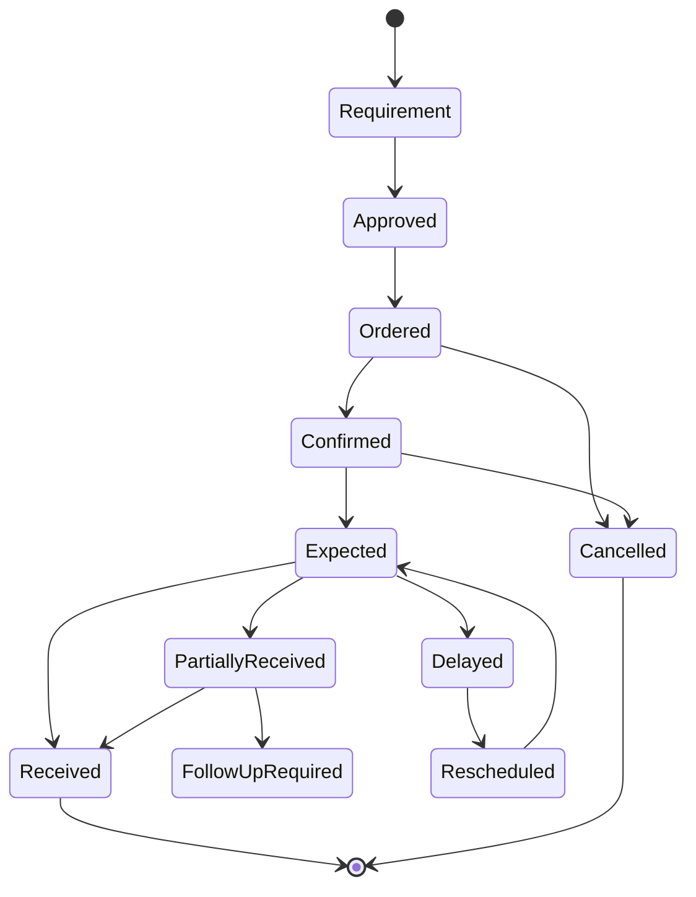

### قواعد النطاق

من الأمثلة على ذلك:

- يجب أن يحدد المتطلب الوارد المورّد والمنتجات والكميات والوجهة.
- يجب أن يدخل طلب الالتقاط من المورّدين في تخطيط النقل.
- يجب عدم التعامل مع التوريد المتوقع باعتباره مخزونًا متاحًا فعليًا.
- يجب أن يحافظ الاستلام الجزئي على الكمية المتبقية.
- يجب أن تُنشئ تأخيرات المورّدين المؤثرة في خطة معتمدة استثناءً تشغيليًا أو تؤدي إلى إطلاقه.

### مخرجات النطاق

يوفر النطاق:

- المخزون الوارد المتوقع
- طلب الالتقاط من المورّدين
- تواريخ الاستلام المتوقعة
- حالة التزامات المورّدين
- أولويات المشتريات
- مخاطر التوريد الوارد واستثناءاته

### دور Odoo

توفر تطبيقات المشتريات والمخزون في Odoo الأساس الرئيسي لأوامر الشراء والاستلام.

وتستخدم SCOP هذه السجلات كمدخلات لقرارات المخزون والمستودعات والتخطيط.

## 4. إدارة العملاء والطلب (Customer and Demand Management)

### الغرض

يلتقط نطاق إدارة العملاء والطلب متطلبات العملاء والفروع والمتطلبات الداخلية والاستثنائية التي قد تتطلب تخصيص مخزون أو حركة مادية.

### المسؤوليات

يتولى النطاق المسؤولية عن:

- أوامر العملاء
- إعادة تزويد الفروع
- طلبات الالتقاط من العملاء
- الطلب الداخلي
- تواريخ التسليم المطلوبة
- النوافذ الزمنية للعملاء
- أولويات الطلب
- التزامات الخدمة
- التحقق من الطلب
- أهلية الطلب
- إلغاء الطلب
- التغييرات المطلوبة من العملاء
- الاستثناءات المتعلقة بالطلب

### كائنات الأعمال الرئيسية

| الكائن | الوصف |
| --- | --- |
| Customer Order (أمر العميل) | متطلب عميل لمنتجات أو خدمات |
| Movement Demand (طلب الحركة) | متطلب لنقل السلع بين المواقع |
| Branch Replenishment (إعادة تزويد الفرع) | طلب يهدف إلى إعادة تزويد فرع عميل |
| Internal Demand (الطلب الداخلي) | متطلب تشغيلي تنشئه الشركة |
| Service Commitment (التزام الخدمة) | تاريخ أو نافذة زمنية أو شرط خدمة مطلوب |
| Demand Priority (أولوية الطلب) | الأهمية التشغيلية النسبية للمتطلب |

### مصادر الطلب

قد ينشأ الطلب من:

- أمر عميل
- طلب فرع عميل
- إعادة تزويد داخلية
- متطلب بين المستودعات
- التقاط من مورّد
- متطلب إرجاع
- حركة مخزون مملوك للعميل
- طلب عاجل معتمد من الإدارة
- متابعة تصحيحية بعد تنفيذ فاشل

### قواعد النطاق

من الأمثلة على ذلك:

- يجب أن يمتلك الطلب معلومات مصدر ووجهة صالحة.
- يجب معرفة كمية المنتج والتاريخ المطلوب قبل التخطيط الاعتيادي.
- يجب أن تكون التزامات العملاء الإلزامية قابلة للتحديد.
- يجب ألا تتجاوز الأولوية بصمت قيود السلامة أو القانون أو الملكية أو السعة.
- يجب ألا يبقى الطلب الملغى مؤهلًا للتخطيط.
- تتطلب التغييرات بعد الإطلاق التشغيلي تقييم أثر منضبطًا.

### مخرجات النطاق

يوفر النطاق:

- طلب حركة متحقَّق منه
- التزامات العملاء
- الأولويات
- النوافذ الزمنية
- متطلبات الخدمة
- تغييرات الطلب وإلغاءاته
- معلومات أهلية الطلب

### دور Odoo

قد يوفر تطبيق المبيعات في Odoo أو مسارات أوامر العملاء المعتمدة مصدر الأوامر التجاري أو التشغيلي.

وقد تنشئ SCOP سجلات Movement Demand (طلب الحركة) موحَّدة لدعم التخطيط عبر النطاقات.

## 5. إدارة المخزون والملكية (Inventory and Ownership Management)

### الغرض

يتحكم نطاق إدارة المخزون والملكية في كمية المنتجات وتوافرها وتخصيصها وموقعها المادي وملكيتها.

### المسؤوليات

يتولى النطاق المسؤولية عن:

- المخزون المتوفر
- المخزون المتاح
- المخزون المحجوز
- المخزون المتنبأ به
- موقع المخزون
- ملكية المخزون
- تتبع الدُّفعات (Lot/Batch)
- انتهاء الصلاحية
- تخصيص المخزون
- تحويل المخزون
- تسوية المخزون
- مطابقة المخزون
- الاستثناءات المتعلقة بالمخزون

### الموقع المادي والملكية

يُعد التخزين المادي والملكية القانونية أو التجارية مفهومين متمايزين.

فقد تعود المنتجات المخزنة في مستودع واحد إلى:

- الشركة المشغّلة
- عميل
- مورّد بموجب ترتيب معتمد
- طرف أعمال آخر مصرّح له

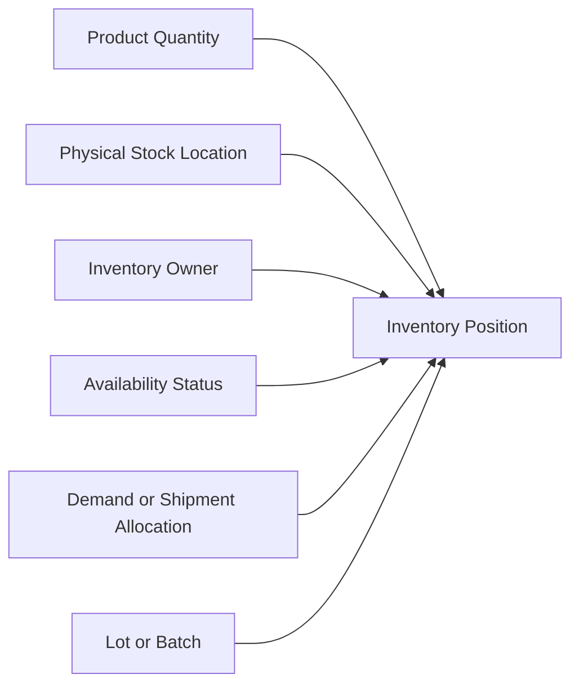

### كائنات الأعمال الرئيسية

| الكائن | الوصف |
| --- | --- |
| Inventory Position (وضع المخزون) | كمية منتج في موقع مع حالة وملكية محددتين |
| Stock Movement (حركة المخزون) | تغيير مخزون مادي أو منطقي منضبط |
| Reservation (الحجز) | كمية مخصصة لمتطلب |
| Ownership Record (سجل الملكية) | طرف الأعمال المالك للمخزون |
| Lot or Batch (الدفعة) | تجميع منتجات قابل للتتبع |
| Inventory Adjustment (تسوية المخزون) | تصحيح مصرّح به للمخزون المسجل |
| Allocation (التخصيص) | علاقة بين المخزون والطلب أو الشحنة |

### قواعد النطاق

من الأمثلة على ذلك:

- يجب عدم اعتبار الموقع المادي دليلًا على الملكية.
- يجب أن يبقى المخزون المملوك للعملاء مفصولًا منطقيًا.
- يجب عدم تخصيص المخزون المحجوز لطلب غير متوافق.
- يجب عدم تمثيل التوريد الوارد المتوقع كمخزون متوفر حاليًا.
- تتطلب تسويات المخزون تصريحًا وسببًا.
- يجب احترام قيود الدفعات وانتهاء الصلاحية ومدة الصلاحية.
- يجب أن تؤدي الحركة المادية المكتملة إلى تحديث حركة المخزون المناسبة أو إطلاقها.

### مخرجات النطاق

يوفر النطاق:

- التوافر الحالي
- الملكية
- حالة الحجز
- خيارات مصادر المخزون
- التوافر المتوقع
- حالة الدفعات وانتهاء الصلاحية
- معلومات التخصيص
- مخاطر المخزون

### دور Odoo

يبقى تطبيق المخزون في Odoo هو نظام التسجيل التشغيلي لكميات المخزون وحركاته.

ويجب أن تحافظ امتدادات SCOP على سلامة عمليات المخزون القياسية.

## 6. عمليات المستودعات (Warehouse Operations)

### الغرض

يدير نطاق عمليات المستودعات الاستلام والتخزين والحركة الداخلية والانتقاء والتجهيز والتحميل والتفريغ والعبور السريع (Cross-docking) والمرتجعات المتعلقة بالمستودعات.

### المسؤوليات

يتولى النطاق المسؤولية عن:

- الاستلامات
- التخزين في المواقع (Putaway)
- التحويلات الداخلية
- الانتقاء (Picking)
- التعبئة
- التجهيز (Staging)
- الفحص
- التحميل
- التفريغ
- معالجة العبور السريع
- جاهزية المستودع
- استثناءات المستودع
- معالجة المرتجعات
- مدة التحميل والخدمة

### كائنات الأعمال الرئيسية

| الكائن | الوصف |
| --- | --- |
| Receipt (الاستلام) | عملية مستودع واردة |
| Picking Task (مهمة الانتقاء) | متطلب لجمع المنتجات من التخزين |
| Staging Unit (وحدة التجهيز) | منتجات جرى إعدادها لرحلة أو حركة صادرة |
| Loading Task (مهمة التحميل) | متطلب لتحميل المنتجات على مركبة معيّنة |
| Cross-Dock Movement (حركة العبور السريع) | سلع واردة موجهة نحو التنفيذ الصادر |
| Warehouse Readiness (جاهزية المستودع) | الجاهزية التشغيلية للمنتجات للحركة |
| Warehouse Exception (استثناء المستودع) | نقص أو تأخير أو تلف أو مشكلة معالجة |

### تدفق المستودع

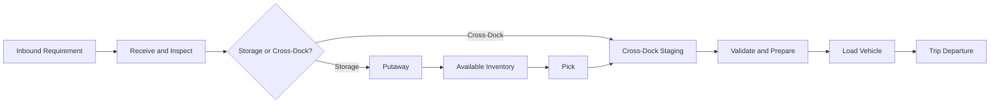

### قواعد النطاق

من الأمثلة على ذلك:

- يجب التحقق من الاستلام المادي قبل أن يصبح المخزون متاحًا بشكل اعتيادي.
- يجب أن يستند الانتقاء إلى طلب أو شحنة أو تحويل أو متطلب مستودع مصرّح به.
- يجب أن تبقى المنتجات المجهزة قابلة للتتبع إلى مالكها وحركتها المقصودة.
- يجب ألا يتجاوز التحميل حدود الرحلة والمركبة المعتمدة.
- يجب أن تعكس جاهزية المستودع الحالة التشغيلية الفعلية.
- يجب أن تحتفظ حركات العبور السريع بقابلية التتبع الواردة والصادرة.
- يجب أن يؤدي النقص أو التلف إلى إنشاء استثناء بدلًا من تغيير الكميات المخططة بصمت.

### مخرجات النطاق

يوفر النطاق:

- حالة الاستلام
- جاهزية المخزون
- حالة الانتقاء
- حالة التجهيز
- حالة التحميل
- مدة المناولة المتوقعة
- جاهزية العبور السريع
- تأخيرات المستودع واستثناءاته

### دور Odoo

توفر عمليات المخزون والمستودعات في Odoo أساس المعاملات التشغيلية.

وقد توسّع SCOP الجاهزية والتجهيز والربط بالرحلات والتحكم في العبور السريع ورؤية التحميل.

## 7. إدارة الشحنات والحمولات (Shipment and Load Management)

### الغرض

يحوّل نطاق إدارة الشحنات والحمولات الطلب والمنتجات المخصصة إلى تجميعات تشغيلية قابلة للنقل.

### التمييز بين الشحنة والحمولة

تمثل الشحنة (Shipment) سلعًا تتطلب حركة بين مواقع تشغيلية محددة.

وتمثل الحمولة (Load) المنتجات المعيّنة فعليًا إلى مركبة أو رحلة في مرحلة معينة من التنفيذ.

الشحنة هي متطلب نقل.

والحمولة هي خطة محتوى المركبة المادي أو نتيجته.

قد تُقسَّم شحنة واحدة على عدة حمولات.

وقد تضم حمولة واحدة عدة شحنات متوافقة.

### المسؤوليات

يتولى النطاق المسؤولية عن:

- إنشاء الشحنات
- تقسيم الشحنات
- دمج الشحنات
- ملكية المنتجات داخل الشحنات
- تحديد المصدر والوجهة
- التواريخ المطلوبة والنوافذ الزمنية
- جاهزية الشحنة
- تكوين الحمولات
- تركيبة الحمولة
- تسلسل التحميل
- المساهمة في السعة
- حالة الشحنة والحمولة
- الاستثناءات المتعلقة بالشحنات

### كائنات الأعمال الرئيسية

| الكائن | الوصف |
| --- | --- |
| Shipment (الشحنة) | متطلب نقل منطقي |
| Shipment Line (بند الشحنة) | منتج وكمية داخل شحنة |
| Load (الحمولة) | سلع معيّنة فعليًا إلى مركبة أو رحلة |
| Load Line (بند الحمولة) | منتج وكمية داخل حمولة |
| Consolidation Group (مجموعة الدمج) | شحنات متوافقة جرى تقييمها أو اختيارها للدمج |
| Shipment Constraint (قيد الشحنة) | متطلب نقل أو مناولة أو توقيت أو توافق |
| Shipment Allocation (تخصيص الشحنة) | الرابط بين طلب الشحنة والمخزون المتاح |

### تدفق التكوين


### قواعد النطاق

من الأمثلة على ذلك:

- يجب أن تحدد الشحنة المصدر والوجهة والمنتجات والملكية ومتطلبات الخدمة.
- يجب أن يحمي دمج الشحنات الملكية وقابلية التتبع.
- توافر السعة وحده ليس سببًا كافيًا لدمج الشحنات.
- يجب أن تبقى الحمولة قابلة للتنفيذ عبر جميع أبعاد السعة.
- يجب أن يدعم تسلسل التحميل والتفريغ تسلسل المحطات المخطط.
- يجب أن تكون الكميات المحمَّلة الفعلية قابلة للتمييز عن الكميات المخططة.

### مخرجات النطاق

يوفر النطاق:

- شحنات جاهزة
- قيود الشحنات
- الشحنات المرشحة للدمج
- الحمولات المقترحة
- متطلبات السعة
- تسلسل التحميل
- الملكية وقابلية التتبع
- استثناءات الشحنات

## 8. إدارة الأسطول والسائقين (Fleet and Driver Management)

### الغرض

يتحكم نطاق إدارة الأسطول والسائقين في موارد النقل وأهليتها للتكليفات التشغيلية.

### المسؤوليات

يتولى النطاق المسؤولية عن:

- البيانات الرئيسية للمركبات
- أنواع المركبات
- ملفات السعة
- المقصورات
- قدرة التحكم في درجة الحرارة
- توافر المركبات
- موقع المركبات
- حالة الصيانة
- القيود التشغيلية
- سجلات السائقين
- مؤهلات السائقين
- صلاحية الرخص
- توافر السائقين
- قيود وقت العمل
- تعيينات المركبات والسائقين
- تعارضات الموارد

### كائنات الأعمال الرئيسية

| الكائن | الوصف |
| --- | --- |
| Vehicle (المركبة) | مورد نقل |
| Vehicle Type (نوع المركبة) | ملف سعة وتهيئة قابل لإعادة الاستخدام |
| Capacity Profile (ملف السعة) | حدود الوزن أو الحجم أو المنصات أو الوحدات أو المقصورات |
| Vehicle Availability (توافر المركبة) | الوقت والموقع اللذان يجوز فيهما تعيين المركبة |
| Driver (السائق) | مشغّل نقل مصرّح له |
| Driver Qualification (مؤهل السائق) | رخصة أو تصريح أو قدرة |
| Driver Availability (توافر السائق) | الوقت والموقع اللذان يجوز فيهما تعيين السائق |
| Resource Assignment (تعيين المورد) | العلاقة بين مورد ورحلة |

### تدفق الأهلية

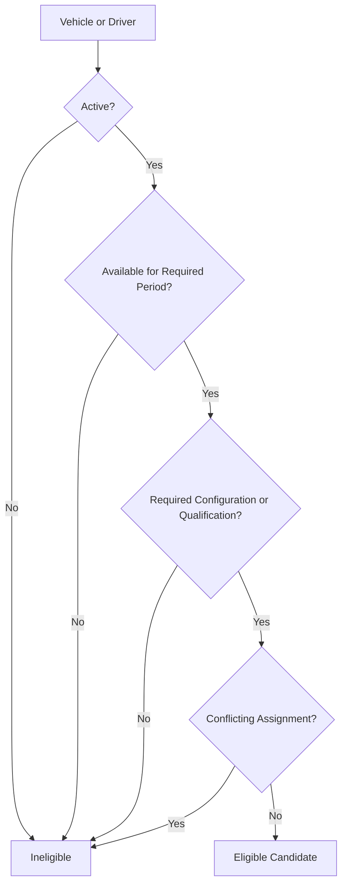

### قواعد النطاق

من الأمثلة على ذلك:

- يجب ألا تتلقى الموارد غير النشطة تكليفات جديدة.
- يجب ألا تتداخل تعيينات المركبات والسائقين.
- يجب أن تفي سعة المركبة بكل بُعد إلزامي.
- يجب أن تبقى وثائق المركبات المطلوبة ورخص السائقين سارية.
- تجعل حالات الصيانة أو الحظر القانوني المورد غير متاح.
- يجب احترام متطلبات وقت عمل السائق.
- يجب أن يكون موقع الانطلاق المتوقع قابلًا للتنفيذ تشغيليًا.

### مخرجات النطاق

يوفر النطاق:

- المركبات الصالحة للتكليف
- السائقين الصالحين للتكليف
- ملفات السعة
- التوافر
- موقع الموارد
- القيود
- حالة المؤهلات
- تعارضات الموارد
- معلومات التعيين

### دور Odoo

قد توفر سجلات الأسطول والموظفين أو المستخدمين في Odoo المعلومات التأسيسية.

وقد تدير امتدادات SCOP السعة اللوجستية ومؤهلات السائقين والتوافر وتعيين الرحلات.

## 9. إدارة المسارات والرحلات (Route and Trip Management)

### الغرض

يعرّف نطاق إدارة المسارات والرحلات مسارات النقل القابلة لإعادة الاستخدام وعمليات التنفيذ التشغيلية المؤرخة.

### التمييز بين المسار والرحلة

المسار (Route) هو مسار تشغيلي أو بنية جغرافية قابلة لإعادة الاستخدام.

والرحلة (Trip) هي تنفيذ مؤرخ له موارد وشحنات وحمولات ومحطات معيّنة وأوقات مخططة أو فعلية.

### المسؤوليات

يتولى النطاق المسؤولية عن:

- تعريفات المسارات
- قوالب محطات المسارات
- قيود المسارات
- إنشاء الرحلات
- إنشاء محطات الرحلات
- تسلسل المحطات
- اعتماديات الالتقاط والتسليم
- الوصول والمغادرة المخططين
- الوصول والمغادرة الفعليين
- حالات الرحلات
- مراجع تنفيذ الرحلات
- إكمال الرحلات
- إلغاء الرحلات
- سجل الرحلات

### كائنات الأعمال الرئيسية

| الكائن | الوصف |
| --- | --- |
| Route (المسار) | مسار أو بنية محطات قابلة لإعادة الاستخدام |
| Route Stop Template (قالب محطة المسار) | موقع قابل لإعادة الاستخدام داخل مسار |
| Trip (الرحلة) | تنفيذ نقل مؤرخ |
| Trip Stop (محطة الرحلة) | زيارة تشغيلية داخل رحلة |
| Stop Activity (نشاط المحطة) | نشاط التقاط أو تسليم أو تحويل أو إرجاع أو نشاط مختلط |
| Trip Schedule (جدول الرحلة) | أوقات المغادرة والوصول والخدمة والإكمال المخططة |
| Trip Assignment (تعيين الرحلة) | المركبة والسائق والشحنة والحمولة المعيّنة |
| Trip Outcome (نتيجة الرحلة) | نتيجة الإكمال الفعلية |

### نموذج العلاقات

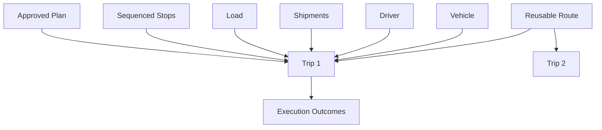

### قواعد النطاق

من الأمثلة على ذلك:

- يجب أن يكون لكل رحلة مُطلقة غرض تشغيلي مصرّح به.
- يجب عدم اعتبار الرحلة مكتملة حتى تكون لجميع المحطات نتائج.
- يجب أن يحترم تسلسل المحطات اعتماديات الالتقاط والتسليم.
- يجب أن تبقى السعة الديناميكية للمركبة قابلة للتنفيذ بعد كل محطة.
- يجب أن تبقى أوقات التنفيذ الفعلية قابلة للتمييز عن الأوقات المخططة.
- يجب أن تحتفظ الرحلات الملغاة أو المكتملة بسجلها.
- يجب عدم الخلط بين تعريفات المسارات والرحلات المؤرخة المحددة.

### مخرجات النطاق

يوفر النطاق:

- المسارات
- الرحلات المقترحة والمعتمدة
- تسلسلات المحطات
- الجداول المخططة
- تعيينات الموارد
- تقدم التنفيذ الفعلي
- نتائج الرحلات
- استثناءات الرحلات

## 10. إدارة التخطيط والقرارات (Planning and Decision Management)

### الغرض

يحوّل نطاق إدارة التخطيط والقرارات السياق التشغيلي إلى توصيات واعتمادات وخطط مُطلقة بطريقة منضبطة.

### المسؤوليات

يتولى النطاق المسؤولية عن:

- طلبات التخطيط
- أفق التخطيط
- أهلية الطلب
- مدخلات التخطيط
- القواعد
- القيود
- الأهداف
- تقييم البدائل
- التوصيات
- التفسيرات
- المراجعة البشرية
- تعديل الخطط
- الاعتماد
- الرفض
- الإطلاق التشغيلي
- إعادة التخطيط
- نتائج القرارات
- تدقيق القرارات

### كائنات الأعمال الرئيسية

| الكائن | الوصف |
| --- | --- |
| Planning Run (دورة التخطيط) | تقييم منضبط لنطاق تخطيط محدد |
| Decision Object (كائن القرار) | قرار تشغيلي مُهيكل |
| Candidate Alternative (البديل المرشح) | إجراء قابل أو غير قابل للتنفيذ جرى النظر فيه |
| Recommendation (التوصية) | البديل الذي يقترحه محرك القرار (Decision Engine) |
| Decision Explanation (تفسير القرار) | أسباب الأعمال الداعمة للتوصية |
| Approval (الاعتماد) | القبول المصرّح به لقرار |
| Override (التجاوز) | تغيير أو رفض مصرّح به |
| Daily Plan (الخطة اليومية) | المجموعة المنسقة من الرحلات المعتمدة والطلب غير المخطط |

### تدفق القرار

```mermaid
flowchart LR
    Context[Operational Context] --> Validate[Validate Inputs]
    Validate --> Rules[Apply Rules]
    Rules --> Constraints[Apply Constraints]
    Constraints --> Alternatives[Generate Feasible Alternatives]
    Alternatives --> Objectives[Evaluate Objectives]
    Objectives --> Recommend[Create Recommendation]
    Recommend --> Explain[Provide Explanation]
    Explain --> Review[Human Review]
    Review --> Approve[Approve or Modify]
    Approve --> Release[Operational Release]
    Release --> Outcome[Measured Outcome]
```

### قواعد النطاق

من الأمثلة على ذلك:

- يجب ألا تتجاوز التوصيات القيود الإلزامية.
- تتطلب الخطة الموصى بها اعتمادًا مصرّحًا به قبل الإطلاق الاعتيادي.
- يجب أن تبقى التعديلات اليدوية قابلة للتتبع.
- يجب أن يتضمن الطلب غير المخطط سببًا.
- تتطلب تغييرات القواعد والأهداف حوكمة.
- يجب عدم الخلط بين ثقة التوصية وقابليتها للتنفيذ تشغيليًا.
- تبقى مخرجات الذكاء الاصطناعي مدخلات داعمة لا سلطة أعمال نهائية.

### مخرجات النطاق

يوفر النطاق:

- توصيات التخطيط
- البدائل القابلة للتنفيذ
- الخطط اليومية المعتمدة
- أسباب الطلب غير المخطط
- التفسيرات
- نتائج القيود
- التجاوزات
- سجل القرارات
- قرارات إعادة التخطيط
- مقارنات النتائج

### دور محرك القرار

محرك قرارات سلسلة الإمداد (Supply Chain Decision Engine) هو القدرة التطبيقية الرئيسية الداعمة لهذا النطاق.

فهو ينسّق البيانات القادمة من النطاقات التشغيلية ويُنتج توصيات منضبطة.

## 11. إدارة التنفيذ والاستثناءات (Execution and Exception Management)

### الغرض

يسجّل نطاق إدارة التنفيذ والاستثناءات النشاط التشغيلي الفعلي ويتحكم في الانحرافات عن الخطط المعتمدة.

### المسؤوليات

يتولى النطاق المسؤولية عن:

- حالة الإطلاق التشغيلي
- تأكيد المغادرة
- الوصول إلى المحطات
- بدء الخدمة
- تأكيد الالتقاط
- تأكيد التسليم
- تأكيد التحويل
- تأكيد الإرجاع
- إكمال المحطات
- إكمال الرحلات
- الإكمال الجزئي
- الفشل
- الاستثناءات
- الحل
- إعادة الجدولة
- طلب المتابعة
- المطابقة التشغيلية

### كائنات الأعمال الرئيسية

| الكائن | الوصف |
| --- | --- |
| Execution Event (حدث التنفيذ) | إجراء تشغيلي مسجّل أو تغيير في الحالة |
| Stop Outcome (نتيجة المحطة) | النتيجة الفعلية لمحطة مخططة |
| Quantity Outcome (نتيجة الكمية) | الكمية المسلَّمة أو الملتقطة أو المرفوضة أو المرتجعة أو المفقودة |
| Operational Exception (الاستثناء التشغيلي) | حالة تمنع التنفيذ الاعتيادي |
| Resolution Action (إجراء الحل) | الاستجابة التصحيحية |
| Follow-Up Demand (طلب المتابعة) | طلب جديد يُنشأ لإكمال العمل غير المحلول |
| Execution Reconciliation (مطابقة التنفيذ) | المقارنة بين النتائج المخططة والفعلية |

### دورة حياة الاستثناء

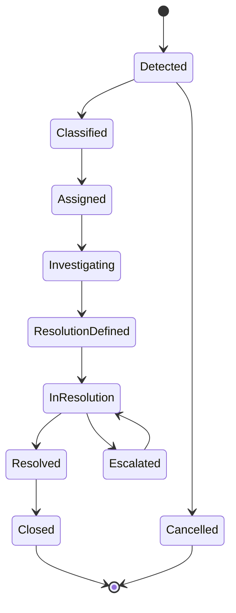

### قواعد النطاق

من الأمثلة على ذلك:

- يجب تسجيل النتائج الفعلية بشكل مستقل عن النتائج المخططة.
- تتطلب النتائج الفاشلة والجزئية أسبابًا معتمدة.
- يجب أن يكون لكل استثناء جوهري مالك.
- يجب ألا يمحو حل الاستثناء الحدث الأصلي.
- يجب أن يحرر التنفيذ المكتمل الموارد المعيّنة أو يحدّثها بشكل مناسب.
- يجب أن يشير طلب المتابعة إلى المتطلب الأصلي غير المحلول.
- يجب أن تحافظ إعادة التخطيط على التنفيذ المكتمل.

### مخرجات النطاق

يوفر النطاق:

- الحالة الفعلية للرحلات والمحطات
- الكميات الفعلية
- التأخيرات
- المرتجعات
- النتائج الفاشلة أو الجزئية
- الاستثناءات
- حالة الحل
- متطلبات المتابعة
- بيانات المطابقة

## 12. الأداء والتحليلات (Performance and Analytics)

### الغرض

يحوّل نطاق الأداء والتحليلات السجلات التشغيلية إلى مقاييس وتقارير ورؤى ومعلومات إدارية موثوقة.

### المسؤوليات

يتولى النطاق المسؤولية عن:

- تعريفات مؤشرات الأداء الرئيسية (KPIs)
- التقارير التشغيلية
- أداء التخطيط
- أداء المستودعات
- أداء الأسطول
- أداء التسليم
- جودة القرارات
- أداء الذكاء الاصطناعي
- تحليل التكلفة والاستغلال
- تحليل الاتجاهات
- تحليل الاستثناءات
- مطابقة البيانات
- لوحات المعلومات الإدارية

### كائنات الأعمال الرئيسية

| الكائن | الوصف |
| --- | --- |
| KPI Definition (تعريف مؤشر الأداء) | مقياس أداء خاضع للحوكمة |
| KPI Result (نتيجة مؤشر الأداء) | قيمة محسوبة لفترة ونطاق محددين |
| Operational Report (التقرير التشغيلي) | عرض أعمال مُهيكل |
| Analytical Dataset (مجموعة البيانات التحليلية) | بيانات خاضعة للحوكمة أُعدت للتحليل |
| Performance Target (هدف الأداء) | نتيجة متوقعة معتمدة |
| Variance (الانحراف) | الفرق بين الأداء المخطط والمتوقع والفعلي |
| Insight (الرؤية التحليلية) | تفسير مدعوم بالأدلة للبيانات المقاسة |

### تدفق القياس

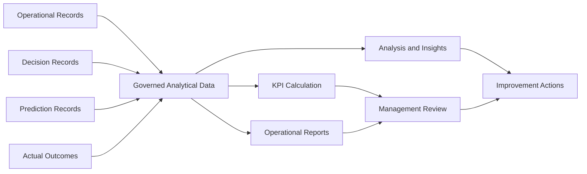

### قواعد النطاق

من الأمثلة على ذلك:

- يجب أن يكون لكل مؤشر أداء رئيسي مالك وتعريف.
- يجب أن تحدد التقارير مصدر بياناتها ودورية تحديثها.
- يجب عدم خلط المقاييس المخططة والفعلية دون تمييز واضح.
- يجب أن تبقى تعريفات مؤشرات الأداء التاريخية قابلة للتتبع عند تغيّر المعادلات.
- يجب عدم تقديم دقة نماذج الذكاء الاصطناعي كقيمة أعمال دون دليل على النتائج.
- يجب أن تبقى البيانات الحساسة محمية في التقارير.

### مخرجات النطاق

يوفر النطاق:

- مؤشرات الأداء التشغيلية
- لوحات المعلومات الإدارية
- مقاييس جودة القرارات
- مقاييس أداء الذكاء الاصطناعي
- الاتجاهات
- الانحرافات
- تحليل الاستثناءات
- أدلة التحسين

## 13. حوكمة المنصة وإدارتها (Platform Governance and Administration)

### الغرض

يتحكم نطاق حوكمة المنصة وإدارتها في التهيئة والتصريح وملكية القواعد والوصول إلى المنصة والتدقيق والحوكمة التشغيلية.

### المسؤوليات

يتولى النطاق المسؤولية عن:

- المستخدمين
- الأدوار
- الصلاحيات
- سلطة الاعتماد
- ملكية قواعد الأعمال
- ملكية التهيئة
- حوكمة البيانات الرئيسية
- إدارة الأمان
- مراجعة التدقيق
- ضبط التغييرات
- تفعيل الميزات
- الضوابط الخاصة بكل بيئة
- ملكية التوثيق
- ملكية الدعم التشغيلي

### كائنات الأعمال الرئيسية

| الكائن | الوصف |
| --- | --- |
| User (المستخدم) | مستخدم منصة موثَّق الهوية |
| Role (الدور) | تجميع محدد للمسؤوليات والصلاحيات |
| Permission (الصلاحية) | إجراء أو نطاق بيانات مصرّح به |
| Approval Authority (سلطة الاعتماد) | حق اعتماد قرار منضبط |
| Business Rule (قاعدة الأعمال) | سياسة أعمال خاضعة للحوكمة |
| Configuration Item (عنصر التهيئة) | إعداد منصة أو أعمال منضبط |
| Audit Record (سجل التدقيق) | دليل على إجراء أو تغيير مهم |
| Governance Decision (قرار الحوكمة) | سياسة أو تغيير تهيئة معتمد |

### قواعد النطاق

من الأمثلة على ذلك:

- يجب أن تتبع الصلاحيات مبدأ الحد الأدنى من الامتيازات.
- يجب عدم اعتبار الظهور في واجهة المستخدم وحده تصريحًا.
- تتطلب تغييرات القواعد عالية الأثر اعتمادًا منضبطًا.
- يجب أن تبقى تغييرات تهيئة بيئة الإنتاج قابلة للتتبع.
- ينبغي أن تعتمد المهام الحساسة فصلًا مناسبًا للمسؤوليات.
- يجب عدم تخزين الأسرار في التوثيق أو الشيفرة المصدرية.
- يجب حماية سجل التدقيق من التعديل غير المصرّح به.

### مخرجات النطاق

يوفر النطاق:

- المستخدمين والأدوار المصرّح بهم
- قرارات الصلاحيات
- سلطة الاعتماد
- القواعد والتهيئة المنضبطة
- أدلة التدقيق
- حالة الحوكمة
- ملكية التغييرات

## كائنات الأعمال المشتركة بين النطاقات

تشارك بعض الكائنات في عدة نطاقات، لكن يجب أن يبقى لها مع ذلك مالك مرجعي واضح.

| كائن الأعمال | النطاق المرجعي | أهم المستهلكين |
| --- | --- | --- |
| Party (الطرف) | الأطراف والمواقع | المشتريات، الطلب، المستودعات، المسارات |
| Operational Location (الموقع التشغيلي) | الأطراف والمواقع | المستودعات، الشحنات، المسارات، التخطيط |
| Product (المنتج) | المنتجات والمناولة | المشتريات، الطلب، المخزون، الشحنات |
| Purchase Order (أمر الشراء) | المشتريات والتوريد الوارد | المخزون، المستودعات، التخطيط |
| Movement Demand (طلب الحركة) | العملاء والطلب | الشحنات، التخطيط، التنفيذ |
| Inventory Position (وضع المخزون) | المخزون والملكية | المستودعات، الشحنات، التخطيط |
| Warehouse Readiness (جاهزية المستودع) | عمليات المستودعات | التخطيط والقرارات |
| Shipment (الشحنة) | الشحنات والحمولات | التخطيط، المسارات والرحلات، التنفيذ |
| Load (الحمولة) | الشحنات والحمولات | المستودعات، المسارات والرحلات، التنفيذ |
| Vehicle (المركبة) | الأسطول والسائقون | التخطيط، المسارات والرحلات، التنفيذ |
| Driver (السائق) | الأسطول والسائقون | التخطيط، المسارات والرحلات، التنفيذ |
| Route (المسار) | المسارات والرحلات | التخطيط والقرارات |
| Trip (الرحلة) | المسارات والرحلات | المستودعات، التنفيذ، الأداء |
| Decision Object (كائن القرار) | التخطيط والقرارات | التنفيذ، الأداء، الحوكمة |
| Prediction Record (سجل التنبؤ) | منصة الذكاء الاصطناعي (AI Platform) | التخطيط والقرارات، الأداء |
| Operational Exception (الاستثناء التشغيلي) | التنفيذ والاستثناءات | التخطيط، الأداء، الحوكمة |
| KPI Definition (تعريف مؤشر الأداء) | الأداء والتحليلات | الإدارة، العمليات، الحوكمة |

## التدفق الأساسي عبر النطاقات

يعبر تدفق الأعمال الرئيسي عدة نطاقات.

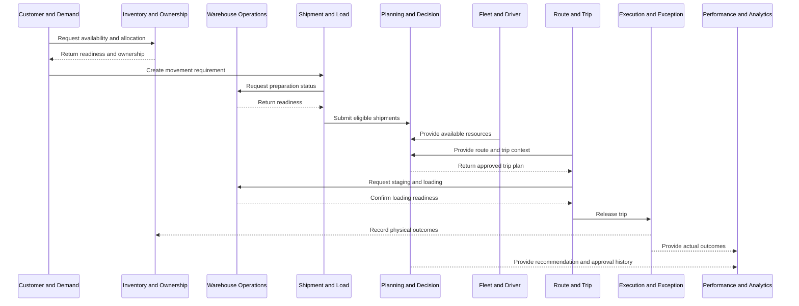

## اعتماديات النطاقات

يجب أن تتبع الاعتماديات اتجاه الأعمال وأن تتجنب الملكية الدائرية.

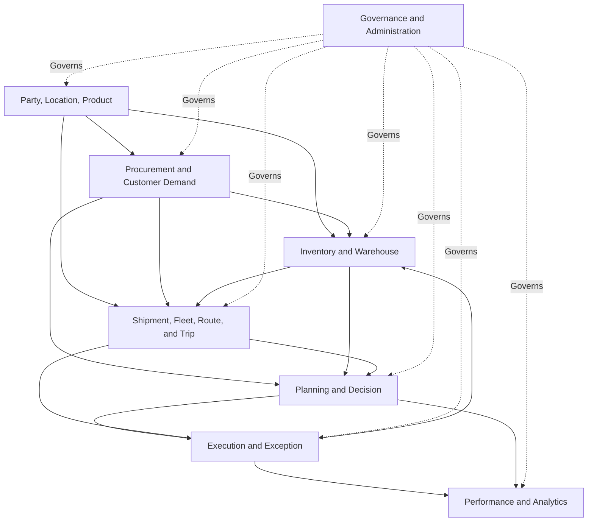

يجوز لعملية أن تعيد معلومات النتائج إلى نطاق سابق دون نقل الملكية المرجعية.

فعلى سبيل المثال، يحدّث التنفيذ المخزون، لكن نطاق التنفيذ لا يصبح المالك المرجعي للمخزون.

## مصفوفة مسؤوليات النطاقات

| النطاق | يمتلك البيانات الرئيسية | يمتلك المعاملات التشغيلية | يُنتج قرارات | يُنتج قياسات |
| --- | --- | --- | --- | --- |
| الأطراف والمواقع | نعم | محدود | لا | محدود |
| المنتجات والمناولة | نعم | محدود | لا | محدود |
| المشتريات والتوريد الوارد | جزئي | نعم | خيارات تشغيلية | نعم |
| العملاء والطلب | جزئي | نعم | مدخلات الأولوية والخدمة | نعم |
| المخزون والملكية | جزئي | نعم | مدخلات التوافر | نعم |
| عمليات المستودعات | جزئي | نعم | مدخلات الجاهزية | نعم |
| الشحنات والحمولات | جزئي | نعم | مدخلات الدمج | نعم |
| الأسطول والسائقون | نعم | نعم | مدخلات الأهلية | نعم |
| المسارات والرحلات | جزئي | نعم | مدخلات المسار والتسلسل | نعم |
| التخطيط والقرارات | محدود | نعم | نعم | نعم |
| التنفيذ والاستثناءات | محدود | نعم | مدخلات تصحيحية | نعم |
| الأداء والتحليلات | لا | سجلات تحليلية | رؤى تحليلية | نعم |
| الحوكمة والإدارة | بيانات الحوكمة | معاملات الحوكمة | قرارات الحوكمة | مقاييس الحوكمة |

المصفوفة مفاهيمية.

وستُنقَّح الملكية التفصيلية في مواصفات لاحقة.

## ربط النطاقات بمنصة Odoo

يجب عدم اختزال نموذج النطاقات في ربط واحد لواحد مع الوحدات.

وقد تتضمن علاقة أولية ما يلي:

| نطاق الأعمال | أساس Odoo المحتمل |
| --- | --- |
| الأطراف والمواقع | جهات الاتصال، الشركة، المستودعات، مواقع المخزون |
| المنتجات والمناولة | المنتجات، الفئات، وحدات القياس |
| المشتريات والتوريد الوارد | المشتريات (Purchase) |
| العملاء والطلب | المبيعات أو مسارات الأوامر المعتمدة |
| المخزون والملكية | المخزون والمخزون السلعي |
| عمليات المستودعات | عمليات المخزون والمستودعات |
| الشحنات والحمولات | امتدادات SCOP المرتبطة بسجلات المخزون والتسليم |
| الأسطول والسائقون | الأسطول، الموظفون، المستخدمون، امتدادات SCOP |
| المسارات والرحلات | قدرات SCOP المخصصة |
| التخطيط والقرارات | محرك القرار ووحدات التخطيط في SCOP |
| التنفيذ والاستثناءات | وحدات SCOP للرحلات والمحطات والمستودعات والاستثناءات |
| الأداء والتحليلات | التقارير والتحليلات ومجموعات البيانات الخاضعة للحوكمة |
| الحوكمة والإدارة | المستخدمون، المجموعات، قواعد الوصول، التهيئة، امتدادات التدقيق |

يجب أن يحافظ التصميم التقني النهائي على سلوك Odoo القياسي حيثما كان ذلك مناسبًا.

## علاقة النطاقات بمحرك القرار (Decision Engine)

يستهلك محرك القرار (Decision Engine) معلومات خاضعة للحوكمة من النطاقات التشغيلية.

وهو لا يحل محل تلك النطاقات.

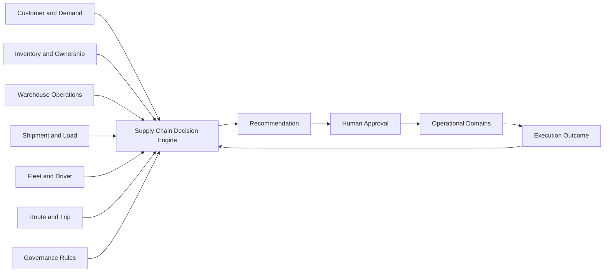

محرك القرار:

- يستهلك بيانات النطاقات
- يطبّق قواعد القرار المعتمدة
- يفرض القيود
- يقيّم البدائل
- يُنتج التوصيات
- يسجّل التفسيرات
- يدعم الاعتماد
- يتلقى معلومات النتائج

ويجب ألا يُنشئ بيانات رئيسية مرجعية متعارضة.

## علاقة النطاقات بمنصة الذكاء الاصطناعي (AI Platform)

توفر منصة الذكاء الاصطناعي (AI Platform) ذكاءً تنبؤيًا وتحليليًا للنطاقات ولمحرك القرار.

ومن الأمثلة المحتملة:

| النطاق | دعم الذكاء الاصطناعي |
| --- | --- |
| المشتريات | مخاطر تأخر التوريد والتنبؤ بالوارد |
| العملاء والطلب | التنبؤ بالطلب |
| المخزون | مخاطر التوافر والنقص |
| المستودعات | التنبؤ بالجاهزية ومدة المناولة |
| الشحنات والحمولات | مؤشرات داعمة للدمج |
| الأسطول والسائقون | مؤشرات الملاءمة ومخاطر السعة |
| المسارات والرحلات | التنبؤ بوقت الوصول المتوقع (ETA) والمدة |
| التخطيط والقرارات | التنبؤ والترتيب والمخاطر والثقة |
| التنفيذ والاستثناءات | كشف الشذوذ ومخاطر الفشل |
| الأداء والتحليلات | تقييم النماذج والنتائج |

لا تنقل مخرجات الذكاء الاصطناعي ملكية الأعمال من النطاق التشغيلي.

## أحداث النطاقات

ينبغي أن تتواصل النطاقات بشأن تغييرات الأعمال المهمة من خلال أحداث منضبطة أو آليات مكافئة قابلة للتتبع.

من الأمثلة على ذلك:

```text
DemandValidated
InventoryAllocated
InventoryShortageDetected
WarehouseReady
ShipmentCreated
LoadPrepared
VehicleBecameUnavailable
DriverBecameUnavailable
PlanRecommended
PlanApproved
TripReleased
TripDeparted
StopCompleted
DeliveryFailed
ReturnCreated
TripCompleted
ExceptionRaised
ExceptionResolved
OutcomeMeasured
```

يمثل حدث النطاق شيئًا وقع فعلًا.

ويجب عدم استخدامه بديلًا غير منضبط عن السجلات التشغيلية المرجعية.

## مبادئ أحداث النطاقات

ينبغي أن تكون أحداث النطاقات:

- مسماة بلغة الأعمال
- قابلة للتتبع إلى كائن أعمال
- موسومة بطابع زمني
- مرتبطة بالمصدر المسؤول
- ذات إصدارات عند استخدامها عبر حدود التكامل
- عديمة أثر التكرار (Idempotent) حيثما أمكن تكرار التسليم
- محمية وفقًا لحساسية البيانات
- خاضعة للمراقبة عندما تكون ذات أهمية تشغيلية

## التحقق عبر النطاقات

قد يتطلب إجراء عابر للنطاقات تحققًا من عدة نطاقات.

فعلى سبيل المثال، قد يتطلب إطلاق رحلة ما يلي:

| النطاق | التحقق |
| --- | --- |
| العملاء والطلب | بقاء الطلب نشطًا ومصرّحًا به |
| المخزون والملكية | تخصيص المخزون المطلوب |
| عمليات المستودعات | جاهزية المنتجات أو جاهزيتها المشروطة |
| الشحنات والحمولات | صلاحية تركيبة الحمولة |
| الأسطول والسائقون | بقاء المركبة والسائق مؤهلَين |
| المسارات والرحلات | صلاحية تسلسل المحطات والجدول |
| التخطيط والقرارات | اعتماد الخطة |
| الحوكمة | امتلاك المستخدم سلطة الإطلاق |

لا ينبغي لأي نطاق منفرد أن يدّعي بصمت صلاحية العملية العابرة للنطاقات بأكملها دون التأكيدات المطلوبة.

## ملكية الاستثناءات عبر النطاقات

ينبغي أن يمتلك الاستثناءَ النطاقُ الأقدر على حل سببه.

| الاستثناء | المالك الرئيسي |
| --- | --- |
| تأخر المورّد | المشتريات والتوريد الوارد |
| تغيير النافذة الزمنية للعميل | العملاء والطلب |
| نقص المخزون | المخزون والملكية |
| تأخر الانتقاء | عمليات المستودعات |
| تركيبة شحنة غير صالحة | الشحنات والحمولات |
| عطل المركبة | الأسطول والسائقون |
| قيد المسار | المسارات والرحلات |
| عدم وجود خطة قابلة للتنفيذ | التخطيط والقرارات |
| رفض التسليم | التنفيذ والاستثناءات |
| نتيجة مؤشر أداء غير صالحة | الأداء والتحليلات |
| تهيئة غير مصرّح بها | الحوكمة والإدارة |

قد يؤثر الاستثناء في عدة نطاقات مع احتفاظه بمالك رئيسي واحد.

## حوكمة النطاقات

### ملكية الأعمال

يجب أن يكون لكل نطاق مالك أعمال خاضع للمساءلة.

### ملكية المنتج

ينبغي أن يكون لكل قدرة رئيسية من قدرات النطاق مالك منتج محدد أو دور منتج مسؤول.

### الملكية التقنية

يجب أن تكون للمكوّنات التقنية الداعمة للنطاق ملكية هندسية محددة.

### ملكية البيانات

يجب أن يكون لكائنات الأعمال والتعريفات المرجعية مالكو بيانات محددون.

### ملكية القواعد

يجب أن يكون للقواعد مالكون مسؤولون عن غرضها واعتمادها ومراجعتها.

### ملكية التوثيق

يجب أن يحدد توثيق النطاق مالكًا وأن يبقى متزامنًا مع السلوك المعتمد.

## معيار توثيق النطاقات

ينبغي أن تحدد كل صفحة نطاق تفصيلية مستقبلية ما يلي:

1. الغرض
2. المجال
3. نتائج الأعمال
4. الأدوار
5. القدرات
6. كائنات الأعمال
7. دورات الحياة
8. قواعد الأعمال
9. القرارات
10. المدخلات والمخرجات
11. التفاعلات عبر النطاقات
12. العلاقة بمنصة Odoo
13. العلاقة بمحرك القرار
14. العلاقة بالذكاء الاصطناعي
15. الصلاحيات
16. الاستثناءات
17. مؤشرات الأداء الرئيسية
18. حدود البنية
19. الصفحات ذات الصلة

يجب ألا تتعارض صفحات النطاقات التفصيلية المستقبلية مع خريطة النطاقات هذه دون تحديث معتمد للبنية.

## نضج النطاقات

قد تتقدم قدرات النطاقات عبر مراحل نضج.

| المرحلة | الوصف |
| --- | --- |
| محدد (Defined) | توثيق المجال والملكية والمصطلحات والعمليات |
| منضبط (Controlled) | فرض القواعد والحالات والصلاحيات والاستثناءات |
| متكامل (Integrated) | موثوقية التدفقات وتبادلات المعلومات عبر النطاقات |
| مُقاس (Measured) | قياس الأداء والنتائج بشكل متسق |
| محسَّن (Optimized) | تحسين القرارات والعمليات باستخدام أدلة موثوقة |
| متكيّف (Adaptive) | تعديل القدرات المعتمدة باستخدام ذكاء وتغذية راجعة منضبطين |

قد تعمل النطاقات المختلفة في مراحل نضج مختلفة.

## مؤشرات الأداء الرئيسية للنطاقات

تشمل مقاييس حوكمة النطاقات المحتملة:

- نسبة النطاقات التي لها مالكون معتمدون
- نسبة كائنات الأعمال ذات الملكية المرجعية
- نسبة التدفقات العابرة للنطاقات الموثقة
- معدل ازدواجية البيانات الرئيسية
- تعارضات ملكية البيانات
- قواعد الأعمال بلا مالك
- زمن حل الاستثناءات العابرة للنطاقات
- نسبة صفحات النطاقات المحدَّثة
- عدد تعريفات الحالات المتعارضة
- عدد التكاملات العابرة للنطاقات غير المنضبطة
- نسبة مؤشرات أداء النطاقات ذات المعادلات المعتمدة

ستُحدَّد الأهداف الدقيقة من خلال أعمال الحوكمة اللاحقة.

## حدود البنية

تُعرِّف هذه الصفحة:

- نطاقات الأعمال الرئيسية
- مسؤوليات النطاقات
- حدود النطاقات
- الملكية المرجعية
- كائنات الأعمال الأساسية
- العلاقات عبر النطاقات
- اعتماديات النطاقات
- العلاقات بمنصة Odoo
- العلاقات بمحرك القرار
- العلاقات بمنصة الذكاء الاصطناعي
- حوكمة النطاقات

وهي لا تُعرِّف:

- نماذج Odoo أو حقولها التفصيلية
- بنية الوحدات الفردية
- مخططات قواعد البيانات
- عقود واجهات برمجة التطبيقات (API)
- كتالوجات قواعد الأعمال الكاملة
- قصص المستخدمين الفردية
- تصاميم الشاشات
- مسارات العمل التفصيلية لكل نطاق
- معادلات مؤشرات الأداء الكاملة
- بنية النشر التقنية

ستُوثَّق تلك الموضوعات في صفحات مخصصة للأعمال والعمليات والقرارات والذكاء الاصطناعي والتطوير.

## الملخص

تنقسم SCOP إلى نطاقات أعمال متماسكة تغطي البيانات التأسيسية والتوريد والطلب والمخزون والمستودعات والنقل والتخطيط والتنفيذ والتحليلات والحوكمة.

ولكل نطاق مسؤولية محددة وملكية مرجعية.

تتعاون النطاقات من خلال تدفقات أعمال منضبطة دون إنشاء نسخ متعارضة من المنتجات أو المخزون أو الشحنات أو الرحلات أو القرارات أو النتائج.

يوفر نموذج النطاقات الجسر بين بنية الأعمال والتصميم التشغيلي والوظيفي والتقني التفصيلي.

ومبدؤه المركزي هو أن كل قدرة وكائن وقاعدة وقرار ومقياس مهم يجب أن يكون له موطن واضح داخل نموذج تشغيل SCOP.

## الصفحات ذات الصلة

- [نظام تصميم التوثيق](../getting-started/documentation-design-system.mdx)
- [مخطط المنتج](../product/product-blueprint.mdx)
- [بنية الأعمال](./business-architecture.mdx)
- [نموذج تشغيل سلسلة الإمداد](../operations/supply-chain-operating-model.mdx)
- [محرك قرارات سلسلة الإمداد](../decision-engine/supply-chain-decision-engine.mdx)
- [نظرة عامة على منصة الذكاء الاصطناعي](../ai-platform/ai-platform-overview.mdx)
- [نظرة عامة على التطوير](../development/development-overview.mdx)
- قواعد الأعمال (Business Rules)
- نطاق الأطراف والمواقع (Party and Location Domain)
- نطاق المنتجات والمناولة (Product and Handling Domain)
- نطاق المشتريات (Procurement Domain)
- نطاق العملاء والطلب (Customer and Demand Domain)
- نطاق المخزون (Inventory Domain)
- نطاق عمليات المستودعات (Warehouse Operations Domain)
- نطاق الشحنات والحمولات (Shipment and Load Domain)
- نطاق الأسطول والسائقين (Fleet and Driver Domain)
- نطاق المسارات والرحلات (Route and Trip Domain)
- نطاق التخطيط والقرارات (Planning and Decision Domain)
- نطاق التنفيذ والاستثناءات (Execution and Exception Domain)
- نطاق الأداء والتحليلات (Performance and Analytics Domain)
