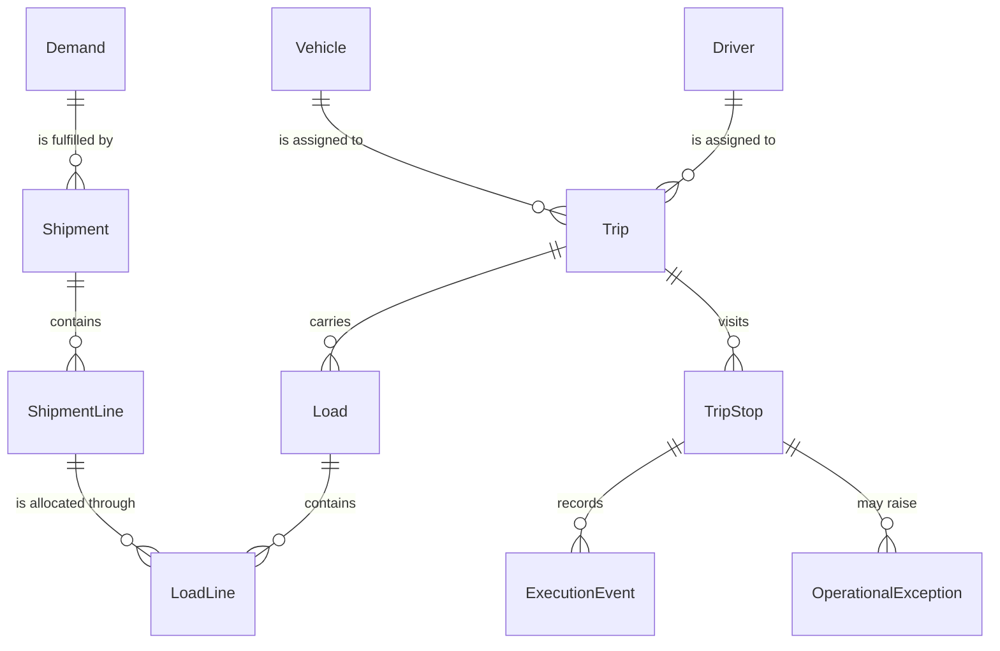
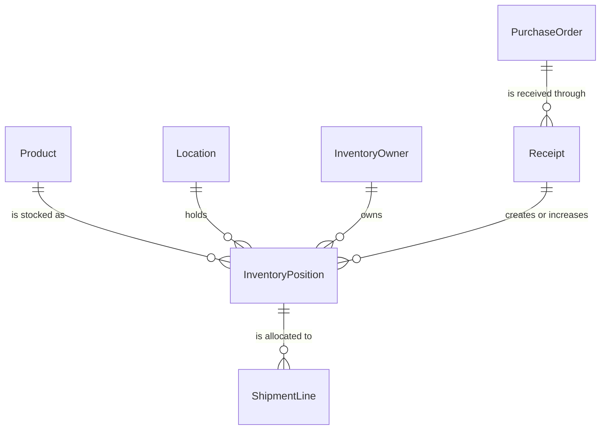
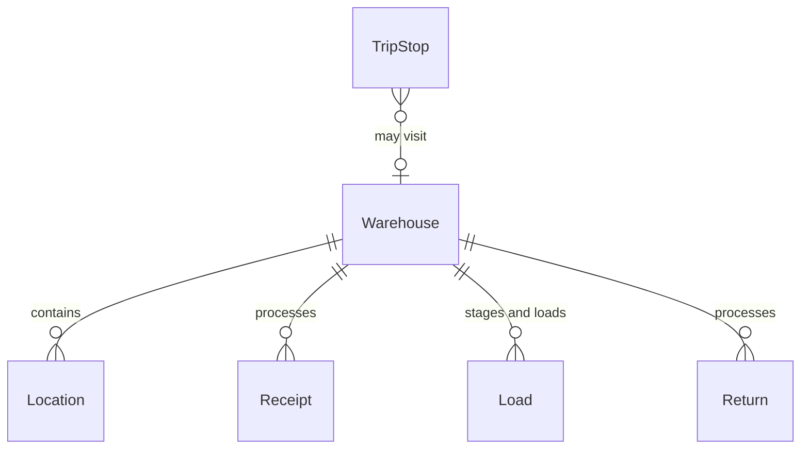
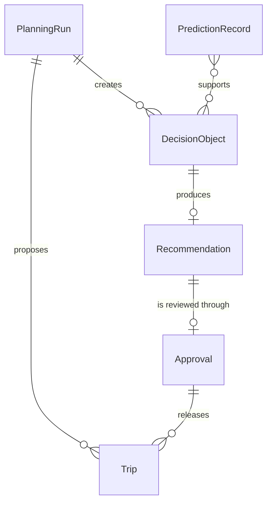
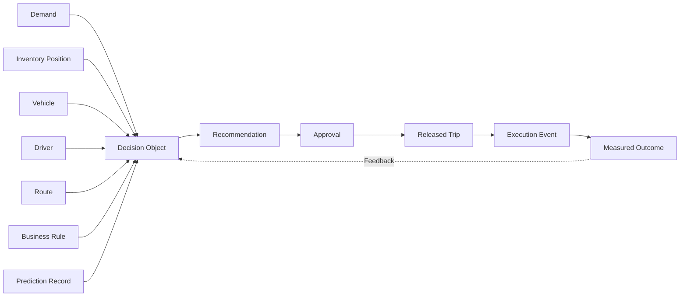
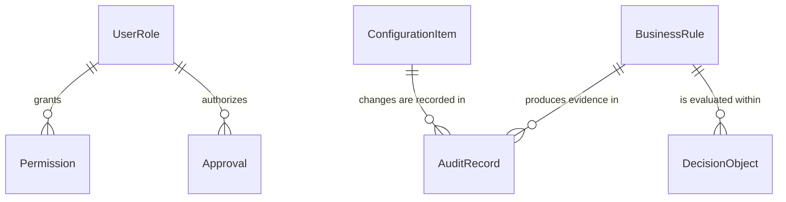
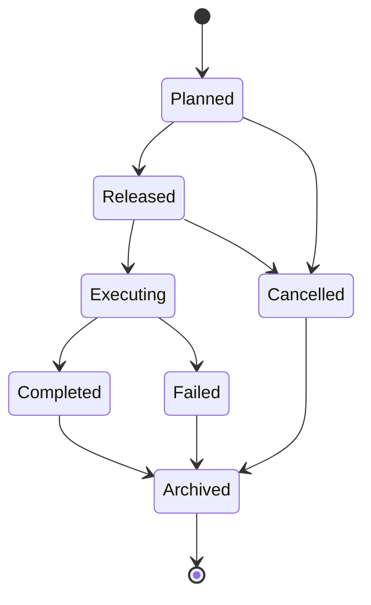
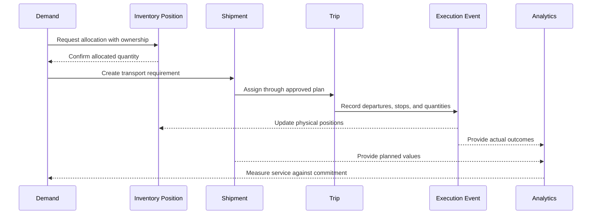

import DocumentInfo from '@site/src/components/DocumentInfo';

# كائنات الأعمال

<DocumentInfo
  category="الأعمال"
  audience={['الأعمال', 'العمليات', 'المنتج', 'التقنية', 'البيانات', 'الأمان']}
  status="Approved"
  version="1.0"
  owner="فريق هندسة الأعمال"
  updated="يوليو 2026"
  readingTime="18 دقيقة"
/>

## الغرض

كائنات الأعمال (Business Objects) هي كيانات الأعمال المعتمدة في SCOP (منصة تشغيل سلسلة الإمداد).

فهي تحدد ما تديره الأعمال — الأطراف والمنتجات والمخزون والطلب والشحنات والمركبات والرحلات والقرارات والنتائج — بشكل مستقل عن التقنية المستخدمة في تنفيذها.

هذه الصفحة هي المرجع الرسمي لكل كيان أعمال يُستخدم في جميع وثائق SCOP وتصميمه وتسليمه.

والفروق التالية جوهرية:

- كائنات الأعمال ليست نماذج Odoo.
- كائنات الأعمال ليست جداول قواعد بيانات.
- كائنات الأعمال ليست واجهات برمجة تطبيقات (APIs).
- قد يُربط كائن أعمال واحد بعدة نماذج Odoo.
- قد يدعم نموذج Odoo واحد عدة كائنات أعمال.

فعلى سبيل المثال، قد يُدعم كائن الأعمال Trip (الرحلة) بنموذج رحلة ونموذج محطة وسجلات تعيين مرتبطة، بينما قد يدعم نموذج شريك واحد في Odoo كلًا من كائني الأعمال Party (الطرف) وInventory Owner (مالك المخزون).

عندما تشير الوثائق أو القواعد أو القرارات أو التقارير إلى كيان أعمال، يجب أن تستخدم الكائن المعتمد المحدد في هذه الصفحة.

## مبادئ كائنات الأعمال

### مالك معتمد واحد

لكل كائن أعمال مجال أعمال معتمد واحد يملك تعريفه ومعناه ودورة حياته. وتستهلك المجالات الأخرى الكائن أو تثريه لكنها لا تنشئ نسخًا معتمدة متعارضة.

### هوية مستقرة

يمتلك كائن الأعمال المهم هوية مستقرة لا تتغير عند تغيّر بياناته أو حالته أو طريقة تنفيذه.

### دورة الحياة

لكل كائن أعمال دورة حياة محددة من الإنشاء إلى التقاعد أو الأرشفة. والكائن الذي لا يملك دورة حياة لا يمكن حوكمته.

### إدارة الحالة

حالة الكائن حقيقة أعمال مضبوطة. ولانتقالات الحالة فاعلون مخوَّلون وعمليات تحقق وأدلة تدقيق.

### قابلية التتبع

يجب أن يظل الكائن قابلًا للتتبع إلى الكائنات التي أنشأته، والقرارات التي أثّرت فيه، والنتائج التي أنتجها.

### الوعي بالإصدارات

حيثما تتطلب الأعمال سجلًا تاريخيًا، يمثل معرّف الكائن المفهوم المستمر بينما تمثل الإصدارات التعريفات أو المراجعات المعتمدة في نقاط زمنية محددة.

### العلاقات

العلاقات بين الكائنات صريحة واتجاهية. والعلاقات الخفية أو المفترضة غير مقبولة في الوثائق الخاضعة للحوكمة.

### معنى الأعمال قبل التنفيذ

يُعرَّف الكائن بمعناه في الأعمال أولًا. ويجب أن تدعم هياكل التنفيذ تعريف الأعمال لا أن تحل محله.

### الفصل بين الملكية والموقع المادي

حيثما يمثل الكائن بضائع، يظل مالكها في الأعمال وموقعها المادي حقيقتين منفصلتين دائمًا. فالتخزين في مستودع الشركة لا يعني أبدًا ملكية الشركة.

### الفصل بين البيانات المخططة والفعلية

القيم المخططة والنتائج الفعلية قابلة للتمييز دائمًا. فالخطة المعتمدة لا تُستبدل أبدًا بنتائج التنفيذ؛ بل يُحتفظ بكلتيهما.

## فئات كائنات الأعمال

تنقسم كائنات الأعمال في SCOP إلى ست فئات.

| الفئة | الغرض | أمثلة |
| --- | --- | --- |
| الكائنات الرئيسية (Master Objects) | تعريفات أعمال طويلة العمر تشير إليها المعاملات | Party, Location, Product, Warehouse, Vehicle, Driver, Route |
| كائنات المعاملات (Transaction Objects) | سجلات نشاط الأعمال والالتزامات | Demand, Purchase Order, Receipt, Shipment, Load, Return |
| كائنات التخطيط (Planning Objects) | تقييم مضبوط وإجراء مقترح | Planning Run, Decision Object, Recommendation, Approval |
| كائنات التنفيذ (Execution Objects) | النشاط التشغيلي الفعلي والانحرافات | Trip, Trip Stop, Execution Event, Operational Exception |
| الكائنات التحليلية (Analytical Objects) | قياس ورؤى خاضعة للحوكمة | KPI Definition, Prediction Record |
| كائنات الحوكمة (Governance Objects) | الضبط والتخويل والأدلة | Business Rule, Configuration Item, User Role, Permission, Audit Record |

تختلف الفئات في خصائصها النموذجية.

| الخاصية | الرئيسية | المعاملات | التخطيط | التنفيذ | التحليلية | الحوكمة |
| --- | --- | --- | --- | --- | --- | --- |
| العمر النموذجي | سنوات | أيام إلى أسابيع | ساعات إلى أيام | ساعات إلى أيام | فترات | سنوات |
| تكرار التغيير | منخفض | متوسط | مرتفع أثناء التخطيط | مرتفع أثناء التنفيذ | دوري | مضبوط |
| الملكية الأساسية | المجالات التأسيسية | المجالات التشغيلية | Planning and Decision | Execution and Exception | Performance and Analytics | Governance and Administration |
| متطلب السجل التاريخي | سجل الإصدارات | سجل كامل للمعاملات | سجل كامل للقرارات | سجل كامل للنتائج | إصدارات المعادلات | سجل تدقيق كامل |
| سياسة الحذف | التعطيل والأرشفة | الإلغاء والاحتفاظ | الاحتفاظ | الاحتفاظ | الاحتفاظ | الاحتفاظ |

## كائنات الأعمال المعتمدة

يُوثَّق كل كائن أدناه بغرضه ومعناه في الأعمال وملكيته ودورة حياته وعلاقاته، وعلاقاته مع التقنية ممثلةً في Odoo وDecision Engine (محرك القرار) وAI Platform (منصة الذكاء الاصطناعي).

الصفحات التفصيلية المستقبلية المشار إليها هنا هي وثائق مخطط لها وتبقى نصًا عاديًا حتى إنشائها.

### الطرف (Party)

الطرف (Party) هو منظمة تشارك في عمليات SCOP: عميل أو مورد أو كيان تابع للشركة. وهو يحمل هوية الأعمال والمسؤولية التي تُربط بها المواقع والالتزامات والملكية والمعاملات.

| الجانب | التعريف |
| --- | --- |
| المالك المعتمد | مالك مجال Party and Location |
| المجال الأساسي | Party and Location Management (إدارة الأطراف والمواقع) |
| ملخص دورة الحياة | مسودة → نشط → غير نشط → Archived (مؤرشف) |
| العلاقات | له العديد من كائنات Location وجهات الاتصال؛ وتشير إليه كائنات Demand وPurchase Order وShipment وInventory Owner |
| المدخلات النموذجية | معلومات التسجيل، جهات الاتصال، الاتفاقيات التجارية |
| المخرجات النموذجية | هوية طرف صالحة ومسؤولية وحالة |
| يستهلكه | Procurement, Demand, Inventory, Shipment, Planning, Analytics |
| ينتجه | Party and Location Management |
| العلاقة مع Odoo | مبني على سجلات الشركاء والشركات |
| العلاقة مع Decision Engine | يوفر هوية الطرف وسياق الخدمة لتقييم الأهلية |
| العلاقة مع الذكاء الاصطناعي | يوفر شرائح العملاء والموردين للتنبؤات |
| الصفحة التفصيلية المستقبلية | Party and Location Domain |

### الموقع (Location)

الموقع (Location) هو مكان مادي يُستخدم للاستلام أو الالتقاط أو التخزين أو التسليم أو النقل أو الإرجاع. وكل حركة في SCOP تبدأ وتنتهي عند Location.

| الجانب | التعريف |
| --- | --- |
| المالك المعتمد | مالك مجال Party and Location |
| المجال الأساسي | Party and Location Management |
| ملخص دورة الحياة | مسودة → نشط → غير نشط → Archived |
| العلاقات | ينتمي إلى Party أو كيان تابع للشركة؛ وتشير إليه كائنات Warehouse وDemand وShipment وRoute وTrip Stop |
| المدخلات النموذجية | العنوان، الإحداثيات، ساعات العمل، النوافذ الزمنية، قيود الوصول |
| المخرجات النموذجية | معلومات مصدر ووجهة تشغيلية صالحة |
| يستهلكه | Demand, Warehouse, Shipment, Route and Trip, Planning |
| ينتجه | Party and Location Management |
| العلاقة مع Odoo | مبني على عناوين الشركاء والمستودعات ومواقع المخزون |
| العلاقة مع Decision Engine | يوفر نوافذ الخدمة والقيود وسياق التنقل |
| العلاقة مع الذكاء الاصطناعي | يوفر خصائص جغرافية للتنبؤ بزمن التنقل وموعد الوصول المتوقع |
| الصفحة التفصيلية المستقبلية | Party and Location Domain |

### المنتج (Product)

المنتج (Product) هو صنف مادي يُشترى أو يُخزَّن أو يُنقل أو يُجمَع أو يُسلَّم. وهو يحدد ما يتحرك عبر سلسلة الإمداد والشروط اللازمة لتحريكه بأمان.

| الجانب | التعريف |
| --- | --- |
| المالك المعتمد | مالك مجال Product and Handling |
| المجال الأساسي | Product and Handling Management (إدارة المنتجات والمناولة) |
| ملخص دورة الحياة | مسودة → نشط → إيقاف تدريجي → غير نشط → Archived |
| العلاقات | ينتمي إلى Product Category؛ وتشير إليه كائنات Demand وInventory Position وShipment Line وLoad Line |
| المدخلات النموذجية | الهوية، وحدة القياس، الوزن، الحجم، متطلبات المناولة والتوافق |
| المخرجات النموذجية | متطلبات السعة والتخزين والنقل والتوافق |
| يستهلكه | Procurement, Demand, Inventory, Warehouse, Shipment, Planning |
| ينتجه | Product and Handling Management |
| العلاقة مع Odoo | مبني على سجلات المنتجات ووحدات القياس |
| العلاقة مع Decision Engine | يوفر إسهام السعة وقيود التوافق |
| العلاقة مع الذكاء الاصطناعي | يوفر خصائص المنتج لتنبؤات الطلب والمناولة |
| الصفحة التفصيلية المستقبلية | Product and Handling Domain |

### فئة المنتج (Product Category)

فئة المنتج (Product Category) هي تجميع مضبوط لمنتجات مترابطة يُستخدم للتصنيف والتوافق وسياسات المناولة والتحليل.

| الجانب | التعريف |
| --- | --- |
| المالك المعتمد | مالك مجال Product and Handling |
| المجال الأساسي | Product and Handling Management |
| ملخص دورة الحياة | مسودة → نشطة → غير نشطة → Archived |
| العلاقات | تجمع العديد من كائنات Product؛ وتشير إليها قواعد التوافق وكائنات KPI Definition |
| المدخلات النموذجية | هيكل التصنيف وسياسات المناولة |
| المخرجات النموذجية | تجميع مضبوط للمنتجات ونطاق للسياسات |
| يستهلكه | إدارة المنتجات، Business Rules، Analytics |
| ينتجه | Product and Handling Management |
| العلاقة مع Odoo | مبنية على سجلات فئات المنتجات |
| العلاقة مع Decision Engine | توفر نطاق مجموعات التوافق للقيود |
| العلاقة مع الذكاء الاصطناعي | توفر مستوى التجميع للتنبؤ بالطلب |
| الصفحة التفصيلية المستقبلية | Product and Handling Domain |

### مركز المخزون (Inventory Position)

مركز المخزون (Inventory Position) هو كمية من Product في Location لها حالة توافر محددة ومالك محدد. وهو الحقيقة الذرية لإدارة المخزون.

| الجانب | التعريف |
| --- | --- |
| المالك المعتمد | مالك مجال Inventory and Ownership |
| المجال الأساسي | Inventory and Ownership Management (إدارة المخزون والملكية) |
| ملخص دورة الحياة | يُنشأ بالاستلام أو الحركة → يُعدَّل → يُخصَّص → يُستهلك أو يُنقل |
| العلاقات | يشير إلى Product وLocation وInventory Owner والحصة أو الدفعة (lot/batch)؛ ويُخصَّص لكائنات Shipment Line |
| المدخلات النموذجية | عمليات الاستلام، الحركات، التسويات، التخصيصات |
| المخرجات النموذجية | الكميات المتاحة والمحجوزة والمتنبأ بها مع الملكية |
| يستهلكه | Warehouse, Shipment, Planning, Analytics |
| ينتجه | Inventory and Ownership Management |
| العلاقة مع Odoo | مبني على أرصدة المخزون (quants) وحركات المخزون |
| العلاقة مع Decision Engine | يوفر مدخلات التوافر واختيار المصدر |
| العلاقة مع الذكاء الاصطناعي | يوفر سجل التوافر للتنبؤ بمخاطر النقص |
| الصفحة التفصيلية المستقبلية | Inventory Domain |

### مالك المخزون (Inventory Owner)

مالك المخزون (Inventory Owner) هو طرف الأعمال الذي يملك كمية من المخزون، بمعزل عن مكان تخزينها المادي.

| الجانب | التعريف |
| --- | --- |
| المالك المعتمد | مالك مجال Inventory and Ownership |
| المجال الأساسي | Inventory and Ownership Management |
| ملخص دورة الحياة | يُثبَّت عند الاستلام → يُصان عبر كل حركة → يُغلق عند الاستهلاك أو الإرجاع |
| العلاقات | يشير إلى Party؛ ويوصِّف كائنات Inventory Position وShipment Line وLoad Line |
| المدخلات النموذجية | شروط الملكية من المشتريات أو اتفاقيات العملاء أو عمليات الاستلام |
| المخرجات النموذجية | ملكية قابلة للتتبع في كل خطوة من خطوات المخزون والحركة |
| يستهلكه | Warehouse, Shipment, Planning, Execution, Analytics |
| ينتجه | Inventory and Ownership Management |
| العلاقة مع Odoo | مبني على مراجع الشركاء الموصِّفة لسجلات المخزون |
| العلاقة مع Decision Engine | يفرض فصل الملكية كقيد صارم |
| العلاقة مع الذكاء الاصطناعي | الملكية لا تُستنتج أبدًا بالتنبؤ؛ فهي حقيقة خاضعة للحوكمة |
| الصفحة التفصيلية المستقبلية | Inventory Domain |

### المستودع (Warehouse)

المستودع (Warehouse) هو منشأة تديرها الشركة أو مصرَّح بها، تُستخدم للاستلام والتخزين والتجهيز والنقل والتحميل والعبور المباشر (cross-docking).

| الجانب | التعريف |
| --- | --- |
| المالك المعتمد | مالك مجال Party and Location؛ وتشغّله Warehouse Operations (عمليات المستودعات) |
| المجال الأساسي | Party and Location Management |
| ملخص دورة الحياة | مسودة → نشط → مقيَّد → غير نشط → Archived |
| العلاقات | يحتوي على كائنات Location؛ ويعالج كائنات Receipt وLoad؛ وتزوره كائنات Trip Stop |
| المدخلات النموذجية | تعريف المنشأة، السعة، ساعات العمل، القيود |
| المخرجات النموذجية | منشأة معالجة صالحة مع سياق الجاهزية والسعة |
| يستهلكه | Procurement, Inventory, Shipment, Planning, Route and Trip |
| ينتجه | Party and Location Management |
| العلاقة مع Odoo | مبني على سجلات المستودعات ومواقع المخزون |
| العلاقة مع Decision Engine | يوفر مدخلات اختيار المستودع والجاهزية |
| العلاقة مع الذكاء الاصطناعي | يوفر خصائص عبء العمل للتنبؤ بالجاهزية |
| الصفحة التفصيلية المستقبلية | Warehouse Operations Domain |

### الطلب (Demand)

الطلب (Demand) هو متطلب مُتحقَّق منه لنقل منتجات من Location إلى آخر. وهو نقطة دخول الدورة التشغيلية ومرتكز قابلية التتبع في المراحل اللاحقة.

| الجانب | التعريف |
| --- | --- |
| المالك المعتمد | مالك مجال Customer and Demand |
| المجال الأساسي | Customer and Demand Management (إدارة العملاء والطلب) |
| ملخص دورة الحياة | مسودة → مُقدَّم → مُتحقَّق منه → مؤهل → Planned (مخطط) → Released (مُطلَق) → Completed (مكتمل) أو Cancelled (ملغى) |
| العلاقات | يشير إلى Party وكائنات Location وProduct والأولوية والنافذة الزمنية؛ وتلبّيه كائنات Shipment |
| المدخلات النموذجية | طلبات العملاء، طلبات إعادة التزويد، التحويلات، المرتجعات، عمليات التجميع |
| المخرجات النموذجية | متطلبات نقل مؤهلة مع التزامات وأولويات |
| يستهلكه | Shipment, Planning, Execution, Analytics |
| ينتجه | Customer and Demand Management |
| العلاقة مع Odoo | مبني على مسارات عمل البيع أو الطلبات المعتمدة؛ ويُوحَّد بوصفه طلب نقل |
| العلاقة مع Decision Engine | مدخل التخطيط الأساسي؛ وتقييم الأهلية والأولوية |
| العلاقة مع الذكاء الاصطناعي | موضوع التنبؤ بالطلب والتنبؤ بالتغطية |
| الصفحة التفصيلية المستقبلية | Customer and Demand Domain |

### متطلب الشراء (Purchase Requirement)

متطلب الشراء (Purchase Requirement) هو حاجة أعمال إلى توريد خارجي قبل وجود التزام من المورد.

| الجانب | التعريف |
| --- | --- |
| المالك المعتمد | مالك مجال Procurement |
| المجال الأساسي | Procurement and Inbound Supply (المشتريات والتوريد الوارد) |
| ملخص دورة الحياة | متطلب → معتمد → تم طلبه أو Cancelled |
| العلاقات | يشير إلى كائنات Product والوجهة؛ ويقود إلى كائنات Purchase Order |
| المدخلات النموذجية | تنبؤات الطلب، سياسات إعادة التزويد، طلبات الإدارة |
| المخرجات النموذجية | احتياجات توريد معتمدة |
| يستهلكه | Procurement, Planning, Analytics |
| ينتجه | Procurement and Inbound Supply |
| العلاقة مع Odoo | مبني على مسارات عمل طلبات أو متطلبات الشراء |
| العلاقة مع Decision Engine | يوفر سياق التوريد المتوقع |
| العلاقة مع الذكاء الاصطناعي | مدعوم بالتنبؤ بالطلب والسعة |
| الصفحة التفصيلية المستقبلية | Procurement Domain |

### أمر الشراء (Purchase Order)

أمر الشراء (Purchase Order) هو التزام معتمد تجاه مورد بمنتجات وكميات وتواريخ ووجهات محددة.

| الجانب | التعريف |
| --- | --- |
| المالك المعتمد | مالك مجال Procurement |
| المجال الأساسي | Procurement and Inbound Supply |
| ملخص دورة الحياة | تم طلبه → مؤكد → متوقع → مستلم أو مستلم جزئيًا أو Cancelled |
| العلاقات | يشير إلى Party المورد وكائنات Product وWarehouse الوجهة؛ وينتج كائنات Receipt وطلبات Demand للتجميع من الموردين |
| المدخلات النموذجية | كائنات Purchase Requirement المعتمدة وشروط الموردين |
| المخرجات النموذجية | التزامات الموردين والتوريد الوارد المتوقع |
| يستهلكه | Inventory, Warehouse, Planning, Analytics |
| ينتجه | Procurement and Inbound Supply |
| العلاقة مع Odoo | مبني على سجلات أوامر الشراء |
| العلاقة مع Decision Engine | يوفر التوافر المتوقع للتخطيط الشرطي |
| العلاقة مع الذكاء الاصطناعي | يوفر السجل التاريخي للتنبؤ بمخاطر تأخر التوريد |
| الصفحة التفصيلية المستقبلية | Procurement Domain |

### الاستلام (Receipt)

الاستلام (Receipt) هو عملية المستودع التي تتحقق من الوصول المادي للبضائع وتسجّله.

| الجانب | التعريف |
| --- | --- |
| المالك المعتمد | مالك مجال Warehouse Operations |
| المجال الأساسي | Warehouse Operations |
| ملخص دورة الحياة | متوقع → قيد التنفيذ → مُتحقَّق منه → مُرحَّل، أو استثناء |
| العلاقات | يشير إلى Purchase Order أو Demand وارد؛ وينشئ كائنات Inventory Position أو يزيدها؛ وقد يغذي تجهيز العبور المباشر (Cross-Dock) |
| المدخلات النموذجية | التوريد الوارد المتوقع والوصول المادي |
| المخرجات النموذجية | كميات مستلمة مُتحقَّق منها وتحديثات للمخزون |
| يستهلكه | Inventory, Planning, Analytics |
| ينتجه | Warehouse Operations |
| العلاقة مع Odoo | مبني على عمليات المخزون الواردة |
| العلاقة مع Decision Engine | يحوّل التوريد المتوقع إلى توافر مؤكد |
| العلاقة مع الذكاء الاصطناعي | يوفر السجل التاريخي للتنبؤ بالجاهزية ومدة المناولة |
| الصفحة التفصيلية المستقبلية | Warehouse Operations Domain |

### الشحنة (Shipment)

الشحنة (Shipment) هي مجموعة منطقية من البضائع تتطلب نقلًا بين كائنات Location محددة. وهي متطلب النقل، لا الحمولة المادية.

| الجانب | التعريف |
| --- | --- |
| المالك المعتمد | مالك مجال Shipment and Load |
| المجال الأساسي | Shipment and Load Management (إدارة الشحنات والحمولات) |
| ملخص دورة الحياة | مُنشأة → جاهزة → Planned → قيد التنفيذ → Completed، أو Cancelled |
| العلاقات | تلبّي Demand؛ وتحتوي على كائنات Shipment Line؛ وتُنقل عبر كائنات Load؛ وتُسنَد إلى كائنات Trip |
| المدخلات النموذجية | Demand مؤهل وكائنات Inventory Position مخصصة |
| المخرجات النموذجية | متطلبات قابلة للنقل مع القيود والجاهزية |
| يستهلكه | Planning, Route and Trip, Warehouse, Execution |
| ينتجه | Shipment and Load Management |
| العلاقة مع Odoo | امتداد SCOP مرتبط بسجلات المخزون والتسليم |
| العلاقة مع Decision Engine | مدخل الدمج وتكوين الرحلات |
| العلاقة مع الذكاء الاصطناعي | موضوع مؤشرات ملاءمة الدمج |
| الصفحة التفصيلية المستقبلية | Shipment and Load Domain |

### بند الشحنة (Shipment Line)

بند الشحنة (Shipment Line) هو منتج وكمية ضمن Shipment، يحمل متطلبات الملكية والمناولة على مستوى البند.

| الجانب | التعريف |
| --- | --- |
| المالك المعتمد | مالك مجال Shipment and Load |
| المجال الأساسي | Shipment and Load Management |
| ملخص دورة الحياة | يتبع Shipment التابعة له؛ وقابل للتتبع فرديًا إلى التخصيص والتسليم |
| العلاقات | ينتمي إلى Shipment واحدة؛ ويشير إلى Product وInventory Owner؛ ويُخصَّص عبر كائنات Load Line |
| المدخلات النموذجية | بنود Demand وتخصيصات المخزون |
| المخرجات النموذجية | كميات وملكية وقيود على مستوى البند |
| يستهلكه | Warehouse، تكوين Load، Execution |
| ينتجه | Shipment and Load Management |
| العلاقة مع Odoo | امتداد SCOP مرتبط ببنود حركات المخزون |
| العلاقة مع Decision Engine | يوفر إسهام السعة لكل بند |
| العلاقة مع الذكاء الاصطناعي | يوفر خصائص البنود لتنبؤات المناولة |
| الصفحة التفصيلية المستقبلية | Shipment and Load Domain |

### الحمولة (Load)

الحمولة (Load) هي البضاعة المادية المخصصة لمركبة من أجل رحلة. وهي خطة محتوى المركبة، وبعد التنفيذ نتيجة محتوى المركبة.

| الجانب | التعريف |
| --- | --- |
| المالك المعتمد | مالك مجال Shipment and Load |
| المجال الأساسي | Shipment and Load Management |
| ملخص دورة الحياة | مقترحة → مؤكدة → مجهزة → محمَّلة → في الطريق → مفرَّغة → مغلقة |
| العلاقات | تنتمي إلى Trip واحدة؛ وتحتوي على كائنات Load Line؛ ويجهزها ويحمّلها Warehouse |
| المدخلات النموذجية | كائنات Shipment مدمجة وسعة المركبة |
| المخرجات النموذجية | حمولة مادية قابلة للتنفيذ مع تسلسل تحميل |
| يستهلكه | Warehouse, Route and Trip, Execution |
| ينتجه | Shipment and Load Management |
| العلاقة مع Odoo | امتداد SCOP مرتبط بعمليات الرحلات والمخزون |
| العلاقة مع Decision Engine | موضوع جدوى السعة عبر جميع الأبعاد |
| العلاقة مع الذكاء الاصطناعي | توفر خصائص التكوين لمؤشرات المخاطر |
| الصفحة التفصيلية المستقبلية | Shipment and Load Domain |

### بند الحمولة (Load Line)

بند الحمولة (Load Line) هو منتج وكمية ضمن Load، يربط البضاعة المادية رجوعًا بكائنات Shipment Line والملكية.

| الجانب | التعريف |
| --- | --- |
| المالك المعتمد | مالك مجال Shipment and Load |
| المجال الأساسي | Shipment and Load Management |
| ملخص دورة الحياة | يتبع Load التابعة له؛ ويسجّل الكميات المحمَّلة المخططة والفعلية |
| العلاقات | ينتمي إلى Load واحدة؛ ويشير إلى Shipment Line وProduct وInventory Owner |
| المدخلات النموذجية | كائنات Shipment Line ونتائج التجهيز |
| المخرجات النموذجية | الكميات المحمَّلة المخططة مقابل الفعلية |
| يستهلكه | Execution, Inventory, Analytics |
| ينتجه | Shipment and Load Management |
| العلاقة مع Odoo | امتداد SCOP مرتبط ببنود حركات المخزون |
| العلاقة مع Decision Engine | يوفر مدخلات حساب السعة الديناميكية |
| العلاقة مع الذكاء الاصطناعي | يوفر القيم الفعلية لتعلّم افتراضات السعة |
| الصفحة التفصيلية المستقبلية | Shipment and Load Domain |

### المركبة (Vehicle)

المركبة (Vehicle) هي مورد نقل مملوك للشركة له سعة وتهيئة وتوافر محددة.

| الجانب | التعريف |
| --- | --- |
| المالك المعتمد | مالك مجال Fleet and Driver |
| المجال الأساسي | Fleet and Driver Management |
| ملخص دورة الحياة | مسجَّلة → نشطة → قيد الصيانة أو محظورة → غير نشطة → مسحوبة من الخدمة |
| العلاقات | تنتمي إلى Vehicle Type؛ وتُسنَد إلى كائنات Trip؛ ومقيدة بالسعة وقيود المسارات |
| المدخلات النموذجية | التسجيل وملف السعة وحالة الصيانة والتوافر |
| المخرجات النموذجية | سعة نقل مؤهلة |
| يستهلكه | Planning, Route and Trip, Execution, Analytics |
| ينتجه | Fleet and Driver Management |
| العلاقة مع Odoo | مبنية على سجلات الأسطول مع امتدادات SCOP للسعة |
| العلاقة مع Decision Engine | موضوع أهلية الإسناد وقيود السعة |
| العلاقة مع الذكاء الاصطناعي | موضوع ترتيب الملاءمة والتنبؤ بالاستغلال |
| الصفحة التفصيلية المستقبلية | Fleet and Driver Domain |

### نوع المركبة (Vehicle Type)

نوع المركبة (Vehicle Type) هو ملف سعة وتهيئة قابل لإعادة الاستخدام تتشاركه المركبات المتماثلة.

| الجانب | التعريف |
| --- | --- |
| المالك المعتمد | مالك مجال Fleet and Driver |
| المجال الأساسي | Fleet and Driver Management |
| ملخص دورة الحياة | مسودة → نشط → غير نشط → مؤرشف |
| العلاقات | يجمع العديد من كائنات Vehicle؛ ويحدد ملفات السعة والحُجرات الافتراضية |
| المدخلات النموذجية | أبعاد السعة وقدرة التحكم في درجة الحرارة والتهيئة |
| المخرجات النموذجية | ملفات سعة قابلة لإعادة الاستخدام للتخطيط |
| يستهلكه | إدارة الأسطول، Planning، Analytics |
| ينتجه | Fleet and Driver Management |
| العلاقة مع Odoo | مبني على سجلات طرازات أو فئات الأسطول مع امتدادات |
| العلاقة مع Decision Engine | يوفر قيود السعة الافتراضية |
| العلاقة مع الذكاء الاصطناعي | يوفر خصائص على مستوى النوع للتنبؤ بالسعة |
| الصفحة التفصيلية المستقبلية | Fleet and Driver Domain |

### السائق (Driver)

السائق (Driver) هو شخص مخوَّل بتنفيذ رحلات المركبات، وله مؤهلات وتوافر وحدود لوقت العمل.

| الجانب | التعريف |
| --- | --- |
| المالك المعتمد | مالك مجال Fleet and Driver |
| المجال الأساسي | Fleet and Driver Management |
| ملخص دورة الحياة | مسجَّل → نشط → مقيَّد أو غائب → غير نشط → متقاعد |
| العلاقات | يشير إلى User على المنصة؛ ويُسنَد إلى كائنات Trip؛ ومقيد بالمؤهلات ووقت العمل |
| المدخلات النموذجية | المؤهلات وصلاحية الرخصة والتوافر والقيود |
| المخرجات النموذجية | سعة سائقين مؤهلة |
| يستهلكه | Planning, Route and Trip, Execution |
| ينتجه | Fleet and Driver Management |
| العلاقة مع Odoo | مبني على سجلات الموظفين والمستخدمين مع امتدادات SCOP |
| العلاقة مع Decision Engine | موضوع أهلية الإسناد؛ ومنع التداخل |
| العلاقة مع الذكاء الاصطناعي | موضوع دقة التوافر ومخاطر النقص |
| الصفحة التفصيلية المستقبلية | Fleet and Driver Domain |

### المسار (Route)

المسار (Route) هو طريق تشغيلي محدد مسبقًا قابل لإعادة الاستخدام أو تسلسل من المواقع. وهو قالب، وليس أبدًا تنفيذًا مؤرخًا.

| الجانب | التعريف |
| --- | --- |
| المالك المعتمد | مالك مجال Route and Trip |
| المجال الأساسي | Route and Trip Management |
| ملخص دورة الحياة | مسودة → نشط → غير نشط → مؤرشف |
| العلاقات | يحتوي على قوالب محطات مسار تشير إلى كائنات Location؛ وتعيد استخدامه العديد من كائنات Trip |
| المدخلات النموذجية | تسلسلات المواقع والمسافات والمدد والقيود |
| المخرجات النموذجية | هياكل طرق قابلة لإعادة الاستخدام للتخطيط |
| يستهلكه | Planning, Route and Trip, Analytics |
| ينتجه | Route and Trip Management |
| العلاقة مع Odoo | قدرة SCOP مخصصة |
| العلاقة مع Decision Engine | مدخل اختيار المسار وقيد التوافق |
| العلاقة مع الذكاء الاصطناعي | يوفر التاريخ لتقدير مدة المسار |
| الصفحة التفصيلية المستقبلية | Route and Trip Domain |

### الرحلة (Trip)

الرحلة (Trip) هي تنفيذ نقل مؤرخ بموارد مسندة وحمولات ومحطات متسلسلة وأوقات مخططة وفعلية. وهي التجسيد التشغيلي لكائن Route أو لتسلسل محطات محسَّن.

| الجانب | التعريف |
| --- | --- |
| المالك المعتمد | مالك مجال Route and Trip |
| المجال الأساسي | Route and Trip Management |
| ملخص دورة الحياة | مسودة → موصى بها → معتمدة → مُطلَقة → قيد التحميل → قيد التنفيذ → مكتملة أو مكتملة جزئيًا أو ملغاة |
| العلاقات | قد تشير إلى Route؛ وتحمل كائنات Load؛ وتحتوي على كائنات Trip Stop؛ وتُسنَد إليها مركبة Vehicle واحدة وسائق Driver واحد؛ وتُطلقها Approval |
| المدخلات النموذجية | الخطة المعتمدة والشحنات والموارد وتسلسل المحطات |
| المخرجات النموذجية | نقل منفَّذ بنتائج مخططة وفعلية |
| يستهلكه | Warehouse, Execution, Analytics |
| ينتجه | Planning and Decision عبر Route and Trip Management |
| العلاقة مع Odoo | قدرة SCOP مخصصة مرتبطة بسجلات المخزون والأسطول |
| العلاقة مع Decision Engine | المخرج التخطيطي الرئيسي؛ وموضوع الجدوى |
| العلاقة مع الذكاء الاصطناعي | موضوع التنبؤ بوقت الوصول المتوقع والمدة ومخاطر التأخير |
| الصفحة التفصيلية المستقبلية | Route and Trip Domain |

### محطة الرحلة (Trip Stop)

محطة الرحلة (Trip Stop) هي زيارة تشغيلية واحدة ضمن Trip، بتسلسل مخطط ونشاط ونافذة زمنية ونتيجة مسجلة.

| الجانب | التعريف |
| --- | --- |
| المالك المعتمد | مالك مجال Route and Trip |
| المجال الأساسي | Route and Trip Management |
| ملخص دورة الحياة | مخططة → تم الوصول → قيد الخدمة → مكتملة أو فاشلة أو متجاوَزة أو معاد جدولتها |
| العلاقات | تنتمي إلى Trip واحدة؛ وتشير إلى Location؛ وتسجل نشاط استلام أو تسليم أو نقل أو إرجاع؛ وتنتج كائنات Execution Event |
| المدخلات النموذجية | تسلسل المحطات والنوافذ الزمنية ومدد الخدمة |
| المخرجات النموذجية | نتائج المحطات والأوقات الفعلية |
| يستهلكه | Execution, Inventory, Analytics |
| ينتجه | Route and Trip Management |
| العلاقة مع Odoo | قدرة SCOP مخصصة |
| العلاقة مع Decision Engine | موضوع التسلسل وتقييم النوافذ الزمنية |
| العلاقة مع الذكاء الاصطناعي | موضوع التنبؤ بمدة الخدمة ومخاطر الفشل |
| الصفحة التفصيلية المستقبلية | Route and Trip Domain |

### جولة التخطيط (Planning Run)

جولة التخطيط (Planning Run) هي تقييم منضبط يحوّل الطلب المؤهل والموارد المتاحة إلى خطة يومية موصى بها لنطاق وتاريخ محددين.

| الجانب | التعريف |
| --- | --- |
| المالك المعتمد | مالك مجال Planning and Decision |
| المجال الأساسي | Planning and Decision Management |
| ملخص دورة الحياة | مطلوبة → قيد التقييم → موصى بها → مُراجَعة → مغلقة |
| العلاقات | تستهلك Demand وكائنات Inventory Position والجاهزية وكائنات Vehicle وDriver وRoute؛ وتنشئ كائنات Decision Object وكائنات Trip مقترحة |
| المدخلات النموذجية | تاريخ التخطيط والطلب المؤهل والموارد والقواعد والقيود والأهداف |
| المخرجات النموذجية | رحلات موصى بها وطلب غير مخطط مع الأسباب وتحذيرات |
| يستهلكه | المراجعة التشغيلية، Analytics |
| ينتجه | Planning and Decision Management |
| العلاقة مع Odoo | قدرة تخطيط SCOP |
| العلاقة مع Decision Engine | وحدة التقييم المنسق لدى المحرك |
| العلاقة مع الذكاء الاصطناعي | تستهلك التنبؤات؛ وتنتج سياق الثقة |
| الصفحة التفصيلية المستقبلية | Planning and Decision Domain |

### كائن القرار (Decision Object)

كائن القرار (Decision Object) هو قرار تشغيلي مهيكل يحتوي على السياق والمدخلات والقواعد والقيود والبدائل والتوصية والموافقة والنتيجة.

| الجانب | التعريف |
| --- | --- |
| المالك المعتمد | مالك مجال Planning and Decision |
| المجال الأساسي | Planning and Decision Management |
| ملخص دورة الحياة | مُنشأ → قيد التحقق → قيد التقييم → موصى به → قيد المراجعة → معتمد أو معدَّل أو مرفوض → مُطلَق → منفَّذ → مُقاس |
| العلاقات | تنشئه Planning Run أو محفّز تشغيلي؛ وينتج Recommendation؛ وتغلقه Approval ونتيجة مقاسة |
| المدخلات النموذجية | السياق التشغيلي والقواعد والقيود والأهداف والتنبؤات |
| المخرجات النموذجية | قرار قابل للتتبع مع تفسير ونتيجة |
| يستهلكه | Execution, Analytics, Governance |
| ينتجه | Planning and Decision Management |
| العلاقة مع Odoo | سجلات قرارات SCOP |
| العلاقة مع Decision Engine | الكائن الأساسي الذي يديره المحرك |
| العلاقة مع الذكاء الاصطناعي | يشير إلى كائنات Prediction Record المستخدمة كمدخلات |
| الصفحة التفصيلية المستقبلية | Planning and Decision Domain |

### التوصية (Recommendation)

التوصية (Recommendation) هي البديل الذي يقترحه Decision Engine لكائن Decision Object، مع تفسيره ودرجة ثقته.

| الجانب | التعريف |
| --- | --- |
| المالك المعتمد | مالك مجال Planning and Decision |
| المجال الأساسي | Planning and Decision Management |
| ملخص دورة الحياة | مولَّدة → قيد المراجعة → مقبولة أو معدَّلة أو مرفوضة |
| العلاقات | تنتمي إلى Decision Object واحد؛ وتُراجَع عبر Approval؛ وتُقارَن بالقرار النهائي والنتيجة |
| المدخلات النموذجية | البدائل الممكنة وتقييم الأهداف والتفسيرات |
| المخرجات النموذجية | إجراء مقترح مع تفسير من منظور الأعمال |
| يستهلكه | المراجعة التشغيلية، Analytics، Governance |
| ينتجه | Planning and Decision Management |
| العلاقة مع Odoo | سجلات قرارات SCOP |
| العلاقة مع Decision Engine | المخرج الرئيسي للمحرك |
| العلاقة مع الذكاء الاصطناعي | قد تحمل درجة ثقة ومراجع تنبؤات |
| الصفحة التفصيلية المستقبلية | Planning and Decision Domain |

### الموافقة (Approval)

الموافقة (Approval) هي القبول أو التعديل أو الرفض المخوَّل لتوصية Recommendation أو إجراء منضبط، وتُسجَّل مع منفذها ووقتها وسببها.

| الجانب | التعريف |
| --- | --- |
| المالك المعتمد | مالك مجال Planning and Decision؛ وتخضع صلاحية الموافقة لحوكمة Platform Governance |
| المجال الأساسي | Planning and Decision Management |
| ملخص دورة الحياة | مطلوبة → ممنوحة أو معدَّلة أو مرفوضة → مسجلة |
| العلاقات | تنطبق على Recommendation أو خطة أو معاملة منضبطة؛ ويمارسها User Role يملك صلاحية الموافقة؛ وتُطلق كائنات Trip |
| المدخلات النموذجية | التوصية والتفسير وصلاحية المراجع |
| المخرجات النموذجية | إطلاق تشغيلي مخوَّل أو رفض مع الأسباب |
| يستهلكه | Execution, Audit, Analytics |
| ينتجه | المستخدمون التشغيليون المخوَّلون |
| العلاقة مع Odoo | حالات الموافقة في سير العمل وسجلات قرارات SCOP |
| العلاقة مع Decision Engine | بوابة إلزامية بين التوصية والإطلاق |
| العلاقة مع الذكاء الاصطناعي | لا ينتجها الذكاء الاصطناعي أبدًا؛ ومخرجات الذكاء الاصطناعي تتطلب موافقة بشرية |
| الصفحة التفصيلية المستقبلية | Planning and Decision Domain |

### حدث التنفيذ (Execution Event)

حدث التنفيذ (Execution Event) هو إجراء تشغيلي مسجل أو تغيير حالة أثناء التنفيذ: مغادرة أو وصول أو خدمة أو تأكيد كمية أو إكمال.

| الجانب | التعريف |
| --- | --- |
| المالك المعتمد | مالك مجال Execution and Exception |
| المجال الأساسي | Execution and Exception Management |
| ملخص دورة الحياة | مسجل → متحقق منه → مُسوّى |
| العلاقات | ينتمي إلى Trip أو Trip Stop؛ ويحدّث كائنات Inventory Position؛ ويغذي التسوية وAnalytics |
| المدخلات النموذجية | تأكيدات تشغيلية من المستخدمين أو من تطبيقات السائقين المستقبلية |
| المخرجات النموذجية | الأوقات والكميات والحالات الفعلية |
| يستهلكه | Inventory، Analytics، مراقبة AI Platform |
| ينتجه | Execution and Exception Management |
| العلاقة مع Odoo | سجلات تنفيذ SCOP مرتبطة بعمليات المخزون |
| العلاقة مع Decision Engine | يوفر النتائج لقياس القرارات |
| العلاقة مع الذكاء الاصطناعي | يوفر القيم الفعلية لمراقبة دقة التنبؤ |
| الصفحة التفصيلية المستقبلية | Execution and Exception Domain |

### الاستثناء التشغيلي (Operational Exception)

الاستثناء التشغيلي (Operational Exception) هو حالة تمنع التخطيط أو التنفيذ الطبيعي، وله مالك وشدة وحل ونتيجة محددة.

| الجانب | التعريف |
| --- | --- |
| المالك المعتمد | مالك مجال Execution and Exception؛ وتنطبق ملكية مجال السبب |
| المجال الأساسي | Execution and Exception Management |
| ملخص دورة الحياة | مكتشف → مصنَّف → مُسنَد → قيد التحقيق → قيد الحل → محلول → مغلق، أو ملغى |
| العلاقات | يشير إلى Demand أو Shipment أو Trip أو المورد أو Decision Object المتأثر؛ وقد يحفّز إعادة التخطيط وFollow-Up Demand |
| المدخلات النموذجية | عمليات تحقق فاشلة وإخفاقات تنفيذ ومشكلات موارد |
| المخرجات النموذجية | انحرافات مملوكة ومحلولة ومقاسة |
| يستهلكه | Planning, Analytics, Governance |
| ينتجه | أي مجال تشغيلي؛ ويديره Execution and Exception |
| العلاقة مع Odoo | سجلات استثناءات SCOP |
| العلاقة مع Decision Engine | قد يحفّز توصيات لحل الاستثناءات |
| العلاقة مع الذكاء الاصطناعي | موضوع كشف الشذوذ ومخاطر الفشل |
| الصفحة التفصيلية المستقبلية | Execution and Exception Domain |

### المرتجع (Return)

المرتجع (Return) هو حركة بضائع عائدة من عميل أو فرع أو رحلة باتجاه مستودع أو مورّد، مع سببه وملكيته وطريقة التصرف فيه.

| الجانب | التعريف |
| --- | --- |
| المالك المعتمد | مالك مجال Execution and Exception |
| المجال الأساسي | Execution and Exception Management |
| ملخص دورة الحياة | مُنشأ → مُجمَّع → مستلَم → تم التصرف فيه → مغلق |
| العلاقات | يشير إلى Demand أو التسليم الأصلي حيثما ينطبق؛ وينشئ عمل مستودع وارد وتحديثات مخزون |
| المدخلات النموذجية | حالات الرفض والأضرار والزيادات ومتطلبات التجميع |
| المخرجات النموذجية | حركات عكسية منضبطة مع التصرف |
| يستهلكه | Warehouse, Inventory, Analytics |
| ينتجه | Execution and Exception Management |
| العلاقة مع Odoo | مبني على عمليات مخزون المرتجعات |
| العلاقة مع Decision Engine | قد يُخطط ضمن الرحلات كنشاط استلام |
| العلاقة مع الذكاء الاصطناعي | يوفر خصائص معدل الإرجاع لمؤشرات المخاطر |
| الصفحة التفصيلية المستقبلية | Execution and Exception Domain |

### تعريف مؤشر الأداء (KPI Definition)

تعريف مؤشر الأداء (KPI Definition) هو مقياس أداء محكوم له مالك وإصدار معادلة ونطاق وفترة قياس.

| الجانب | التعريف |
| --- | --- |
| المالك المعتمد | مالك مجال Performance and Analytics |
| المجال الأساسي | Performance and Analytics |
| ملخص دورة الحياة | مسودة → معتمد → نشط → مستبدَل → مسحوب من الخدمة |
| العلاقات | يُحسب من بيانات تشغيلية وقرارات وتنبؤات محكومة؛ وينتج نتائج مؤشرات الأداء والانحرافات |
| المدخلات النموذجية | المعادلات والأهداف ومصادر البيانات المعتمدة |
| المخرجات النموذجية | مقاييس أداء موثوقة ومُصدَرة |
| يستهلكه | الإدارة، العمليات، Governance |
| ينتجه | Performance and Analytics |
| العلاقة مع Odoo | قدرات إعداد التقارير والتحليلات |
| العلاقة مع Decision Engine | يقيس جودة القرارات ونتائجها |
| العلاقة مع الذكاء الاصطناعي | يقيس الأثر التجاري للنماذج |
| الصفحة التفصيلية المستقبلية | Performance and Analytics Domain |

### سجل التنبؤ (Prediction Record)

سجل التنبؤ (Prediction Record) هو مخرج ذكاء اصطناعي قابل للتتبع: القدرة وإصدار النموذج والمدخلات والنتيجة ودرجة الثقة والتفسير وفترة الصلاحية والنتيجة الفعلية النهائية.

| الجانب | التعريف |
| --- | --- |
| المالك المعتمد | مالك AI Platform |
| المجال الأساسي | AI Platform |
| ملخص دورة الحياة | مولَّد → مستهلَك → منتهي الصلاحية أو مستبدَل → مُقاس مقابل النتيجة |
| العلاقات | يشير إلى كائنات الأعمال المدخلة وإصدارات الخصائص؛ وتستهلكه كائنات Decision Object؛ ويُقارَن بكائنات Execution Event |
| المدخلات النموذجية | السياق التشغيلي وإصدارات النماذج المعتمدة |
| المخرجات النموذجية | تنبؤات مع درجة ثقة وتفسير |
| يستهلكه | Planning and Decision, Analytics |
| ينتجه | AI Platform |
| العلاقة مع Odoo | يُشار إليه من سجلات القرارات والتخطيط في SCOP |
| العلاقة مع Decision Engine | مدخل داعم؛ وليس أبدًا مرجعية أعمال نهائية |
| العلاقة مع الذكاء الاصطناعي | المخرج المحكوم الرئيسي للمنصة |
| الصفحة التفصيلية المستقبلية | AI Capability Catalogue |

### سجل التدقيق (Audit Record)

سجل التدقيق (Audit Record) هو دليل على إجراء أو تغيير مهم: من فعل ماذا، ومتى، وعلى أي كائن، وبأي نتيجة.

| الجانب | التعريف |
| --- | --- |
| المالك المعتمد | مالك Platform Governance and Administration |
| المجال الأساسي | Platform Governance and Administration |
| ملخص دورة الحياة | مسجل → محتفظ به → مؤرشف وفق سياسة الاحتفاظ |
| العلاقات | يشير إلى المستخدمين وكائنات الأعمال والقواعد والتهيئات والقرارات |
| المدخلات النموذجية | الموافقات والتجاوزات وتغييرات القواعد والإطلاقات والإجراءات الإدارية |
| المخرجات النموذجية | أدلة محمية قابلة للمراجعة |
| يستهلكه | Governance، Security، Analytics، التحقيقات |
| ينتجه | جميع قدرات المنصة المحكومة |
| العلاقة مع Odoo | التسجيل والتتبع وامتدادات تدقيق SCOP |
| العلاقة مع Decision Engine | يحتفظ بأدلة تقييم القرارات |
| العلاقة مع الذكاء الاصطناعي | يحتفظ بإصدارات النماذج وأدلة التنبؤات |
| الصفحة التفصيلية المستقبلية | Security and Authorization |

### قاعدة الأعمال (Business Rule)

قاعدة الأعمال (Business Rule) هي بيان معتمد يحكم سلوك الأعمال، ويُدار من خلال الإطار المحدد في صفحة قواعد الأعمال.

| الجانب | التعريف |
| --- | --- |
| المالك المعتمد | Rule Business Owner؛ وتحكمها Platform Governance |
| المجال الأساسي | Platform Governance and Administration |
| ملخص دورة الحياة | مقترحة → مسودة → قيد المراجعة → معتمدة → مجدولة → نشطة → معلَّقة أو مسحوبة من الخدمة |
| العلاقات | تنتمي إلى مجال أعمال أساسي؛ وتُنفَّذ عبر طبقات التطبيق؛ وتُقيَّم ضمن كائنات Decision Object |
| المدخلات النموذجية | سياسة الأعمال وموافقة الحوكمة |
| المخرجات النموذجية | سلوك صريح ومُصدَر وقابل للاختبار |
| يستهلكه | جميع المجالات التشغيلية، Decision Engine، Security |
| ينتجه | مالكو الأعمال عبر الحوكمة |
| العلاقة مع Odoo | تُنفَّذ من خلال آليات القيود وسير العمل المدعومة |
| العلاقة مع Decision Engine | مصدر قيود الأهلية والقيود الصارمة والمرنة |
| العلاقة مع الذكاء الاصطناعي | حد لا يجوز لمخرجات الذكاء الاصطناعي تجاوزه |
| الصفحة التفصيلية المستقبلية | Business Rule Catalogue |

### عنصر التهيئة (Configuration Item)

عنصر التهيئة (Configuration Item) هو إعداد منضبط للمنصة أو للأعمال يدعم السلوك المعتمد دون أن يحل محل توثيق القواعد.

| الجانب | التعريف |
| --- | --- |
| المالك المعتمد | مالك Platform Governance and Administration |
| المجال الأساسي | Platform Governance and Administration |
| ملخص دورة الحياة | محدد → معتمد → مطبَّق → مغيَّر تحت الضبط → مسحوب من الخدمة |
| العلاقات | يدعم كائنات Business Rule وقدرات المنصة؛ وتُسجَّل تغييراته في كائنات Audit Record |
| المدخلات النموذجية | قيم وعتبات وأعلام وإعدادات بيئة معتمدة |
| المخرجات النموذجية | سلوك منصة قابل للتكرار والتتبع |
| يستهلكه | جميع قدرات المنصة |
| ينتجه | المديرون المخوَّلون |
| العلاقة مع Odoo | معاملات النظام وسجلات التهيئة |
| العلاقة مع Decision Engine | يوفر العتبات والأوزان المحكومة |
| العلاقة مع الذكاء الاصطناعي | يوفر إعدادات تفعيل القدرات والتراجع الاحتياطي |
| الصفحة التفصيلية المستقبلية | Security and Authorization |

### دور المستخدم (User Role)

دور المستخدم (User Role) هو تجميع محدد للمسؤولية والصلاحيات يعكس وظيفة أعمال.

| الجانب | التعريف |
| --- | --- |
| المالك المعتمد | مالك Platform Governance and Administration |
| المجال الأساسي | Platform Governance and Administration |
| ملخص دورة الحياة | محدد → معتمد → نشط → مُراجَع → مسحوب من الخدمة |
| العلاقات | يمنح كائنات Permission؛ ويُسنَد إلى المستخدمين؛ وتشير إليه صلاحية Approval |
| المدخلات النموذجية | مسؤوليات الأعمال وسياسة الحد الأدنى من الامتيازات |
| المخرجات النموذجية | تجميعات وصول منضبطة وقابلة للتدقيق |
| يستهلكه | جميع قدرات المنصة، Security، Audit |
| ينتجه | Platform Governance and Administration |
| العلاقة مع Odoo | مبني على سجلات المجموعات والوصول |
| العلاقة مع Decision Engine | يحدد من يجوز له مراجعة القرارات واعتمادها |
| العلاقة مع الذكاء الاصطناعي | يتحكم في الوصول إلى معلومات النماذج والتنبؤات |
| الصفحة التفصيلية المستقبلية | Security and Authorization |

### الصلاحية (Permission)

الصلاحية (Permission) هي إجراء أو نطاق بيانات مخوَّل يُمنح من خلال User Role ويُفرَض على جانب الخادم.

| الجانب | التعريف |
| --- | --- |
| المالك المعتمد | مالك Platform Governance and Administration |
| المجال الأساسي | Platform Governance and Administration |
| ملخص دورة الحياة | محددة → ممنوحة → مُراجَعة → ملغاة |
| العلاقات | تنتمي إلى كائنات User Role؛ وتُفرَض بقواعد السجلات والوصول؛ وتوثَّق في كائنات Audit Record |
| المدخلات النموذجية | سياسة وصول معتمدة |
| المخرجات النموذجية | قرارات تخويل مفروضة |
| يستهلكه | جميع قدرات المنصة |
| ينتجه | Platform Governance and Administration |
| العلاقة مع Odoo | حقوق الوصول وقواعد السجلات |
| العلاقة مع Decision Engine | بوابة لإجراءات مراجعة القرارات وإطلاقها |
| العلاقة مع الذكاء الاصطناعي | بوابة لإدارة النماذج والتنبؤات الحساسة |
| الصفحة التفصيلية المستقبلية | Security and Authorization |

## علاقات الكائنات

تُظهر المخططات التالية العلاقات الرئيسية بين الكائنات المعتمدة.

### التدفق التشغيلي الأساسي



### علاقات المخزون



### علاقات المستودع



### علاقات التخطيط



### تدفق القرار



### علاقات الحوكمة



## مفاهيم دورة حياة الكائنات

### الهوية

يحصل الكائن على هويته عند الإنشاء ويحتفظ بها مدى الحياة. ولا تُرمِّز الهوية أبدًا حقائق متغيرة مثل الحالة أو الموقع أو المالك.

### الحالة

الحالة هي الموضع المنضبط للكائن ضمن دورة حياته. وتخضع الانتقالات للتحقق والتخويل والتدقيق.

### الملكية

لكل كائن مالك مجال معتمد محدد. وملكية التعريف مختلفة عن ملكية البضائع، التي هي حقيقة أعمال يحملها Inventory Owner.

### التاريخ

تحتفظ الكائنات التي تدعم الالتزامات أو القرارات أو عمليات التدقيق بتاريخها. والكتابة فوق القيم ذات الأهمية التاريخية غير مقبولة.

### التدقيق

تنتج عمليات الإنشاء والانتقالات والموافقات والتجاوزات والتغييرات الإدارية المهمة كائنات Audit Record.

### الحذف المنطقي

تُعطَّل الكائنات المحكومة أو تُلغى بدلاً من حذفها ماديًا ما دامت الأهمية التجارية أو التدقيقية أو القانونية قائمة.

### الأرشفة

تنتقل الكائنات المكتملة أو غير النشطة إلى حالة الأرشفة وفق سياسة الاحتفاظ مع بقائها قابلة للتتبع.

### الإصدارات

الكائنات الحاملة للتعريفات — القواعد وكائنات KPI Definition والتهيئات والنماذج — تخضع للإصدارات. يستمر المعرف؛ ويتغير الإصدار.

### الاستبدال

عندما يُستبدل كائن، يشير البديل إلى سلفه حتى يظل التاريخ قابلاً للتصفح.

### الإخراج من الخدمة

تتوقف الكائنات المسحوبة من الخدمة عن المشاركة في أي نشاط جديد. ولا يُعاد استخدام معرفاتها أبدًا.

## مبادئ الحالة

تستخدم كائنات SCOP حالات منضبطة مستمدة من مفردات مشتركة.

| الحالة | المعنى |
| --- | --- |
| Planned | الكائن موجود كنية معتمدة لم تبدأ بعد |
| Released | الكائن مخوَّل للتنفيذ |
| Executing | النشاط التشغيلي جارٍ |
| Completed | انتهى النشاط بنتيجة مسجلة |
| Cancelled | أُوقف الكائن قبل الإكمال بموجب تخويل |
| Failed | تعذّر إكمال النشاط بشكل طبيعي |
| Archived | الكائن محتفظ به للتاريخ ولم يعد نشطًا |



تنتمي الحالة إلى كائن الأعمال، لا إلى واجهة المستخدم أو تقرير أو مهمة تقنية. فلو كانت الحالة موجودة في أي مكان آخر، لأمكن أن يرى المستهلكون المختلفون حقائق مختلفة عن الكائن نفسه. وتحدد كل مواصفة مجال حالاتها وانتقالاتها الصالحة باستخدام هذه المفردات حيثما ينطبق ذلك.

## مبادئ الهوية

يميّز كل كائن مهم أربعة أنواع من المعرفات.

| المعرف | الغرض | مثال |
| --- | --- | --- |
| Business ID | معرف تشغيلي مستقر قابل للقراءة البشرية | TRP-2026-000089 |
| Internal Technical ID | مفتاح التنفيذ الذي تستخدمه المنصة | معرف سجل قاعدة البيانات أو النموذج |
| External Reference | معرف يخصصه عميل أو مورّد أو نظام خارجي | رقم طلب العميل |
| Human-readable Code | اختصار قصير سهل التذكر للبيانات الرئيسية | رمز المستودع، رمز المسار |

تتبع أنماط Business ID الموصى بها اصطلاح SCOP القائم:

```text
SHP-2026-000123
TRP-2026-000089
PLN-2026-07-18-01
DEC-2026-000456
EXC-2026-000077
REL-2026-07-001
BR-FLT-001
```

مبادئ المعرفات:

- معرفات Business ID غير قابلة للتغيير بعد تخصيصها.
- لا تُرمِّز معرفات Business ID أبدًا حقائق متغيرة.
- لا تظهر المعرفات التقنية الداخلية أبدًا بوصفها هوية الأعمال في المستندات أو المراسلات.
- تُخزَّن المراجع الخارجية جنبًا إلى جنب مع Business ID، لا بدلاً منه.
- لا يُعاد أبدًا استخدام معرفات الكائنات المسحوبة من الخدمة.

## العلاقات

تستخدم علاقات الكائنات مجموعة صغيرة من الأنواع الصريحة.

| نوع العلاقة | المعنى | مثال |
| --- | --- | --- |
| واحد إلى واحد | يرتبط كائن واحد بكائن آخر واحد بالضبط | Decision Object مع Recommendation الخاصة به |
| واحد إلى متعدد | يرتبط كائن واحد بعدة كائنات أخرى | Trip مع كائنات Trip Stop التابعة لها |
| متعدد إلى واحد | تشير عدة كائنات إلى كائن واحد | كائنات Trip إلى Route واحد |
| متعدد إلى متعدد | ترتبط الكائنات في الاتجاهين عبر رابطة | كائنات Shipment مع كائنات Load عبر كائنات Load Line |
| التركيب | لا يمكن للجزء أن يوجد دون الكل | Shipment Line ضمن Shipment التابعة له |
| التجميع | يوجد الجزء مستقلاً عن التجميع | كائنات Vehicle ضمن Vehicle Type |
| الإشارة | يشير كائن إلى آخر دون امتلاكه | Demand يشير إلى Party |
| الاعتمادية | يتطلب كائن كائنًا آخر ليكون صالحًا | Load تعتمد على سعة المركبة |
| الاحتواء | حاوية مادية أو منطقية تضم محتويات | Warehouse يحتوي على كائنات Location |

ينبغي عمومًا تجنب الوراثة بين كائنات الأعمال ما لم تكن مبررة صراحةً، لأنها تخفي اختلافات الملكية ودورة الحياة خلف تسهيلات التنفيذ.

## الملكية عبر المجالات

| كائن الأعمال | المجال المعتمد | المستهلكون الرئيسيون |
| --- | --- | --- |
| Party, Location, Warehouse | Party and Location Management | Procurement, Demand, Warehouse, Route, Planning |
| Product, Product Category | Product and Handling Management | Procurement, Demand, Inventory, Shipment |
| Purchase Requirement, Purchase Order | Procurement and Inbound Supply | Inventory, Warehouse, Planning |
| Demand | Customer and Demand Management | Shipment, Planning, Execution |
| Inventory Position, Inventory Owner | Inventory and Ownership Management | Warehouse, Shipment, Planning |
| Receipt | Warehouse Operations | Inventory, Planning, Analytics |
| Shipment, Shipment Line, Load, Load Line | Shipment and Load Management | Warehouse, Planning, Route and Trip, Execution |
| Vehicle, Vehicle Type, Driver | Fleet and Driver Management | Planning, Route and Trip, Execution |
| Route, Trip, Trip Stop | Route and Trip Management | Warehouse, Planning, Execution, Analytics |
| Planning Run, Decision Object, Recommendation, Approval | Planning and Decision Management | Execution, Analytics, Governance |
| Execution Event, Operational Exception, Return | Execution and Exception Management | Inventory, Planning, Analytics |
| KPI Definition | Performance and Analytics | Management, Operations, Governance |
| Prediction Record | AI Platform | Planning and Decision, Analytics |
| Business Rule, Configuration Item, User Role, Permission, Audit Record | Platform Governance and Administration | جميع المجالات |

## حوكمة الكائنات

لكل كائن معتمد أدوار حوكمة محددة.

| الدور | المسؤولية |
| --- | --- |
| المالك (Owner) | مساءل عن تعريف الكائن ومعناه في الأعمال |
| المشرف (Steward) | يحافظ على حداثة التعريف والبيانات الوصفية والتوثيق |
| المستهلكون (Consumers) | المجالات والقدرات التي تستخدم الكائن وفق تعريفه |
| مالك دورة الحياة (Lifecycle Owner) | يتحكم في الحالات والانتقالات الصالحة والاحتفاظ |
| مالك الأمان (Security Owner) | يتحكم في الوصول وتصنيف الحساسية ومتطلبات التدقيق |
| مالك التوثيق (Documentation Owner) | يبقي صفحات الكائن متزامنة مع السلوك المعتمد |

يجوز أن يشغل شخص واحد عدة أدوار، لكن يجب أن تظل كل مسؤولية صريحة.

## قابلية تتبع الكائنات

يجب أن تظل الدورة التشغيلية قابلة للتتبع عبر الكائنات من الطلب إلى التحليلات.



تستخدم كل حلقة في السلسلة معرفات Business ID، بحيث يمكن تتبع أي نتيجة رجوعًا إلى الطلب والقرارات والموافقات التي أنتجتها.

## التحقق من صحة الكائنات

لا يكون الكائن المعتمد صالحًا إلا عندما يستوفي متطلباته الهيكلية:

- الخصائص الإلزامية موجودة وضمن التعريفات المعتمدة.
- معرف Business ID موجود ويتبع معيار المعرفات.
- المراجع المطلوبة تشير إلى كائنات صالحة ونشطة.
- الكائن في حالة دورة حياة محددة.
- المالك المعتمد وأدوار الحوكمة المطلوبة قابلة للتحديد.
- ملكية البضائع صريحة حيثما يمثّل الكائن مخزونًا.

يجب ألا تدخل الكائنات التي تفشل في التحقق بصمت إلى التخطيط أو التنفيذ أو التقارير؛ بل تتبع سلوك جودة البيانات المحدد في قواعد الأعمال المنطبقة.

## إصدارات الكائنات

يميّز SCOP ستة أنواع من الإصدارات.

| نوع الإصدار | ينطبق على | المعنى |
| --- | --- | --- |
| Object Version | الكائنات الحاملة للتعريفات | تعريف معتمد لمفهوم مستمر |
| Record Revision | السجلات المعاملاتية | تغيير منضبط لسجل مع الاحتفاظ بالتاريخ |
| Configuration Version | كائنات Configuration Item | مجموعة معتمدة من القيم المطبقة |
| Rule Version | كائنات Business Rule | تعريف قاعدة معتمد بتواريخ سريان |
| Model Version | نماذج الذكاء الاصطناعي | نموذج مدرَّب معتمد في السجل |
| Release Version | المنتج | إصدار SCOP المعتمد الذي يضم إصدارات المكونات |

يستخدم التقييم التاريخي الإصدارات المنطبقة وقت نشاط الأعمال.

## الربط مع Odoo

الربط بين كائنات الأعمال وOdoo ربط مفاهيمي، وليس ربطًا واحدًا لواحد.

| مجموعة كائنات الأعمال | الأساس المفاهيمي في Odoo |
| --- | --- |
| Party, Location, Warehouse | الشركاء والشركات والمستودعات ومواقع المخزون |
| Product, Product Category | المنتجات والفئات ووحدات القياس |
| Purchase Requirement, Purchase Order, Receipt | عمليات الشراء والمخزون الوارد |
| Demand | سير عمل المبيعات أو الطلبات المعتمدة، بعد توحيدها بواسطة SCOP |
| Inventory Position, Inventory Owner | كميات وحركات المخزون مع توصيف الملكية |
| Shipment وLoad وبنودهما | امتدادات SCOP مرتبطة بسجلات المخزون والتسليم |
| Vehicle, Vehicle Type, Driver | سجلات الأسطول والموظفين والمستخدمين مع امتدادات SCOP |
| Route, Trip, Trip Stop | قدرات SCOP مخصصة |
| كائنات التخطيط والقرار | وحدات Decision Engine والتخطيط في SCOP |
| كائنات التنفيذ والاستثناء والمرتجعات | سجلات تنفيذ SCOP مرتبطة بعمليات المخزون |
| الكائنات التحليلية | التقارير ومجموعات البيانات المحكومة |
| كائنات الحوكمة | المستخدمون والمجموعات وقواعد الوصول والتهيئة وامتدادات التدقيق |

تنتمي مطابقات النماذج والحقول التفصيلية إلى مواصفات التطوير، لا إلى هذه الصفحة.

## استخدام Decision Engine

| الاستخدام | الكائنات |
| --- | --- |
| مدخلات القرار | Demand وInventory Position وInventory Owner وجاهزية Warehouse وShipment وVehicle وVehicle Type وDriver وRoute وBusiness Rule وConfiguration Item وPrediction Record |
| مخرجات القرار | نتائج Planning Run وDecision Object وTrip مقترحة وLoad مقترحة وتسلسلات المحطات |
| التوصيات | Recommendation مع التفسير ودرجة الثقة |
| النتائج | Approval وTrip مُطلَقة وExecution Event وOperational Exception والنتائج المقاسة |

يستهلك المحرك مدخلات محكومة، وينتج توصيات منضبطة، ويتلقى النتائج للقياس. ولا يصبح أبدًا المالك المعتمد للبيانات الرئيسية التي يستهلكها.

## استخدام الذكاء الاصطناعي

تتفاعل AI Platform مع كائنات الأعمال وفق نمط منضبط:

- كائنات Prediction Record هي كائن المخرجات المعتمد الوحيد للذكاء الاصطناعي؛ وكل تنبؤ تشغيلي قابل للتتبع من خلال أحدها.
- ترافق درجة الثقة التنبؤات وليست أبدًا بديلاً عن الجدوى أو الموافقة.
- تحدد مراجع الخصائص أي خصائص الكائنات وإصداراتها أنتجت التنبؤ.
- يربط ربط النتائج كل Prediction Record بكائنات Execution Event التي تكشف دقته.

يقرأ الذكاء الاصطناعي الكائنات المحكومة ويكتب كائنات Prediction Record. ولا ينشئ أو يعدّل كائنات البيانات الرئيسية أو المعاملات أو الحوكمة المعتمدة.

## معيار تسمية الكائنات

تتبع أسماء كائنات الأعمال هذه الاصطلاحات:

- أسماء مفردة: Vehicle لا Vehicles؛ وTrip لا Trips.
- لغة أعمال: تأتي الأسماء من المصطلحات المعتمدة في نظام تصميم التوثيق.
- لا بادئات تقنية: Shipment، لا tbl_shipment أو x_shipment أو ShipmentModel.
- اسم واحد لكل مفهوم: تتطلب الأسماء البديلة قرار مصطلحات معتمدًا.

| المفضل | المتجنَّب |
| --- | --- |
| Vehicle | Truck, Car, FleetVehicle |
| Trip | Mission, Journey record |
| Shipment | Package, DeliveryDoc |
| Inventory Position | StockQuantRecord |
| Business Rule | ValidationScript |

## معيار توثيق الكائنات

يجب أن توثق كل صفحة كائن أعمال تفصيلية مستقبلية ما يلي:

1. الغرض ومعنى الأعمال
2. المالك المعتمد والمجال الأساسي
3. معيار المعرفات
4. الخصائص مع تعريفات الأعمال
5. حالات دورة الحياة والانتقالات
6. العلاقات مع تعدديتها
7. قواعد الأعمال المؤثرة في الكائن
8. القرارات التي تستهلك الكائن أو تنتجه
9. العلاقة مع Odoo
10. العلاقة مع Decision Engine
11. العلاقة مع الذكاء الاصطناعي
12. الصلاحيات والحساسية
13. الاستثناءات التي يشارك فيها الكائن
14. مؤشرات الأداء التي تقيس الكائن
15. حدود البنية
16. الصفحات ذات الصلة

يجب ألا تتعارض صفحات الكائنات المستقبلية مع هذا المرجع المعتمد دون تحديث معماري معتمد.

## حدود البنية

تحدد هذه الصفحة:

- كتالوج كائنات الأعمال المعتمد
- فئات الكائنات ومبادئها
- معايير الملكية ودورة الحياة والهوية والحالة
- أنواع العلاقات والعلاقات الرئيسية
- أدوار الحوكمة ومتطلبات التحقق
- أنواع الإصدارات
- العلاقات التقنية المفاهيمية

ولا تحدد:

- تعريفات نماذج Odoo أو حقولها
- مخططات قواعد البيانات أو SQL
- تعريفات واجهات برمجة التطبيقات أو حمولاتها
- الشيفرة المصدرية
- قوائم الخصائص التفصيلية لكل كائن
- آلات الحالات التفصيلية لكل كائن
- تصميمات الشاشات
- كتالوجات قواعد الأعمال أو مؤشرات الأداء الكاملة

تنتمي تلك الموضوعات إلى مواصفات المجالات والمواصفات الوظيفية والتطويرية والحوكمية.

## الملخص

كائنات الأعمال هي اللغة المشتركة لمنصة SCOP: كيانات معتمدة لها مالكون معتمدون منفردون وهويات مستقرة ودورات حياة منضبطة وعلاقات صريحة وإصدارات محكومة.

وهي تُعرَّف بمعناها في الأعمال، مستقلةً عن نماذج Odoo وجداول قواعد البيانات وواجهات برمجة التطبيقات، مع ارتباطها المفاهيمي بها.

تظل السلسلة التشغيلية — Demand وInventory Position وShipment وLoad وTrip وExecution Event والنتائج المقاسة — قابلة للتتبع من طرف إلى طرف، مع إلحاق القرارات والقواعد والتنبؤات والموافقات وأدلة التدقيق على امتدادها.

المبدأ المركزي هو أن كل حقيقة أعمال مهمة في SCOP تعيش في كائن معتمد واحد بالضبط، تحت مالك معتمد واحد بالضبط، بهوية وتاريخ يصمدان أمام كل تغيير في التقنية.

## الصفحات ذات الصلة

- [نظام تصميم التوثيق](../getting-started/documentation-design-system.mdx)
- [بنية الأعمال](./business-architecture.mdx)
- [مجالات الأعمال](./business-domains.mdx)
- [قواعد الأعمال](./business-rules.mdx)
- [نموذج تشغيل سلسلة الإمداد](../operations/supply-chain-operating-model.mdx)
- [محرك قرارات سلسلة الإمداد](../decision-engine/supply-chain-decision-engine.mdx)
- [نظرة عامة على منصة الذكاء الاصطناعي](../ai-platform/ai-platform-overview.mdx)
- [نظرة عامة على التطوير](../development/development-overview.mdx)
- Business Rule Catalogue
- Party and Location Domain
- Product and Handling Domain
- Inventory Domain
- Warehouse Operations Domain
- Shipment and Load Domain
- Fleet and Driver Domain
- Route and Trip Domain
- Planning and Decision Domain
- Execution and Exception Domain
- Performance and Analytics Domain
- Security and Authorization
