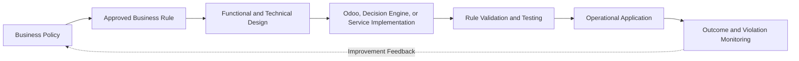
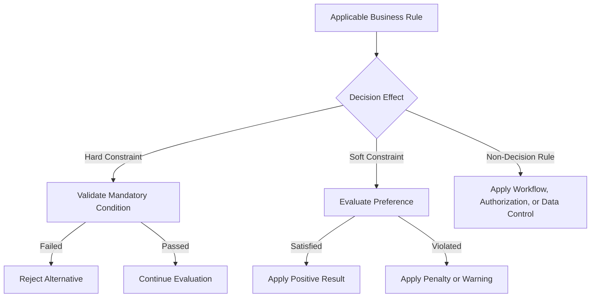
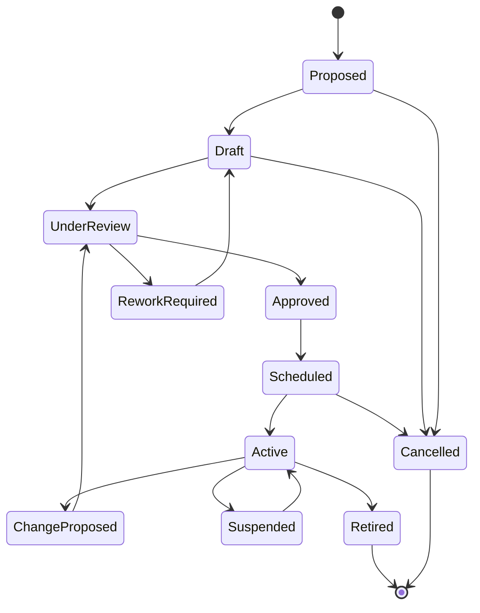
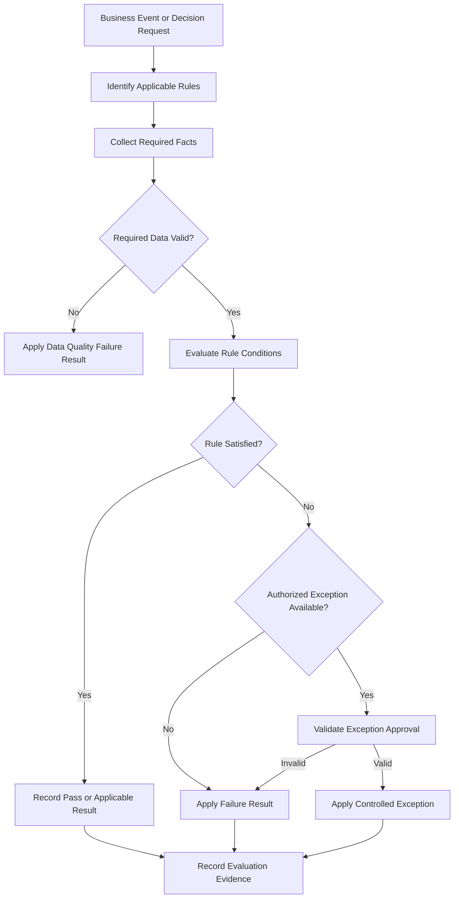
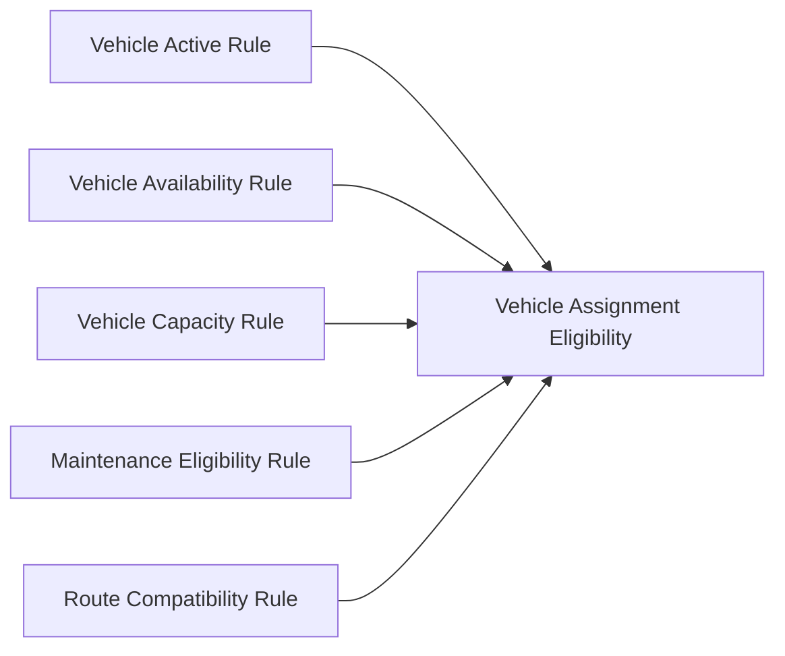
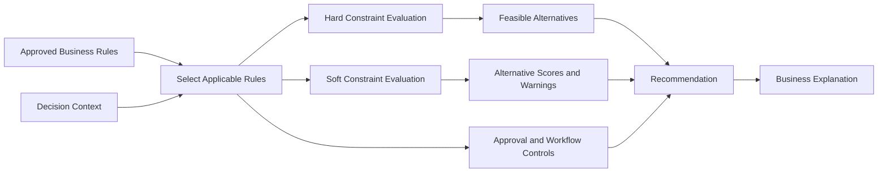
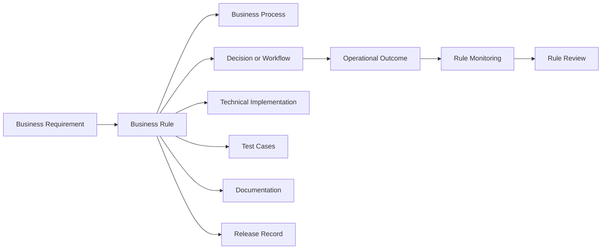

import DocumentInfo from '@site/src/components/DocumentInfo';

# قواعد الأعمال

<DocumentInfo
  category="الأعمال"
  audience={['تنفيذي', 'أعمال', 'عمليات', 'منتج', 'تقني', 'بيانات', 'أمن']}
  status="Approved"
  version="1.0"
  owner="فرق بنية الأعمال والحوكمة"
  updated="يوليو 2026"
  readingTime="15 دقيقة"
/>

## الغرض

تُعرِّف Business Rules (قواعد الأعمال) السياسات والشروط والالتزامات والمحظورات وطرق الحساب والتصنيفات والضوابط المعتمدة التي تحكم عمليات SCOP (منصة تشغيل سلسلة الإمداد).

وهي تحوِّل سياسة الأعمال إلى سلوك صريح وقابل للاختبار.

قد تتحكم Business Rules في:

- أهلية الطلب
- تخصيص المخزون
- ملكية المخزون
- عمليات المستودعات
- تكوين الشحنات
- دمج الشحنات
- أهلية المركبات
- أهلية السائقين
- اختيار المسارات ونقاط التوقف
- تخطيط الرحلات
- الالتزام بالنوافذ الزمنية
- التحقق من السعة
- اعتماد الخطط
- الإطلاق التشغيلي
- معالجة الاستثناءات
- المرتجعات
- قياس الأداء
- الأمن والتفويض

تُرسي هذه الصفحة إطار العمل الرسمي لمنصة SCOP لإدارة Business Rules عبر دورة حياتها بالكامل.

وهي لا تقدم الكتالوج الكامل لجميع القواعد التشغيلية.

ستُوثَّق القواعد التفصيلية ضمن مواصفات المجالات وكتالوجات القواعد الخاضعة للضبط.

## الأهداف

صُمِّم إطار عمل Business Rules من أجل:

- جعل سياسات الأعمال صريحة.
- إزالة الافتراضات التشغيلية الخفية.
- ضمان المعاملة المتسقة للحالات المتشابهة.
- إسناد ملكية خاضعة للمساءلة.
- التمييز بين القواعد والتنفيذ التقني.
- التمييز بين القواعد والقيود والأهداف.
- دعم التقييم الآلي واليدوي.
- توفير رسائل فشل وتحذير مفهومة.
- إدارة الاستثناءات من خلال التفويض.
- الحفاظ على تاريخ إصدارات القواعد.
- جعل تغييرات القواعد قابلة للتتبع.
- دعم الاختبار والمراقبة.
- منع سلوك الذكاء الاصطناعي أو التحسين من تجاوز السياسات الإلزامية.
- ضمان قدرة القرارات على توضيح القواعد التي أثرت فيها.

## ما هي Business Rule؟

الـ Business Rule هي عبارة معتمدة تُعرِّف جانبًا من سلوك الأعمال أو تُقيِّده.

يجوز أن تنص القاعدة على:

- ما يجب أن يحدث
- ما يجب ألا يحدث
- ما يجوز أن يحدث وفق شروط محددة
- كيفية تصنيف شيء ما
- كيفية حساب شيء ما
- من يجوز له تنفيذ إجراء ما
- متى يتطلب الإجراء اعتمادًا
- ما المعلومات الإلزامية
- ما الاستجابة المطلوبة عند وقوع حالة معينة

مثال:

```text
A vehicle must not be assigned to overlapping released trips.
```

مثال آخر:

```text
Customer-owned inventory must remain logically separated from company-owned inventory.
```

ينبغي أن تكون الـ Business Rule مفهومة دون أن يحتاج القارئ إلى فحص شفرة المصدر.

## خصائص القاعدة

ينبغي أن تكون الـ Business Rule الصحيحة:

- مقروءة من منظور الأعمال
- خالية من الغموض
- ذات مالك محدد
- قابلة للاختبار
- قابلة للتتبع
- مُدارة بالإصدارات
- قابلة للتطبيق على نطاق محدد
- مرتبطة بنتيجة
- مرتبطة بدرجة خطورة
- مستقلة عن واجهة مستخدم بعينها
- منفصلة عن تفاصيل التنفيذ

لا ينبغي أن تُكتب القاعدة على النحو التالي فقط:

```text
The system validates the record.
```

فهذه العبارة لا تحدد:

- ما الذي يجري التحقق منه
- وفق أي شروط
- ما النتيجة المطلوبة
- ما إذا كانت النتيجة تمنع التنفيذ
- من يملك السياسة

أما القاعدة الأكثر فائدة فهي:

```text
A movement demand must not become eligible for planning unless its source,
destination, product quantity, required date, and inventory owner are known.
```

## Business Rule والتنفيذ

تُعرِّف Business Rules السلوك المطلوب.

ويحدد التنفيذ التقني كيفية فرض المنصة لذلك السلوك.



يجب أن تظل القاعدة قابلة للتحديد حتى عند تغيُّر التنفيذ.

فعلى سبيل المثال، قد تُفرض القاعدة نفسها يدويًا في البداية ثم تُفرض لاحقًا آليًا دون تغيير معناها من منظور الأعمال.

## التمييز بين القاعدة والقيد

Business Rules والقيود مفهومان مترابطان لكنهما غير متطابقين.

| المفهوم | المعنى |
| --- | --- |
| Business Rule (قاعدة الأعمال) | عبارة معتمدة تحكم سلوك الأعمال |
| القيد (Constraint) | شرط يحد من البدائل الممكنة المتاحة أمام قرار ما |
| الهدف (Objective) | مقياس يُستخدم للمقارنة بين البدائل الممكنة |
| التهيئة (Configuration) | قيمة خاضعة للضبط تُستخدم لتنفيذ سلوك معتمد |
| التحقق (Validation) | فعل فحص البيانات أو السلوك مقابل قاعدة أو شرط |
| الإجراء (Procedure) | تسلسل أنشطة تُنفَّذ لإتمام العمل |

مثال على Business Rule:

```text
A trip must not exceed the assigned vehicle's approved weight capacity.
```

وقيد التخطيط المقابل لها هو:

```text
Planned trip weight <= Vehicle maximum approved weight
```

تشرح الـ Business Rule متطلب الأعمال.

ويمثل القيد كيفية تقييد تلك القاعدة لبدائل التخطيط.

## التمييز بين القاعدة والهدف

تحدد القاعدة ما هو مطلوب أو محظور أو مسموح به.

ويحدد الهدف أي البدائل الممكنة هو الأفضل.

مثال على قاعدة:

```text
A mandatory customer delivery window must not be violated.
```

مثال على هدف:

```text
Among feasible plans, prefer the plan with the lowest expected transportation cost.
```

يجب ألا ينتهك Decision Engine (محرك القرارات) قاعدة إلزامية لمجرد تحسين هدف.

## التمييز بين القاعدة والإجراء

تُعرِّف القاعدة السلوك المطلوب.

ويُعرِّف الإجراء كيفية تنفيذ المستخدمين أو الأنظمة لعملية ما.

مثال على قاعدة:

```text
Every inventory adjustment must include an approved reason.
```

مثال على إجراء:

```text
The warehouse supervisor opens the adjustment, selects the reason,
reviews the quantities, and submits the adjustment for approval.
```

قد تتغير الإجراءات دون تغيير القاعدة التي تستند إليها.

## التمييز بين القاعدة والتهيئة

تدعم قيم التهيئة تطبيق القواعد لكنها لا تحل محل توثيق القاعدة.

مثال على قاعدة:

```text
A high-value inventory adjustment requires management approval.
```

مثال على تهيئة:

```text
High-value threshold = 50,000
```

قد يكون الحد قابلًا للتهيئة.

ويجب أن يبقى المعنى من منظور الأعمال والملكية ومتطلب الاعتماد موثقة بوصفها قاعدة.

## فئات القواعد

يمكن تصنيف Business Rules في SCOP ضمن عدة فئات.

| فئة القاعدة | الغرض |
| --- | --- |
| قاعدة الأهلية | تحدد ما إذا كان يجوز لكائن ما الدخول في عملية |
| قاعدة التحقق | تحدد ما إذا كانت البيانات أو الإجراء مقبولًا |
| قاعدة الحساب | تُعرِّف كيفية حساب قيمة ما |
| قاعدة التصنيف | تُسند فئة أو حالة خاضعة للضبط |
| قاعدة التفويض | تحدد من يجوز له تنفيذ إجراء أو اعتماده |
| قاعدة الإسناد | تضبط إسناد الموارد أو الكائنات |
| قاعدة السعة | تضبط حدود الوزن أو الحجم أو المنصات أو الوحدات أو المقصورات |
| قاعدة الملكية | تحمي ملكية المخزون أو ملكية الأعمال |
| قاعدة التوافق | تضبط المنتجات أو الموارد أو الأنشطة التي يجوز جمعها معًا |
| قاعدة التوقيت | تضبط التواريخ والمدد والمواعيد النهائية والنوافذ الزمنية |
| قاعدة التسلسل | تضبط الترتيب المطلوب للأنشطة |
| قاعدة الاعتماد | تحدد متى يكون الاعتماد مطلوبًا |
| قاعدة الاستثناء | تُعرِّف الانحرافات المسموح بها والضوابط المطلوبة |
| قاعدة الإخطار | تحدد متى يجب إبلاغ دور ما |
| قاعدة الاحتفاظ | تضبط مدة بقاء السجلات متاحة |
| قاعدة القياس | تُعرِّف سلوك حساب مؤشرات الأداء الرئيسية أو الأداء |

قد ترتبط القاعدة الواحدة بأكثر من فئة، لكن ينبغي أن يكون لها تصنيف أساسي واحد.

## مجالات القواعد

ينبغي أن تنتمي كل قاعدة إلى مجال أعمال أساسي واحد.

وتشمل المجالات الأساسية:

- Party and Location Management (إدارة الأطراف والمواقع)
- Product and Handling Management (إدارة المنتجات والمناولة)
- Procurement and Inbound Supply (المشتريات والتوريد الوارد)
- Customer and Demand Management (إدارة العملاء والطلب)
- Inventory and Ownership Management (إدارة المخزون والملكية)
- Warehouse Operations (عمليات المستودعات)
- Shipment and Load Management (إدارة الشحنات والحمولات)
- Fleet and Driver Management (إدارة الأسطول والسائقين)
- Route and Trip Management (إدارة المسارات والرحلات)
- Planning and Decision Management (إدارة التخطيط والقرارات)
- Execution and Exception Management (إدارة التنفيذ والاستثناءات)
- Performance and Analytics (الأداء والتحليلات)
- Platform Governance and Administration (حوكمة المنصة وإدارتها)

ينبغي أن يكون للقواعد العابرة للمجالات مالك أساسي واحد خاضع للمساءلة ومجالات مشارِكة محددة.

## درجة خطورة القاعدة

تُعرِّف درجة خطورة القاعدة الأثر المترتب على تقييم القاعدة.

| درجة الخطورة | المعنى |
| --- | --- |
| Information (معلومات) | تقدم معلومات ذات صلة دون أن تتطلب إجراءً من المستخدم |
| Warning (تحذير) | تحدد مخاطرة أو انتهاكًا لتفضيل لكنها قد تسمح بالمتابعة |
| Approval Required (يتطلب اعتمادًا) | تسمح بالمتابعة فقط بعد مراجعة من جهة مفوضة |
| Blocking (مانعة) | تمنع الإجراء حتى تُعالج الحالة |
| Critical (حرجة) | تمنع الإجراء وتتطلب تصعيدًا فوريًا أو ضابطًا تصحيحيًا |

يجب أن تُحدَّد درجة الخطورة بموجب سياسة أعمال معتمدة.

ويجب ألا يخفض التنفيذ التقني درجة خطورة قاعدة إلزامية خفضًا صامتًا.

## القواعد الإلزامية والقواعد الإرشادية

### القاعدة الإلزامية

يجب استيفاء القاعدة الإلزامية ما لم يوجد استثناء مفوَّض صراحةً.

ومن الأمثلة:

- يجب عدم تجاوز سعة المركبة.
- يجب أن تبقى ملكية المخزون قابلة للتتبع.
- يجب عدم إسناد سائق غير نشط.
- يجب أن يمتلك المستخدم صلاحية الاعتماد قبل اعتماد خطة.

### القاعدة الإرشادية

تعبِّر القاعدة الإرشادية عن تفضيل أو توصية أو تحذير تشغيلي.

ومن الأمثلة:

- تفضيل المركبة الموجودة أصلًا في مستودع الانطلاق.
- التحذير عندما يكون الاستغلال المتوقع أدنى من المستوى المستهدف.
- تفضيل الدمج عندما تبقى التزامات الخدمة محمية.

يجب ألا تُعرض القاعدة الإرشادية على أنها إلزامية ما لم تُعتمد رسميًا بهذه الصفة.

## قيود القرار الصارمة والمرنة

قد تُفضي القواعد إلى قيود صارمة أو مرنة داخل Decision Engine.

### Hard Constraint (القيد الصارم)

انتهاكه يجعل البديل غير ممكن أثناء التخطيط الاعتيادي.

ومن الأمثلة:

- الوزن الأقصى للمركبة
- التوافق الإلزامي للمنتجات
- المؤهل المطلوب للسائق
- نافذة التسليم الإلزامية
- ملكية المخزون
- عدم تداخل الإسنادات المُطلقة

### Soft Constraint (القيد المرن)

قد يُسمح بانتهاكه لكنه ينشئ غرامة أو تحذيرًا أو متطلب اعتماد.

ومن الأمثلة:

- المركبة المفضلة
- وقت الانطلاق المفضل
- المستودع المفضل
- الاستغلال المستهدف
- المسار المفضل
- استمرارية السائق المفضلة



يجب أن يحدد كتالوج Business Rules ما إذا كانت القاعدة تُنشئ Hard Constraint أو Soft Constraint أو ضابط سير عمل أو تحققًا من البيانات أو أثرًا آخر.

## بنية القاعدة

ينبغي أن تتضمن كل Business Rule خاضعة للحوكمة العناصر التالية.

| العنصر | الوصف |
| --- | --- |
| معرّف القاعدة (Rule ID) | معرّف فريد ومستقر |
| اسم القاعدة | اسم قصير مقروء من منظور الأعمال |
| نص القاعدة | القاعدة المعتمدة معبَّرًا عنها بوضوح |
| الغرض | سبب الأعمال وراء القاعدة |
| المجال الأساسي | مجال الأعمال الخاضع للمساءلة |
| المجالات المشارِكة | المجالات الأخرى المتأثرة بالقاعدة |
| المالك | مالك الأعمال الخاضع للمساءلة |
| المشرف (Steward) | الدور الذي يتولى صيانة تعريف القاعدة |
| فئة القاعدة | الأهلية أو التحقق أو التفويض أو السعة أو فئة أخرى |
| درجة الخطورة | Information أو Warning أو Approval Required أو Blocking أو Critical |
| المُطلِق (Trigger) | الحدث أو الإجراء المسبب للتقييم |
| النطاق | السجلات أو المستخدمون أو المواقع أو الشركات أو العمليات المشمولة |
| الشروط | الحقائق التي تقيِّمها القاعدة |
| النتيجة | المخرَج المطلوب عند استيفاء الشروط |
| نتيجة الفشل | المخرَج المطلوب عند عدم استيفاء القاعدة |
| سياسة الاستثناء | ما إذا كانت الاستثناءات مسموحًا بها وكيفية ذلك |
| الأدلة | المعلومات المحتفظ بها لإثبات التقييم |
| تاريخ السريان | تاريخ بدء انطباق الإصدار |
| تاريخ الانتهاء | تاريخ نهاية اختياري |
| الإصدار | إصدار القاعدة المعتمد |
| الحالة | مسودة أو معتمدة أو نشطة أو معلقة أو متقاعدة أو حالة أخرى خاضعة للضبط |
| مراجع التنفيذ | الأنظمة أو الوحدات التي تفرض القاعدة |
| مراجع الاختبار | السيناريوهات التي تتحقق من صحة القاعدة |
| الوثائق ذات الصلة | صفحات المجال أو مسار العمل أو القرار أو الإصدار |

## معيار معرّف القاعدة

ينبغي أن تستخدم قواعد SCOP معرّفات مستقرة.

التنسيق الموصى به:

```text
BR-{DOMAIN}-{NUMBER}
```

أمثلة:

```text
BR-PAR-001
BR-PRD-001
BR-PRC-001
BR-DMD-001
BR-INV-001
BR-WHS-001
BR-SHP-001
BR-FLT-001
BR-RTE-001
BR-PLN-001
BR-EXE-001
BR-ANA-001
BR-GOV-001
```

رموز المجالات المقترحة:

| الرمز | المجال |
| --- | --- |
| PAR | Party and Location (الأطراف والمواقع) |
| PRD | Product and Handling (المنتجات والمناولة) |
| PRC | Procurement and Inbound Supply (المشتريات والتوريد الوارد) |
| DMD | Customer and Demand (العملاء والطلب) |
| INV | Inventory and Ownership (المخزون والملكية) |
| WHS | Warehouse Operations (عمليات المستودعات) |
| SHP | Shipment and Load (الشحنات والحمولات) |
| FLT | Fleet and Driver (الأسطول والسائقون) |
| RTE | Route and Trip (المسارات والرحلات) |
| PLN | Planning and Decision (التخطيط والقرار) |
| EXE | Execution and Exception (التنفيذ والاستثناءات) |
| ANA | Performance and Analytics (الأداء والتحليلات) |
| GOV | Platform Governance and Administration (حوكمة المنصة وإدارتها) |

يجب عدم إعادة استخدام معرّفات القواعد بعد تقاعدها.

## إصدارات القاعدة

يمثل معرّف القاعدة مفهوم الأعمال المستمر.

ويمثل الإصدار تعريفًا معتمدًا لذلك المفهوم.

مثال:

```text
Rule ID: BR-FLT-004
Version: 1.2
```

يلزم إصدار جديد عند تغيير أي مما يلي:

- نص القاعدة
- الشروط
- النتيجة
- درجة الخطورة
- النطاق
- سياسة الاستثناء
- الملكية
- تاريخ السريان
- الأثر القراري
- الأدلة المطلوبة

أما التصحيحات المطبعية التي لا تغيّر المعنى فيجوز أن تُعالج بوصفها تصحيحًا تحريريًا موثقًا وفقًا لسياسة الحوكمة.

## مثال على تعريف قاعدة

```text
Rule ID: BR-FLT-001
Rule Name: Vehicle Assignment Availability
Rule Statement:
A vehicle must not be assigned to a trip when the vehicle is inactive,
under a blocking maintenance condition, or unavailable during any part of
the required assignment period.
Primary Domain:
Fleet and Driver Management
Category:
Assignment Rule
Severity:
Blocking
Trigger:
Trip vehicle assignment or planning evaluation
Conditions:
- Vehicle is active
- No blocking maintenance status exists
- Vehicle is available for the complete assignment period
- No conflicting released assignment exists
Result:
Vehicle remains an eligible assignment candidate.
Failure Result:
Vehicle is removed from feasible candidates and the reason is recorded.
Exception Policy:
No normal operational exception. Emergency use requires separate approved policy.
Evidence:
Vehicle status, maintenance status, availability period, assignment conflicts,
evaluation timestamp, and rule version.
```

## نمط صياغة القاعدة

حيثما كان ذلك عمليًا، ينبغي أن تستخدم نصوص القواعد بنية واضحة:

```text
When [trigger or context],
if [conditions],
then [required result],
otherwise [failure result or required action].
```

مثال:

```text
When a shipment is evaluated for consolidation,
if ownership, product compatibility, time windows, source and destination
relationships, and vehicle capacity remain valid,
then the shipment may be considered a consolidation candidate;
otherwise it must remain separate and the rejection reason must be recorded.
```

لا يلزم أن تتبع كل قاعدة نمط الجملة الحرفي نفسه، لكن يجب أن يبقى المعنى صريحًا.

## دورة حياة القاعدة



### مقترحة (Proposed)

جرى تحديد حاجة أعمال إلى قاعدة جديدة أو إلى تغيير في قاعدة قائمة.

### مسودة (Draft)

القاعدة قيد التعريف والتصنيف والتقييم.

### قيد المراجعة (Under Review)

يراجع القاعدة أصحاب المصلحة من الأعمال أو التشغيل أو المنتج أو التقنية أو الأمن أو البيانات حسب الاقتضاء.

### معتمدة (Approved)

جرى اعتماد تعريف القاعدة لكنها قد لا تكون سارية بعد.

### مجدولة (Scheduled)

القاعدة معتمدة للتفعيل في تاريخ مستقبلي أو إصدار مستقبلي.

### نشطة (Active)

القاعدة سارية التطبيق حاليًا.

### معلقة (Suspended)

القاعدة ممنوعة مؤقتًا من التطبيق الاعتيادي من خلال حوكمة مفوَّضة.

### متقاعدة (Retired)

لم تعد القاعدة سارية على النشاط التشغيلي الجديد.

يجب أن تحتفظ السجلات التاريخية بإصدار القاعدة المنطبق.

## اقتراح القاعدة

ينبغي أن يحدد اقتراح القاعدة ما يلي:

- مشكلة الأعمال
- القاعدة المقترحة
- مالك الأعمال
- المجال
- المستخدمون المتأثرون
- مسارات العمل المتأثرة
- القرارات المتأثرة
- الأثر التشغيلي
- متطلبات البيانات
- متطلبات الاستثناء
- أثر التنفيذ
- أثر التقارير
- الأثر الأمني
- متطلب تاريخ السريان

يجب ألا تُستحدث قاعدة بوصفها طلبًا تقنيًا صرفًا دون مالك أعمال.

## مراجعة القاعدة

ينبغي أن تؤكد مراجعة القاعدة ما يلي:

- أن النص مفهوم.
- أن غرض الأعمال صحيح.
- أن المالك المرجعي معروف.
- أن النطاق واضح.
- أن الشروط قابلة للاختبار.
- أن النتيجة المطلوبة واضحة.
- أن درجة الخطورة مبررة.
- أن الاستثناءات مضبوطة.
- أن التعارضات مع القواعد القائمة قد حُسمت.
- أن البيانات اللازمة للتقييم موجودة.
- أن التنفيذ ممكن عمليًا.
- أن الأثر التاريخي وأثر التقارير مفهومان.
- أن التواصل مع المستخدمين كافٍ.
- أن الوثائق المطلوبة محددة.

## اعتماد القاعدة

تتوقف صلاحية الاعتماد على أثر القاعدة.

ومن المعتمدين المحتملين:

- مالك مجال الأعمال
- مدير العمليات
- مالك المنتج
- هندسة الأعمال (Business Architecture)
- قائد الهندسة
- مالك الأمن
- مالك البيانات
- مالك حوكمة القرارات
- الإدارة التنفيذية

تتطلب القواعد عالية الأثر اعتمادًا أقوى.

ومن الأمثلة القواعد المؤثرة في:

- ملكية المخزون
- التزامات العملاء
- السلامة
- الامتثال القانوني
- الاعتماد المالي
- التنفيذ الذاتي
- الوصول الأمني
- جدوى Decision Engine
- الأتمتة المدعومة بالذكاء الاصطناعي
- الاحتفاظ بالبيانات

## تفعيل القاعدة

قبل التفعيل، ينبغي استكمال ما يلي حيثما ينطبق:

- التعريف المعتمد
- تاريخ السريان المعتمد
- التنفيذ
- التهيئة
- تغطية الاختبارات
- التحقق من الصلاحيات
- التواصل مع المستخدمين
- التدريب
- ملاحظات الإصدار
- المراقبة
- سلوك التراجع الاحتياطي
- تقييم التوافق التاريخي

يجب ألا تُعد القاعدة نشطة لمجرد نشر الشيفرة المرتبطة بها.

بل يجب أيضًا استيفاء تاريخ سريانها المعتمد وجاهزيتها التشغيلية.

## تقييم القاعدة

يحدد تقييم القاعدة ما إذا كانت القاعدة تنطبق وما النتيجة التي تنتجها.



ينبغي أن يسجل تقييم القاعدة معلومات كافية لتفسير النتيجة.

## نتيجة تقييم القاعدة

تشمل نتائج التقييم المحتملة:

| النتيجة | المعنى |
| --- | --- |
| Not Applicable (غير منطبقة) | القاعدة لا تنطبق على السياق الحالي |
| Passed (ناجحة) | شروط القاعدة مستوفاة |
| Failed — Warning (فشل — تحذير) | القاعدة غير مستوفاة لكن المتابعة تظل مسموحًا بها |
| Failed — Approval Required (فشل — يتطلب اعتمادًا) | تتطلب المتابعة اعتمادًا مفوَّضًا |
| Failed — Blocking (فشل — مانع) | الإجراء أو البديل محظور |
| Exception Applied (استثناء مطبق) | استثناء مفوَّض يسمح بمتابعة مضبوطة |
| Unable to Evaluate (تعذر التقييم) | البيانات أو الخدمة المطلوبة غير متاحة |
| Suspended (معلقة) | القاعدة غير نشطة مؤقتًا بموجب حوكمة معتمدة |

يجب ألا تُختزل النتيجة إلى صواب أو خطأ تقني بسيط عندما يقتضي معنى الأعمال تفصيلًا أكبر.

## أدلة التقييم

قد تشمل أدلة تقييم القاعدة:

- معرّف القاعدة
- إصدار القاعدة
- الطابع الزمني للتقييم
- كائن الأعمال
- المُطلِق
- الحقائق المدخلة
- النتيجة
- سبب الفشل
- درجة الخطورة
- مرجع الاستثناء
- الجهة المعتمِدة
- مكوِّن التنفيذ
- معرّف الترابط
- القرار أو مسار العمل ذو الصلة

ينبغي أن تتناسب متطلبات الأدلة مع الأهمية التشغيلية والتدقيقية.

## تبعيات القواعد

تعتمد بعض القواعد على قواعد أو تعريفات أخرى.

مثال:

```text
Vehicle assignment eligibility may depend on:
- Vehicle active-status rule
- Vehicle availability rule
- Capacity rule
- Maintenance-status rule
- Route-restriction rule
```

يجب أن تبقى التبعيات صريحة.

ويجب تجنب التبعيات الدائرية بين القواعد.



يجوز أن تلخص قاعدة مركّبة نتائج عدة قواعد أساسية، لكن يجب ألا تخفي أي قاعدة قد فشلت.

## أولوية القواعد وتعارضها

قد تتعارض قاعدتان عندما تتطلبان نتيجتين متنافيتين للسياق نفسه.

يجب ألا يعتمد حسم تعارض القواعد على ترتيب تقني غير موثق.

ينبغي أن تراعي معالجة التعارض ما يلي:

1. الالتزامات القانونية والتزامات السلامة
2. ضوابط الملكية والأمن
3. التزامات الأعمال الإلزامية
4. سياسات الاستثناء المعتمدة
5. الأسبقية الخاصة بالمجال
6. تواريخ السريان والإصدارات
7. قرار الحوكمة الصريح

ينبغي ألا تكون للقاعدة أولوية صريحة إلا حيث تقتضي سياسة الأعمال أسبقية.

ويجب ألا تُستخدم الأولوية لإخفاء تناقضات لم تُحسم.

## مثال على تعارض القواعد

القاعدة أ:

```text
Urgent customer demand should receive planning priority.
```

القاعدة ب:

```text
A vehicle must not exceed approved capacity.
```

هاتان القاعدتان ليستا متكافئتين حقًا في التعارض.

فقاعدة السعة إلزامية.

ولا يجوز أن تؤثر الأولوية في الاختيار إلا بين البدائل الممكنة.

وبالتالي، لا يمكن أن يبرر الطلب العاجل تجاوز السعة.

## إدارة الاستثناءات

استثناء Business Rule هو انحراف مفوَّض عن النتيجة الاعتيادية للقاعدة.

يجب ألا يكون الاستثناء مساويًا لتجاهل القاعدة.

ينبغي أن يحدد الاستثناء المعتمد:

- معرّف القاعدة وإصدارها
- كائن الأعمال أو النطاق
- السبب
- المستخدم الطالب
- جهة الاعتماد
- وقت البدء
- وقت الانتهاء
- الشروط
- المخاطر
- إجراءات التخفيف المطلوبة
- الأدلة
- المحصلة
- متطلب المراجعة

## أنواع الاستثناءات

| نوع الاستثناء | الوصف |
| --- | --- |
| استثناء لمرة واحدة | ينطبق على كائن أعمال أو إجراء واحد محدد |
| استثناء محدد المدة | ينطبق خلال فترة معتمدة |
| استثناء محدد النطاق | ينطبق على مواقع أو منتجات أو عملاء أو عمليات محددة |
| استثناء طارئ | ينطبق على حالة عاجلة في ظل مراجعة معززة |
| استثناء من سياسة | استثناء معتمد رسميًا من سياسة راسخة |
| لا يُسمح باستثناء | لا يمكن تجاوز القاعدة عبر صلاحيات الأعمال الاعتيادية |

## مبادئ الاستثناءات

- تتطلب الاستثناءات صلاحية صريحة.
- يجب أن تكون الاستثناءات قابلة للتتبع.
- يجب أن تكون الاستثناءات محدودة النطاق والمدة.
- يجب ألا تتحول الاستثناءات بصمت إلى سياسة دائمة.
- قد تشير الاستثناءات المتكررة إلى أن القاعدة تحتاج إلى مراجعة.
- يجب ألا تسمح بعض القواعد بأي استثناء اعتيادي.
- يجب ألا يتولى اعتماد الاستثناءات مستخدمون تقنيون غير مفوَّضين.
- يجب أن تبقى أدلة الاستثناء مرتبطة بالقرار أو المعاملة المتأثرة.

## تجاوزات القواعد

يحدث التجاوز (Override) عندما يغيّر مستخدم مفوَّض المحصلة الناتجة عن توصية أو مسار عمل مدعوم بالقواعد.

ينبغي أن تحتفظ المنصة بما يلي:

- النتيجة الأصلية
- تقييمات القواعد
- المستخدم الذي نفّذ التجاوز
- سبب التجاوز
- النتيجة النهائية
- الاعتماد
- المحصلة التشغيلية

لا يعني التجاوز بالضرورة أن القاعدة كانت خاطئة.

فقد يشير إلى:

- معلومات ناقصة
- ظروف تشغيل استثنائية
- بيانات رئيسية غير صحيحة
- استثناء مسموح به
- مشكلة في تصميم القاعدة
- حقيقة محلية غير متاحة للنظام

## طبقات تطبيق القواعد

يجوز تطبيق Business Rules في عدة طبقات.

| الطبقة | أمثلة |
| --- | --- |
| البيانات الرئيسية | السمات المطلوبة للمنتج أو الموقع أو المركبة أو الشريك |
| التحقق من المعاملات | التحقق من الطلبات أو الاستلامات أو الشحنات أو الرحلات أو التسويات |
| مسار العمل | انتقالات الحالة والاعتمادات |
| Decision Engine | الأهلية وHard Constraints وSoft Constraints والتفسيرات |
| حدود AI Platform | منع مخرجات الذكاء الاصطناعي من تجاوز القواعد الإلزامية |
| التكامل | التحقق من الطلبات والملكية والتفويض والمواءمة |
| التقارير | تعريفات مؤشرات الأداء الرئيسية والتصنيف |
| الأمن | الأدوار والصلاحيات وسلطة الاعتماد |

قد تتطلب سياسة الأعمال الواحدة إنفاذًا منسقًا في أكثر من طبقة.

ومع ذلك يجب أن يبقى هناك تعريف مرجعي واحد للقاعدة.

## التطبيق في Odoo 17

يجوز أن يفرض Odoo قواعد Business Rules من خلال آليات مدعومة مثل:

- قيود النماذج (Model constraints)
- عمليات التحقق على جانب الخادم
- إجراءات مسار العمل
- قواعد التحكم في الوصول
- قواعد السجلات (Record rules)
- الحقول الإلزامية
- القيم المحسوبة
- حالات الاعتماد
- التهيئة
- عمليات التحقق المجدولة
- الوحدات المخصصة الخاضعة للضبط

لا تُعد قيود واجهة المستخدم وحدها إنفاذًا كافيًا للقواعد الإلزامية.

ويجب عدم استخدام التعديل المباشر لملفات Odoo الأساسية أسلوبًا اعتياديًا لتنفيذ القواعد.

## التطبيق في Decision Engine

يستخدم Decision Engine القواعد المعتمدة من أجل:

- تحديد الأهلية
- تطبيق Hard Constraints
- تطبيق Soft Constraints
- توليد البدائل
- رفض البدائل غير الممكنة
- ترتيب البدائل الممكنة
- إنتاج التحذيرات
- تفسير التوصيات
- تحديد الطلب غير المخطط
- إطلاق متطلبات الاعتماد



يجب أن يحدد Decision Engine القواعد التي تسببت في:

- رفض مرشح
- تحذير
- جزاء
- اعتماد مطلوب
- نتيجة طلب غير مخطط

## حدود AI Platform

قد توفر AI Platform ما يلي:

- التنبؤات
- التوقعات
- الترتيبات
- مؤشرات المخاطر
- درجات الثقة
- التفسيرات
- مؤشرات الشذوذ

لا تحل مخرجات الذكاء الاصطناعي محل قواعد Business Rules المعتمدة.

مثال:

```text
An AI model may predict that a vehicle can probably complete the route,
but it cannot override an expired vehicle permit or mandatory capacity rule.
```

يظل Decision Engine مسؤولًا عن تطبيق القواعد الحاكمة لتوصية الأعمال النهائية.

## القواعد وجودة البيانات

لا يمكن تقييم قاعدة تقييمًا موثوقًا عندما تكون الحقائق المطلوبة مفقودة أو غير صالحة.

ينبغي أن تحدد كل قاعدة:

- البيانات المطلوبة
- المصدر المرجعي
- متطلب الحداثة
- متطلب الصلاحية
- السلوك عند غياب البيانات
- السلوك عند عدم اتساق البيانات

وتشمل المحصلات الممكنة:

- منع التقييم
- إرجاع نتيجة تعذر التقييم
- استخدام بديل تحفظي معتمد
- طلب تأكيد يدوي
- توليد تحذير
- تصعيد مشكلة جودة بيانات

يجب ألا تُفسَّر البيانات المفقودة تلقائيًا على أنها استيفاء للقاعدة.

## اختبار القواعد

ينبغي أن تكون لكل قاعدة آلية نشطة تغطية اختبارية تتناسب مع مخاطرها.

ينبغي أن تشمل سيناريوهات الاختبار:

- القاعدة تنطبق وتنجح
- القاعدة تنطبق وتفشل
- القاعدة لا تنطبق
- القيم الحدية
- البيانات المفقودة
- البيانات غير الصالحة
- الاستثناء المفوَّض
- الاستثناء غير المفوَّض
- القاعدة المتعارضة
- صحة درجة الخطورة
- صحة التفسير
- صحة أدلة التدقيق
- صحة سلوك تاريخ السريان
- سلوك إصدار القاعدة السابق حيثما كان ذلك ذا صلة

## بنية حالة اختبار القاعدة

ينبغي أن تحدد حالة اختبار القاعدة:

| العنصر | الوصف |
| --- | --- |
| معرّف الاختبار | معرّف اختبار فريد |
| معرّف القاعدة وإصدارها | القاعدة الجاري التحقق منها |
| السيناريو | موقف الأعمال |
| الشروط المسبقة | الحالة الابتدائية المطلوبة |
| الحقائق المدخلة | البيانات المستخدمة أثناء التقييم |
| الانطباق المتوقع | ما إذا كان ينبغي أن تنطبق القاعدة |
| النتيجة المتوقعة | نجاح أو تحذير أو منع أو نتيجة أخرى |
| التفسير المتوقع | سبب مقروء من منظور الأعمال |
| الأدلة المتوقعة | السجلات أو معلومات التدقيق |
| النتيجة الفعلية | النتيجة الملاحظة |
| الحالة | نجاح أو فشل أو محجوبة أو لم تُنفذ |

## أمثلة على سيناريوهات الاختبار

القاعدة:

```text
A trip must not exceed the assigned vehicle's approved weight capacity.
```

سيناريوهات الاختبار:

| السيناريو | سعة المركبة | وزن الرحلة | النتيجة المتوقعة |
| --- | ---: | ---: | --- |
| أدنى من السعة | 1,000 kg | 800 kg | Passed (ناجحة) |
| مساوٍ للسعة | 1,000 kg | 1,000 kg | Passed (ناجحة) |
| أعلى من السعة | 1,000 kg | 1,001 kg | فشل مانع |
| السعة مفقودة | غير متاحة | 800 kg | تعذر التقييم أو نتيجة جودة بيانات مانعة |
| سعة سالبة غير صالحة | -1 kg | 800 kg | فشل جودة بيانات |

## مراقبة القواعد

ينبغي مراقبة القواعد النشطة حيثما كان ذلك مهمًا تشغيليًا.

وتشمل المقاييس المحتملة:

- عدد التقييمات
- معدل النجاح
- معدل الفشل
- معدل التحذيرات
- معدل الاستثناءات
- معدل التجاوزات
- معدل تعذر التقييم
- معدل الحجب بسبب جودة البيانات
- أكثر أسباب الفشل شيوعًا
- المحصلات التشغيلية بعد الاستثناءات
- القواعد التي لم تخضع لتقييم حديث
- القواعد المسببة لتأخير تشغيلي متكرر

ينبغي أن تساعد المراقبة على تحديد:

- القواعد غير الصحيحة
- القواعد المتقادمة
- ضعف جودة البيانات
- سوء ضبط درجة الخطورة
- الاستثناءات المفرطة
- سلوك التنفيذ غير المتوقع
- احتياجات التدريب

## فاعلية القواعد

قد تكون القاعدة عاملة تقنيًا ومع ذلك غير فعالة.

ينبغي أن تراعي فاعلية القاعدة:

- ما إذا كانت تحقق غرض الأعمال منها
- ما إذا كانت تمنع المخاطرة المقصودة
- ما إذا كان المستخدمون يفهمونها
- ما إذا كانت رسائل الفشل مفيدة
- ما إذا كانت الاستثناءات معقولة
- ما إذا كانت التكلفة التشغيلية متناسبة
- ما إذا كانت القاعدة تُحدث سلوكًا غير مقصود
- ما إذا كانت مؤشرات الأداء الرئيسية ذات الصلة تتحسن
- ما إذا كانت القاعدة تتعارض مع ظروف التشغيل الفعلية

## إدارة تغيير القواعد

ينبغي أن يحدد التغيير المقترح على قاعدة:

- القاعدة القائمة
- التغيير المقترح
- سبب الأعمال
- المجالات المتأثرة
- مسارات العمل المتأثرة
- القرارات المتأثرة
- التكاملات المتأثرة
- الأثر على البيانات
- الأثر الأمني
- الأثر التاريخي
- الأثر على الاختبارات
- الأثر على الوثائق
- تاريخ السريان
- متطلبات الترحيل أو الانتقال

يجب أن تتبع تغييرات القواعد إدارة إصدارات خاضعة للضبط.

## تواريخ السريان

قد تكون للقواعد تواريخ سريان مستقبلية.

ينبغي أن تميز المنصة بين:

- تاريخ الاعتماد
- تاريخ النشر
- تاريخ السريان
- تاريخ الانتهاء
- تاريخ التقاعد

قد تُنشر القاعدة تقنيًا قبل تاريخ سريانها من منظور الأعمال.

يجب أن يستخدم التقييم التاريخي الإصدار المنطبق وقت نشاط الأعمال المعني حيثما كان ذلك مطلوبًا.

## تقاعد القاعدة

يجوز إحالة القاعدة إلى التقاعد عندما:

- لم تعد السياسة منطبقة.
- أُزيلت العملية ذات الصلة.
- استُبدلت القاعدة.
- تغيّر متطلب قانوني أو متطلب أعمال.
- أصبحت القاعدة زائدة عن الحاجة.
- أُحيلت القدرة الخاضعة للحوكمة إلى التقاعد.

يجب أن يحدد التقاعد:

- سبب التقاعد
- القاعدة البديلة حيثما ينطبق
- تاريخ سريان التقاعد
- الأثر التاريخي
- تعطيل التنفيذ
- تحديث الوثائق
- التواصل
- الاعتماد

يجب عدم إعادة استخدام معرّفات القواعد المتقاعدة.

## سجل تدقيق القواعد

ينبغي أن يشمل سجل تدقيق Business Rule:

- الاقتراح
- إصدارات المسودة
- المراجعات
- الاعتمادات
- تواريخ السريان
- مراجع التنفيذ
- نتائج الاختبارات
- عمليات التفعيل
- عمليات التعليق
- الاستثناءات
- التجاوزات
- التغييرات
- عمليات التقاعد

ينبغي أن تحتفظ سجلات القرارات والسجلات التشغيلية التاريخية بإصدار القاعدة المستخدم أثناء التقييم.

## كتالوج القواعد

ينبغي أن تحتفظ SCOP بكتالوج Business Rules خاضع للحوكمة.

ينبغي أن يدعم الكتالوج:

- تحديد هوية القواعد
- البحث حسب المجال
- البحث حسب الفئة
- البحث حسب درجة الخطورة
- البحث حسب المالك
- البحث حسب الحالة
- تاريخ الإصدارات
- تواريخ السريان
- تبعيات القواعد
- مراجع التنفيذ
- مراجع الاختبار
- سياسات الاستثناء
- القرارات ومسارات العمل ذات الصلة

قد يُنفَّذ الكتالوج لاحقًا من خلال نظام خاضع للضبط أو مستودع أو قدرة من قدرات Odoo.

تُعرِّف هذه الصفحة نموذج المعلومات، لا التنفيذ التقني.

## تتبع القواعد

ينبغي أن تكون القاعدة قابلة للتتبع عبر دورة حياة التسليم.



ينبغي أن يتيح التتبع لأصحاب المصلحة الإجابة عن الأسئلة التالية:

- لماذا توجد هذه القاعدة؟
- من اعتمدها؟
- أين تُطبَّق؟
- كيف تُختبر؟
- أي القرارات استخدمتها؟
- أي إصدار كان نشطًا؟
- ماذا يحدث عند فشلها؟
- هل الاستثناءات مسموح بها؟
- هل القاعدة فعالة؟

## ملكية القواعد

### مالك الأعمال

مالك الأعمال خاضع للمساءلة عن:

- غرض الأعمال
- معنى السياسة
- درجة الخطورة
- سياسة الاستثناء
- الاعتماد
- المراجعة الدورية

### مشرف القاعدة (Rule Steward)

مشرف القاعدة مسؤول عن:

- صيانة التعريف
- تنسيق المراجعات
- إدارة البيانات الوصفية
- ضمان بقاء الوثائق محدثة
- متابعة التغييرات المفتوحة

### مالك المنتج

ينسق مالك المنتج كيفية تأثير القاعدة في سلوك المنتج ونطاق التسليم.

### المالك التقني

المالك التقني مسؤول عن صحة التنفيذ والاختبار والمراقبة والدعم.

### مالك البيانات

مالك البيانات مسؤول عن الحقائق المرجعية المطلوبة أثناء التقييم.

### مالك العمليات

يؤكد مالك العمليات أن القاعدة تعمل على نحو ملائم ضمن عمليات التشغيل الفعلية.

يجوز أن يشغل شخص واحد أكثر من دور في المنظمات الصغيرة، لكن يجب أن تبقى المسؤوليات صريحة.

## الفصل بين المهام

ينبغي أن تعتمد القواعد عالية الأثر فصلًا ملائمًا للمسؤوليات.

أمثلة:

- ينبغي ألا يكون المطور الذي ينفذ قاعدة هو الشخص الوحيد الذي يعتمد معناها من منظور الأعمال.
- ينبغي ألا يعتمد المستخدم الذي يطلب استثناءً حساسًا الاستثناء نفسه دائمًا.
- يجب ألا يغيّر مدير النظام التقني سياسة أعمال إلزامية باستقلالية.
- يجب ألا يزيل مالكو نماذج الذكاء الاصطناعي ضوابط قواعد الأعمال باستقلالية.

## المراجعة الدورية للقواعد

ينبغي مراجعة القواعد وفقًا للمخاطر.

قد يكون تواتر المراجعة:

- مدفوعًا بالأحداث
- ربع سنوي
- نصف سنوي
- سنوي
- قبل إصدار رئيسي
- عقب حادث جوهري
- عقب تجاوزات متكررة
- عقب تغيير قانوني أو تغيير في السياسات

ينبغي أن تؤكد المراجعة:

- أن القاعدة لا تزال ضرورية.
- أن النص لا يزال دقيقًا.
- أن الملكية لا تزال صحيحة.
- أن درجة الخطورة لا تزال ملائمة.
- أن البيانات لا تزال متاحة.
- أن التنفيذ لا يزال صحيحًا.
- أن الاستثناءات لا تزال مضبوطة.
- أن المراقبة لا تزال نشطة.
- أن الوثائق لا تزال محدثة.

## أمثلة على قواعد المجالات

### Party and Location (الأطراف والمواقع)

```text
BR-PAR-001:
An inactive operational location must not be used as the source or destination
of newly created movement demand.
```

### Product and Handling (المنتجات والمناولة)

```text
BR-PRD-001:
A product requiring temperature control must not be assigned to a vehicle or
compartment that lacks the required approved temperature capability.
```

### Procurement (المشتريات)

```text
BR-PRC-001:
Expected supplier quantity must not be represented as physically available
inventory before receipt validation.
```

### Customer and Demand (العملاء والطلب)

```text
BR-DMD-001:
Cancelled demand must not remain eligible for planning.
```

### Inventory and Ownership (المخزون والملكية)

```text
BR-INV-001:
Customer-owned inventory must remain logically distinguishable from
company-owned inventory at every stock location.
```

### Warehouse Operations (عمليات المستودعات)

```text
BR-WHS-001:
Products must not be confirmed as loaded until the related warehouse loading
operation has recorded the actual loaded quantity.
```

### Shipment and Load (الشحنات والحمولات)

```text
BR-SHP-001:
Shipments must not be consolidated when mandatory product compatibility,
ownership, capacity, or customer service requirements would be violated.
```

### Fleet and Driver (الأسطول والسائقون)

```text
BR-FLT-001:
A vehicle or driver must not be assigned to overlapping released trips.
```

### Route and Trip (المسارات والرحلات)

```text
BR-RTE-001:
A delivery stop must not be sequenced before the pickup or loading activity
required to supply that delivery.
```

### Planning and Decision (التخطيط والقرار)

```text
BR-PLN-001:
A recommended plan must not be operationally released until an authorized user
has approved it.
```

### Execution and Exception (التنفيذ والاستثناءات)

```text
BR-EXE-001:
A failed or partially completed stop must include an approved outcome reason.
```

### Performance and Analytics (الأداء والتحليلات)

```text
BR-ANA-001:
A KPI result must identify the approved formula version and measurement period.
```

### Governance and Administration (الحوكمة والإدارة)

```text
BR-GOV-001:
User-interface visibility must not be treated as sufficient authorization for
a controlled business action.
```

## مؤشرات الأداء الرئيسية لقواعد الأعمال

تشمل مقاييس حوكمة Business Rules المحتملة:

- نسبة القواعد النشطة ذات المالكين المعتمدين
- نسبة القواعد النشطة ذات التغطية الاختبارية
- نسبة القواعد النشطة ذات مراجع التنفيذ
- معدل فشل القواعد
- معدل استثناءات القواعد
- معدل تجاوزات القواعد
- معدل تعذر التقييم
- القواعد ذات تبعيات البيانات المفقودة
- القواعد المتأخرة عن موعد المراجعة
- القواعد بلا مراقبة
- حوادث تعارض القواعد
- محاولات الاستثناء غير المفوَّضة
- العيوب الإنتاجية المرتبطة بالقواعد
- متوسط الوقت اللازم لاعتماد تغييرات القواعد
- نسبة القرارات ذات أدلة القواعد المكتملة

ستُحدَّد الصيغ الدقيقة والمستهدفات من خلال مواصفات الحوكمة اللاحقة.

## حدود المعمارية

تُعرِّف هذه الصفحة:

- مفاهيم Business Rules
- فئات القواعد
- بنية القاعدة
- معرّفات القواعد
- إصدارات القواعد
- دورة حياة القاعدة
- تقييم القواعد
- درجة الخطورة
- القيود
- الاستثناءات
- التجاوزات
- الاختبار
- المراقبة
- إدارة التغيير
- الحوكمة
- التتبع

وهي لا تُعرِّف:

- كتالوج Business Rules الكامل
- حقول نماذج Odoo التفصيلية
- تنفيذًا تقنيًا لمحرك القواعد
- الشيفرة المصدرية
- عقود API
- مخططات قواعد البيانات
- نصوص اختبار القواعد الفردية
- كل قاعدة من قواعد المجالات
- مسارات الاعتماد الدقيقة
- التصميم التفصيلي لواجهة المستخدم
- السياسة القانونية أو التنظيمية الكاملة

ستوثَّق تلك الموضوعات في مواصفات المجالات والمواصفات الوظيفية ومواصفات القرارات والتطوير والحوكمة.

## الملخص

تحوِّل Business Rules سياسة SCOP إلى سلوك صريح وقابل للاختبار وقابل للتتبع وخاضع للحوكمة.

ينبغي أن يكون لكل قاعدة مهمة معرّف مستقر ونص واضح وغرض أعمال ومالك ونطاق ودرجة خطورة ونتيجة وسياسة استثناء وإصدار ومراجع تنفيذ وأدلة اختبار.

يجب أن تبقى القواعد منفصلة عن التنفيذ التقني والتهيئة والإجراءات وأهداف القرار وتنبؤات الذكاء الاصطناعي.

يطبّق Supply Chain Decision Engine القواعد والقيود المعتمدة، لكنه لا يملك سياسات الأعمال الأساسية.

قد تدعم AI Platform القرارات بالتنبؤات والذكاء، لكن يجب ألا تتجاوز قواعد Business Rules الإلزامية.

المبدأ المحوري هو ألا يعتمد أي ضابط تشغيلي مهم على افتراضات غير موثقة أو شيفرة خفية أو تهيئة غير مضبوطة أو ذاكرة الأفراد.

## الصفحات ذات الصلة

- [نظام تصميم الوثائق](../getting-started/documentation-design-system.mdx)
- [مخطط المنتج](../product/product-blueprint.mdx)
- [معمارية الأعمال](./business-architecture.mdx)
- [مجالات الأعمال](./business-domains.mdx)
- [نموذج تشغيل سلسلة الإمداد](../operations/supply-chain-operating-model.mdx)
- [Supply Chain Decision Engine](../decision-engine/supply-chain-decision-engine.mdx)
- [نظرة عامة على AI Platform](../ai-platform/ai-platform-overview.mdx)
- [نظرة عامة على التطوير](../development/development-overview.mdx)
- Business Rule Catalogue
- Decision Rules
- Exception Management
- Approval Framework
- Data Quality Framework
- Security and Authorization
