import DocumentInfo from '@site/src/components/DocumentInfo';

# محرك قرارات سلسلة الإمداد

<DocumentInfo
  category="محرك القرارات"
  audience={['تنفيذي', 'أعمال', 'عمليات', 'منتج', 'تقني', 'بيانات']}
  status="Approved"
  version="1.0"
  owner="فريق ذكاء القرار"
  updated="يوليو 2026"
  readingTime="15 دقيقة"
/>

## الغرض

يحدد محرك قرارات سلسلة الإمداد (Supply Chain Decision Engine) كيفية قيام SCOP (منصة تشغيل سلسلة الإمداد) بتحويل البيانات التشغيلية إلى إجراءات موصى بها في سلسلة الإمداد.

فهو يقيّم طلب الأعمال، والمخزون، وجاهزية المستودعات، والمركبات، والسائقين، والمسارات، والمواقع، والنوافذ الزمنية (Time Windows)، والسعات، والأولويات، والتكاليف، والسياسات التشغيلية لتحديد مسارات العمل الممكنة والمفيدة.

يدعم المحرك قرارات مثل:

- أي الطلبات جاهزة للتخطيط
- أي الشحنات ينبغي دمجها
- أي مستودع ينبغي أن يلبي متطلبًا معينًا
- ما إذا كان ينبغي تخزين المنتجات أو تمريرها عبر العبور المباشر (Cross-Dock)
- أي مركبة ينبغي أن تنفذ الرحلة
- أي سائق ينبغي إسناده
- أي مسار أو تسلسل محطات ينبغي استخدامه
- متى ينبغي أن تنطلق الرحلة
- أي طلب ينبغي أن يحظى بالأولوية
- أي المتطلبات لا يمكن تخطيطها حاليًا
- متى تكون إعادة التخطيط مطلوبة

في إصدارات SCOP الأولى، ينتج المحرك توصيات (Recommendations). ويظل المستخدمون المخوّلون مسؤولين عن مراجعة الخطط التشغيلية وتعديلها واعتمادها وإطلاقها.

## أهداف محرك القرارات

صُمم محرك القرارات (Decision Engine) من أجل:

- تنسيق القرارات عبر مجالات أعمال متعددة.
- تطبيق قواعد الأعمال باتساق.
- منع إسنادات الموارد غير الممكنة.
- احترام قيود المركبات والسائقين والمخزون والمستودعات والوقت.
- تحسين استغلال المركبات والرحلات.
- دعم دمج الشحنات والحمولات.
- تقليل المسافات والتأخير والمناولة وتكاليف التشغيل غير الضرورية.
- حماية التزامات العملاء والنوافذ الزمنية للتسليم.
- تحديد الطلب الذي لا يمكن تخطيطه.
- تفسير الأسباب الرئيسية وراء كل توصية.
- الحفاظ على المساءلة البشرية.
- تسجيل التوصيات والاعتمادات والتجاوزات والنتائج.
- تحسين جودة القرارات باستخدام نتائج التنفيذ المقاسة.

## نموذج التشغيل الموجَّه بالقرارات

تتعامل SCOP مع الإجراءات التشغيلية المهمة بوصفها قرارات لا مجرد معاملات نظام معزولة.

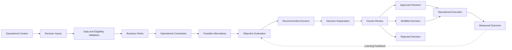

لا يكتمل القرار إلا عندما تُعرف نتيجته التشغيلية أو يُغلقه استثناء معتمد.

## كائنات القرار

يمثل كائن القرار (Decision Object) قرارًا تشغيليًا منظمًا تديره SCOP.

ينبغي أن يحتوي كل كائن قرار على:

| العنصر | الوصف |
| --- | --- |
| معرّف القرار | معرّف فريد للقرار |
| نوع القرار | الفئة التشغيلية للقرار |
| السياق | الموقف الذي يتطلب قرارًا |
| المدخلات | البيانات التشغيلية المستخدمة أثناء التقييم |
| القواعد | سياسات الأعمال الإلزامية |
| القيود | الشروط التي تحد من البدائل الممكنة |
| البدائل | الإجراءات المرشحة التي ينظر فيها المحرك |
| الأهداف | المقاييس المستخدمة لمقارنة البدائل الممكنة |
| التوصية | البديل الذي يقترحه المحرك |
| التفسير | الأسباب الرئيسية الداعمة للتوصية |
| الثقة | مؤشر اختياري على موثوقية التوصية |
| الحالة | الحالة الراهنة للقرار |
| المراجِع | المستخدم المخوّل الذي يراجع التوصية |
| القرار النهائي | الإجراء المعتمد أو المعدّل أو المختار يدويًا |
| مرجع التنفيذ | الرحلة أو الشحنة أو نشاط المستودع أو أي سجل تشغيلي آخر ذي صلة |
| النتيجة | نتيجة التنفيذ المقاسة |
| سجل التدقيق | سجل الإنشاء والمراجعة والتغييرات والاعتماد والإكمال |

يجب أن يظل كائن القرار قابلًا للتتبع من التوصية حتى النتيجة.

## أنواع القرارات

قد يدير محرك القرارات الأولي أنواع القرارات التالية.

| نوع القرار | الغرض |
| --- | --- |
| أهلية الطلب | تحديد ما إذا كان طلب الحركة جاهزًا للتخطيط |
| اختيار مصدر المخزون | اختيار مصدر المخزون أو المستودع |
| اختيار المستودع | تحديد مستودع التلبية أو المعالجة الأنسب |
| قرار العبور المباشر (Cross-Dock) | تحديد ما إذا كان ينبغي للبضائع تجاوز التخزين طويل الأمد |
| تكوين الشحنات | تجميع المنتجات في وحدات شحن قابلة للنقل |
| دمج الشحنات (Shipment Consolidation) | جمع الشحنات المتوافقة |
| إسناد المركبات (Vehicle Assignment) | اختيار مركبة ممكنة ومناسبة |
| إسناد السائقين | اختيار سائق متاح ومخوّل |
| اختيار المسار | اختيار مسار قابل لإعادة الاستخدام أو توليد مسار تشغيلي |
| تسلسل المحطات | تحديد ترتيب محطات الرحلة |
| تكوين الرحلات | إنشاء رحلة ممكنة واحدة أو أكثر |
| جدولة الانطلاق | تحديد أوقات الانطلاق المخططة للرحلات |
| معالجة الأولويات | تحديد الطلبات التي ينبغي تخطيطها أولًا |
| قرار إعادة التخطيط | تحديد كيفية الاستجابة للظروف التشغيلية المتغيرة |
| حل الاستثناءات | التوصية بإجراءات تصحيحية للاستثناءات التشغيلية |

قد تُوسَّع أنواع القرارات عبر إصدارات لاحقة دون تغيير نموذج القرار الأساسي.

## نطاق القرارات

### المشمول في النطاق الأولي

يشمل النطاق الأولي لمحرك القرارات:

- التخطيط التشغيلي اليومي
- أهلية طلب الحركة
- التحقق من توفر المخزون
- مراعاة جاهزية المستودعات
- توافق الشحنات
- دمج الشحنات
- التحقق من سعة المركبات
- التحقق من توفر المركبات
- التحقق من توفر السائقين
- توافق المسارات
- تكوين رحلات متعددة المحطات
- تسلسل الالتقاط والتسليم
- مراعاة النوافذ الزمنية للعملاء
- فرص العبور المباشر
- مراعاة التحويلات بين المستودعات
- معالجة الأولويات
- التحقق من الإمكانية
- توليد التوصيات
- تفسير التوصيات
- المراجعة والاعتماد البشريين
- التعديل اليدوي
- قابلية تتبع القرارات
- قياس النتائج

### خارج النطاق الأولي

لا يشمل محرك القرارات الأولي:

- الإرسال الذاتي الكامل دون اعتماد بشري
- إعادة التوجيه المستمرة القائمة على حركة المرور في الوقت الفعلي
- التفاوض الذاتي على المشتريات
- التسعير التجاري الديناميكي
- الصيانة التنبؤية للمركبات
- قرارات تعلم آلي غير مضبوطة
- مراقبة السائقين القائمة على التتبع عن بُعد في الوقت الفعلي
- واجهات برمجة تطبيقات عامة للتحسين
- قرارات مؤتمتة دون مدخلات وقواعد قابلة للتتبع

قد تُستحدث هذه القدرات عبر إصدارات مستقبلية مضبوطة.

## مدخلات القرار

يتطلب المحرك مدخلات تشغيلية كاملة وموثوقة.

### مدخلات الطلب

- نوع الطلب
- موقع المصدر
- موقع الوجهة
- المنتجات والكميات
- التاريخ المطلوب
- النافذة الزمنية
- الأولوية
- العميل أو مالك المخزون
- متطلبات المناولة
- متطلبات الخدمة
- الحالة الراهنة

### مدخلات المخزون

- الكمية المتاحة
- الكمية المحجوزة
- التوفر المتوقع
- الموقع الفعلي
- ملكية المخزون
- تفاصيل الحصة أو الدفعة
- قيود انتهاء الصلاحية
- التخصيصات القائمة
- الاستلامات الواردة المتوقعة

### مدخلات المستودع

- موقع المستودع
- ساعات التشغيل
- جاهزية المخزون
- حالة الانتقاء
- حالة التجهيز
- سعة التحميل
- سعة العبور المباشر
- وقت المناولة المتوقع
- القيود التشغيلية

### مدخلات المركبة

- نوع المركبة
- سعة الوزن
- سعة الحجم
- سعة المنصات أو الوحدات
- تكوين الحجرات
- القدرة على ضبط درجة الحرارة
- الموقع الحالي والمتوقع
- التوفر
- حالة الصيانة
- قيود المسار
- بيانات تكلفة التشغيل

### مدخلات السائق

- التوفر
- المؤهلات
- صلاحية الرخصة
- حدود وقت العمل
- الموقع الحالي أو المتوقع
- الإسنادات القائمة
- القيود التشغيلية

### مدخلات المسار والموقع

- تعريفات المسارات
- إحداثيات المواقع حيثما توفرت
- مسافات السفر
- مدد السفر المتوقعة
- مدد الخدمة في المحطات
- ساعات تشغيل المواقع
- قيود الوصول
- النوافذ الزمنية للعملاء

### مدخلات التخطيط

- تاريخ التخطيط
- الالتزامات المعتمدة القائمة
- أفق التخطيط
- الأولويات التشغيلية
- افتراضات التكلفة
- أهداف الخدمة
- أهداف الاستغلال
- القواعد والقيود المعتمدة

يجب أن تمنع المدخلات الحرجة المفقودة أو غير الصالحة المحرك من تقديم توصية غير ممكنة على أنها صالحة.

## التحقق من صحة البيانات

يجب على المحرك التحقق من صحة بيانات المدخلات قبل معالجة القرار.

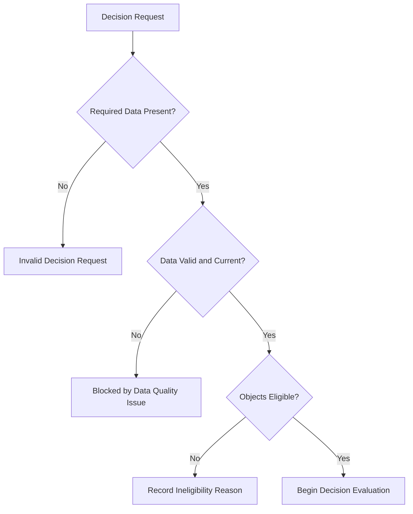

ينبغي أن يحدد التحقق:

- القيم المطلوبة المفقودة
- المواقع غير الصالحة
- الموارد غير الصالحة أو غير النشطة
- الإسنادات المتعارضة
- الكميات المستحيلة
- الملكية غير المتسقة
- المؤهلات أو المستندات منتهية الصلاحية
- الحالة التشغيلية القديمة
- أبعاد السعة المفقودة
- النوافذ الزمنية غير الصالحة
- توليفات المنتجات غير المدعومة

يجب أن تميّز النتيجة بين:

- صالح
- صالح مع تحذيرات
- غير مؤهل
- محظور بسبب جودة البيانات
- محظور بسبب التهيئة
- محظور بسبب تعارض تشغيلي

## قواعد الأعمال

تحدد قواعد الأعمال السلوك الإلزامي أو المضبوط للأعمال.

ومن الأمثلة:

- يجب أن يظل المخزون المملوك للعملاء منفصلًا منطقيًا عن المخزون المملوك للشركة.
- يجب عدم إسناد مركبة غير نشطة.
- يجب عدم إسناد سائق برخصة مطلوبة منتهية الصلاحية.
- يجب عدم انتهاك نافذة زمنية إلزامية للتسليم.
- يجب ألا تتجاوز الرحلة سعة المركبة المعتمدة.
- يجب احترام قيود توافق المنتجات.
- يجب عدم تغيير رحلة مُطلقة دون تخويل.
- يجب أن تستوفي توصية العبور المباشر متطلبات التوقيت والمناولة.
- يجب أن تحدد الخطة المعتمدة المستخدم المعتمِد.
- يجب أن يتضمن الطلب غير المخطط سببًا.

ينبغي أن تتضمن كل قاعدة:

| العنصر | الوصف |
| --- | --- |
| معرّف القاعدة | معرّف فريد لقاعدة الأعمال |
| الاسم | اسم واضح للقاعدة |
| الغرض | سبب الأعمال وراء القاعدة |
| المجال | مجال الأعمال المسؤول |
| المحفّز | الحدث أو الشرط الذي يفعّل القاعدة |
| الشروط | المعايير التي تقيّمها القاعدة |
| النتيجة | سلوك المحرك المطلوب |
| الخطورة | معلومات أو تحذير أو حظر أو حرجة |
| الاستثناءات | الاستثناءات المخوّلة، إن وجدت |
| المالك | مالك الأعمال المساءل |
| الإصدار | إصدار القاعدة المعتمد الحالي |
| تاريخ السريان | التاريخ الذي تسري القاعدة اعتبارًا منه |

أمثلة على معرّفات القواعد:

```text
BR-DEC-001
BR-PLN-001
BR-FLT-001
BR-DRV-001
BR-WHS-001
BR-TRP-001
BR-INV-001
```

## القيود

تحدد القيود الحدود التي يجب أن يعمل ضمنها القرار الممكن.

### القيود الصارمة (Hard Constraints)

يجب عدم انتهاك القيود الصارمة (Hard Constraints) أثناء التخطيط الاعتيادي.

ومن الأمثلة:

- الوزن الأقصى للمركبة
- الحجم الأقصى للمركبة
- توافق المنتجات الإلزامي
- توفر المركبة
- توفر السائق
- عدم تداخل إسنادات الموارد
- النوافذ الزمنية الإلزامية للعملاء
- شروط المناولة المطلوبة
- ملكية المخزون الصالحة
- مخزون المصدر الصالح
- القيود القانونية أو التشغيلية على المركبات

المرشح الذي ينتهك قيدًا صارمًا يُعد غير ممكن.

### القيود المرنة (Soft Constraints)

تمثل القيود المرنة (Soft Constraints) تفضيلات أو شروطًا يمكن انتهاكها مقابل عقوبة قابلة للقياس أو استثناء مخوّل.

ومن الأمثلة:

- وقت التسليم المفضل
- المركبة المفضلة
- المسار المفضل
- الاستغلال المستهدف للسعة
- المستودع المفضل
- تفضيل خدمة العملاء
- استمرارية السائق المفضلة
- المدة المستهدفة للرحلة

يجب أن تكون انتهاكات القيود المرنة ظاهرة في تفسير التوصية.

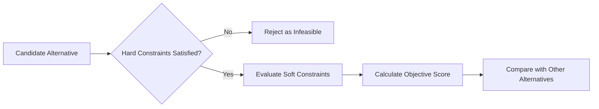

## أهداف التحسين

قد يقيّم المحرك البدائل الممكنة باستخدام أهداف متعددة.

| الهدف | النتيجة المقصودة |
| --- | --- |
| الامتثال للخدمة | حماية التواريخ المطلوبة والنوافذ الزمنية |
| تغطية الطلب | تخطيط أعلى قدر مناسب من الطلب المؤهل |
| استغلال السعة | تحسين استخدام سعة المركبات المتاحة |
| تقليل الرحلات | تقليل الرحلات غير الضرورية |
| تقليل المسافة | تقليل مسافات السفر غير الضرورية |
| تقليل المدة | تقليل أوقات السفر والانتظار القابلة للتجنب |
| تقليل التكلفة | تقليل تكاليف النقل والمناولة التشغيلية |
| الدمج | جمع الشحنات المتوافقة على نحو مفيد |
| تنسيق المستودعات | مواءمة الخطط مع جاهزية الانتقاء والتجهيز والتحميل والعبور المباشر |
| توازن الموارد | تجنب الاعتماد المفرط على مركبات أو سائقين بعينهم |
| حماية الأولوية | ضمان معالجة الطلب العاجل وذي الأولوية العالية على نحو مناسب |
| تقليل المخاطر | تقليل الخطط ذات الاحتمالية العالية للفشل أو التأخير |

قد تتعارض الأهداف.

فعلى سبيل المثال، قد يؤدي تعظيم استغلال السعة إلى زيادة مدة الرحلة أو تهديد نافذة زمنية. يجب على المحرك تطبيق الأولويات والأوزان المعتمدة بدلًا من تحسين مقياس واحد بمعزل عن غيره.

## التسلسل الهرمي للأهداف

ينبغي أن يتبع التسلسل الهرمي الأولي للقرارات هذا الترتيب عمومًا:

1. السلامة والامتثال القانوني والملكية والامتثال التشغيلي الإلزامي
2. الإمكانية
3. التزامات العملاء الإلزامية
4. حماية الأولوية والخدمة
5. تغطية الطلب
6. توفر الموارد
7. استغلال السعة
8. كفاءة المسافة والوقت والتكلفة
9. التفضيلات التشغيلية

يمكن تهيئة هذا التسلسل الهرمي وفقًا لسياسة الأعمال المعتمدة.

يجب ألا يقلل المحرك من الامتثال الإلزامي لمجرد تحسين التكلفة أو الاستغلال.

## البدائل الممكنة

ينبغي للمحرك توليد بدائل متعددة أو تقييمها عندما يكون ذلك عمليًا من الناحية التشغيلية.

في قرار إسناد المركبات، قد تشمل البدائل:

- إسناد المركبة A إلى الرحلة 1
- إسناد المركبة B إلى الرحلة 1
- تقسيم الشحنة على مركبتين
- دمج الشحنة مع رحلة أخرى
- تأجيل الطلب ضمن فترة الخدمة المسموح بها
- وسم الطلب بأنه غير مخطط لعدم وجود مركبة ممكنة

ولكل بديل، ينبغي للمحرك تحديد:

- الإمكانية
- انتهاكات القيود
- نتيجة الخدمة المتوقعة
- استغلال السعة
- المدة المتوقعة
- التكلفة المتوقعة
- المخاطر التشغيلية
- المزايا والعيوب

## توليد التوصيات

ينبغي أن يتبع توليد التوصيات تسلسلًا مضبوطًا.

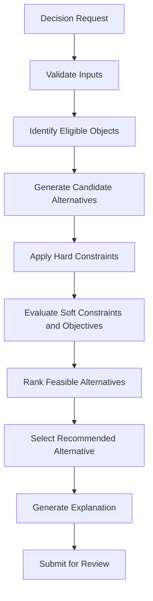

ينبغي أن تحتوي التوصية على:

- الإجراء الموصى به
- كائنات الأعمال ذات الصلة
- الموارد المختارة
- التواريخ والأوقات المخططة
- القواعد المطبقة
- القيود المستوفاة
- عقوبات القيود المرنة ذات الصلة
- المنافع المتوقعة
- المخاطر المعروفة
- الخيارات البديلة حيثما كانت مفيدة
- سبب الطلب غير المخطط أو المرفوض
- مؤشر الثقة أو الموثوقية حيثما توفر

## إسناد المركبات (Vehicle Assignment)

يختار إسناد المركبات (Vehicle Assignment) مركبة مناسبة لرحلة أو حمولة مقترحة.

يجب على المحرك تقييم:

- توفر المركبة
- الموقع الحالي والمتوقع للمركبة
- سعة الوزن
- سعة الحجم
- سعة المنصات أو الوحدات
- متطلبات الحجرات
- متطلبات درجة الحرارة
- توافق المنتجات
- قيود المسار
- المدة المتوقعة للرحلة
- الإسنادات القائمة
- تكلفة التشغيل
- السعة المتبقية
- سهولة الوصول للتحميل

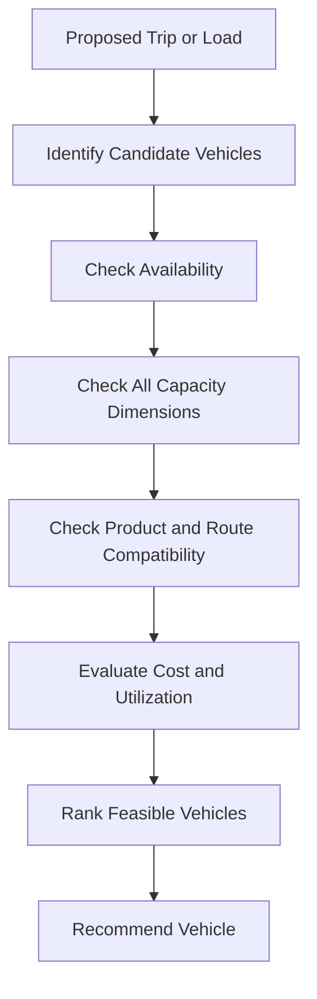

ينبغي أن يوضح التفسير سبب أفضلية المركبة المختارة وسبب رفض البدائل المهمة.

## إسناد السائقين

يختار إسناد السائقين سائقًا متاحًا ومخوّلًا.

يجب على المحرك تقييم:

- توفر السائق
- إسنادات الرحلات القائمة
- المؤهلات المطلوبة
- صلاحية الرخصة
- حدود وقت العمل
- موقع الانطلاق
- المدة المتوقعة للرحلة
- القيود المعتمدة
- تفضيلات الاستمرارية التشغيلية

يجب عدم إسناد سائق إلى رحلات متداخلة.

ينبغي أن تحدد التوصية أي نقص في السائقين المؤهلين.

## دمج الشحنات (Shipment Consolidation)

يحدد دمج الشحنات (Shipment Consolidation) ما إذا كان ينبغي للشحنات المتوافقة أن تتشارك حمولة أو رحلة.

يجب على المحرك مراعاة:

- توافق المنشأ
- توافق الوجهة
- توافق المسار
- التواريخ المطلوبة
- النوافذ الزمنية
- توافق المنتجات
- ملكية المخزون
- متطلبات المناولة
- سعة المركبة
- تسلسل المحطات
- المسافة الإضافية
- المدة الإضافية
- الأثر على خدمة العملاء
- جاهزية المستودعات
- منفعة التكلفة والاستغلال

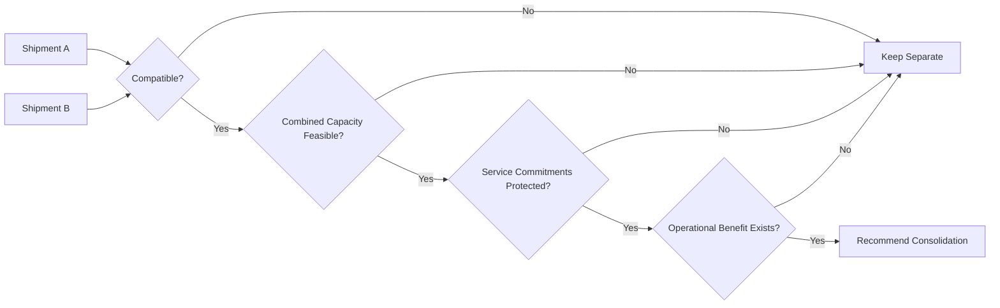

السعة المتاحة وحدها ليست مبررًا كافيًا للدمج.

## اختيار المستودع

يحدد اختيار المستودع موقع المخزون أو المعالجة الأنسب.

قد يقيّم المحرك:

- توفر المخزون
- ملكية المخزون
- ساعات تشغيل المستودع
- جاهزية الانتقاء والتجهيز
- المسافة إلى الوجهات
- متطلبات التحويل
- سعة العبور المباشر
- عبء العمل في المستودع
- القدرة على مناولة المنتجات
- وقت التلبية المتوقع
- تكلفة النقل
- مخاطر الخدمة

يجب أن تحافظ التوصية على ملكية المخزون وقابلية تتبع التلبية.

## قرار العبور المباشر (Cross-Dock)

يحدد قرار العبور المباشر (Cross-Dock) ما إذا كان ينبغي للمنتجات الواردة التحرك مباشرة نحو التنفيذ الصادر بدلًا من التخزين الاعتيادي.

يجب على المحرك التأكد من أن:

- المنتجات محددة ومخصصة.
- توقيت الوارد موثوق بدرجة كافية.
- توقيت الصادر متوافق تشغيليًا.
- متطلبات الفحص يمكن إكمالها.
- التجهيز المؤقت متاح.
- شروط مناولة المنتجات مدعومة.
- الملكية تظل قابلة للتتبع.
- القرار يحقق منفعة تشغيلية.
- مخاطر تعطل الصادر تظل مقبولة.

وتشمل القرارات المحتملة:

- التخزين الاعتيادي
- العبور المباشر فورًا
- العبور المباشر بعد الفحص
- العبور المباشر جزئيًا
- تأجيل القرار حتى تأكيد الوارد
- رفض العبور المباشر لعدم استيفاء المتطلبات

## اختيار المسار وتسلسل المحطات

يحدد اختيار المسار وتسلسل المحطات كيفية زيارة الرحلة لمواقعها المطلوبة.

يجب على المحرك مراعاة:

- موقع المصدر
- مواقع الوجهات
- تبعيات الالتقاط قبل التسليم
- النوافذ الزمنية
- مدد الخدمة
- تغيرات سعة المركبة بعد كل محطة
- قيود المسار
- ساعات تشغيل المستودعات
- أوقات السفر المقدرة
- أولويات المحطات
- تسلسل تحميل المنتجات وتفريغها
- تعريفات المسارات القائمة
- المخاطر التشغيلية

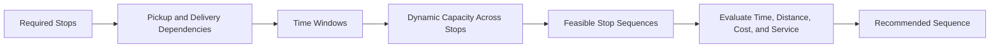

يجب على المحرك عدم جدولة أي تسليم قبل نشاط الالتقاط أو التحميل المطلوب له.

## السعة الديناميكية

تتغير حمولة المركبة خلال الرحلة متعددة المحطات.

يجب على المحرك حساب السعة بعد كل محطة.

مثال:

```text
Departure Load: 800 kg
Stop 1 Delivery: -200 kg
Stop 2 Pickup: +300 kg
Stop 3 Delivery: -400 kg
Remaining Load: 500 kg
```

تكون الرحلة ممكنة فقط عندما تبقى السعة ضمن جميع الحدود الإلزامية طوال التسلسل الكامل.

ينبغي عدم فحص السعة عند الانطلاق فقط.

## تقييم النوافذ الزمنية

يجب على المحرك حساب:

- الوصول المخطط
- أبكر وقت خدمة مسموح به
- وقت الانتظار
- بدء الخدمة
- مدة الخدمة
- الانطلاق المخطط
- وقت السفر إلى المحطة التالية
- آخر وصول أو إكمال مسموح به
- مخاطر التأخير المتوقعة

وتشمل النتائج المحتملة للنوافذ الزمنية:

| النتيجة | المعنى |
| --- | --- |
| ممتثل | الخدمة المخططة ضمن النافذة المسموح بها |
| مبكر مع انتظار | تصل المركبة مبكرًا وتنتظر قبل الخدمة |
| نافذة مفضلة فائتة | تفويت تفضيل دون انتهاك التزام إلزامي |
| معرض للخطر | الخطة ممكنة لكن هامش الوقت فيها محدود |
| منتهَك | نافذة زمنية إلزامية لا يمكن استيفاؤها |

يجب أن يجعل الانتهاك الإلزامي البديل غير ممكن ما لم يُطبَّق استثناء مخوّل صراحةً.

## معالجة الأولويات

ينبغي أن تؤثر الأولوية في التخطيط دون أن تتجاوز القيود الإلزامية في صمت.

قد تشمل عوامل الأولوية:

- التزام العميل
- إلحاح الطلب
- حساسية المنتج
- الموعد النهائي التشغيلي
- التأخير القائم
- تصنيف خدمة العميل
- الاعتماد على المستودع أو المورد
- استثناء معتمد من الإدارة
- الأثر على الأعمال

ينبغي للمحرك تفسير سبب اختيار طلب ذي أولوية أعلى قبل طلب آخر.

## الطلب غير المخطط

قد لا يتسع كل الطلب المؤهل ضمن السعة التشغيلية المتاحة.

يجب أن يتضمن الطلب غير المخطط سببًا واضحًا.

ومن الأمثلة:

- لا يوجد مخزون متاح
- المستودع غير جاهز
- لا توجد مركبة ممكنة
- لا يوجد سائق مؤهل
- نقص في السعة
- تعارض في النافذة الزمنية
- عدم توافق المنتجات
- قيد على المسار
- بيانات مطلوبة مفقودة
- موقع العميل غير متاح
- تجاوز أفق التخطيط
- أولوية أدنى مما تسمح به السعة المتاحة

ينبغي للمحرك التوصية بإجراء تالٍ حيثما أمكن، مثل:

- إعادة التخطيط لتاريخ آخر
- استخدام مستودع آخر
- تقسيم الشحنة
- طلب سعة إضافية
- حل مشكلة البيانات المفقودة
- تغيير النافذة الزمنية بتخويل
- تنفيذ تحويل بين المستودعات

## تفسير القرار

ينبغي أن توفر كل توصية مهمة تفسيرًا مفهومًا.

ينبغي أن يجيب تفسير القرار عن الأسئلة التالية:

1. ما الذي يوصى به؟
2. لماذا يوصى به؟
3. ما قواعد الأعمال التي أثرت فيه؟
4. ما القيود التي استوفيت؟
5. ما البدائل التي جرى النظر فيها؟
6. لماذا رُفضت البدائل المهمة؟
7. ما المنافع المتوقعة؟
8. ما المخاطر أو التحذيرات المتبقية؟
9. ما الإجراء البشري المطلوب؟

مثال:

```text
Vehicle V-014 is recommended for Trip T-102 because it is available,
supports the required temperature condition, satisfies the 1,200 kg load,
and provides 86% planned weight utilization.
Vehicle V-009 was rejected because its available volume is insufficient.
Vehicle V-021 is feasible but would increase estimated operating cost and
leave more unused capacity.
```

يجب أن تستخدم التفسيرات لغة الأعمال بدلًا من درجات تقنية غير مفسرة.

## ثقة التوصية

يمكن استخدام مؤشر ثقة عند وجود بيانات كافية.

قد تتأثر الثقة بما يلي:

- اكتمال المدخلات
- حداثة المدخلات
- موثوقية أوقات السفر
- يقين جاهزية المستودعات
- يقين توفر المخزون
- اتساق التنفيذ التاريخي
- عدد البدائل الممكنة
- استقرار ظروف التشغيل

وقد تشمل مستويات الثقة المحتملة:

- مرتفع (High)
- متوسط (Medium)
- منخفض (Low)
- غير متاح (Not Available)

لا تحل الثقة محل التحقق من الإمكانية أو الاعتماد البشري.

يجب أن تحدد التوصية منخفضة الثقة مصدر عدم اليقين بوضوح.

## المراجعة والاعتماد البشريان

يستخدم محرك القرارات الأولي نموذج ضبط قائمًا على إبقاء الإنسان في حلقة القرار (human-in-the-loop).

يجب أن يتمكن المستخدمون المخوّلون من:

- مراجعة التوصيات
- فحص المدخلات
- فحص القواعد المطبقة
- مراجعة نتائج القيود
- مقارنة البدائل
- مراجعة التفسيرات
- تعديل عناصر القرار المخوّلة
- اعتماد التوصيات
- رفض التوصيات
- تقديم أسباب التعديل أو الرفض
- إطلاق القرارات المعتمدة للتنفيذ

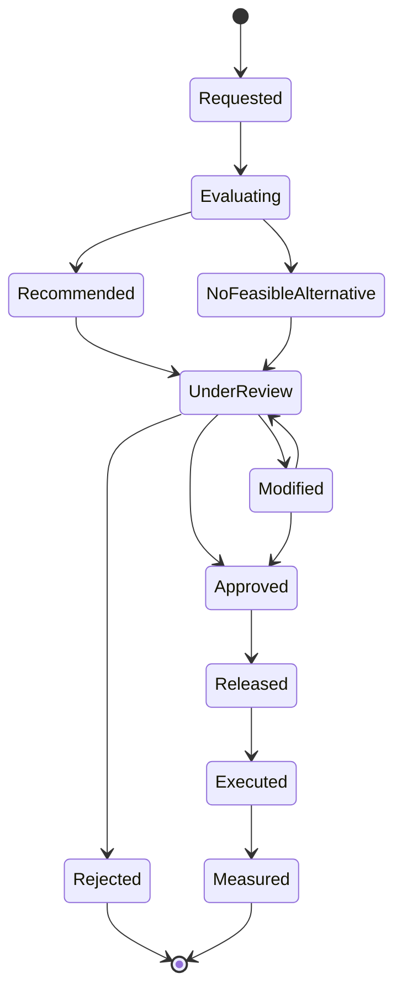

## إدارة التجاوزات

يحدث التجاوز عندما يغيّر مستخدم مخوّل توصية أو يرفضها.

ينبغي أن يسجل النظام:

- التوصية الأصلية
- التفسير الأصلي
- المستخدم القائم بالتجاوز
- التاريخ والوقت
- القيم المتغيرة
- سبب التجاوز
- القرار النهائي
- الأثر المتوقع
- النتيجة الفعلية

وقد تشمل أسباب التجاوز:

- معلومات تشغيلية غير متاحة للمحرك
- تعليمات العميل
- تعليمات الإدارة
- بيانات رئيسية غير صحيحة
- حالة مستودع غير متوقعة
- مشكلة في السائق أو المركبة
- معرفة محلية بالمسار
- تقدير لمخاطر الخدمة
- متطلب طارئ

التجاوزات بيانات تعلم قيّمة وينبغي عدم اعتبارها أخطاء بصورة تلقائية.

## دورة حياة القرار

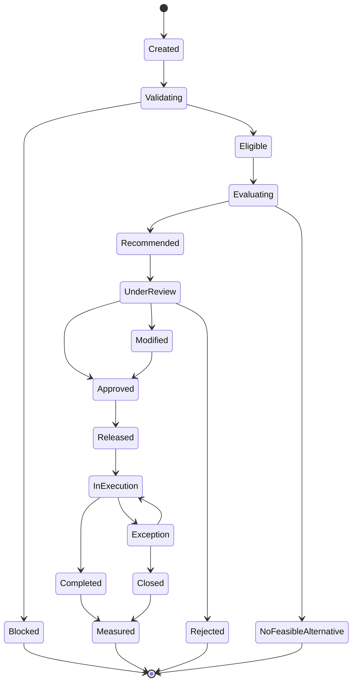

يجب أن يحدد كل انتقال:

- الفاعل المسؤول أو عملية النظام
- الطابع الزمني
- المحفّز
- نتيجة التحقق
- كائنات الأعمال ذات الصلة
- السبب حيثما ينطبق

## سجل تدقيق القرارات

ينبغي أن يشمل سجل التدقيق:

- إنشاء القرار
- لقطة المدخلات أو مراجعها
- إصدارات القواعد
- نتائج القيود
- البدائل المولّدة
- التوصية
- التفسير
- الثقة
- المراجِع
- التعديلات
- الاعتماد أو الرفض
- الإطلاق
- مرجع التنفيذ
- النتيجة
- مقارنة الأداء

يجب أن يدعم سجل القرارات التحقيق التشغيلي والتحسين المستقبلي.

## قرارات إعادة التخطيط

تحدث إعادة التخطيط عندما تتغير الظروف التشغيلية بعد التخطيط أو الاعتماد.

وقد تشمل المحفزات:

- تعطل مركبة
- غياب سائق
- نقص في المخزون
- تأخر مستودع
- تأخر مورد
- إلغاء من العميل
- تغيير النافذة الزمنية من العميل
- تعطل طريق
- محطة فاشلة
- طلب جديد عاجل
- بيانات تخطيط غير صحيحة

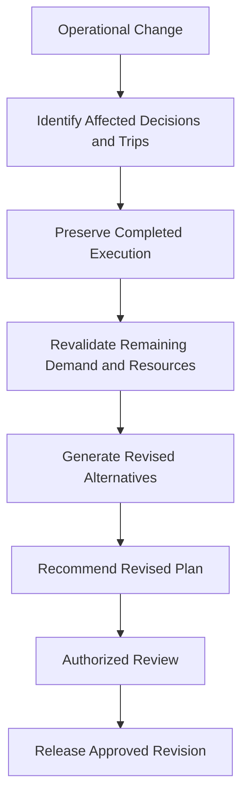

يجب أن تحافظ إعادة التخطيط على:

- الخطة الأصلية
- التوصية الأصلية
- التنفيذ المكتمل
- سبب التغيير
- التوصية المنقحة
- المستخدم المعتمِد
- الأثر على الخدمة والتكلفة والسعة والطلب

## قرارات الاستثناءات

عندما يتعذر استمرار التنفيذ الاعتيادي، يجوز للمحرك التوصية بإجراءات تصحيحية.

ومن الأمثلة:

- استبدال مركبة
- استبدال سائق
- تقسيم رحلة
- إعادة إسناد شحنة
- تغيير تسلسل المحطات
- إعادة منتجات إلى مستودع
- نقل منتجات إلى مركبة أخرى
- إعادة جدولة محطة
- إنشاء طلب متابعة
- إلغاء جزء من حركة
- التصعيد لاعتماد الإدارة

يجب ألا تطمس توصيات الاستثناءات التاريخ التشغيلي الأصلي.

## قياس نتائج القرارات

يجب على المحرك مقارنة التوصيات والقرارات النهائية بالنتائج الفعلية.

| مجال القرار | أمثلة على مقاييس النتائج |
| --- | --- |
| إسناد المركبات | استغلال السعة، والتكلفة، وموثوقية الإكمال |
| إسناد السائقين | دقة التوفر، ومعدل التعارض، والإكمال |
| دمج الشحنات | عدد الشحنات لكل رحلة، والمدة المضافة، ومنفعة التكلفة |
| اختيار المسار | المدة والمسافة المخططتان مقابل الفعليتين |
| تسلسل المحطات | الامتثال للنوافذ الزمنية ووقت الانتظار |
| اختيار المستودع | وقت التلبية، وتكلفة التحويل، والجاهزية |
| قرار العبور المباشر | وقت المناولة، وتجنب التخزين، وموثوقية الصادر |
| معالجة الأولويات | نتيجة الخدمة وأثر الطلب المؤجل |
| إعادة التخطيط | وقت التعافي وتقليل الاضطراب |
| الخطة الإجمالية | تغطية الطلب، ومعدل الاعتماد، والتجاوزات، والخدمة والتكلفة |

## مؤشرات الأداء الرئيسية لجودة القرارات

تشمل مؤشرات الأداء الرئيسية المحتملة لمحرك القرارات:

- معدل قبول التوصيات
- معدل تجاوز التوصيات
- معدل الرفض
- معدل عدم وجود بديل ممكن
- نسبة التوصيات المصحوبة بتفسيرات
- معدل التوصيات عالية الثقة
- معدل إمكانية التخطيط
- معدل انتهاك السعة
- معدل تعارض الموارد
- الامتثال للنوافذ الزمنية
- تغطية الطلب المخطط
- تواتر إعادة التخطيط
- الفرق بين الخطط الموصى بها والخطط المنفذة
- أداء النتائج حسب نوع القرار
- معدل الحظر بسبب جودة البيانات

ستُحدد الصيغ الدقيقة والمستهدفات في مواصفات لاحقة لمؤشرات الأداء الرئيسية.

## حلقة التغذية الراجعة

ينبغي أن تحسّن نتائج التنفيذ جودة القرارات المستقبلية.

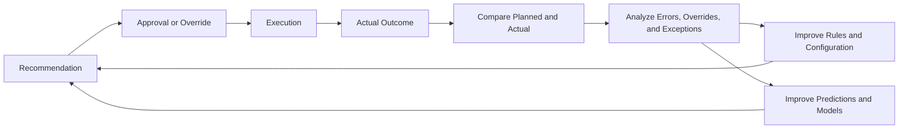

قد تحسّن حلقة التغذية الراجعة:

- تقديرات أوقات السفر
- تقديرات مدد الخدمة
- تقديرات جاهزية المستودعات
- ملاءمة المركبات
- قواعد الدمج
- افتراضات السعة
- تقييم المخاطر
- ثقة التوصيات
- أوزان أهداف القرار

يجب أن تظل التغييرات على قواعد الأعمال والسلوك المؤتمت خاضعة للحوكمة ومضبوطة الإصدارات.

## محرك القرارات ومنصة الذكاء الاصطناعي

لمحرك القرارات ومنصة الذكاء الاصطناعي (AI Platform) مسؤوليات مترابطة لكنها متمايزة.

| القدرة | محرك القرارات (Decision Engine) | منصة الذكاء الاصطناعي (AI Platform) |
| --- | --- | --- |
| قواعد الأعمال | يطبق القواعد المعتمدة | قد تحدد أنماطًا تقترح تحسينات للقواعد |
| القيود الصارمة | يفرض القيود الإلزامية | لا تتجاوز القيود الإلزامية |
| التحسين | يقيّم البدائل الممكنة ويرتبها | قد توفر تقنيات تحسين أو تقديرات متعلَّمة |
| التنبؤات | يستخدم القيم المتنبأ بها | تنتج تنبؤات بوقت الوصول المتوقع أو المدة أو الطلب أو المخاطر |
| التوصيات | ينتج توصيات تشغيلية مضبوطة | توفر ذكاءً داعمًا للتوصيات |
| التفسيرات | يعرض منطق القرار على مستوى الأعمال | قد توفر معلومات عن المساهمة على مستوى النموذج |
| الاعتماد | يدعم المراجعة البشرية المضبوطة | لا تعتمد قرارات الأعمال على نحو مستقل |
| التدقيق | يسجل القرارات والنتائج | تسجل إصدارات النماذج والمدخلات والتنبؤات |

محرك القرارات هو طبقة ضبط قرارات الأعمال.

وتوفر منصة الذكاء الاصطناعي قدرات التنبؤ والتحسين والتعلم التي تستخدمها تلك الطبقة.

## دور التكامل مع Odoo 17

يوفر Odoo 17 (نظام تخطيط موارد المؤسسات) السجلات التشغيلية ومسارات عمل التنفيذ.

قد يستهلك محرك القرارات معلومات من:

- أوامر الشراء
- أوامر البيع أو أوامر العملاء
- حركات المخزون
- إيصالات المستودعات
- أوامر التسليم
- التحويلات الداخلية
- توفر المخزون
- البيانات الرئيسية للمنتجات
- سجلات العملاء والموردين
- تعريفات المستودعات
- سجلات الأسطول
- سجلات المستخدمين والسائقين

وقد ينتج محرك القرارات أو يحدّث:

- مجموعات الشحنات الموصى بها
- الرحلات الموصى بها
- إسنادات المركبات
- إسنادات السائقين
- تسلسلات المحطات
- الأوقات المخططة
- توصيات العبور المباشر
- تحذيرات التخطيط
- أسباب الطلب غير المخطط
- الخطط التشغيلية المعتمدة
- سجلات تدقيق القرارات

يجب أن تحافظ امتدادات SCOP على سلامة سجلات Odoo التشغيلية القياسية.

## حوكمة القرارات

### ملكية القواعد

يجب أن يكون لكل قاعدة أعمال مالك أعمال مساءل.

### التغييرات المضبوطة

يجب أن تكون تغييرات القواعد والقيود والأهداف والأوزان مخوّلة ومضبوطة الإصدارات.

### قابلية التفسير

يجب أن تتضمن التوصيات المهمة تفسيرات مفهومة.

### المساءلة البشرية

يظل المستخدمون المخوّلون مساءلين عن الاعتماد والإطلاق التشغيلي.

### فصل المسؤوليات

ينبغي ألا تعتمد تغييرات القواعد عالية الأثر والاعتمادات التشغيلية على دور واحد غير مضبوط.

### قابلية التدقيق

يجب الاحتفاظ بالتوصيات والتجاوزات والاعتمادات وعمليات التنفيذ والنتائج.

### جودة البيانات

يجب ألا يخفي المحرك رداءة جودة البيانات وراء توصيات تبدو دقيقة.

### الأتمتة الآمنة

لا يجوز زيادة الأتمتة إلا عندما:

- تكون جودة القرارات قابلة للقياس.
- تكون جودة البيانات كافية.
- تكون القواعد والقيود مستقرة.
- تكون الاستثناءات مضبوطة.
- تكون التفسيرات متاحة.
- تكون الإدارة قد اعتمدت مستوى الأتمتة.

## مستويات الأتمتة

قد تتدرج SCOP عبر مستويات أتمتة مضبوطة.

| المستوى | الوصف |
| --- | --- |
| Level 0 — Manual (يدوي) | يتخذ المستخدمون القرارات دون توصيات مولّدة |
| Level 1 — Assisted (مساعد) | يتحقق المحرك من البيانات ويقدم تحذيرات |
| Level 2 — Recommended (موصى به) | يولّد المحرك توصيات تتطلب الاعتماد |
| Level 3 — Conditional Automation (أتمتة مشروطة) | قد تُنفَّذ القرارات المعتمدة منخفضة المخاطر تلقائيًا |
| Level 4 — Adaptive Automation (أتمتة تكيفية) | تكيّف المنصة قرارات مختارة باستخدام النتائج المقاسة ضمن ضوابط معتمدة |

الهدف الأولي هو Level 2 في المقام الأول.

يجب اعتماد التدرج حسب نوع القرار بدلًا من تطبيقه على نحو شامل.

## الفشل والتراجع الآمن

عندما يتعذر على محرك القرارات إنتاج توصية موثوقة، يجب أن يفشل بأمان.

قد يشمل سلوك التراجع الآمن:

- وسم القرار بأنه محظور
- إرجاع نتيجة بعدم وجود بديل ممكن
- تحديد المدخلات المفقودة
- سرد القيود المنتهكة
- طلب التخطيط اليدوي
- الحفاظ على الالتزامات المعتمدة القائمة
- تجنب الإطلاق التشغيلي التلقائي
- تصعيد المشكلات الحرجة

يجب على المحرك عدم اختلاق بيانات تشغيلية مفقودة أو تجاهل القيود الإلزامية في صمت.

## حدود المعمارية

تحدد هذه الصفحة:

- مفاهيم القرارات
- كائنات القرار (Decision Objects)
- أنواع القرارات
- المدخلات
- القواعد
- القيود
- الأهداف
- توليد التوصيات
- التفسير
- الاعتماد البشري
- التجاوزات
- إعادة التخطيط
- النتائج
- الحوكمة
- مستويات الأتمتة

ولا تحدد:

- الصياغات الرياضية التفصيلية للتحسين
- اختيار المحلّل (Solver)
- معمارية الشيفرة المصدرية
- مخططات قواعد البيانات
- حمولات واجهات برمجة التطبيقات
- معمارية نماذج تعلم الآلة
- تصميم واجهة المستخدم
- نماذج بيانات Odoo التفصيلية
- معايير القبول الوظيفية الكاملة

ستُوثق تلك الموضوعات في مواصفات مخصصة وظيفية وخاصة بالذكاء الاصطناعي والتطوير والجوانب التقنية.

## الملخص

يحوّل محرك قرارات سلسلة الإمداد في SCOP البيانات التشغيلية إلى توصيات مضبوطة وقابلة للتفسير وقابلة للقياس.

فهو يطبق قواعد الأعمال المعتمدة، ويفرض القيود الإلزامية، ويقيّم البدائل الممكنة، ويوازن بين أهداف الخدمة والكفاءة، ويقدم التوصيات للمراجعة البشرية المخوّلة.

المحرك ليس مجرد آلية تحسين؛ بل هو طبقة ضبط الأعمال التي تربط البيانات والقواعد والقرارات والاعتمادات والتنفيذ والنتائج.

ومبدؤه المركزي هو أنه لا ينبغي إطلاق أي توصية مهمة تشغيليًا ما لم تكن ممكنة وقابلة للتفسير وقابلة للتتبع ومخوّلة على النحو المناسب.

## الصفحات ذات الصلة

- [نظام تصميم التوثيق](../getting-started/documentation-design-system.mdx)
- [مخطط المنتج](../product/product-blueprint.mdx)
- [معمارية الأعمال](../business/business-architecture.mdx)
- [نموذج تشغيل سلسلة الإمداد](../operations/supply-chain-operating-model.mdx)
- نظرة عامة على منصة الذكاء الاصطناعي (AI Platform)
- قواعد القرار
- إسناد المركبات (Vehicle Assignment)
- دمج الشحنات (Shipment Consolidation)
- تحسين المسارات
- قابلية تفسير القرارات
