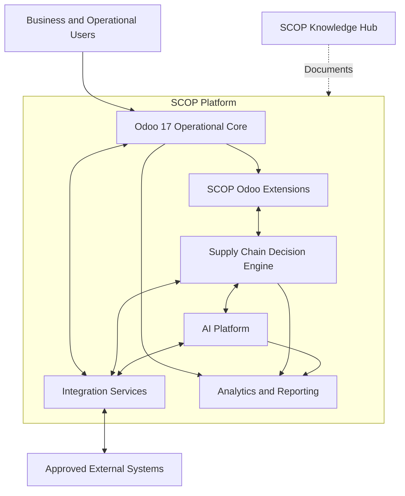
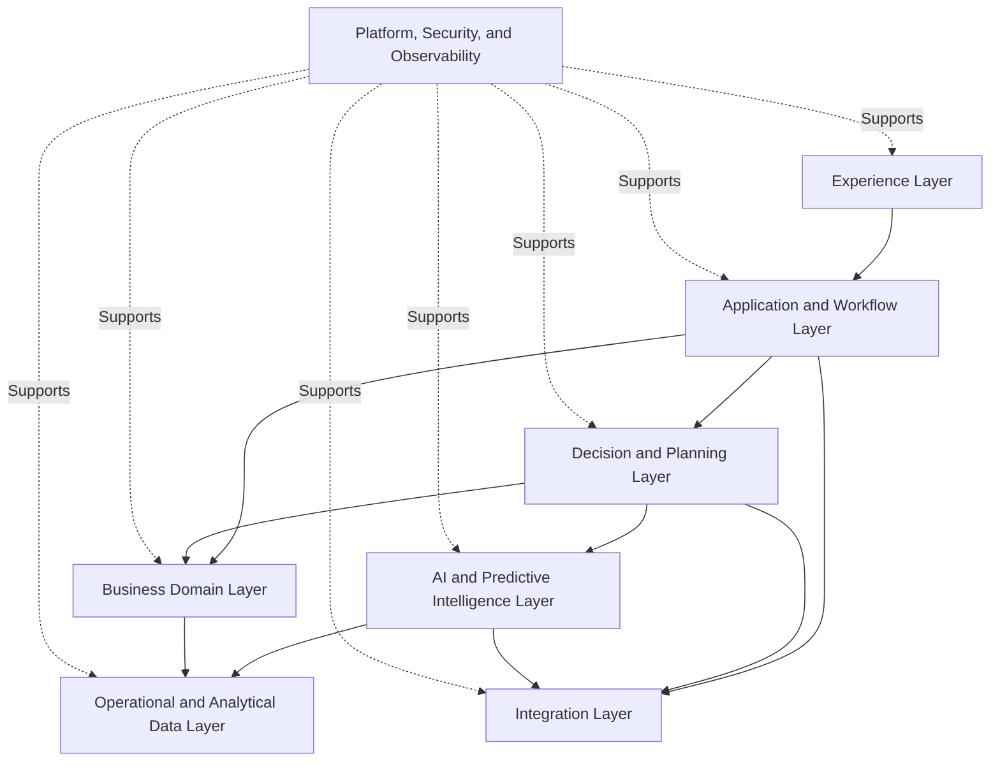
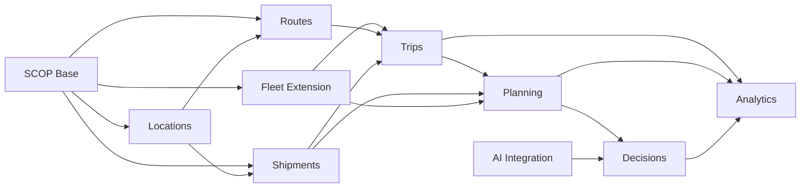
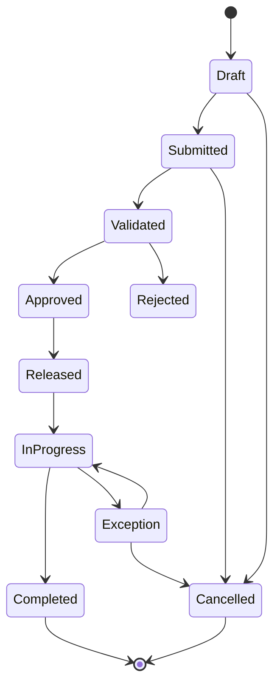
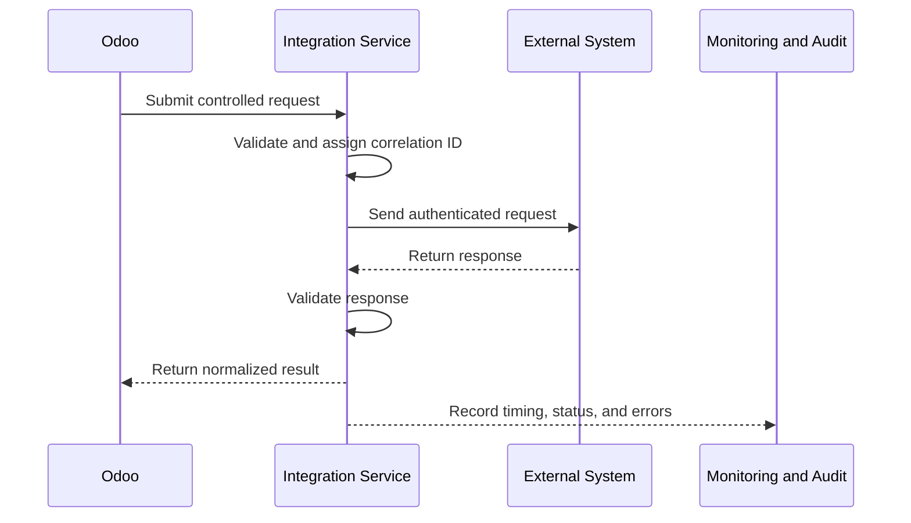
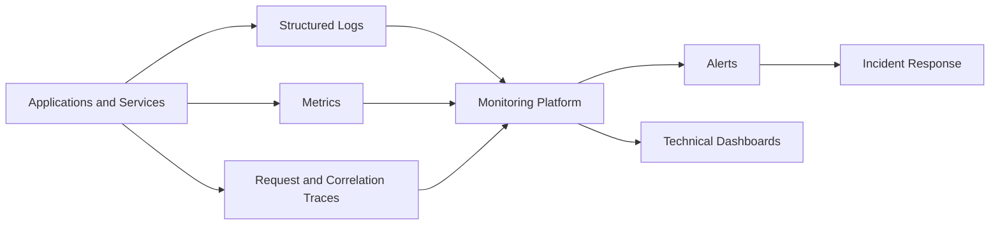

import DocumentInfo from '@site/src/components/DocumentInfo';

# نظرة عامة على التطوير

<DocumentInfo
  category="التطوير"
  audience={['المنتج', 'التقنية', 'التطوير', 'البيانات', 'الأمان', 'العمليات']}
  status="Approved"
  version="1.0"
  owner="فريق الهندسة"
  updated="يوليو 2026"
  readingTime="14 دقيقة"
/>

## الغرض

تحدد النظرة العامة على التطوير المبادئ التقنية والهندسية المستخدمة في تصميم SCOP (منصة تشغيل سلسلة الإمداد) وبنائها واختبارها وتكاملها ونشرها وصيانتها.

وترسي هذه الصفحة أساسًا مشتركًا لكل من:

- تطوير Odoo 17
- الوحدات (Modules) الخاصة بـ SCOP
- خدمات Decision Engine (محرك القرارات)
- خدمات AI Platform (منصة الذكاء الاصطناعي)
- خدمات التكامل
- تبادل البيانات
- الضوابط الأمنية
- الاختبار
- النشر
- المراقبة
- التوثيق
- حوكمة التغيير

تحدد هذه الصفحة التوجه الهندسي والحدود الهندسية.

وهي لا تقدم تنفيذات كاملة للشفرة المصدرية، أو مخططات قواعد البيانات، أو حمولات API (واجهة برمجة التطبيقات)، أو تهيئة البنية التحتية، أو مواصفات الوحدات المنفردة.

## الأهداف الهندسية

يجب أن تحقق هندسة SCOP الأهداف التالية:

| الهدف | النتيجة المرجوة |
| --- | --- |
| الموثوقية التشغيلية | ضمان بقاء مسارات عمل سلسلة الإمداد الحرجة موثوقة |
| ملكية واضحة للمجالات | منع تكرار منطق الأعمال أو تعارضه |
| توسعة Odoo بشكل مضبوط | توسعة Odoo دون الإضرار بالسلوك التشغيلي القياسي |
| قابلية الصيانة | إبقاء الشفرة مفهومة وقابلة للاختبار والدعم |
| سلامة التكامل | تبادل البيانات عبر واجهات مضبوطة وقابلة للتتبع |
| قابلية تتبع القرارات | الحفاظ على العلاقة بين المدخلات والتوصيات والموافقات والنتائج |
| الأمان | حماية المستخدمين والبيانات التشغيلية والنماذج وبيانات الاعتماد والتكاملات |
| قابلية التوسع | دعم النمو في الطلبات والمستودعات والمركبات والرحلات والقرارات والمستخدمين |
| قابلية الملاحظة | جعل الأعطال والأداء وسلوك النظام قابلة للقياس |
| التسليم الآمن | التحقق من صحة التغييرات قبل أن تؤثر في عمليات الإنتاج |
| التوثيق كشفرة (Documentation as Code) | إبقاء التوثيق التقني خاضعًا للتحكم في الإصدارات مع المنصة |

## السياق التقني

بُنيت SCOP حول Odoo 17 بوصفه العمود الفقري التشغيلي.

قد تشمل المنصة:

- تطبيقات Odoo القياسية
- وحدات Odoo مخصصة
- توسعات SCOP التشغيلية
- خدمات Decision Engine
- خدمات AI Platform
- خدمات التكامل
- عمّال الخلفية (Background Workers)
- مكونات التقارير والتحليلات
- خدمات خارجية مضبوطة
- SCOP Knowledge Hub (مركز معرفة SCOP)



## المبادئ المعمارية

### Odoo بوصفه نظام السجلات التشغيلي

يجب أن يبقى Odoo 17 النظام التشغيلي المرجعي لسجلات الأعمال ضمن نطاقه.

ومن الأمثلة على ذلك:

- المنتجات
- الموردون
- العملاء
- فروع العملاء
- أوامر الشراء
- أوامر البيع أو أوامر العملاء
- المستودعات
- مواقع المخزون
- إيصالات الاستلام
- أوامر التسليم
- التحويلات الداخلية
- حركات المخزون
- المركبات
- المستخدمون
- المستندات التشغيلية

يجب ألا تُنشئ خدمات SCOP سجلات رئيسية مكررة غير مضبوطة خارج Odoo.

### ملكية واضحة للأنظمة

يجب أن يكون لكل كائن بيانات مهم مالك مرجعي واحد محدد.

| المعلومات | المالك الأساسي |
| --- | --- |
| المنتجات والشركاء التشغيليون | Odoo |
| المخزون وحركات المخزون | Odoo |
| إيصالات المستودعات وأوامر التسليم | Odoo |
| توسعات SCOP للمسارات والرحلات | Odoo ووحدات SCOP المعتمدة |
| سجلات القرارات | Decision Engine أو وحدة قرارات SCOP المعتمدة |
| التنبؤات والبيانات الوصفية للنماذج | AI Platform |
| التحليلات التشغيلية | طبقة التحليلات باستخدام بيانات مصدرية محوكمة |
| التوثيق | مستودع SCOP Knowledge Hub |

يجوز للأنظمة المشتقة أن تخزن المعلومات مؤقتًا أو تفهرسها، لكن يجب ألا تتحول إلى أنظمة سجلات بديلة غير مضبوطة.

### التهيئة قبل التخصيص

استخدم وظائف Odoo القياسية قبل إنشاء برمجيات مخصصة.

يجب أن يقيّم الفريق الهندسي الحلول بالترتيب التالي:

1. وظائف Odoo القياسية
2. تهيئة Odoo
3. قدرة مجتمعية أو مؤسسية معتمدة
4. توسعة صغيرة مضبوطة
5. وحدة مخصصة مكرسة
6. خدمة خارجية عند وجود مبرر فقط

يجب أن يحل التخصيص متطلبًا محددًا لا يمكن تلبيته بأمان من خلال التهيئة.

### التصميم المعياري

يجب تقسيم وظائف SCOP إلى وحدات ذات مسؤوليات واضحة.

يجب أن تتصف الوحدة بما يلي:

- تمثيل قدرة عمل أو قدرة تقنية متماسكة
- امتلاك تبعيات صريحة
- تجنب تكرار مسؤولية وحدة أخرى
- كشف واجهات مضبوطة
- تضمين اختبارات
- تضمين ضوابط وصول
- تضمين توثيق
- دعم التغييرات الخاضعة للتحكم في الإصدارات

### منطق الأعمال قرب مالكه

يجب تنفيذ منطق الأعمال داخل المكوّن الذي يملك المسؤولية المعنية.

أمثلة:

- التحقق من المخزون ينتمي إلى جوار عمليات المخزون والمخزن.
- أهلية المركبات تنتمي إلى قدرات الأسطول أو التخطيط.
- تنسيق قرارات الأعمال ينتمي إلى Decision Engine.
- التقدير التنبؤي ينتمي إلى AI Platform.
- الموافقة البشرية تبقى ضمن مسارات العمل التشغيلية المضبوطة.

### لا قرارات تشغيلية مخفية

يجب ألا تُدفن قرارات الأعمال المهمة في:

- شفرة واجهة المستخدم
- نصوص برمجية غير خاضعة للتحكم في الإصدارات
- مهام مجدولة دون توثيق
- مُطلِقات (Triggers) قواعد البيانات
- معادلات جداول البيانات
- مخرجات النماذج دون تفسير
- قيم مثبتة في الشفرة دون ملكية أعمال

يجب أن تبقى القرارات التشغيلية قابلة للتتبع والاختبار.

### الفشل الآمن

يجب ألا يؤدي فشل تقني بصمت إلى قرار تشغيلي غير آمن.

وحيثما أمكن، يجب أن يؤدي الفشل إلى:

- خطأ ظاهر
- حل احتياطي مضبوط (Fallback)
- توصية محجوبة
- مراجعة يدوية
- الحفاظ على السجلات التشغيلية المعتمدة
- قيد تدقيق
- إشعار تقني

## البنية المنطقية

تستخدم SCOP بنية منطقية متعددة الطبقات.



### طبقة التجربة

قد تشمل طبقة التجربة:

- واجهات عرض Odoo
- لوحات معلومات التخطيط
- لوحات معلومات الإدارة
- التقارير التشغيلية
- تطبيقات السائقين المستقبلية
- واجهات العملاء أو الموردين المستقبلية

يجب أن تعرض طبقة التجربة المعلومات وتجمعها، لكن يجب ألا تمتلك منطق أعمال غير مضبوط.

### طبقة التطبيقات ومسارات العمل

تنسّق هذه الطبقة:

- المعاملات التشغيلية
- تغييرات الحالة
- مسارات عمل الموافقات
- إجراءات المستخدمين
- الإشعارات
- إنشاء المهام
- التحقق من العمليات

### طبقة القرارات والتخطيط

تنسّق هذه الطبقة:

- طلبات التخطيط
- تقييم القواعد
- التحقق من القيود
- توليد البدائل
- إنشاء التوصيات
- الموافقة
- تسجيل التجاوزات
- نتائج القرارات

### طبقة الذكاء الاصطناعي والذكاء التنبؤي

توفر هذه الطبقة:

- التنبؤات
- التوقعات
- الترتيبات
- مؤشرات المخاطر
- درجة الثقة
- تفسيرات النماذج
- مراقبة النماذج

يجب أن تمر مخرجات الذكاء الاصطناعي عبر Decision Engine قبل التأثير في القرارات التشغيلية المضبوطة.

### طبقة مجالات الأعمال

تحتوي هذه الطبقة على قدرات الأعمال مثل:

- المشتريات
- الطلبات
- المستودع
- المخزون
- الأسطول
- السائقون
- المسارات
- الرحلات
- التخطيط
- المرتجعات
- الاستثناءات

### طبقة التكامل

تدير هذه الطبقة التبادل المضبوط مع:

- خدمات الخرائط الخارجية
- خدمات حركة المرور
- أنظمة العملاء المعتمدة
- أنظمة الموردين المعتمدة
- منصات التقارير
- تطبيقات السائقين المستقبلية
- خدمات الهوية أو الإشعارات الخارجية

### طبقة البيانات

تحتوي هذه الطبقة على:

- بيانات Odoo التشغيلية
- بيانات توسعات SCOP
- سجلات القرارات
- سجلات التنبؤات
- بيانات التنفيذ التاريخية
- البيانات التحليلية
- سجلات التدقيق

### طبقة المنصة

توفر هذه الطبقة:

- المصادقة
- التفويض
- إدارة الأسرار
- التسجيل
- المراقبة
- النشر
- النسخ الاحتياطي
- الاستعادة
- تهيئة البيئات
- الحوكمة التقنية

## استراتيجية توسعة Odoo

يجب أن توسّع SCOP نظام Odoo من خلال آليات الوحدات المدعومة.

قد تكون وحدات Odoo المخصصة مطلوبة من أجل:

- إدارة المسارات
- إدارة الرحلات
- تنفيذ التوقفات المتعددة
- إدارة الشحنات والحمولات
- التحقق من سعة المركبات
- التخطيط اليومي
- مراجعة التوصيات
- سجلات تدقيق القرارات
- توصيات النقل العابر (Cross-Dock)
- استثناءات التخطيط
- مراجع تنبؤات الذكاء الاصطناعي

يجب ألا تعدّل الوحدات المخصصة ملفات نواة Odoo مباشرة.

:::warning

يجب عدم استخدام التعديل المباشر لشفرة Odoo القياسية المصدرية أسلوبًا اعتياديًا للتوسعة.

يجب تنفيذ تغييرات SCOP من خلال آليات الوراثة والتوسعة والتهيئة والوحدات المدعومة.

:::

## حدود الوحدات

قد تشمل الحدود المنطقية المحتملة للوحدات ما يلي:

| نطاق الوحدة | المسؤولية |
| --- | --- |
| SCOP Base | التهيئة المشتركة والمصطلحات والمخاليط (Mixins) والكائنات التأسيسية |
| SCOP Locations | المواقع التشغيلية والفروع والمعلومات الجغرافية |
| SCOP Fleet Extension | توسعات السعة والتوافر والتعيين |
| SCOP Routes | المسارات القابلة لإعادة الاستخدام ومواقع المسارات |
| SCOP Trips | الرحلات والتوقفات والموارد والحالات والتنفيذ |
| SCOP Shipments | تكوين الشحنات وملكيتها ومتطلبات النقل |
| SCOP Planning | طلبات التخطيط والخطط اليومية والإطلاق التشغيلي |
| SCOP Decisions | التوصيات والتفسيرات والموافقات والتجاوزات والنتائج |
| SCOP Cross-Dock | متطلبات النقل العابر والتحكم التشغيلي |
| SCOP Exceptions | الاستثناءات التشغيلية وملكيتها وحلها |
| SCOP AI Integration | طلبات التنبؤ والنتائج ودرجة الثقة ومراجع النماذج |
| SCOP Analytics | المقاييس التشغيلية ودعم التقارير |

هذه حدود منطقية، وليست تعليمات لإنشاء جميع الوحدات فورًا.

يجب أن يتبع الإنشاء الفعلي للوحدات نطاق التنفيذ المعتمد.

## مبادئ التبعيات

يجب أن تكون تبعيات الوحدات:

- صريحة
- في حدها الأدنى
- ذات اتجاه محدد
- مبررة
- مختبرة

تجنب التبعيات الدائرية.

يجوز أن تعتمد وحدة تخطيط ذات مستوى أعلى على قدرات المخزون والأسطول والمسارات والرحلات.

يجب ألا تعتمد وحدات المخزون أو الأسطول أو المسارات على التنفيذ الكامل للتخطيط ما لم يكن ذلك ضروريًا.



## مبادئ نموذج البيانات

### توسعة النماذج القائمة بعناية

عندما يمثل نموذج Odoo قياسي كائن الأعمال الصحيح، وسّعه بدلًا من إنشاء نسخة مكررة غير مضبوطة.

قد تشمل الأمثلة:

- توسعة مركبات الأسطول بالسعات التشغيلية
- توسعة المستودعات أو مواقع المخزون بالخصائص اللوجستية
- توسعة سجلات الشركاء بمعلومات فروع العملاء أو مواقع الموردين

### إنشاء نماذج جديدة للمفاهيم الجديدة

أنشئ نماذج مكرسة حيثما تقدم SCOP مفهومًا جديدًا فعلًا.

قد تشمل الأمثلة:

- المسار (Route)
- قالب توقف المسار (Route Stop Template)
- الرحلة (Trip)
- توقف الرحلة (Trip Stop)
- الشحنة (Shipment)
- الحمولة (Load)
- تشغيلة التخطيط (Planning Run)
- سجل القرار (Decision Record)
- التوصية (Recommendation)
- تفسير القرار (Decision Explanation)
- الاستثناء التشغيلي (Operational Exception)

### معرفات مستقرة

يجب أن تمتلك الكائنات التشغيلية المهمة معرفات مستقرة قابلة للقراءة البشرية.

قد تشمل صيغ الأمثلة:

```text
SHP-2026-000123
TRP-2026-000089
PLN-2026-07-18-01
DEC-2026-000456
EXC-2026-000077
```

ستُحدد التسلسلات الدقيقة في المواصفات التفصيلية.

### السلامة المرجعية

يجب أن تبقى العلاقات بين الكائنات التشغيلية صريحة.

ومن الأمثلة:

- الطلب إلى الشحنة
- الشحنة إلى الحمولة
- الحمولة إلى الرحلة
- الرحلة إلى التوقفات
- الرحلة إلى المركبة
- الرحلة إلى السائق
- التوصية إلى القرار
- القرار إلى الرحلة المعتمدة
- التنبؤ إلى القرار المستهلِك له
- الاستثناء إلى السجلات التشغيلية المتأثرة

### قابلية التتبع التاريخي

يجب عدم الكتابة فوق السجلات التاريخية المهمة عندما تتطلب الأعمال مسار تدقيق.

وحيثما كان ذلك مناسبًا، احتفظ بما يلي:

- التوصية الأصلية
- القرار المعتمد
- نسخة الخطة السابقة
- إصدار القاعدة
- إصدار النموذج
- تغييرات التعيينات
- انتقالات الحالة
- نتيجة التنفيذ الفعلية

## تصميم الحالات ومسارات العمل

يجب أن تستخدم السجلات التشغيلية حالات مضبوطة.

يجب أن يحدد انتقال الحالة:

- الحالة المصدر
- الحالة الوجهة
- الجهة الفاعلة المخولة
- التحقق
- الآثار الجانبية
- الإشعار
- معلومات التدقيق
- سلوك العكس أو الإلغاء



ليس من الضروري أن يستخدم كل كائن دورة الحياة هذه بعينها.

يجب أن تحدد مواصفات كل مجال حالاته وانتقالاته الصالحة.

## حدود الخدمات

يجب إدخال الخدمات الخارجية فقط حيث توفر قيمة معمارية واضحة.

قد يكون إنشاء خدمة منفصلة مبررًا عندما:

- تختلف خصائص حمل العمل اختلافًا كبيرًا عن Odoo
- يكون التوسع المستقل مطلوبًا
- تكون المكتبات أو بيئات التشغيل المتخصصة مطلوبة
- تكون عمليات التحسين طويلة الأمد مطلوبة
- يكون تقديم نماذج تعلم الآلة مطلوبًا
- يحسّن العزل الأمان أو الموثوقية
- تستهلك تطبيقات متعددة القدرة المضبوطة نفسها

يجب عدم إنشاء خدمة منفصلة لمجرد الظهور بمظهر حديث.

## مبادئ التكامل

### التكامل القائم على API أولًا

يجب أن يستخدم التكامل الخارجي واجهات موثقة ومضبوطة.

تجنب:

- الوصول المباشر إلى قواعد البيانات الخارجية
- استخدام نقاط نهاية غير موثقة
- تبادل الملفات دون ملكية أو تحقق
- بيانات الاعتماد المشتركة
- النسخ اليدوي للبيانات غير القابل للتتبع
- الربط الصامت للحقول

### ملكية العقود

يجب أن يحدد كل عقد تكامل:

- المزود
- المستهلك
- الغرض
- المصادقة
- التفويض
- بنية الطلب
- بنية الاستجابة
- التحقق
- سلوك الأخطاء
- سلوك إعادة المحاولة
- المهلة الزمنية
- خاصية Idempotency (عدم تكرار الأثر)
- إدارة الإصدارات
- المراقبة
- ملكية البيانات

### خاصية Idempotency

يجب تصميم العمليات القابلة لإعادة المحاولة بحيث تتجنب الآثار المكررة على الأعمال.

ومن الأمثلة:

- إنشاء طلب تنبؤ
- إنشاء إشعار شحنة خارجي
- تسجيل حدث تنفيذ
- مزامنة فرع عميل
- تحديث حالة تشغيلية

### قابلية تتبع التكامل

يجب أن تتضمن معاملة التكامل أو تولّد:

- معرف ارتباط (Correlation Identifier)
- النظام المصدر
- النظام الوجهة
- الطابع الزمني
- نتيجة الطلب
- تفاصيل الأخطاء
- عدد مرات إعادة المحاولة عند الاقتضاء
- كائن الأعمال المرتبط

## تدفق التكامل



## المعالجة المتزامنة وغير المتزامنة

استخدم المعالجة المتزامنة عندما:

- يحتاج المستخدم إلى استجابة فورية.
- تكون المعالجة قصيرة.
- تكون التبعية الخارجية موثوقة.
- يتعذر على المعاملة الاستمرار دون النتيجة.

استخدم المعالجة غير المتزامنة عندما:

- تكون المعالجة طويلة الأمد.
- قد يتطلب التحسين وقتًا كبيرًا.
- يمكن لتنبؤ الذكاء الاصطناعي أن يكتمل في الخلفية.
- تكون الأنظمة الخارجية غير موثوقة.
- تكون إعادة المحاولة مطلوبة.
- قد يعيق حجم الطلبات المرتفع المستخدمين.

يجب أن تكون مهام الخلفية:

- قابلة للتتبع
- محققة لخاصية Idempotency حيثما أمكن
- خاضعة لضبط إعادة المحاولة
- قابلة للملاحظة
- محدودة زمنيًا
- آمنة عند الفشل
- مرتبطة بسجلات الأعمال

## تكامل Decision Engine

يجب أن يستهلك Decision Engine لقطات أو مراجع تشغيلية مضبوطة.

قد يحتوي طلب التخطيط على ما يلي أو يشير إليه:

- تاريخ التخطيط
- الطلب المؤهل
- توافر المخزون
- جاهزية المستودع
- توافر المركبات
- توافر السائقين
- المسارات والمواقع
- القواعد
- القيود
- الأهداف
- الالتزامات المعتمدة القائمة

يجب أن يعيد المحرك:

- معرف التوصية
- الرحلات المقترحة
- التعيينات
- تسلسلات التوقفات
- الأوقات المخططة
- نتائج السعة
- نتائج القيود
- التفسيرات
- الطلب غير المخطط
- التحذيرات
- درجة الثقة عند الاقتضاء

يجب أن يتحقق مسار العمل التشغيلي من التوصيات ويعتمدها قبل الإطلاق.

## تكامل AI Platform

يجب أن تتيح AI Platform قدرات تنبؤ مضبوطة.

يجب أن يحدد طلب التنبؤ:

- القدرة
- السياق التشغيلي
- مراجع المدخلات
- زمن الاستجابة المطلوب
- معرف الارتباط

يجب أن تحدد استجابة التنبؤ:

- القدرة
- إصدار النموذج
- المخرجات
- درجة الثقة أو عدم اليقين
- التفسير
- فترة الصلاحية
- تحذير جودة البيانات
- معرف التنبؤ
- الطابع الزمني

يجب أن يستدعي فشل تكامل الذكاء الاصطناعي الحل الاحتياطي المعتمد بدلًا من سلوك تلقائي غير آمن.

## البنية الأمنية

يجب أن يتبع أمان SCOP مبادئ الدفاع في العمق.

يجب أن تشمل الضوابط الأمنية:

- المصادقة
- التفويض القائم على الأدوار
- الوصول على مستوى السجلات
- الحد الأدنى من الامتيازات
- فصل البيئات
- حماية الأسرار
- الاتصالات الآمنة
- التحقق من المدخلات
- ترميز المخرجات عند الاقتضاء
- تسجيل التدقيق
- إدارة التبعيات
- النسخ الاحتياطي والاستعادة
- المراقبة والتنبيه

## التفويض

يجب أن تعكس الصلاحيات مسؤولية الأعمال.

ومن الأمثلة:

- لا يجوز اعتماد الخطط اليومية إلا للمستخدمين المخولين.
- لا يجوز للسائقين الوصول إلا إلى المعلومات التشغيلية المعينة لهم.
- يجوز لمستخدمي المستودعات تحديث أنشطة المستودعات المسموح بها.
- لا يجوز لمستخدمي الذكاء الاصطناعي تغيير قواعد الأعمال دون تفويض.
- لا يحصل المستخدمون التقنيون تلقائيًا على صلاحيات تشغيلية واسعة.
- تتطلب تغييرات القواعد وعمليات النشر في الإنتاج وصولًا مضبوطًا.

يجب فرض التفويض على جانب الخادم.

الإظهار في واجهة المستخدم وحده ليس آلية للتحكم في الوصول.

## الأسرار وبيانات الاعتماد

يجب عدم تخزين الأسرار في:

- الشفرة المصدرية
- توثيق MDX
- سجل Git
- التهيئة العامة
- تطبيقات جانب العميل
- السجلات غير المحمية

يجب إدارة الأسرار من خلال الآليات المعتمدة لإدارة البيئات والأسرار.

## حماية البيانات

يجب أن يحمي التصميم الهندسي:

- البيانات التشغيلية للعملاء
- معلومات الموردين
- معلومات المنتجات والمخزون
- معلومات السائقين
- المعلومات التجارية
- سجلات القرارات
- البيانات الوصفية للنماذج والتنبؤات
- بيانات الاعتماد
- حمولات التكامل

يجب نقل البيانات المطلوبة فقط بين المكونات.

## تسجيل التدقيق

يجب أن يلتقط تسجيل التدقيق الأحداث المهمة مثل:

- إخفاقات المصادقة
- تغييرات الصلاحيات
- تغييرات القواعد
- اعتمادات الخطط
- تجاوزات القرارات
- إطلاقات الرحلات
- إخفاقات التكامل
- عمليات نشر النماذج
- تغييرات التهيئة
- الإجراءات الإدارية الحساسة

يجب أن تتجنب سجلات التدقيق كشف الأسرار أو البيانات الحساسة غير المناسبة.

## معالجة الأخطاء

يجب أن تكون الأخطاء:

- قابلة للاكتشاف
- مصنفة
- قابلة للتتبع
- مفهومة
- مرتبطة بسجلات الأعمال المتأثرة
- آمنة للمستخدمين النهائيين
- مفصلة بما يكفي للتحقيق التقني

لا تكشف تتبعات المكدس الداخلية أو بيانات الاعتماد أو التهيئة الحساسة للمستخدمين العاديين.

يجوز أن تحتوي السجلات التقنية على سياق تشخيصي لكن يجب أن تبقى محمية.

## تصنيف الأخطاء

| نوع الخطأ | مثال |
| --- | --- |
| خطأ تحقق | موقع مطلوب مفقود أو كمية غير صالحة |
| خطأ قاعدة أعمال | تعذر تلبية نافذة زمنية إلزامية |
| خطأ تفويض | لا يمكن للمستخدم اعتماد خطة |
| خطأ تعارض | المركبة معينة بالفعل |
| خطأ تكامل | خدمة الخرائط الخارجية غير متاحة |
| خطأ معالجة | فشل طلب التخطيط |
| خطأ جودة بيانات | سعة غير صالحة أو حالة مستودع قديمة |
| خطأ بنية تحتية | عطل في قاعدة البيانات أو الشبكة أو الخدمة |

## قابلية الملاحظة

يجب أن توفر SCOP رؤية واضحة لما يلي:

- صحة التطبيقات
- حجم الطلبات
- زمن الاستجابة
- حالة مهام الخلفية
- حالة التكامل
- معدل الأخطاء
- مدة التخطيط
- توليد القرارات
- توافر التنبؤات
- أداء قاعدة البيانات
- استغلال الموارد
- الأعطال المؤثرة في المستخدمين



## مبادئ التسجيل

يجب أن تتضمن السجلات سياقًا مفيدًا مثل:

- الطابع الزمني
- البيئة
- الخدمة أو الوحدة
- درجة الخطورة
- معرف الارتباط
- مرجع كائن الأعمال حيثما كان ذلك آمنًا
- العملية
- النتيجة
- فئة الخطأ

يجب ألا تتضمن السجلات:

- كلمات المرور
- رموز الوصول
- المفاتيح السرية
- بيانات شخصية غير ضرورية
- حمولات حساسة كاملة
- بيانات مالية غير محمية

## مبادئ الأداء

يجب أن تتجنب الفرق الهندسية مشكلات الأداء الناجمة عن:

- استعلامات قاعدة البيانات المتكررة
- عمليات بحث غير محدودة في السجلات
- معالجة متزامنة كبيرة
- حقول محسوبة مفرطة
- غياب تقسيم الصفحات
- توليد تقارير غير مضبوط
- إعادة حساب تنبؤات لم تتغير
- سجلات غير محدودة
- إعادة محاولات تكامل غير فعالة

يجب قياس العمليات الحساسة للأداء باستخدام أحجام أعمال واقعية.

## قابلية التوسع

يجب أن تدعم SCOP النمو في:

- المنتجات
- العملاء
- الفروع
- الموردين
- المستودعات
- حركات المخزون
- الطلبات
- الشحنات
- المركبات
- السائقين
- المسارات
- الرحلات
- التوقفات
- القرارات
- التنبؤات
- السجلات التاريخية

يجب أن تستند قرارات قابلية التوسع إلى متطلبات مقيسة بدلًا من افتراضات غير مدعومة.

## استراتيجية الاختبار

يجب أن يعمل الاختبار على عدة مستويات.

### اختبار الوحدات

تتحقق اختبارات الوحدات من المنطق المعزول مثل:

- حسابات السعة
- التحقق من النوافذ الزمنية
- انتقالات الحالة
- تقييم القواعد
- تحويلات البيانات
- تنسيق التفسيرات

### اختبار التكامل

تتحقق اختبارات التكامل من التفاعلات مثل:

- Odoo مع Decision Engine
- Decision Engine مع AI Platform
- Odoo مع الخدمات الخارجية
- توصية التخطيط مع السجلات التشغيلية
- سجلات التنبؤ مع سجلات القرارات

### الاختبار الوظيفي

تتحقق الاختبارات الوظيفية من سلوك الأعمال مثل:

- إنشاء رحلة
- تعيين مركبة
- منع تعارض
- اعتماد خطة يومية
- تسجيل تجاوز
- إطلاق تجهيز المستودع
- إكمال توقف

### الاختبار الشامل (End-to-End)

تتحقق الاختبارات الشاملة من سيناريوهات تشغيلية كاملة.

مثال:


### اختبار الانحدار

تحمي اختبارات الانحدار السلوك المعتمد سابقًا من التغييرات غير المقصودة.

### اختبار الأداء

تتحقق اختبارات الأداء من العمليات المهمة تحت الأحجام المتوقعة وأحجام الإجهاد.

### اختبار الأمان

يتحقق اختبار الأمان من:

- الصلاحيات
- الوصول إلى السجلات
- معالجة المدخلات
- المصادقة
- حماية البيانات الحساسة
- أمان التكامل
- مخاطر التبعيات

## بيانات الاختبار

يجب أن تستخدم بيئات الاختبار بيانات اختبار مضبوطة.

يجب عدم نسخ المعلومات الحساسة من الإنتاج إلى البيئات الأدنى دون حماية معتمدة.

يجب أن تغطي بيانات الاختبار:

- الحالات العادية
- القيم الحدية
- البيانات المفقودة
- الموارد المتعارضة
- حدود السعة
- انتهاكات النوافذ الزمنية
- التوافر الجزئي
- فشل التكامل
- الحل الاحتياطي للذكاء الاصطناعي
- إعادة التخطيط
- الإلغاء
- الوصول غير المصرح به

## تعريف الاكتمال (Definition of Done)

لا يُعد تغيير التطوير مكتملًا حتى تُستوفى المتطلبات المنطبقة.

يجب أن يتضمن التغيير:

- مرجع متطلب أو مشكلة معتمد
- نطاقًا واضحًا
- تنفيذًا خضع للمراجعة
- اختبارات
- تحكمًا في الوصول
- معالجة أخطاء
- تسجيلًا
- توثيقًا
- مراعاة الترحيل
- مراعاة النشر
- تحققًا ناجحًا
- عدم وجود عيب حرج غير محلول

## مراجعة الشفرة

يجب أن تتحقق مراجعة الشفرة من:

- التوافق مع متطلبات الأعمال
- صحة الحدود المعمارية
- قابلية الصيانة
- الأمان
- الأداء
- تغطية الاختبارات
- معالجة الأخطاء
- التسجيل
- أثر ترحيل البيانات
- التوافق مع الإصدارات السابقة
- التوثيق
- عدم وجود تخصيص غير ضروري

يجب ألا يكون المؤلف الشخص الوحيد الذي يعتمد التغييرات الإنتاجية عالية الأثر.

## التحكم في المصدر

يجب أن تستخدم جميع شفرات الإنتاج والتوثيق كشفرة (Documentation as Code) التحكم في الإصدارات.

يجب أن تكون التغييرات:

- قابلة للتتبع
- قابلة للمراجعة
- مرتبطة بمتطلب أو مشكلة أو قرار
- صغيرة بما يكفي لفهمها
- محمية من التحرير الإنتاجي المباشر غير المضبوط

يجب عدم إيداع الأسرار المولدة والملفات المؤقتة والتهيئة المحلية ومخرجات البناء ما لم يكن ذلك مطلوبًا صراحة.

## التفريع ودمج التغييرات

قد يعتمد نموذج التفريع الدقيق على أسلوب عمل الفريق.

وبغض النظر عن النموذج المختار:

- يجب أن يبقى الفرع الرئيسي قابلًا للإصدار.
- يجب مراجعة التغييرات.
- يجب تشغيل التحقق الآلي حيثما كان متاحًا.
- يجب عزل التغييرات عالية المخاطر.
- يجب حل تعارضات الدمج بعناية.
- يجب أن يتغير التوثيق مع الوظائف التي يصفها.

## نموذج البيئات

يجب أن تستخدم SCOP بيئات منفصلة.

قد تشمل البيئات النموذجية:

| البيئة | الغرض |
| --- | --- |
| التطوير المحلي | التطوير والاختبار الفردي |
| التطوير المشترك | التطوير الجماعي المتكامل |
| الاختبار أو ضمان الجودة (QA) | التحقق الوظيفي واختبار الانحدار |
| التهيئة المسبقة (Staging) أو اختبار قبول المستخدم (UAT) | التحقق من الأعمال باستخدام تهيئة شبيهة بالإنتاج |
| الإنتاج | العمليات الحية المعتمدة |

يجب ألا تعتمد تهيئة البيئات على تغييرات يدوية غير موثقة.

## إدارة التهيئة

يجب أن تكون التهيئة:

- خاصة بكل بيئة حيثما لزم
- خاضعة للتحكم في الإصدارات حيثما كان مناسبًا
- محمية
- موثقة
- قابلة لإعادة الإنتاج
- متحققًا منها أثناء النشر

ومن الأمثلة:

- نقاط نهاية الخدمات
- مفاتيح الميزات (Feature Flags)
- المهل الزمنية
- حدود التخطيط
- إعدادات التكامل
- تهيئة خدمة النماذج
- مستويات التسجيل

يجب عدم إخفاء قواعد الأعمال داخل التهيئة التقنية للبيئات.

## تغييرات قاعدة البيانات والترحيلات

يجب ضبط تغييرات قاعدة البيانات.

يجب أن يراعي الترحيل:

- السجلات القائمة
- القيم الافتراضية المطلوبة
- التحقق من البيانات
- الأداء
- التراجع (Rollback) أو الاستعادة
- زمن التوقف
- التوافق مع الإصدارات السابقة
- سلوك ترقية الوحدات
- قابلية التتبع التاريخي

تتطلب الترحيلات الهدامة مراجعة صريحة.

## عملية الإصدار

يجب أن يمر الإصدار عبر مراحل مضبوطة.


يجب أن يحدد الإصدار:

- النطاق
- رقم الإصدار
- التبعيات
- متطلبات الترحيل
- تغييرات التهيئة
- نتائج الاختبارات
- القيود المعروفة
- خطة التراجع (Rollback)
- خطوات التحقق
- ملاحظات الإصدار

## مبادئ النشر

يجب أن يكون النشر في الإنتاج:

- مصرحًا به
- قابلًا للتكرار
- خاضعًا للتحكم في الإصدارات
- مسجلًا
- قابلًا للعكس حيثما كان عمليًا
- منفذًا باستخدام وصول معتمد
- متبوعًا بالتحقق
- خاضعًا للمراقبة لرصد الفشل

يجب تقليل التغييرات الإنتاجية اليدوية إلى الحد الأدنى وتوثيقها.

## التراجع (Rollback)

يجب أن يحدد الإصدار مسار استعادة آمنًا عند حدوث الفشل.

يجب أن يراعي التخطيط للتراجع:

- إصدار التطبيق
- إصدار الوحدة
- توافق قاعدة البيانات
- ترحيل البيانات
- العقود الخارجية
- مهام الخلفية
- إصدار النموذج
- المعاملات التشغيلية المكتملة بالفعل

يجب ألا يزيل التراجع تاريخًا تشغيليًا صالحًا.

## مفاتيح الميزات (Feature Flags)

يجوز استخدام مفاتيح الميزات من أجل:

- تقييد القدرات التجريبية
- التحكم في الطرح التدريجي
- تعطيل الوظائف غير المستقرة
- فصل التجارب الأولية للعملاء أو المستودعات
- التحكم في تفعيل قدرات الذكاء الاصطناعي

يجب أن يكون لكل مفتاح ميزة:

- مالك
- غرض
- حالة افتراضية
- نطاق بيئة
- تاريخ انتهاء أو مراجعة
- مراقبة

يجب ألا تتحول مفاتيح الميزات إلى قواعد أعمال دائمة غير موثقة.

## التوافق مع الإصدارات السابقة

يجب أن تراعي التغييرات التوافق مع:

- السجلات التشغيلية القائمة
- مسارات عمل Odoo القائمة
- التكاملات القائمة
- مستهلكي API الحاليين
- القرارات التاريخية
- تنبؤات النماذج القائمة
- التقارير القائمة

تتطلب التغييرات الكاسرة إدارة إصدارات وترحيلًا وتواصلًا وموافقة على نحو صريح.

## التوثيق التقني

يجب أن يتضمن توثيق التطوير، عند الاقتضاء:

- الغرض
- البنية
- التبعيات
- ملكية البيانات
- النماذج
- الواجهات
- مسارات العمل
- الصلاحيات
- التهيئة
- معالجة الأخطاء
- الاختبار
- النشر
- المراقبة
- القيود

يجب تحديث التوثيق ضمن التغيير نفسه الذي يعدل السلوك الموثق.

## سجلات القرارات المعمارية

يجب تسجيل القرارات التقنية المهمة بوصفها سجلات قرارات معمارية (Architecture Decision Records – ADR).

يجب أن يتضمن سجل ADR:

| العنصر | الوصف |
| --- | --- |
| معرف ADR | معرف فريد |
| العنوان | اسم القرار |
| الحالة | مقترح أو مقبول أو مستبدل أو مرفوض |
| السياق | المشكلة والقيود |
| القرار | النهج المختار |
| البدائل | البدائل المهمة التي جرى النظر فيها |
| العواقب | الفوائد والتكاليف والمخاطر والمقايضات |
| المالك | المالك التقني المسؤول |
| التاريخ | تاريخ القرار |
| الأعمال المرتبطة | المتطلبات أو المشكلات أو الوحدات أو التوثيق |

مثال على المعرف:

```text
ADR-0001
```

## الدين التقني

يجب أن يكون الدين التقني ظاهرًا ومُدارًا.

يجب أن يحدد سجل الدين التقني:

- الوصف
- السبب
- الأثر
- المخاطر
- المكونات المتأثرة
- الحل المؤقت
- المالك
- الحل المستهدف
- الأولوية

يجب عدم إخفاء الدين التقني داخل تعليقات غير موثقة أو في ذاكرة الفريق.

## حوكمة التبعيات

يجب تقييم التبعيات الخارجية من حيث:

- الغرض
- حالة الصيانة
- الأمان
- الترخيص
- التوافق
- الأهمية التشغيلية
- مسار الترقية
- دعم المجتمع أو المورد
- مخاطر الاستبدال

يجب إبقاء التبعيات محدثة من خلال ترقيات مضبوطة.

يجب تجنب التبعيات غير الضرورية.

## إدارة الحوادث

يجب أن يسجل الحادث الإنتاجي:

- وقت الاكتشاف
- الخدمة المتأثرة
- الأثر على الأعمال
- درجة الخطورة
- المالك
- التخفيف
- الحل
- وقت الاستعادة
- السبب الجذري
- الإجراءات التصحيحية
- تغييرات التوثيق

يجب أن تؤدي الحوادث الحرجة إلى مراجعة منظمة.

الهدف هو تحسين النظام لا توجيه اللوم.

## الحوكمة الهندسية

### الملكية

يجب أن يكون لكل وحدة وخدمة وتكامل وقدرة تشغيلية مالك.

### المراجعة

تتطلب التغييرات عالية الأثر مراجعة تقنية وأعمالية مناسبة.

### قابلية التتبع

يجب أن تكون الشفرة والتهيئة والتوثيق والنشر والقرارات قابلة للتتبع إلى سجلات تغيير معتمدة.

### الفصل بين المهام

يجب أن يستخدم النشر في الإنتاج والتهيئة عالية الأثر وإدارة الأمان وموافقة الأعمال فصلًا مناسبًا للمسؤوليات.

### التجريب المضبوط

يجب ألا يدخل السلوك التجريبي للذكاء الاصطناعي أو التحسين في عمليات الإنتاج دون تحقق وموافقة.

### التوثيق

يجب ألا توجد البنية والافتراضات التشغيلية في الشفرة المصدرية أو المعرفة الفردية فقط.

### التحسين المستمر

يجب أن تُستخدم الحوادث وبيانات الأداء وملاحظات المستخدمين والتجاوزات والنتائج التشغيلية لتحسين المعايير الهندسية وتصميم المنصة.

## مؤشرات الأداء الرئيسية للتطوير

تشمل المقاييس الهندسية المحتملة:

### الجودة

- معدل العيوب
- معدل الانحدار
- معدل نجاح الاختبارات
- العيوب المتسربة إلى الإنتاج
- اكتمال مراجعة الشفرة

### التسليم

- زمن الإنجاز
- تكرار النشر
- معدل فشل التغييرات
- معدل التراجع (Rollback)
- القدرة على التنبؤ بالإصدارات

### الموثوقية

- توافر الخدمات
- معدل الأخطاء
- معدل فشل مهام الخلفية
- معدل نجاح التكامل
- وقت الاستعادة

### الأداء

- زمن الاستجابة
- مدة التخطيط
- زمن استجابة التنبؤ
- أداء قاعدة البيانات
- زمن معالجة قوائم الانتظار

### الأمان

- الثغرات الحرجة
- محاولات الوصول غير المصرح به
- تحديثات التبعيات المتأخرة
- اكتمال مراجعات الوصول
- عدد الحوادث الأمنية

### التوثيق

- تغطية التوثيق
- عدد المستندات القديمة
- التغييرات المطلقة دون توثيق
- اكتمال سجلات ADR للقرارات المهمة

ستُحدد الصيغ والأهداف الدقيقة في المواصفات الهندسية والتشغيلية اللاحقة.

## حدود البنية

تحدد هذه الصفحة:

- المبادئ الهندسية
- البنية المنطقية
- استراتيجية توسعة Odoo
- حدود الوحدات
- ملكية البيانات
- تصميم مسارات العمل
- مبادئ التكامل
- المتطلبات الأمنية
- معالجة الأخطاء
- قابلية الملاحظة
- الاختبار
- إدارة البيئات
- مبادئ الإصدار والنشر
- الحوكمة التقنية

وهي لا تحدد:

- البنية الكاملة للشفرة المصدرية
- حقول نماذج Odoo المنفردة
- مواصفات حمولات API
- مخططات قواعد البيانات
- مزود البنية التحتية
- تنفيذ CI/CD (التكامل المستمر والتسليم المستمر)
- تهيئة الحاويات
- حالات الاختبار المنفردة
- الضوابط الأمنية التفصيلية
- التنفيذ التفصيلي لتقديم النماذج
- التنفيذ التفصيلي للمحلل (Solver)

ستُوثق تلك الموضوعات في مواصفات التطوير والمواصفات التقنية اللاحقة.

## الخلاصة

تستخدم هندسة SCOP نظام Odoo 17 أساسًا تشغيليًا وتوسعه من خلال قدرات مضبوطة ومعيارية وموثقة وقابلة للاختبار.

تفصل المنصة بين مسارات العمل التشغيلية والتحكم في قرارات الأعمال والذكاء التنبؤي والتكاملات والتحليلات مع الحفاظ على ملكية واضحة للبيانات.

يجب أن يحمي التطوير الموثوقية التشغيلية والمساءلة البشرية والأمان وقابلية التتبع وقابلية الصيانة والتسليم الآمن.

المبدأ الهندسي المحوري هو أن كل تغيير تقني مهم يجب أن يكون مفهومًا وقابلًا للاختبار والمراجعة والملاحظة والنشر الآمن.

## الصفحات ذات الصلة

- [نظام تصميم التوثيق](../getting-started/documentation-design-system.mdx)
- [مخطط المنتج](../product/product-blueprint.mdx)
- [بنية الأعمال](../business/business-architecture.mdx)
- [نموذج تشغيل سلسلة الإمداد](../operations/supply-chain-operating-model.mdx)
- [محرك قرارات سلسلة الإمداد](../decision-engine/supply-chain-decision-engine.mdx)
- [نظرة عامة على AI Platform](../ai-platform/ai-platform-overview.mdx)
- بنية وحدات Odoo
- بنية التكامل
- معايير API
- البنية الأمنية
- استراتيجية الاختبار
- دليل النشر
- سجلات القرارات المعمارية
