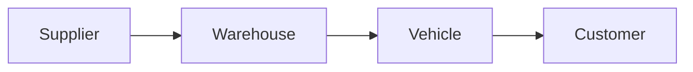

import DocumentInfo from '@site/src/components/DocumentInfo';

# نظام تصميم التوثيق

<DocumentInfo
  category="البدء"
  audience={['الأعمال', 'المنتج', 'التقنية']}
  status="Approved"
  version="1.0"
  owner="فريق المنتج"
  updated="يوليو 2026"
  readingTime="5 دقائق"
/>

## الغرض

يُرسي نظام تصميم التوثيق المعايير اللازمة لإنشاء المحتوى وصيانته ضمن مركز معرفة SCOP.

يتمثل الغرض منه في ضمان اتباع كل صفحة بنية متسقة وأسلوب كتابة موحدًا ونهجًا تنظيميًا ثابتًا. وتجعل هذه المعايير التوثيق أسهل في القراءة والتصفح والصيانة والتوسعة مع تطور منصة SCOP.

تُعد هذه الصفحة الأساس لجميع وثائق المشروع الحالية والمستقبلية.

## الأهداف

ينبغي أن يكون توثيق SCOP دائمًا:

- واضحًا وسهل الفهم
- موجّهًا نحو الأعمال قبل أن يكون تقنيًا
- متسقًا عبر جميع الأقسام
- سهل التصفح والصيانة
- مفيدًا للقراء من جانبي الأعمال والتقنية على حد سواء
- قابلًا للتوسع مع نمو المنصة

## مبادئ التوثيق

### الأعمال أولًا

اشرح الغرض من منظور الأعمال والسياق التشغيلي قبل وصف التنفيذ التقني.

ينبغي أن يفهم القراء **لماذا** توجد قدرة معينة قبل أن يتعرفوا على **كيفية** تنفيذها.

### موضوع واحد لكل صفحة

ينبغي أن تركز كل صفحة على موضوع رئيسي واحد.

عندما تبدأ صفحة في تغطية موضوعات مستقلة، انقل تلك الموضوعات إلى صفحات مخصصة واربطها من خلال الإحالات المرجعية.

### التزم بالبساطة

فضِّل الوضوح على التفاصيل غير الضرورية.

استخدم لغة مباشرة وشروحًا موجزة، واقتصر على المعلومات اللازمة لفهم الموضوع.

### التدرج في التفاصيل

ابدأ بنظرة عامة عالية المستوى.

أضف قواعد الأعمال وتدفقات العمل والتفاصيل الوظيفية ومعلومات التنفيذ التقني تدريجيًا عندما تكون ذات صلة.

### مصدر واحد للحقيقة

وثّق كل مفهوم في موضع مرجعي واحد.

ينبغي أن تربط الصفحات الأخرى بذلك المصدر بدلًا من تكرار المعلومات نفسها أو إعادة تعريفها.

### قابلية الصيانة

اكتب التوثيق بحيث يتمكن المساهمون المستقبليون من تحديثه بأمان وسرعة.

تجنب تكرار المحتوى، وتجنب تضمين معلومات يُرجّح أن تصبح قديمة ما لم تكن ضرورية.

## أسلوب الكتابة

استخدم لغة إنجليزية واضحة ومهنية.

### الأسلوب المفضل

- صيغة المبني للمعلوم
- فقرات قصيرة
- عناوين واضحة
- جمل مباشرة
- قوائم نقطية للمعلومات المجمّعة
- مصطلحات أعمال متسقة
- اختصارات معرّفة
- أمثلة عملية عندما تُحسّن الفهم

### تجنَّب

- الفقرات الطويلة أو الكثيفة
- اللغة الأكاديمية
- الصياغة الترويجية أو المبالغ فيها
- الاختصارات غير المشروحة
- المصطلحات الغامضة
- التكرار عبر الصفحات
- التفاصيل التقنية قبل سياق الأعمال

:::tip

اكتب للقارئ غير الملمّ بالموضوع لكنه يحتاج إلى فهمه بسرعة ودقة.

:::

## البنية القياسية للصفحة

ينبغي أن تستخدم معظم صفحات التوثيق البنية التالية:

```text
Page Title
Document Information
Purpose
Overview
Main Content
Business Rules or Requirements, when applicable
Related Pages
```

لا تتطلب كل صفحة جميع الأقسام. أدرج فقط الأقسام التي تقدم معلومات مفيدة.

## بطاقة معلومات المستند

يجب أن تعرض كل صفحة توثيق بطاقة `DocumentInfo` مباشرة بعد عنوان الصفحة.

تحدد البطاقة ما يلي:

| الخاصية | الغرض |
| ------------ | --------------------------------------------- |
| الفئة (Category) | مجال التوثيق الذي يحتوي الصفحة |
| الجمهور (Audience) | القراء الرئيسيون المستهدفون |
| الحالة (Status) | مستوى النضج الحالي للصفحة |
| الإصدار (Version) | إصدار المحتوى الموثق |
| المالك (Owner) | الفريق المسؤول عن صيانة الصفحة |
| آخر تحديث (Last Updated) | أحدث تحديث جوهري |
| وقت القراءة (Reading Time) | الوقت المقدّر اللازم لقراءة الصفحة |

مثال:

<DocumentInfo
  category="المنتج"
  audience={['الأعمال', 'المنتج', 'التقنية']}
  status="Approved"
  version="1.0"
  owner="فريق المنتج"
  updated="يوليو 2026"
  readingTime="8 دقائق"
/>

## معايير التسمية

استخدم مصطلحًا واحدًا معتمدًا بشكل متسق لكل مفهوم من مفاهيم الأعمال.

| المصطلح المفضل | تجنَّب |
| --------------- | ---------------------------------------------------------- |
| المركبة (Vehicle) | الشاحنة (Truck) / السيارة (Car) |
| المسار (Route) | المسلك (Path) |
| الرحلة (Trip) | المهمة (Mission) |
| المستودع (Warehouse) | المخزن (Store) |
| الشحنة (Shipment) | الطرد (Package) |
| أمر التوصيل (Delivery Order) | التوصيل (Delivery) |
| أمر الشراء (Purchase Order) | مستند PO (PO Document) |
| نطاق الأعمال (Business Domain) | الوحدة (Module)، عند وصف بنية الأعمال |
| محرك القرار (Decision Engine) | نظام الذكاء الاصطناعي (AI System)، عند الإشارة إلى قدرة اتخاذ القرار الأوسع |

:::warning

لا تُدخل اسمًا جديدًا لمفهوم قائم دون مراجعة أثره عبر مركز المعرفة (Knowledge Hub) بأكمله.

:::

## العناوين

استخدم العناوين لإنشاء تسلسل هرمي واضح.

- استخدم عنوانًا واحدًا للصفحة.
- استخدم عناوين المستوى الثاني للأقسام الرئيسية.
- استخدم عناوين المستوى الثالث للأقسام الفرعية.
- تجنب مستويات العناوين الأعمق من المستوى الثالث ما لم يكن ذلك ضروريًا.
- حافظ على عناوين قصيرة ووصفية.
- لا ترقّم العناوين ما لم يكن الترقيم يُحسّن الصفحة.

## القوائم

استخدم القوائم النقطية عندما لا يكون الترتيب مهمًا.

استخدم القوائم المرقمة فقط عندما يكون التسلسل مهمًا، مثل تدفقات العمل أو خطوات التنفيذ.

حافظ على الاتساق النحوي بين عناصر القائمة.

## الجداول

استخدم الجداول للمعلومات المنظمة مثل:

- المقارنات
- قواعد الأعمال
- المصطلحات
- الأدوار والمسؤوليات
- قيم التهيئة
- مصفوفات القرار
- ملخصات المتطلبات

تجنب الجداول الواسعة جدًا، وتجنب وضع فقرات طويلة داخل خلايا الجداول.

## المخططات

استخدم المخططات عندما توصل العلاقات أو تدفقات العمل بوضوح أكبر من النص.

يُعد Mermaid التنسيق المفضل لأن المخططات تظل خاضعة للتحكم في الإصدارات وقابلة للتحرير كتعليمات برمجية.

مثال:



ينبغي أن تتسم المخططات بما يلي:

- أن يكون لها غرض واحد واضح
- أن تستخدم مصطلحات الأعمال المعتمدة
- أن تظل مقروءة دون تفاصيل مفرطة
- أن تعرض مفاهيم الأعمال قبل المكونات التقنية
- أن تتجنب تكرار النص المحيط بها

## التنبيهات (Admonitions)

استخدم تنبيهات Docusaurus بشكل انتقائي.

| النوع | الاستخدام |
| --------- | ---------------------------------------- |
| `info` | سياق أو معلومات محايدة مهمة |
| `tip` | ممارسة موصى بها |
| `warning` | خطر أو قيد أو أمر يتطلب الانتباه |
| `danger` | خطر حرج أو إجراء محظور |

لا تستخدم التنبيهات للزخرفة. استخدمها فقط عندما يستحق المحتوى تأكيدًا إضافيًا.

## الإحالات المرجعية

اربط الصفحات ذات الصلة بدلًا من تكرار محتواها.

استخدم نص ارتباط وصفيًا يخبر القارئ بما تحتويه الوجهة.

المفضل:

```md
See [Product Blueprint](../product/product-blueprint.mdx) for the product vision and scope.
```

تجنَّب:

```md
Click here.
```

يدعم Docusaurus الارتباطات بين صفحات التوثيق باستخدام مسارات الملفات أو مسارات URL.

## تسمية الملفات وعناوين URL

استخدم صيغة kebab-case بأحرف صغيرة لأسماء ملفات التوثيق ومقاطع عناوين URL.

المفضل:

```text
documentation-design-system.mdx
product-blueprint.mdx
business-architecture.mdx
vehicle-assignment.mdx
```

تجنَّب:

```text
DocumentationDesignSystem.mdx
product_blueprint.mdx
Business Architecture.mdx
```

ينبغي أن تكون أسماء الملفات واضحة وموجزة ومتوافقة مع عنوان الصفحة.

## حالة الصفحة

استخدم إحدى الحالات التالية:

| الحالة | المعنى |
| ---------- | -------------------------------------------------------------------------------- |
| Draft | المحتوى الأولي قيد التطوير |
| Review | المحتوى في انتظار التحقق من جانب الأعمال أو الجانب التقني |
| Approved | المحتوى مرجع رسمي للمشروع |
| Deprecated | المحتوى محفوظ للرجوع التاريخي ولا ينبغي أن يوجه الأعمال الجديدة بعد الآن |

لا ينبغي وضع علامة Approved على أي صفحة حتى يتحقق أصحاب المصلحة الرئيسيون من محتواها.

## إدارة الإصدارات

استخدم ترقيم إصدارات دلاليًا بسيطًا لصفحات التوثيق الفردية.

| التغيير | مثال | أثر الإصدار |
| -------------------------------------- | --------------------------------- | -------------- |
| النشر المعتمد الأولي | أول إصدار رسمي | 1.0 |
| توضيح أو إضافة طفيفة | تحسين الصياغة أو إضافة مثال | 1.1 |
| تغيير جوهري في النطاق أو البنية | مراجعة كبرى للعملية أو البنية المعمارية | 2.0 |

يمثل الإصدار المحتوى الموثق، وليس إصدار برنامج Docusaurus.

## تنظيم الملفات

نظّم المحتوى وفقًا لمجال اهتمام القارئ وبنية الأعمال في المنصة.

```text
docs/
├── getting-started/
├── product/
├── business/
├── operations/
├── decision-engine/
├── ai-platform/
├── development/
└── release-notes/
```

تجنب إنشاء مجلدات فارغة ما لم تكن جزءًا من قسم توثيق مخطط له بشكل فوري.

## قائمة التحقق للمراجعة

قبل نشر صفحة أو اعتمادها، تأكد مما يلي:

- أن الغرض من منظور الأعمال واضح.
- أن الصفحة تغطي موضوعًا رئيسيًا واحدًا.
- أن المصطلحات متسقة.
- أن المحتوى موجز وخالٍ من التكرار.
- أن بطاقة `DocumentInfo` مكتملة.
- أن العناوين تتبع تسلسلًا هرميًا واضحًا.
- أن الجداول والمخططات تُحسّن الفهم.
- أن الارتباطات الداخلية صالحة.
- أن الصفحة تُبنى بنجاح.
- أن الحالة والإصدار دقيقان.

## الصفحات ذات الصلة

- مخطط المنتج (Product Blueprint)
- بنية الأعمال (Business Architecture)
