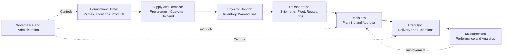
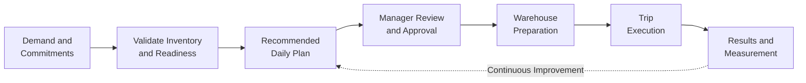
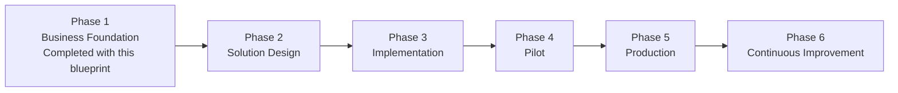

import DocumentInfo from '@site/src/components/DocumentInfo';

# المخطط التنفيذي

<DocumentInfo
  category="البدء"
  audience={['تنفيذي', 'أعمال', 'منتج']}
  status="Review"
  version="1.0"
  owner="راعي المنتج"
  updated="يوليو 2026"
  readingTime="10 دقائق"
/>

## الملخص التنفيذي

SCOP — منصة تشغيل سلسلة الإمداد (Supply Chain Operating Platform) — هي المنصة الموحدة للشركة لإدارة المشتريات والتخزين والمخزون والنقل والتوزيع لسلاسل المطاعم وعملاء خدمات الأغذية متعددي الفروع.

تعتمد هذه الأنشطة اليوم على أدوات منفصلة، وتنسيق يدوي، وخبرات فردية. ويتطلب التخطيط ليوم تشغيلي واحد الموازنة اليدوية بين التزامات العملاء، والمخزون، وجاهزية المستودعات، والمركبات، والسائقين، والمسارات. والنتيجة هي طاقة استيعابية غير مستغلة للمركبات، ورحلات كان يمكن تجنبها، وتسليمات متأخرة، وقرارات لا يمكن تفسيرها أو قياسها بعد وقوعها.

تستبدل SCOP هذا التشتت ببيئة تشغيل واحدة منسقة. فتصبح كل حركة للبضائع — من المورّد إلى المستودع إلى فرع العميل — عملية مخططة ومعتمدة ومنفذة ومقاسة. توصي المنصة بالخطة اليومية؛ ويقوم المديرون المخوّلون بمراجعتها وتعديلها واعتمادها؛ وتعود نتائج التنفيذ إلى المنصة بحيث يمكن تقييم كل قرار وتحسينه.

ويمكن تلخيص رؤية التشغيل المستقبلية ببساطة: كل حركة تبدأ بقرار، وكل قرار يبدأ ببيانات موثوقة.

## الرؤية

صُممت SCOP لتصبح منصة تشغيل ذكية لسلسلة الإمداد — لا مجرد تخصيص تقليدي لنظام تخطيط موارد المؤسسات (ERP).

فتخصيص نظام ERP يؤتمت مستندات فردية، بينما منصة التشغيل تنسّق الدورة اليومية بأكملها: الطلب، والإمداد، والمخزون، والمستودعات، والأسطول، والمسارات، والرحلات، والتزامات العملاء، مترابطةً بقواعد صريحة وقرارات قابلة للتفسير.

تتطور الرؤية طويلة المدى على مراحل. أولاً، تمنح المنصة الأعمال رؤية واحدة موثوقة وخطة يومية واحدة منسقة. ثم تكتسب الثقة بتفسير توصياتها وقياس نتائجها. وأخيراً، حيثما تسمح الجودة والحوكمة، تتولى تلقائياً القرارات المعتمدة منخفضة المخاطر — دائماً ضمن الحدود التي تحددها الأعمال، ودائماً تحت مساءلة بشرية.

## تحديات الأعمال

تعالج SCOP تحديات تشغيلية تتنامى مع كل عميل وفرع ومركبة ومستودع جديد:

- عمليات مشتتة: يُخطط للمشتريات والتخزين والنقل بشكل منفصل رغم اعتماد بعضها على بعض.
- تخطيط غير مترابط: تعيش الخطة اليومية في جداول البيانات والمكالمات الهاتفية والذاكرة الفردية.
- رؤية محدودة: لا تستطيع الإدارة رؤية الطلب والجاهزية والطاقة الاستيعابية والالتزامات في مكان واحد.
- قرارات يدوية: يعتمد إسناد المركبات والتجميع وتحديد المسارات على الاجتهاد الفردي دون دعم للقرار.
- ضعف استغلال الموارد: تعمل المركبات دون طاقتها الاستيعابية، وتستنزف الرحلات غير الضرورية التكاليف.
- تنفيذ تفاعلي: تُكتشف المشكلات أثناء التسليم بدلاً من التنبؤ بها قبل الانطلاق.
- تقارير غير متسقة: يُقاس الأداء بطرق مختلفة لدى فرق مختلفة، فلا يمكن مقارنة النتائج أو الوثوق بها.

## الأهداف الاستراتيجية

| الهدف | كيف يبدو النجاح |
| --- | --- |
| منصة تشغيل واحدة | منصة واحدة تنسّق المشتريات والتخزين والمخزون والأسطول والتوزيع |
| توحيد صنع القرار | تتبع القرارات التشغيلية القواعد والبيانات ومسار الاعتماد نفسه كل يوم |
| تخطيط ذكي | تُولَّد خطة يومية موصى بها وتُراجَع وتُعتمَد — لا تُبنى يدوياً |
| رؤية شاملة من البداية إلى النهاية | الطلب والمخزون والجاهزية والطاقة الاستيعابية والتنفيذ مرئية في مكان واحد |
| التميز في خدمة العملاء | تُخطَّط التزامات التسليم والنوافذ الزمنية وتُحمى، لا يُكتفى بتمنّي تحققها |
| تحسين المستودعات | يُنسَّق الانتقاء والتجهيز والتحميل والعبور المباشر (cross-docking) مع خطة النقل |
| تحسين النقل | تتحسن الطاقة الاستيعابية للمركبات والتجميع وتحديد المسارات بشكل قابل للقياس |
| عمليات مدعومة بالذكاء الاصطناعي | تدعم التنبؤات والتوصيات الأشخاص؛ ويبقى الأشخاص هم المساءلون |
| بنية أعمال قابلة للتوسع | لا يتطلب النمو في العملاء والفروع والمركبات نمواً متناسباً في جهد التخطيط |

## النطاق

تغطي SCOP الدورة التشغيلية الكاملة:

| المجال | التغطية |
| --- | --- |
| الوارد | أوامر الموردين وعمليات التجميع والاستلامات المتوقعة |
| التخزين | الاستلام والتخزين والانتقاء والتجهيز والتحميل والعبور المباشر |
| المخزون | التوافر والتخصيص والملكية — بما في ذلك البضائع المملوكة للعملاء |
| النقل | الشحنات والحمولات والرحلات متعددة المحطات وعمليات الاستلام والتسليم |
| التخطيط | خطة يومية واحدة منسقة ومُراجَعة ومعتمدة |
| الأسطول | المركبات والسائقون والطاقة الاستيعابية والتوافر |
| التحليلات | مقاييس موثوقة للخدمة والتكلفة والاستغلال والموثوقية |
| دعم القرار | توصيات قابلة للتفسير مع اعتماد بشري |
| الذكاء الاصطناعي | تنبؤات وتقديرات ومؤشرات مخاطر خاضعة للحوكمة |
| الحوكمة | الملكية والقواعد والصلاحيات والتدقيق عبر المنصة |

## نطاقات الأعمال

تنتظم SCOP في ثلاثة عشر نطاق أعمال، لكل منها مسؤولية واضحة ومالك واحد مساءل — بدءاً من البيانات التأسيسية، مروراً بالإمداد والطلب، والتحكم المادي، والنقل، وصولاً إلى القرارات والتنفيذ والقياس والحوكمة.

نموذج النطاقات الكامل معرَّف في [نطاقات الأعمال](../business/business-domains.mdx).

## كائنات الأعمال

كل كيان أعمال في SCOP — العميل، والمنتج، والمستودع، والشحنة، والمركبة، والرحلة، والقرار — هو كائن أعمال معياري له مالك مرجعي واحد، وهوية ثابتة، ودورة حياة محكومة، وقابلية تتبع كاملة.

يعني هذا الانضباط أن الحقيقة الواحدة لا تُحفظ أبداً في نسختين متعارضتين: فملكية المخزون، والتزامات العملاء، وسجل القرارات، لكل منها موطن واحد بالضبط.

الفهرس الكامل معرَّف في [كائنات الأعمال](../business/business-objects.mdx).

## قواعد الأعمال

تحوّل SCOP سياسات الأعمال إلى قواعد صريحة قابلة للاختبار: من يجوز له اعتماد الخطة، ومتى تكون المركبة مؤهلة، وأي المنتجات يجوز نقلها معاً، ومتى تكون النافذة الزمنية إلزامية.

للقواعد الصريحة أهمية للأعمال لأنها تضمن معالجة الحالات المتشابهة بالطريقة نفسها، وتجعل كل قرار قابلاً للتفسير، وتمنع بقاء السياسات الحرجة في الذاكرة الفردية أو في سلوك خفي للنظام. ولكل قاعدة مالك، ودرجة خطورة، وسياسة استثناء محكومة، وسجل إصدارات.

الإطار معرَّف في [قواعد الأعمال](../business/business-rules.mdx).

## نموذج التشغيل

تحوّل دورة التشغيل اليومية الطلب المُتحقق منه إلى حركات معتمدة ومنفذة ومقاسة:

كل مرحلة محكومة: يجب أن يكون الطلب صحيحاً قبل التخطيط، ويجب اعتماد الخطط قبل الإفراج عنها، وتُسجَّل النتائج الفعلية دائماً وتُقارن بالخطة.

النموذج الكامل معرَّف في [نموذج تشغيل سلسلة الإمداد](../operations/supply-chain-operating-model.mdx).

## محرك القرار

محرك قرار سلسلة الإمداد (Decision Engine) هو القدرة التي تحوّل البيانات التشغيلية إلى إجراءات موصى بها: أي مركبة، وأي سائق، وأي مسار، وأي الشحنات تُجمَّع، وأي طلب لا يمكن خدمته اليوم — مع بيان السبب.

بالنسبة للتنفيذيين، تُعرِّفه ستة التزامات:

- الغاية: خطة يومية واحدة منسقة وقابلة للتنفيذ ومجدية بدلاً من قرارات يدوية مشتتة.
- القدرات: الأهلية، والتجميع، والإسناد، وتحديد المسارات، والجدولة، وترتيب الأولويات.
- الاعتماد البشري: لا تُطلق التوصيات إلا بعد مراجعة مخوّلة — يبقى المدير هو المتحكم.
- التحسين: يوازن المحرك بين الخدمة والاستغلال والتكلفة ضمن الأولويات المعتمدة.
- القيود: الحدود الإلزامية — الطاقة الاستيعابية، والملكية، والمؤهلات، والنوافذ الزمنية — لا يُتنازل عنها أبداً مقابل التوفير.
- قابلية التفسير والحوكمة: كل توصية تبيّن أسبابها، ويُسجَّل كل اعتماد وتغيير ونتيجة.

التعريف الكامل في [محرك قرار سلسلة الإمداد](../decision-engine/supply-chain-decision-engine.mdx).

## الذكاء الاصطناعي

يحسّن الذكاء الاصطناعي في SCOP القرارات دون إلغاء المساءلة:

- التنبؤ: أزمنة الانتقال، وتقديرات الوصول، ومدد الخدمة، وجاهزية المستودعات.
- التوقعات: متطلبات الطلب والطاقة الاستيعابية، دعماً لتخطيط المشتريات والأسطول.
- كشف المخاطر: تحديد مخاطر التأخر في التسليم والإخفاق قبل الانطلاق لا بعده.
- التوصيات: ذكاء يدعم مقترحات محرك القرار (Decision Engine).
- التعلم المستمر: الفروق بين الخطة والواقع تحسّن التقديرات المستقبلية.
- حدود الأعمال: لا يتجاوز الذكاء الاصطناعي أبداً القواعد الإلزامية أو الملكية أو حدود الطاقة الاستيعابية.
- الإشراف البشري: تتطلب التوصيات المهمة اعتماداً بشرياً؛ ولا تتوسع الأتمتة إلا بخطوات صريحة ومقاسة ومحكومة.

التعريف الكامل في [نظرة عامة على منصة الذكاء الاصطناعي (AI Platform)](../ai-platform/ai-platform-overview.mdx).

## نموذج الحوكمة

تُحكم SCOP بالملكية على كل مستوى:

| مجال الحوكمة | المعنى |
| --- | --- |
| ملكية الأعمال | لكل نطاق وقدرة مالك أعمال مساءل |
| ملكية البيانات | لكل كائن أعمال مرجعي وتعريف مالك بيانات مسمّى |
| ملكية القواعد | لكل قاعدة أعمال مالك ومسار اعتماد وسجل إصدارات |
| ملكية القرارات | كل إفراج تشغيلي يُقتفى أثره إلى اعتماد بشري مخوَّل |
| الأمن | وصول بالحد الأدنى من الامتيازات، وإنفاذ من جانب الخادم، وأدلة تدقيق محمية |
| الحوكمة التنفيذية | يُعتمد التوجه والأولويات ومستويات الأتمتة والتغييرات الكبرى على المستوى التنفيذي |

## المنافع التجارية المتوقعة

| مجال المنفعة | المنافع المتوقعة |
| --- | --- |
| تشغيلية | تخطيط يومي منسق، واستغلال أعلى للمركبات، ورحلات غير ضرورية أقل، وانتظار أقل في المستودعات |
| مالية | تكلفة أقل لكل تسليم، واستغلال أفضل للأصول القائمة قبل أي استثمار جديد، وخسائر أقل من التسليمات المتعثرة |
| العملاء | نوافذ زمنية محمية، والتزامات موثوقة، وخدمة أسرع وأدق لكل فرع |
| استراتيجية | القدرة على النمو في العملاء والفروع دون نمو متناسب في كوادر التخطيط |
| تقنية | منصة واحدة محكومة بدلاً من أدوات مشتتة؛ أساس Odoo 17 مع امتدادات محكومة |
| جودة القرار | قرارات قابلة للتفسير ومتسقة وقابلة للقياس تتحسن من النتائج الفعلية |

والمقارنة مع التشغيل الحالي مباشرة:

| اليوم | مع SCOP |
| --- | --- |
| خطط تُبنى يدوياً كل صباح | خطة موصى بها جاهزة للمراجعة والاعتماد |
| تحميل المركبات بالخبرة | التحقق من الطاقة الاستيعابية على كل بُعد، في كل رحلة |
| مشكلات تُكتشف أثناء التسليم | مخاطر تُحدَّد قبل الانطلاق |
| قرارات تُفسَّر من الذاكرة | كل قرار مسجَّل مع أسبابه |
| تقارير تُجمَّع يدوياً | مقاييس موثوقة تُنتَج من السجلات التشغيلية |

## مقاييس النجاح

سيُتابع الأداء التنفيذي من خلال مجموعة صغيرة من مؤشرات الأداء الرئيسية (KPIs):

| المؤشر التنفيذي | ما يقيسه |
| --- | --- |
| OTIF (On Time, In Full) | التسليمات المكتملة ضمن النافذة الزمنية والكمية الملتزم بهما |
| Inventory Accuracy | التطابق بين المخزون المسجَّل والمخزون الفعلي، بحسب المالك |
| Vehicle Utilization | استغلال الطاقة الاستيعابية المتاحة للمركبات عبر الأسطول |
| Warehouse Productivity | الجاهزية وأداء التحميل والتأخيرات الناجمة عن المستودعات |
| Planning Time | الوقت من موعد إقفال الطلب إلى خطة يومية معتمدة |
| Decision Quality | معدل قبول التوصيات، ومعدل التجاوز، وأداء النتائج |
| Forecast Accuracy | موثوقية تنبؤات الطلب والوصول |
| Order Cycle Time | الوقت من الطلب المُتحقق منه إلى التسليم المؤكد |

تخضع الصيغ الدقيقة والمستهدفات لحوكمة نطاق الأداء والتحليلات.

## خارطة الطريق المستقبلية

| المرحلة | التركيز |
| --- | --- |
| المرحلة 1 — أساس الأعمال | الرؤية، والبنية، والنطاقات، والكائنات، والقواعد، ونموذج التشغيل، واستراتيجية القرار والذكاء الاصطناعي — هذه الوثائق |
| المرحلة 2 — تصميم الحل | مواصفات وظيفية وتقنية تترجم تعريف الأعمال المعتمد |
| المرحلة 3 — التنفيذ | بناء وتهيئة محكومان على أساس Odoo 17 |
| المرحلة 4 — التشغيل التجريبي | تشغيل حي محدود بمستودعات وعملاء ومسارات مختارة |
| المرحلة 5 — الإنتاج | طرح تشغيلي كامل تحت حوكمة الإصدارات |
| المرحلة 6 — التحسين المستمر | تحسين مُقاس وتوسّع محكوم في الأتمتة |

تصف خارطة الطريق الاتجاه؛ أما التواريخ والموارد فتُعتمد بشكل منفصل من خلال حوكمة المشروع.

## مبادئ المشروع

- الأعمال أولاً: كل قدرة توجد من أجل نتيجة أعمال محددة.
- التهيئة قبل التخصيص: تُستخدم القدرات القياسية قبل كتابة برمجيات مخصصة.
- الذكاء الاصطناعي يساعد البشر: الذكاء يدعم القرارات؛ والأشخاص المخوّلون يعتمدونها.
- قابلية التتبع: كل التزام وقرار ونتيجة يمكن تتبعها وتفسيرها.
- قابلية التوسع: تنمو المنصة مع الأعمال دون إعادة تصميم.
- الأمن بالتصميم: الوصول والاعتماد والتدقيق مبنية في الأساس، لا تُضاف لاحقاً.
- مصدر واحد للحقيقة: لكل حقيقة مهمة موطن مرجعي واحد.

## خارج النطاق

يستثني هذا المخطط — والاعتماد الذي يطلبه — عن قصد ما يلي:

- تفاصيل التنفيذ
- التصميم التقني
- مواصفات الوحدات
- هياكل قواعد البيانات
- واجهات برمجة التطبيقات (APIs)
- الشيفرة المصدرية
- النشر
- البنية التحتية
- الاختبار

فهذه تعود إلى مرحلتي تصميم الحل والهندسة اللتين تليان الاعتماد.

## نطاق الاعتماد

الاعتماد التنفيذي لهذا المخطط يؤكد:

- الرؤية وتوجه المنتج
- بنية الأعمال
- نطاقات الأعمال
- كائنات الأعمال
- إطار قواعد الأعمال
- نموذج تشغيل سلسلة الإمداد
- منهج محرك القرار (Decision Engine)
- استراتيجية الذكاء الاصطناعي وحدودها
- نموذج الحوكمة
- توجه المنتج وشكل خارطة الطريق

الاعتماد التنفيذي لا يعتمد:

- التنفيذ التقني
- تقديرات التطوير
- البنية التحتية
- تنفيذ الميزانية
- اختيار المورّدين
- جدول التنفيذ
- القرارات الهندسية التفصيلية

ستُطلب هذه القرارات بشكل منفصل، مع أدلتها الخاصة، خلال المراحل اللاحقة.

## القرار التنفيذي

| الدور | الاسم | التوقيع | التاريخ | القرار |
| --- | --- | --- | --- | --- |
| الرئيس التنفيذي | | | | معتمد / معتمد مع ملاحظات / غير معتمد |
| مدير العمليات | | | | معتمد / معتمد مع ملاحظات / غير معتمد |
| رئيس سلسلة الإمداد | | | | معتمد / معتمد مع ملاحظات / غير معتمد |
| راعي المنتج | | | | معتمد / معتمد مع ملاحظات / غير معتمد |
| مدير المشروع | | | | معتمد / معتمد مع ملاحظات / غير معتمد |

تصبح الملاحظات والشروط المسجَّلة مع أي قرار جزءاً من خط الأساس المعتمد.

## الوثائق ذات الصلة

- [نظام تصميم الوثائق](./documentation-design-system.mdx)
- [مخطط المنتج](../product/product-blueprint.mdx)
- [بنية الأعمال](../business/business-architecture.mdx)
- [نطاقات الأعمال](../business/business-domains.mdx)
- [كائنات الأعمال](../business/business-objects.mdx)
- [قواعد الأعمال](../business/business-rules.mdx)
- [نموذج تشغيل سلسلة الإمداد](../operations/supply-chain-operating-model.mdx)
- [محرك قرار سلسلة الإمداد](../decision-engine/supply-chain-decision-engine.mdx)
- [نظرة عامة على منصة الذكاء الاصطناعي](../ai-platform/ai-platform-overview.mdx)
- [نظرة عامة على التطوير](../development/development-overview.mdx)
- [إدارة الإصدارات](../release-notes/release-management.mdx)

## البيان التنفيذي الختامي

اكتمل تعريف الأعمال والمنتج لمنصة SCOP.

توجد الآن إحدى عشرة وثيقة محكومة تحدد ما هي SCOP، ولماذا وُجدت، وكيف تعمل، ومن يملك كل جزء منها، وكيف سيُقاس نجاحها — بلغة الأعمال، تحت نظام تصميم واحد، مع بيان صريح لكل نطاق وكائن وقاعدة وقرار وحدّ.

المشروع جاهز للانتقال إلى مرحلة تصميم الحل.

لا ينبغي أن يبدأ أي تنفيذ قبل الاعتماد التنفيذي لهذا المخطط. فالاعتماد يرسّخ خط الأساس التجاري الذي يجب أن تخدمه جميع الأعمال اللاحقة؛ والبدء في الهندسة قبل تثبيت هذا الأساس سيعيد بناء التشتت ذاته الذي وُجدت SCOP لإزالته، وبتكلفة أعلى.

بعد الاعتماد، تصبح مواصفة تصميم الحل هي المرجع المعتمد للمرحلة الهندسية. وستترجم تعريف الأعمال المعتمد هذا إلى مواصفات وظيفية وتقنية — وستُقاس على هذا المخطط، لا العكس.

وعد SCOP للأعمال منضبط وبسيط: كل حركة مخططة، وكل قرار مفسَّر، وكل نتيجة مقاسة، وكل تحسين مكتسب من الأدلة.
