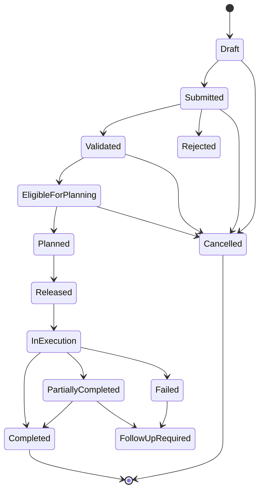
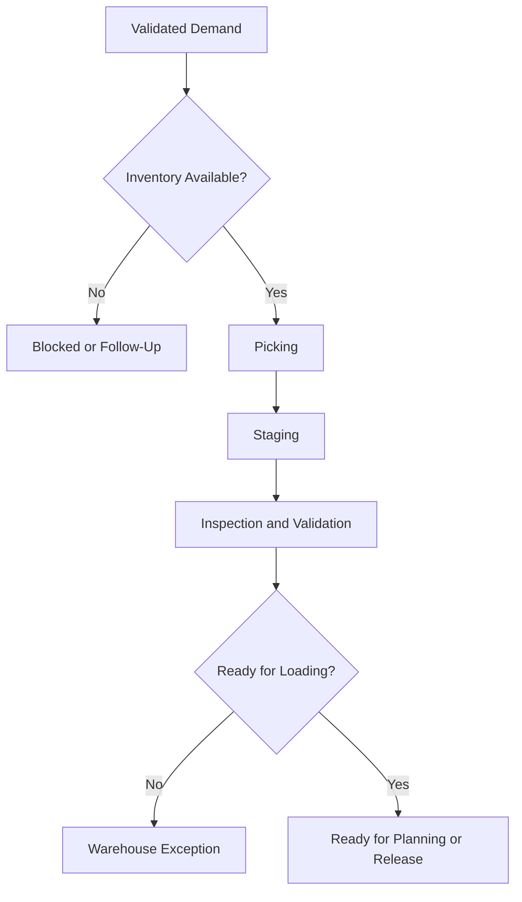
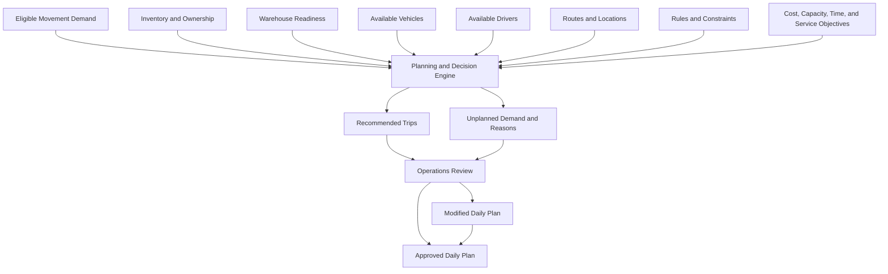
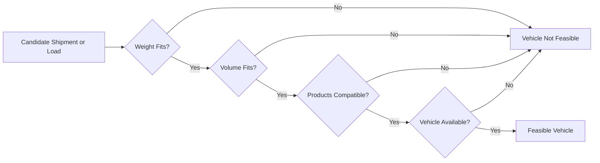
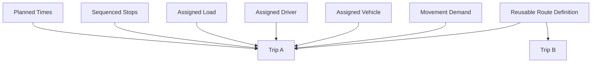
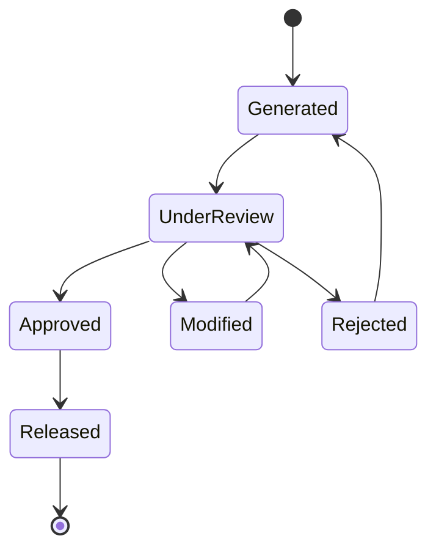
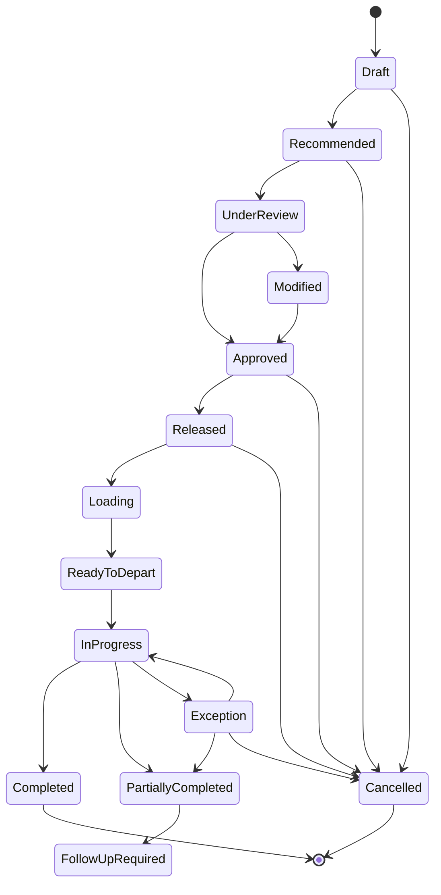
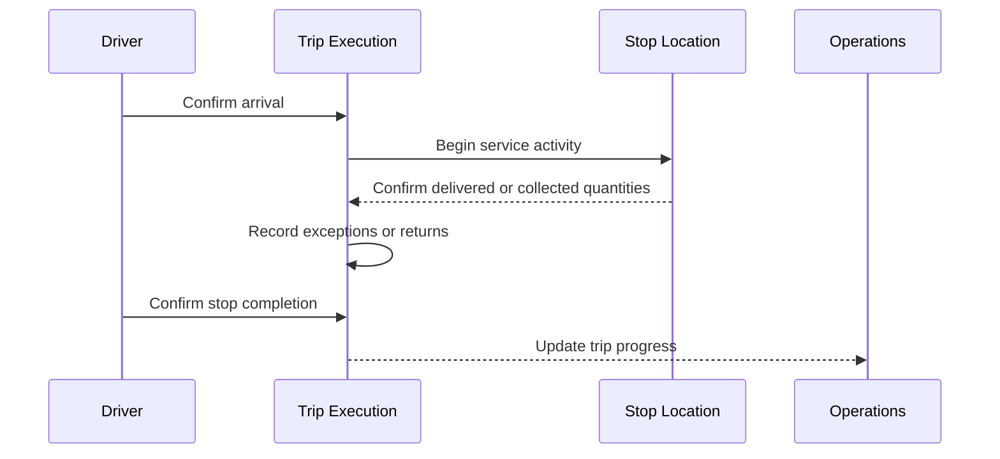
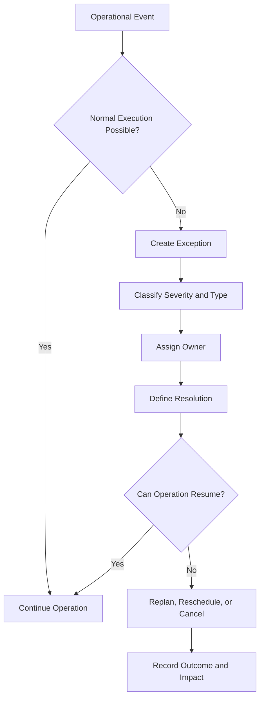

import DocumentInfo from '@site/src/components/DocumentInfo';

# النموذج التشغيلي لسلسلة التوريد

<DocumentInfo
  category="العمليات"
  audience={['الأعمال', 'العمليات', 'المنتج', 'التقنية']}
  status="Approved"
  version="1.0"
  owner="فريق العمليات"
  updated="يوليو 2026"
  readingTime="14 دقيقة"
/>

## الغرض

يحدد النموذج التشغيلي لسلسلة التوريد كيفية قيام SCOP (منصة تشغيل سلسلة التوريد) بتنسيق أنشطة سلسلة التوريد بدءًا من إنشاء المتطلب التشغيلي، مرورًا بالتخطيط والاعتماد والتنفيذ والإكمال، وانتهاءً بقياس الأداء.

ويوفر النموذج إطار عمل تشغيليًا مشتركًا لكل مما يلي:

- المشتريات
- طلب العملاء والطلب الداخلي (Demand)
- توافر المخزون
- عمليات المستودعات
- العبور المستودعي (Cross-Docking)
- توافر المركبات والسائقين
- تخطيط المسارات (Route) والرحلات (Trip)
- تنفيذ أنشطة الاستلام (Pickup) والتسليم (Delivery)
- الاستثناءات والمرتجعات
- قياس الأداء

يصف النموذج الطريقة التي ينبغي أن تعمل بها الأعمال بمعزل عن تفاصيل الشاشات أو الكود المصدري أو جداول قواعد البيانات أو تهيئة Odoo (منصة تخطيط موارد المؤسسات).

## أهداف النموذج التشغيلي

صُمم النموذج التشغيلي لضمان ما يلي:

- دخول جميع طلبات الحركة (Demand) في عملية تشغيلية محكومة.
- التحقق من جاهزية المخزون والمستودعات قبل تخطيط النقل.
- إسناد المركبات والسائقين دون تعارض في الموارد.
- احترام سعة المركبات والنوافذ الزمنية (Time Window) الخاصة بالعملاء.
- إمكانية مشاركة عدة شحنات (Shipment) متوافقة في الرحلة (Trip) نفسها.
- إمكانية تنفيذ أنشطة Pickup وDelivery ضمن الرحلة نفسها.
- دعم حركات Cross-Dock والحركات بين المستودعات.
- بقاء التوصيات المدعومة بالذكاء الاصطناعي (AI) خاضعة لاعتماد بشري مُخوَّل.
- تسجيل نتائج التنفيذ الفعلية ومقارنتها بالخطة المعتمدة.
- تحديد الاستثناءات وإسناد ملكيتها وحلها وقياسها.
- تحويل البيانات التشغيلية إلى مصدر للتحسين المستمر.

## دورة التشغيل من البداية إلى النهاية

تبدأ دورة تشغيل SCOP عند إنشاء متطلب صالح لسلسلة التوريد، وتنتهي عند تأكيد نتائج التنفيذ وقياسها.

```mermaid
flowchart LR
    Demand[Operational Demand] --> Validation[Demand Validation]
    Validation --> Supply[Supply and Inventory Validation]
    Supply --> Readiness[Warehouse Readiness]
    Readiness --> Planning[Daily Planning]
    Planning --> Review[Manager Review]
    Review --> Approval[Plan Approval]
    Approval --> Preparation[Warehouse and Resource Preparation]
    Preparation --> Execution[Trip Execution]
    Execution --> Completion[Completion and Confirmation]
    Completion --> Measurement[Performance Measurement]
    Measurement -. Improvement Feedback .-> Planning
```

المراحل التشغيلية الرئيسية هي:

1. إنشاء الطلب
2. التحقق من صحة الطلب
3. التحقق من التوريد والمخزون
4. جاهزية المستودع
5. التخطيط اليومي
6. مراجعة الخطة واعتمادها
7. التحضير التشغيلي
8. تنفيذ الرحلة
9. الإكمال والتأكيد
10. قياس الأداء والتحسين

## الطلب التشغيلي (Operational Demand)

يمثل الطلب التشغيلي متطلبًا لنقل المنتجات من موقع إلى آخر.

قد ينشأ الطلب من:

- طلب عميل
- طلب إعادة تزويد لفرع عميل
- متطلب مشتريات
- متطلب تجميع من مورد
- متطلب إعادة تزويد مستودع
- تحويل بين المستودعات
- حركة مخزون مملوك للعميل
- طلب Pickup من عميل
- حركة إرجاع
- طلب تشغيلي عاجل أو استثنائي

يجب أن يحدد كل متطلب حركة، كحد أدنى، ما يلي:

| المعلومة | الوصف |
| --- | --- |
| نوع الطلب | Delivery أو Pickup أو تحويل أو إرجاع أو تجميع أو نوع آخر معتمد |
| موقع المصدر | الموقع الذي يجب أن تنتقل منه المنتجات |
| موقع الوجهة | موقع الاستقبال المطلوب |
| العميل أو المالك | الطرف المرتبط بالمنتجات أو المالك لها |
| المنتجات والكميات | البضائع المشمولة في الحركة |
| التاريخ المطلوب | تاريخ التنفيذ المطلوب أو الملتزم به |
| النافذة الزمنية (Time Window) | فترة الخدمة المسموح بها حيثما ينطبق ذلك |
| الأولوية | الأهمية التشغيلية للمتطلب |
| متطلبات المناولة | درجة الحرارة أو القابلية للكسر أو التوافق أو غير ذلك من القيود |
| الحالة | الموضع الحالي للطلب ضمن دورة حياته |

يجب أن يكون الطلب مكتملًا وصالحًا قبل أن يصبح مؤهلًا للتخطيط.

## دورة حياة الطلب

يجب أن يخضع كل انتقال في الحالة لقواعد تحقق وتفويض محددة.

## التحقق من التوريد والمخزون

قبل إمكانية تخطيط أي حركة، يجب أن تحدد SCOP ما إذا كانت المنتجات المطلوبة متوفرة أو من المتوقع أن تصبح متوفرة.

قد يشمل التحقق:

- الكمية المتاحة
- الكمية المحجوزة
- الكمية المتوقعة
- ملكية المنتج
- موقع المستودع
- متطلبات اللوت (Lot) أو الدفعة (Batch)
- قيود انتهاء الصلاحية
- شروط المناولة
- الاستلام المتوقع من المورد
- المخزون المتوقع المقدم من العميل
- التخصيص القائم لشحنة (Shipment) أخرى
- متطلبات تحويل المخزون

يجب أن تصنف النتيجة الطلب على النحو التالي:

| النتيجة | المعنى |
| --- | --- |
| Ready (جاهز) | المنتجات المطلوبة متاحة للتحضير التشغيلي |
| Conditionally Ready (جاهز بشروط) | من المتوقع أن تصبح المنتجات متاحة قبل التنفيذ |
| Partially Ready (جاهز جزئيًا) | جزء فقط من الكمية المطلوبة متاح |
| Not Ready (غير جاهز) | الكمية المطلوبة غير متاحة |
| Blocked (محظور) | مشكلة في البيانات أو الجودة أو الملكية أو التشغيل تمنع التخطيط |

ينبغي ألا يدخل عملية التخطيط اليومي الاعتيادية إلا الطلب المؤهل.

## ملكية المخزون

يجب أن تميز SCOP بين الموقع المادي وملكية المخزون.

قد يعود المخزون المخزَّن في المستودع نفسه إلى:

- الشركة المشغلة
- عميل محدد
- مورد بموجب ترتيب معتمد
- طرف تجاري آخر مخوَّل

يجب أن تظل ملكية المخزون قابلة للتتبع عبر:

- الاستلام
- التخزين
- الحركة الداخلية
- الانتقاء (Picking)
- التجهيز المرحلي (Staging)
- التحميل
- النقل
- التسليم
- الإرجاع
- التسوية

يجب عدم خلط المخزون المملوك للعميل منطقيًا مع المخزون المملوك للشركة حتى عند تخزين كليهما داخل المنشأة المادية نفسها.

## جاهزية المستودع

تؤكد جاهزية المستودع ما إذا كان بإمكان المنتجات والموارد التشغيلية دعم الحركة المقترحة.

قد يشمل فحص جاهزية المستودع:

- توافر المخزون
- اكتمال الانتقاء
- فحص المنتجات
- اكتمال التجهيز المرحلي
- جاهزية التغليف
- توافر منطقة التحميل
- توافر معدات التحميل
- المستندات المطلوبة
- جاهزية Cross-Dock
- اكتمال التحويل
- قيود مناولة المنتجات
- المدة التقديرية للتحميل

ينبغي أن تكون جاهزية المستودع مرئية لفريقي التخطيط والعمليات.

## النموذج التشغيلي للعبور المستودعي (Cross-Dock)

يتيح Cross-Docking مرور المنتجات عبر مستودع أو منشأة لوجستية دون تخزين طويل الأمد غير ضروري.

قد تكون حركة Cross-Dock مناسبة عندما:

- تكون المنتجات مخصصة بالفعل لمتطلب صادر.
- تكون الرحلة الصادرة متوقعة ضمن الحد الزمني المعتمد.
- يمكن إكمال متطلبات فحص المنتجات ومناولتها.
- يكون توقيت الوارد والصادر متوافقًا تشغيليًا.
- تتوفر مساحة تجهيز مرحلي مؤقتة.
- تظل ملكية المنتجات وقابليتها للتتبع واضحتين.
- تقلل الحركة من المناولة أو زمن التخزين أو التكلفة التشغيلية.

قد يكون استخدام Cross-Dock:

- محددًا يدويًا من قبل مستخدم مخوَّل
- مولَّدًا كتوصية تخطيط
- مختارًا وفقًا لقواعد أعمال معتمدة

يجب أن توضح توصيات Cross-Dock التوقيت والسعة والفوائد التشغيلية الداعمة للقرار.

## التحويلات بين المستودعات

يجب أن تدعم SCOP حركات المنتجات بين المستودعات التي تديرها الشركة.

قد يكون التحويل بين المستودعات مطلوبًا من أجل:

- إعادة موازنة المخزون
- دعم طلب العملاء
- توحيد التوزيع الصادر
- نقل المنتجات إلى مواقع أقرب إلى وجهاتها
- حل قيود السعة
- دعم عمليات Cross-Dock
- التحضير للطلب المتوقع
- الاستجابة لاستثناء تشغيلي

يجب تمثيل التحويلات كطلب حركة محكوم وإدراجها في تخطيط النقل عندما تكون رحلة مركبة مطلوبة.

يجوز أن يتشارك التحويل رحلة واحدة مع أنشطة Pickup أو Delivery متوافقة عند استيفاء جميع قيود الأعمال.

## دورة التخطيط اليومي

يحوِّل التخطيط اليومي طلب الحركة المؤهل إلى خطة تشغيلية منسقة.

تقيِّم دورة التخطيط:

- الطلب المؤهل
- توافر المنتجات
- جاهزية المستودعات
- مواقع Pickup وDelivery
- التواريخ المطلوبة
- النوافذ الزمنية للعملاء
- الأولويات
- توافق الشحنات
- توافر المركبات
- سعة المركبات
- توافر السائقين
- توافر المسارات (Route)
- مدة التنقل والخدمة
- فرص Cross-Dock
- المتطلبات بين المستودعات
- التكاليف التشغيلية
- الالتزامات المعتمدة القائمة

## أفق التخطيط

يركز النموذج التشغيلي الأولي على التخطيط اليومي.

ينبغي أن يدعم النظام:

- التخطيط لتاريخ تشغيلي محدد
- إعادة التخطيط قبل الإطلاق التشغيلي
- التغييرات المحكومة بعد الاعتماد
- رؤية الطلب المستقبلي
- تحديد حالات نقص السعة
- تحديد الطلب الذي يتعذر تخطيطه
- تسجيل أسباب الطلب غير المخطط

قد تقدم الإصدارات المستقبلية آفاق تخطيط أطول وتخطيطًا تنبؤيًا للسعة.

## تكوين الشحنات

الشحنة (Shipment) هي تجميع منطقي للمنتجات التي تتطلب النقل بين مواقع تشغيلية محددة.

يجب أن يراعي تكوين الشحنة:

- المصدر والوجهة
- العميل أو مالك المخزون
- التاريخ المطلوب
- النافذة الزمنية
- توافق المنتجات
- متطلبات المناولة
- الوزن
- الحجم
- سعة المنصات (Pallet) أو الوحدات
- الأولوية
- جاهزية المستودع
- قواعد الدمج المسموح بها

قد يُنشئ سجل طلب واحد شحنة واحدة أو أكثر.

يجوز دمج عدة سجلات طلب في شحنات أو حمولات (Load) متوافقة حيثما تسمح قواعد الأعمال بذلك.

## دمج الشحنات

يجمع دمج الشحنات متطلبات الحركة المتوافقة لتحسين استغلال المركبات والرحلات.

قد يحدث الدمج عندما تكون الشحنات:

- ذات نقاط منشأ أو نقاط تجميع متوافقة
- ذات وجهات أو تسلسلات مسار متوافقة
- ذات تواريخ خدمة ونوافذ زمنية متوافقة
- قابلة للنقل ضمن ظروف المركبة نفسها
- غير مخالفة لقواعد توافق المنتجات
- ملائمة ضمن سعة المركبة
- غير مسببة لتأخيرات غير مقبولة
- محققة لفائدة تشغيلية قابلة للقياس

يجب ألا يدمج النظام الشحنات لمجرد توافر السعة.

يجب أن يحمي الدمج أيضًا التزامات الخدمة ومتطلبات المناولة والملكية وقابلية التتبع.

## نموذج سعة المركبة

يجب أن يقيِّم إسناد المركبات جميع أبعاد السعة ذات الصلة بالعملية.

وقد تشمل هذه الأبعاد:

- الوزن الأقصى
- الحجم الأقصى
- سعة المنصات
- سعة الصناديق أو الوحدات
- سعة الحجيرات
- السعة المتحكم في درجة حرارتها
- توافق المنتجات
- سهولة الوصول للتحميل
- قيود المسار أو الموقع

تكون المركبة مجدية فقط عند استيفاء جميع القيود الإلزامية.

ينبغي أن تسجل حسابات السعة:

- السعة المخططة
- السعة المستخدمة
- السعة المتبقية
- نسبة استغلال السعة
- القيد الذي حدَّ من مواصلة التحميل

## توافر المركبات

لا يجوز اعتبار المركبة متاحة إلا عندما:

- تكون نشطة.
- لا تكون مسندة إلى رحلة متداخلة زمنيًا.
- لا تكون قيد الصيانة.
- لا تكون محظورة لأسباب تشغيلية أو قانونية.
- تلبي سعتها وتهيئتها المتطلب.
- يدعم موقعها المتوقع الانطلاق المخطط.
- تظل الوثائق المطلوبة سارية.
- يكون بإمكانها إكمال الرحلة ضمن فترة عملها المتاحة.

يجب أن يمنع النظام الإسنادات المتعارضة للمركبات.

## توافر السائقين

لا يجوز اعتبار السائق متاحًا إلا عندما:

- يكون السائق نشطًا ومخوَّلًا.
- لا يكون السائق مسندًا إلى رحلة متداخلة زمنيًا.
- تكون المؤهلات أو الرخص المطلوبة سارية.
- تُحترم متطلبات وقت العمل.
- يستطيع السائق الوصول إلى موقع الانطلاق المخطط.
- لا ينطبق عليه غياب معتمد أو حظر تشغيلي.

يجب أن يمنع النظام الإسنادات المتعارضة للسائقين.

## العلاقة بين المسار (Route) والرحلة (Trip)

المسار (Route) هو مسار تشغيلي أو هيكل جغرافي معرَّف مسبقًا وقابل لإعادة الاستخدام.

الرحلة (Trip) هي تنفيذ مؤرَّخ يتضمن موارد مسندة وشحنات ومحطات توقف (Stop) وأوقاتًا مخططة.

يجوز للرحلة أن:

- تستخدم مسارًا معرَّفًا مسبقًا
- تستخدم نسخة معدلة من مسار
- تُولَّد من تسلسل محطات مُحسَّن
- تتضمن عدة عمليات Pickup
- تتضمن عدة عمليات Delivery
- تتضمن محطات مستودعات
- تتضمن فروع عملاء
- تتضمن أنشطة Cross-Dock أو تحويل

## نموذج المحطة (Stop)

تمثل المحطة (Stop) زيارة تشغيلية واحدة خلال الرحلة.

يجب أن تحدد المحطة:

| المعلومة | الوصف |
| --- | --- |
| الموقع | المستودع أو المورد أو العميل أو الفرع أو أي موقع آخر معتمد |
| التسلسل | الترتيب المخطط ضمن الرحلة |
| النشاط | Pickup أو Delivery أو تحويل أو Cross-Dock أو إرجاع أو نشاط مختلط |
| الوصول المخطط | وقت الوصول المتوقع |
| المغادرة المخططة | وقت المغادرة المتوقع |
| النافذة الزمنية | وقت الخدمة المسموح به حيثما ينطبق |
| مدة الخدمة | الوقت المتوقع المطلوب في الموقع |
| المنتجات | البضائع المحمَّلة أو المفرَّغة أو المحوَّلة أو المرتجعة |
| الحالة | Planned أو Arrived أو Servicing أو Completed أو Failed أو Skipped |
| الأوقات الفعلية | أوقات الوصول والخدمة والمغادرة المسجلة |
| الاستثناء | أي مشكلة تؤثر في الإكمال الطبيعي |

يجوز أن تتضمن محطة واحدة أنشطة تفريغ وتحميل معًا عندما يكون ذلك صالحًا تشغيليًا.

## الاستلام والتسليم ضمن الرحلة نفسها

يجب أن تدعم SCOP الرحلات التي تحتوي على أنشطة Pickup وDelivery معًا.

ومن الأمثلة على ذلك:

- تسليم منتجات إلى فرع وتجميع المرتجعات
- التجميع من مورد قبل التسليم إلى العملاء
- تسليم منتجات عميل وتجميع منتجات لإعادة التوزيع
- تحويل بضائع بين المستودعات أثناء إكمال تسليمات العملاء
- التجميع من موقع مركزي لعميل قبل التوزيع على الفروع

يجب أن يحافظ تسلسل المحطات على:

- جدوى سعة المركبة طوال الرحلة
- قابلية تتبع ملكية المنتجات
- توافق المنتجات
- الامتثال للنوافذ الزمنية
- التسلسل الصحيح للتحميل والتفريغ
- جاهزية المستودع والوجهة

يجب تقييم سعة المركبة ديناميكيًا لأن الحمولة تتغير بعد كل محطة.

## النوافذ الزمنية (Time Windows)

تحدد النافذة الزمنية النطاق الزمني المسموح به أو الملتزم به لخدمة موقع ما.

قد تكون النوافذ الزمنية:

- إلزامية
- مفضلة
- مرنة
- محددة داخليًا
- محددة من العميل
- محددة من المورد
- محددة من المستودع

يجب أن تراعي عملية التخطيط:

- أبكر وقت وصول
- آخر وقت وصول
- مدة الخدمة
- المغادرة المتوقعة
- زمن التنقل إلى المحطة التالية
- وقت الانتظار
- عواقب الوصول المبكر أو المتأخر

يجب ألا يوصى بخطة تنتهك نافذة زمنية إلزامية باعتبارها مجدية ما لم تنطبق عملية استثناء معتمدة.

## الخطة اليومية الموصى بها

ينبغي أن تحتوي الخطة اليومية المولَّدة على:

- الرحلات المقترحة
- المركبات المسندة
- السائقين المسندين
- الشحنات والحمولات المسندة
- المحطات المتسلسلة
- أوقات الانطلاق والوصول المخططة
- استغلال السعة
- المسافة والمدة المتوقعتين حيثما توفرتا
- حالة النوافذ الزمنية
- توصيات Cross-Dock أو التحويل
- الطلب غير المخطط
- انتهاكات القيود
- شروحات التوصيات
- مؤشرات الأداء التشغيلية المتوقعة

تظل الخطة توصية إلى أن يعتمدها مستخدم مخوَّل.

## مراجعة الخطة واعتمادها

يجب أن يتمكن Operations Manager (مدير العمليات) من:

1. مراجعة الخطة اليومية المقترحة.
2. فحص كل رحلة مقترحة.
3. مراجعة إسنادات المركبات والسائقين.
4. مراجعة دمج الشحنات.
5. مراجعة استغلال السعة.
6. مراجعة تسلسلات المحطات والنوافذ الزمنية.
7. مراجعة توصيات Cross-Dock والتحويل.
8. مراجعة الطلب غير المخطط وأسبابه.
9. تعديل عناصر الخطة المصرَّح بتعديلها.
10. اعتماد الخطة أو رفضها.
11. إطلاق الرحلات المعتمدة للتنفيذ.

يجب أن يسجل النظام:

- التوصية الأصلية
- المستخدم المراجع
- وقت المراجعة
- التعديلات اليدوية
- أسباب التعديل حيثما كانت مطلوبة
- قرار الاعتماد
- الخطة النهائية المطلقة

## الإطلاق التشغيلي

يحوِّل الإطلاق التشغيلي الخطة المعتمدة إلى عمل قابل للتنفيذ.

قد تشمل أنشطة الإطلاق:

- تأكيد الرحلات
- حجز المركبات
- حجز السائقين
- حجز المخزون
- إنشاء متطلبات الانتقاء (Picking) في المستودع أو تأكيدها
- إنشاء تعليمات التجهيز المرحلي والتحميل
- إبلاغ إسنادات الرحلات
- تأكيد أوقات المغادرة المخططة
- تجميد عناصر الخطة الخاضعة للضبط
- تفعيل المراقبة التشغيلية

لا يجوز تغيير الخطة المطلقة إلا من خلال عملية تغيير مصرَّح بها.

## التحضير في المستودع

بعد الإطلاق التشغيلي، تقوم فرق المستودعات بتحضير الحمولات (Load) المسندة.

قد يشمل التحضير:

1. تأكيد حجوزات المخزون.
2. إنشاء مهام الانتقاء أو التحقق من صحتها.
3. انتقاء المنتجات.
4. تنفيذ فحوصات الجودة المطلوبة.
5. تغليف البضائع أو دمجها.
6. التجهيز المرحلي للمنتجات حسب الرحلة أو تسلسل التحميل.
7. تأكيد الجاهزية للتحميل.
8. تحميل المركبة المسندة.
9. تسجيل الكميات المحمَّلة.
10. الإبلاغ عن النواقص أو الاستثناءات.

ينبغي أن يدعم تسلسل التحميل تسلسل التفريغ المخطط حيثما كان ذلك عمليًا.

## دورة حياة الرحلة (Trip)

يجب أن يسجل كل انتقال:

- الجهة الفاعلة المخوَّلة
- الطابع الزمني
- الموقع ذا الصلة
- السبب حيثما ينطبق
- نتيجة التحقق من الصحة
- السجلات التشغيلية ذات الصلة

## تنفيذ الرحلة

أثناء التنفيذ، ينبغي أن تسجل المنصة:

- وقت المغادرة الفعلي
- الوصول الفعلي إلى كل محطة
- البدء الفعلي للخدمة والإكمال الفعلي لها
- المغادرة الفعلية من كل محطة
- الكميات المستلمة (Pickup)
- الكميات المسلَّمة
- الكميات المرفوضة أو المرتجعة
- حالة إكمال المحطة
- أسباب الفشل أو التأخير
- استثناءات الرحلة
- وقت الإكمال الفعلي
- مشاركة السائق والمركبة

قد يعتمد الإصدار الأولي على مستخدمي العمليات أو المستودعات في تسجيل بعض أحداث التنفيذ.

وقد يوفر تطبيق مستقبلي للسائقين تحديثات تنفيذ مباشرة عبر الهاتف المحمول.

## تنفيذ المحطة (Stop)

قد يتبع التنفيذ الطبيعي للمحطة التسلسل التالي:

يجوز وضع علامة على المحطة بأنها:

- مكتملة (Completed)
- مكتملة جزئيًا (Partially completed)
- فاشلة (Failed)
- متجاوَزة (Skipped)
- معاد جدولتها (Rescheduled)

يجب أن تتضمن النتيجة المختارة سببًا معتمدًا عندما لا تكتمل المحطة بشكل طبيعي.

## المرتجعات

قد تنشأ المرتجعات من:

- رفض العميل
- زيادة في الكمية المسلَّمة
- مشكلات جودة المنتجات
- بضائع تالفة
- منتجات غير صحيحة
- منتجات منتهية الصلاحية
- عبوات قابلة لإعادة الاستخدام
- كميات غير مسلَّمة
- متطلبات التحصيل من العملاء

يجب أن يحدد المرتجع:

- الحركة أو التسليم الأصلي حيثما ينطبق
- المنتج والكمية
- الملكية
- سبب الإرجاع
- الموقع المصدر
- الوجهة المقصودة
- المناولة المطلوبة
- التصرف في المخزون
- الصلة المالية حيثما ينطبق

يجوز تحصيل المرتجعات خلال رحلة قائمة أو تخطيطها كطلب حركة (Demand) منفصل.

## إدارة الاستثناءات

الاستثناء هو أي حالة تمنع سير التخطيط أو التنفيذ بشكل طبيعي.

ومن الأمثلة على ذلك:

- المخزون المفقود
- تأخر المستودع
- عدم توافر المركبة
- عدم توافر السائق
- انتهاك السعة
- تفويت النافذة الزمنية (Time Window)
- عدم توافق المنتجات
- إغلاق موقع العميل
- تأخر المورد
- تعطل المركبة
- رفض التسليم
- منتجات تالفة
- بيانات رئيسية غير صحيحة
- اضطراب المسار

ينبغي أن يتضمن كل استثناء:

| العنصر | الوصف |
| --- | --- |
| النوع | فئة المشكلة التشغيلية |
| الخطورة | مستوى الأثر على الأعمال |
| المصدر | الكائن أو العملية التي حدثت فيها المشكلة |
| وقت الاكتشاف | الوقت الذي أصبحت فيه المشكلة معروفة |
| المالك | الشخص أو الفريق المسؤول عن الحل |
| الأثر | الطلب أو الشحنة أو الرحلة أو العميل أو المورد التشغيلي المتأثر |
| الحل | الإجراء التصحيحي المختار |
| الحالة | مفتوح، أو قيد التحقيق، أو محلول، أو مقبول، أو ملغى |
| النتيجة | النتيجة التشغيلية النهائية |

## إعادة التخطيط

قد تلزم إعادة التخطيط عندما تتغير الافتراضات المعتمدة.

قد تشمل محفزات إعادة التخطيط:

- تعطل المركبة
- غياب السائق
- تأخر المستودع
- نقص المخزون
- طلب العميل
- تأخر المورد
- اضطراب الطريق
- الطلب العاجل
- التسليم الفاشل
- تفويت النافذة الزمنية

يجب أن تحقق إعادة التخطيط ما يلي:

- حماية سجلات التنفيذ المكتملة
- الحفاظ على إمكانية تتبع الخطة الأصلية
- تحديد الرحلات والطلبات المتأثرة
- إعادة تقييم القيود
- اشتراط الاعتماد حيثما ينطبق
- تسجيل الفرق بين الخطة الأصلية والخطة المعدَّلة

## الإكمال والتأكيد

لا يجوز إكمال الرحلة إلا عندما:

- تكون لجميع المحطات نتيجة مسجلة.
- تكون الكميات المسلَّمة والمحصَّلة مسجلة.
- تكون المرتجعات والكميات الفاشلة محددة.
- تكون المستندات أو التأكيدات المطلوبة متاحة.
- تكون الاستثناءات المفتوحة محلولة أو مسندة للمتابعة.
- تكون الأوقات الفعلية للرحلة مسجلة.
- يتم تحرير موارد المركبة والسائق.
- يتم تحديث حركات المخزون.
- يتم إنشاء طلب المتابعة حيثما يلزم.

لا يعني الإكمال أن كل محطة قد نجحت.

بل يعني أن النتيجة الفعلية للرحلة قد سُجلت وضُبطت بالكامل.

## التسوية التشغيلية

بعد التنفيذ، ينبغي أن تقارن المنصة بين:

| المخطط | الفعلي |
| --- | --- |
| المغادرة المخططة | المغادرة الفعلية |
| الوصول المخطط | الوصول الفعلي |
| مدة الخدمة المخططة | مدة الخدمة الفعلية |
| المسار أو التسلسل المخطط | المسار أو التسلسل الفعلي |
| الكميات المخططة | الكميات الفعلية |
| استغلال السعة المخطط | الكميات الفعلية المحمَّلة والمسلَّمة |
| الإكمال المخطط | الإكمال الفعلي |
| الإسنادات الموصى بها | الإسنادات النهائية المنفذة |
| الاستثناءات المتوقعة | الاستثناءات الفعلية |
| التكلفة المتوقعة | تكلفة التنفيذ الفعلية أو المقدرة |

توفر التسوية البيانات المطلوبة لتقييم جودة التخطيط والقرارات.

## قياس الأداء

يجب أن يولِّد النموذج التشغيلي نتائج تشغيلية قابلة للقياس.

### مقاييس التخطيط

- مدة دورة التخطيط
- عدد الطلبات المؤهلة
- النسبة المئوية للطلب المخطط
- عدد الطلبات غير المخططة
- معدل قبول التوصيات
- عدد التغييرات اليدوية
- تكرار إعادة التخطيط

### مقاييس الأسطول

- معدل استغلال المركبات
- استغلال السعة
- عدد الرحلات لكل مركبة
- السعة الفارغة أو غير المستخدمة
- معدل تعارض المركبات
- أثر توقف المركبات عن الخدمة

### مقاييس الخدمة

- معدل الاستلام (Pickup) في الوقت المحدد
- معدل التسليم في الوقت المحدد
- الالتزام بالنوافذ الزمنية
- معدل المحطات المكتملة
- معدل المحطات الفاشلة
- معدل التسليم الجزئي

### مقاييس المستودعات

- جاهزية الانتقاء
- جاهزية التجهيز المرحلي
- مدة التحميل
- تأخر التحميل
- تأخر الرحلات بسبب المستودع
- زمن معالجة Cross-Dock

### مقاييس الرحلات

- المدة المخططة مقابل الفعلية
- عدد المحطات لكل رحلة
- عدد الشحنات لكل رحلة
- المسافة لكل تسليم
- معدل الاستثناءات
- معدل المرتجعات
- موثوقية الإكمال

### مقاييس القرارات

- معدل اعتماد التوصيات
- معدل تجاوز التوصيات
- توافر شرح القرار
- النتيجة المخططة مقابل الفعلية
- معدل انتهاك القيود
- درجة الثقة في القرار حيثما ينطبق

## الأدوار التشغيلية

| الدور | المسؤولية التشغيلية |
| --- | --- |
| Operations Manager (مدير العمليات) | يعتمد الخطط، ويضبط الإطلاق التشغيلي، ويدير الاستثناءات الكبرى |
| المخطط أو المرسل (Dispatcher) | يجهز مدخلات التخطيط، ويراجع التوصيات، وينسق الرحلات |
| مستخدم المستودع | ينفذ أنشطة الاستلام والانتقاء والتجهيز المرحلي والتحميل والتحويل والإرجاع |
| السائق | ينفذ الرحلات المسندة ويسجل التقدم التشغيلي أو يبلغ عنه |
| مستخدم المشتريات | ينسق متطلبات الموردين وتوافر الشحنات الواردة |
| مستخدم خدمة العملاء | يحافظ على التزامات العملاء وأولوياتهم ومتطلبات التسليم |
| مراقب المخزون | يحافظ على دقة المخزون وملكيته وتخصيصه وتسويته |
| الإدارة | تراجع الأداء التشغيلي والخدمة والسعة والتكلفة والمخاطر |
| مسؤول النظام | يصون التهيئة والمستخدمين والصلاحيات والبيانات الرئيسية المضبوطة |

## مبادئ الضبط التشغيلي

### لا تنفيذ دون طلب صالح

يجب أن ترتبط كل حركة مواد بمتطلب تشغيلي مصرَّح به.

### لا تخطيط دون البيانات المطلوبة

يجب تصحيح المعلومات غير المكتملة المتعلقة بالطلب أو الموقع أو المنتج أو السعة أو النافذة الزمنية، أو التعامل معها صراحةً بوصفها استثناءً.

### لا تعارض في الموارد

يجب ألا تُسند مركبة أو سائق إلى التزامات تشغيلية متداخلة.

### لا انتهاك للسعة

يجب ألا تتجاوز الرحلة القيود الإلزامية للمركبة.

### اعتماد بشري قبل الإطلاق

تتطلب الخطط اليومية الموصى بها اعتمادًا مخوَّلًا قبل الإطلاق التشغيلي الاعتيادي.

### تغييرات قابلة للتتبع

يجب أن تسجل التغييرات على الخطط المعتمدة المستخدم المسؤول والوقت والسبب والأثر.

### النتائج الفعلية إلزامية

يجب أن يسجل التنفيذ النتائج الفعلية بدلًا من اعتبار الخطة دليلًا على الإكمال.

### الاستثناءات تتطلب ملكية

يجب أن يكون لكل استثناء تشغيلي مالك محدد وحالة محددة.

### التحسين المستمر

يجب استخدام بيانات التخطيط والتنفيذ لتحسين القرارات وقواعد التشغيل المستقبلية.

## حدود البنية

يحدد هذا النموذج التشغيلي:

- المراحل التشغيلية
- دورتي حياة الطلب والرحلة
- التخطيط والاعتماد
- التحضير في المستودع
- تنفيذ الاستلام (Pickup) والتسليم (Delivery)
- العبور المستودعي (Cross-Docking)
- التحويلات
- المرتجعات
- الاستثناءات
- إعادة التخطيط
- الإكمال
- قياس الأداء

ولا يحدد:

- التصاميم التفصيلية لواجهات المستخدم
- التهيئة التفصيلية لمنصة Odoo
- مخططات قواعد البيانات
- عقود واجهات برمجة التطبيقات (API)
- خوارزميات التحسين
- مواصفات التكامل التقني
- ضوابط الأمان الكاملة
- تصميم تطبيق السائق للهاتف المحمول

وستوثَّق هذه الموضوعات في أقسامها الوظيفية والتقنية ذات الصلة.

## الملخص

يربط النموذج التشغيلي لسلسلة التوريد في SCOP بين طلب الحركة والمخزون والمستودعات والمركبات والسائقين والمسارات والرحلات والقرارات ضمن دورة تشغيلية واحدة محكومة.

يبدأ النموذج بطلب صالح، ويؤكد التوريد والجاهزية التشغيلية، وينشئ خطة يومية موصى بها، ويتطلب اعتمادًا بشريًا، ويدعم التنفيذ المنظم، ويسجل النتائج الفعلية، ويقيس الأداء.

وغرضه المحوري هو ضمان أن تكون كل حركة مخططة ومصرَّحًا بها وقابلة للتتبع وقابلة للتنفيذ وقابلة للقياس.

## الصفحات ذات الصلة

- [نظام تصميم التوثيق](../getting-started/documentation-design-system.mdx)
- [مخطط المنتج](../product/product-blueprint.mdx)
- [بنية الأعمال](../business/business-architecture.mdx)
- مجالات الأعمال
- قواعد الأعمال
- إدارة الرحلات
- عمليات المستودعات
- محرك قرارات سلسلة التوريد (Supply Chain Decision Engine)
