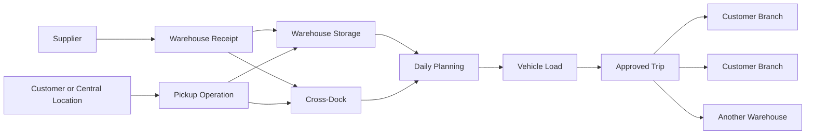
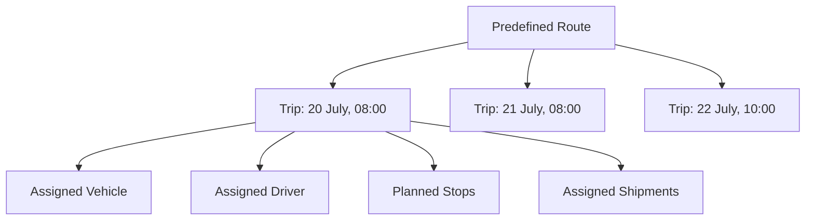
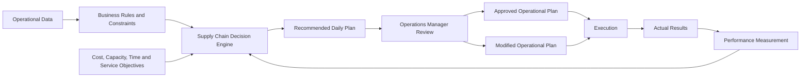

import DocumentInfo from '@site/src/components/DocumentInfo';

# مخطط المنتج

<DocumentInfo
  category="المنتج"
  audience={['تنفيذي', 'أعمال', 'منتج', 'تقني']}
  status="Approved"
  version="1.0"
  owner="فريق المنتج"
  updated="يوليو 2026"
  readingTime="12 دقيقة"
/>

## الملخص التنفيذي

SCOP هي منصة تشغيل لسلسلة التوريد (Supply Chain Operating Platform) مصممة لإدارة وتحسين عمليات المشتريات والتخزين والنقل والتوزيع لسلاسل المطاعم وشركات خدمات الأغذية متعددة الفروع.

تربط المنصة الموردين والمستودعات والمركبات والسائقين والعملاء والفروع ضمن بيئة تشغيلية واحدة منسقة. وتوفر الرؤية الشاملة والتحكم اللازمين لتخطيط الأنشطة اللوجستية اليومية وتنفيذها بكفاءة وقياس نتائجها.

تستخدم SCOP نظام Odoo 17 بوصفه العمود الفقري التشغيلي لها، مع تقديم قدرات مخصصة لإدارة المسارات (Route) وتخطيط الرحلات (Trip) واستغلال الأسطول والعبور المباشر (Cross-Dock) ودمج الشحنات (Shipment) واتخاذ القرارات بمساعدة الذكاء الاصطناعي.

سيدعم الإصدار الأولي من المنتج العمليات الخاضعة للتحكم البشري. ستولّد المنصة التوصيات والخطط المحسّنة، بينما يحتفظ مستخدمو العمليات المخوَّلون بمسؤولية مراجعة تلك الخطط وتعديلها واعتمادها وتنفيذها.

> **مبدأ المنتج:** كل حركة تبدأ بقرار، وكل قرار يبدأ ببيانات موثوقة.

## خلفية الأعمال

تقدم الشركة خدمات المشتريات والتوزيع لسلاسل المطاعم التي تدير فروعًا متعددة.

وقد تشمل مسؤولياتها:

- شراء المنتجات من الموردين المعتمدين
- تجميع المنتجات من الموردين
- استلام البضائع وتخزينها في مستودع واحد أو أكثر
- نقل المخزون بين المستودعات
- دمج المنتجات لأغراض التوزيع
- تجميع المنتجات من العملاء أو من مواقع العملاء المركزية
- إعادة توزيع المنتجات على فروع العملاء
- تنفيذ أنشطة الاستلام (Pickup) والتسليم (Delivery) ضمن الرحلة نفسها
- تنسيق المركبات والسائقين والمسارات والنوافذ الزمنية (Time Window) وأولويات التسليم

تُنشئ هذه الأنشطة سلسلة توريد مترابطة يجب أن تعمل فيها المشتريات والمخزون والتخزين والنقل وخدمة العملاء كنظام واحد.

## تحديات الأعمال

تعالج المنصة عدة تحديات تشغيلية.

### التخطيط المجزأ

قد يجري تخطيط أنشطة المشتريات والمستودعات والنقل بشكل منفصل رغم اعتماد بعضها على بعض.

وقد يؤدي ذلك إلى تأخيرات وازدواجية في العمل ورؤية تشغيلية غير مكتملة.

### استغلال المركبات

تمتلك المركبات سعات مختلفة وظروف توفر متباينة وتكاليف تشغيل متفاوتة.

وقد يؤدي الإسناد اليدوي إلى سعة غير مستغلة أو رحلات غير ضرورية أو اختيار مركبات غير مناسبة.

### متطلبات التوزيع المعقدة

قد تتضمن الرحلة (Trip) الواحدة:

- عملاء متعددين
- فروعًا متعددة
- شحنات متعددة
- عمليات استلام وتسليم
- توقفات (Stop) في المستودعات
- أنشطة العبور المباشر (Cross-Dock)
- نوافذ زمنية إلزامية للتسليم

تجعل هذه القيود التخطيط اليومي صعب التنفيذ باتساق دون دعم لاتخاذ القرار.

### محدودية تتبع القرارات

تحتاج فرق العمليات إلى فهم:

- لماذا جرى اختيار مركبة معينة
- لماذا جرى دمج الشحنات
- لماذا جرى اختيار مسار معين
- لماذا أُعطيت الأولوية لرحلة معينة
- ما القيود التي أثرت في الخطة
- من الذي اعتمد التوصية أو غيّرها

يجب أن تجعل SCOP هذه القرارات مرئية وقابلة للتتبع.

### توسيع نطاق العمليات

مع تزايد أعداد الموردين والعملاء والفروع والمستودعات والمركبات والطلبات، يصبح التخطيط اليدوي أبطأ وأقل موثوقية.

يجب أن تدعم المنصة النمو التشغيلي دون الحاجة إلى زيادة متناسبة مماثلة في جهد التخطيط.

## رؤية المنتج

إنشاء منصة تشغيل ذكية لسلسلة التوريد قائمة على القرارات، تحوّل البيانات اللوجستية المعقدة إلى قرارات تشغيلية منسقة وقابلة للتفسير والقياس.

ينبغي أن تمكّن SCOP الأعمال من إدارة عمليات سلسلة التوريد اليومية عبر منصة واحدة موثوقة، مع زيادة الأتمتة تدريجيًا كلما تحسنت الثقة التشغيلية وجودة البيانات.

## رسالة المنتج

توجد SCOP من أجل:

- ربط عمليات سلسلة التوريد ضمن منصة واحدة
- تحسين الرؤية الشاملة عبر المشتريات والتخزين والتوزيع
- زيادة استغلال الأسطول والسعة الاستيعابية للمركبات
- إنتاج خطط رحلات يومية محسّنة
- دعم التوزيع متعدد العملاء ومتعدد الفروع
- تنسيق أنشطة الاستلام والتسليم
- احترام الأولويات التشغيلية والنوافذ الزمنية للتسليم
- تقديم توصيات قابلة للتفسير بمساعدة الذكاء الاصطناعي
- الحفاظ على التحكم البشري في القرارات التشغيلية المهمة
- إنشاء بيانات موثوقة للتحسين التشغيلي المستمر

## المبادئ الأساسية للمنتج

### الأعمال أولًا

يجب أن تحل كل خاصية حاجة عملية أو تشغيلية محددة.

لا ينبغي للمنصة تقديم وظائف دون غرض واضح ومالك محدد ونتيجة متوقعة.

### بنية قائمة على القرارات

ينبغي التعامل مع الإجراءات التشغيلية بوصفها قرارات مدعومة بالبيانات والقيود والقواعد والأهداف القابلة للقياس.

ومن الأمثلة على ذلك:

- إسناد مركبة
- اختيار مسار (Route)
- إنشاء رحلة (Trip)
- دمج الشحنات
- اختيار مستودع
- اختيار تدفق عبور مباشر (Cross-Dock)
- تحديد أولوية طلب

### ذكاء اصطناعي بإشراف بشري

سيقوم الذكاء الاصطناعي في البداية بالتوصية بالقرارات بدلًا من تنفيذها بشكل مستقل.

يجب أن يتمكن المستخدمون المخوَّلون من:

- مراجعة التوصيات
- فهم منطقها
- تعديل الخطط المقترحة
- اعتماد القرارات أو رفضها
- تقديم ملاحظات تشغيلية

قد تزداد الأتمتة تدريجيًا بعد إثبات جودة القرارات والثقة التشغيلية.

### قابلية التفسير

ينبغي أن توضح كل توصية مهمة العوامل الرئيسية الكامنة وراءها.

لا ينبغي أن تعمل التوصية كنتيجة غير مفسَّرة.

### قابلية التتبع

ينبغي أن تسجل المنصة:

- التوصية المولَّدة
- القواعد والقيود المطبقة
- المستخدم الذي اعتمد التوصية أو عدّلها
- القرار التشغيلي النهائي
- نتيجة التنفيذ
- الفرق بين التوصية والنتيجة النهائية

### التهيئة قبل التخصيص

ينبغي استخدام وظائف Odoo القياسية وقواعد الأعمال القابلة للتهيئة قبل إنشاء برمجيات مخصصة.

ولا ينبغي إدخال التخصيص إلا عندما يوفر قيمة عملية ضرورية لا يمكن تحقيقها بأمان عبر التهيئة.

### عمليات قابلة للقياس

ينبغي أن تعرض كل قدرة تشغيلية رئيسية مؤشرات أداء (KPI) قابلة للقياس.

وينبغي أن تساعد المنصة الأعمال على فهم ما إذا كانت القرارات التشغيلية تحسّن التكلفة والسعة والخدمة وموثوقية التنفيذ.

## أهداف المنتج

ستركز المراحل الأولى من المنتج على الأهداف التالية.

| الهدف | النتيجة المرجوة |
| --- | --- |
| رؤية تشغيلية موحدة | توفير عرض واحد لأنشطة سلسلة التوريد واعتمادياتها |
| تخطيط الرحلات اليومية | توليد خطة يومية منسقة للمراجعة والاعتماد |
| تحسين الأسطول | إسناد المركبات المتاحة المناسبة بناءً على القيود التشغيلية |
| استغلال السعة | تحسين استخدام سعة المركبة من حيث الوزن أو الحجم أو المنصات أو الوحدات |
| التحكم في المسارات والرحلات | الفصل بين المسارات المحددة مسبقًا وتنفيذها التشغيلي المؤرَّخ |
| دمج الشحنات | جمع الشحنات المتوافقة حيثما كان ذلك مفيدًا تشغيليًا |
| الالتزام بالنوافذ الزمنية | تخطيط الوصول والخدمة ضمن النوافذ الزمنية التي يحددها العميل |
| التنفيذ متعدد التوقفات | دعم الرحلات التي تتضمن توقفات استلام وتسليم متعددة |
| دعم العبور المباشر | السماح بمرور البضائع عبر منشأة دون تخزين غير ضروري |
| قابلية تفسير القرارات | إظهار أسباب توليد التوصيات والإسنادات |
| القياس التشغيلي | تتبع جودة الخطط وأداء التنفيذ والتكلفة ومستويات الخدمة |

## نطاق المنتج

### ضمن النطاق

ستغطي SCOP قدرات الأعمال التالية:

- البيانات التشغيلية المتعلقة بالموردين والعملاء
- فروع العملاء ومواقع التسليم
- المستودعات المتعددة
- التحويلات بين المستودعات
- الحركات الواردة المتعلقة بالمشتريات
- إيصالات المستودعات وأوامر التسليم
- رؤية المخزون اللازمة للتخطيط اللوجستي
- إدارة المركبات المملوكة للشركة
- مشاركة السائقين بوصفهم مستخدمين للنظام
- سعة المركبات وتوفرها
- إدارة المسارات المحددة مسبقًا
- إدارة الرحلات المجدولة
- تخطيط الرحلات متعددة التوقفات
- الاستلام والتسليم ضمن الرحلة نفسها
- عملاء أو فروع متعددة ضمن حمولة (Load) مركبة واحدة
- دمج الشحنات والحمولات
- عمليات العبور المباشر (Cross-Dock)
- النوافذ الزمنية لتسليم العملاء
- توصيات التخطيط اليومي
- مراجعة مدير العمليات واعتماده
- التعديل اليدوي للخطط
- قابلية تتبع القرارات
- التقارير التشغيلية ومؤشرات الأداء
- التخطيط والتوصيات بمساعدة الذكاء الاصطناعي

### خارج النطاق الأولي

تقع القدرات التالية خارج الإصدار الأولي للمنتج ما لم تُعتمد عبر مرحلة لاحقة من المشروع:

- الإرسال المستقل بالكامل دون موافقة بشرية
- تطبيق جوال مخصص للسائقين
- التكامل الفوري مع أجهزة التتبع عن بُعد أو أجهزة GPS
- الصيانة التنبؤية المتقدمة للمركبات
- التسعير الديناميكي للعملاء
- وظائف سوق الموردين
- بوابات الخدمة الذاتية الخارجية للعملاء
- المفاوضات الشرائية المؤتمتة بالكامل
- واجهات برمجة تطبيقات عامة لمطوري الطرف الثالث
- الروبوتات المتقدمة أو أتمتة المستودعات

يمكن إدخال هذه العناصر عبر إصدارات مستقبلية دون تغيير الاتجاه الأساسي للمنتج.

## نموذج التشغيل

تنسق SCOP حركة المنتجات من مصدرها إلى وجهتها المطلوبة.

قد تنشأ المنتجات من الموردين أو المستودعات أو العملاء أو مواقع العملاء المركزية. وقد تُخزَّن أو تُنقل أو تمر عبر العبور المباشر أو تُدمج أو تُجمَع أو تُسلَّم وفقًا للمتطلب التشغيلي.

يجب أن يدعم نموذج التشغيل:

1. دخول الطلب (Demand) ومتطلبات الحركة إلى النظام.
2. التحقق من توفر المخزون والشحنات.
3. تجميع الشحنات المرشحة.
4. تقييم المسارات والمركبات والسائقين والسعات والنوافذ الزمنية.
5. توليد خطة رحلات يومية.
6. مراجعة مدير العمليات للخطة وتعديلها.
7. إطلاق الرحلات المعتمدة للتنفيذ.
8. تسجيل نتائج التنفيذ الفعلية.
9. قياس أداء التخطيط والتنفيذ.

## نموذج المسار والرحلة

تميّز SCOP بين المسار (Route) والرحلة (Trip).

| المفهوم | التعريف |
| --- | --- |
| Route | مسار تشغيلي محدد مسبقًا أو تسلسل مواقع قابل لإعادة الاستخدام |
| Trip | تنفيذ مجدول لمسار أو تسلسل مخطط من التوقفات في تاريخ ووقت محددين |
| Stop | موقع تشغيلي واحد تتم زيارته أثناء الرحلة |
| Pickup | نشاط توقف يجري فيه تحميل البضائع |
| Delivery | نشاط توقف يجري فيه تفريغ البضائع |
| Shipment | مجموعة منطقية من البضائع تتطلب النقل |
| Load | الحمولة المادية المسندة إلى مركبة لغرض التنفيذ |

يمكن إعادة استخدام المسار مرات عديدة.

وتمثل كل رحلة تنفيذًا محددًا وتتضمن الموارد المسندة والشحنات والأوقات المخططة والتوقفات والحالة التشغيلية.

## نطاقات الأعمال

تُنظَّم SCOP حول نطاقات أعمال مترابطة.

| النطاق | المسؤولية |
| --- | --- |
| المشتريات | توفير المنتجات والمتطلبات الواردة المتعلقة بالموردين |
| إدارة الطلبات | طلبات العملاء والفروع والحركة الداخلية |
| المستودعات | الاستلام والتخزين والانتقاء والتجهيز والتحويلات والعبور المباشر |
| المخزون | توفر المنتجات وملكيتها وموقعها ورؤية حركتها |
| الأسطول | المركبات المملوكة للشركة وسعتها وتوفرها وحالتها التشغيلية |
| المسارات | المسارات التشغيلية القابلة لإعادة الاستخدام وتسلسلات المواقع |
| الرحلات | تنفيذ النقل المجدول وإدارة التوقفات |
| التخطيط | تنسيق الشحنات والموارد والرحلات اليومية |
| Decision Engine | القرارات التشغيلية القائمة على القواعد والمدعومة بالتحسين |
| AI Platform | قدرات التوصيات والتنبؤات والتفسيرات والتعلم |
| التحليلات | الأداء التشغيلي والخدمة والتكلفة والاستغلال ونتائج القرارات |
| الإدارة | التهيئة والمستخدمون والأدوار والصلاحيات والحوكمة |

ينبغي أن تعمل هذه النطاقات كقدرات مترابطة لا كتطبيقات معزولة.

## محرك قرارات سلسلة التوريد

محرك قرارات سلسلة التوريد (Supply Chain Decision Engine) هو قدرة المنصة المسؤولة عن تحويل البيانات التشغيلية إلى إجراءات موصى بها.

وهو يقيّم:

- متطلبات الشحنات
- توفر المنتجات
- مواقع الاستلام والتسليم
- سعات المركبات
- توفر المركبات
- توفر السائقين
- تعريفات المسارات
- مدة الرحلة
- النوافذ الزمنية للعملاء
- أولوية الطلبات
- قيود تشغيل المستودعات
- فرص العبور المباشر
- متطلبات التحويل بين المستودعات
- أهداف التكلفة التشغيلية والاستغلال

وقد يولّد المحرك توصيات بشأن:

- دمج الشحنات
- إسناد المركبات
- إسناد السائقين
- إنشاء الرحلات
- اختيار المسارات
- ترتيب تسلسل التوقفات
- اختيار المستودعات
- استخدام العبور المباشر
- تحديد أولويات الطلبات
- أوقات المغادرة والوصول المخططة

:::info

في المراحل الأولى من المنتج، تُعد الخطط اليومية المولَّدة توصيات. ويجب أن يقوم مدير عمليات مخوَّل باعتماد الخطة أو تعديلها قبل الإطلاق التشغيلي.

:::

## رؤية الذكاء الاصطناعي

ينبغي أن يحسّن الذكاء الاصطناعي جودة القرارات دون إلغاء المساءلة.

وستتطور قدرة الذكاء الاصطناعي تدريجيًا.

### المرحلة 1 — قرارات مدعومة

توصي المنصة بالإجراءات بناءً على البيانات التشغيلية والقواعد والقيود وأهداف التحسين.

ويحتفظ المستخدمون بصلاحية الاعتماد الكاملة.

### المرحلة 2 — أتمتة موثوقة

قد تنفذ المنصة تلقائيًا القرارات منخفضة المخاطر والمحددة جيدًا عندما تسمح الثقة والقواعد التشغيلية بذلك.

وتظل الاستثناءات بحاجة إلى مراجعة بشرية.

### المرحلة 3 — عمليات تكيفية

تتعلم المنصة من نتائج التنفيذ والملاحظات التشغيلية لتحسين التنبؤ والتخطيط واستغلال الموارد ومعالجة الاستثناءات.

ويجب أن يعتمد الانتقال بين المراحل على الأداء القابل للقياس وجودة البيانات وقابلية التفسير وموافقة الإدارة.

## أدوار المستخدمين

ستدعم المنصة الأولية عدة منظورات تشغيلية.

| الدور | المسؤولية الرئيسية |
| --- | --- |
| مدير العمليات | يراجع الخطط التشغيلية اليومية ويعدلها ويعتمدها ويراقبها |
| المخطط أو المرسل | يجهّز الطلب ويقيّم التوصيات وينسق الرحلات |
| مستخدم المستودع | يعالج الاستلام والانتقاء والتجهيز والتحميل والتحويلات والمرتجعات |
| السائق | يشارك في تنفيذ الرحلات المسندة إليه ويستخدم لاحقًا تطبيق السائقين |
| مستخدم المشتريات | ينسق طلبات الموردين والمتطلبات الواردة |
| مستخدم خدمة العملاء | يراقب طلبات العملاء والفروع والأولويات والتزامات التسليم |
| مسؤول النظام | يدير المستخدمين والصلاحيات والتهيئة وحوكمة المنصة |
| الإدارة | تراجع الأداء والخدمة والاستغلال والتكلفة والمخاطر التشغيلية |

ستُحدَّد حقوق الوصول التفصيلية في المواصفات الوظيفية والأمنية اللاحقة.

## دور Odoo 17

سيكون Odoo 17 العمود الفقري التشغيلي لمنصة SCOP.

ينبغي استخدام قدرات Odoo القياسية حيثما تلبي متطلبات الأعمال، بما في ذلك:

- إدارة المشتريات
- سير العمل المتعلق بالمبيعات والطلبات
- إدارة المخزون
- عمليات المستودعات
- سجلات الأسطول
- وصول المستخدمين والصلاحيات
- المستندات التشغيلية
- أسس إعداد التقارير
- خدمات التكامل

وستوسّع قدرات SCOP المخصصة نظام Odoo عند الضرورة من أجل:

- الإدارة المتقدمة للمسارات والرحلات
- تخطيط النقل متعدد التوقفات
- تحسين سعة المركبات
- دمج الشحنات
- التخطيط التشغيلي عبر النطاقات
- قابلية تتبع القرارات
- التوصيات بمساعدة الذكاء الاصطناعي
- نتائج تخطيط قابلة للتفسير
- قدرات الإرسال المؤتمت المستقبلية

ينبغي أن تظل SCOP منصة متكاملة قائمة على Odoo لا مجموعة من الأنظمة الخارجية المنفصلة.

## مقاييس النجاح

سيجري تقييم المنتج باستخدام مقاييس الأعمال والمقاييس التشغيلية.

| المجال | أمثلة على المقاييس |
| --- | --- |
| استغلال الأسطول | معدل استخدام المركبات، السعة المحمّلة، السعة الفارغة، عدد الرحلات لكل مركبة |
| كفاءة التخطيط | وقت التخطيط، التغييرات اليدوية، معدل قبول التوصيات |
| أداء الخدمة | الاستلام في الموعد، التسليم في الموعد، الالتزام بالنوافذ الزمنية |
| كفاءة الرحلات | عدد التوقفات لكل رحلة، المسافة لكل تسليم، المدة، المسير الفارغ |
| تنسيق المستودعات | جاهزية التجهيز، تأخيرات التحميل، إتمام التحويلات |
| دمج الشحنات | عدد الشحنات لكل رحلة، عدد الطلبات لكل حمولة، معدل الدمج |
| ضبط التكاليف | التكلفة لكل رحلة أو تسليم أو كيلومتر أو عميل أو وحدة |
| جودة القرارات | معدل اعتماد التوصيات، معدل التجاوز، أداء النتائج |
| موثوقية التنفيذ | الرحلات المكتملة، التوقفات الفاشلة، المرتجعات، التأخيرات، الاستثناءات |
| جودة البيانات | البيانات المفقودة، القيود غير الصالحة، سجلات التنفيذ غير المكتملة |

ستُحدَّد الأهداف الدقيقة ومعادلات الحساب أثناء أنشطة بنية الأعمال والمواصفات الوظيفية.

## خارطة طريق المنتج

### الإصدار 1 — الأساس التشغيلي

- التكامل التشغيلي مع Odoo 17
- دعم المستودعات المتعددة
- سجلات الأسطول والسائقين
- إدارة المسارات والرحلات
- توقفات الاستلام والتسليم
- قيود سعة المركبات
- النوافذ الزمنية للعملاء
- تخطيط الرحلات اليومية الموصى بها
- اعتماد مدير العمليات
- التعديل اليدوي للخطط
- التقارير التشغيلية الأساسية

### الإصدار 2 — التحسين والرؤية

- الدمج المتقدم للشحنات
- تحسين المسارات والتوقفات
- توصيات العبور المباشر
- التحسين بين المستودعات
- حساب محسّن للوقت المتوقع للوصول (ETA)
- تحليل التكلفة والاستغلال
- تفسير القرارات
- مقارنة التوصيات
- مراقبة الاستثناءات

### الإصدار 3 — الأتمتة الذكية

- قرارات مؤتمتة قائمة على الثقة
- تخطيط تكيفي قائم على نتائج التنفيذ
- التنبؤ بمتطلبات الطلب والسعة
- استجابة مؤتمتة للاستثناءات في السيناريوهات المعتمدة
- تطبيق جوال للسائقين
- مراقبة المواقع والرحلات في الوقت الفعلي
- تحليلات تشغيلية تنبؤية متقدمة

تصف خارطة الطريق اتجاه المنتج وقد تتغير وفقًا لأولويات الأعمال ونتائج التنفيذ وقرارات المشروع المعتمدة.

## حدود المنتج

تتولى SCOP مسؤولية تنسيق عمليات سلسلة التوريد وتحسينها.

وهي غير مصممة لتحل محل ملكية الأعمال أو مساءلة الإدارة.

ستقوم المنصة بما يلي:

- توفير بيانات تشغيلية موثوقة
- تطبيق قواعد الأعمال المعتمدة
- توليد التوصيات
- إبراز المخاطر والاستثناءات
- تسجيل القرارات والنتائج
- دعم التحسين القابل للقياس

ويظل المستخدمون المخوَّلون مسؤولين عن الاعتمادات والتجاوزات وقرارات السياسات والمواقف التشغيلية الاستثنائية.

## الخلاصة

توفر SCOP منصة تشغيل موحدة لأنشطة المشتريات والتخزين والأسطول والمسارات والرحلات والتوزيع.

وتجمع بنيتها بين القدرات التشغيلية لنظام Odoo 17 والتخطيط اللوجستي المتخصص وطبقة ذكاء قائمة على القرارات.

ستعطي الإصدارات الأولى الأولوية للرؤية الشاملة والعمليات المنظمة والتوصيات المحسّنة والموافقة البشرية والنتائج القابلة للقياس. وقد تُدخل الإصدارات المستقبلية أتمتة متزايدة كلما اكتسبت المنصة الثقة التشغيلية.

## صفحات ذات صلة

- [نظام تصميم التوثيق](../getting-started/documentation-design-system.mdx)
- بنية الأعمال
- نموذج التشغيل
- نطاقات الأعمال
- محرك قرارات سلسلة التوريد
