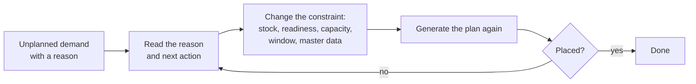

import DocumentInfo from '@site/src/components/DocumentInfo';
import Screenshot from '@site/src/components/Screenshot';

# الطلب غير المخطط

<DocumentInfo
  category="البدء السريع"
  audience={['تخطيط', 'عمليات', 'اختبار قبول المستخدم']}
  status="Review"
  version="1.0"
  owner="فريق المنتج"
  updated="أغسطس 2026"
  readingTime="4 دقائق"
/>

## المبدأ

:::info[الطلب الذي لا يمكن تخطيطه لا يجوز أن يختفي بصمت]

إذا لم تستطع SCOP إدراج طلب في الخطة، فهي لا تُسقطه ولا تفشل بصمت، بل تسجّل الطلب و**السبب** و**ما ينبغي فعله بشأنه**.

فالمُشغِّل الذي يُخبَر بأن شيئاً فشل فقط عليه أن يستنتج الحل بنفسه، أما الذي يُخبَر بالسبب وبالإجراء التالي المقترح فيستطيع أن يتصرف.

:::

## أين تنظر

**الدور**
المخطِّط / المُوزِّع

**انتقل إلى**
`SCOP → Planning → Unplanned Demand`

<Screenshot
  src="quick-start/17-unplanned-demand.png"
  alt="قائمة الطلب غير المخطط في SCOP وهي فارغة لأن كل طلب في الجولة تم تخطيطه."
  caption="الفراغ هو النتيجة الجيدة — فقد أُدرِج كل طلب مؤهل في الجولة. وعندما لا تكون فارغة، يذكر كل صف طلباً وسبباً وإجراءً تالياً."
/>

يمكنك أيضاً فتح تبويب **Unplanned Demand** في الخطة اليومية نفسها، وهو يُظهر ما لم تستطع تلك الخطة تحديداً إدراجه.

## ماذا يخبرك كل صف

| العمود | المعنى |
| --- | --- |
| **Demand** | الطلب الذي لم يُدرَج |
| **Plan** / **Plan Date** | الخطة ويوم التشغيل الذي نُظر فيه للطلب |
| **Reason** | سبب تعذّر إدراجه |
| **Next Action** | الإجراء التالي المقترح |
| **Detail** | كلمات المزوّد نفسه — أي مركبة، أي نافذة زمنية، أي قيد |
| **Partner** | العميل المتأثر، فتظهر مخاطر الخدمة فوراً |

## الأسباب التي تستطيع SCOP ذكرها

هذه قيم محكومة لا نصوص حرة:

| السبب | المعنى |
| --- | --- |
| No available inventory | البضائع غير موجودة لتُنقَل |
| Warehouse not ready | الجاهزية غير قابلة للتخطيط |
| No feasible vehicle | لا مركبة تستطيع حمله ضمن قيودها |
| No qualified driver | لا سائق متاح يحمل التأهيل المطلوب |
| Capacity shortage | إجمالي الطلب يتجاوز الأسطول المعروض لذلك اليوم |
| Time-window conflict | لا يمكن الوفاء بنافذة التسليم مع بقية المسار |
| Product incompatibility | لا يجوز للبضائع أن تُنقل مع ما هو محمَّل أصلاً |
| Route restriction | قيد مسار أو وصول يستبعده |
| Missing required data | بيانات يحتاجها المحرك غير موجودة |
| Customer location unavailable | الوجهة مغلقة أو غير قابلة للاستخدام في ذلك اليوم |
| Planning horizon exceeded | التاريخ المطلوب خارج أفق التخطيط |
| Lower priority than available capacity permits | خسر أمام طلب ذي أولوية أعلى |

## الإجراءات التالية التي تستطيع SCOP اقتراحها

| الإجراء التالي | ما ستفعله |
| --- | --- |
| Replan for another date | انقله إلى يوم فيه طاقة استيعابية |
| Use another warehouse | وفّره من عقدة تستطيع خدمته |
| Split the shipment | سلّم ما يمكن الآن والباقي لاحقاً |
| Request additional capacity | أضف مركبة أو وردية |
| Resolve missing data | أصلح البيانات الأساسية التي احتاجها المحرك |
| Change the time window with authorisation | أعد التفاوض على النافذة الزمنية باعتماد |
| Perform an inter-warehouse transfer | انقل المخزون إلى العقدة التي ستشحنه |

## ما تفعله بشأنه

:::warning[لا تُعِد توليد الخطة فقط]

إعادة توليد الخطة دون تغيير أي شيء تُنتج الجواب نفسه، لأن المزوّد الأساسي حتمي قابل للتكرار. فالسبب هو بند العمل الحقيقي.

:::

الحلقة الصحيحة هي:

أمثلة عملية:

| السبب | كيف تعالجه |
| --- | --- |
| Warehouse not ready | جهّز البضائع — [الشحنة والجاهزية](../walkthrough/shipment-and-readiness.mdx) |
| No available inventory | تحقّق من المخزون والحجز في Odoo |
| Capacity shortage | أضف مركبة للتاريخ في `SCOP → Master Data → Vehicle Availability` |
| No qualified driver | تحقّق من `SCOP → Master Data → Driver Qualifications` بحثاً عن انتهاء صلاحية |
| Missing required data | غالباً موقع بلا إحداثيات أو بلا منطقة زمنية أو بلا ساعات عمل |

## قياسه

تقريران يحوّلان هذه الشاشة من إزعاج يومي إلى اتجاه قابل للتحليل:

- **تغطية الخطة** — هل خطّطنا كل ما كان قابلاً للتخطيط؟
- **الطلب غير المخطط** — ما الذي منع التخطيط، مجموعاً بالسبب، فيظهر القيد الأكثر إضراراً بالخدمة.

وكلاهما موضَّح في [التقارير التي ينبغي أن تعرفها](../reports-you-should-know.mdx).

## صفحات ذات صلة

- [توليد الخطة](../walkthrough/generate-the-plan.mdx)
- [التسليم الفاشل](./failed-delivery.mdx)
- [التقارير التي ينبغي أن تعرفها](../reports-you-should-know.mdx)
