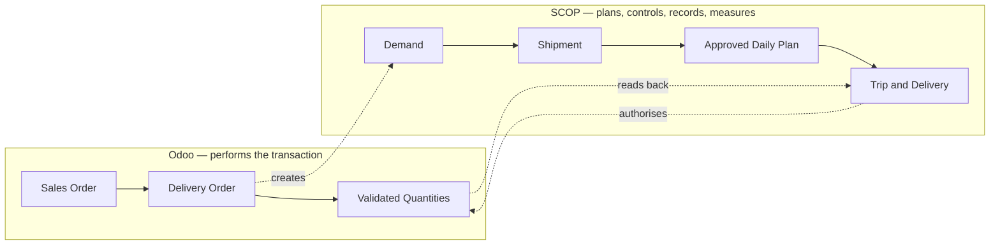

import DocumentInfo from '@site/src/components/DocumentInfo';

# دليل البدء السريع لمنصة SCOP

<DocumentInfo
  category="البدء السريع"
  audience={['أعمال', 'عمليات', 'مستودعات', 'تخطيط', 'اختبار قبول المستخدم']}
  status="Review"
  version="1.0"
  owner="فريق المنتج"
  updated="أغسطس 2026"
  readingTime="دقيقتان"
/>

## ما هي SCOP

SCOP — منصة تشغيل سلسلة الإمداد (Supply Chain Operating Platform) — هي الطبقة التي **تُخطِّط وتضبط وتُسجِّل وتقيس** حركة البضائع.

هي لا تنقل البضائع؛ نظام Odoo هو من يفعل ذلك. تحدد SCOP الحركات التي ينبغي أن تحدث اليوم، وتتحقق من أنها مسموحة وممكنة، وتسجّل ما حدث فعلاً، وتقيس النتيجة.

## المشكلة التي تحلها

بدون SCOP، يُبنى يوم التشغيل يدوياً: يوازن شخص ما بين التزامات العملاء والمخزون وجاهزية المستودع والمركبات والسائقين والمسارات، موزّعة بين جداول بيانات ومكالمات هاتفية. تعيش الخطة في ذاكرة شخص واحد، ولا يستطيع أحد تفسير قرار بعد أسبوع، وتُكتشف المشكلات أثناء التسليم بدلاً من قبل الانطلاق.

تستبدل SCOP ذلك بدورة يومية واحدة منسّقة، تُخطَّط فيها كل حركة وتُعتمد من شخص مخوّل وتُنفَّذ وتُقاس.

## علاقة SCOP بنظام Odoo

هذه هي الفكرة الأهم في الدليل بأكمله:

:::info[‏Odoo يقود. وSCOP يستمع.]

**نظام Odoo هو من ينفّذ معاملة المستودع.** أمر التسليم، والحجز، والانتقاء، والكميات المُعتمدة — كل ذلك يبقى تماماً كما هو اليوم.

**وSCOP يُخطِّط ويضبط ويُسجِّل ويقيس العملية المحيطة بها.** فيضيف الجاهزية والتخطيط والاعتماد ورؤية التنفيذ والحوكمة والقياس.

:::

عملك الحالي في Odoo لا يتغير. فعندما يؤكّد مندوب البيع أمر بيع، يُنشئ Odoo أمر التسليم كما كان يفعل دائماً، ثم تلاحظ SCOP ذلك وتُنشئ سجلها الخاص لـ *ما يجب أن يتحرك* حتى تستطيع تخطيطه.

نتيجتان تستحقان التذكّر من البداية:

- **الكميات تأتي دائماً من تحويل Odoo.** يُسجَّل النقص في التسليم في Odoo، ولا يُكتب أبداً في SCOP؛ فـ SCOP يقرأها منه.
- **سترفض SCOP تخطيط حركة لا تستطيع تبريرها.** وهذه ميزة لا عيب: فحيث ترفض، تذكر السجل والسبب بالاسم.

## ما ستتعلمه

بنهاية هذا الدليل ستكون قد أخذت **عملية تسليم واحدة لعميل عبر الدورة الكاملة**، وستكون قادراً على:

| ما ستتمكن منه | موضعه في الدليل |
| --- | --- |
| قراءة دورة التشغيل من البداية إلى النهاية | [العملية في نظرة واحدة](./process-at-a-glance.mdx) |
| معرفة دور كل جهة، ولماذا يُفصل الاعتماد | [الأدوار والمسؤوليات](./roles-and-responsibilities.mdx) |
| تنفيذ عملية تسليم واحدة من الأمر حتى الإتمام | [جولة تنفيذ تسليم لعميل](./walkthrough/create-the-order.mdx) |
| فهم سبب رفض SCOP المتابعة أحياناً | [عندما تسير الأمور خلاف الخطة](./exceptions/unplanned-demand.mdx) |
| الوصول إلى التقارير الستة التي يحتاجها المستخدم الجديد | [التقارير التي ينبغي أن تعرفها](./reports-you-should-know.mdx) |
| اختبار المنصة بنفسك في 15 خطوة | [قائمة اختبار من البداية إلى النهاية](./end-to-end-test-checklist.mdx) |
| التمييز بين قدرات اليوم وخطط الغد | [حدود الإصدار الأول](./release-1-boundaries.mdx) |

## ما لا يقدّمه هذا الدليل

هذا دليل بدء سريع وجولة تشغيلية، وليس دليل المستخدم الكامل لـ SCOP. فهو يأخذك عبر دورة **واحدة** ناجحة، ولا يشرح كل حقل ولا كل عمود في التقارير ولا كل خيار إعداد.

للتعريف المؤسسي الذي تقوم عليه المنصة، راجع [المخطط التنفيذي](../getting-started/executive-blueprint.mdx) و[نموذج تشغيل سلسلة الإمداد](../operations/supply-chain-operating-model.mdx).

## قبل أن تبدأ

ستحتاج إلى:

- حساب مستخدم في SCOP مع دور مُسنَد — راجع [الأدوار والمسؤوليات](./roles-and-responsibilities.mdx).
- **حساب مستخدم ثانٍ** لاعتماد الخطة. فمن يُنشئ الخطة لا يستطيع اعتمادها، ولذلك لا يمكن لمختبِر واحد إتمام الدورة بمفرده.
- مستودع داخل نطاق التشغيل التجريبي (Pilot Scope)؛ فـ SCOP لا تُنشئ سجلات إلا للعمليات التي فعّلها سجل نطاق تجريبي.

:::warning[بعض أدوار SCOP تحتاج كذلك إلى صلاحيات Odoo]

‏SCOP طبقة فوق Odoo، فالدور الذي يؤدي عمل Odoo نفسه يحتاج مجموعات Odoo نفسها: **‏Fleet / Administrator** و**‏Employees / Officer** للمخطِّطين، لأن معالج التخطيط يقرأ المركبات وإسناد السائق يقرأ سجلات الموظفين، و**‏Inventory / User** لمن يعتمد التحويلات. راجع [الأدوار والمسؤوليات](./roles-and-responsibilities.mdx).

أما مجرّد *قراءة* شاشة في SCOP فلا تتطلبها.

:::

## المصطلحات

يستخدم الدليل مصطلحاً واحداً لكل مفهوم في كل صفحاته. والمصطلح العربي المعتمد هو المذكور في هذا الجدول.

| المصطلح | المعنى في سطر واحد |
| --- | --- |
| الطلب (Demand) | ما يجب أن يتحرك |
| الشحنة (Shipment) | الوحدة القابلة للتخطيط |
| جاهزية المستودع (Warehouse Readiness) | هل يمكن للبضائع أن تتحرك فعلاً، ولماذا |
| دورة التخطيط (Planning Run) | محاولة واحدة لبناء خطة، بمدخلاتها وجوابها محفوظين |
| الخطة اليومية (Daily Plan) | خطة التشغيل المقترحة ليوم واحد |
| الرحلة (Trip) | مركبة واحدة وسائق ينفّذان سلسلة محطات |
| المحطة (Stop) | موقع واحد تزوره الرحلة |
| مهمة التحميل (Loading Task) | عمل المستودع لتحميل الشحنة على المركبة |
| الطلب غير المخطط (Unplanned Demand) | طلب لم تستطع الدورة إدراجه، مع السبب |
| التزام الخدمة (Service Commitment) | ما وُعِد به العميل |
| التزام المورّد (Supplier Commitment) | ما وعدنا به المورّد |
| الملكية (Ownership) | من يملك البضائع التي تُنقل |
| الاستثناء التشغيلي (Exception) | مشكلة تشغيلية مُسجَّلة تحتاج معالجة |
| تغطية الخطة (Plan Coverage) | هل خطّطنا كل ما كان قابلاً للتخطيط؟ |
| ‏OTIF | التسليم في الوقت وبالكامل |
| جودة القرار (Decision Quality) | مدى تكرار قبول التوصية أو تجاوزها |

## صفحات ذات صلة

- [المخطط التنفيذي](../getting-started/executive-blueprint.mdx)
- [نموذج تشغيل سلسلة الإمداد](../operations/supply-chain-operating-model.mdx)
- [قواعد الأعمال](../business/business-rules.mdx)
