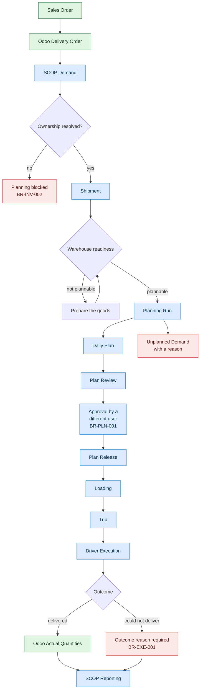

import DocumentInfo from '@site/src/components/DocumentInfo';

# العملية في نظرة واحدة

<DocumentInfo
  category="البدء السريع"
  audience={['أعمال', 'عمليات', 'مستودعات', 'تخطيط', 'اختبار قبول المستخدم']}
  status="Review"
  version="1.0"
  owner="فريق المنتج"
  updated="أغسطس 2026"
  readingTime="4 دقائق"
/>

## الدورة

تمر عملية تسليم واحدة لعميل بهذا التسلسل. الأخضر هو Odoo وهو ينفّذ المعاملة، والأزرق هو SCOP وهي تُخطِّط وتضبط وتقيس.

اقرأ المخطط في ثلاث حركات:

1. **شيء يجب أن يتحرك.** يتحوّل أمر البيع إلى أمر تسليم، وتُسجِّل SCOP طلباً (Demand).
2. **هل يمكن أن يتحرك، وهل ينبغي أن يتحرك اليوم؟** تُفحص الملكية والجاهزية، ثم تُقترح خطة وتُراجَع وتُعتمد من شخص غير مُعِدّها ويُفرَج عنها.
3. **ما الذي حدث فعلاً؟** يسجّل السائق النتيجة، ويسجّل Odoo الكميات، وتقيس SCOP الفرق.

## الكائنات الرئيسية

### الطلب — Demand

**ما يجب أن يتحرك.**

الطلب ليس هو نفسه تحويل Odoo، وذلك بقصد. فقد يحتاج طلب واحد إلى عدة تحويلات لتلبيته، وقد يخدم تحويل واحد عدة طلبات. والأمر المتأخر (Backorder) هو تلبية أخرى **للطلب نفسه**، وليس طلباً جديداً.

هذا الفصل هو ما يمكّن SCOP من الإجابة عن سؤال «هل حصل العميل على ما وعدناه به؟» لا عن سؤال «هل عُولج هذا المستند؟» فقط.

### الشحنة — Shipment

**الوحدة القابلة للتخطيط.**

الطلب يقول ما يجب أن يتحرك، والشحنة تجمعه في شيء يمكن إسناد مركبة إليه: بوزن، وحجم، ونقطة انطلاق، ونقطة وصول.

### جاهزية المستودع — Warehouse Readiness

**هل يمكن للبضائع أن تتحرك فعلاً، ولماذا.**

تُحسب الجاهزية من الأدلة — هل المخزون محجوز، هل جُهِّز، هل الملكية محسومة — ولا تُكتب يدوياً أبداً. وهي تحمل دائماً تفسيرها بالكلمات.

| الجاهزية | المعنى | قابلة للتخطيط؟ |
| --- | --- | --- |
| جاهز (Ready) | كل شيء مُجهَّز في منطقة التجهيز | نعم |
| جاهز مشروطاً (Conditionally Ready) | محجوز، ويُتوقع توفره قبل التنفيذ | نعم |
| جاهز جزئياً (Partially Ready) | لا يمكن تغطية إلا جزء من الشحنة | لا |
| غير جاهز (Not Ready) | البضائع غير مُجهَّزة | لا |
| محجوب (Blocked) | يجب إصلاح شيء أولاً، مثل ملكية غير محسومة | لا |

يستطيع مشرف واقف في المستودع تجاوز القيمة المحسوبة، ويُسجَّل التجاوز مع مَن قام به ومتى ولماذا، ويُعرض **بجوار** القيمة المحسوبة لا بديلاً عنها.

### دورة التخطيط — Planning Run

**محاولة واحدة لبناء خطة.**

تحتفظ الدورة بمدخلاتها وجوابها والزمن الذي استغرقته، حتى تبقى الخطة قابلة للتفسير بعد أشهر.

### الخطة اليومية — Daily Plan

**خطة التشغيل المقترحة ليوم واحد.**

تحتوي على الرحلات الموصى بها والطلب الذي لم يُمكن إدراجه. ودورة حياتها هي: `Generated → Under Review → Approved → Released` (مُولَّدة ← تحت المراجعة ← معتمدة ← مُفرَج عنها).

### الرحلة — Trip

**مركبة واحدة وسائق ينفّذان سلسلة محطات.**

### المحطة — Stop

**موقع واحد تزوره الرحلة** — استلام من مستودع أو تسليم لعميل. وتسجّل المحطة وقت وصول السائق، وما حدث، وإثبات التسليم.

### الاستثناء التشغيلي — Exception

**مشكلة تشغيلية مُسجَّلة** تحتاج تحقيقاً أو معالجة، لها مالك وساعة تقادُم.

## حيث ستمنعك SCOP

صُمِّمت SCOP لترفض بدلاً من أن تخمّن. وتظهر في هذا الدليل ثلاث حالات رفض، جميعها مُبرهنة على النظام الفعلي:

| القاعدة | ما تمنعه | موضع لقائك بها |
| --- | --- | --- |
| `BR-INV-002` | تخطيط حركة لا تستطيع SCOP إثبات مالكها | [الطلب والملكية](./walkthrough/demand-and-ownership.mdx) |
| `BR-PLN-001` | اعتماد مُعِدّ الخطة لخطته بنفسه | [المراجعة والاعتماد](./walkthrough/review-and-approve.mdx) |
| `BR-EXE-001` | إغلاق تسليم فاشل أو ناقص دون بيان السبب | [التسليم الفاشل](./exceptions/failed-delivery.mdx) |

## صفحات ذات صلة

- [نظرة عامة](./overview.mdx)
- [الأدوار والمسؤوليات](./roles-and-responsibilities.mdx)
- [كائنات الأعمال](../business/business-objects.mdx)
- [قواعد الأعمال](../business/business-rules.mdx)
