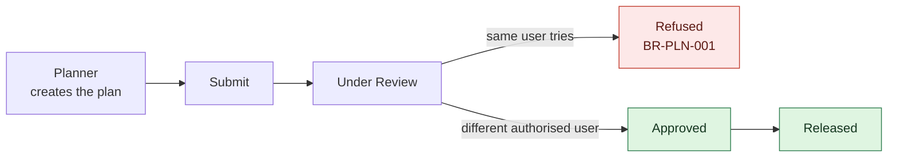

import DocumentInfo from '@site/src/components/DocumentInfo';

# الأدوار والمسؤوليات

<DocumentInfo
  category="البدء السريع"
  audience={['أعمال', 'عمليات', 'مستودعات', 'تخطيط', 'اختبار قبول المستخدم']}
  status="Review"
  version="1.0"
  owner="فريق المنتج"
  updated="أغسطس 2026"
  readingTime="4 دقائق"
/>

## من يفعل ماذا

| الدور | المسؤولية الرئيسية |
| --- | --- |
| المبيعات / خدمة العملاء | إنشاء أمر العميل وتسجيل ما تم الالتزام به |
| المستودع | تسجيل ملكية المخزون، وتجهيز البضائع وتهيئتها، وتنفيذ مهام التحميل، واعتماد أمر التسليم في Odoo |
| المخطِّط / المُوزِّع | دفع الطلب حتى التأهيل، وتوليد الخطة اليومية ومراجعتها، و**إسناد السائق**، وتقديمها، ومعالجة الطلب غير المخطط |
| مدير العمليات | مراجعة الخطة واعتمادها والإفراج عنها |
| السائق | الانطلاق والوصول والتنزيل وتأكيد النتيجة — لرحلاته هو فقط |
| المشتريات | إدارة التزامات الموردين الواردة |
| الإدارة | مراجعة مؤشرات الأداء والأداء التشغيلي |

## مجموعات الأدوار في النظام

تشتمل SCOP على تسع مجموعات أدوار، تجدها في سجل المستخدم تحت قسم **SCOP**.

| مجموعة SCOP | من يحملها عادةً | أبرز الصلاحيات |
| --- | --- | --- |
| SCOP User | كل من يقرأ بيانات SCOP | قراءة الطلبات والشحنات والرحلات |
| Warehouse User | موظفو المستودع | جاهزية المستودع، مهام التحميل، التجهيز |
| Planner / Dispatcher | المخطِّطون والمُوزِّعون | توليد الخطط ومراجعتها وتعديلها، والطلب غير المخطط |
| Operations Manager | إدارة العمليات | تشمل صلاحيات المخطِّط **و**مستخدم المستودع |
| Driver | السائقون | رحلاتهم ومحطاتهم فقط، عبر قائمة **My Work** |
| Procurement User | المشترون | التزامات الموردين |
| Customer Service User | خدمة العملاء | التزامات الخدمة |
| Finance User | المالية | أرقام تشغيلية للقراءة فقط |
| Management | الإدارة | لوحة المعلومات والتقارير |
| Administrator | مسؤولو النظام | تشمل مدير العمليات والإدارة |

:::warning[مجموعة SCOP لا تمنح صلاحيات Odoo الأساسية]

شاشات SCOP تقرأ سجلات Odoo، لذلك يحتاج المستخدمون التشغيليون إلى مجموعات Odoo المقابلة أيضاً:

| دور SCOP | يحتاج كذلك إلى |
| --- | --- |
| أي دور تشغيلي في SCOP | **Inventory → User** |
| Planner / Dispatcher وOperations Manager | **Fleet → Administrator** |
| Planner / Dispatcher | **Employees → Officer** — لأن إسناد السائق يقرأ سجلات الموظفين؛ وبدونها يظل حقل **Driver** يدور على *Loading…* ولا يعرض أحداً |
| Planner / Dispatcher | **Sales → User: All Documents** — لازمة حالياً لفتح طلب ناشئ عن أمر بيع |

ولم تعد قراءة شاشة في SCOP تتطلب صلاحيات المخزون: فالكميات المسلَّمة سجلٌّ يخصّ Odoo وSCOP تعكسه فحسب، لذا يقرأ نموذج الطلب وشاشة محطة السائق تلك الكميات نيابةً عن السجل.

ولاحظ أن صلاحية *Fleet → User* في Odoo لا تكفي المخطِّط: فهي تحصره في المركبات التي يقودها بنفسه، فيرى معالج التخطيط قائمة فارغة. المطلوب هو **Fleet → Administrator**. أما السائق فلا يحتاج شيئاً من ذلك عمداً — إذ لا يجوز أن يقرأ كل تحويلات الشركة.

:::

## فصل المهام

هذه **قاعدة نظام، لا إجراء تنظيمي**:

:::danger[من يُنشئ الخطة لا يستطيع اعتمادها]

`BR-PLN-001` — لا يجوز لمُعِدّ الخطة اليومية اعتمادها ولا الإفراج عنها. وترفض SCOP الإجراء وتوضّح السبب.

ويعلو هذا الرفض على صلاحيات المسؤول (Administrator). فالمسؤول الذي يُنشئ خطة يُرفض أيضاً، لأن جوهر فصل المهام هو ألّا يجمع شخص واحد بين الإنشاء والاعتماد — والمسؤول شخص واحد.

:::

عملياً، هذا يعني:

- **لا يستطيع** مختبِر واحد إتمام الدورة بمفرده؛ فأنت بحاجة إلى حسابين.
- يجب أن يكون المُعتمِد مستخدماً آخر مخوّلاً.

:::note[الانطلاق فعل السائق]

يُسوّي المستودع مهام التحميل، وهو ما يجعل الرحلة **Ready to Depart**، لكنه لا يُنطلق بالرحلة. فالسائق هو من يضغط **Depart** من `My Work → My Trips`، وهذا ما ينقل الشحنة والطلب إلى التنفيذ.

ويستطيع مخطِّط أو مدير عمليات الانطلاق بالرحلة كإجراء احتياطي حين يسمح نموذج التشغيل المعتمد بذلك — لسائق بلا جهاز مثلاً — لكنه بديل احتياطي لا المسار الطبيعي.

:::
- لا يمكن التحايل على الرفض بمنح نفسك صلاحيات أكثر.

وستُجرِّب الحالتين على النظام الفعلي في [المراجعة والاعتماد](./walkthrough/review-and-approve.mdx).

## أي دور يفتح أي قائمة

| القائمة | الأدوار التي تراها |
| --- | --- |
| `SCOP → Operations → Demands` | SCOP User وما فوقه |
| `SCOP → Operations → Shipments` | SCOP User وما فوقه |
| `SCOP → Operations → Warehouse Readiness` | Warehouse User |
| `SCOP → Operations → Loading Tasks` | Warehouse User |
| `SCOP → Operations → Exceptions` | SCOP User وما فوقه |
| `SCOP → Planning → …` | Planner / Dispatcher |
| `SCOP → My Work → My Trips` و`My Stops` | Driver |
| `SCOP → Reporting → …` | SCOP User، وبعض التقارير للمخطِّط فقط |
| `SCOP → Master Data → …` | SCOP User، وبعض المدخلات للمسؤول فقط |
| `SCOP → Governance → …` | SCOP User، وبعض المدخلات للمسؤول فقط |
| `SCOP → Technical → …` | Administrator |

:::info

إخفاء القائمة عرضٌ فقط ولا يُعدّ تحكماً في الوصول. فـ SCOP تفرض الصلاحيات على السجلات نفسها، حتى لا يكون إخفاء قائمة هو الحائل الوحيد بين دور وبياناته.

:::

## صفحات ذات صلة

- [العملية في نظرة واحدة](./process-at-a-glance.mdx)
- [المراجعة والاعتماد](./walkthrough/review-and-approve.mdx)
- [قواعد الأعمال](../business/business-rules.mdx)
